# Bataille de Lorraine (20 - 22 août 1914)

Conformément au plan XVII, les Ie et IIe armées françaises attaquent en Lorraine. Le secteur est tenu par les VIe et VIIe armées sous le commandement du kronprinz de Bavière.
Les Allemands avaient soigneusement quadrillé le terrain et placé des poteaux pour le réglage de l’artillerie. Les Français attaquent à découvert des positions fortifiées et subissent de lourdes pertes. Passant outre l’avis de Moltke, Rupprecht décide de contre-attaquer avant que les armées françaises se soient suffisamment enfoncées dans le piège.
Dubail et Castelnau réussissent à dégager leurs armées.

### Le terrain

**[Frontière de 1871](../img/frontiere_1871.jpg)**

Le terrain où se développe la bataille est un plateau largement ondulé d’où émergent des hauteurs boisées : les hauteurs en arc de cercle dominant Sarrebourg ; plus à l’ouest, les côtes de Dieuze, les collines entre Château-Salins et Morhange et enfin la côte de Delme.

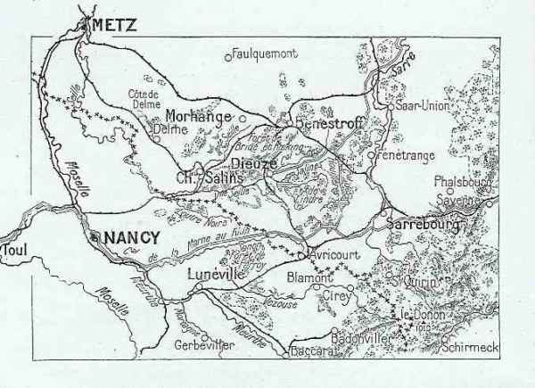
_Terrain de la bataille_
_C Michelin d’après guide édition 1919 -autorisation 06-B-05_

Entre Dieuze et Sarrebourg, la plaine comprend de nombreux étangs. Le plus important est celui de Lindre à l’est de Dieuze.

Trois canaux ont été creusés : celui des Salines, celui des Houillères et celui de la Marne au Rhin. Ce dernier se dirige vers le nord, presque parallèlement à la Sarre pour y aboutir à Sarreguemines.

La ligne de chemin de fer Strasbourg - Metz passe par les gares de Sarrebourg et de Benestroff, nœuds importants de communication.

La Seille coule vers l’ouest. La Sarre qui prend sa source au Donon, coule vers le nord.

Au sud de cette région, la Lorraine restée française présente l’aspect d’un plateau ondulé, où les cours d’eau se dirigent généralement du sud-est vers le nord-est. Ce plateau est traversé par deux lignes de hauteurs qui vont du sud-est au nord-ouest : entre Mortagne et Moselle, les collines de Saffais et Belchamps ; à l’est de Nancy, le Grand Couronné qui comprend le Mont Amance, le Mont Toulon et le Mont Sainte-Geneviève.

### Les défenses allemandes

Les crêtes vers Morhange et Sarrebourg ont été organisées en grand secret dès le 1e août : tranchées bétonnées précédées de réseaux de fil de fer et semées de mitrailleuses. En arrière, des batteries lourdes d’artillerie ont été installées, abritées sous du béton. Le terrain a été quadrillé (l’armée allemande avait eu le temps depuis 1871 de tout repérer). Dans ses mémoires, Foch mentionne la présence de pylônes qui sont en fait des repères pour le tir d’artillerie. Lors de l’offensive française, il sera extrêmement dangereux pour une troupe de se trouver à proximité d’un de ces pylônes.

Les points de résistance sont : les collines de Donnelay et Juvelize, celles au nord de Vic-sur-Seille et Château-Salins et celles de Jallancourt et Malancourt. Dans la direction de Sarrebourg, les hauteurs sur le front Mittersheim - Gosselming - Réding ont été fortifiées. Au sud, des inondations ont été tendues dans la vallée de la Seille (les digues de l’étang de Lindre ont été rompues).

Le plan Schlieffen prévoit de reculer jusqu’à la ligne Metz - Nied - Sarre - Strasbourg et ainsi d’attirer l’aile droite Française dans une énorme embuscade.

### Ordre de bataille de l’armée française

L’attaque vers Morhange et sa région échoit à la IIe armée (Castelnau).

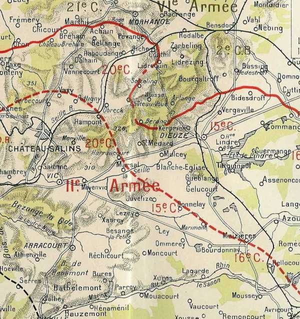
_Région de Morhange_
_La grande guerre racontée par nos généraux_

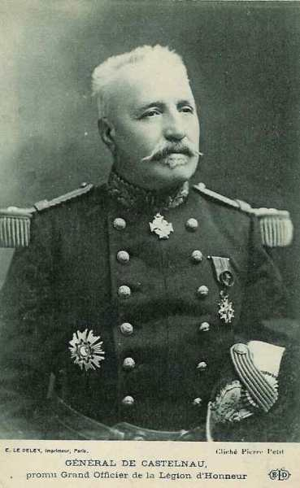
_Général de Castelnau (IIe armée)_
_Collection privée_

Cette armée met en ligne les

**15e C.A. (Marseille) : général Espinasse**

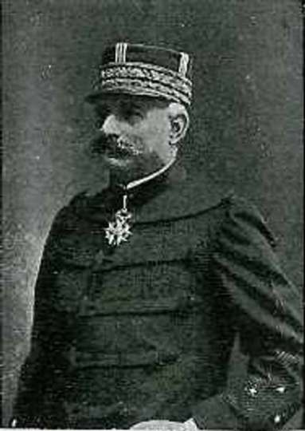
_Général Espinasse (15e C.A.)_

29e division : général Carbillet

| Unité                   | Commandant | Régiments                                                            |
| ----------------------- | ---------- | -------------------------------------------------------------------- |
| 57e brigade             | Tocanne    | 111e R.I. (Antibes)112e R.I. (Toulon)                                |
| 58e brigade             | Gasguy     | 3e R.I. (Hyères, Digne)141e R.I. (Marseille)                         |
| Elements divisionnaires |            | 6e régiment de hussards (un escadron - Marseille)55e R.A.C. (Orange) |

30e division : général Colle

| Unité                   | Commandant | Régiments                                                                                         |
| ----------------------- | ---------- | ------------------------------------------------------------------------------------------------- |
| 59e brigade             | Marillier  | 40e R.I. (Nîmes)58e R.I. (Avignon)                                                                |
| 60e brigade             | Morgain    | 55e R.I. (Aix-en-Provence, Pont-Saint-Esprit)61e R.I. (Aix-en-Provence, Privas)                   |
| Eléments divisionnaires |            | 6e régiment de hussards (un escadron - Marseille)19e R.A.C. (Angers)                              |
| Réserves                |            | 38e R.A.C. (Nîmes)7e régiment d’artillerie à pied (Nice)10e régiment d’artillerie à pied (Toulon) |

Ce C.A. rejoindra la IIIe armée à Bar-le-Duc le 3 septembre.

**16e C.A. (Montpellier) : général Taverna**

31e division : général Vidal

| Unité                   | Commandant | Régiments                                                               |
| ----------------------- | ---------- | ----------------------------------------------------------------------- |
| 61e brigade             | Dauvin     | 81e R.I. (Montpellier)96e R.I. (Béziers)                                |
| 62e brigade             | Xardel     | 122e R.I. (Rodez)142e R.I. (Lodève, Mende)                              |
| Elements divisionnaires |            | 19e régiment de dragons (un escadron - Castres)56e R.A.C. (Montpellier) |

32e division : général Bouchez

| Unité                   | Commandant | Régiments                                                                       |
| ----------------------- | ---------- | ------------------------------------------------------------------------------- |
| 63e brigade             | Dion       | 53e R.I. (Perpignan)80e R.I. (Narbonne)                                         |
| 64e brigade             | Sibille    | 15e R.I. (Albi)143e R.I. (Castelnaudary, Carcassonne)                           |
| Eléments divisionnaires |            | 19e régiment de dragons (un escadron - Castres)3e R.A.C. (Castres)              |
| Réserves                |            | 38e R.A.C. (Nîmes)332e R.I. (Rodez)342e R.I. (Lodève, Mende)9e R.A.C. (Castres) |

**18e C.A. (Bordeaux) : général de Mas-Latrie**

_Général de Mas Latrie (18e C.A.)_
_Collection privée_

35e division : général Excelmans

| Unité                   | Commandant | Régiments                                                                       |
| ----------------------- | ---------- | ------------------------------------------------------------------------------- |
| 69e brigade             | Durand     | 6e R.I. (Saintes / Doé de Mandreville)123e R.I. (La Rochelle / Hubert)          |
| 70e brigade             | Pierron    | 57e R.I. (Rochefort, Libourne / Dapoigny)144e R.I. (Bordeaux / Gauthier)        |
| Elements divisionnaires |            | 10e régiment de hussards (un escadron - Tarbes)24e R.A.C. (La Rochelle / Dunal) |

36e division : général Jouannic

| Unité                   | Commandant | Régiments                                                                               |
| ----------------------- | ---------- | --------------------------------------------------------------------------------------- |
| 71e brigade             | Dion       | 34e R.I. (Mont-de-Marsan / Capdepont)49e R.I. (Bayonne / Burgala)                       |
| 72e brigade             | Sibille    | 12e R.I. (Tarbes / De Sèze)18e R.I. (Pau / Gloxin)                                      |
| Eléments divisionnaires |            | 10e régiment de hussards (un escadron - Tarbes)14e R.A.C. (Tarbes / Vincent du Portail) |
| Réserves                |            | 218e R.I. (Pau)249e R.I. (Bayonne)                                                      |

Ce C.A. sera transféré vers la Ve armée, où il participera à la bataille de Charleroi.

**20e C.A. (Nancy) : général Foch**

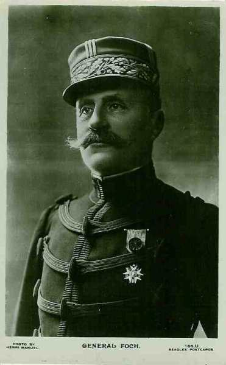
_Général Foch (IXe armée)_
_Collection privée_

11e division : général Châtelain

| Unité                   | Commandant | Régiments                                                                                                                                               |
| ----------------------- | ---------- | ------------------------------------------------------------------------------------------------------------------------------------------------------- |
| 21e brigade             | Aimé       | 26e R.I. (Nancy)69e R.I. (Essey-les-Nancy)2e bataillon de chasseurs à pied (Troyes, Lunéville)4e bataillon de chasseurs à pied (Brienne, Saint-Nicolas) |
| 22e brigade             | Ferry      | 37e R.I. (Nancy)79e R.I. (Nancy)                                                                                                                        |
| Elements divisionnaires |            | 12e régiment de dragons (un escadron - Troyes, Toul)8e R.A.C. (Nancy)                                                                                   |

39e division : général Dantant

| Unité                   | Commandant | Régiments                                                              |
| ----------------------- | ---------- | ---------------------------------------------------------------------- |
| 77e brigade             | Dion       | 146e R.I. (Toul)153e R.I. (Toul)                                       |
| 78e brigade             | Sibille    | 156e R.I. (Toul)160e R.I. (Toul)                                       |
| Eléments divisionnaires |            | 12e régiment de dragons (un escadron - Troyes, Toul)39e R.A.C. (Toul)  |
| Réserves                |            | 60e R.A.C. (Troyes, Neufchâteau)6e régiment d’artillerie à pied (Toul) |

**2e groupement de divisions de réserve : général Léon Durand**

59e division de réserve : général Kopp

| Unité                   | Commandant | Régiments                                                                                                                                              |
| ----------------------- | ---------- | ------------------------------------------------------------------------------------------------------------------------------------------------------ |
| 117e brigade de réserve | Lambin     | 232e R.I. (Tours)314e R.I. (Saint-Maixent)325e R.I. (Poitiers)                                                                                         |
| 118e brigade            | Pierron    | 266e R.I. (Tours)277e R.I. (Cholet)335e R.I. (Angers)20e R.A.C. (un groupe - Poitiers)33e R.A.C. (un groupe - Angers)49e R.A.C. (un groupe - Poitiers) |

36e division de réserve : général Brun d’Aubignosc

| Unité        | Commandant | Régiments                                                                                                                                                                 |
| ------------ | ---------- | ------------------------------------------------------------------------------------------------------------------------------------------------------------------------- |
| 135e brigade | Dion       | 206e R.I. (Saintes)234e R.I. (Mont-de-Marsan)323e R.I. (La Rochelle)                                                                                                      |
| 136e brigade | Mordrelle  | 344e R.I. (Bordeaux)257e R.I. (Libourne, Rochefort)212e R.I. (Tarbes)14e R.A.C. (un groupe - Tarbes)24e R.A.C. (un groupe - La Rochelle)58e R.A.C. (un groupe - Bordeaux) |

70e division de réserve : général Fayolle

| Unité        | Commandant | Régiments                                                                                                                                                                                                  |
| ------------ | ---------- | ---------------------------------------------------------------------------------------------------------------------------------------------------------------------------------------------------------- |
| 135e brigade | Dion       | 206e R.I. (Saintes)234e R.I. (Mont-de-Marsan)323e R.I. (La Rochelle)                                                                                                                                       |
| 139e brigade |            | 226e R.I. (Toul Nancy)269e R.I. (Toul, Nancy)42e bataillon de chasseurs à pied                                                                                                                             |
| 140e brigade | Goujet     | 279e R.I.. (Neufchâtel, Nancy)360e R.I. (Neufchâtel, Toul)237e R.I. (Troyes, Nancy)19e R.A.C. (un groupe - Nimes)38e R.A.C. (un groupe - Nimes)2e régiment d’artillerie de montagne (un groupe - Grenoble) |

Joffre a attiré l’attention sur le fait que l’armée pourrait trouver devant elle une organisation fortifiée et que les attaques doivent bien se lier. La marche s’opère avec prudence.

L’attaque vers Sarrebourg échoit à la Ie armée (Dubail).

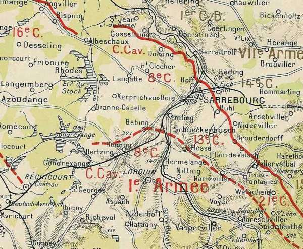
_Région de Sarrebourg_
_La grande guerre racontée par nos généraux_

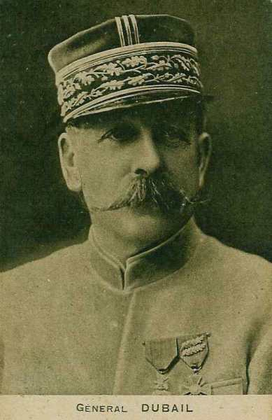
_Général Dubail (Ie armée)_
_Collection privée_

Elle est composée des

**7e C.A. (Besançon) : général Vautier**

14e division : général Curé

| Unité                   | Commandant | Régiments                                                                       |
| ----------------------- | ---------- | ------------------------------------------------------------------------------- |
| 27e brigade             | Berge      | 44e R.I. (Lons-le-Saulnier)60e R.I. (Besançon)                                  |
| 28e brigade             | Faës       | 35e R.I. (Belfort)42e R.I. (Belfort)                                            |
| Elements divisionnaires |            | 11e régiment de chasseurs à cheval (un escadron - Vesoul)47e R.A.C. (Héricourt) |

41e division : général Superbie

| Unité                   | Commandant | Régiments                                                                                                                                                                       |
| ----------------------- | ---------- | ------------------------------------------------------------------------------------------------------------------------------------------------------------------------------- |
| 81e brigade             | Bataille   | 152e R.I. (Gerardmer)5e bataillon de chasseurs (Besançon, Remiremont)15e bataillon de chasseurs à pied (Montbéliard, Remiremont)                                                |
| 82e brigade             | Coste      | 23e R.I. (Bourg en Bresse)133e R.I. (Belley)                                                                                                                                    |
| Eléments divisionnaires |            | 11e régiment de chasseurs à cheval (un escadron - Vesoul)4e R.A.C. (Besançon)                                                                                                   |
| Réserves                |            | 352e R.I. (Gerardmer)45e bataillon de chasseurs à pied (Besançon)55e bataillon de chasseurs à pied (Montbéliard)11e régiment de chasseurs à cheval (Vesoul)5e R.A.C. (Besançon) |

**8e C.A. (Bourges) : général de Castelli**

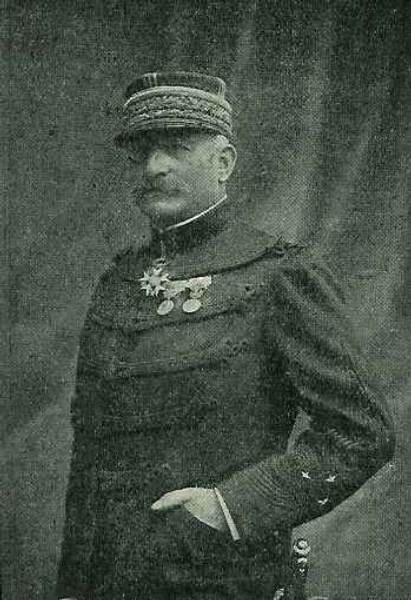
_Général de Castelli (8e C.A.)_
_La guerre du droit_

15e division : général Bajolle

| Unité                   | Commandant          | Régiments                                                                   |
| ----------------------- | ------------------- | --------------------------------------------------------------------------- |
| 29e brigade             | Grandjean           | 56e R.I. (Chalon-sur-Saône)134e R.I. (Mâcon)                                |
| 30e brigade             | Piarron de Mondésir | 10e R.I. (Auxonne)27e R.I. (Dijon)                                          |
| Elements divisionnaires |                     | 16e régiment de chasseurs à cheval (un escadron - Beaune)48e R.A.C. (Dijon) |

16e division : général de Maud’huy

| Unité                   | Commandant | Régiments                                                                                           |
| ----------------------- | ---------- | --------------------------------------------------------------------------------------------------- |
| 31e brigade             | Reibell    | 85e R.I. (Cosne-sur-Loire)95e R.I. (Bourges)                                                        |
| 32e brigade             | Marie      | 13e R.I. (Nevers)29e R.I. (Autun)                                                                   |
| Eléments divisionnaires |            | 16e régiment de chasseurs à cheval (un escadron - Beaune)1e R.A.C. (Bourges)                        |
| Réserves                |            | 210e R.I. (Auxonne)227e R.I. (Dijon)16e régiment de chasseurs à cheval (Beaune)37e R.A.C. (Bourges) |

**13e C.A. (Clermont-Ferrand) : général Alix**

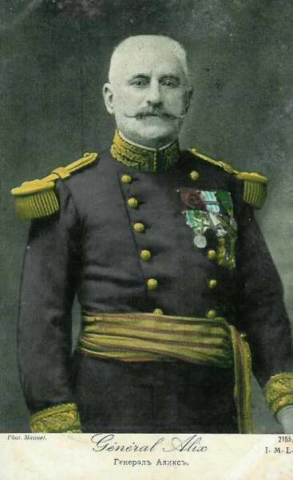
_Général Alix (13e C.A.)_
_Collection privée_

25e division : général Delétoille

| Unité                   | Commandant         | Régiments                                                                                           |
| ----------------------- | ------------------ | --------------------------------------------------------------------------------------------------- |
| 49e brigade             | Rozée d’Infréville | 38e R.I. (Saint-Etienne)86e R.I. (Le Puy-en-Velay)                                                  |
| 50e brigade             | Chandezon          | 16e R.I. (Montbrison, Clermond-Ferrand)98e R.I. (Roanne)                                            |
| Elements divisionnaires |                    | 3e régiment de chasseurs à cheval (un escadron - Clermont-Ferrand)36e R.A.C. (Moulins - Thionville) |

26e division : général Silhol

| Unité                   | Commandant                | Régiments                                                                                                                                                                                                                                                    |
| ----------------------- | ------------------------- | ------------------------------------------------------------------------------------------------------------------------------------------------------------------------------------------------------------------------------------------------------------ |
| 51e brigade             | Martin de la Porte d’Hust | 105e R.I. (Riom)121e R.I. (Montluçon)                                                                                                                                                                                                                        |
| 52e brigade             | Collas                    | 92e R.I. (Clermont-Ferrand)139e R.I. (Aurillac)                                                                                                                                                                                                              |
| Eléments divisionnaires |                           | 3e régiment de chasseurs à cheval (un escadron - Clermont-Ferrand)16e R.A.C. (Clermont-Ferrand)                                                                                                                                                              |
| Réserves                |                           | 41e bataillon de chasseurs à pied (Troyes)43e bataillon de chasseurs à pied (Langres)50e bataillon de chasseurs à pied (Langres)71e bataillon de chasseurs à pied (Langres)3e régiment de chasseurs à cheval (Clermont-Ferrand)53e R.A.C. (Clermont-Ferrand) |

**14e C.A. (Lyon) : général Pouradier-Duteil**

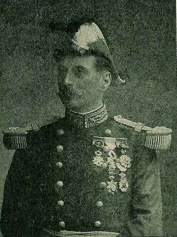
_Général Pouradier-Duteil (14e C.A.)_
_La guerre du droit_

27e division : général Blazer

| Unité                   | Commandant | Régiments                                                            |
| ----------------------- | ---------- | -------------------------------------------------------------------- |
| 53e brigade             | Baquet     | 75e R.I. (Romans)140e R.I. (Grenoble)Groupe alpin A de Grenoble      |
| 54e brigade             | Sorbets    | 52e R.I. (Montélimar)Groupe alpin de Draguignan                      |
| Elements divisionnaires |            | 9e régiment de hussards (un escadron - Chambéry)2e R.A.C. (Grenoble) |

28e division

| Unité                   | Commandant | Régiments                                                                                               |
| ----------------------- | ---------- | ------------------------------------------------------------------------------------------------------- |
| 55e brigade             | Pierrot    | 22e R.I. (Sathonay)99e R.I. (Lyon, Vienne)                                                              |
| 56e brigade             | Blazer     | 30e R.I. (Annecy)Groupe alpin d’Annecy (Annecy)                                                         |
| Eléments divisionnaires |            | 9e régiment de hussards (un escadron - Chambéry)54e R.A.C. (Lyon - Crépey)                              |
| Réserves                |            | 210e R.I. (Auxonne)5e régiment d’artillerie lourde (Valence)11e régiment d’artillerie à pied (Briançon) |

**21e C.A. (Epinal) : général Legrand**

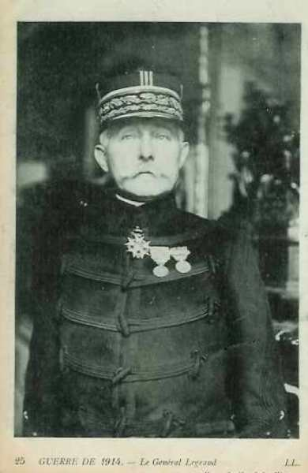
_Général Legrand (21e C.A.)_
_Collection privée_

13e division : général Bourdériat

| Unité                   | Commandant | Régiments                                                                                                                                                                |
| ----------------------- | ---------- | ------------------------------------------------------------------------------------------------------------------------------------------------------------------------ |
| 25e brigade             | Barbade    | 17e R.I. (Epinal)17e bataillon de chasseurs à pied (Rambervillers, Baccarat)20e bataillon de chasseurs à pied (Baccarat)21e bataillon de chasseurs à pied (Raon-L’Etape) |
| 26e brigade             | Hamon      | 21e R.I. (Langres)109e R.I. (Chaumont)                                                                                                                                   |
| Elements divisionnaires |            | 4e régiment de chasseurs à cheval (un escadron - Epinal)62e R.A.C. (Epinal, Rambervillers)                                                                               |

43e division : général Lanquetot

| Unité                   | Commandant | Régiments                                                                                                                                                                                                              |
| ----------------------- | ---------- | ---------------------------------------------------------------------------------------------------------------------------------------------------------------------------------------------------------------------- |
| 85e brigade             | Pillot     | 158e R.I. (Bruyères, Corcieux)149e R.I. (Epinal)                                                                                                                                                                       |
| 86e brigade             | Olleris    | 1e bataillon de chasseurs à pied (Senones)3e bataillon de chasseurs à pied (Saint-Dié)10e bataillon de chasseurs à pied (Saint-Dié)31e bataillon de chasseurs à pied (Saint-Dié)                                       |
| Eléments divisionnaires |            | 4e régiment de chasseurs à cheval (un escadron - Epinal))12e R.A.C. (Bruyères, Saint-Dié)                                                                                                                              |
| Réserves                |            | 57e bataillon de chasseurs à pied (Brienne-le-Château)60e bataillon de chasseurs à pied (Brienne-le-Château)61e bataillon de chasseurs à pied (Langres)4e régiment de chasseurs à cheval (Epinal)59e R.A.C. (Chaumont) |

Ce C.A. sera transféré le 3 septembre vers Bar-le-Duc.

**5e D.C. (Lyon) : général Levillain**

| Unité                          | Commandant | Régiments                                                                                         |
| ------------------------------ | ---------- | ------------------------------------------------------------------------------------------------- |
| 5e brigade de cuirassiers      | Lamy       | 7e régiment de cuirassiers (Lyon)10e régiment de cuirassiers (Lyon)                               |
| 6e brigade de dragons          | Laperrine  | 2e régiment de dragons (Lyon)14e régiment de dragons (Saint-Etienne)                              |
| 6e brigade de cavalerie légère | Morel      | 13e régiment de chasseurs (Vienne)11e régiment de hussards (Tarascon)                             |
| Elements divisionnaires        |            | 4e R.A.C. (Remiremont, Besançon)Groupe cycliste du 15e bataillon de chasseurs à pied (Remiremont) |

**8e D.C. (Dôle) : général Aubier**

| Unité                          | Commandant | Régiments                                                        |
| ------------------------------ | ---------- | ---------------------------------------------------------------- |
| 8e brigade de dragons          | Gendron    | 11e régiment de dragons (Belfort)18e régiment de dragons (Lure)  |
| 14e brigade de dragons         | Mazel      | 17e régiment de dragons (Auxonne)26e régiment de dragons (Dijon) |
| 8e brigade de cavalerie légère | Morel      | 14e régiment de chasseurs (Dôle)11e régiment de hussards (Gray)  |
| Elements divisionnaires        |            | 4e R.A.C.Groupe cycliste du 15e bataillon de chasseurs à pied    |

- Le 13e C.A. s’est établi sur la ligne Baccarat - Raon-l’Etape - Bazan.

- Le 8e C.A. tient la ligne Fraimbois - Vathiménil - Gerbéviller.

- Le 21e C.A. : la brigade coloniale et le 43e division se trouvent vers Saint-Quirin ; la 13e division est installée sur le Donon, sa droite vers la Bruche en aval de Schirmeck.

- Le 14e C.A. a la 28e division au-delà de la Bruche et la 27e division du côté d’Urbeis, où elle se relie à l’armée d’Alsace.

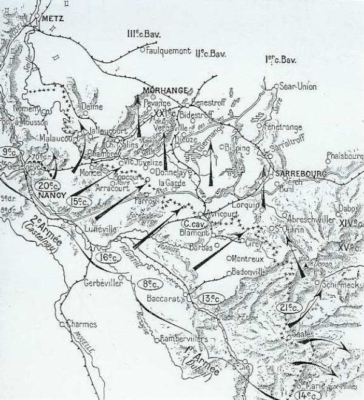
_Direction de l’offensive française_
_C Michelin d’après guide édition 1919 - autorisation n° 06-B-05_

### Ordre de bataille de l’armée allemande

Ce secteur est tenu par la VIe armée allemande, sous le commandant de Rupprecht de Bavière, prince héritier.

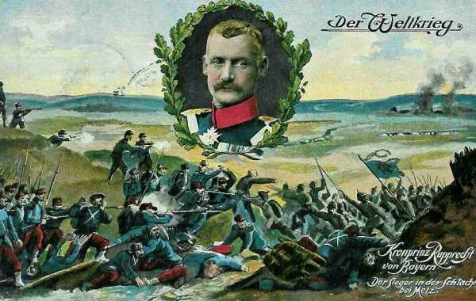
_Kronprinz Rupprecht de Bavière_
_Collection privée_

Quatre C.A. et une D.C. font face à l’armée de Castelnau.

**1e C.A. bavarois : (Munich), général von Xylander**

KGL Bayer = Royal bavarois

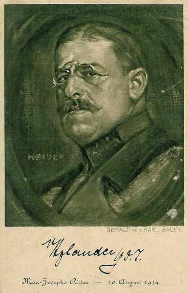
_Général von Xylander_
_Collection privée_

1e division bavaroise : général von Schoch

| Unité                                 | Commandant | Régiments                                                                                                                                  |
| ------------------------------------- | ---------- | ------------------------------------------------------------------------------------------------------------------------------------------ |
| 1. Kgl. Bayer. Infanterie-Brigade     |            | Kgl. Bayer. Infanterie-Leib-Regiment (Munich)Kgl. Bayer. 1. Infanterie-Regiment (Munich)                                                   |
| 2. Kgl. Bayer. Infanterie-Brigade     |            | Kgl. Bayer. 2. Infanterie-Regiment (Munich)Kgl. Bayer. 16. Infanterie-Regiment (Passau, Landshut)Kgl. Bayer. 1. Jäger-Bataillon (Freising) |
| Cavalerie divisionnaire               |            | Kgl. Bayer. 8. Chevaulegers-Regiment (Dillingen)                                                                                           |
| 1. Kgl. Bayer. Feldartillerie-Brigade |            | Kgl. Bayer. 1. Feldartillerie-Regiment (Munich)Kgl. Bayer. 7. Feldartillerie-Regiment (Munich)Kgl. Bayer. 10. Fußartillerie-Bataillon      |

2e division bavaroise : général von Hetzel

| Unité                            | Commandant | Régiments                                                                                           |
| -------------------------------- | ---------- | --------------------------------------------------------------------------------------------------- |
| 3. Bayer. Infanterie-Brigade     |            | Kgl. Bayer. 3. Infanterie-Regiment (Augsburg)Kgl. Bayer. 20. Infanterie-Regiment (Lindau, Kempten)  |
| 4. bayer. Infanterie-Brigade     |            | Kgl. Bayer. 12. Infanterie-Regiment (Neu-Ulm)Kgl. Bayer. 15. Infanterie-Regiment (Neuburg a.d.)     |
| Cavalerie divisionnaire          |            | Kgl. Bayer. 4. Chevaulegers-Regiment (Augsburg)                                                     |
| 2. Bayer. Feldartillerie-Brigade |            | Kgl. Bayer. 4. Feldartillerie-Regiment (Augsburg)Kgl. Bayer. 9. Feldartillerie-Regiment (Landsberg) |

**2e C.A. bavarois : (Würzburg) : général von Martini**

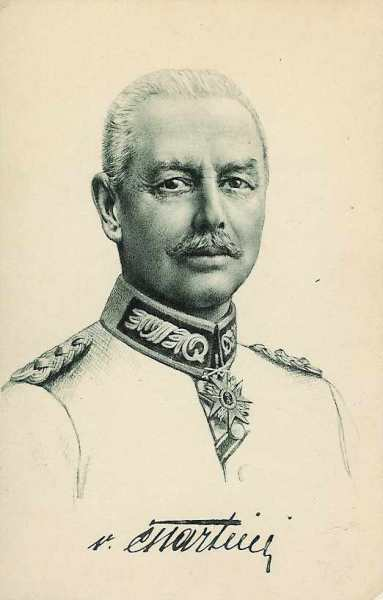
_Général von Martini_
_Collection privée_

3e division bavaroise : généralvon Breitkopf

| Unité                                | Commandant | Régiments                                                                                                                               |
| ------------------------------------ | ---------- | --------------------------------------------------------------------------------------------------------------------------------------- |
| 5. Bayer. Infanterie-Brigade         |            | Kgl. Bayer. 22. Infanterie-Regiment (Zweibrücken)Kgl. Bayer. 23. Infanterie-Regiment (Landau, Sarreguemines)                            |
| 6. Bayer. Infanterie-Brigade         |            | Kgl. Bayer. 17. Infanterie-Regiment Germersheim)Kgl. Bayer. 18. Infanterie-Regiment (Landau)                                            |
| Cavalerie divisionnaire              |            | Kgl. Bayer. 3. Chevaulegers-Regiment (Dieuze)                                                                                           |
| 3. Bayer. Feldartillerie-Brigade     |            | Kgl. Bayer. 5. Feldartillerie-Regiment (Landau)Kgl. Bayer. 12. Feldartillerie-Regiment (Landau)                                         |
| 7. Bayer. Infanterie-Brigade         |            | Kgl. Bayer. 5. Infanterie-Regiment (Bamberg)Kgl. Bayer. 9. Infanterie-Regiment (Würzburg)Kgl. Bayer. 2. Jäger-Bataillon (Aschaffenburg) |
| 5. Bayer. Reserve-Infanterie-Brigade |            | Kgl. Bayer. Reserve-Infanterie-Regiment Nr. 5 (Bamberg)Kgl. Bayer. Reserve-Infanterie-Regiment Nr. 8 (Metz)                             |
| Cavalerie divisionnaire              |            | Kgl. Bayer. 5. Chevaulegers-Regiment (Sarreguemines)                                                                                    |
| 4. Bayer. Feldartillerie-Brigade     |            | Kgl. Bayer. 2. Feldartillerie-Regiment (Würzburg)Kgl. Bayer. 11. Feldartillerie-Regiment (Würzburg)                                     |

**3e C.A. bavarois : (Nurenberg) : général von Gebsattel**

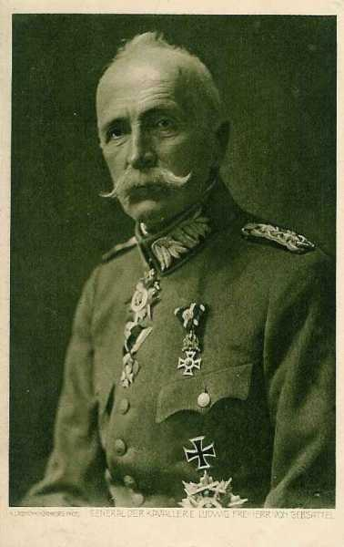
_Général von Gebsattel (3e C.A. bavarois)_
_Collection privée_

5e division bavaroise : général von Schoch

| Unité                            | Commandant | Régiments                                                                                                                                                     |
| -------------------------------- | ---------- | ------------------------------------------------------------------------------------------------------------------------------------------------------------- |
| 9. Bayer. Infanterie-Brigade     |            | Kgl. Bayer. 14. Infanterie-Regiment (Nurenberg)Kgl. Bayer. 21. Infanterie-Regiment (Fürth, Sulzbach)Kgl. Bayer. Reserve-Jäger-Bataillon Nr. 2 (Aschaffenburg) |
| 10. Bayer. Infanterie-Brigade    |            | Kgl. Bayer. 7. Infanterie-Regiment (Bayreuth)Kgl. Bayer. 19. Infanterie-Regiment (Erlangen)                                                                   |
| cavalerie divisionnaire          |            | Kgl. Bayer. 7. Chevaulegers-Regiment (Straubing)                                                                                                              |
| 5. Bayer. Feldartillerie-Brigade |            | Kgl. Bayer. 6. Feldartillerie-Regiment (Fürth)Kgl. Bayer. 10. Feldartillerie-Regiment (Erlangen)                                                              |

6e division bavaroise : général von Höhn

| Unité                            | Commandant | Régiments                                                                                                   |
| -------------------------------- | ---------- | ----------------------------------------------------------------------------------------------------------- |
| 11. Bayer. Infanterie-Brigade    |            | Kgl. Bayer. 10. Infanterie-Regiment (Ingolstadt)Kgl. Bayer. 13. Infanterie-Regiment (Ingolstadt, Eichstatt) |
| 12. Bayer. Infanterie-Brigade    |            | Kgl. Bayer. 6. Infanterie-Regiment (Amberg)Kgl. Bayer. 11. Infanterie-Regiment (Regensburg)                 |
| Cavalerie divisionnaire          |            | Kgl. Bayer. 2. Chevaulegers-Regiment (Regensburg)                                                           |
| 6. Bayer. Feldartillerie-Brigade |            | Kgl. Bayer. 3. Feldartillerie-Regiment (Grafenwöhr)Kgl. Bayer. 8. Feldartillerie-Regiment (Nurenberg)       |

**21e C.A. : (Saarbrucken) : général von Below**

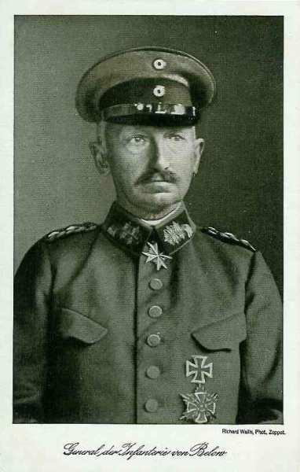
_Général von Below (21e C.A.)_
_Collection privée_

31e division : général von Berrer

| Unité                      | Commandant | Régiments                                                                                                                                              |
| -------------------------- | ---------- | ------------------------------------------------------------------------------------------------------------------------------------------------------ |
| 32. Infanterie-Brigade     |            | 8e Rheinisches Infanterie-Regiment Nr. 70 (Saarbrücken)10. Lothringisches Infanterie-Regiment Nr. 174 (Forbach)                                        |
| 62. Infanterie-Brigade     |            | Infanterie-Regiment Nr. 60 (Weissenburg)2. Unter-Elsässisches Infanterie-Regiment Nr. 137 (Hagenau)Infanterie-Regiment Hessen-Homburg Nr. 166 (Bitche) |
| Cavalerie divisionnaire    |            | Ulanen-Regiment (Rheinisches) Nr. 7 (Saarbrucken)                                                                                                      |
| 31. Feldartillerie-Brigade |            | 1e Unter-Elsässisches Feldartillerie-Regiment Nr. 31 (Hagenau)2. Unter-Elsässisches Feldartillerie-Regiment Nr. 67 (Hagenau, Bischweiler)              |

42e division : général von Bredow

| Unité                      | Commandant | Régiments                                                                                                            |
| -------------------------- | ---------- | -------------------------------------------------------------------------------------------------------------------- |
| 59. Infanterie-Brigade     |            | 1. Oberrheinisches Infanterie-Regiment Nr. 97 (Saarburg)3. Unter-Elsässisches Infanterie-Regiment Nr. 138 (Dieuze)   |
| 65. Infanterie-Brigade     |            | Infanterie-Regiment Nr. 17 (Morhange)2. Lothringisches Infanterie-Regiment Nr. 131 (Morhange)                        |
| Cavalerie divisionnaire    |            | Westfälisches Dragoner-Regiment Nr. 7 (Saarbrücken)                                                                  |
| 42. Feldartillerie-Brigade |            | Feldartillerie-Regiment Nr. 8 (Saarbrücken)1. Ober-Elsässiches Feldartillerie-Regiment Nr. 15 (Sarrebourg, Morhange) |

**1e C.A. de réserve bavarois (Munich) : général von Fasbender**

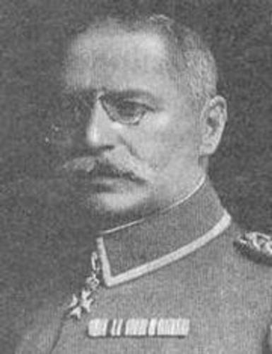
_Général von Fasbender_

1e division réserve bavaroise : général Göringer

| Unité                                                                                                   | Commandant | Régiments                                                                                                        |
| ------------------------------------------------------------------------------------------------------- | ---------- | ---------------------------------------------------------------------------------------------------------------- |
| 1. Bayer. Reserve-Infanterie-Brigade                                                                    |            | Kgl.                                                                                                             |
| Bayer. Reserve-Infanterie-Regiment Nr. 1 (Munich)Kgl. Bayer. Reserve-Infanterie-Regiment Nr. 2 (Munich) |
| 2. Bayer. Reserve-Infanterie-Brigade                                                                    |            | Kgl. Bayer. Reserve-Infanterie-Regiment Nr. 3 (Augsburg)Kgl. Bayer. Reserve-Infanterie-Regiment Nr. 12 (Neu-Ulm) |
| Cavalerie divisionnaire                                                                                 |            | Kgl. Bayer. Reserve-Kavallerie-Regiment Nr. 1 (Munich)                                                           |
| Artillerie divisionnaire                                                                                |            | Kgl. Bayer. Reserve-Feldartillerie-Regiment Nr. 1 (Munich)                                                       |

5e division réserve bavaroise : général Kress von Kressenstein

| Unité                                 | Commandant | Régiments                                                                                                                                                                  |
| ------------------------------------- | ---------- | -------------------------------------------------------------------------------------------------------------------------------------------------------------------------- |
| 9. Bayer. Reserve-Infanterie-Brigade  |            | Kgl. Bayer. Reserve-Infanterie-Regiment Nr. 6 (Amberg)Kgl. Bayer. Reserve-Infanterie-Regiment Nr. 7 (Bayreuth)                                                             |
| 11. Bayer. Reserve-Infanterie-Brigade |            | Kgl. Bayer. Reserve-Infanterie-Regiment Nr. 10 (Ingolstadt)Kgl. Bayer. Reserve-Infanterie-Regiment Nr. 13 (Ingolstadt)Kgl. Bayer. Reserve-Jäger-Bataillon Nr. 1 (Freising) |
| Cavalerie divisionnaire               |            | Reserve-Kavallerie-Regiment Nr. 5                                                                                                                                          |
| Artillerie divisionnaire              |            | Kgl. Bayer. Reserve-Feldartillerie-Regiment Nr. 5                                                                                                                          |

**3e C.C. : général von Frommel**

7. D.C. : général von Heydebreck

| Unité                  | Commandant | Régiments                                                                    |
| ---------------------- | ---------- | ---------------------------------------------------------------------------- |
| 26. Kavallerie-Brigade |            | Dragoner-Regt. Nr 25 (Ludwigsburg)Dragoner-Regt. Nr 26 (Stuttgart)           |
| 30. Kavallerie-Brigade |            | Dragoner-Regt. Nr 15 (Hagenau)Husaren-Regt. Nr 9 (Strassburg)                |
| 42. Kavallerie-Brigade |            | Ulanen-Regt. Nr 11 (Saarburg)Ulanen-Regt. Nr 15 (Hagenau)                    |
|                        |            | Bataillon du Feldartillerie-Regt. Nr 15 (Saarburg)MG. Abtg. Nr. 3 (Saarburg) |

8. D.C. : général von der Schulenburg-Hehlen

| Unité                         | Commandant | Régiments                                                                 |
| ----------------------------- | ---------- | ------------------------------------------------------------------------- |
| 23. Kavallerie-Brigade        |            | Königl.-Sächs. Garde-Reiter-Regt (Dresden)Ulanen-Regt. Nr 17 (Oschatz)    |
| 38. Kavallerie-Brigade        |            | Jäger-Regt zu Pferde Nr 2 (Langensalza)Jäger-Regt zu Pferde Nr 6 (Erfurt) |
| 40. Kavallerie-Brigade        |            | Königl. Sächs. Karabinier-Regt. (Borna)                                   |
| Ulanen-Regt. Nr 21 (Chemnitz) |
|                               |            | Bataillon du Feldartillerie-Regt. Nr 12 (Dresden)MG. Abtg. Nr. 8 (Mainz)  |

Bayerische Kavallerie-Division : général von Stetten

| Unité                            | Commandant | Régiments                                                                             |
| -------------------------------- | ---------- | ------------------------------------------------------------------------------------- |
| 1. Bayerische Kavallerie-Brigade |            | 1. Schweres Reiter-Regt. (München)2. Schweres Reiter-Regt.(Landshut)                  |
| 4. Bayerische Kavallerie-Brigade |            | 1. Ulanen-Regt.(Bamberg)\_ 2. Ulanen-Regt. (Ansbach)                                  |
| 5. Bayerische Kavallerie-Brigade |            | 1. Chevaulegers-Regt.(Nürnberg)6. Chevaulegers-Regt.(Bayreuth)                        |
|                                  |            | Bataillon du Bayer. Feldartillerie-Regt. Nr 5 (Sprottau)Bay. MG. Abtg. Nr. 1 (Landau) |

**Division d’ersatz de la Garde, 4e,7e,8e div ersatz**

**5 brigades Landwehr**

- Le 3e C.A. bavarois vers Delme.
    Le 2e C.A. bavarois entre Delme et Château-Salins.
    Le 21e C.A. entre Château-Salins et Sarrebourg.
    Le 1e C.A. bavarois entre Réchicourt et le Donon.

Du 14 au 20 août, et conformément aux instructions de Moltke et du Kronprinz de Bavière, les Allemands reculent pour attirer l’armée française vers les lignes de fortifications. Le Kronprinz de Bavière donne l’ordre d’attaquer le 20 août.

### Caractéristique du dispositif des armées

On est frappé par le caractère rectiligne de la VIe armée allemande et de la partie de la ligne française qui lui fait face. A l’ouest, seulement une petite fraction du 3e C.A. bavarois et les troupes de Metz établies à Delme sont en mesure d’agir contre le flanc de la ligne française. Cette menace est sensiblement diminuée par la position de la 70e division de réserve sur la Seille, qu’il lui suffit de franchir pour prendre à son tour de flanc les éléments allemands attaquant dans l’axe Metz - Château-Salins. Sur le reste du dispositif, la VIe armée devra attaquer de front.

Au-delà de Sarrebourg, le dispositif allemand s’infléchit assez brusquement vers le sud-est, quitte le plateau lorrain et entre dans la région montagneuse suivant une direction parallèle à celle des contreforts des Vosges. Les troupes du 15e C.A. auront la route barrée par une succession de crêtes et de vallées rendant les déplacements d’artillerie fort laborieux. L’attaque de flanc aurait été beaucoup plus efficace si Rupprecht avait laissé les Français passer la Sarre.

La manoeuvre débordante est seulement esquissée à l’ouest et exposée à être prise à revers à l’est, elle ne peut pas prétendre à beaucoup d’efficacité vu la configuration du terrain. Au lieu de broyer la IIe armée française entre deux mâchoires d’un étau, l’armée allemande va l’aborder presque exclusivement de front.

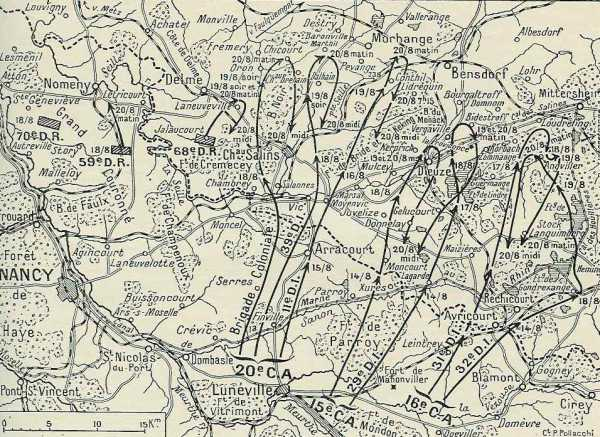
_Offensive des 20e, 15e et 16e C.A. (IIe armée)_
_La grande guerre - vécue - racontée par les combattants_

### 18 août

Le général de Castelnau prescrit à son armée de passer le 19 à l’attaque de la position Morhange - Bensdorf.

- Le 20e C.A. s’avancera en direction de Faulquemont, couvert en arrière et à gauche par la 68e division.
    Au 15e C.A.,la 30e division devra franchir la Seille au pont de Mulcey, et atteindre les débouchés sud de la forêt de Brides et de Köking, pour permettre au 16e C.A. de franchir le canal des Salines.

### 19 août

- Le 20e C.A. se porte au-delà de la Seille, précédé de détachements de cavalerie et de chasseurs. L’artillerie bavaroise ouvre le feu, causant toutefois peu de dégâts.
  En soirée, le 20e C.A. atteint
    Oron (54e colonial)
    Château-Bréhain (39e division)
    Pevange - Conthil (11e division)
    Laneuveville-en-Saulnois (68e division)

- Sur la droite, la journée a été dure pour le 15e C.A. :
    30e division : aucun détachement n’a pu pénétrer dans la forêt de Brides et Köking.
    29e division : la 57e brigade marche sur Bidestroff, appuyée par l’artillerie divisionnaire et l’artillerie de C.A. Les chasseurs des 6e et 23e bataillons réussissent à enlever Vergaville, mais au-delà de ce village, les troupes sont soumises ausx feux convergents de l’artillerie lourde allemande installée sur les plateaux de Dommon et dans la forêt de Brides et de Köking. Les troupes marchent sur un terrain nu et soigneusement repéré. Les soldats de la 29e division se jettent dans Bidersdorff qu’ils trouvent évacué. Alors ; l’artillerie allemande concentre ses feux sur ce village.

- L’offensive du 15e C.A. ne parvient pas à franchir la rivière des Salines.
    La 31e division se heurte aux positions bavaroises et s’arrête un peu au nord d’Angwiller. Les pertes françaises sont si sérieuses que cette division doit être relevée par la 32e, qui était maintenue en réserve.
    La32e division devra le lendemain reprendre l’offensive sur Rohrbach - Loudrefing.

### 20 août

A 11h du matin, Rupprecht de Bavière donne l’ordre d’attaque générale :

« Soldats de la VIe armée ! Des considérations d’ordre supérieur m’ont contraint de réfréner votre ardeur guerrière. Le temps de l’attente et du recul est passé. Nous devons avancer maintenant, c’est notre heure.

Il fait vaincre, nous vaincrons ! »

Rupprecht

- La garnison de Metz (33e division de réserve et éléments de la Landwehr), chargée de flanc-garder l’attaque générale en bordant la Seille, atteint sans combat ses objectifs Cheminot et Nomeny (50 civils sont fusillés dans cette dernière localité).

- La 10e division d’ersatz, venue de Boulay, prend possession de la côte de Delme, avec le 3e C.C.

- Le 3e C.A. bavarois parcourt en marche d’approche une dizaine de km avant de se trouver au contact. Sa droite chasse aisément de Viviers et de Delme les avant-postes de la 68e division. Vers 15h, il vient à bout de la résistance d’un régiment colonial et atteint à minuit Château-Salins.

- Le 2e C.A. bavarois, en approchant de Marthil, réduit au silence les batteries de la 39e division. A 10h, le corps entier se déploie en face de la position Château-Brehain - Achain - Conthil. Ces localités sont abandonnées par les Français à 10h. Pévange est enlevé à 13h. Les Français s’accrochent à Koeking. La 8e division d’ersatz arrive à la rescousse et les français doivent opérer une retraite. Plus à l’est, Pévange est enlevé à 13 heures. La 8e division d’ersatz arrive à la rescousse.

- Le 21e C.A. attaque entre la forêt de Dieuze et l’étang de Lindre. L’attaque a lieu dans un épais brouillard et les Français sont surpris. La division de droite ne rencontre une résistance solide que sur la ligne Genersdorf - Vergaville mais celle-ci cède vers 10h. A l’aile droite, Bidersdorff est enlevé dès 8 heures. Lindre n’est prise que le soir.

- Le 1e C.A.R. bavarois franchit le canal des Salines mais est arrêté devant une ligne de tranchées allant de Rohrbach à Bisping et ne parvient à s’en emparer que vers 15h. Une autre division de ce C.A. compte franchir le canal des Houillères mais y trouve des tirailleurs retranchés qui s’y défendent avec acharnement. Une attaque française débouche vers Gosselming dans son flanc gauche. Débarrassée de cette entrave par l’attaque de la VIIe armée, il force le canal des Houillères.

La VIe armée allemande remporte un brillant succès sur toute la ligne de la bataille, mais ce succès n’est pas le fruit d’une manoeuvre d’ensemble bien combinée ; il a surtout pour cause la tactique de combat non adaptée des troupes françaises : l’infanterie se lance prématurément en avant, sans reconnaître l’adversaire et sans préparation d’artillerie. Les fantassins, soumis à un feu violent d’artillerie et de mitrailleuses, sont arrêtés et réduits à la défensive. Les Allemands prennent l’offensive à leur tour et le front français se disloque. La direction du combat échappe aux chefs et la lutte se morcelle. Les trois C.A. sont refoulés vers le sud. Dans la soirée, la IIe armée a rétrogradé jusqu’à la ligne Jallaucourt - Château-Salins - Maizières.

Pour la Ie armée, la journée a été moins mauvaise, sauf à la gauche où le 8e C.A. a été refoulé par la contre-offensive du 1e C.A. bavarois et une partie du 14e C.A.

### Ie armée française

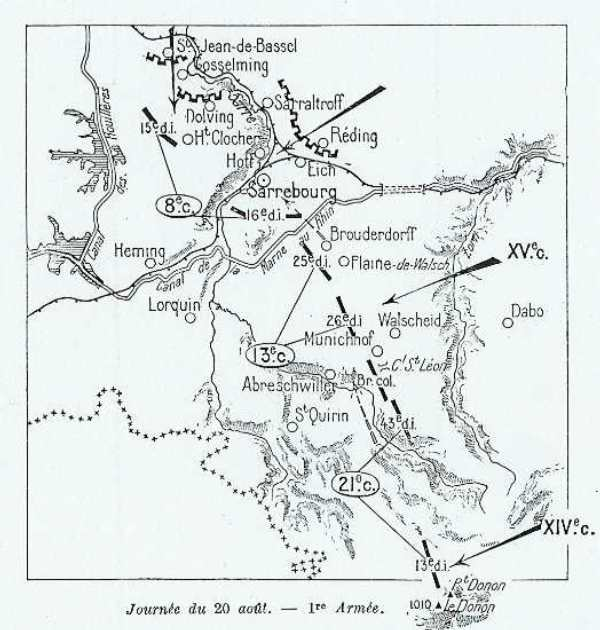
_Contre-offensive allemande contre la Ie armée française_
_C Michelin d’après guide édition 1919 - autorisation n° 06-B-05_

**8e C.A.**

Le C.A. attaque en direction de Gosselming et Oberstinzel. Gosselming enlevé mais les troupes ne parviennent pas à franchir la Sarre (qui coule vers Oberstinzel - Saraltroff).

**7h :**

L’offensive est complètement enrayée ; désorganisées par le bombardement, les troupes commencent à se replier.

**9h :**

Les Allemands passent à l’attaque.

**11h :**

Les troupes ont déjà subi des pertes sévères à cause de l’artillerie allemande. L’artillerie lourde française prend position au sud de Sarrebourg mais n’arrive pas à éteindre l’artillerie allemande.

Les troupes allemandes assaillent Gosselming par le nord, la 15e division fléchit et évacue le village en se repliant sur Haut-Clocher.

Sur la rive droite de la Sarre, les Allemands, partis de Réding, attaquent Sarrebourg. Le 95e R.I. contient les attaques allemandes jusqu’à 17h. Le repli de la 15e division le soir est de 15 km.

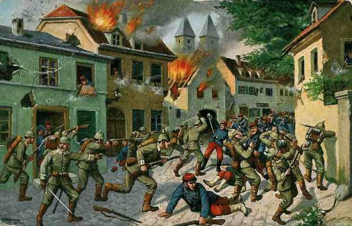
_Combats de Sarrebourg le 20 août_
_Collection privée_

La 16e division résiste avec acharnement le long de la Sarre et ne recule que pied à pied, en infligeant aux Bavarois des pertes énormes, mais elle doit se reporter en arrière du canal de la Marne au Rhin dans la soirée.

**16h30 :**

Le 8e C.A. doit abandonner Sarrebourg.

Malgré le repli du 8e C.A., Dubail ne considère pas la partie comme perdue et installe le 8e C.A. sur les hauteurs de Kerprich-aux-Bois - Soldatenkopf.

**13e C.A.**

La ligne de résistance du C.A., attaquée par le 14e C.A. allemand, est bien enfoncée mais elle se maintient en certains points. L’artillerie bloque l’attaque du 14e C.A. allemand en lui infligeant de lourdes pertes, permettant au 8e C.A. de se regrouper.

**16h30 :**

Suite à la retraite de la 16e division à Sarrebourg et à l’échec de la brigade coloniale à Haarberg, Dubail engage le 13e C.A. contre le centre allemand (14e C.A. badois). La contre-attaque est un succès. Brouderdorf et Plain-de-Walsch sont repris.

**21e C.A.**

Au 21e C.A., la 13e division, revenue de la vallée de la Bruche, résiste victorieusement aux attaques du 15e C.A. allemand. A sa gauche, la 43e division et la brigade coloniale, ne peuvent déboucher sur leurs objectifs.

**Positions de la Ie armée au soir**

Le soir du 20 août, la Ie armée occupe d’excellentes positions à cheval sur la Sarre mais la nuit, Joffre fait connaître que la IIe armée se replie et « qu’il ne faut pas s’acharner à défendre un front qui peut être tourné, la liaison entre les Ie et IIe armées n’existant plus ».

A regret, Dubail prend le parti de se retirer sur la Vezouse.

**Résumé de la journée**

Quatre C.A. français, le 8e, 13e, 21e et 14e, combattent depuis le 14 août quatre C.A. allemands : le 1e bavarois de réserve, le 1e bavarois actif et les 14e et 15e. L’armée allemande est fortement retranchée : à Wasselone - Dabo - Fenestrange et attend de pied ferme l’offensive française.

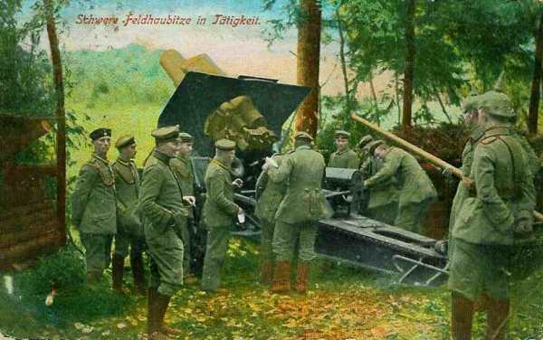
_Obusier allemand de campagne camouflé_
_Collection privée_

La 15e division française défile sous le feu allemand pour aller s’emparer de la tête de pont de Gosselming, qui lui permettra de franchir la Sarre. Elle réussit d’abord mais l’artillerie lourde allemande prend le dessus sur l’artillerie de campagne française et écrase le régiment qui s’est emparé de cette localité, ce qui provoque le recul puis la retraite précipitée de la 15e division sur le canal de la Marne au Rhin.

La 16e division tient bon à Sarrebourg jusqu’à 16h. Soutenue par une contre-attaque du 13e C.A., elle se replie en bon ordre, sur 12 à 15 km.

### IIe armée française

Depuis le 14 août, l’armée avance en territoire allemand (cédé par la France en 1871), occupe la région des Etangs et débouche sur la Seille. Les Allemands occupent de fortes positions sur des défenses naturelles : Morhange est un véritable camp retranché et tout le pays entre Seille et Sarre forme un ouvrage continu.

Les 15e et 16e C.A. doivent se porter en flèche pour attaquer à partir de 5h du matin au nord du canal des Salines, pour rejeter les Allemands sur la voie ferrée Sarrebourg - Bensdorf.

La brume empêche de reconnaître les positions de l’adversaire. Au moment où les deux C.A. prennent l’offensive, ils sont attaqués (7h du matin).

Le haut commandement allemand avait attiré les français dans un piège dont Dieuze était le centre. Le 20, le kronprinz Rupprecht de Bavière renonce à la retraite programmée et passe à l’offensive sur toute la circonférence du cirque. Dans l’intervalle, des renforts allemands sont arrivés (1e C.A.R. bavarois au sud-ouest de Sarrebourg). Une artillerie formidable tonne de toutes parts, les C.A. français sont assaillis par des forces supérieures provenant de la ligne des hauteurs, de Mittersheim à Kuttingen.

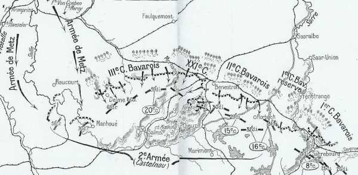
_Contre-offensive de la VIe armée allemande contre la IIe armée française_
_C Michelin d’après guide édition 1919 - autorisation n° 06-B-05_

**16e C.A.**

A 4 h du matin, par une forte brume, au moment où les troupes du 16e C.A. vont prendre l’offensive vers Benestroff, elles sont attaquées.

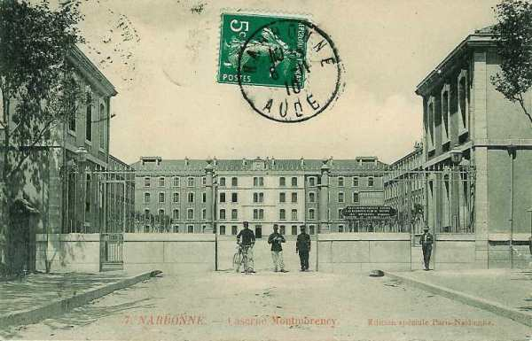
_80e R.I. - 32e div. - 16e C.A._
_Collection privée_

Un bombardement continu d’artillerie lourde écrase la ligne de ce C.A. et les masses allemandes traversent la route Dieuze - Fénétrange et poussent vers Zommange à l’abri des bois qui bordent le nord de l’étang de Lindre. La 32e division est attaquée du nord et peu après, la 31e est prise à partie de l’est vers le canal des Houillères. Vers 8h, cette ligne d’eau est perdue et les Allemands progressent contre le front Rohrbach - Angwiller - Bisping.

**20e C.A.**

A gauche de l’armée, le 20e C.A. a reçu l’ordre de Foch de se rendre maître des collines au nord de Morhange et de Baronville, en attaquant vers Racrange - Rodalbe, mais il s’enfonce dans un piège tendu par les Allemands.

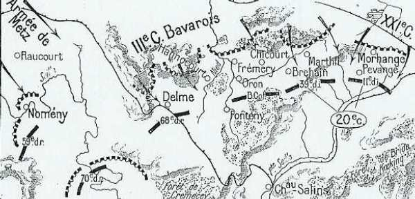
_Situation du 20e C.A. (Foch)_
_C Michelin d’après guide édition 1919 - autorisation n° 06-B-05_

A gauche, la 39e division a comme objectifs le signal de Baronville (Baronweiler) et le signal de Marthil ; à droite, la 11e division marchera sur le front Racrange - Morhange en se reliant au 15e C.A., dans le but de tourner la position allemande, mais elle doit passer par un terrible défilé.

A peine la 39e division a-t-elle commencé son mouvement vers les hauteurs de Marthil - Baronweiler qu’un feu d’artillerie formidable s’allume dès 7h sur la crête de l’autre côté de la Nied française et sur une portée de 5 à 6 km. Le 3e C.A. bavarois dévale des bois sur la division qui défile par Château-Bréhain - Bréhain - Marthil, la prend de flanc et la force à la retraite vers Château-Salins. Deux groupes d’artillerie divisionnaire restent aux mains des Bavarois.

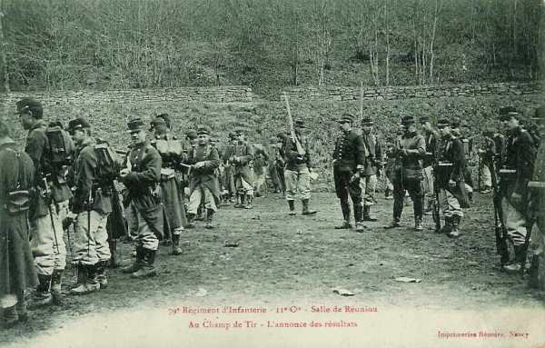
_79e R.I. - 11e div. - 20e C.A._
_Collection privée_

La 11e division n’est pas plus heureuse. Elle est contre-attaquée au départ de Morhange et bousculée à Conthil. Elle doit se replier sur Lidrequin où elle se retranche. Un régiment réussit à tenir en échec une division du 3e C.A. bavarois, pour permettre au 20e C.A. de se replier. Aplatis derrière de petits murs de terre, les hommes tirent à coup sûr, en maintenant les Allemands à 1000 ou 1200 m. Vers 16h, le régiment se retire après avoir rempli sa mission.

L’attaque ne se déroule pas comme prévu : les Allemands prennent l’initiative et la ligne d’avant-postes du 20e C.A. est culbutée entre 5 et 6 h et son artillerie mise hors de combat. La 39e division se retire sur la ligne Fonteny-Château - Brehain - Achain, mais la 11e division résiste vers Pévange.

**15e C.A.**

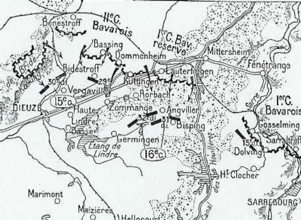
_Situation des 15e et 16e C.A._
_C Michelin d’après guide édition 1919 - autorisation n° 06-B-05_

Les Allemands, déclenchent une offensive contre le 15e C.A. à partir des hauteurs de la forêt de Bride et de Koeking dès 6h30, sur le flanc de la 30e division (nord-ouest de Vergaville), et des hauteurs de Bassing sur le front de la 29e division, en avant de Biedesdorf. Les Français n’ont aucun abri alors que l’armée allemande est solidement retranchée sur les hauteurs constituant de solides points stratégiques.

C’est contre la 29e division que se déchaîne l’attaque la plus violente. La 57e brigade (111e et 112e) qui défend les abords de Bidestroff, menacée d’enveloppement, doit évacuer le village. A Lindre-Haute, la 27e division résiste cinq heures durant. Le repli s’opère sur Dieuze, couvert par l’artillerie, mais le sol est jonché de soldats français.

Au sud de Dieuze, les 23e et 27e bataillons de chasseurs alpins prennent position sur des hauteurs et arrêtent les Allemands.

La 30e division réussit à progresser sous le tir violent des Allemands, mais, vers 10h, l’infanterie est clouée sur place.

A 8h30, le 15e C.A. se replie vers Mulcey - Vergaville, repasse le canal et prend position vers 10h de Blanche-Eglise à Lindre.

La retraite, d’abord locale, se transforme en une retraite générale par ordre. Il n’est même pas possible de résister dans Dieuze. Le général Carbillet (29e division) conçoit le projet de faire front un peu plus au sud de Dieuze en avant de la frontière française, au défilé de Gélucourt. Deux bataillons de chasseurs alpins ont ordre d’y résister à tout prix. Leur ténacité arrête l’offensive allemande jusqu’à la nuit.

En une matinée, les troupes du 15e C.A. ont reculé de 15 km et le nombre de tués, blessés et disparus est élevé.

**2e groupe de divisions de réserve**

La retraite du 20e C.A. découvre la gauche de la 68e division de réserve (Bordeaux) qui surveille les abords de Metz. Elle subit le choc des forces allemandes débouchant et elle doit se retirer sur Laneuville-en-Saulnois et Jallaucourt. En fin de journée, elle occupe la lisière nord du bois de Grémecey. Une brigade et un groupe d’artillerie de la 70e division franchissent la Seille pour la soutenir. Elle peut donc se replier sur le Grand couronné. Les troupes sorties de Metz attaquent la 59e division de réserve sur le front du Grand Couronné.

**Armée d’Alsace**

L’armée se trouve devant Colmar, dans la vallée de la Fecht. Les cinq groupes alpins du général Bataille y sont réunis.

**Situation des armées françaises au soir**

Les Allemands ont eu l’avantage pendant la journée du 20 entre la Sarre et la Seille. En revanche, ils n’ont pu progresser dans les Vosges. Les pertes françaises sont assez lourdes en tués et en blessés, mais assez peu importantes en matériel. Seul le 20e C.A. a perdu 24 pièces. Suite au repli de l’aile gauche, toute l’armée de Castelnau doit se replier sur la ligne Delme - Château-Salins - Marsal - Bisping, soit une retraite de 15 km.

**Réaction de Castelnau**

Castelnau conçoit de vives inquiétudes à l’égard de ses C.A. de droite, principalement du 16e. Dès 7h, il ordonne à ce C.A. de porter sur-le-champ sa division de queue (31e) dans la région Mézières - Bourdonnay ; au 20e d’attaquer d’urgence vers Koeking pour soutenir son voisin ; au 15e de faire effort avec la 29e division sur Zommange pour dégager la gauche du 16e C.A., fortement pressée. Mais les 20e et 15e C.A. sont trop fortement pressés et se trouvent incapables de répondre à ces appels.

**10h :**

Castelnau donne le premier ordre de repli « en raison de la situation critique de la gauche du 16e C.A. vers Guermange ». La retraite commence par échelons vers le front Fresnes-en-Saulnois - Marsal - Maizières.

**11h30 :**

Le 16e C.A. rend compte que Rohrbach est perdu, Angviller pressé et Bisping débordé ; que la 32e division se replie sur Guermange - Rhodes ; que le 15e C.A. se replie sur Blanche-Eglise - Gélucourt. Les pertes sont considérables, les troupes épuisées et l’artillerie perdue.

La 11e division garde toujours bonne contenance mais la 39e a perdu sa position et la 68e est aussi attaquée.

Castelnau voit l’éventualité d’une retraite jusque derrière la Moselle.

**16h :**

La double nouvelle de la perte de Guermange oblige la 32e division à un nouveau recul, et la 30e reflue vers Serres. Il prescrit à son armée de se dérober pendant la nuit pour se reformer à l’abri des positions du Grand-Couronné. Le groupe de divisions de réserve ira occuper celui-ci, d’Amance au Rambêtant. Le C.C. couvrira la droite de l’armée dans la région de Gondrexange.

La retraite générale se poursuit toute la nuit sur des routes encombrées par les trains et les convois.

Le matin du 21, le 20e C.A. est à Besange, la 15e à Serres et le 16e à Avricourt.

Voici la position des C.A.

- 16e C.A. : ligne générale Maizières - Réchicourt-le-Château.
    15e C.A. : Marsal - Donnelay - Marimont.
    20e C.A. : Marsal - Hampont - Jallaucourt.
    Divisions de réserve : Grand Couronné de Nancy.

**Réaction de Dubail**

Au terme de la journée, Dubail se rend compte que le front français est menacé vers son centre par le fléchissement des 15e, 16e et 8e C.A. Dans le courant de la nuit, il fait savoir qu’il y a lieu de ramener les convois derrière la Meurthe. Il transmet à son armée un ordre de retraite générale. La retraite de l’armée s’effectue dans la nuit du 20 au 21.

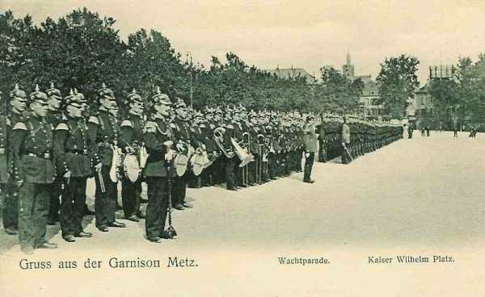
_Garnison de Metz_
_Collection privée_

A ce moment, la Ie armée s’est consolidée sur le front général : canal de la Marne au Rhin.

### 21 août

Moltke décide de poursuivre les troupes françaises, alors qu’il aurait pu prélever des troupes en Lorraine pour les transporter à l’aile droite du dispositif allemand. Au contraire, il envisage de forcer la ligne des forts d’arrêt français, en réalisant un encerclement de grand style des armées françaises. Au contraire, les Français vont envoyer des renforts vers l’ouest : les 64e et 74e divisions de réserve, unités fraîches venues des Alpes, ainsi que la 44e D.I. prélevée sur l’armée d’Alsace.

Mis au courant de la situation, Joffre fait interrompre le transport du 9e C.A. et remettre la division non embarquée à la disposition de Castelnau à Nancy.

Celui-ci émet d’abord l’espoir de pouvoir regrouper ses unités sous le couvert du Grand-Couronné prolongé par les hauteurs de Saffais -Belchamps. Vers midi, il envoie un rapport pessimiste et incline à poursuivre la retraite vers Toul et les Hauts de Meuse. Joffre objecte que l’abandon de Nancy aurait un effet moral désastreux et insiste pour le maintien sur la Moselle, d’autant plus que deux divisions débarquent à Charmes et Bayon.

Or, les allemands ne suivent pas. Dans la soirée, la IIe armée tient le Grand-Couronné et la Meurthe de Nancy à Lunéville et les troupes se ressaisissent.

**Ie armée**

Entre le Grand Couronné et les Vosges, la plaine affecte une forme triangulaire ; elle est traversée obliquement par quatre rivières presque parallèles : la Vezouse, la Meurthe, la Mortagne et la Moselle, qui coulent d’est en ouest. Vers Lunéville et Rambervillers, la vallée s’ouvre sur un couloir qui conduit droit au cœur de la France : la trouée de Charmes. Si une armée réussit à franchir la Moselle à Charmes, elle peut tourner Nancy et Toul d’une part, Epinal de l’autre. Elle n’a plus qu’à marcher par Neufchâteau sur Troyes et la Champagne. Elle rejoindrait l’armée allemande qui, par la Belgique et l’Oise, descend sur Laon et Reims : ce serait l’encerclement des armées françaises.

Du sort de la bataille de Lunéville dépend le sort de la France.

Des instructions tombées entre les mains françaises donnent pour objectif à l’armée du kronprinz de Bavière le village de Rozelieures, qui commande l’entrée de la trouée.

Pour faire échouer ce plan, les deux armées de l’est n’ont que deux ressources stratégiques :

- Défendre pied à pied la vallée en s’appuyant sur les rivières.
    Surprendre l’envahisseur par une attaque de flanc au départ du Grand Couronné.

Les Allemands ont repris le combat de bonne heure devant l’armée de Dubail.

- Le 8e C.A., après s’être opposé pendant la nuit au débouché des Allemands sur le canal de la Marne au Rhin, se replie par échelons. Vers Avricourt, elle se trouve en contact avec la 6e D.C. En fin de journée, le C.A. tient les hauteurs de Blâmont.

- Le 13e C.A. (Alix) doit se cantonner sur la frontière même sur les bords de la Sarre blanche. La 26e division n’a pas été touchée par l’ordre de retraite et reste sur place dans la région de Plain-de-Valsch. Elle est accrochée et perd une partie de son artillerie.

- Le 21e C.A. est resté sur ses bonnes positions autour du Donon et dans la vallée de la Bruche. Un duel d’artillerie a lieu entre l’artillerie française au Donon et l’artillerie allemande à Féconrupt. La position vers Saint-Quirin est évacuée à 4h du matin. Le Donon est perdu.

Le soir, les trois C.A. ont repassé la Vezouse et leur gauche est protégée par le fort de Manonviller.

**IIe armée**

Au soir, les trois C.A. ont atteint les zones de repli prescrites. La défense du Grand Couronné est assurée par trois brigades du 9e C.A., les 70e, 59e, 68e et 73e divisions de réserve, les 64e et 74e divisions achèvent leur débarquement.

La 64e prend position sur le plateau de Saffais, entre Meurthe et Moselle, et la 74e entre le plateau de Saffais et la Mortagne ; la 73e division de réserve, qui est sortie de Toul pour protéger la gauche de la IIe armée se portera sur la rive gauche de la Moselle pour empêcher la position de Sainte-Geneviève d’être tournée (colline au nord de Nancy).

A 3h du matin, est issu l’ordre de mise au point de l’ensemble du dispositif.

- Les avant-gardes du 16e C.A. prendront position sur la ligne organisée de Marainviller - Sionviller (entre Lunéville et la forêt de Parroy).

- Les avant-gardes du 15e C.A. se positionneront sur la ligne Anthelup - Flainval, en se reliant à gauche avec les tranchées des éléments du 9e C.A., qui occupent le Rembêtant.

Quant aux gros, ils sont disposés comme suit :

- Le 16e C.A. : au sud de Lunéville : Moncel - Gerbéviller - Mont-sur-Meurthe.

- Le 15e C.A. : sur la rive de la Meurthe à Dombasle - Flainval - Damelièvres - Rosières-aux-Salines.

- 20e C.A. : Moncourt - Azelot - Fléville - Art-sur-Meurthe - Varangéville.

- 68e division : au sud de Nancy, à Jarville et Vandoeuvre.

- 2e et 10e D.C. (Conneau) en couverture de la droite, dans la région de Veho, sur la Vezouse.

Les Français commencent à faire un large usage des fortifications de campagne. Les divisions arrivées en renfort (74e et 64e) vont barrer en travers la trouée de Charmes.

### 22 août

Le Q.G. assigne aux Ie et IIe armées la tâche suivante, au moment où l’armée allemande se portera sur la trouée de charmes.

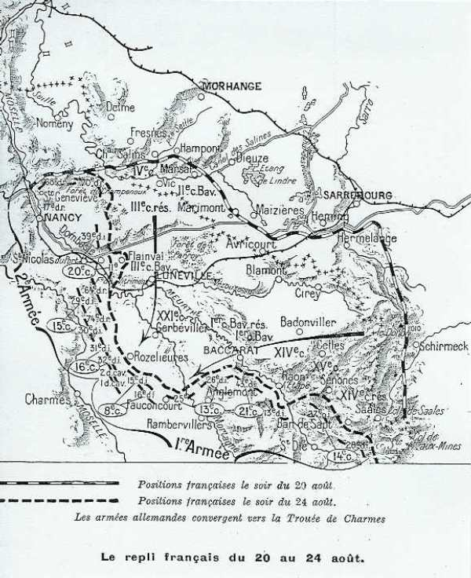
_Repli français 20 - 24 août_
_C Michelin, d’après guide édition 1919 - autorisation n° 06-B-05_

- Ie armée : barrer la route sur une ligne ouest-est entre le col de Saales et le nord de la forêt de Charmes.

- IIe armée, disposée perpendiculairement à la Ie : tomber des hauteurs du Grand Couronné et du sud de la Meurthe sur les colonnes allemandes en marche.

**Ie armée**

Les Allemands reprennent contact avec l’armée et le repli continue jusqu’à la Meurthe. L’armée abandonne les dernières positions qu’elle avait conquises si péniblement en Lorraine, en Alsace et dans les Vosges.

Comme l’adversaire cesse d’être pressant, et à la demande de Joffre, Dubail peut fixer la ligne Baccarat - Badonviller - Allarmont - Col de Hans - Sainte-Marie comme ligne à tenir par les 21e et 14e C.A., les 8e et 13e se rassemblant à l’ouest et au nord de Rambervillers.

- Le 8e C.A. se retire, entraînant le 13e C.A. Blâmont est abandonné.

- Le 21e C.A. doit également reculer. Les Allemands franchissent la frontière française à 18h.

- Le 14e C.A. est en flèche entre Saales et Sainte-Marie. Il perd ce dernier col. Le C.A. abandonne son attaque prévue dans la vallée de la Bruche et recule à son tour.

En fin de journée, la Ie armée a perdu la ligne de la Vezouse ; elle occupe la ligne Vaxainville - Col d’Urbeis - région de Sainte-Marie-aux-Mines et Bohomme.

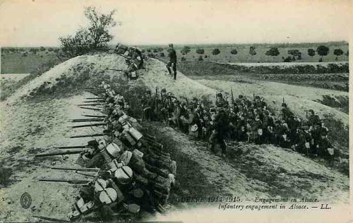
_Engagement en Alsace_
_Collection privée_

**IIe armée**

Une attaque allemande violente, soutenue par une puissante artillerie, se déclenche sur les positions du 16e C.A., d’Einville à Lunéville. Le C.A. cède sous la pression et se retire au nord de la Meurthe. Il gagne la région de Xermaménil sur la rive droite de la Mortagne.

Castelnau prolonge la retraite.

- Le 16e C.A. doit se rendre sur les hauteurs de Belchamps (entre Bayon et Xermaménil).
    La 74e division doit tenir la route de Bayon à Lunéville.
    La 15e C.A. doit occuper Haussonville et Ferrières.
    La 20e C.A. doit retraiter vers Saint-Nicolas.

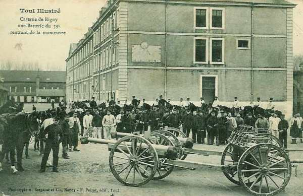
_39e R.A.C. - 39e div - 20e C.A._
_Collection privée_

**Armée d’Alsace**

La VIIe armée allemande (von Heeringen) débouche au sud de Colmar et attaque entre Türckheim et Logelbach. Trois bataillons français qui se trouvent dans la vallée de la Weiss contre-attaquent et les Allemands, surpris, prennent le parti d’évacuer Logelbach et de se replier sur Colmar.

**Conclusion**
les divisions françaises, qui comptent parmi l’élite de l’armée (division de fer...) se sont heurtées à des positions soigneusement préparées et richement dotées en artillerie lourde. Le terrain qu’elles empruntent a été quadrillé pour faciliter le tir.

Les Français encourent de grosses pertes, ce qui encourage Rupprecht de Bavière à entamer une contre-offensive contre l’avis de Moltke. En prenant cette initiative, il crée une première brèche dans le plan Schlieffen, car il refoule les Français vers l’ouest, plus près de leurs bases et les contraint à la défensive le long de la ligne des forts. Joffre pourra ensuite prélever des troupes pour renforcer son aile gauche, ce qui contribuera à la victoire de la Marne.

### Souvenirs de l’offensive

Les nombreux monuments témoignent de l’importance de l’offensive et de l’acharnement des combats.

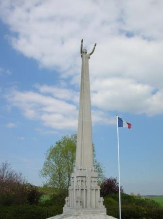
_Bidestroff : monument du 15e C.A._
_Photo de l’auteur_

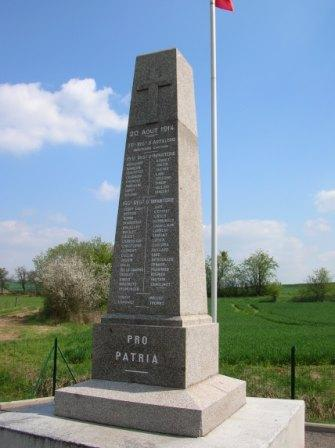
_Château-Bréhain : monument du 146e d’infanterie_
_Photo de l’auteur_

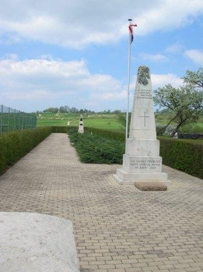
_Chicourt : ossuaire franco-allemand_
_Photo de l’auteur_

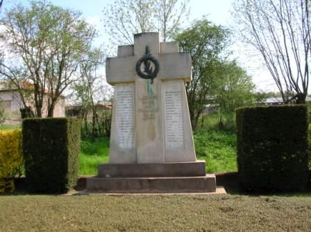
_Conthil : monument_
_Photo de l’auteur_

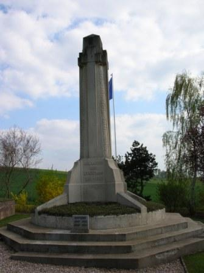
_Cutting : monument_
_Photo de l’auteur_

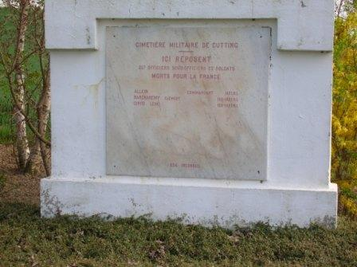
_Cutting : détail du monument_
_Photo de l’auteur_

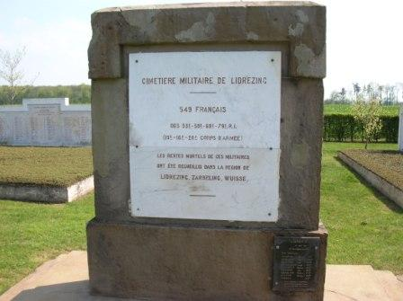
_Lidrezing : cimetière militaire français_
_Photo de l’auteur_

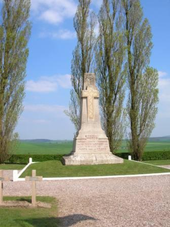
_Riche : monument_
_Photo de l’auteur_

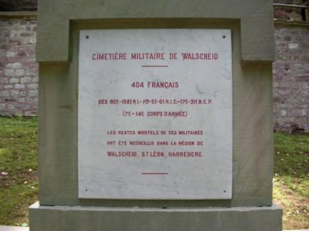
_Walscheid : cimetière militaire_
_Photo de l’auteur_

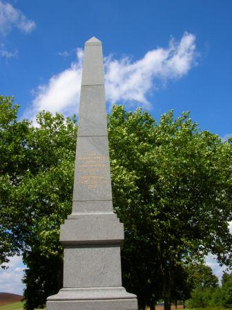
_Morhange - Monument commémoratif_
_Photo de l’auteur_

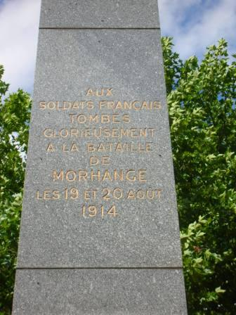
_Morhange - Monument commémoratif (détail)_
_Photo de l’auteur_

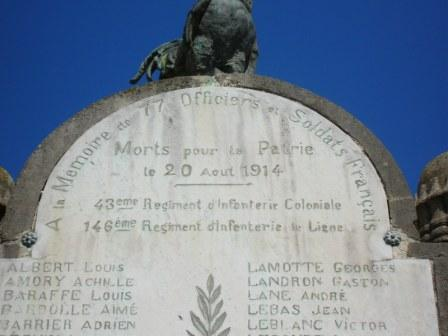
_Oron - Monument du 20e C.A._
_Photo de l’auteur_

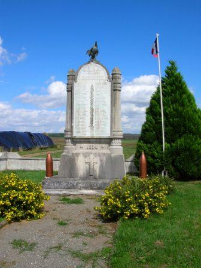
_Oron - Monument du 20e C.A._
_Photo de l’auteur_

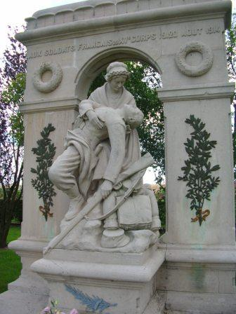
_Vergaville - Monument du 15e C.A._
_Photo de l’auteur_

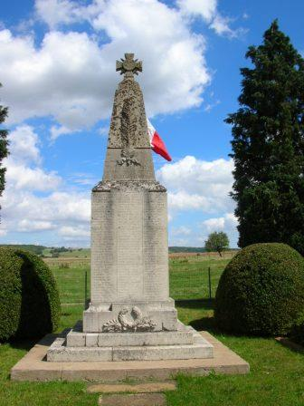
_Fremery - Monument commémoratif_
_Photo de l’auteur_
