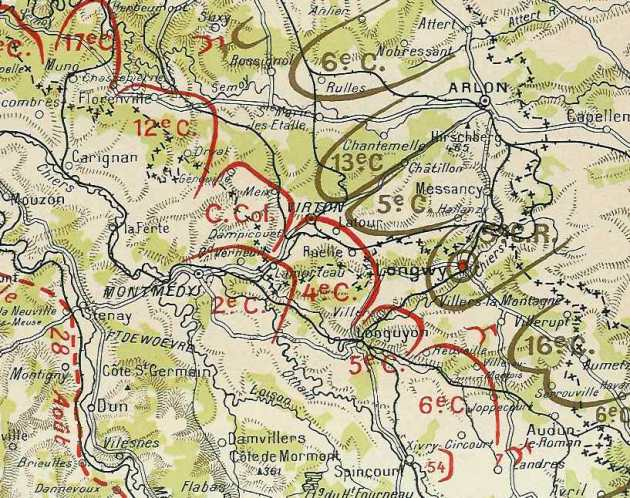
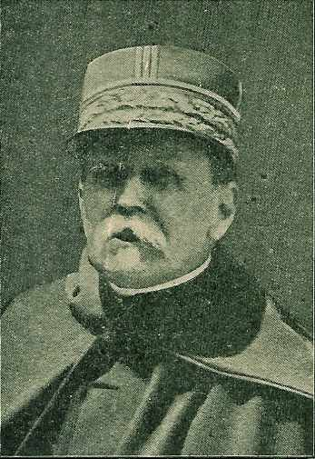
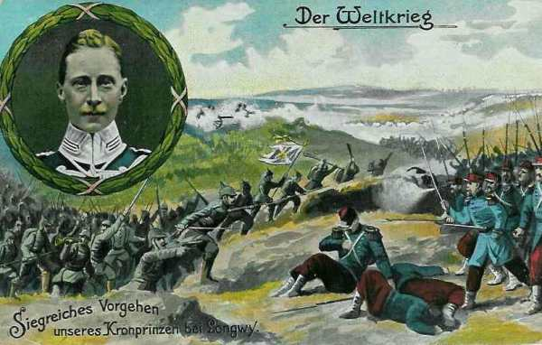
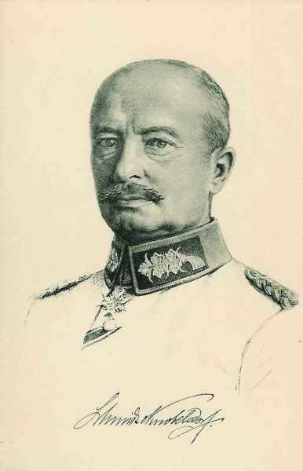
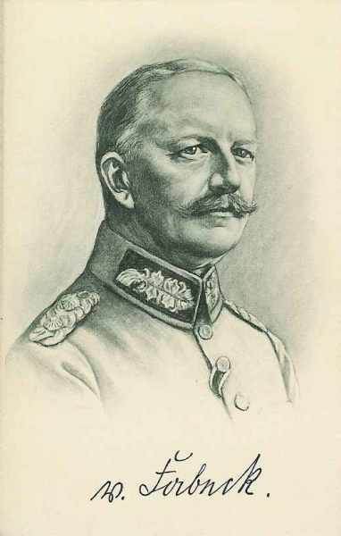
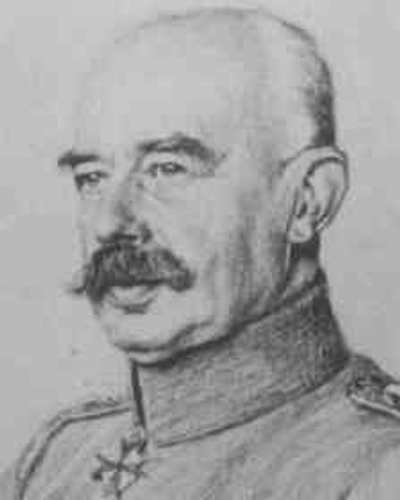
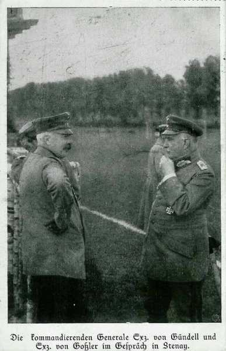
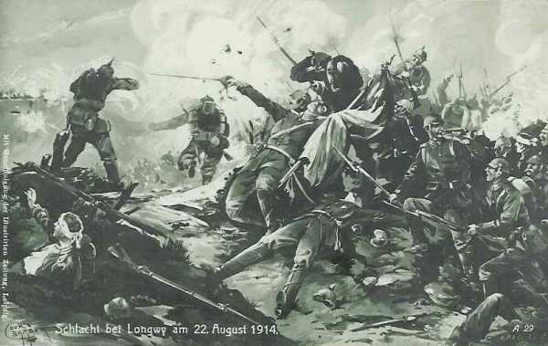
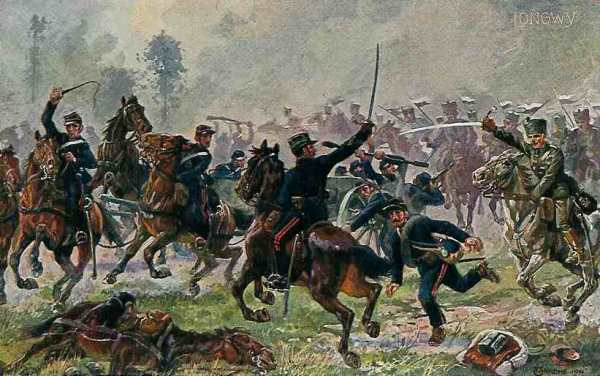
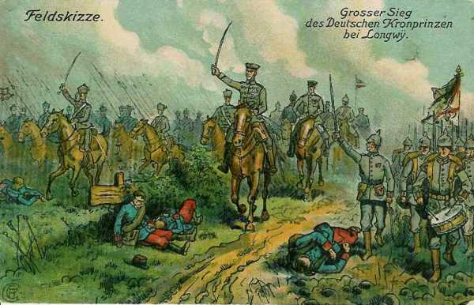

# Bataille de Longwy (22 - 23 août 1914)

Cette bataille met aux prises la IIIe armée française et la Ve armée allemande (kronprinz de Prusse). Le terrain n’est pas très favorable et est souvent caché par un épais brouillard. Quoique la Ve armée allemande dispose d’une notable supériorité en effectifs, le résultat reste indécis et constitue une entorse au plan de l’O.H.L. En effet, la Ve armée devait simplement suivre le mouvement de l’aile droite des armées allemandes, qui devait emporter la décision.

### Armées en présence

Cette bataille oppose la IIIe armée française (Ruffey) à la Ve armée allemande (Kronprinz de Prusse).

_Carte de la bataille de Longwy_
_La guerre racontée par les généraux_

### Les forces en présence

**Ordre de bataille de la IIIe armée française : général Ruffey**

_Général Ruffey (IIIe armée)_

Cette armée met en ligne les unités suivantes :

**4e C.A. (Le Mans) : général Boelle**

_Général Boëlle (4e C.A.)_
_La guerre du droit_

7e division : général de Trentinian

| Unité                   | Commandant | Régiments                                                                            |
| ----------------------- | ---------- | ------------------------------------------------------------------------------------ |
| 13e brigade             | de Favrot  | 101e R.I. (Saint-Cloud)102e R.I (Chartres, Paris)                                    |
| 14e brigade             | Félineau   | 103e R.I. (Alençon, Paris)104 R.I. (Argentan, Paris)                                 |
| Elements divisionnaires |            | 14e régiment de hussards (un escadron - Alençon)26e R.A.C. (trois groupes - Le Mans) |

8e division : général de Lartigue

| Unité                   | Commandant | Régiments                                                            |
| ----------------------- | ---------- | -------------------------------------------------------------------- |
| 15e brigade             |            | 124e R.I. (Laval)130e R.I. (Mayenne)                                 |
| 16e brigade             | Desvaux    | 115e R.I. (Mamers)117e R.I. (Le Mans)                                |
| Elements divisionnaires |            | 14e régiment de hussards (un escadron - Alençon)31e R.A.C. (Le Mans) |
| Réserves                |            | 315e R.I. (Mamers)317e R.I. (Le Mans)44e R.A.. (Le Mans)             |

**5e C.A. (Orléans) : général Brochin**

_Général Brochin (5e C.A.)_

9e division : général Peslin

| Unité                   | Commandant | Régiments                                                                                     |
| ----------------------- | ---------- | --------------------------------------------------------------------------------------------- |
| 17e brigade             | Marquet    | 4e R.I. (Auxerre)82e R.I. (Montargis)                                                         |
| 18e brigade             | Brissé     | 113e R.I. (Blois)131e R.I. (Orléans)                                                          |
| Eléments divisionnaires |            | 8e régiment de chasseurs à cheval (un escadron - Orléans)30e R.A.C. (trois groupes - Orléans) |

10e division : général Auger

| Unité                   | Commandant | Régiments                                                          |
| ----------------------- | ---------- | ------------------------------------------------------------------ |
| 19e brigade             | Gossart    | 46e R.I. (Fontainebleau, Paris)89e R.I. (Sens, Paris)              |
| 20e brigade             | Coudein    | 31e R.I. (Melun, Paris)76e R.I. Coulommiers, Paris)                |
| Eléments divisionnaires |            | 8e régiment de chasseurs à cheval (un escadron - Orléans)6e R.A.C. |
| Réserves                |            | 313e R.I. (Blois)331e R.I. (Orléans)45e R.A.C. (Orléans)           |

**6e C.A. (Châlons-sur-Marne) : général Sarrail**

_Général Sarrail (IIIe armée)_
_Collection privée_

12e division : général Souchier

| Unité                   | Commandant | Régiments                                      |
| ----------------------- | ---------- | ---------------------------------------------- |
| 23e brigade             | Huguet     | 54e R.I. (Compiègne)67e R.I. (Soissons)        |
| 24e brigade             | Gramat     | 106e R.I. 5châlons-sur-Marne)132e R.I. (Reims) |
| Eléments divisionnaires |            | 25e R.A.C. (trois groupes - Châlons-sur-Marne) |

40e division : général Hache

| Unité                   | Commandant | Régiments                                                                                                                                                                                   |
| ----------------------- | ---------- | ------------------------------------------------------------------------------------------------------------------------------------------------------------------------------------------- |
| 79e brigade             | Fonville   | 154e R.I. (Bar-le-Duc, Lérouville)155e R.I. (Châlons-sur-Marne, Commercy)26e bataillon de chasseurs à pied (Vincennes, Pont-à-Mousson)                                                      |
| 80e brigade             | Feraudy    | 150e R.I. (Soissons, Saint-Mihiel)160e R.I. (Neufchâtel, Toul)25e bataillon de chasseurs à pied (Epernay, Saint-Mihiel)29e bataillon de chasseurs à pied (Epernay, Saint-Mihiel)            |
| Eléments divisionnaires |            | 40e R.A.C. (Saint-Mihiel)                                                                                                                                                                   |
| Réserves                |            | 301e R.I. (Dreux, Paris)302e R.I. (Chartres, Paris)304e R.I. (Argentan, Paris)12e régiment de chasseurs à cheval (quatre escadrons - Saint-Mihiel)40e R.A.C. (trois groupes - Saint-Mihiel) |

**7e D.C. : général d’Urbal**

_Général d’Urbal (7e D.C.)_
_Collection privée_

| Unité                       | Commandant      | Régiments                                                                                                                 |
| --------------------------- | --------------- | ------------------------------------------------------------------------------------------------------------------------- |
| 6e brigade cuirassiers      | Taufflieb       | 11e régiment de cuirassiers (Saint-Germain)12e régiment de cuirassiers (Rambouillet)                                      |
| 1e brigade de dragons       | Chabaud         | 7e régiment de dragons (Rambouillet)13e régiments de dragons (Melun)                                                      |
| 7e brigade cavalerie légère | de Berseaucourt | 1e régiment de chasseurs à cheval (Châteaudun)20e régiment de chasseurs à cheval (Vendôme)12e régiment de hussards (Gray) |
|                             |                 | 30e R.A.C. (Orléans)                                                                                                      |
|                             |                 | 4e bataillon de chasseurs cyclistes (Brienne)                                                                             |

**3e groupe de divisions de réserve : général Paul Durand**

54e division de réserve : général Chailley

| Unité                   | Commandant        | Régiments                                                                                                           |
| ----------------------- | ----------------- | ------------------------------------------------------------------------------------------------------------------- |
| 107e brigade de réserve | Estève            | 301e R.I. de réserve(Dreux, Saint-Cloud)302e R.I. de réserve (Chartres, Paris)303e R.I. de réserve (Alençon, Paris) |
| 108e brigade de réserve | Buisson d’Armandy | 324e R.I. de réserve (Laval)330e R.I. de réserve (Mayenne)363e R.I. de réserve (Nice)                               |

55e division de réserve : général Leguay

| Unité                | Commandant  | Régiments                                                                                                                    |
| -------------------- | ----------- | ---------------------------------------------------------------------------------------------------------------------------- |
| 109e brigade réserve | Arrivet     | 204e R.I. de réserve (Auxerre)282e R.I. de réserve (Montargis)289e R.I. de réserve (Sens, Paris)                             |
| 110e brigade réserve | de Mainbray | 231e R.I. de réserve (Vitry-le-François)246e R.I. de réserve (Fontainebleau, Paris)276e R.I. de réserve (Coulommiers, Paris) |

56e division de réserve : général Micheler

| Unité                | Commandant | Régiments                                                                                                                        |
| -------------------- | ---------- | -------------------------------------------------------------------------------------------------------------------------------- |
| 111e brigade réserve | de Dartein | 294e R.I. de réserve (Bar-le-Duc)354e R.I. de réserve (Bar-le-Duc, Lérouville)355e R.I. de réserve (Châlons-sur-Marne, Commercy) |
| 112e brigade réserve | Cornille   | 350e R.I. de réserve (Soissons, Saint-Mihiel)351e R.I. de réserve (Cambrai, Saint- Mihiel)                                       |

**Ordre de bataille de la Ve armée allemande : kronprinz de Prusse**

_Carte en l’honneur du Kronprinz, commandant de la Ve armée_
_Collection privée_

Chef d’E.M. : le général Schmidt von Knobelsdorf

_Général Schmidt von Knobelsdorf (chef d’E.M. Ve armée)_
_Collection privée_

**5e C.A. (Posen) : général von Stranz**

_Général von Stranz (5e C.A.)_
_Collection privée_

9e division : général von Below

| Unité                     | Commandant | Régiments                                                                                                           |
| ------------------------- | ---------- | ------------------------------------------------------------------------------------------------------------------- |
| 17. Infanterie-Brigade    |            | Infanterie-Regiment Nr. 19 (Görlitz)3. Posensches Infanterie-Regiment Nr. 58 (Glogau)                               |
| 18. Infanterie-Brigade    |            | Grenadier-Regiment I (2. Westpreußisches) Nr. 7 (Liegnitz)5. Niederschlesisches Infanterie-Regiment Nr. 154 (Jauer) |
| Cavalerie divisionnaire   |            | Ulanen-Regiment Nr.1 (Potsdam)                                                                                      |
| 9. Feldartillerie-Brigade |            | Feldartillerie-Regiment Nr. 5 (Sprottau)2. Niederschlesisches Feldartillerie-Regiment Nr. 41 (Glogau)               |

10e division : général Kosch

| Unité                      | Commandant | Régiments                                                                                                |
| -------------------------- | ---------- | -------------------------------------------------------------------------------------------------------- |
| 19. Infanterie-Brigade     |            | Leib-Grenadier-Regiment Nr. 8 (Frankfurt an der Oder)Infanterie-Regiment Nr. 46 (Posen)                  |
| 20. Infanterie-Brigade     |            | Infanterie-Regiment Nr. 47 (Schrimm)3. Niederschlesisches Infanterie-Regiment Nr. 50 (Rawitsch)          |
| Cavalerie divisionnaire    |            | Regiment Königs-Jäger zu Pferde Nr. 1 (Posen)                                                            |
| 10. Feldartillerie-Brigade |            | 1. Posensches Feldartillerie-Regiment Nr. 20 (Posen)2. Posensches Feldartillerie-Regiment Nr. 56 (Lissa) |

**13e C.A. (Stuttgart) : général von Fabeck**

_Général von Fabeck (13e C.A.)_
_Collection privée_

26e division : général von Urach

| Unité                      | Commandant | Régiments                                                                                                          |
| -------------------------- | ---------- | ------------------------------------------------------------------------------------------------------------------ |
| 51. Infanterie-Brigade     |            | Grenadier-Regiment Nr. 119 (Stuttgart)Infanterie-Regiment Nr. 125 (Stuttgart)                                      |
| 52. Infanterie-Brigade     |            | Infanterie-Regiment Nr. 121 (Ludwigsburg)Füsilier-Regiment Nr. 122 (Heilbronn)                                     |
| Cavalerie divisionnaire    |            | Ulanen-Regiment Nr. 20 (Ludwigsburg)                                                                               |
| 26. Feldartillerie-Brigade |            | 2e Württemb. Feldartillerie-Regiment Nr. 29 (Ludwigsburg)4. Württemb. Feldartillerie-Regiment Nr. 65 (Ludwigsburg) |

27e division : général von Pfeil und Klein Ellguth

| Unité                                     | Commandant | Régiments                                                                       |
| ----------------------------------------- | ---------- | ------------------------------------------------------------------------------- |
| 53. Kgl. Württemb. Infanterie-Brigade     |            | Grenadier-Regiment Nr. 123 (Ulm)Infanterie-Regiment Nr. 124 (Weingarten)        |
| 54. Kgl. Württemb. Infanterie-Brigade     |            | Infanterie-Regiment Nr. 120 (Ulm)9. Württemb. Infanterie-Regiment Nr. 127 (Ulm) |
| Cavalerie divisionnaire                   |            | Ulanen-Regiment Nr. 19 (Ulm)                                                    |
| 27. Kgl. Württemb. Feldartillerie-Brigade |            | Feldart-Regiment Nr. 13 (Ulm)3. Württemb. Feldart-Regiment Nr. 49 (Ulm)         |

**16e C.A. (Metz) : général von Mudra**

33e division : général von Reitzenstein

| Unité                      | Commandant | Régiments                                                                                                      |
| -------------------------- | ---------- | -------------------------------------------------------------------------------------------------------------- |
| 66. Infanterie-Brigade     |            | Metzer Infanterie-Regiment Nr. 98 (Metz)1. Lothringisches Infanterie-Regiment Nr. 130 (Metz)                   |
| 67. Infanterie-Brigade     |            | 3. Lothringisches Infanterie-Regiment Nr. 135 (Thionville)5. Lothringisches Infanterie-Regiment Nr. 144 (Metz) |
| Cavalerie divisionnaire    |            | Jäger-Regiment zu Pferde Nr. 12 (Saint-Avold)                                                                  |
| 33. Feldartillerie-Brigade |            | 1e Lothringisches Feldartillerie-Regiment Nr. 33 (Metz)2. Lothringisches Feldartillerie-Regiment Nr. 34 (Metz) |

34e division : général von Heinemann

| Unité                      | Commandant | Régiments                                                                                                                       |
| -------------------------- | ---------- | ------------------------------------------------------------------------------------------------------------------------------- |
| 68. Infanterie-Brigade     |            | 4. Magdeburgisches Infanterie-Regiment Nr. 67 (Metz)Königs-Infanterie-Regiment Nr. 145 (Metz)                                   |
| 69. Infanterie-Brigade     |            | Infanterie-Regiment Nr. 30 (Saarlouis)9. Lothringisches Infanterie-Regiment Nr. 173 (Saint-Avold)                               |
| Cavalerie divisionnaire    |            | 2. Hannoversches Ulanen-Regiment Nr. 14 (Saint-Avold, Morhange)                                                                 |
| 34. Feldartillerie-Brigade |            | 3. Lothringisches Feldartillerie-Regiment Nr. 69 (Saint-Avold)4. Lothringisches Feldartillerie-Regiment Nr. 70 (Metz-Saarlouis) |

**5e C.A.R. (Posen) : général von Gündell**

_Général von Gündell (5e C.A.R.)_

9e div. rés. : général von Guretzky-Comitz

| Unité                          | Commandant | Régiments                                                          |
| ------------------------------ | ---------- | ------------------------------------------------------------------ |
| 17. Reserve-Infanterie-Brigade |            | Reserve-Infanterie-Regiment Nr. 6Reserve-Infanterie-Regiment Nr. 7 |
| 19. Reserve-Infanterie-Brigade |            | Reserve-Infanterie-Regiment Nr. 19Reserve-Jäger-Bataillon Nr. 5    |
| Cavalerie divisionnaire        |            | Reserve-Dragoner-Regiment Nr. 3                                    |
| Artillerie                     |            | Reserve-Feldartillerie-Regiment Nr. 9                              |

10. div.rés. : général von Wartenberg

| Unité                          | Commandant | Régiments                                                              |
| ------------------------------ | ---------- | ---------------------------------------------------------------------- |
| 77. Infanterie-Brigade         |            | Füsilier-Regiment Nr. 377. Westpreußisches Infanterie-Regiment Nr. 155 |
| 18. Reserve-Infanterie-Brigade |            | Reserve-Infanterie-Regiment Nr. 37Reserve-Infanterie-Regiment Nr. 46   |
| Cavalerie                      |            | Reserve-Ulanen-Regiment Nr. 6                                          |
| Artillerie                     |            | Reserve-Feldartillerie-Regiment Nr. 10                                 |

**6e C.A.R. (Breslau) : général von Gossler**

_Général von Gossler (à droite)_
_Collection privée_

11e div. rés. : général Suren

| Unité                          | Commandant | Régiments                                                                                   |
| ------------------------------ | ---------- | ------------------------------------------------------------------------------------------- |
| 23. Infanterie-Brigade         |            | Infanterie-Regiment (1. Oberschlesisches) Nr. 223. Schlesisches Infanterie-Regiment Nr. 156 |
| 21. Reserve-Infanterie-Brigade |            | Reserve-Infanterie-Regiment Nr. 10Reserve-Infanterie-Regiment Nr. 11                        |
| Cavalerie                      |            | Reserve-Husaren-Regiment Nr. 4                                                              |
| Artillerie                     |            | Reserve-Feldartillerie-Regiment Nr. 11                                                      |

12e div. rés. : général von Lüttwitz

| Unité                          | Commandant | Régiments                                                                                         |
| ------------------------------ | ---------- | ------------------------------------------------------------------------------------------------- |
| 22. Reserve-Infanterie-Brigade |            | Reserve-Infanterie-Regiment Nr. 23Reserve-Infanterie-Regiment Nr. 38Reserve-Jäger-Bataillon Nr. 6 |
| 23. Reserve-Infanterie-Brigade |            | Reserve-Infanterie-Regiment Nr. 22Reserve-Infanterie-Regiment Nr. 51                              |
| Cavalerie                      |            | Reserve-Ulanen-Regiment Nr. 4                                                                     |
| Artillerie                     |            | Reserve-Feldartillerie-Regiment Nr. 12                                                            |

**4e C.C. : général von Hollen**

3. D.C. : général von Unger

| Unité                                 | Commandant | Régiments                                                          |
| ------------------------------------- | ---------- | ------------------------------------------------------------------ |
| 16. Kavallerie-Brigade                |            | Jäger-Regt zu Pferde Nr 7 (Trier)Jäger-Regt zu Pferde Nr 8 (Trier) |
| 22. Kavallerie-Brigade                |            | Dragoner-Regt. Nr 5 (Hofgeismar)                                   |
| Husaren-Regt. Nr 14 (Cassel)          |
| 25. Kavallerie-Brigade                |            | Garde-Dragoner-Regt. (Darmstadt),                                  |
| Leib-Dragoner-Regt. Nr 24 (Darmstadt) |
|                                       |            | Bataillon du Feldartillerie-Regt. Nr 11 (Cassel)                   |
| MG. Abtg. Nr. 2 (Trier)               |

6. D.C. : général von Schmettow

| Unité                  | Commandant | Régiments                                                                     |
| ---------------------- | ---------- | ----------------------------------------------------------------------------- |
| 28. Kavallerie-Brigade |            | Badisches Leib-Dragoner-Regt Nr 20 (Karlsruhe)Dragoner-Regt. Nr 21 (Bruchsal) |
| 33. Kavallerie-Brigade |            | Dragoner-Regt. Nr 9 (Metz)Dragoner-Regt. Nr 13 (Metz)                         |
| 45. Kavallerie-Brigade |            | Husaren-Regt. Nr 13 (Diedenhofen)Jäger-Regt zu Pferde Nr 13 (Saarlouis)       |
|                        |            | Bataillon du Feldartillerie-Regt. Nr 8 (Saarbrücken)                          |
| MG. Abtg. Nr. 6 (Metz) |

- 9e, 13e, 53e et 53e brigades de la Landwehr

Au total,le double de l’armée française qui lui est opposée.

### 22 août

**[Lien vers croquis](../img/bataille_ardennes2.jpg)**

_Bataille de Longwy_
_Collection privée_

**5e C.A. allemand - 4e C.A. français**

**[Combat de Virton](article_07_94.md)**

Le 5e C.A. allemand part vers 04h. Au débouché de la forêt, dans la clairière de Virton, il se heurte vers 7h à l’infanterie du 4e C.A français. Dans des combats très rapprochés, les deux infanteries subissent de lourdes pertes. Quand le brouillard se dissipe commence une lutte d’artillerie. Le combat reste indécis.

**13e C.A. allemand - 5e C.A. français**

Le C.A., alerté à la nouvelle de l’arrivée des colonnes françaises par l’ouest de Longwy, se met en marche vers la Chiers dès 6h du matin.

En plein brouillard, il se heurte, à l’ouest de Longwy, à l’offensive du 5e C.A. français. Vers 11h, le brouillard se dissipe et l’artillerie allemande réussit à faire reculer les Français.

**6e C.A.R. allemand - 12e et 42e D.I. françaises**

La marche vers la Crusnes s’effectue sans incident. La prise de contact avec la 12e D.I. française a lieu vers 10h. La résistance française est telle qu’elle ne peut pas être surmontée par l’emploi de l’artillerie lourde, pourtant un atout de l’armée allemande, car l’artillerie de campagne française marque sa supériorité. L’après-midi, la gauche du C.A. allemand est en pleine déroute, mais le 5e C.A. arrive sur le champ de bataille entre le 6e C.A.R. et le 16e C.A. qu’il aide à s’emparer de Fillières.

Le centre se heurte à la 42e D.I. française dans Ville-au-Monthois. Les avant-gardes atteignent la Crusnes, leur objectif.

**16e C.A. allemand - 40e D.I. française**

Il prend contact avec les Français vers 12h après une longue marche. Sa division de droite se heurte à la 40e D.I. française dans Fillières et Mercy-le-Haut. Des combats acharnés durent jusqu’à la nuit. La division de gauche reçoit l’ordre d’envelopper la droite française à Mercy-le-Haut mais le mouvement traîne considérablement. Les défenseurs français de Mercy-le-Haut échappent à l’encerclement.

_Hussards allemands s’emparant d’une batterie_
_Collection privée_

Après de rudes combats livrés à Virton, Doncourt, Ville-au-Monthois et Mercy-le-Haut, l’E.M. de la Ve armée pense que les Français attaqueront le lendemain et décide de rester sur la défensive.

Le soir du 22, le Kronprinz de Prusse apprend le succès à Rossignol et cette information l’incite à revenir sur son ordre.

Il reçoit un message du G.Q.G. : « La Ve armée a la liberté de mouvement. manoeuvre à poursuivre : rejeter l’ennemi par le nord de Verdun, en direction de l’ouest."

### 23 août

A 7h25, le Kronprinz lance l’ordre de poursuivre les Français, mais ses troupes sont épuisées par les combats de la veille.

**5e C.A. allemand - 4e C.A. français**

Il demeure toute la journée immobilisé sur ses positions par un tir violent et bien ajusté des batteries du 4e C.A. établies au sud de virton.

**13e C.A. allemand - 5e C.A. français**

Il commence son mouvement à 10h50 et trouve le champ de bataille jonché de morts, de blessés et de bagages abandonnés par le 5e C.A. français, mais il ne parvient pas à la coupure de la Chiers, sa division de droite est arrêtée par le feu de l’artillerie de la 8e D.I. française.

**6e C.A.R. allemand**

Il passe la matinée à remettre de l’ordre dans ses troupes battues la veille et ne part qu’à 15h. Sa division de droite entre le soir dans Longuyon, celle de gauche ne peut rentrer à Doncourt et atteindre la Crusnes.

**5e C.A.R. allemand**

Le C.A. reste toute la journée sur la Crusnes. Seule l’aile gauche peut obtenir quelques résultats.

**16e C.A. et 6e D.C. allemande**

Vu le rassemblement de troupes françaises entre Spincourt et Etain, von Mudra ordonne de prendre une position d’attente face au sud.

### Conclusion

Vu que Rupprecht de Bavière venait de remporter la victoire de Sarrebourg - Morhange, le kronprinz de Prusse voulait également remporter un succès et est passé à l’offensive contre l’avis de von Moltke. Les résultats ne répondirent pas à son attente et cette initiative constitua une entorse au plan stratégique allemand.

_Le kronprinz après la bataille de Longwy_
_Collection privée_
