# Bataille de Charleroi (21 - 23 août 1914)

La bataille de charleroi est la rencontre entre le Ve armée française et les IIe et IIIe armées allemandes. La IIe progresse vers la Sambre et la IIIe tente de franchir la Meuse. La Ve armée française est ainsi attaquée de deux côtés à la fois et doit retraiter après deux journées de combat.

### Circonstances de la bataille

Suite à la violation du territoire belge par l’armée allemande, Lanrezac craint que son armée soit encerclée par l’ouest. Il obtient l’accord du G.Q.G. de remonter jusqu’à la Sambre en territoire belge. Il y rencontre la IIe armée allemande qui converge vers le sud et la IIIe armée allemande qui progresse vers l’ouest, en cherchant à franchir la Meuse.

### Le terrain

**[Lien vers carte région Charleroi - Namur](../img/charleroi_namur.jpg)** c Michelin, d’après carte n°4, édition 112-3741 - autorisation 05-B-18

La Sambre est le principal affluent de la Meuse. Cette rivière coule d’abord du sud-ouest au nord-est puis, à artir de Charleroi, elle devient encore plus sinueuse et se dirige peu à peu vers l’ouest jusqu’à Namur où elle se confond avec la Meuse.

L’ensemble de la région qu’elle parcourt est très peuplé, surtout dans les environs de Charleroi où l’industrie a pris un grand développement. Les maisons succèdent aux maisons ; les murs en briques noircies bordent partout la vue.  Des terrils s’élèvent par endroits.

La Sambre est un obstacle insignifiant en raison du grand nombre de ponts qui la traversent et de son peu de profondeur. La défense est plutôt possible sur les crêtes qui dominent la rivière au nord comme au sud, que dans la vallée où les habitations, les obstacles de tout genre masquent les vues et facilitent les progrès de l’attaque.

_Position des armées le 23 août 1914_
_Général Niox La grande guerre_

**[Lien vers croquis - position des unités](../img/bataille_charleroi.jpg)**

### Les forces en présence

**Ordre de bataille de la Ve armée française**, commandée par le général de division Lanrezac,
Chef d’E.M. : général de brigade Hély d’Oissel.

_Général Lanrezac (Ve armée)_
_Collection privée_

**1e C.A. (Lille) : général Franchet d’Esperey**

_Général Franchet d’Esperey (1e C.A.)_
_Collection privée_

1e division : général Gallet

| Unité | Commandant | Régiments |
| --- | --- | --- |
| 1e brigade | de Fonclare | 43e R.I. (Lille)127e R.I. (Valenciennes) |
| 2e brigade | Sauret | 1e R.I. (Cambrai)84e R.I. (Avesnes, Le Quesnoy, Landrecies) |
| Elements divisionnaires |  | 6e régiment de chasseurs à cheval (un escadron - Lille)15e R.A.C. (Douai) |

2e division : général Duplessis

| Unité | Commandant | Régiments |
| --- | --- | --- |
| 3e brigade | Bernard | 33e R.I. (Arras)73e R.I. (Béthune) |
| 4e brigade | Doyen | 8e R.I. (Saint-Omer)110e R.I. (Dunkerque) |
| Eléments divisionnaires |  | 6e régiment de chasseurs à cheval (un escadron - Lille)27e R.A.C. (Saint-Omer, Aire-sur-Lys) |
| Réserves |  | 201e R.I. (Cambrai)284e R.I. (Avesnes-sur-Helpe)1e régiment d’artillerie à pied (Maubeuge, Dunkerque) |

**3e C.A. (Rouen) : général Sauret**

5e division : général Verrier

| Unité | Commandant | Régiments |
| --- | --- | --- |
| 9e brigade | Tassin | 39e R.I. (Rouen, Dieppe)74e R.I. (Rouen) |
| 10e brigade | Lautier | 36e R.I. (Caen)129e R.I. (Le Havre) |
| Elements divisionnaires |  | 7e régiment de chasseurs à cheval (un escadron - Evreux)43e R.A.C. (Caen) |

6e division : général Pétain

| Unité | Commandant | Régiments |
| --- | --- | --- |
| 11e brigade | Hollender | 24e R.I. (Bernay, Paris)28e R.I. (Evreux, Paris) |
| 12e brigade | Lavisse | 5e R.I. (Falaise, Paris)119e R.I. (Lisieux, Courbevoie) |
| Eléments divisionnaires |  | 7e régiment de chasseurs à cheval (un escadron - Evreux)22e R.A.C. (Versailles) |
| Réserves |  | 239e R.I. (Rouen)274e R.I. (Rouen)11e R.A.C. (Rouen) |

**10e C.A. (Rennes) : général Defforges**

_Général Defforges_

19e division : général Bailly

| Unité | Commandant | Régiments |
| --- | --- | --- |
| 37e brigade | Pierson | 48e R.I. (Guingamp)71e R.I. (Saint-Brieuc) |
| 38e brigade | Passaga | 41e R.I. (Rennes)70e R.I. (Vitré) |
| Elements divisionnaires |  | 13e régiment de hussards (un escadron - Dinan)7e R.A.C. (Rennes) |

20e division : général Rogerie

| Unité | Commandant | Régiments |
| --- | --- | --- |
| 39e brigade | Ménissier | 25e R.I. (Cherbourg)136e R.I. (Saint-Lô) |
| 40e brigade | de Cadoudal | 2e R.I. (Granville)47e R.I. (Saint-Malo) |
| Eléments divisionnaires |  | 13e régiment de hussards (un escadron - Dinan)10e R.A.C. (Rennes) |
| Réserves |  | 241e R.I. (Rennes)270e R.I. (Vitré)50e R.A.C. (Rennes) |

**18e C.A. (Bordeaux) : général de Mas-Latrie**

_Général de Mas Latrie (18e C.A.)_
_Collection privée_

35e division : général Excelmans

| Unité | Commandant | Régiments |
| --- | --- | --- |
| 69e brigade | Durand | 6e R.I. (Saintes / Doé de Mandreville)123e R.I. (La Rochelle / Hubert) |
| 70e brigade | Pierron | 57e R.I. (Rochefort, Libourne / Dapoigny)144e R.I. (Bordeaux / Gauthier) |
| Elements divisionnaires |  | 10e régiment de hussards (un escadron - Tarbes)24e R.A.C. (La Rochelle / Dunal) |

36e division : général Jouannic

| Unité | Commandant | Régiments |
| --- | --- | --- |
| 71e brigade | Dion | 34e R.I. (Mont-de-Marsan / Capdepont)49e R.I. (Bayonne / Burgala) |
| 72e brigade | Sibille | 12e R.I. (Tarbes / De Sèze)18e R.I. (Pau / Gloxin) |
| Eléments divisionnaires |  | 10e régiment de hussards (un escadron - Tarbes)14e R.A.C. (Tarbes / Vincent du Portail) |
| Réserves |  | 218e R.I. (Pau)249e R.I. (Bayonne) |

**Eléments d’armée**

37e division : général Comby

| Unité | Commandant | Régiments |
| --- | --- | --- |
| 73e brigade | Degot | régiment de marche du 2e zouaves (Oran)régiment de marche du 3e zouaves (Batna) |
| 74e brigade | Le Bouhélec | régiment de marche du 2e tirailleurs (Mostaganem)régiment de marche du 3e tirailleurs (Constantine, Bône) |
| Elements divisionnaires |  | 6e régiment de chasseurs d’Afrique (Mascara)2e groupe d’artillerie d’Afrique (Oran) |

38e division : général Schwartz

| Unité | Commandant | Régiments |
| --- | --- | --- |
| 75e brigade | Vuillemin | régiment de marche du 1e zouaves (Alger)régiment de marche du 1e tirailleurs (Blida) |
| 76e brigade | Bertin | régiment de marche du 4e zouaves (Tunis)régiment de marche du 4e tirailleurs (Sousse)8e régiment de tirailleurs (Bizerte) |
| Eléments divisionnaires |  | 5e régiment de chasseurs d’Afrique (Alger)32e R.A.C. (trois groupes - Orléans, Fontainebleau) |

**4e groupement de divisions de réserve : général Valabrègue**

53e division de réserve : général Journée

| Unité | Commandant | Régiments |
| --- | --- | --- |
| 105e brigade de réserve | Montangon | 205e R.I. (Falaise, Paris)236e R.I. (Caen)319e R.I. (Lisieux, Courbevoie) |
| 106e brigade | Masson | 224e R.I. (Laval)226e R.I. (Toul, Nancy)329e R.I. (Le Havre)27e régiment de dragons (Versailles)11e R.A.C. (un groupe - Rouen)22e R.A.C. (un groupe - Versailles)43e R.A.C. (un groupe - Caen)) |

69e division de réserve : général Néraud

| Unité | Commandant | Régiments |
| --- | --- | --- |
| 138e brigade | Piguet | 251e R.I. (Beauvais)254e R.I. (Compiègne)267e R.I. (Soissons)5e régiment de dragons (deux escadrons - Compiègne)28e R.A.C. (un groupe - Vannes)35e R.A.C. (un groupe - Vannes)44e R.A.C. (un groupe - Le Mans)46e R.A.C. (un groupe - Camp de Châlons)50e R.A.C. (neuf batteries - Rennes) |

**Ordre de bataille de la IIe armée allemande**, commandée par le generaloberst von Bülow.
Chef d’Etat-Major : Generalleutnant von Lauenstein.

_Général von Bülow (IIe armée)_
_Collection privée_

**7e C.A. (Münster) : General der Infanterie von Einem**

_Général von Einem (7e C.A.)_
_Collection privée_

13e division d’infanterie : général von dem Borne

| Unité | Commandant | Régiments |
| --- | --- | --- |
| 25. Infanterie-Brigade |  | Infanterie-Regiment Nr. 13 (Münster)7. Lothringisches Infanterie-Regiment Nr. 158 (Paderborn) |
| 26. Infanterie-Brigade |  | Infanterie-Regiment Nr. 15 (Minden)Infanterie-Regiment Nr. 55 (Detmold)Westfälisches Jäger-Bataillon Nr. 7 (Bückeburg) |
| Cavalerie divisionnaire |  | Stab u. 3.Eskadron/Ulanen-Regiment Nr. 16 (Salzwedel) |
| 13. Feldartillerie-Brigade |  | 2. Westfälisches Feldartillerie-Regiment Nr. 22 (Münster)Mindensches Feldartillerie-Regiment Nr. 58 (Minden |

14e division d’infanterie : général Fleck

| Unité | Commandant | Régiments |
| --- | --- | --- |
| 27. Infanterie-Brigade |  | Infanterie-Regiment Nr. 16 (Cologne)5. Westfälisches Infanterie-Regiment Nr. 53 (Cologne) |
| 79. Infanterie-Brigade |  | Infanterie-Regiment Nr. 56 (Wesel)Infanterie-Regiment  Nr. 57 (Wesel) |
| Cavalerie divisionnaire |  | 3.Eskadron/Ulanen-Regiment Nr. 16 (Salzwedel) |
| 14. Feldartillerie-Brigade |  | 1. Westfälisches Feldartillerie-Regiment Nr. 7 (Wesel, Dusseldorf)Klevesches Feldartillerie-Regiment Nr. 43 (Wesel) |

**10e C.A. (Hannover) : General der Infanterie von Emmich**

_Général von Emmich (10e C.A.)_
_Collection privée_

19e division d’infanterie : général Hofmann

| Unité | Commandant | Régiments |
| --- | --- | --- |
| 37. Infanterie-Brigade |  | Infanterie-Regiment Nr. 78 (Osnabrück)Oldenburgisches Infanterie-Regiment Nr. 91 (Oldenburg) |
| 38. Infanterie-Brigade |  | Füsilier Regiment Nr. 73 (Hannover)1. Hannoversches Infanterie-Regiment Nr. 74 (Hannover) |
| Cavalerie divisionnaire |  | 3. Eskadron/Braunschweigisches Husaren-Regiment Nr. 17 (Braunschweig) |
| 19. Feldartillerie-Brigade |  | 2. Hannoversches Feldartillerie-Regiment Nr. 26 (Verden)Ostfriesisches Feldartillerie-Regiment Nr. 62 (Oldenburg) |

20. division d’infanterie : général Schmundt

| Unité | Commandant | Régiments |
| --- | --- | --- |
| 39. Infanterie-Brigade |  | Infanterie-Regiment Nr. 79 (Hildesheim)4. Hannoversches Infanterie-Regiment Nr. 164 (Hameln)Hannoversches Jäger-Bataillon Nr. 10 (Goslar) |
| 40. Infanterie-Brigade |  | 2. Hannoversches Infanterie-Regiment Nr. 77 (Celle)Braunschweigisches Infanterie-Regiment Nr. 92 (Braunschweig) |
| Cavalerie divisionnaire |  | Stab und "1/2"-Regiment/Braunschweigisches Husaren-Regiment Nr. 17 (Braunschweig) |
| 20. Feldartillerie-Brigade |  | Feldartillerie-Regiment Nr. 10 (Hannover)Niedersächsisches Feldartillerie-Regiment Nr. 46 (Wolfenbüttel) |

**C.A. de la Garde (Berlin) : General der Infanterie von Plettenberg**

_Général von Plettenberg (Garde)_
_Collection privée_

1. division d’infanterie de la Garde : général von Hutier

| Unité | Commandant | Régiments |
| --- | --- | --- |
| 1. Garde-Infanterie-Brigade |  | 1. Garde-Regiment zu Fuss (Berlin)3. Garde-Regiment zu Fuss (Berlin)Garde-Jäger-Bataillon (Potsdam) |
| 2. Garde-Infanterie-Brigade |  | 2. Garde-Regiment zu Fuss (Berlin)4. Garde-Regiment zu Fuss (Potsdam) |
| Cavalerie divisionnaire |  | Leib-Garde-Husaren-Regiment (Potsdam) |
| 1. Garde-Feldartillerie-Brigade |  | 1. Garde-Feldartillerie-Regiment (Berlin)2. Garde-Feldartillerie-Regiment (Potsdam) |

2. division d’infanterie de la Garde : général von Winckler

| Unité | Commandant | Régiments |
| --- | --- | --- |
| 3. Garde-Infanterie-Brigade |  | Garde-Grenadier-Regiment Nr 1(Berlin)Garde-Grenadier-Regiment Nr 3 (Berlin)Garde-Schützen-Bataillon (Berlin) |
| 4. Garde-Infanterie-Brigade |  | Garde-Grenadier-Regiment Nr 2 (Berlin)Garde-Grenadier-Regiment Nr 4 (Berlin) |
| Cavalerie divisionnaire |  | 2. Garde-Ulanen-Regiment (Berlin) |
| 2. Garde-Feldartillerie-Brigade |  | 2. Garde-Feldartillerie-Regiment (Potsdam)4. Garde-Feldartillerie-Regiment (Potsdam) |

**7e C.A.R  (Münster) : General der infanterie von Zwehl**

_Général von Zwehl (7e C.A.R.)_
_Collection privée_

13e division d’infanterie de rés. : général von Kühne

| Unité | Commandant | Régiments |
| --- | --- | --- |
| 25. Reserve-Infanterie-Brigade |  | Reserve-Infanterie-Regiment Nr. 13Reserve-Infanterie-Regiment Nr. 56 |
| 28. Reserve-Infanterie-Brigade |  | Reserve-Infanterie-Regiment Nr. 39Reserve-Infanterie-Regiment Nr. 57Reserve-Jäger-Bataillon Nr. 7 |
| Cavalerie |  | Reserve-Husaren-Regiment Nr. 5 |
| Artillerie |  | Reserve-Feldartillerie-Regiment Nr. 13 |

14e division d’infanterie de rés. : général von Unger

| Unité | Commandant | Régiments |
| --- | --- | --- |
| 28. Infanterie-Brigade |  | Niederrheinisches Füsilier-Regiment Nr. 398. Lothringisches Infanterie-Regiment Nr. 159 |
| 27. Reserve-Infanterie-Brigade |  | Reserve-Infanterie-Regiment Nr. 16Reserve-Infanterie-Regiment Nr. 53 |
| Cavalerie |  | Reserve-Husaren-Regiment Nr. 8 |
| Artillerie |  | Reserve-Feldartillerie-Regiment Nr. 14 |

**10e C.A.R. (Hannover) : General der Infanterie von Kirchbach**

_Général von Kirchbach (10e C.A.R.)_
_Collection privée_

2e div. infanterie de rés. de la Garde : général von Süsskind

| Unité | Commandant | Régiments |
| --- | --- | --- |
| 26. Reserve-Infanterie-Brigade |  | Westfälisches Reserve-Infanterie-Regiment Nr. 15Westfälisches Reserve-Infanterie-Regiment Nr. 55 |
| 38. Reserve-Infanterie-Brigade |  | Hannoversches Reserve-Infanterie-Regiment Nr. 77Hannoversches Reserve-Infanterie-Regiment Nr. 91Hannoversches Reserve-Jäger-Bataillon Nr. 10 |
| Cavalerie divisionnaire |  | Reserve-Ulanen-Regiment Nr. 2 |
| Artillerie |  | Reserve-Feldartillerie-Regiment Nr. 20 |
| 19e division d’infanterie de réserve de la Garde | von Bahrfeldt |  |

**C.A.R. de la Garde (Berlin) : General der Artillerie von Gallwitz**

_Général von Gallwitz (C.A. de réserve de la. Garde)_
_Collection privée_

3e division infanterie de la Garde : général von Bonin

| Unité | Commandant | Régiments |
| --- | --- | --- |
| 5. Garde-Infanterie-Brigade |  | 5. Garde-Regiment zu FußGarde-Grenadier-Regiment Nr. 5 |
| 6. Garde-Infanterie-Brigade |  | Garde-Füsilier-RegimentLehr-Infanterie-Regiment |
| Cavalerie |  | Garde-Reserve-Ulanen-Regiment |
| 3. Garde-Feldartillerie-Brigade |  | 5. Garde-Feldartillerie-Regiment6.Garde-Feldartillerie-Regiment |

1e division infanterie de réserve de la Garde : général Albrecht

| Unité | Commandant | Régiments |
| --- | --- | --- |
| 1. Garde-Reserve-Infanterie-Brigade |  | 1. Garde-Reserve-Infanterie-Regiment2. Garde-Reserve-Infanterie-RegimentGarde-Reserve-Jäger-Bataillon |
| 15. Reserve-Infanterie-Brigade |  | Garde-Reserve-Infanterie-Regiment Nr. 64Garde-Reserve-Infanterie-Regiment Nr. 93Garde-Reserve-Schützen-Bataillon |
| Cavalerie divisionnaire |  | Garde-Reserve-Dragoner-Regiment |
| Garde-Reserve-Feldartillerie-Brigade |  | 1. Garde-Reserve-Feldartillerie-Regiment3.Garde-Reserve-Feldartillerie-Regiment |

La IIIe armée allemande, sous le commandant du Generaloberst von Hausen, interviendra surtout par son 19e C.A. (von Laffert), qui traversera la Meuse en prenant la Ve armée en tenaille.

### 20 août

Une instruction du G.Q.G. parvient à la Ve armée, constatant que tout confirme chez l’ennemi l’intention de déborder l’armée française par le nord. L’objectif de la Ve armée est d’attaquer ces forces, en même temps que les IIIe et IVe armées à l’est de la Meuse.

Le général Lanrezac arrête les dispositions suivantes pour l’offensive qui lui est ordonnée : la Ve armée va se porter en avant dans l’intervalle entre Namur et Nivelles.

- A sa droite, le 1e C.A. gardera les passages de la Meuse, jusqu’à la relève par la division Boutegourd. Il se portera ensuite entre Namur et Sart-Saint-Laurent, en détachant à Namur un régiment actif, pour venir en aide aux Belges assiégés.

- Le 10e C.A. organisera la défense du front Fosses - Vitrival - Sart-Eustache.

- Le 3e C.A. s’opposera au débouché de l’armée allemande sur Châtelet et tiendra Nalinnes - Tarcienne, au sud de charleroi.

- Le 18e C.A. bordera le front Ham-sur-Heure - Gozée - Thuin.

- Le corps des divisions de réserve aura sa gauche au sud-est de Maubeuge et sa droite à Solre-le-Château.

En résumé, la Ve armée exécute les mouvements préparatoires à une offensive dont le résultat est de l’établir sur une ligne allant de Namur à Thuin. Le groupe Valabrègue la prolongera jusqu’à Cousolre au sud de Maubeuge.

L’offensive de la Ve armée dépend entièrement de celle des IVe et IIIe car dans son mouvement vers la Sambre et à plus forte raison au nord de celle-ci, Lanrezac va prêter le flanc droit aux Allemands. La division Boutegourd est insuffisante pour interdire le passage de la Meuse. Si, comme c’est arrivé, les IVe et IIe armées sont obligées à un arrêt ou à un mouvement rétrograde, l’offensive du général Lanrezac est paralysée.

Au sud de Charleroi, le 3e C.A. se tient à gauche du 10e C.A. et porte ses têtes de colonnes jusqu’à Villers-Poterie - Joncret - Jamioulx pour pouvoir déboucher en direction de Fleurus ou de Gosselies. Il tient par ses avant-postes la rive droite de la Sambre : de Pont-de-Loup à Marchienne-au-Pont.

- A droite, la 5e division d’infanterie garde les ponts de la Sambre de Montignies à Pont-de-Loup, cherchant à Roselies la liaison avec le 10e C.A. Son gros se situe dans la région de Acoz - Villers-Poterie - Gerpinnes - Tarcienne - Somzée.

- La 6e division d’infanterie tient Loverval et les Haies, gardant les ponts de la Sambre de Montignies à Marchienne-au-Pont. Son gros est dans la région de Jamioulx - Nalinnes - Thuillies - Marbaix.

- En amont de Charleroi, le 3e C.A. se garde par des avant-postes sur la Sambre, en attendant l’entrée en ligne du 18e C.A., qui continue ses débarquements. La tête est à Beaumont, le Q.G. à Solre-le-Château.

Une division allemande semble marcher sur Wavre. A l’ouest de Charleroi, le C.C. Sordet vient stationner dans la matinée à l’est de Fontaine-l’Evêque jusqu’au canal Mons-Charleroi. L’état des chevaux rend un repos indispensable.

### 21 août

Joffre ordonne à la Ve armée d’attaquer le groupement allemand du nord. Comme tous ses C.A. ne sont pas encore rassemblés, Lanrezac décide de s’établir défensivement au sud de la Sambre. Il interdit de s’aventurer dans les fonds de la vallée et compte attaquer le 22 par sa droite (1e et 10e C.A.) pour profiter de l’appui du canon de la place de Namur, mais la IIe armée allemande se rabat vers le sud et prend l’initiative d’attaquer les deux C.A. en flèche (10e et 3e). L’objectif est de s’emparer des ponts de Tamines, Auvelais et Châtelet.

**[Lien vers croquis](../img/bataille_charleroi2-2.jpg)**

Le Ve armée a ses avant-gardes de Namur à Thuin. Elle est prête à franchir la Sambre, mais est obligée de laisser un C.A. sur la Meuse, entre Givet et Namur, pour se flanc-garder, tant que la IVe armée n’aura pas franchi la Lesse.

Dans la matinée du 21, le Ve armée achève son déploiement au sud de la Sambre et réalise le dispositif suivant :

- 1e C.A. : garde la Meuse entre Revin et Namur. Le 348e régiment d’infanterie tient la Meuse de Fumay à Agimont, la 1e division d’infanterie d’Hermeton à Anseremme, la 2e division d’infanterie d’Anseremme à Anhée, la 8e brigade d’Yvoir à Profondeville.

- En arrière, la 51e division de réserve (Boutegourd) stationne dans la région d’Olloy-sur-Viroin - Matagne-la-Petite et doit venir relever le 22 ou 23 août les 1e et 2e divisions d’infanterie.

- 10e C.A. doit s’opposer au débouché de l’armée allemande sur la rive droite de la Sambre à l’ouest de Namur. Sa cavalerie, le 6e chasseurs d’Afrique et le 13e hussards, est répartie à la garde des ponts de la Sambre à Floriffoux, Franière, Mornimont et Jemeppe. A la 19e division (général Bonnier), la 38e brigade est entre le château de Taravisée et Arsimont, la 37e brigade près de Haut-Vent-du-Bois et de Mazuys. L’artillerie est sur la croupe d’Arsimont (cote 190).

- 3e C.A. a la même mission et se trouve à gauche (ouest) du 10e C.A.

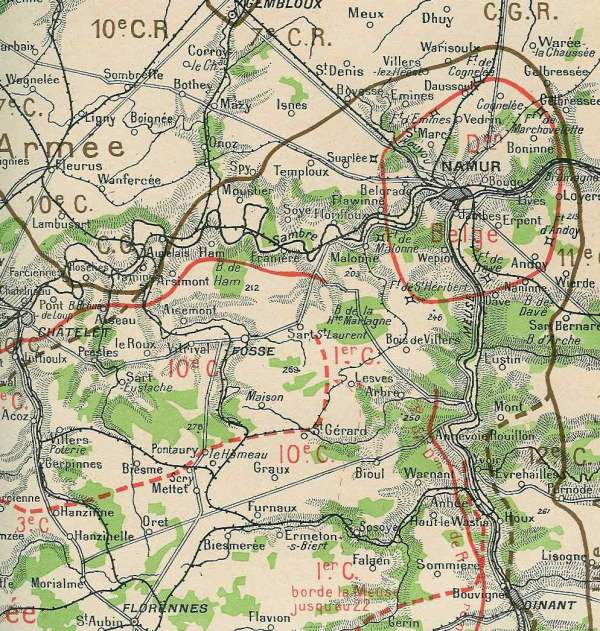
_Secteur des 10e et 1e C.A._
_La guerre racontée par les généraux_

- 18e C.A. s’opposera au débouché des Allemands sur le front de Thuin - Marchienne-au-Pont. L’avant-garde est sur le front de Thuin - Gozée. En ce moment, ce C.A., prélevé sur l’armée de Castelnau (Ie) débarque à Avesnes et Hirson et la tête s’achemine vers Thuin.

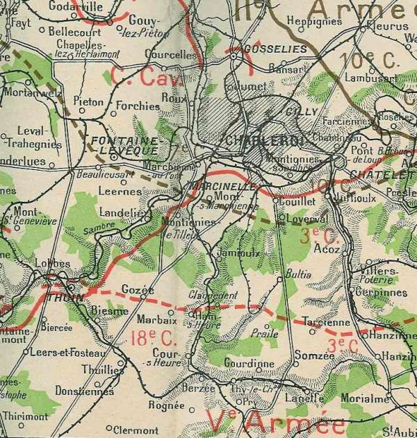
_Secteur des 3e et 18e C.A._
_La guerre racontée par nos généraux_

·-C.C. : est dans la région de Fontaine-l’Evêque - Courcelles avec des éléments à Gosselies et Fleurus. Il couvre la gauche de la Ve armée.

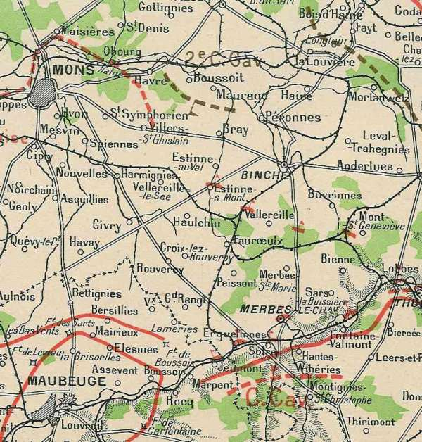
_Secteur du C.C. Sordet_
_La guerre racontée par nos généraux_

Les forces anglaises sont aux postes suivants :

- La 5e brigade de cavalerie est vers Binche.
  Le 2e C.A. est à l’ouest de Maubeuge ; la 3e division est à Goegnies, la 5e est à Bavai.
  La 1e division est à Avesnes.
  La 2e division arrive dans la région de Noyelles.

La 4e division, maintenue jusqu’à présent en Angleterre, sur ordre de Lord Kitchener, va s’embarquer et rejoindre l’armée le 27 ou 28 août.

A la gauche de l’armée anglaise, les divisions territoriales d’Amade établissent un barrage de Maubeuge à Dunkerque, sans pouvoir offrir une grande résistance à une sérieuse attaque d’infanterie.

Les avant-postes qui tiennent les ponts dans la vallée de la Sambre n’ont pas l’ordre de résister aux colonnes de toutes armes, mais simplement d’arrêter les incursions éventuelles de cavalerie.

**10e C.A.**

**12h45 :**

L’avant-garde du 10e C.A. est attaquée dans la boucle de Tamines et d’Auvelais par l’infanterie de la Garde. Les Allemands sont repoussés. Plusieurs batteries allemandes s’installent bientôt sur la hauteur du Bois-du-Curé et canonnent les fonds de la Sambre. Les bois sur la rive nord de la Sambre confèrent aux Allemands un gros avantage par rapport aux Français qui se trouvent dans le fond de la vallée, facilement repérables et sans protection.

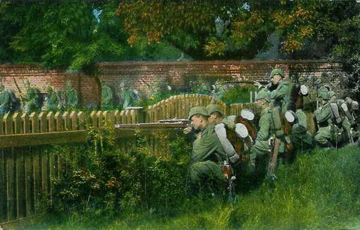
_L’infanterie allemande progresse dans une localité_
_Collection privée_

**14h :**

Une nouvelle attaque se produit sur Auvelais et Tamines. Les forces allemandes franchissent la Sambre à Auvelais et progressent vers Arsimont et Falisolle. Les ponts de Tamines et de Ham restent aux mains des Français.

**21h :**

Arsimont doit être abandonné. Le régiment qui a tenu les ponts de Ham-sur-Sambre, Mornimont et Franière, bat en retraite dès 20h sur Fosses.

**[Combat d’ Arsimont](article_07_91.md)**

Pour appuyer la gauche de la 19e division, la 20e division a l’ordre de diriger une brigade sur Vitrival et une autre sur Aiseau - Falisolle. Elle doit tenir le front Fosse - Vitrival. A sa gauche, la 20e division tiendra la ligne Vitrival - le Roux.

Le 71e R.I. contre-attaque mais ne peut pénétrer dans Auvelais, où les Allemands se sont retranchés, et cherche à contourner la localité.

Du côté français, la liaison est insuffisante entre l’artillerie et l’infanterie.

La nuit venue, le régiment se retire sur Arsimont et Aisemont. Il a perdu 16 officiers et 560 hommes. Vers 21h15, les Allemands prennent Arsimont et la 19e division organise une position de repli au sud, sur le front Aisemont - Cortil-Mozet. Ainsi, la moitié du 10e C.A., fortement engagée, a déjà subi des pertes marquées. Les Allemands restent maîtres de la Sambre.

**3e C.A.**

Sur le front du 3e C.A., les avant-postes ont été attaqués vers 15h à Pont-de-Loup et aux ponts de Châtelet.

Dans la banlieue de Charleroi, les artilleurs français ont peu de vues ; les obus sont de peu d’effet sur les maisons et les murs en briques. Les ponts ont été laissés intacts en vue de l’offensive et ne sont gardés que par de faibles fractions. La Sambre est à peine un obstacle dans la région et les Allemands ont pu ainsi s’infiltrer rapidement au sud de la rivière.

**17h25 :**

Lanrezac prescrit « de tenir les ponts par des postes et de les renforcer dès que l’ordre d’offensive entre Namur et Nivelles serait donné ».

**19h30 :**

Les Allemands (10e C.A.) forcent le passage de la Sambre à Roselies et réussissent à mettre pied dans Aiseau. Par Farciennes, ils gagnent Châtelet. Les troupes qui gardent Pont-de-Loup (au nord-est de Châtelet) sont entièrement tournées.

La 38e brigade (division Bonnier) rend compte qu’en raison des pertes subies, elle renonce à défendre Aisemont et se replie sur Cortil-Mozet.

Un bataillon du 74e reçoit l’ordre de reprendre Roselies par une attaque qui doit se dérouler en pleine nuit. Aiseau est réoccupé à minuit. Une première tentative sur Roselies échoue ; une seconde, avec quatre bataillons frais, réussit un instant mais aboutit à un repli généralisé. Les Allemands s’étaient bien retranchés dans les maisons et tiraient à bout portant sur les français qui attaquaient en terrain découvert, sans un appui suffisant d’artillerie.

**18e C.A.**

Devant le 18e C.A., les Allemands n’ont manifesté aucune activité. Une position défensive est organisée sur la ligne Thuin - Gozée - Ham-sur-Heure. Le 10e hussards et de l’infanterie gardent les ponts de la Sambre entre Thuin et Marchienne-au-Pont.

**C.C. Sordet**

Dans l’après-midi, les divisions du C.C. Sordet doivent abandonner les passages du canal de Charleroi, de Luttre à Pont-à-Celles, et se replier sur Gouy-lez-Piéton.

**17h15 :**

La 11e brigade d’infanterie (général Hollender) reçoit l’ordre de se porter en soutien du C.C. Transportée en autobus, elle atteint vers 22h le front Fontaine-l’Evêque - Anderlues - Les Trieux, pour y subir les attaques du 7e C.A. allemand. Elle subit de fortes pertes.

**Dans l’après-midi :**

La D.C. se porte sur le front Trazegnies - Chapelle-lez-Herlaimont. La 1e division détache la 5e brigade de dragons au nord de Courcelles. Finalement, la retraite de la 3e division sur Carnières oblige la gauche de la 1e à se replier sur Piéton. Par une longue marche de nuit, le C.C. se porte dans la région de Solre-sur-Sambre.

**Intentions de Joffre et de Lanrezac :**

Joffre maintient son intention d’effectuer une offensive vers Nivelles, de même que Lanrezac.

- Le 1e C.A., renforcé par la brigade Mangin (2e C.A.) et le 10e C.A. est la 37e division doivent attaquer énergiquement à l’ouest de Namur.

- Les 3e et 18e C.A., renforcés par les divisions de réserve du général Valabrègue, maintiendront l’adversaire sur le front Ham-sur-Heure - Fontaine-l’Evêque et assureront la liaison avec l’armée anglaise. Cette dernière est encore vers Saint-Aubin - Saint-Hilaire - Landrecies et ne pourra donc pas participer à l’offensive.

### 22 août : contre-attaques françaises

Les ordres de Lanrezac sont de tenir ferme sur les positions de la Sambre. Les 3e et 10e C.A. supportent tout le poids de la bataille.

Devant les menaces qui planent sur les villes du Nord, comme Lille, Roubaix, Tourcoing, une quatrième division territoriale est mise à la disposition de d’Amade pour couvrir la place de Lille.

Le 22 au matin, tous C.A. de la Ve armée sont en ligne.

**1e C.A.**

Au 1e C.A., la 2e brigade se porte sur Sart-Saint-Laurent pour y organiser une position permettant de tenir les ponts de Floreffe à Floriffoux, en se reliant à Namur.

A 4h du matin, la 51e division de réserve (Boutegourd) porte son gros dans la zone d’Anhée - Rosée - Flavion. Elle relève la 1e brigade qui se porte vers Ermeton-sur-Biert.

La 51e division de réserve reçoit ordre de relever dans la soirée la 2e division d’infanterie sur le front Anseremme -Bouvignes, qui ira s’établir en fin de journée sur la ligne Warnant - Haut-le-Wastia - Sommière.

La 8e brigade (Mangin) continue à garder la Meuse d’Anhée à Profondeville.

Dans la nuit et la matinée, le 12e C.A. saxon a lancé des attaques sur les ponts de Dinant et d’Anseremme. La 51e division de réserve opère normalement la relève de la 1e brigade et de la 2e division sur la Meuse au nord de Givet jusqu’à Bouvignes.

Franchet d’Espérey demande à Lanrezac l’autorisation de faire sauter les ponts en ne conservant que ceux de Givet, Hastière et Dinant. A 14h45, Lanrezac marque son accord en ce qui concerne les ponts. Il prescrit à Franchet d’Espérey de renforcer la position de Sart-Saint-Laurent.

Les ponts d’Anseremme, de Bouvignes, de Houx sautent mais celui de Dinant est conservé sans véritable raison.

**10e C.A.**

Contrairement aux instructions de Lanrezac, les commandants de C.A. tentent de refouler les Allemands au nord de la Sambre et d’en réoccuper les passages.

Ainsi, dans la nuit, le général Defforges a donné les ordres suivants :

**Au point du jour :**

La 19e division (Bonnier) attaquera dans la direction d’Arsimont - Auvelais, son artillerie étant groupée sur Cortil-Mozet.

La 20e division (Boë) marchera sur Tamines, à gauche de la précédente. Elle aura son artillerie au nord de Le Roux.

**5h30 :**

La 20e division entame l’attaque sur Falisolle, en liaison avec le 3e C.A. vers Aiseau. Les fonds de la Sambre sont encore voilés d’une brume matinale, de sorte que l’artillerie ne peut utilement soutenir l’attaque. Celle-ci est opérée par les 25e et 136e régiments.

La 19e division se rassemble de grand matin à cheval sur la route de Fosses à Tamines. L’attaque est déclenchée vers 8h30, à cause de la brume. Elle est amorcée par les 71e, suivi du 2e bataillon du 41e, dont la 5e compagnie réoccupe Ham.

**11h :**

La résistance allemande devient vive et l’artillerie et les mitrailleuses ouvrent un feu violent, obligeant les tirailleurs à se replier sur le bois de Ham, puis vers Fosses. Les avions allemands survolent les troupes françaises d’une manière incessante pour régler le tir de l’artillerie. Aucun avion français ne se montre. Sur la demande du général Bonnier, le 3e zouaves entame une attaque sans plus de succès.

_Soldats allemands mettant une mitrailleuse en batterie_
_Collection privée_

Le mouvement de repli du 10e C.A. commence vers 11h. La division Boë se replie vers le sud et la division Bonnier prend pour objectif de retraite les hauteurs de Cortil-Mozet. Les tirailleurs attaquent vers Arsimont pour dégager les bataillons bretons.

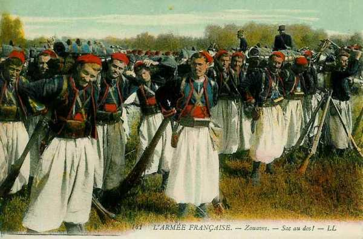
_Zouaves_
_Collection privée_

**13h :**

Les Allemands, après une puissante préparation d’artillerie, lancent une première attaque vers la ferme de Belle-Motte. Un groupe d’artillerie de la division Boë les rejette. Une seconde attaque suit. Les Allemands, arrêtés pendant une heure par les feux, finissent par déboucher. La 20e division est débordée à l’est et à l’ouest, par les ruisseaux de Presles et de Falisolle. Elle se retire sur Sart-Eustache (6 km au sud de la Sambre).

Les Allemands montrent peu de mordant dans leur poursuite. La division Bonnier se replie sur Fosses - Vitrival. Les éléments de la 38e brigade restés à Arsimont couvrent la retraite puis se retirent à leur tour.

**19h :**

Après un nouveau recul, la division est à cheval sur la route de Fosse à Saint-Gérard.

Les Allemands rentrent dans Fosses vers 20h, après avoir été arrêtés par une fusillade.

**3e C.A.**

**Dans la matinée :**

La division Verrier tient Presles - Champs-Borniaux - Loverval. De petites fractions gardent encore les ponts de la Sambre, mais elles ont ordre de se replier en cas d’attaque. Les positions sont masquées par les habitations, les murs, les obstacles de tout genre et les approches sont très faciles.

**9h45 :**

Les Allemands s’emparent de Bouffioux, au sud de Châtelet ; la 9e brigade recule, puis la 10e. La 6e division, diminuée de la brigade Hollender (soutien du C.C. Sordet), reçoit l’ordre de soutenir la 5e et renouvelle les tentatives pour refouler les Allemands vers la Sambre. La 38e division intervient à son tour. La 75e brigade (Schwartz) a pour mission de prononcer une attaque de Binche sur Châtelet. Un bataillon du 39e attaque à l’est de Bouffioulx et un bataillon du 36e marche vers l’ouest de Châtelet.

La brigade Schwartz comprend le 1e zouaves et le 1e tirailleurs algériens. L’attaque vers Châtelet est déclenchée vers 11h avant que l’artillerie ait pu produire un effet suffisant. Les troupes se heurtent à un ennemi embusqué derrière des murailles et dans les maisons. Il ouvre un feu de mitrailleuses et de fusil à très courte portée. Les pertes sont énormes : le 1e tirailleurs perd 70% de son effectif. Les survivants hésitent puis refluent en désordre.

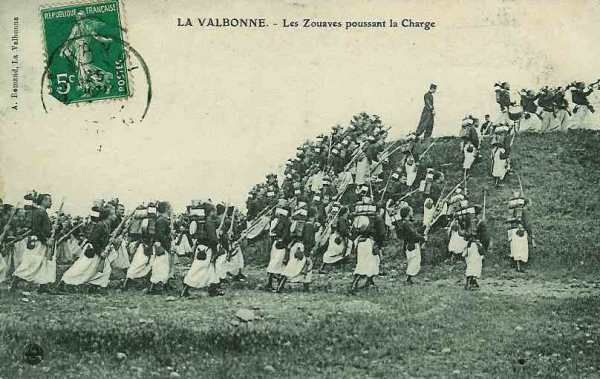
_Charge de zouaves_
_Collection privée_

**13h :**

La brigade se résigne à l’abandon des approches de Charleroi. La 75e brigade et la 6e division ont ordre de se reporter sur la ligne Presles - Binche de façon à contenir les Allemands au sortir de Châtelet.

**16h45 :**

Nouveau repli de la 6e division sur la ligne Tarcienne - La Presle - Claquedent. La 5e division est à cheval sur la route Hanzinne - Hanzinelle (10 km au sud de la Sambre).

Les Allemands ne débouchent pas de Châtelet, laissant aux troupes françaises le temps de se dégager.

Le soir, la 6e division est à Nalinnes, la 5e vers Tarcienne - Hanzinelle, soit 8 km au sud de la Sambre.

Le général Sauret donne l’ordre, en fin de journée, à la 5e division de reprendre Roselies par une attaque de nuit (74e R.I., 129e R.I. et 25e R.I.).

**[Combat de Roselies](article_07_90.md)**

**18e C.A.**

Le 18e C.A. organise la ligne Ham-sur-Heure - Gozée - Thuin et garde les ponts de la Sambre entre Thuin et Marchienne-au-Pont.

La 35e division reste stationnée dans la région Beaumont - Cousolre - Hestrud, en tenant les ponts de Merbes-le-Château et de Fontaine-Valmont.

**Dans la soirée :**

La 36e division continue à tenir le front de Ham-sur-Sambre à Thuin.

Ainsi, le 18e C.A. est au sud de la Sambre au lieu d’être vers Fontaine-l’Evêque ou Binche, sur la route de Charleroi à Mons comme y compte le général Lanrezac. De ce fait, il se produit un vide entre la Ve armée et les troupes britanniques.

La brigade Hollender est restée au nord de la Sambre jusqu’au soir. Elle reçoit l’ordre de se replier sur Lobbes.

**[Combat de Carnières](article_07_93.md)**

Les 3e et 5e divisions se relient à la 5e brigade de cavalerie anglaise l’une vers Binche, l’autre vers Buvrinnes.

**Au lever du jour :**

La 11e brigade d’infanterie se retire sur la ligne Trieux - Anderlues (entre Charleroi et Binche). Vers 10h, la 11e  brigade est attaquée au nord de Mont-Sainte-Geneviève par une force d’infanterie et d’artillerie venant de Piéton.

**C.C. Sordet**

Au C.C. Sordet, la 11e brigade d’infanterie se trouve aux prises à partir de 13h avec des forces supérieures et se replie au sud de la Sambre dont elle tient les ponts entre Thuin et Fontaine-Valmont. Ce repli entraîne les 3 divisions de cavalerie au sud de la Sambre.

Sordet donne les ordres suivants :

- Le 3e D.C. s’opposera aux colonnes débouchant de Binche en se retirant s’il y a lieu, par la route de Binche, Merbes-le-Château.

- La 11e brigade s’efforcera de tenir jusqu’à la nuit les positions qu’elle occupe, puis elle se dérobera  en direction de Mont-Sainte-Geneviève -Lobbes et s’établira sur la rive droite de la Sambre, gardant les ponts entre Lobbes et Fontaine-Valmont.

- La 5e division retraitera par Fontaine-Valmont sur la Buissière.

- La 1e D.C. passera la Sambre à Merbes et Erquelinnes.

### 23 août

Les ordres sont de tenir sur les positions du 22 août.

**1e C.A.**

Le C.A. est libéré de la garde de la Meuse. Il compte agir sur le flanc les Allemands qui attaquent le 10e C.A.
La 2e division (général Deligny) quitte les environs de Weillen. La 1e division (général Gallet) est vers Sart-Saint-Laurent pour soutenir le 10e C.A. La 4e brigade (colonel Pétain) est vers Bioul en réserve de C.A.

**9h30 :**

Le 1e C.A. reçoit l’ordre d’envoyer la brigade Deligny moins le 8e régiment sur Saint-Gérard, Maison. Après une sérieuse préparation d’artillerie, le général Deligny va ordonner l’attaque quand il reçoit l’ordre de garder la défensive. L’offensive de la division Gallet s’arrête également.

**10h :**

Les Allemands ouvrent une violente canonnade sur les troupes d’Afrique.

**14h :**

Les Allemands passent à l’attaque. Les divisions Ménissier et Comby supportent le choc. Il s’en suit un combat confus entre Wagnée et Oret. A la fin de la journée, la division Ménissier garde ses positions au sud de Wagnée ; la division Bonnier bivouaque dans le ravin de Furnaux. Les français conservent donc la route de Bioul à Walcourt. Vers 21h, la division Bonnier se replie au sud du ravin, entre Biesmerée et Stave, exposant le 1e C.A. à un danger sérieux.

Le général Franchet d’Espérey se porte sur Dinant avec la brigade Mangin et va se heurter à l’armée de von Hausen. Le 1e C.A. a reçu l’ordre de forcer le passage de la Meuse à Houx (32e division) et à Dinant (23e division). A droite, le 12e C.A.R. doit s’emparer d’Yvoir.

Depuis le 15 août (voir combat de Dinant), Dinant n’avait pas été attaqué. Le 1e C.A. avait organisé la rive gauche : le pont était barré par un réseau de fils de fer. Le faubourg Saint-Médard était fortement occupé, ainsi que la route de Dinant à Onhaye. De même à Hastière, on avait coupé les routes au moyen d’abattis et de barricades. Deux mitrailleuses battaient le pont, gardé par une section du 348e. Ordre était donné de détruire le pont en cas d’attaque.

La 23e division allemande attaque Dinant par les quatre routes de Lisogne, ciney, Montagne-Saint-Nicolas et Bosseilles. La configuration des lieux est en faveur de l’assaillant : les crêtes de la rive est dominent celles de la rive ouest, ce qui permet un tir plongeant. Les Français peuvent difficilement s’abriter et sont soumis au tir de l’artillerie et des mitrailleuses.

En même temps, la garnison d’Hastière est attaquée sur la rive droite. Les Allemands commencent à passer la Meuse à Waulsort, par petites fractions, qui refoulent deux sections du 208e. A Anseremme, le pont n’avait pas été détruit complètement et quelques éléments peuvent passer sur la rive gauche en repoussant d’autres fractions du 208e. Un petit groupement allemand peut se former à Onhaye.

**17h :**

Franchet d’Espérey apprend que les Allemands viennent de passer à Houx et à Dinant. Il décide de replier son C.A. vers le sud et de le disposer sur la ligne grand route d’Hermeton à Anthée, où il continuera à couvrir la droite de l’armée.

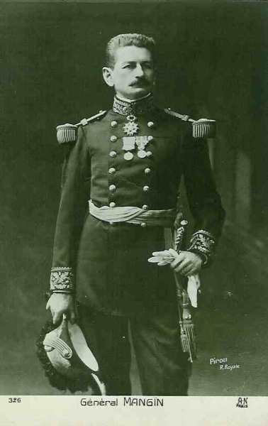
_Général Mangin_
_Collection privée_

Vers 17h, Mangin, arrivé dans la région d’Anthée, lance sur Onhaye les deux bataillons de sa brigade et trois bataillons de la 53e division. A 19h30, Onhaye est enlevé. Dans la soirée, les Allemands se sont infiltrés dans ce pays coupé et boisé au sud de la route Dinant, Philippeville.

**3e C.A.**

Le 3e C.A. a comme mission de défendre la position Hanzinelle - Tarciennes - Nalinnes, pour gagner le temps nécessaire à l’offensive de la droite française. La division Verrier est à droite d’Hanzinelle, la division Muteau au centre et la division Bloch au sud de Nalinnes.

Les Allemands utilisent un ravin débouchant dans la vallée de l’Heure pour marcher par Linsoury sur Pairain contre la gauche du 3e C.A. L’artillerie de ce dernier est sur les crêtes vers Chastres et Fraire-lez-Walcourt. Vers 16h, après un combat indécis, la division Bloch fléchit. Le général Sauret d’abord, se retire dans la région de Vogenée, Silenrieux puis la retraite finit par s’étendre à tout le 3e C.A. Les Allemands utilisent uniquement leur artillerie et leur attaque d’infanterie ne se produit que le soir. Une contre-attaque de la division Muteau contient cette offensive et les troupes françaises peuvent gagner la hauteur vers Yves-Gomezée. A la  nuit se produit un désordre indescriptible dans les masses entre Silenrieux et Walcourt.

**18e C.A.**

**[Combat de Lobbes](article_07_92.md)**

Ce secteur a été relativement épargné jusqu’au 23, ce qui explique que le C.A. se trouve encore le long de la Sambre.

Ce C.A. doit défendre la ligne Ham-sur-Heure - Gozée - Thuin sans s’engager dans la vallée de la Sambre. La 36e division tient cette ligne et doit maintenir la liaison avec le 3e C.A. tout en gardant les ponts de Fontaine-Valmont et de Lobbes. La brigade Hollender lui est provisoirement adjointe et se reconstitue dans la région de Biercée. La 35e division est en réserve au sud du bois de Fontaine-Valmont, prête à prolonger la 35e à l’ouest.

69e division de réserve est vers Montignies-Saint-Christophe et doit rejoindre la gauche du 18e C.A.

**11h :**

Les Allemands dessinent une attaque sur le pont de Lobbes. Le général de Mas-Latrie prescrit une contre-attaque de la 35e division au nord est de Leers-et-Fosteau si les Allemands prennent position sur la rive droite.

Le pont de Lobbes est enlevé vers 13h à la brigade Hollender et de vifs combats s’engagent sur tout le front de la 36e division. Gozée est chaudement disputé et les Allemands progressent lentement.

**19h :**

Après une vive canonnade, une offensive se produit et Gozée et Marbaix sont pris et la liaison avec le 3e C.A. Le 18e C.A. continue toutefois à tenir Biesme et Thuin. Le pont de Fontaine-Valmont, un instant perdu, est repris.

**21h :**

Le combat se ralentit. A minuit, la 36e division est dans la région de Thuillies - Strée ; la 35e autour de Leers-et-Fosteau, la 11e brigade vers Ragnies.

Pour conserver l’unité du front, les troupes reçoivent l’ordre de se retirer légèrement, la droite vers Clermont, en liaison avec le 3e C.A. qui s’est porté sur Walcourt. La 35e division reste vers Ragnies - Thuillies, la 36e va vers Beaumont. A gauche, le groupe des divisions de réserve tient la Sambre, sa droite à Hautes-Wihéries.

**C.C. Sordet**

Le C.C. continue de garder les ponts de la Sambre depuis celui de Jeumont. A 16h30, les batteries du C.C., en surveillance au nord de Merbes-le-Château, ouvrent le feu sur une colonne allemande attaquant Fontaine-Valmont. Le C.C. a pour mission de quitter la Ve armée dans le courant de la journée pour rejoindre la gauche de l’armée anglaise. Il doit stationner le soir même au nord et à l’est de Maubeuge mais hommes et chevaux sont épuisée après la randonnée en Belgique. A 17h, la 69e division de réserve relève la 1e division le long de la Sambre. Le C.C. se met en mouvement dans la soirée. Le C.C. s’arrête en pleine nuit dans la région de Beaufort.

**Groupe Valabrègue**

Sa mission est d’empêcher le passage de la Sambre. Il occupe les hauteurs bordant cette rivière au sud vers Montignies et Sartiau. La 69e division est à Merbes-le-Château. Il gardera les ponts de la Sambre avec des postes légers, chargés d’arrêtes les incursions de cavalerie. Vers 17h, on apprend que le 18e C.A. a perdu Leers-et-Fosteau et qu’il faut le soutenir vers Thirimont. La 69e division se porte donc vers cette localité, ce qui crée un vide entre le groupe Valabrègue et l’armée anglaise.

Lanrezac vient d’apprendre l’abandon de Namur par sa garnison, les échecs de la division Boutegourd sur la Meuse (les Allemands appartenant à la droite de la IIe armée ont pu installer une tête de pont sur la rive ouest)

- Il doit prescrire à 21h un repli sur la ligne Givet - Philippeville - Maubeuge vu la situation générale sur le front de la Ve armée :
  La position fortifiée de Namur est en train de céder et à la droite de la Ve armée, la IVe armée est en retraite vers le front Mézières - Verdun. A la gauche, les Anglais ont devant eux des forces considérables.

- Le 1e C.A. n’est plus couvert vers le nord par la place de Namur.

- La ligne de défense nord et nord-est de la position fortifiée a été forcée. La position devient intenable et, dans la matinée, le général Michel, commandant de la place, décide de replier ses troupes vers Bois-de-Villers.

- Sur la Meuse, l’armée allemande a prononcé des attaques à Bouvignes et à Dinant. La pression s’accentue sur le front Dinant, Ermeton. L’infanterie allemande franchit la Meuse vers Lenne et oblige la 102e brigade à battre en retraite sur Gérin.

- Le 3e C.A. n’a pas tenu et s’est replié sur Walcourt.

L’armée aurait à se défendre sur place en saillant, entre Sambre et Meuse et la situation paraît le 23 au soir, assez grave pour nécessiter un repli le 24 dès l’aube, afin de constituer un front rectiligne et homogène, sur la ligne Givet - Maubeuge.

Lanrezac rend compte de sa décision à Joffre.

C’est la première étape d’une retraite de 300 km, qui aboutira le long de la Marne.

### Autres récits relatifs à la bataille de Charleroi

**[Combat de Roselies](article_07_90.md)**

**[Combat d’ Arsimont](article_07_91.md)**

**[Combat de Carnières](article_07_93.md)**

**[Combat de Lobbes](article_07_92.md)**

### Régiments ayant participé à la bataille

Dans ce chapitre sont détaillées les opérations des régiments qui ont participé à la bataille

**[1e R.I. (Cambrai)](article_09_107.md)**

**[2e R.I. (Granville)](article_09_108.md)**

**[5e R.I. (Falaise)](article_09_111.md)***

**[6e R.I. (Saintes, Oléron)](article_09_112.md)**

**[8e R.I. (Saint-Omer)](article_09_114.md)**

**[12e R.I. (Tarbes)](article_09_118.md)**

**[24e R.I. (Paris, Aubervillers)](article_09_130.md)**

**[25e R.I. (Cherbourg, Saint-Vaast-la-Hougue)](article_09_131.md)**

**[28e R.I. (Evreux, Paris)](article_09_134.md)*

**[33e R.I. (Arras)](article_09_139.md)**

**[34e R.I. (Mont-de-Marsan)](article_09_140.md)**

**[39e R.I. (Rouen, Dieppe)](article_09_145.md)**

**[41e R.I. (Rennes)](article_09_147.md)**

**[45e R.I. (Laon)](article_09_151.md)**

**[47e R.I. (Saint-Malo)](article_09_153.md)**

**[48e R.I. (Guingamp)](article_09_154.md)**

**[49e R.I. (Bayonne)](article_09_155.md)**

**[57e R.I. (Rochefort, Libourne)](article_09_162.md)**

**[70e R.I. (Vitré)](article_09_175.md)**

**[71e R.I. Saint-Brieuc)](article_09_176.md)**

**[73e R.I. (Béthune)](article_09_178.md)**

**[74e R.I. (Rouen, Elbeuf)](article_09_179.md)**

**[84e R.I. (Avesnes, Le Quesnoy, Landrecies)](article_09_189.md)**

**[110e R.I. (Dunkerque)](article_09_215.md)**

**[119e R.I. (Lisieux, Courbevoie)](article_09_224.md)**

**[123e R.I. (Saint-Martin de Ré)](article_09_228.md)**

**[127e R.I. (Valenciennes, Condé)](article_09_232.md)**

**[129e R.I. (Le Havre)](article_09_234.md)**

### Souvenirs de la bataille

Le monument de Châtelet a été élevé par souscription publique.

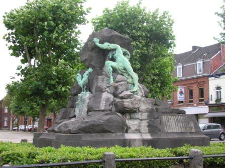
_Châtelet : monument français_
_Photo de l’auteur_

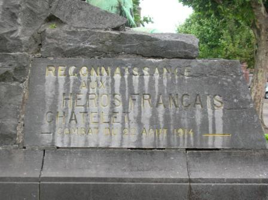
_Châtelet : monument français (détail)_
_Photo de l’auteur_

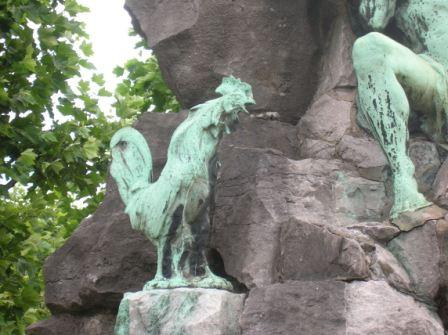
_Châtelet : monument français (détail)_
_Photo de l’auteur_

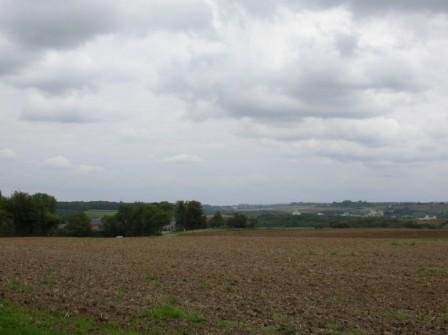
_Vue du champ de bataille_
_Photo de l’auteur_

Le cimetière militaire de la Belle-Motte fut inauguré le 23 août 1923. 4060 soldats bretons et normands y reposent, ainsi que des tirailleurs nord-africains.

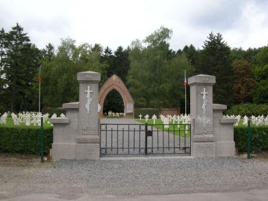
_Aiseau-Presles : cimetière militaire français_
_Photo de l’auteur_

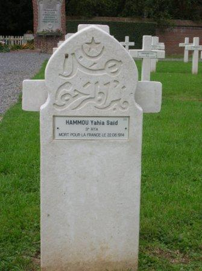
_Aiseau-Presles : stèle d’un tirailleur_
_Photo de l’auteur_

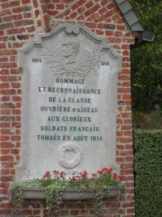
_Aiseau-Presles : plaque commémorative_
_Photo de l’auteur_

Le cimetière militaire d’Auvelais (rue du cimetière des Français) contient les tombes de 345 militaires français tombés en août 1914

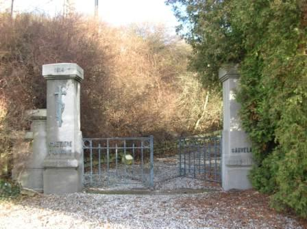
_Auvelais : entrée du cimetière français_
_Photo de l’auteur_

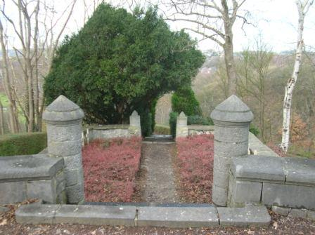
_Auvelais : montée vers le phare_
_Photo de l’auteur_

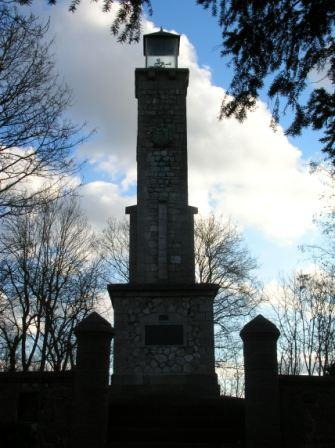
_Auvelais - le phare_

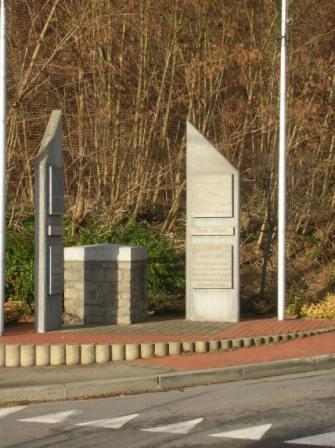
_Roselies : monument aux Français_
_Photo de l’auteur_

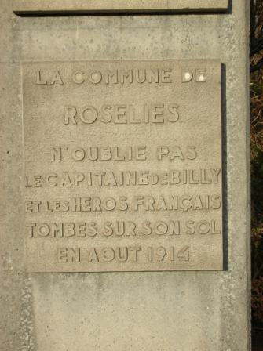
_Roselies : monument aux Français (détail)_
_Photo de l’auteur_

Le cimetière militaire de Tarcienne  présente la particularité d’être franco-allemand. Il est situé Le long de la N5, à l’orée du bois de Louvroy (rue du bois).

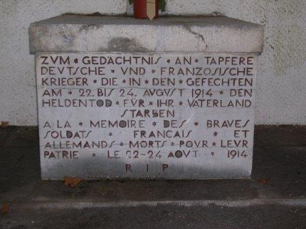
_Tarcienne : stèle allemande_
_Photo de l’auteur_

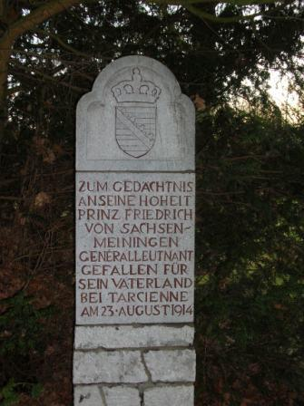
_Tarcienne : monument du duc de Saxe-Meinigen_
_Photo de l’auteur_

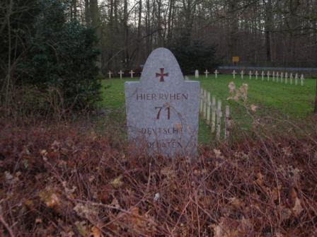
_Tarcienne : ossuaire allemand_
_Photo de l’auteur_

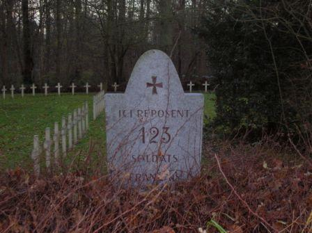
_Tarcienne : ossuaire français_
_Photo de l’auteur_

Le cimetière militaire de Lobbes se trouve sur le plateau du Heuleu, où les combats ont eu lieu

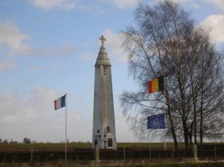
_Lobbes - Phare du cimetière_
_Photo de l’auteur_

Le monument du 10e C.A. se trouve rue lieutenant Lemercier à Arsimont. La liste des unités engagées le 21 et 22 août 1914 y est gravée.

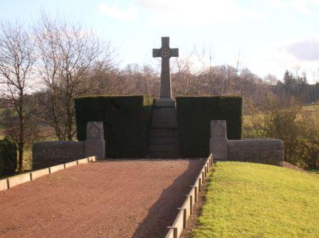
_Arsimont - Monument du 10e corps d’armée français_
_Photo de l’auteur_

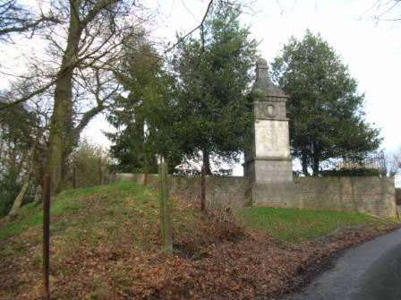
_Carnières - Monument du cimetière militaire_
_Photo de l’auteur_