# Bataille de Neufchâteau (21 - 25 août 1914)

Voyant que l’armée allemande défile d’ouest en est conformément au plan Schlieffen, Joffre donne l’ordre à la IVe armée de remonter vers le nord afin de prendre les armées allemandes de flanc et les couper en deux. L’armée française s’engage dans la forêt des Ardennes, escomptant un effet de surprise, mais entretemps, les armées allemandes ont déjà opéré leur conversion vers le sud. C’est une bataille de rencontre qui va tourner au désavantage des Français.

### Circonstances

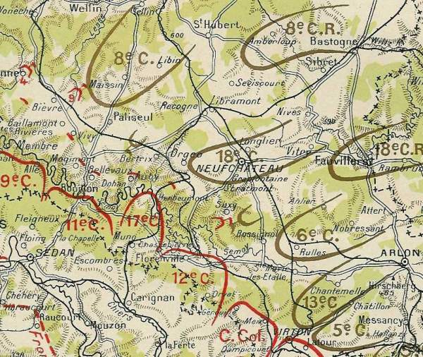
_Carte de la bataille de Neufchâteau_
_La guerre racontée par nos généraux_

Cette bataille, conséquence de l’ordre d’offensive de Joffre dans les Ardennes, met aux prises la IVe armée française (de Langle de Cary) avec la IVe armée allemande (duc de Wurtemberg).

La IVe armée constitue le corps de bataille de la manœuvre française. De Langle de Cary a prescrit que les diverses colonnes abordent simultanément vers 9h la transversale Paliseul, Saint Médard, Mellier. Les renseignements sur la position des Allemands sont à peu près nuls.

### Les forces en présence

**Ordre de bataille de la IVe armée française, général de Langle de Cary**

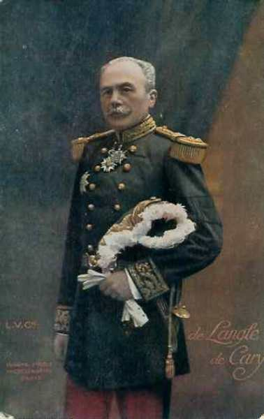
_Général de Langle de Cary (IVe armée)_
_Collection privée_

L’effectif de l’armée a été doublé par Joffre en prévision de l’offensive et est composée des unités suivantes :

**2e C.A. (Amiens) : général Gérard**

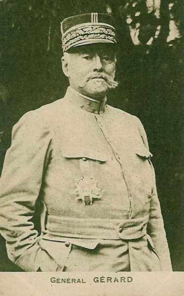
_Général Gérard (2e C.A.)_
_Collection privée_

Ce C.A.,faisant partie de la Ve armée à la mobilisation, a été rattaché le 15 août à la IVe armée.

3e division : général Cordonnier

| Unité | Commandant | Régiments |
| --- | --- | --- |
| 5e brigade | Toulorge | 72e R.I. (Amiens)128e R.I. (Abbeville, Amiens) |
| 6e brigade | Caré | 51e R.I. (Beauvais)87e R.I. (Saint-Quentin) |
| Eléments divisionnaires |  | 19e régiment de chasseurs à cheval (un escadron)17e R.A.C. (La Fère) |

4e division : général Rabier

| Unité | Commandant | Régiments |
| --- | --- | --- |
| 7e brigade | Lejaille | 91e R.I. (Mézières)147e R.I. (Sedan) |
| 8e brigade |  | 45e R.I. (Laon)148e R.I. (Rocroi, Givet) |
| 87e brigade | Mangin | 120e R.I. (Péronne, Stenay)9e bataillon de chasseurs à pied (Lille, Longuyon)18e bataillon de chasseurs à pied (Amiens, Longuyon) |
| Eléments divisionnaires |  | 16e régiment de dragons (un escadron - Reims)42e R.A.C. (Stenay, La Fère) |
| Réserves |  | 272e R.I. (Amiens)328e R.I. (Abbeville, Amiens)29e R.A.C. (Laon) |

**9e C.A. (Tours) : général Dubois**

Ce C.A. a été transféré, le 16 août, de la IIe armée (Nancy) vers la IVe armée (Charleville)

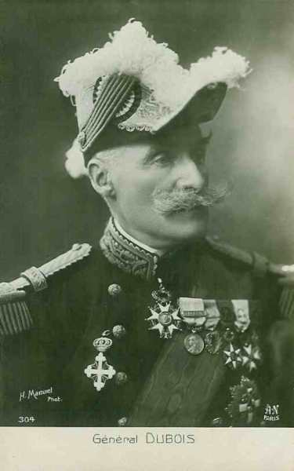
_Général Dubois (9e C.A.)_
_Collection privée_

17e division : général Moussy

| Unité | Commandant | Régiments |
| --- | --- | --- |
| 33e brigade | Simon | 68e R.I. (Issoudun)90e R.I. (Châteauroux) |
| 34e brigade | Guignabaudet | 114e R.I. (Saint-Maixent)125e R.I. (Poitiers) |
| Elements divisionnaires |  | 7e régiment de hussards (un escadron - Angers)20e R.A.C. (Poitiers) |

18e division : général Lefèvre

| Unité | Commandant | Régiments |
| --- | --- | --- |
| 35e brigade | Janin | 32e R.I. (Tours)66e R.I. (Tours) |
| 36e brigade | Eon | 77e R.I. (Cholet)135e R.I. (Angers) |
| Eléments divisionnaires |  | 7e régiment de hussards (un escadron - Angers)33e R.A.C. (Angers) |
| Réserves |  | 210e R.I. (Auxonne)268e R.I. (Issoudun)290e R.A.C. (Châteauroux) |

**11e C.A. (Nantes) : général Eydoux**

Ce C.A. fasait partie de la Ve armée à la mobilisation et a été rattaché à la IVe armée. Il sera détaché vers la IXe armée (Foch) avant la bataille de la Marne.

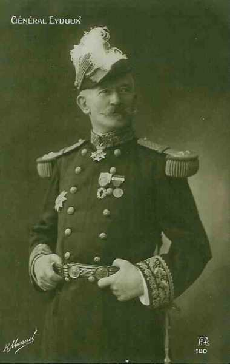
_Général Eydoux (11e C.A.)_
_Collection privée_

21e division : général Radiguet

| Unité | Commandant | Régiments |
| --- | --- | --- |
| 41e brigade | de Teyssières | 64e R.I. (Ancenis / Bouyssou)65e R.I. (Nantes / Balagny) |
| 42e brigade | Lamey | 93e R.I. (La Roche-sur-Yon / Retet)137e R.I. (Fontenay-le-Comte / de Marolles) |
| Eléments divisionnaires |  | 2e régiment de chasseurs à cheval (un escadron - Pontivy)51e R.A.C. (Nantes / Morizot) |

22e division : général Pambet

| Unité | Commandant | Régiments |
| --- | --- | --- |
| 43e brigade | Costebonel | 62e R.I. (Lorient / Costebonel)116e R.I. (Vannes / Estrabou) |
| 44e brigade | Chaplain | 19e R.I. (Brest / Chapes)118e R.I. (Quimper / François) |
| Eléments divisionnaires |  | 2e régiment de chasseurs à cheval (un escadron - Pontivy)35e R.A.C. (Vannes) |
| Réserves |  | 293e R.I. (La Roche-sur-Yon / Degrées du Loup)317e R.I. (Le Mans / Magnam)28e R.A.C. (Vannes / Darde)3e régiment d’artillerie à pied (Brest) |

**12e C.A. (Limoges) : général Roques, futur ministre de la guerre**

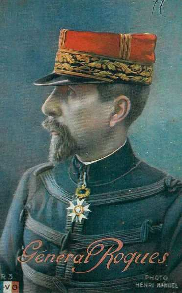
_Général Roques (12e C.A.)_
_Collection privée_

23e division : général Leblond

| Unité | Commandant | Régiments |
| --- | --- | --- |
| 45e brigade | Arlabosse | 63e R.I. (Limoges)78e R.I. (Guéret, Limoges) |
| 46e brigade d’infanterie | Chéré | 107e R.I. (Angoulème)138e R.I. (Magnac-Laval, Bellac) |
| Eléments divisionnaires |  | 21e chasseurs à cheval (un escadron - Limoges)21e R.A.C. (Angoulème) |

24e division : général Descoings

| Unité | Commandant | Régiments |
| --- | --- | --- |
| 47e brigade | Jacquot | 50e R.I. (Périgueux)108e R.I. (Bergerac) |
| 48e brigade | Dubois | 100e R.I. (Tulle)126e R.I. (Brive-la-Gaillarde) |
| Eléments divisionnaires |  | 21e régiment de chasseurs à cheval (un escadron - Limoges)34e R.A.C. (Périgueux) |

**17e C.A. (Toulouse) : général Poline**

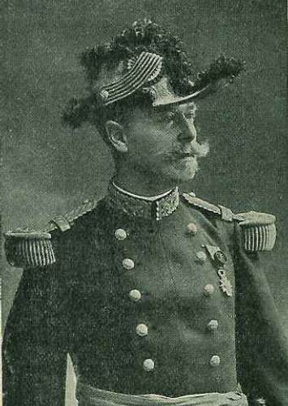
_Général Poline (17e C.A.)_
_La guerre du droit_

33e division : général de Villemejane

| Unité | Commandant | Régiments |
| --- | --- | --- |
| 65e brigade |  | 7e R.I. (Cahors)9e R.I. (Agen) |
| 66e brigade d’infanterie | Bertaux | 11e R.I. (Montauban)
20e R.I. (Marmande, Montauban) |
| Eléments divisionnaires |  | 9e régiment de chasseurs à cheval (un escadron - Auch)18e R.A.C. (Agen) |

34e division : général Alby

| Unité | Commandant | Régiments |
| --- | --- | --- |
| 67e brigade | Dupuis | 14e R.I. (Toulouse)83e R.I. (Saint-Gaudens, Toulouse) |
| 68e brigade d’infanterie |  | 59e R.I. (Foix, Pamiers)88e R.I. (Mirande, Auch) |
| Eléments divisionnaires |  | 9e régiment de chasseurs à cheval (un escadron - Auch)23e R.A.C. (Toulouse) |

**C.A. colonial (Paris) : général Lefebvre**

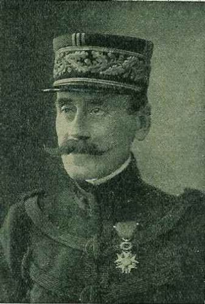
_Général Lefèvre (C.A. colonial)_
_La guerre du droit_

2e division coloniale : général Leblois

| Unité | Commandant | Régiments |
| --- | --- | --- |
| 2e brigade coloniale |  | 4e R.I.C. (Toulon)8e R.I.C. (Toulon) |
| 4e brigade |  | 22e R.I.C. (Marseille)24e R.I.C. (Perpignan)6e régiment de dragons (un escadron - Vincennes)1e régiment artillerie coloniale |

3e division coloniale : général Raffenel

| Unité | Commandant | Régiments |
| --- | --- | --- |
| 1e brigade coloniale | Guérin | 1e R.I.C. (Cherbourg)2e R.I.C. (Brest) |
| 3e brigade coloniale | Lamolle | 3e R.I.C. (Rochefort)7e R.I.C. (Bordeaux) |
| Eléments divisionnaires |  | 6e régiment de dragons (un escadron - Vincennes)2e régiment d’artillerie coloniale |
| 5e brigade coloniale | Goullet | 21e R.I.C. (Paris)23e R.I.C. (Paris)3e régiment de chasseurs d’Afrique (Constantine)3e régiment d’artillerie coloniale (Lorient) |

**9e D.C. : général de l’Espée**

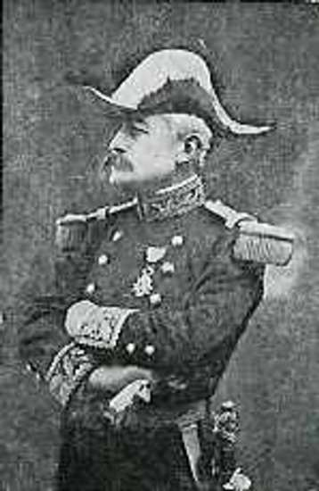
_Général de l’Espée_

| Unité | Commandant | Régiments |
| --- | --- | --- |
| 1e brigade cuirassiers | de Mitry | 1e régiment de cuirassiers (Paris)3e régiment de cuirassiers (Vouziers) |
| 9e brigade dragons | de Sailly | 1e régiment de dragons (Luçon)3e régiment de dragons (Nantes) |
| 16e brigade dragons | Gombau de Séréville | 24e régiment de dragons (Rennes)25e régiment de dragons (Angers) |

**Ordre de bataille de la IVe armée allemande, duc de Wurtemberg.**

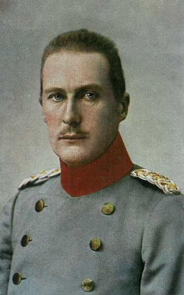
_Duc de Wurtemberg_
_Collection privée_

La IVe armée comprend :

**6e C.A. (Breslau) : général von Pritzelwitz**

11e division : général von Webern

| Unité | Commandant | Régiments |
| --- | --- | --- |
| 21. Infanterie-Brigade |  | Grenadier-Regiment Nr. 10 (Schweidnitz)Füsilier-Regiment Nr. 38 (Glatz) |
| 22.Infanterie-Brigade |  | Grenadier-Regiment Nr. 11 (Breslau)4. Schlesisches Infanterie-Regiment Nr. 51 (Breslau) |
| Cavalerie divisionnaire |  | Jäger-Regiment zu Pferde Nr. 11 (Tarnowitz) |
| 11. Feldartillerie-Brigade |  | Feldartillerie-Regiment Nr. 6 (Breslau)2. Schlesisches Feldartillerie-Regiment Nr. 42 (Schweidnitz) |

12e division : général Chales de Beaulieu

| Unité | Commandant | Régiments |
| --- | --- | --- |
| 24. Infanterie-Brigade |  | Infanterie-Regiment Nr. 23 (Neu-Ruppin)3. Oberschlesisches Infanterie-Regiment Nr. 62 (Cosel) |
| 78.Infanterie-Brigade |  | 4. Oberschlesisches Infanterie-Regiment Nr.63 (Oppeln)4. Schlesisches Infanterie-Regiment Nr. 157 (Brieg) |
| Cavalerie divisionnaire |  | Ulanen-Regiment Nr. 2 (Gleiwitz) |
| 12. Feldartillerie-Brigade |  | Feldartillerie-Regiment nr. 21 (Neisse)2. Oberschlesisches Feldartillerie-Regiment Nr. 57 (Neustadt i.O.) |

**8e C.A. (Koblenz) : général Tülff von Tschepe und Weidenbach**

15e division : général Riemann

| Unité | Commandant | Régiments |
| --- | --- | --- |
| 29. Infanterie Brigade |  | Infanterie-Regiment Nr. 25 (Aachen)10. Rheinisches Infanterie-Regiment Nr. 161 (Düren) |
| 80. Infanterie Brigade |  | 5. Rheinisches Infanterie-Regiment Nr. 65 (Cologne)9. Rheinisches Infanterie-Regiment Nr. 160 (Bonn) |
| 15. Kavallerie-Brigade |  | Kürassier-Regiment Nr. 8 (Deutz)Husaren-Regiment Nr. 7 ( Bonn) |
| 15. Feldartillerie-Brigade |  | Bergisches Feldartillerie-Regiment Nr. 59 (Cologne)3. Rheinisches Feldartillerie-Regiment Nr. 83 (Bonn) |

16e division : général Fuchs

| Unité | Commandant | Régiments |
| --- | --- | --- |
| 30. Infanterie-Brigade |  | Infanterie-Regiment Nr. 28 (Ehrenbreitstein)6. Rheinisches Infanterie-Regiment Nr. 68 (Coblence) |
| 31. Infanterie-Brigade |  | Infanterie-Regiment Nr. 29 (Trier)7. Rheinisches Infanterie-Regiment Nr. 69 (Trier) |
| Cavalerie divisionnaire |  | Husaren-Regiment Nr. 7 (Bonn) |
| 16. Feldartillerie-Brigade |  | 2. Rheinisches Feldartillerie-Regiment Nr. 23 (Coblence)Triersches Feldartillerie-Regiment Nr. 44 (Trier) |

**18e C.A. (Frankfurt a/m) : général von Schenk**

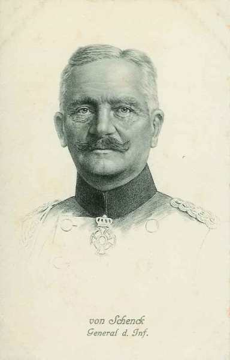
_Général von Schenck (18e C.A.)_
_Collection privée_

21e division : général von Oven

| Unité | Commandant | Régiments |
| --- | --- | --- |
| 41. Infanterie-Brigade |  | 1. Nassauisches Infanterie-Regiment Nr. 87 (Mayence)2. Nassauisches Infanterie-Regiment Nr. 88 (Mayence) |
| 42.Infanterie-Brigade |  | Füsilier-Regiment Nr. 80 (Wiesbaden)Infanterie-Regiment Nr. 81 (Francfort) |
| Cavalerie divisionnaire |  | Thüringisches Ulanen-Regiment Nr. 6 (Hanau) |
| 21. Feldartillerie-Brigade |  | 1. Nassauisches Feldartillerie-Regiment Nr. 27 (Mayence)2. Nassauisches Feldartillerie-Regiment Nr. 63 (Francfort) |

25e division : général Kühne

| Unité | Commandant | Régiments |
| --- | --- | --- |
| 49. Infanterie-Brigade |  | Leibgarde-Infanterie-Regiment Nr. 115 (Darmstadt)Infanterie-Regiment Nr. 116 (Mayence) |
| 50. Infanterie-Brigade |  | Infanterie-Leibregiment Nr. 117 (Mayence)Infanterie-Regiment Nr. 118 (Worms) |
| Cavalerie divisionnaire |  | Magdeburgisches Dragoner-Regiment Nr. 6 (Mayence) |
| 25. Feldartillerie-Brigade |  | 1. Großherzoglich Hessisches Feldartillerie-Regiment Nr. 25 (Darmstadt)2. Großherzoglich Hessisches Feldartillerie-Regiment Nr. 61 (Darmstadt) |

**8e C.A.R. (Koblenz) : général von und zu Egloffstein**

15e division de réserve : général von Kurowski

| Unité | Commandant | Régiments |
| --- | --- | --- |
| 30. Reserve-Infanterie-Brigade |  | Reserve-Infanterie-Regiment Nr. 25Reserve-Infanterie-Regiment Nr. 69 |
| 32. Reserve-Infanterie-Brigade |  | Reserve-Infanterie-Regiment Nr. 17Reserve-Infanterie-Regiment Nr. 30 |
| Cavalerie |  | Reserve-Ulanen-Regiment Nr. 5 |
| Artillerie |  | Reserve-Feldartillerie-Regiment Nr. 15 |

16e division de réserve : général Mootz

| Unité | Commandant | Régiments |
| --- | --- | --- |
| 29. Reserve-Infanterie-Brigade |  | Reserve-Infanterie-Regiment Nr. 29Reserve-Infanterie-Regiment Nr. 65 |
| 31. Reserve-Infanterie-Brigade |  | Reserve-Infanterie-Regiment Nr. 28Reserve-Infanterie-Regiment Nr. 68 |
| Cavalerie |  | Kgl. Bayer. Schweres Reiter-Regiment Nr. 21 |
| Artillerie |  | Reserve-Feldartillerie-Regiment Nr. 16 |

**18e C.A.R. (Frankfurt a/m) : général von Steuben**

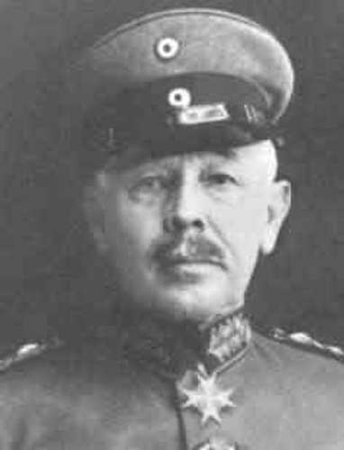
_Général von Steuben_

21e division de réserve : général von Rampacher

| Unité | Commandant | Régiments |
| --- | --- | --- |
| 41. Reserve-Infanterie-Brigade |  | Reserve-Infanterie-Regiment Nr. 80Reserve-Infanterie-Regiment Nr. 87 |
| 42. Reserve-Infanterie-Brigade |  | Reserve-Infanterie-Regiment Nr. 81Reserve-Infanterie-Regiment Nr. 88 |
| Cavalerie |  | Reserve-Dragoner-Regiment Nr. 7 |
| Artillerie |  | Reserve-Feldartillerie-Regiment Nr. 21 |

25e division de réserve : général Torgany

| Unité | Commandant | Régiments |
| --- | --- | --- |
| 49. Reserve-Infanterie-Brigade |  | Großherzoglich Hessisches Reserve-Infanterie-Regiment Nr. 116Großherzoglich Hessisches Reserve-Infanterie-Regiment Nr. 118 |
| 50. Reserve-Infanterie-Brigade |  | 5. Großherzoglich Hessisches Infanterie-Regiment Nr. 168Kurhessisches Reserve-Infanterie-Regiment Nr. 83 |
| Cavalerie |  | Schlesisches Reserve-Dragoner-Regiment Nr. 4 |
| Artillerie |  | Großherzoglich Hessisches Reserve-Feldartillerie-Regiment Nr. 25 |

**49e brigade de la Landwehr**

### 21 août

**[Lien vers croquis](../img/bataille_ardennes2.jpg)**

D’après les prescriptions du général de Langle, les 9e et 11e C.A., la gauche de la IVe armée, doivent sensiblement dépasser la Semois, tandis que les C.A. de droite s’échelonneront en arrière jusqu’à la Chiers.

La masse principale de l’armée, soit quatre C.A. marchera entre Virton et Cugnon sur un front de quarante km environ à vol d’oiseau, un front très étendu pour un mouvement offensif dans le voisinage immédiat de l’ennemi.

**9e C.A.**

- La 33e brigade poussera ses bataillons disponibles sur la route Bosseval - Sugny - Membre, afin de tenir les ponts de Bohan et de Membre. Elle aura une avant-garde à Houdremont.

- La 36e brigade rejoindra la route de Saint-Menges - bois de Floing - Alle, pour tenir ceux de Vresse, de Mouzaivé et d’Alle. Elle aura une avant-garde à Baillamont et Vivy.

Ces mouvements s’opèrent sans incident mais la gauche du 9e C.A. reste sensiblement en arrière de la ligne indiquée pour ses détachements avancés.

**11e C.A.**

Les éléments avancés sont sur le front Bertrix - Offagne, au nord de la ligne Auby - Mogimont - Oisy qui avait été primitivement fixée. Le 3e chasseurs lance trois pelotons en direction de Libin, de Recogne et de Neufchâteau. Le premier tombe dans une embuscade entre Paliseul et Maissin mais réussit à se dégager. Les deux autres se heurtent à l’infanterie allemande.

**17e C.A.**

Ce corps porte son avant-garde sur Herbeumont - Cugnon. Derrière la 65e brigade, une partie des gros (66e brigade, artillerie) se porte dans la région de Sainte-Cécile, en territoire belge. Le reste du C.A. s’échelonne vers Muno et Messincourt.

Le cours de la Semois est tortueux, guéable mais bordé d’escarpements. Entre Sainte-Cécile et Herbeumont s’étend une forêt épaisse qui forme un obstacle sérieux aux communications entre l’avant-garde et le gros.

**12e C.A.**

Les troupes se mettent en marche dès l’aube vers Florenville, en traversant la forêt d’Herbeumont. Tout à coup, la colonne est attaquée de flanc vers Izel et Jamoigne.

**Corps colonial**

Au corps colonial, la 5e brigade arrive dès 7h à Gérouville, à 12 km de Florenville. Au moment où la colonne atteint Gérouville, une forte patrouille de cavalerie allemande en sort. Le gros de la brigade est réparti entre la ferme d’Orval - Margny - Herbeuval - Montlibert. Il tombe une pluie d’orage fouettée par un vent violent.  La 3e division coloniale se trouve à Jamoigne. Elle dépasse sensiblement la ligne qui lui avait été assignée comme objectif, de Gérouville à Meix-devant-Virton.

Dans la nuit, la 5e brigade coloniale occupe les ruines de l’abbaye d’Orval. A droite, la 3e division coloniale (général Raffenel) se porte en deux colonnes à travers bois. L’une des avant-gardes atteint le hameau de Saint-Vincent au sud-est de Jamoigne. La 2e division est en arrière, ainsi que le général de C.A., Lefèvre.

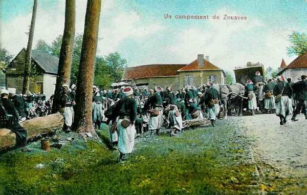
_Campement de zouaves_
_Collection privée_

**2e C.A.**

A droite du corps colonial, le 2e C.A. pousse ses avant-gardes, la 3e division au nord de Montmédy, la 4e à l’est dans la région de Velosnes. Ordre est donné de ne pas franchir la frontière.

Jusqu’au 21 août, le C.A. n’avait envoyé aucune reconnaissance en Belgique. A 16h, son régiment de cavalerie reçoit l’ordre de partir à 18h pour précéder l’avant-garde du C.A. vers la Belgique. Il pleut et fait nuit noire. Le régiment ne détache aucune patrouille sur ses flancs. Sans s’en douter, il passe au travers des troupes allemandes. En fait, toute une division allemande campe dans les environs.

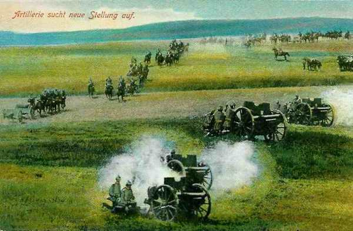
_Artillerie allemande de campagne_
_Collection privée_

A 18h, de Langle donne les ordres pour le 22. La mission confiée à la IVe armée est nettement offensive. Elle va marcher vers le nord, appuyée en échelon en arrière et à droite par la IIIe armée.

Les 4e et 9e D.C. sont regroupées en un corps, chargé de reconnaître au sud de la zone Recogne - Libin - Beauraing. Les directions de Neufchâteau et d’Arlon sont ainsi négligées. Dans le cas d’une bataille, le C.C. se portera à gauche du 11e C.A.

Voici la direction d’attaque des C.A. :

- 9e C.A. : à la gauche vers Bièvre - Houdremont - Alle - Bohan.
  11e C.A. : Maissin tout en couvrant son flanc gauche par un détachement dans la région de Bièvre - Graide.

- 17e C.A. : Jehonville - Ochamps.
  12e C.A. : Recogne - Libramont.
  Corps colonial : Neufchâteau.
  2e C.A. : Léglise.

Les avant-gardes des 11e, 17e et 12e C.A. et du corps colonial doivent atteindre à 9h la ligne Paliseul - Bertrix - Straimont - Suxy - Fossés. Celles du 2e C.A. déboucheront à 6h de Bellefontaine. De Langle ne semble pas se soucier de la présence de masses considérables dans la région de Neufchâteau, d’Arlon, de Longwy et d’Esch-sur-Alzette. Il y a un gros risque d’être attaqué sur le flanc c’est-à-dire dans de mauvaises conditions. On lance un C.A. dans une zone de 8 à 10 km de largeur.

Derrière la Lesse, les Allemands forment flanc-garde pour couvrir le passage des troupes qui passent la Meuse en aval de Namur. Au lieu de se diriger vers le nord, il eût mieux valu que la IVe armée attaque vers le nord-est contre les forces signalées vers Neufchâteau - Virton - Arlon - Luxembourg, c’est-à-dire les plus proches. Langle préfère se jeter contre un ennemi dont il ne connaît ni l’emplacement ni la force et l’attaquer partout où on le rencontrera.

### 22 août

Le temps est couvert, brumeux. En certains endroits, le brouillard est épais.

**9e C.A.**

Les ordres pour la journée sont

- Pour deux escadrons du 7e hussards : se porter sur Gedinne par Saint-Menge, Sugny, Membre, Houdremont, départ à 4h. Ils pousseront des reconnaissances sur Haut-Fays, Vonêche, Vencimont, Willerzie.

- Le mouvement de la 17e division s’opérera en deux colonnes. A droite, la 36e brigade et un groupe d’artillerie atteindront Alle pour 9h, l’avant-garde à Oisy, un bataillon à Bièvre, à gauche, la 33e brigade doit être pour 9h vers Membre, son avant-garde au nord de Nafraiture, un bataillon à Houdremont.

- La division du Maroc continuera de s’organiser dans la zone de ses débarquements.

En face du 9e C.A., les Allemands sont loin encore. La 32e division (12e C.A.) est vers Sovet.

Dans la matinée, le 7e hussards rend compte que la ligne Paliseul - Bièvre n’est pas tenue par l’ennemi. A 14h, la 4e D.C. est vers Gedinne et la 9e vers Graide.

A 23h35, on apprend que la 11e C.A. a été arrêté et doit rétrograder de Maissin sur Carlsbourg.

**11e C.A.**

Le mouvement commence à 4h.

- A droite, la 22e division suit la direction Auby - Fayt-les-Veneurs.

- La 21e division suit la route de Bouillon à Paliseul.

L’objectif visé est Maissin. Ce village occupe le centre d’une clairière. Au sud et à l’ouest s’élève une ligne de hauteurs qui en défendent les approches. A l’ouest, le terrain est plus découvert.

D’après ces considérations, le général Eydoux confie à la 22e division la tâche d’engager le combat de front à cheval sur la route de Paliseul à Maissin, tandis que la 21e division, appuyée par son artillerie de corps, déborderait l’ennemi par l’ouest. Le 2e chasseurs occupe Maissin après en avoir chassé un escadron allemand. Il reçoit l’ordre d’explorer vers le nord, en explorant dans la direction de Baraques.

A peine les éclaireurs du 19e régiment se montrent-ils devant Maissin que de tous les bois d’alentour surgissent des masses allemandes, qui garnissaient des tranchées préparées à l’avance. Vers le milieu du jour, le 19e engage le combat de front, à cheval sur la route de Paliseul à Maissin. Il entre rapidement dans ce village. Son action est préparée puis appuyée par l’artillerie divisionnaire. Le feu des allemands, qui disposent d’un grand nombre de mitrailleuses, est d’une extrême violence. Les batteries françaises sont prises à partie par un feu bien réglé de 77 et de 105.

Cependant, le 19e gagne du terrain dans Maissin, au prix de pertes très sensibles. Le régiment finit par conquérir le village de Maissin.

Dans son mouvement offensif, la 22e division a été appuyée par la 21e. Partie de Paliseul à 9h30, elle débouche d’Our à 15h et marche par brigades accolées, la 42e à droite sur Maissin et la 41e à gauche. L’artillerie bat d’abord les lisières du bois et déclenche son tir à 15h15. Il est impossible de repérer l’artillerie allemande. Vers 19h50, la droite de la 42e brigade pénètre dans Maissin. La 41e brigade refoule l’adversaire vers les hauteurs d’Anloy. La 21e division effectue une charge à la baïonnette. La division hessoise (25e) bat en retraite et recule de 15 km. Une contre-attaque allemande a lieu à 2h du matin, mais sans succès.

Cependant, la flanc-garde de droite est obligée de se replier, quant à celle de gauche, elle lutte à Porcheresse.

Dans la nuit du 22 au 23, le 11e C.A. est en pointe, ses deux flancs découverts. A droite, la retraite du 17e C.A. compromet sa sécurité. Pour ne pas être coupé de Bouillon, la 11e C.A. doit battre en retraite.

Les pertes du 19e régiment sont lourdes : 9 officiers et 300 hommes tués, 4 officiers et 600 hommes blessés ou disparus. Sur le front de la 21e division, les Allemands ont eu 2.800 tués. Le gros de l’armée, non poursuivi, peut s’installer dans Bouillon.

**17e C.A.**

D’après l’ordre donné le 22 août, le 17e C.A. doit opérer son mouvement en trois colonnes, précédées du 9e chasseurs.

- Celle de droite doit suivre l’itinéraire Herbeumont - Bertrix - Ochamps. Elle est constituée par la 66e brigade avec deux groupes d’artillerie divisionnaire. L’autre brigade de la 33e division doit dès 4h être à la lisière est de la forêt d’Herbeumont et tenir par ses avant-postes la ligne de la Vierre entre Saint-Médard et Orgéo.

- Les deux colonnes de gauche sont constituées par la 34e division doivent marcher par Cugnon - Géripont sur Assenois - Jehonville ; la 68e par Dohan, Fays-les-Veneurs sur Offagne.

Le général Poline marche au centre du corps d’armée. Les Français ignorent que les deux divisions allemandes du 18e C.A. se porteraient sur Ochamps et sur Bertrix venant de l’est, ce qui compromet fortement la droite. Pourtant, deux D.C. avaient exploré les environs de Neufchâteau jusqu’à la veille.

Les trois colonnes doivent traverser une zone boisée. Elles passent la Semois. Un brouillard épais masque tous les mouvements à l’observation aérienne.

Les avant-gardes du 17e C.A. atteignent la route Paliseul - Bertrix à 10h. L’avant-garde du 11e est à Bertrix. Vers 14h, la 34e division rend compte qu’Offagne paraît occupé. Le général Poline prescrit de procéder méthodiquement à l’attaque en faisant préparer par l’artillerie et après reconnaissance.

Vers 15h, Offagne est pris et la 34e division doit continuer sur Jehonville et Bois de Sart. Sur ces entrefaites, la 66e brigade rend compte qu’elle éprouve des difficultés à pousser jusqu’à Ochamps.

Dès 16h, les obus allemands commencent à tomber à la lisière ouest de la forêt de Luchy, sur les arrières de la 66e brigade. La colonne reflue de la forêt de Luchy. Toute la brigade et neuf batteries s’étaient engagées dans les bois sur un seul chemin. L’un des groupes a été anéanti par l’artillerie lourde allemande. A deux km au sud d’Ochamps, retentit une fusillade nourrie. Les fantassins s’échappent de la forêt par Acremont, au sud-est de Jehonville, essayant de gagner Bertrix, puis Bouillon. Des 36 pièces, 9 seulement ont pu être sauvées. Les autres, surprises en colonnes sous bois, ont perdu leurs attelages.

Les obus allemands atteignent déjà Bertrix et Assenois. Il apparaît que la colonne a dû perdre la liaison avec le 12e C.A., mal éclairée par la cavalerie  et par son avant-garde, à découvert sur son flanc droit et les Allemands avaient pénétré dans la forêt à l’est de la route où elle étant entassée, l’artillerie sur la chaussée, l’infanterie sur l’accotement droit.

Il y avait un vide de neuf km entre la droite du 17e C.A. et la gauche du 12e.

Pendant ce temps, la 34e division mène son attaque sur le bois de Sart. Vers 15h, apprenant que le 11e C.A. éprouve de grosses difficultés dans son offensive sur Maissin, le général Poline prescrit à la 34e division d’y coopérer. Dans la soirée, le 11e C.A. est en retraite.

Le général Poline décide de reporter ses troupes derrière la Semois. Vers 19h, il donne ses ordres en conséquence.

- La 33e division doit aller à Herbeumont.
  La 34e doit retraiter sur Cugnon et Dohan.

Les Allemands ne poursuivent pas. LE 17e C.A. a subi de lourdes pertes.

**12e C.A.**

Ce corps part de la région de Florenville, les Deux-Villes, en arrière et à droite du 17e C.A. Ses objectifs sont Recogne et Libramont, à peu près à même hauteur que ceux du 17e (Jehonville et Ochamps). Le général Roques juge nécessaire, pour traverser la forêt d’Herbeumont, de procéder par  échelons. Il constitue trois colonnes à la sortie de la forêt.

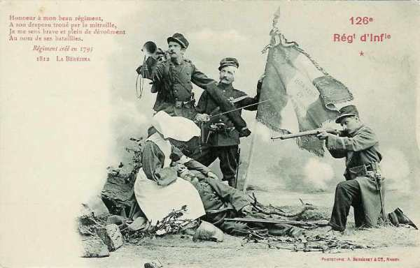
_126e R.I. - 24e div - 12e C.A._
_Collection privée_

- A gauche : deux brigades de la 24e division dans la direction de Saint-Médard.
  A droite, une brigade de la 23e division.

L’artillerie de C.A. reste en réserve, au nord de Florenville. Les deux artilleries divisionnaires marchent avec les brigades de première ligne.

L’avant-garde rencontre déjà des ennemis à hauteur de Saint-Médard et de Straimont. De ce fait, le 12e C.A. est en arrière du 17e sans que ce dernier en soit avisé. La 24e division finit par enlever Névraumont, puis un bois en arrière, qui est pris à la baïonnette. Elle franchis la route de Neufchâteau à Bertrix jusqu’à hauteur de Rossart. Les pertes sont sévères, surtout au 100e et 126e.

Dans la journée, le général Roques reçoit du commandant du corps colonial une demande de secours. Les réserves du 12e C.A. se portent donc vers la droite. Elles ne sont pas engagées mais cette menace empêche les Allemands d’assaillir le flanc droit du C.A.

**Corps colonial**

L’ordre pour le 22 août est de marcher en deux colonnes vers Neufchâteau, éclairé par le 3e chasseurs d’Afrique. A gauche, la 5e brigade coloniale part de la ferme d’Orval pour marcher sur Bulles, Suxy, Montplainchamps. Elle sera suivie par la 2e division coloniale qui marchera par Thonne-le-Thil, Herbeuval, la ferme d’Orval et Pin, sans dépasser Jamoigne.

A droite, la 3e division coloniale se porte vers le nord par Saint-Vincent, Mesnil-Breuvanne, Rossignol, Les Fossés. Les gros des avant-gardes doivent franchir à 6h la ligne de Mesnil-Breuvanne - Jamoigne. Une large forêt, celle de Chiny, forme un rideau assez difficilement pénétrable. L’horaire était réglé pour que les deux colonnes puissent déboucher en même temps sur Neufchâteau.

La colonne se constitue aux Bulles. Le gros part vers 7h20, précédé d’un peloton de dragons. Ce dernier est accueilli par des coups de feu dans la lisière du bois de Chiny et il se replie, mais la cavalerie allemande doit céder devant l’infanterie française. Il fait une chaleur torride. La colonne est survolée par un avion allemand.

La colonne débouche devant Suxy. Quelques coups de feu sont tirés par un escadron allemand.

**10h45 :**

La tête débouche devant Montplainchamps, sur la rive gauche de la Vierre. La colonne a déjà parcouru 15 km. On découvre à droite les toits de Neufchâteau.

**11h :**

L’avant-garde reprend son mouvement mais se fait arrêter par une fusillade nourrie. L’artillerie allemande ouvre le feu. L’artillerie française ne répond qu’à 13h45 seulement. Une compagnie a ordre d’attaquer Neufchâteau sur le chemin de Petitvoir. Elle s’aperçoit que les Allemands occupent des tranchées armées de mitrailleuses. Une autre ligne allemande est établie devant la lisière ouest de Neufchâteau. Les compagnies françaises sont prises entre deux feux.

Une section de mitrailleuses françaises entre en action mais est écrasée en quelques instants par les mitrailleuses allemandes. Les Allemands s’infiltrent dans le bois d’Ospot. Leur artillerie tire à 1.200 m sur le pont de la Vierre, le rendant presque inaccessible.

**15h20 :**

Les restes de deux bataillons se retirent sous la protection d’une cinquantaine d’hommes.

Le commandant du C.A. tente d’agir vers l’est pour dégager sont avant-garde. Il déploie son gros au nord de Grapfontaine et à hauteur de Montplainchamps.

Les Allemands continuent à s’étendre vers l’est, cherchant à déborder les Français. A droite, la division coloniale n’a pas pu dépasser Rossignol. A 20h, le commandant du C.A. donne l’ordre de se replier jusqu’à la lisière nord du bois de Basse-Heveau. La brigade rentre à Suxy puis, sur l’ordre du général Leblois, commandant de la 2e division, elle se replie sur Bulles qu’elle atteint à 2h du matin.

Le 18e C.A. allemand avait combattu à l’ouest de Neufchâteau et le 6e au sud. Il y a une trouée entre eux, que le 18e C.A.R. est chargé de boucher.

Cet échec français est notamment dû au fait que l’avant-garde a été engagée, non soutenue par le reste du corps colonial.

La 3e division coloniale (général Raffenel) a atteint le 21 Tintigny et Saint-Vincent. Elle doit se porter le 22 par Rossignol sur Neufchâteau.

L’avant-garde est formée par le 1e régiment colonial. La colonne s’engage sous bois par une chaleur humide accompagnée de brouillard. On prévoit une étape de 40 km. La colonne dépasse le village de Saint-Vincent à 7 heures. Vers 7h30, le 1e colonial a dépassé le pont de Breuvanne et est accueilli par une vive fusillade. Pour le récit du combat : voir Combat de Rossignol.

**2e C.A.**

Ce corps opère à droite du corps colonial. Il est parti de la région de Montmédy, Velosnes. Il doit se porter en une colonne sur Sommethonne, Meix-devant-Virton et son objectif final est Léglise, au sud-est de Neufchâteau. Le point de départ du C.A. est sensiblement au sud de celui des coloniaux. Il en résulte que, pour la même heure de départ, les colonnes du corps colonial sont à découvert sur leur droite pendant la presque totalité du mouvement. Cette disposition résulte de l’ordre même du général de Langle de Cary.

Le 2e C.A. se met en mouvement à 3h du matin par un fort brouillard. Vers 8h, le C.A. atteint Villers-la-Loue, qui semble désert. A 8h30 sifflent les premiers obus. L’énergie du général Cordonnier permet aux Français de sortir de ce mauvais pas. Une attaque vers le nord de la 4e division se heurte à des tranchées garnies de mitrailleuses.

**11h :**

Le 2e C.A. a trois régiments de la 4e division (général Rabier) à Tintigny et Bellefontaine, près du champ de bataille de Rossignol. La 4e régiment de cette division est engagé sur le front Meix - ferme d’Houdrigny, à la gauche du 4e C.A.

Partout, les Allemands dissimulent leurs formations. Il n’est possible d’apercevoir  aucun objectif animé et l’artillerie en est réduite à tirer sur des objectifs probables. Vers 17h, le 2e C.A. combine son action avec celle du 4e C.A., qui depuis le matin combat devant Virton.

Virton est occupé à 17h environ. Les troupes allemandes qui s’étaient portées entre Ethe et Virton sont refoulées au nord de Belmont.

L’impression de ce combat n’est pas nette : demi-succès ou pertes importantes pour un résultat à peu près nul ?

Les Français déplorent leur absence d’artillerie lourde et d’avions, pendant que les appareils allemands se montrent très actifs. Ils constatent que l’artillerie allemande fait une énorme consommation de projectiles.

**En fin de journée :**

- Le 11e C.A. opère une retraite difficile.
  Le 17e voit sa 33e division gravement affaiblie.
  Le 12e C.A. conserve le terrain occupé.
  Le corps colonial a subi un échec grave.
  Au 2e C.A., la journée a été indécise.

Dans l’ensemble, l’offensive de la IVe armée a complètement échoué. Les troupes françaises sont rejetées au sud de la frontière dès le début de leur offensive. De Langle de Cary, qui souhaitait reprendre l’offensive le 23vers Beauraing - Laroche, doit se résigner au mouvement rétrograde.

### 23 août

La IVe armée a derrière elle plusieurs lignes naturelles de défense : la lisière de la forêt des Ardennes, puis la Chiers entre Montmédy et son confluent dans la Meuse. Mais la Ve armée et l’armée anglaise sont en retraite, ce qui empêche les IIIe et IVe armées de s’établir derrière la Meuse, la Chiers et l’Othain.

L’armée de von Hausen est arrivée vers Bourseigne-Neuve où s’installent les avant-postes du 19e C.A.

**10h35 :**

L’ordre du commandant de la IVe armée parvient aux C.A. : il prescrit de se porter au sud de la Semois.

**9e C.A.**

Le mouvement de repli conduit le 90e à Nafraiture, le 77e à Petit-Fays et Gros-Fays, le 68e au nord d’Orchimont.

**13h :**

- La 36e brigade a le 77e à Monceau  et Petit-Fays, le 135e en retraite sur Vresse.

- La 33e brigade a le 90e au nord de Nafraiture, deux bataillons au nord d’Orchimont.

- La tête de la division marocaine, retardée dans Mézières, atteint à peine Aiglemont.

Quelques éléments se trouvent encore à Sensenruth et à Noirfontaine, le reste derrière la Semois.

La 60e division fait savoir qu’elle a évacué Oizy et Baillamont mais tient le pont de Alle. Une compagnie du 32e est à Vresse. La 60e division ne devra pas franchir la Semois sans nouvel ordre. Menacée par sa seule route de retraite, la 33e brigade est contrainte d’abandonner Nafraiture.

**19h30 :**

La 17e division a deux bataillons à Cérivaux et un bataillon couvrant le pont de Bohan, le 77e au nord de Vresse, tenant les routes d’Orchimont et d’Oizy. Toute l’artillerie est au sud de la Semois. La division marocaine atteint Pussemange. A 19h30, le général Dubois lui envoie l’ordre de pousser jusqu’à Sugny.

Dans la première partie de la nuit, une fusillade intermittente retentit sur le front du 9e C.A.

La 17e division est attaquée. On fait appel à la division marocaine et un premier bataillon atteint Sugny à 3 h.

A Orchimont, une compagnie du 77e a été attaquée par un bataillon allemand. Elle le refoule.

**11e C.A.**

La 60e division se conforme au mouvement de retraite du 11e C.A. Elle évacue Oizy et Baillamont.

Ordres pour le 24
A 0h45, de Langle donne les ordres pour le 24.

- Le 9e C.A. se replie dans la zone Mézières - Cons-la-Grandville - Gernelles - Lumes.
  La 60e division de réserve se replie sur la Meuse entre Donchéry et Nouvion.
  La 11e C.A. gagne la zone Remilly - Fresnois, au sud-est de Sedan.
  Le 17e C.A. doit résister sur la Chiers, de Carignan à Douzy.
  Le 12e C.A. reste sur la rive nord de la Chiers, couvrant les ponts de Blagny, Linay et La Ferté.
  Le corps colonial tient la position Thonne-le-Thil - Saint-Walfroy.
  Le 2e C.A. s’établit avant le jour à hauteur d’Avioth et de Thonne-la-Long, sa droite en liaison avec le 4e C.A.

Dans la matinée, de Langle vient à Amblimont et prescrit d’organiser la défense du front Vaux - Euilly - Mairy - Remilly-sur-Meuse, derrière la Chiers et à cheval sur la Meuse.

**12e C.A.**

Le 12e C.A. s’est maintenu victorieusement à Saint-Médard et à Straimont, avec l’aide du corps colonial. Ce dernier s’étant retiré, le lendemain, il est attaqué de flanc par des troupes venant de Jamoigne et d’Izel. Les éléments à Saint-Médard et à Straimont sont obligés de traverser la forêt d’Herbeumont et la clairière de Florenville. Le corps colonial fait alors face à la direction Izel - Jamoigne.

La 24e division reçoit l’ordre de se replier à la lisière nord de la forêt d’Herbeumont. Dès le petit jour, elle est criblée d’obus et doit se retirer sur la ligne Florenville - Chassepierre. A la nuit, elle bivouaque dans la région Mogues - les Deux-Villes - Matton au nord de la Chiers.

L’ensemble du 12e C.A. occupe le massif de Saint-Walfroy (entre Margut et Bièvres).

**17e C.A. et corps colonial**

Des éléments du 17e C.A. tiennent Carignan. A leur droite se trouve le corps colonial.

Le matin, le corps se trouve à Thonne-le-Thil, la lisière nord des bois de Soureil et de Signy, Saint-Walfroy.

**2e C.A.**

A la droite des troupes coloniales, le 2e C.A. a l’ordre de se maintenir à Houdrigny - Meix-devant-Virton, pour conserver la liaison avec le 4e C.A.

### 24 août

**9e C.A.**

Dès réception de l’ordre de retraite générale, l’ordre est donné aux différentes divisions.

- La 17e division opérera son mouvement par la route Pussemange - Gespunsart - Aiglemont  pour se rassembler dans ce dernier village et Charleville, en tenant dès l’arrivée du pont de Nouzon.
  La division marocaine s’établira à Sugny - Gernelle - Lumes pour couvrir la retraite.

Dans la matinée, la 17e division est en flèche, son flanc droit découvert et l’armée allemande a déjà atteint Bouillon et Poupehan.

Deux bataillons forment l’arrière-garde, tenant l’un les ponts de Membre et de Bohan, l’autre ceux de Vresse et d’Alle.

**11h50 :**

Le 7e hussards rend compte que les patrouilles allemandes n’ont pas encore franchi la Semois. La chaleur est accablante.

**22h30**

La division reçoit l’ordre de détruire les ponts de la voie ferrée entre Mézières et Fumay.

**11e C.A.**

La 21e division reprend son mouvement de retraite par La Chapelle, Sedan ; la 22e par Corbion, Fleigneux, Sedan.

Dans la soirée et le lendemain matin, les troupes prennent les dispositions pour achever l’organisation de la ligne Villers-Cernay - Illy - Fleigneux.

Le gros du C.A. franchit la Meuse sur un pont de bateaux au sud de Torcy.

**17e C.A.**

Deux ponts de bateaux sont jetés sur la Meuse à Villers-devant-Mouzon.

**14h :**

Sur une demande de soutien formée par le 12e C.A., le général Poline envoie un groupe du 57e qui prend position au Mont-des-Tilleuls, à l’est de Carignan.

**Dans la soirée :**

un télégramme parvient du Q.G. pour faire sauter les ponts de route sur la Chiers et sur la Meuse, dès que les troupes se seraient écoulées. On mina les ponts de Carignan, Tétaigne, Brevilly, Douzy et Remilly.

**12e C.A.**

Dès le matin, la troupe creuse des tranchées. La matinée est assez tranquille mais dès 13h, les Allemands s’approchent à l’abri des mouvements de terrain et des couverts. Puis commence une forte canonnade. Un combat opiniâtre s’engage au Mont-des-Tilleuls. Quatre fois, le Mont-des-Tilleuls est pris et repris. Les Allemands font un grand effort sur Carignan, mais l’artillerie française ouvre un feu destructeur et six bataillons sont à peu près anéantis. L’infanterie du 12e C.A. est épuisée par sa résistance. La retraite du C.A. reprend dans la soirée du 24 pour ne se terminer sur la Meuse que le lendemain au soir.

**Corps colonial**

La journée se passe sans incidents.

**Ordres pour le 25 août**

Dans la soirée, de Langle donne l’ordre de continuer le mouvement de retraite. La IVe armée va se reporter sur la rive gauche de la Meuse, en aval de Mézières et sur la rive droite entre Mouzon et Stenay.

- Le 9e C.A. tiendra la Meuse entre Mézières et Nouvion ; il sera prêt-à-porter la division du Maroc sur Rimogne pour aider la cavalerie à maintenir la liaison avec la Ve armée.

- Le 11e C.A. continuera à se replier derrière la Meuse, de Nouvion à Remilly.

- La 17e C.A. tiendra, au nord de Mouzon, la région Amblimont. Il doit interdire les passages de la Meuse de Remilly à Villers-devant-Mouzon.

- Le 12e C.A. se repliera sur la rive sud de la Chiers, sa droite dans la région de Malandry, en liaison avec le corps colonial, sa gauche dans la région d’Euilly, se reliant au 17e C.A.

- Le corps colonial doit maintenir le plus longtemps possible l’occupation de Saint-Walfroy par une arrière-garde. Le gros sera replié dans la zone Olizy, Martincourt, tenant les ponts d’Inor et de Martincourt.

- Le 2e C.A. se repliera sur la Chiers, entre Lamouilley et Vigneul-sous-Montmédy. Il doit maintenir la liaison avec le 4e C.A. vers Han-les-Juvigny, sur le Loison.

L’armée est donc à cheval sur la Meuse. La retraite de la Ve armée découvre le flanc gauche de la IVe et va l’obliger à effectuer une nouvelle retraite.

### 25 août

**11e C.A.**

**En soirée :**

- A la 21e division, la 41e brigade occupe le bois de la Marfée, Noyers ; les 64e et 65e à droite de Noyers ; la 42e brigade se masse entre Chaumont-saint-Quentin et Thelonne, un bataillon sur la Meuse à Pont-Maugis.

- A la 22e division (à gauche de la 21e), la 43e brigade est dans les bois de Saint-Aignan, l’artillerie divisionnaire est sur la coupe à l’est de Frénois.

- L’artillerie de C.A. a deux groupes sur les hauteurs de Noyers.

**17e C.A.**

**16h :**

La 34e division fait connaître que les Allemands ont jeté un pont sur la Meuse à Remilly. Un groupe d’artillerie prend sous son feu Remilly et la vallée de l’Ennemanne. Les Allemands ne font aucune tentative de passage.

Il faut aller chercher les explosifs dans le fort des Ayvelles, évacué, ce qui permet de détruire neuf ponts.

**12e C.A.**

Ce corps, qui se trouvait sur la rive nord de la Chiers, dans la région de Charbeaux, a passé cette rivière et la Meuse et ne laisse qu’une brigade sur la rive est.

**Corps colonial**

Aucune attaque ne se produit dans son secteur.

**2e C.A.**

La 3e division se préparait à une contre-attaque an nord-ouest d’Avioth quand est parvenu l’ordre de retraite. Le C.A. s’achemine vers Montmédy et Stenay. Le pont de Stenay saute vers 22h mais d’une façon incomplète.

### Autres récits liés à la bataille de Neufchâteau

**[Combat de Rossignol](article_07_22.md)**

**[Combat de Virton](article_07_94.md)**

**[Combat d’Ethe](article_07_100.md)**

**[Combat d’Ochamps - forêt de Luchy](article_07_102.md)**

### Conclusion

Croyant attaquer l’armée allemande de flanc, dans son mouvement d’est en ouest, Joffre a déclenché une offensive visant à couper l’armée allemande en deux. En fait, les IVe et Ve armées allemandes ont déjà entamé leur conversion vers le sud selon le plan de Moltke. Ruffey et de Langle vont attaquer les deux armées allemandes de front. Sur le plan tactique, l’armée allemande dispose d’une réelle supériorité : l’armée sait se dissimuler dans les bois, creuser des tranchées. Ce sera une mauvaise surprise pour les armées françaises qui vont devoir retraiter, en subissant de grosses pertes.