# Bataille de la Trouée de Charmes (22 - 26 août 1914)

La trouée de Charmes est un des rares passages praticables pour une armée moderne entre Toul et Epinal. Un envahisseur qui forcerait la trouée parviendrait au coeur de la France, d’où son intérêt stratégique et l’âpreté des combats qui s’y sont déroulés entre les VIe et VIIe armées allemandes et les armées de Castelnau et de Dubail.

### Importance stratégique

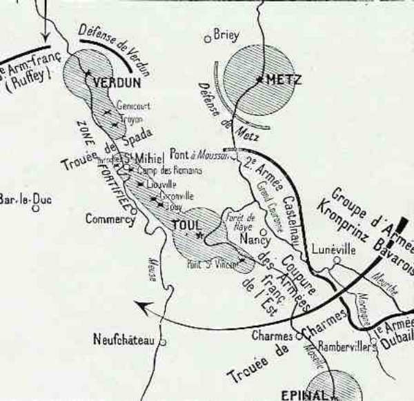
_Objectif des attaques allemandes_
_C Michelin, d’après guide édition 1919 - autorisation 06-B-05_

La trouée de Charmes est située entre deux places fortes : Toul au nord et Epinal au sud. Elle constitue une voie classique d’invasion jusqu’au cœur de la France et se trouve à la jonction entre la Ie armée française (Dubail) et la seconde (Castelnau). Si l’armée allemande réussit à y pénétrer, elle séparera les deux armées françaises et surtout pourra prendre à revers l’ensemble du dispositif français qui lutte contre les armées qui ont traversé la Belgique. Ce serait le double enveloppement qu’espère réaliser Moltke.

### Le terrain

_Nancy - Trouée de Charmes_
_C Michelin, d’après guide édition 1919 - autorisation 06-B-05_

La défense naturelle de Nancy se compose de deux parties, l’une à l’est et l’autre à l’ouest. C’est une sorte de petite Suisse, séparant le bassin de la Moselle de celui de la Seille, qui se jette dans la Moselle à Metz.

Le mont Sainte-Geneviève est la première hauteur du Grand Couronné (nord de Nancy). Au sud de cette colline, le Grand Couronné développe sa figure bosselée : ce ne sont que hauteurs et vallons, pentes et contre-pentes.

Au sud de la coupure de la Pissotte, qui coule de Champenoux vers Dommartin,  le Rembêtant domine la plaine, entre Nancy et Lunéville.

La région comporte plusieurs forêts : Gremecey, Champenoux, Vitrimont, bois de Faulx.

Au nord-est de Nancy, le plateau de Malzéville n’est qu’un sol aride et chauve.

Au sud de Lunéville, une trouée se dessine entre deux régions montagneuses : la trouée de Charmes.

**[Lien vers carte de la trouée de Charmes](../img/mortagne_meurthe.jpg)**

### 22 août

Après avoir remporté les batailles de Sarrebourg et Morhange, les Allemands passent la frontière française. Ils ont toutefois subi de lourdes pertes : dans le Ie C.A. bavarois par exemple, certaines unités ont perdu entre 25 et 50 % de leur effectif. C’est la raison qui explique qu’ils n’aient pas poursuivi vigoureusement et aient momentanément perdu le contact avec les Français.

Puis, progressant, ils commencent à bombarder le front nord et est du Grand Couronné.

Le 15e C.A., éprouvé par les combats des 19, 20 et 21 août, ne se sent pas en état de se maintenir sur la rive droite de la Meurthe (nord nord-est de Lunéville). Castelnau le renforce par une brigade mixte du 20e C.A. (Ferry).

Les troupes allemandes se mettent en mouvement : L’armée du kronprinz de Bavière, venant de Delme et de Morhange, a pour objectif le Grand Couronné et Lunéville.

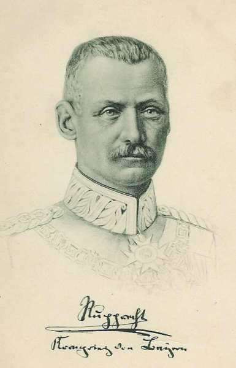
_Rupprecht de Bavière (VIe armée)_
_Collection privée_

L’armée de von Heeringen, débouchant du Donon et des cols des Vosges, a pour objectif la ligne de la Mortagne et la forêt de Charmes où elle compte prendre à revers les forces françaises qui ont pour mission de défendre la trouée de Charmes face au nord-est.

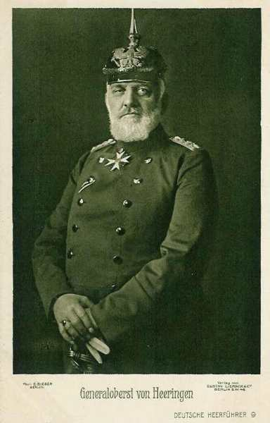
_Général von Heeringen (VIIe armée)_

Vers 8h30, le 16e C.A. français subit une attaque vers les hauteurs de Crion et de Sionviller.

Le 15e C.A. est autorisé vers 10h à se replier sur la rive gauche de la Meurthe et vient occuper les hauteurs de Saffais. Pour pouvoir tenir le plus longtemps possible sur la rive droite de la Meurthe, Castelnau donne l’ordre à la 22e brigade de traverser la rivière et d’occuper les hauteurs de Flainval. Elle empêche ainsi les Allemands de tourner le Grand Couronné par le sud, en maintenant les liaisons avec le 16e C.A. Le soir, les Français repassent la Meurthe en faisant sauter les ponts derrière eux.

Le gros du 20e C.A. s’établit au sud de la Meurthe, sur les hauteurs de Ville-en-Vernois - Manoncourt.

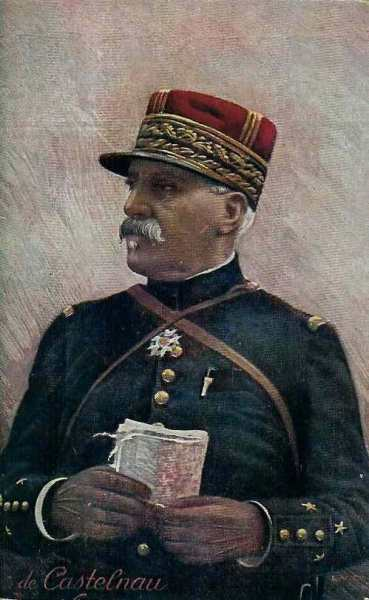
_Général de Castelnau_
_Collection privée_

L’intention de Castelnau, en préparant la défense de la trouée de Charmes, est de relier le Rembêtant aux hauteurs de Saffais (367m) et de Belchamps (413m) qui commandent à la fois la plaine de la Meurthe et de la Mortagne au nord et protègent la trouée de la Moselle au sud. Ces mesures ramènent légèrement les troupes en arrière, laissant le champ libre aux Allemands pour s’enfoncer vers la Mortagne, au sud de Lunéville. La ligne Rembêtant - Saffais - Belchamps s’étend grosso modo du nord au sud.

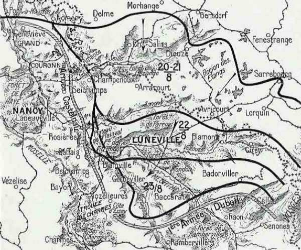
_Repli français 20 - 22 août_
_C Michelin, d’après guide édition 1919 - autorisation 06-B-05_

Les Allemands sont contenus à gauche sur la côte qui protège au nord Jolivet mais, sur la droite, vers 15h, la 31e division (16e C.A.) commence à plier. Une contre-attaque sur Croismare dégage cette division, mais elle finit par céder : elle passe la Meurthe à Lunéville et vient se reformer à Xermaménil.

Lunéville est déclarée ville ouverte et le 23 à 14h, les troupes du 21e C.A. allemand défilent dans les rues, musique en tête.

### 23 août

L’armée allemande émet un communiqué de victoire :

« Les troupes qui, sous la conduite du prince héritier de Bavière, furent victorieuses en Lorraine, ont franchi la ligne Lunéville - Blâmont - Cirey. Le 21e C.A. est entré aujourd’hui à Lunéville. La poursuite de l’ennemi a porté ses fruits ; l’aile des Vosges a fait de nombreux prisonniers et a pris 150 canons et des drapeaux ».

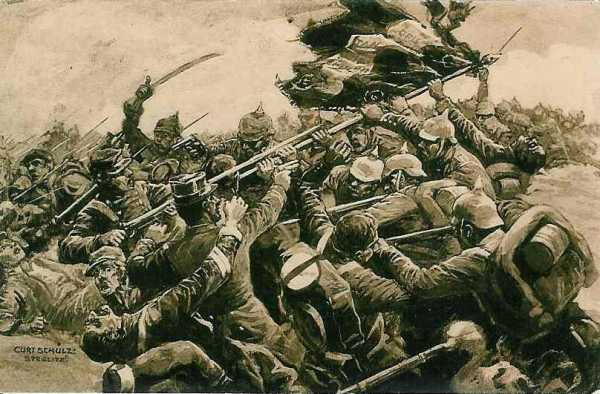
_Prise d’un drapeau français près de Lunéville_
_Collection privée_

Les ordres du G.Q.G. français établissent une liaison entre les Ie et IIe armées et donnent comme objectif commun de tendre un piège devant les troupes allemandes qui s’avancent imprudemment.

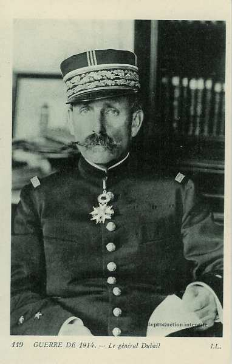
_Général Dubail_
_Collection privée_

La plate-forme du piège est constituée par la Ie armée (Dubail) qui a l’ordre de s’établir en ligne à travers la vallée. L’abattant est la IIe armée (Castelnau), occupant les hauteurs du Grand Couronné de Nancy, et qui attaquerait les troupes allemandes de flanc. La jonction entre les deux armées se fera par les hauteurs au nord de la forêt de Charmes, par les 64e et 74e divisions (IIe armées) qui barrent la trouée de Charmes, par la 16e division (8e C.A.) et la 6e D.C. (Ie armée) au sud de Rozelieures et de Borville.

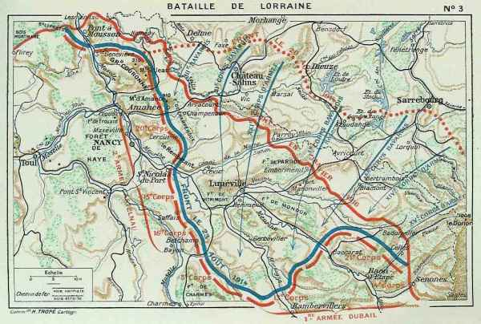
_Situation des 1e et 2e armées le 23 août après la retraite_
_Général Niox La grande guerre_

**Ie armée française**
L’armée doit, selon les ordres de Joffre, prendre globalement une position perpendiculaire par rapport à celle de la IIe armée (les deux branches du piège).

Dubail va opérer vers le sud-ouest une vaste conversion de sa gauche et de son centre afin d’établir la liaison en équerre avec la droite du général de Castelnau, qui aura son aile droite au nord de la forêt de Charmes, vers Villacourt.

- Le 8e C.A. s’articule avec la droite de la IIe armée en direction de la forêt de Charmes. La 16e division (Maud’huy) prend la direction de Domptail - Saint-Pierremont et passe la Mortagne. Il se trouve sur la ligne de Damas-aux-Bois - Hallainville - Fauconcourt.

- Le 13e C.A. gagne les bords de la Mortagne où il cantonne à Saint-Maurice - Roville-aux-Chênes et Anglemont.

- Le 21e C.A. se dirige vers la Meurthe pendant la nuit et bivouaque face au nord, sur la ligne Celles - Pierre-Percée - Pexonne - Merviller - Baccarat.

- Le 14e C.A. a quitté la vallée de la Bruche et s’est replié vers l’ouest pour occuper la région de Ban-de-Sapt.

L’ensemble du dispositif s’étend grosso modo d’ouest en est, soit perpendiculairement à celui de la IIe armée.

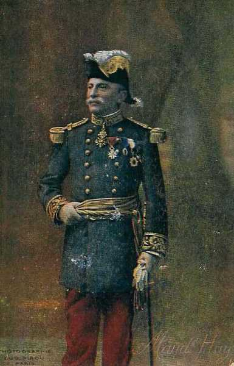
_Général de Maud’Huy_
_Collection privée_

**IIe armée française**

Pour la IIe armée, le 23 août se passe dans un calme relatif : c’est une sorte de trêve de part et d’autre. L’armée de Castelnau s’établit fortement sur ses positions et le Q.G. s’installe à Pont-Saint-Vincent, dans l’intention de surveiller la région de Charmes. L’aile droite de l’armée doit s’opposer au mouvement débordant  des Allemands vers le sud et défendre la rive gauche de la Meurthe en prolongement du Grand Couronné.

- Le 16e C.A. est vers Xermaménil - Belchamps, surveillant la route de Lunéville à Bayon. L’artillerie du C.A. se trouve sur les crêtes de Belchamps  et au nord de Brémoncourt.

- Le 15e C.A. est dans la région d’Haussonville.

- Le 20e C.A. s’articule de manière à pouvoir défendre soit le Grand Couronné, soit la trouée de Charmes. L’artillerie du C.A. domine la Meurthe, sur la crête de Saint-Nicolas et prend d’enfilade la vallée du Sanon.

- Les divisions de réserve gardent toujours le Grand-Couronné, leur force principale est prête à contre-attaquer vers Haraucourt ou Réméréville.

Les Allemands tentent une attaque sur le Rembêtant mais sont arrêtés par l’artillerie lourde située sur cette colline et les batteries de la rive gauche de la Meurthe. Dans la soirée, les Allemands installent une nombreuse artillerie sur les hauteurs de Flainval - Anthelupt d’où ils peuvent soit canonner le Rembêtant soit prendre de revers les troupes françaises vers Lamath - Xermaménil.

**VIe et VIIe armées allemandes**

Les armées allemandes forment un vaste demi cercle dont le sommet est sur les pentes du Donon et dont la corde est la vallée de la Meurthe avec Baccarat comme centre.

### 24 août

**[Lien vers croquis](../img/bataille_trouee_charmes.jpg)**

Les ordres donnés sont

- Pour la Ie armée, faire front et lutter sur place.
  Pour la IIe armée placée perpendiculairement, tomber sur le flanc de l’armée allemande si elle s’engage dans la région au sud-ouest de Lunéville.

A minuit, les Allemands attaquent par surprise à Celles et à Baccarat. La pression de l’armée de von Heeringen devient très forte sur le 21e C.A. si bien que la 13e division doit se replier. La 43e division se replie également par Baccarat sur la rive gauche de la Meurthe et creuse des tranchées.

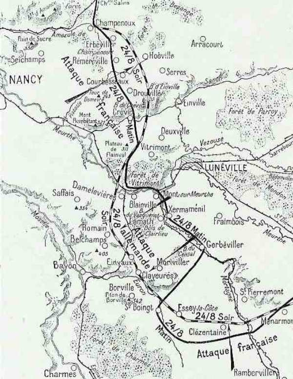
_Journée du 24 août_
_C Michelin, d’après guide édition 1919 - autorisation 06-B-05_

**Ie armée française**

Ainsi,

- Le 21e C.A. borde la Meurthe.

- Le 14e C.A. sert d’appui à droite au 21e C.A. pour défendre la ligne des Vosges entre Provenchères et Raon-l’Etape.

- Les cinq groupes alpins du général Bataille tiennent toujours la région à l’ouest de Colmar, au pied des Vosges. Toutefois, les Allemands qui ont pu s’emparer du col de Sainte-Marie commencent à descendre le versant français des Vosges et font mouvement vers la trouée de charmes par Saint-Dié et Epinal.

L’artillerie française intervient et écrase l’infanterie allemande sous ses obus.

Il y a, sur le front des 13e et 8e C.A. une zone de manœuvre que le haut commandement s’est habilement ménagée et où il espère que les Allemands pénétreront.

- Les 13e et 21e C.A. tiennent la ligne des crêtes qui, de Vallois à Etival, court parallèlement à la Meurthe et en commande les passages.

- Le 8e C.A. prolonge au-delà de la Mortagne la solidité de cette ligne qui protège l’entrée de la trouée de Charmes.

L’objectif des Allemands est le village de Rozelieures. Le 8e C.A. français reçoit l’ordre de les contre-attaquer. Il le fait sur Vennezey - Moriviller, aux approches de la trouée. Pour aider ce mouvement offensif, le 13e C.A. maintient en respect les troupes allemandes qui débordent de Baccarat. La Ie armée française lutte pied à pied, retenant les Allemands sur les pentes des Vosges.

**IIe armée française**

La IIe armée est disposée du sud au nord sur les hauteurs de Belchamps et de Saffais et sur tout le Grand Couronné jusqu’au mont Sainte-Geneviève. Le 20e C.A. est prêt à se porter en avant au premier signal.

Une reconnaissance aérienne signale à la IIe armée la marche d’une forte colonne quittant Lunéville et traversant la forêt de Vitrimont. Une heure plus tard, Castelnau apprend que les avant-postes de la 64e division de réserve (15e C.A.) sont attaqués et repoussés à Damelevières, au passage de la Meurthe. Les Allemands s’emparent de cette localité et s’y retranchent. Les forces allemandes défilent du nord au sud vers Rozelieures, le long du Grand-Couronné et de la croupe séparant la Meurthe de la Mortagne et de la Moselle et prêtent ainsi le flanc à une offensive au départ de cette ligne de hauteurs, tandis que l’armée Dubail, lui barrant la route, ne lui laisse aucune issue vers le sud.

**11h30 :**

Castelnau prend la décision : il attaquera la longue colonne qui défile devant lui. La 39e division du 20e C.A., la 70e division de réserve, les 34e et 35e brigades du 9e C.A. s’ébranlent des hauteurs du Grand-Couronné, dans la direction de Haraucourt et de Flainval.

Les forces mobiles qui surveillent les passages de la Meurthe et de la Moselle sont constituées du C.C. Conneau. Elles sont placées face aux forces allemandes qui se concentrent à Lunéville, soit trois brigades d’infanterie,  trois régiments d’artillerie et un régiment de uhlans. Le C.C  est attaqué par les troupes remontant ou passant la Mortagne. Vers midi, la 10e D.C. doit se replier vers le bois de Fillières, appuyée à gauche par le 2e bataillon de chasseurs et l’artillerie divisionnaire qui tient le plateau de la Naguée.

**14h30**

Deux C.A. allemands débouchent des bois de Franconville et gagnent immédiatement du terrain. Conneau décide alors de replier lentement ses gros vers le sud, sur les hauteurs de Borville, en ne laissant à la Naguée que la 2e brigade de chasseurs. Les Allemands tentent aussitôt de s’emparer du plateau de la Naguée mais sont arrêtés par les batteries à cheval qui leur en interdisent l’accès.

Pendant ce temps, le 8e C.A. a reçu à midi l’ordre de s’engager sur Vennezay - Rozelieures, soutenu par le 13e C.A. dont l’aile gauche s’appuie solidement à Ménarmont, mais il est arrêté à Saint-Boingt et Essey. Le C.C. conserve ses positions et tient sous son feu les forces allemandes considérables qui mettent une journée pour avancer de 5 km.

Les Ie et IIe armées se sont rapprochées l’une de l’autre pour poursuivre leur action le 25 et attaquer.

L’artillerie de Belchamps (artillerie lourde du 16e C.A.) qui commande la route de Lunéville à Bayon donne aussi énergiquement.

L’offensive de la IIe armée se développe sur le flanc allemand et presque sur ses arrières. La 68e division reçoit l’ordre d’attaquer sur Courbessaux - Hoéville. D’un seul bond, la 70e division (Fayolle) enlève Gerbéviller, Réméréville et Courbessaux. Les troupes allemandes se retirent hâtivement sur la crête de Serres. Le cimetière d’Erbéviller notamment a été organisé comme une véritable redoute.

En fin de journée, les forces françaises occupent le front Champenoux - Réméréville - Courbessaux et menacent sérieusement la route de la frontière à Lunéville qui est la ligne des communications allemandes.

Le 20e C.A. a marché droit devant lui et occupe le soir le front Haraucourt - Flainval - Rosières, maintenant la liaison avec le 15e C.A. par Saffais.

En résumé, les Allemands ont été surpris en s’avançant vers le sud. Ils se sont heurtés au barrage du C.C. Conneau et au nord, l’armée de Castelnau les a pris à  partie dans leur marche et les a refoulés sur leurs positions où la bataille décisive s’engagera le 25.

**VIe et VIIe armées allemandes**

Comme nous le voyons sur le croquis, l’objectif des attaques allemandes est de couper la Ie armée française de la IIe et d’encercler cette dernière.

L’armée du Kronprinz de Bavière atteint en soirée, la ligne Blainville - Gerbéviller - Cirey. Le Donon est pris d’assaut et les troupes françaises rejetées au-delà de la Meurthe.

### 25 août

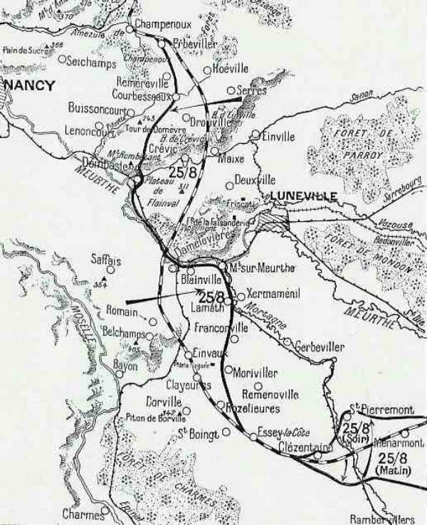
_Journée du 25 août_
_C Michelin, d’après guide édition 1919 - autorisation 06-B-05_

**Ie armée française**

Dubail veut continuer à contre-attaquer dans la journée du 25. Son P.C. est à Rambervillers.

L’objectif de la droite de l’armée est Raon-l’Etape et Baccarat.

- 21e C.A. : attaquer par la rive gauche de la Meurthe.
  14e C.A. : attaquer vers Raon-l’Etape par la rive droite.
  13e C.A. : attaquer sur Ménarmont.
  8e C.A. : attaquer vers Moriviller.

Les forces allemandes avancent avec une confiance extrême. Elles atteignent la ligne en avant de Lunéville - Blainville - Gerbéviller - Saint-Dié.

Dans la matinée, les 21e et 13e C.A., formant le centre de la Ie armée, sont attaqués par des forces importantes, le 14e C.A. badois notamment. L’attaque a lieu sur le front Raon-l’Etape - Thiaville.

Au 21e C.A., la 13e division doit attaquer le front Raon-l’Etape - Thiaville mais, après une forte préparation d’artillerie, l’armée allemande débouche de Thiaville. Après un combat de dix heures, les 1e et 2e bataillons du 109e sont obligés de se retirer à travers la forêt mais les mitrailleuses françaises ont causé de grands ravages dans les troupes allemandes à Raon-sur-Plaine.

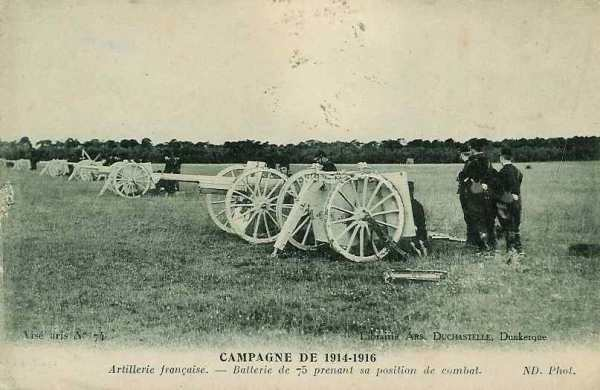
_Batterie de 75 en position de combat_
_Collection privée_

Vers midi, sous la pression violente de forces supérieures de l’armée von Heeringen et de l’aile gauche de l’armée bavaroise (VIe), tout le centre de Dubail (13e et 21e C.A.) se replie et abandonne la position de Ménarmont, sur la ligne qui protège directement Rambervillers.

La gauche du 21e C.A. est attaquée par le 1e C.A. bavarois (von Xylander). Toutefois, le retrait de l’armée de Dubail est de quelques kilomètres seulement. En repliant son aile droite sur le col de la Chipotte, il a choisi un terrain permettant une solide résistance. (Le col de la Chipotte est au sud-ouest de Raon-l’Etape, entre cette ville et Rambervillers).

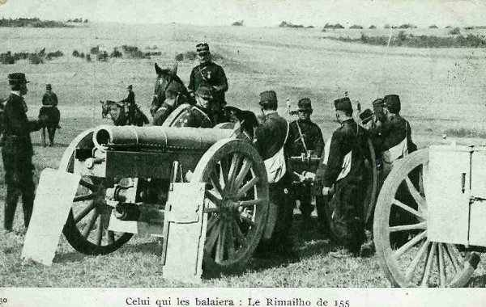
_Canon Rimailho 155_
_Collection privée_

**IIe armée française**

Le Q.G. de Castelnau est à Pont-Saint-Vincent. Son armée va tomber sur le flanc allemand.

L’armée est appuyée sur Borville. Le piton de Borville (342 m ) domine la contrée et commande le sud de la trouée de Charmes, de même que Flainval (316m) commande au nord la route de Lunéville. Entre ces deux massifs et le long des crêtes qui protègent la Moselle, (Saffais 367m, Belchamps 413 m), Castelnau veut saisir l’armée allemande comme dans un étau si elle se dirige vers la trouée de Charmes. C’est à Borville qu’est maintenue la liaison entre les Ie et IIe armées.

Pendant la nuit, toute l’artillerie disponible grimpe aux pentes du piton, à la cote 342. A l’aube, elle est massée sur le plateau, braquant ses bouches à feu sur les chemins qui convergent vers la trouée de Charmes. C’est de là que vont partir les rafales qui faucheront les pentes du bois de Jontois, du bois de Filière, de Rozelieures et de la côte d’Essey.

Castelnau élabore son plan : si l’armée de Rupprecht continue à s’avancer vers le sud, elle sera arrêtée, depuis la Mortagne jusqu’à Borville, par l’action du 16e C.A., d’une division du 15e C.A. et du 8e C.A., tandis que l’armée de von Heeringen, qui s’avance de l’est vers l’ouest se heurtera au barrage de la Ie armée sur les hauteurs au nord de la route Raon - Rambervillers - Charmes.

Si les Allemands continuent à prêter le flanc, il saisira l’occasion de tomber sur leurs lignes de communication. Le front de la IIe armée s’étend sur +- 60 km, depuis Sainte-Geneviève jusqu’à Borville.

Borville va d’ailleurs devenir le nœud de la bataille. Castelnau prescrit d’attaquer méthodiquement, en s’installant après chaque bond. Il prescrit au 16e C.A. de ne jamais perdre la liaison avec le 8e C.A.

Castelnau a la conviction que Rupprecht néglige les troupes qui se trouvent sur le Grand Couronné et qu’il poursuit sa marche vers la trouée de Charmes. Le plan de Rupprecht est d’ailleurs de faire remonter les masses sur les deux rives de la Mortagne et d’ouvrir un passage vers Mirecourt, Neufchâteau et finalement de couper l’armée de Joffre par ses arrières et de l’étrangler.

Les dispositions de Castelnau sont les suivantes :

- Le 8e C.A. attaquera vers le nord.

- Le 16e C.A. et une partie du 15e C.A. attaquera vers l’est dans la direction d’Einvaux - Francoville, aidée par une masse d’artillerie concentrée à Borville.

**En matinée :**

Les forces allemandes ont atteint au nord les abords de Réméréville et au sud la route d’Einvaux - Moriviller. L’attaque se dessine contre le 8e C.A. qui protège l’entrée de la trouée de Charmes. L’infanterie allemande cherche à franchir les hauteurs aux approches de Rozelieures.

Castelnau ordonne aux 15e et 16e C.A. de se porter en avant. Le 16e débouche sur Einvaux et y pénètre.

**10h :**

Le régiment de gauche du 8e C.A., qui supporte tout le poids de l’offensive, est repoussé de Rozelieures.

Castelnau a prévu cette attaque et dispose encore de forces. Le C.C. envoie trois régiments à Saint-Boingt et le 2e bataillon de chasseurs vient renforcer la gauche du 8e C.A.

L’armée de Rupprecht s’allonge sur une distance de 25 km de Einville vers Rozelieures.

**14h :**

Des fractions d’infanterie allemande, sous les rafales de l’artillerie de Borville et la menace du 16e C.A. sur leur ligne de retraite, se replient de Rozelieures.

L’infanterie du 16e C.A., quant à elle, progresse de Borville sur Rozelieures. Devant le succès obtenu, le 8e C.A. se met en marche pour reprendre le terrain perdu vers Essey-la-Côte.

C’est à ce moment que Castelnau télégraphie à ses C.A. un ordre resté célèbre : « En avant, partout, à fond ».

Son armée tout entière s’ébranle ; les Allemands résistent avec vigueur mais finissent par céder. En fin de journée, le 16e C.A. est maître de Rozelieures.

Le 15e C.A. atteint la Meurthe et la Mortagne à Lameth et Blainville mais est arrêté aux portes de Mont-sur-Meurthe. Le C.C. reçoit l’ordre de poursuivre  à fond par Damvillers et de tomber sur les arrières des Allemands en direction de Gerbéviller - Fraimbois - Lunéville - Einville, mais les Allemands sont trop fortement installés sur la rive droite de la Mortagne et la poursuite est vite interrompue.

**En soirée**

le 8e C.A. a regagné le terrain perdu et réoccupe le front Essey-la-Côte et Saint-Pierremont.

L’aile gauche de l’armée Castelnau est également passée à l’offensive, mais le 20e C.A. (Foch) est freiné dans sa progression par le 3e C.A. bavarois qui fait flanc-garde de la VIe armée sur les hauteurs de Flainval et d’Hudiviller. Si ce C.A. ne s’était pas trouvé sur le chemin du 20e C.A., Castelnau aurait remporté une victoire décisive contre Rupprecht. Dans la soirée, des forces fraîches allemandes entrent dans Courbessaux, attaquent le bois de Crévic mais subissent de lourdes pertes. 70 canons français tirent sur elles sans discontinuer.

En fin de journée, le 20e C.A. occupe avec la 11e division les hauteurs de Sommerviller, de Flainval et d’Hudiviller et avec la 39e le front Saint-Nicolas - Manoncourt.

### 26 août 1914

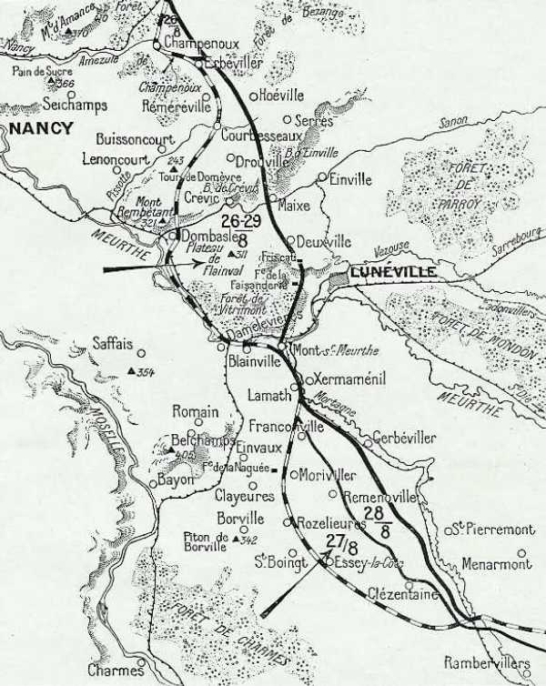
_Journées du 26 au 29 août_

**Ie armée française**

Le 8e C.A. reprend son mouvement en avant en liaison avec la droite de la IIe armée. Il occupe en fin de journée le front Clézentaine - Bois de Fays.

**IIe armée française**

- Le 16e C.A. atteint vers midi la ligne Remenoville - Francoville - Landrecourt.

- Au 15e C.A., la 29e division prend pied dans Lamath, ses éléments avancés à Xermaménil. La 30e division attaque Mont-sur-Meurthe et s’en empare.

- Le 20e C.A.  atteint en fin de journée la ligne La Faisanderie - Friscati - Deuxville (abords de Lunéville) - Maix - Bois de Crévic.

- Les éléments restants du 9e C.A. se maintiennent dans la région de Réméréville - Courbessaux.

Le piège que Joffre et Castelnau avaient tendu à Rupprecht de Bavière a parfaitement fonctionné. Sûr d’avoir presque anéanti l’armée française lors des batailles de Sarrebourg - Morhange, Rupprecht fonce vers la trouée de Charmes, négligeant l’armée de Castelnau et se fait attaquer de flanc, pris entre les Ie et IIe armées françaises.

### 27 août

Un radiogramme significatif émane de l’O.H.L. « à aucun prix, ne révélez à nos armées de l’ouest les échecs de nos armées de l’est ».

Cet échec met aussi fin au plan de Moltke visant à encercler les armées françaises.