# Bataille de Mons (23 août 1914)

Les accords franco-anglais prévoyaient en cas de guerre l’intervention du corps expéditionnaire britannique à la gauche du dispositif allié. Les Anglais se concentrent à Maubeuge et font mouvement vers la Belgique où ils vont rencontrer l’armée de von Kluck dans la région de Mons. Malgré leur infériorité numérique (un contre trois), les Anglais vont s’accrocher le long du canal Mons - Condé pendant une journée avant de devoir entamer une longue retraite.

### Le terrain

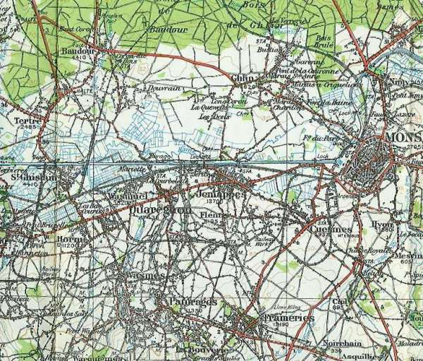
_Région de Mons_
_Carte d’E.M. anglaise au 1/100.000_

C’est une bande étroite de terrain qui, de Maurage, s’étend le long du canal de Mons à Condé sur une largeur de 36 km et une profondeur de 4 km au sud du canal. Au sud de cette bande, la contrée s’élève graduellement.

Sept routes divergent de Mons vers le nord-est ou le nord-ouest. Une série de monts entourent la ville : le mont Panisel, le Bois-la- Haut, au sud, le mont Eribus, le mamelon 93 au sud-est de Bois-la- Haut. Ce sont de bons points d’observation, surtout en direction de Saint-Symphorien.

A l’ouest de Mons, la ligne du canal est droite et les rives sont dégagées. Le canal, qui est rectiligne de Mons à Condé, contourne Mons par le nord : c’est le saillant de Mons. Une rivière, la Haine, longe le canal entre Pommeroeul et Saint-Ghislain.

La région occupée par le 2e C.A. britanniques est une agglomération minière qui s’étend entre Mons, Frameries, Dour, Boussu.

### Les forces en présence

**Ordre de bataille de l’armée anglaise, maréchal French**

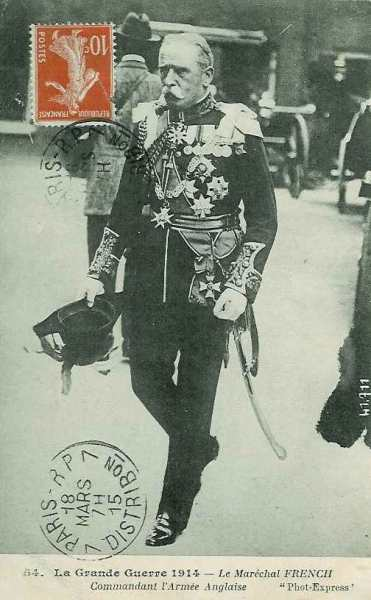
_Maréchal French (armée anglaise)_
_Collection privée_

**1e C.A. : général Haig**

_Général Haig (1e C.A.)_
_Collection privée_

1e division : général Lomax

| Unité | Commandant | Régiments |
| --- | --- | --- |
| 1st (Guards) Brigade | Maxse | 1st Coldstream Guards1st Scots Guards1st The Black Watch (Royal Highlanders)2nd The Royal Munster Fusiliers |
| 2nd Infantry Brigade | Bulfin | 2nd The Royal Sussex Regiment1st The Loyal North Lancashire Regiment1st The Northamptonshire Regiment2nd The King’s Royal Rifle Corps |
| 3rd Infantry Brigade | Landon | 1st The Queen’s (Royal West Surrey Regiment)1st The South Wales Borderers1st The Gloucestershire Regiment2nd The Welch Regiment |
| Cavalerie divisionnaire |  | A Squadron, 15th (The King’s) Hussars1st Cyclist Company |
| 25e brigade d’artillerie |  | 113th, 114th, 115th Battery, RFA |
| 26e brigade d’artillerie |  | 116th, 117th, 118th Battery, RFA |
| 39e brigade d’artillerie |  | 46th, 51th, 54th Battery, RFA |
| 43e brigade d’artillerie |  | 30th, 40th, 57th (Howitzer) Battery, RFA26th Heavy Battery, RGA |

2e division : général Monro

| Unité | Commandant | Régiments |
| --- | --- | --- |
| 4th (Guards) Brigade | Scott-Kerr | 2nd Grenadier Guards2nd Coldstream Guards3rd Coldstream Guards1st Irish Guards |
| 5th Infantry Brigade | Haking | 2nd The Worcestershire Regiment2nd The Oxfordshire and Buckinghamshire Light Infantry2nd The Highland Light Infantry2nd The Connaught Rangers |
| 6th Infantry Brigade | Davies | 1st The King’s (Liverpool Regiment)2nd The South Staffordshire Regiment1st Princess Charlotte of Wales’s (Royal Berkshire Regiment)1st The King’s Royal Rifle Corps |
| Cavalerie divisionnaire |  | B Squadron, 15th (The King’s) Hussars2nd Cyclist Company |
| 34e brigade d’artillerie |  | 22nd, 50th, 70th Battery, RFA |
| 36e brigade d’artilerie |  | 15th, 48th, 71st Battery, RFA |
| 41e brigade d’artillerie |  | 9th, 16th, 17th Battery, RFA |
| 44e brigade d’artillerie |  | 47th, 56th, 60th (Howitzer) Battery, RFA35th Heavy Battery, RGA |

**2e C.A. : général Grierson puis Smith-Dorrien**

_Général Smith Dorrien (2e C.A)._
_Collection privée_

3e division : général Hamilton

| Unité | Commandant | Régiments |
| --- | --- | --- |
| 7th Infantry Brigade | McCracken | 3rd The Worcestershire Regiment2nd The Prince of Wales’s Volunteers (South Lancashire Regiment)1st The Duke of Edinburgh’s (Wiltshire Regiment)2nd The Royal Irish Rifles |
| 8th Infantry Brigade | Doran | 2nd The Royal Scots (Lothian Regiment)2nd The Royal Irish Regiment4th The Duke of Cambridge’s Own (Middlesex Regiment)1st The Gordon Highlanders[4] |
| 9th Infantry Brigade | Shaw | 1st The Northumberland Fusiliers4th The Royal Fusiliers (City of London Regiment)1st The Lincolnshire Regiment1st The Royal Scots Fusiliers |
| Cavalerie divisionnaire |  | C Squadron, 15th (The King’s) Hussars
3rd Cyclist Company |
| 23e brigade d’artillerie |  | 107th, 108th, 109th Battery, RFA |
| 40e brigade d’artillerie |  | 6th, 23rd, 45th Battery, RFA |
| 42e brigade d’artillerie |  | 29th, 41st, 45th Battery, RFA |
| 30e brigade d’artillerie |  | 128th, 129th, 130th (Howitzer) Battery, RFA48th Heavy Battery, RGA |

5e division : général Fergusson

| Unité | Commandant | Régiments |
| --- | --- | --- |
| 13th Infantry Brigade | Cuthbert | 2nd The King’s Own Scottish Borderers2nd The Duke of Wellington’s (West Riding Regiment)1st The Queen’s Own (Royal West Kent Regiment)2nd The King’s Own (Yorkshire Light Infantry) |
| 14th Infantry Brigade | Rolt | 2nd The Suffolk Regiment1st The East Surrey Regiment1st The Duke of Cornwall’s Light Infantry2nd The Manchester Regiment |
| 15th Infantry Brigade | Count Gleichen | 1st The Norfolk Regiment1st The Bedfordshire Regiment1st The Cheshire Regiment1st The Dorsetshire Regiment |
| Cavalerie divisionnaire |  | A Squadron, 19th (Queen Alexandra’s Own Royal) Hussars5th Cyclist Company |
| 15e brigade d’artillerie |  | 11th, 52nd, 80th Battery, RFA |
| 27e brigade d’artillerie |  | 119th, 120nd, 121st Battery, RFA |
| 28e brigade d’artillerie |  | 122nd, 123rd, 124th Battery, RFA |
| 8e brigade d’artillerie |  | 37th, 61st, 65th (Howitzer) Battery, RFA108th Heavy Battery, RGA |

**Division de cavalerie : général Allenby**

_Général Allenby (C.C.)_
_Collection privée_

| Unité | Commandant | Régiments |
| --- | --- | --- |
| 1st Cavalry Brigade | Briggs | 2nd Dragoon Guards (Queen’s Bays)5th (Princess Charlotte of Wales’s) Dragoon Guards11th (Prince Albert’s Own) Hussars |
| 2nd Cavalry Brigade | de Lisle | 4th (Royal Irish) Dragoon Guards9th (Queen’s Royal) Lancers18th (Queen Mary’s Own) Hussars |
| 3rd Cavalry Brigade | Gough | 4th (Queen’s Own) Hussars5th (Royal Irish) Lancers16th (The Queen’s) Lancers |
| 4th Cavalry Brigade | Bingham | Household Cavalry Composite Regiment6th Dragoon Guards (Carabiners)3rd (King’s Own) Hussars |
| 3e brigade d’artillerie |  | D Battery, RHAE Battery, RHA |
| 7e brigade d’artillerie |  | I Battery, RHAL Battery, RHA1st Field Squadron, RE |

**5e brigade de cavalerie**

| Unité | Commandant | Régiments |
| --- | --- | --- |
| 5th Cavalry Brigade | Chetwode | 2nd Dragoons (Royal Scots Greys)12th (Prince of Wales’s Royal) Lancers20th HussarsJ Battery, RHA |

soit quatre divisions d’infanterie et 5 brigades de cavalerie.

**Ordre de bataille de la Ie Armée allemande : général von Kluck**

_Général von Kluck (Ie armée)_
_Collection privée_

**4e C.A.R (Magdeburg) : général von Gronau**

_Général von Gronau_
_Collection privée_

7e division d’infanterie de rés. : général von Schwerin

| Unité | Commandant | Régiments |
| --- | --- | --- |
| 13.Reserve-Infanterie-Brigade |  | Magdeburgisches Reserve-Infanterie-Regiment Nr. 27Reserve-Infanterie-Regiment Nr. 36 |
| 14.Reserve-Infanterie-Brigade |  | Reserve-Infanterie-Regiment Nr. 66Reserve-Infanterie-Regiment Nr. 72Reserve-Jäger-Bataillon Nr. 4 |
| Cavalerie |  | Schweres Reserve-Reiter-Regiment Nr. 1 |
| Artillerie |  | Reserve-Feldartillerie-Regiment Nr. 7 |

22e division d’infanterie de rés.

| Unité | Commandant | Régiments |
| --- | --- | --- |
| 43.Reserve-Infanterie-Brigade |  | Reserve-Infanterie-Regiment Nr. 71Reserve-Infanterie-Regiment Nr. 92 |
| 44.Reserve-Infanterie-Brigade |  | Reserve-Infanterie-Regiment Nr. 32Reserve-Infanterie-Regiment Nr. 82Reserve-Jäger-Bataillon Nr. 4 |
| Cavalerie |  | Reserve-Jäger Regiment zu Pferde Nr. 1 |
| Artillerie |  | Reserve-Feldartillerie-Regiment Nr. 22 |

**2e C.A. (Stettin) : général von Linsingen**

_Général von Linsingen ( 2e C.A.)._
_Collection privée_

3e division d’infanterie : général von Trossel

| Unité | Commandant | Régiments |
| --- | --- | --- |
| 5.Infanterie-Brigade |  | Grenadier-Regiment Nr. 2 (Stettin)Colbergsches-Grenadier-Regiment Nr. 9 (Stagard) |
| 6.Infanterie-Brigade |  | Füsilier-Regiment Nr. 34 (Stettin)Infanterie-Regiment Nr. 42 Stralsund) |
| Cavalerie divisionnaire |  | Grenadier-Regiment zu Pferde Nr. 3 |
| 3.Feldartillerie-Brigade |  | 1. Pommersches Feldartillerie-Regiment Nr. 2 (Kolberg)Vorpommersches Feldartillerie-Regiment Nr. 38 (Stettin) |

4e division d’infanterie : général von Pannewitz

| Unité | Commandant | Régiments |
| --- | --- | --- |
| 7.Infanterie-Brigade |  | Infanterie-Regiment Nr. 14 (Bromberg)6. Westpreußisches Infanterie-Regiment Nr. 149 (Schneidemühl) |
| 8.Infanterie-Brigade |  | 6. Pommersches Infanterie-Regiment Nr. 49 (Gnesen)4. Westpreußisches Infanterie-Regiment Nr. 140 (Hohensalza) |
| Cavalerie divisionnaire |  | Dragoner-Regiment Nr. 12 (Gnesen) |
| 4. Feldartillerie-Brigade |  | 2. Pommersches Feldartillerie-Regiment Nr. 17 (Bromberg)Hinterpommersches Feldartillerie-Regiment Nr. 53 (Bromberg) |

**3e C.A. (Berlin) : général von Lochow**

_Général von Lochow (3e C.A.)_
_Collection privée_

5e division d’infanterie : général Wichura

| Unité | Commandant | Régiments |
| --- | --- | --- |
| 9.Infanterie-Brigade |  | Leib-Grenadier-Regiment Nr. 8 (Frankfurt a.d.O.)Infanterie-Regiment Nr. 48 (Cüstrin) |
| 10.Infanterie-Brigade |  | Grenadier-Regiment Nr. 12 (Frankfurt a.d.O.)Infanterie-Regiment Nr. 52 (Cottbus)Brandenburgisches Jäger-Bataillon Nr. 3 (Lübben) |
| Cavalerie divisionnaire |  | "1/2" Husaren-Regiment von Zieten (Brandenburgisches) Nr. 3 (Rathenow) |
| 5.Feldartillerie-Brigade |  | Feldartillerie-Regiment Nr. 18 (Frankfurt a.d.O.)Neumärkisches Feldartillerie-Regiment Nr. 54 (Cüstrin) |

6e division d’infanterie : général von Rohden

| Unité | Commandant | Régiments |
| --- | --- | --- |
| 11.Infanterie-Brigade |  | Infanterie-Regiment Nr. 20 (Wittenberg)Füsilier-Regiment Nr. 35 (Brandenburg a.H.) |
| 12.Infanterie-Brigade |  | Infanterie-Regiment Nr. 24 (Neu-Ruppin)Infanterie-Regiment Nr. 64 (Angermünde)Brandenburgisches Jäger-Bataillon Nr. 3 (Lübben) |
| Cavalerie divisionnaire |  | "1/2" Husaren-Regiment von Zieten (Brandenburgisches) Nr. 3 (Rathenow) |
| 6.Feldartillerie-Brigade |  | Feldartillerie-Regiment Nr. 3 (Brandenburg a.H.)Kurmärkisches Feldartillerie-Regiment Nr. 39 (Perleberg) |

**4e C.A. : (Magdeburg), général Sixt von Arnim**

_Général Sixt von Arnim_
_Collection privée_

7e division d’infanterie : général Riedel

| Unité | Commandant | Régiments |
| --- | --- | --- |
| 13.Infanterie-Brigade |  | Infanterie-Regiment Nr. 26 (Magdeburg)3. Magdeburgisches Infanterie-Regiment Nr. 66 (Magdeburg) |
| 14.Infanterie-Brigade |  | Infanterie-Regiment Nr. 27 (Halberstadt)5. Hannoversches Infanterie-Regiment Nr. 165 (Quedlimburg) |
| Cavalerie divisionnaire |  | "1/2" Magdeburgisches Husaren-Regiment Nr. 10 (Leobschütz) |
| 7. Feldartillerie-Brigade |  | Feldartillerie-Regiment Nr. 4 (Magdeburg)Altmärkisches Feldartillerie-Regiment Nr. 40 (Burg) |

8e division d’infanterie : général Hildebrandt

| Unité | Commandant | Régiments |
| --- | --- | --- |
| 15.Infanterie-Brigade |  | Füsilier-Regiment Nr. 36 (Halle a.S)Anhaltisches Infanterie-Regiment Nr. 93 (Dessau)Magdeburgisches Jäger-Bataillon Nr. 4 (Naumburg a.S.) |
| 16.Infanterie-Brigade |  | 4. Thüringisches Infanterie-Regiment Nr. 72 (Torgau)8. Thüringisches Infanterie-Regiment Nr. 153 (Altenburg) |
| Cavalerie divisionnaire |  | "1/2" Magdeburgisches Husaren-Regiment Nr. 10 (Stendal) |
| 8. Feldartillerie-Brigade |  | Torgauer Feldartillerie-Regiment Nr. 74 (Torgau)Mansfelder Feldartillerie-Regiment Nr. 75 (Halle a.S.) |

**3e C.A.R. (Berlin) : général von Beseler**

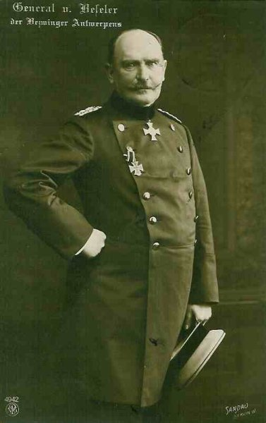
_Général von Beseler (3e C.A.R..)_
_Collection privée_

5e division d’infanterie de réserve : général Voigt

| Unité | Commandant | Régiments |
| --- | --- | --- |
| 9.Reserve-Infanterie-Brigade |  | Brandenburgisches Reserve-Infanterie-Regiment Nr. 8Brandenburgisches Reserve-Infanterie-Regiment Nr. 48 |
| 10.Reserve-Infanterie-Brigade |  | Brandenburgisches Reserve-Infanterie-Regiment Nr. 12Brandenburgisches Reserve-Infanterie-Regiment Nr. 52Reserve-Jäger-Bataillon Nr. 3 |
| Cavalerie |  | Reserve-Dragoner-Regiment Nr. 2 |
| Artillerie |  | Reserve-Feldartillerie-Regiment Nr. 5 |

6e division d’infanterie de rés. : général von Schickfuss

| Unité | Commandant | Régiments |
| --- | --- | --- |
| 11.Reserve-Infanterie-Brigade |  | Brandenburgisches Reserve-Infanterie-Regiment Nr. 20Brandenburgisches Reserve-Infanterie-Regiment Nr. 24 |
| 12.Reserve-Infanterie-Brigade |  | Magdeburgisches Reserve-Infanterie-Regiment Nr. 26Brandenburgisches Reserve-Infanterie-Regiment Nr. 35 |
| Cavalerie |  | Brandenburgisches Reserve-Ulanen-Regiment Nr. 3 |
| Artillerie |  | Reserve-Feldartillerie-Regiment Nr. 6 |

Ce C.A. sera ultérieurement détaché pour investir la place forte d’Anvers.

**9e C.A. (Altona) : général von Quast**

_Général von Quast  (9e C.A.)_
_Collection privée_

17e division d’infanterie : général von Bauer

| Unité | Commandant | Régiments |
| --- | --- | --- |
| 17e division d’infanterie | von Bauer |  |
| 33. Infanterie-Brigade |  | Infanterie-Regiment Nr. 75 (Bremen)Infanterie-Regiment Nr. 76 (Hamburg) |
| 34.Infanterie-Brigade |  | Großherzoglich Mecklenburgisches Grenadier-Regiment Nr. 89 (Schwerin)
Großherzoglich Mecklenburgisches Füsilier-Regiment Nr. 90 (Rostock)
Lauenburgisches Jäger-Bataillon Nr. 9 (Ratzeburg) |
| Cavalerie divisionnaire |  | Stab u. 3.Eskadron/2. Hannoversches Dragoner-Regiment Nr. 16 (Lüneburg) |
| 17. Feldartillerie-Brigade |  | Holsteinisches Feldartillerie-Regiment Nr. 24 (Güstrow)Großherzoglich Mecklenburgisches Feldartillerie-Regiment Nr. 60 (Schwerin) |

18e division d’infanterie : général von Kluge

| Unité | Commandant | Régiments |
| --- | --- | --- |
| 35. Infanterie-Brigade |  | Infanterie-Regiment Nr. 84 (Haldersleben)Füsilier-Regiment Nr. 86 (Flensburg) |
| 36. Infanterie-Brigade |  | Infanterie-Regiment Nr. 31 (Altona)Infanterie-Regiment Nr. 85 (Rendsburg) |
| Cavalerie divisionnaire |  | 3. Eskadron/2. Hannoversches Dragoner-Regiment Nr. 16 (Lüneburg) |
| 18. Feldartillerie-Brigade |  | Feldartillerie-Regiment Nr. 9 (Itzehoe)Lauenburgisches Feldartillerie-Regiment Nr. 45 (Altona) |

**9e C.A.R. (Altona) : général von Böhn**

_Général von Böhn (9e C.A.R.)_
_Collection privée_

17e division de réserve : général Wagener

| Unité | Commandant | Régiments |
| --- | --- | --- |
| 81. Infanterie-Brigade |  | Infanterie-Regiment Nr. 162Schleswig-Holsteinisches Infanterie-Regiment Nr. 163 |
| 33. Reserve-Infanterie-Brigade |  | Reserve-Infanterie-Regiment Nr. 75Reserve-Infanterie-Regiment Nr. 76 |
| Cavalerie |  | Reserve-Husaren-Regiment Nr. 6 |
| Artillerie |  | Reserve-Feldartillerie-Regiment Nr. 17 |

18e division de réserve : général Gronen

| Unité | Commandant | Régiments |
| --- | --- | --- |
| 34. Reserve-Infanterie-Brigade |  | Hanseatisches Reserve-Infanterie-Regiment Nr. 31Großherzoglich Mecklenburgisches Reserve-Infanterie-Regiment Nr. 90 |
| 35. Reserve-Infanterie-Brigade |  | Schleswigsches Reserve-Infanterie-Regiment Nr. 84Schleswigsches Reserve-Infanterie-Regiment Nr. 86Reserve Jäger-Bataillon Nr. 9 |
| Cavalerie |  | Reserve-Husaren-Regiment Nr. 7 |
| Artillerie |  | Reserve-Feldartillerie-Regiment Nr. 18 |

**1e C.C. : general der Kavallerie von der Marwitz**

_Général von der Marwitz (2e C.C.)_
_Collection privée_

2. D.C. : général von Krane

| Unité | Commandant | Régiments |
| --- | --- | --- |
| 5.  Kavallerie-Brigade |  | Dragoner-Regt.  Nr 2 (Berlin)Ulanen-Regt. Nr 3 (Potsdam) |
| 8. Kavallerie-Brigade |  | Kürassier-Regt. Nr 7 (Halberstadt)Husaren-Regt. Nr 12 (Torgau) |
| Leib-Husaren-Brigade |  | 1. Leib-Husaren-Regt. Nr 1 (Danzig)2. Leib-Husaren-Regt. Nr 2 (Danzig) |
|  |  | Bataillon du Feldartillerie-Regt. Nr 35 (Eylau)MG. Abtg. Nr. 4 (Thorn) |

4. D.C. : général von Garnier

| Unité | Commandant | Régiments |
| --- | --- | --- |
| 3. Kavallerie-Brigade |  | Kürassier-Regt. Nr 2 (Pasewalk)Ulanen-Regt. Nr 9 (Demmin) |
| 17. Kavallerie-Brigade |  | Dragoner-Regt Nr 17 (Ludwigslust)Dragoner-Regt Nr 18 (Parchim) |
| 18. Kavallerie-Brigade |  | Husaren-Regt. Nr 15 (Wandsbek)Husaren-Regt. Nr 16 (Schleswig) |
|  |  | Bataillon du Feldartillerie-Regt. Nr 3 (Brandenburg)MG. Abtg. Nr. 2 (Trier) |

9. D.C. : général von Schmettow

| Unité | Commandant | Régiments |
| --- | --- | --- |
| 13. Kavallerie-Brigade |  | Kürassier-Regt. Nr 4 (Münster)Husaren-Regt. Nr 8 (Paderborn) |
| 14. Kavallerie-Brigade |  | Husaren-Regt Nr 11 (Crefeld)Ulanen-Regt Nr 5 (Düsseldorf) |
| 19. Kavallerie-Brigade |  | Dragoner-Regt. Nr 19 (Oldenburg)Ulanen-Regt. Nr 13 (Hannover) |
|  |  | Bataillon du Feldartillerie-Regt. Nr 10 (Hannover)MG. Abtg. Nr. 7 (Köln) |

Soit 12 divisions d’infanterie et 3 D.C.

Notons l’énorme disproportion des forces : un contre trois. La chance du corps expéditionnaire sera due au fait que von Kluck ne va pas engager simultanément tous ses C.A., mais au fur et à mesure de leur arrivée vers Mons.

### Le dispositif anglais

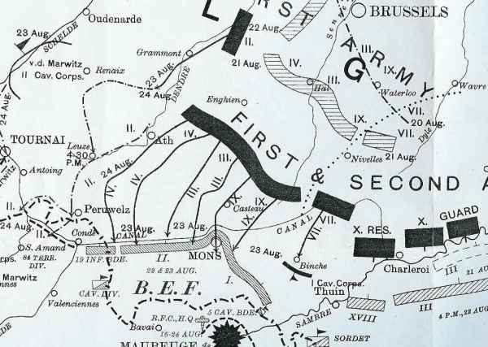
_Journée du 23 août 1914_
_Histoire officielle anglaise_

Etant donné la situation inquiétante de la droite anglaise où un vide de 20 km se dessine aux environs de Binche, French a disposé le 1e C.A. (Haig) sur un front de 11 km de Peissant à Harmignies, tandis que le 2e C.A. (Smith Dorrien) est en bordure d’Harmignies à Nimy et du canal de Mons à Condé, soit 27 km. La 19e brigade prolonge le dispositif à gauche du 1e C.A. sur une longueur de 8 km jusqu’à Condé. Des avant-postes sont établis sur la rive nord du canal.

La D.C. Allenby est à l’extrême gauche du dispositif pour parer à une menace d’enveloppement.

Les troupes sont dissimulées et retranchées.

Vu l’extrême étendue du front et la faiblesse des effectifs, la ligne de combat n’est qu’une chaîne de petits groupes tirant parti des fossés et créant des trous de tirailleurs.

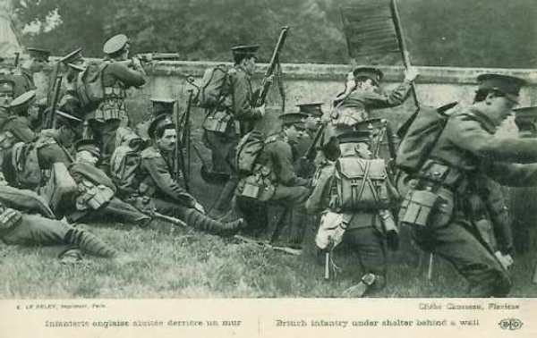
_Infanterie anglaise abritée_
_Collection privée_

Voici l’occupation des différents secteurs par les unités :

- 3e brigade d’infanterie entre Peissant et Haulchin.
  1e brigade d’infanterie entre Grand-Reng et Vieux-Reng
  2e brigade d’infanterie entre Villers-Sire-Nicole et Rouveroy.
  5e brigade de cavalerie de Haulchin à Harmignies.
  II/ Royal Irish Regiment à la falaise de Bois-la-Haut : il doit tenir les villages de Villers-Saint-Ghislain et Saint-Symphorien.
  I/ Gordon Highlanders et II/ Royal Scots près de la route d’Harmignies de la hauteur 93 à la corne nord-est de Bois-la-Haut.
  IV/ Middlesex entre Bois-la-Haut et le sommet du saillant de Mons.
  9e brigade d’infanterie le long du canal entre les ponts de Nimy sur la face ouest du saillant de Mons jusqu’au pont de Mariette, avec les IV/ Royal Fusiliers, I/ Royal Scots Fusiliers et I/ Nothumberland Fusiliers.
  I/ Lincolnshire à Cuesmes.
  7e brigade d’infanterie en réserve vers Ciply.
  I/ Royal West Kent à l’est de Saint-Ghislain.
  II/ Scottish Borderers à gauche des West Kents, avec les mitrailleuses du II/ Yorkshire light infantry. Une compagnie est retranchée au nord du pont.
  14e brigade d’infanterie pont-rail à Les Herbières avec une compagnie sur la rive nord.
  II/ Yorkshire Light Infantry entre le pont de chemin de fer à Les Herbières (non compris) jusqu’au pont routier de Pommeroeul.
  15e brigade d’infanterie : prépare une position de retrait derrière la Haine.
  II/ Suffolk et II/ Manchester (bataillons restants de la 14e brigade) : en réserve.
  4e brigade de cavalerie : à l’ouest de Pommeroeul, les deux passages restants à l’est de Condé, à l’écluse 5 et Saint-Aybert.
  La masse de l’artillerie est sur la gauche du dispositif général, pour couvrir un éventuel mouvement tournant de flanc.

### Premiers contacts

Le matin du dimanche 23 août, il y a du brouillard et de la pluie,  qui se dissipent vers 10h faisant place à un temps clair.

Les 1e et 2e divisions de cavalerie opèrent des reconnaissances à l’est de Mons vers les ponts de Binche, Bray, Havré, Obourg.

Les Allemands testent la défense anglaise vers le sommet du saillant. Les troupes montées anglaises de la 5e division passent le canal près des postes des Scottish Borderers et des West Kents et parcourent 1km au nord du pont de Les Herbières.

_Avant-poste anglais_
_Collection privée_

L’artillerie allemande tire à partir du terrain élevé au nord du canal.

### Front sur le canal (2e C.A. anglais)

**9 h :**

Les premiers obus allemands tombent sur Obourg.

**10 h :**

L’infanterie allemande (9e C.A.) est sur le point d’attaquer les Middlesex entre Obourg et Nimy. Les Anglais, bien retranchés, abattent à bout portant les fantassins allemands qui attaquent en rangs serrés. Les Middlesex et Royal Fusiliers défendent leurs positions avec acharnement et les maintiennent jusqu’à 11h.

**11 h :**

La droite du 9e C.A. ne semble pas s’étendre au-delà de Nimy. Vers 11h, le 3e C.A. entre en action vers le pont de Jemappes. Le poste avancé des fusiliers écossais se retire au sud du canal. Les Allemands s’engagent à l’ouest de Jemappes. A Mariette (secteur de la 9e brigade), une colonne par 4 s’avance par le chemin immédiatement à l’est du pont. Elle est arrêtée avec des pertes sévères. Les Allemands amènent alors deux canons de campagne à 900 m du canal et ouvrent le feu sur les défenseurs du pont. En utilisant un bouclier d’otages, les Allemands s’établissent vers l’ouest de la route à 200 m du canal et dirigent un feu d’écharpe sur les défenseurs du pont. Le poste avancé au nord du pont se retire.

Sur le pont de Saint-Ghislain, la compagnie des West Kents au carrefour sud de Tertre, en soutien de la 5e Divisional Mounted Troops est avertie de l’arrivée des Allemands par des cyclistes.

Les grenadiers de Brandebourg (5e division du IIIe C.A.) se sont mis en mouvement de Baudour sur Tertre, avec le bataillon de fusiliers en tête. Vers 11h10, ce bataillon débouche de Tertre vers le canal. Les Brandebourgeois subissent dans le village de Tertre des pertes dues à l’artillerie britannique (120e batterie sur le canal). Trois bataillons allemands, une batterie et une compagnie de mitrailleuses entrent alors en action. Les grenadiers brandebourgeois se ruent dans un dédale de clôtures en fil de fer et de fossés marécageux sur les positions principales des West Kents et des Scottish Borderers. Les 4 canons de la 120e batterie sont contraints au recul vers 12h.

**12 h :**

Les compagnies qui tiennent Tertre et Obourg en postes avancés cèdent à la menace d’enveloppement.

L’attaque sur le pont de Saint-Ghislain est arrêtée à 120m du canal par le feu anglais.

Vers 12h, l’attaque s’étend vers l’ouest jusqu’au pont des Herbières. Des renforts du II/Duke of Wellington et du II/Yorkshire Light Infantry sont appelés vers 14h en soutien des Scottish Borderers.

Au pont-rail des Herbières, les Allemands de la 6e division du 3e C.A. commencent à actionner une mitrailleuse à 900m de la barricade établie par les East Surreys. Elle est réduite au silence.

**13 h30 :**

A 13h30, les Allemands attaquent avec deux bataillons du 52e régiment. Les Suffolks et une compagnie des East Surreys sont arrivés sur ces entrefaites pour couvrir le flanc gauche du dispositif. Les Allemands sont repoussés avec de très grosses pertes. L’attaque allemande se prolonge à 12 km à l’ouest de Mons. L’infanterie du 4e C.A. n’a pas encore eu le temps d’achever sa conversion vers le sud. Si les Allemands avaient attaqué avec tous leurs C.A. en même temps, la situation pour les Anglais aurait été désespérée, ils auraient été écrasés sous la masse. Si les Allemands avaient attaqué plus à l’ouest de Mons, les forces anglaises auraient été tournées.

**15 h :**

Les Scots Fusiliers (9e brigade d’infanterie) reculent sur ordre de Jemappes vers Frameries. Un vif combat se déroule au milieu des terrils au nord de Frameries.

**16h :**

Les deux compagnies de réserve du Fifth Fusiliers (gauche de la 9e brigade) se jettent de l’ouest dans le flanc des Allemands. Ils permettent aux Scots de se dégager. L’artillerie allemande bombarde la position des South Lancashire (7e brigade), à 1800 m au nord de Frameries. Le Génie prépare la destruction du pont de Mariette. Plus à gauche, la 13e brigade d’infanterie tient toujours ses positions sur le canal. Les Allemands poussent trois batteries jusqu’à 1000 m du canal vers Saint-Ghislain.

Les Allemands amènent des canons à bonne portée et détruisent la barricade du pont-route des Herbières. Les Scottish Borderers se retirent sur la berge sud et le pont routier saute, de même que le pont-rail. Le pont-route près de La Hamaide saute également. Les East Surreys se replient par échelon de compagnie jusqu’à Thulin, au sud de la Haine.

Le pont près de Pommeroeul est détruit.

**16 h45 :**

La Cornwall Light Infantry repousse une troupe de cavaliers allemands arrivant par la route de Ville-Pommeroeul.

**17 h :**

Une attaque a lieu sur l’écluse 5. Le pont de l’écluse est détruit.

Les Allemands sont tenus un moment en échec à la lisière sud de Mons et atteignent peu à peu Frameries (5 km et demi au sud-ouest de Mons).

### Front à l’est et sud-est de Mons (1e C.A.)

**Jusqu’à 14 h :**

Tout est demeuré calme face au 1e C.A. Entre 11h et 12h30, la 6e brigade d’infanterie a pris position a gauche du 1e C.A. entre Velereille-le-Sec et Harmignies, avec la 4e brigade (Guards) derrière elle vers Harveng et la 5e brigade à Genly et Bougnies.

**14 h :**

Les canons allemands  entre Binche et Bray ouvrent le feu sur la hauteur d’Haulchin.

**15 h :**

La cavalerie allemande est aperçue en marche vers le front britannique de Bray vers Saint-Symphorien. Les 22e et 70e batteries de campagne à Velereille-le-Sec canonnent ces endroits. La 4e brigade (Guards) se porte en avant pour étendre le front de la 6e brigade, d’Harmignies le long de la route de Mons.

A 15h, un message du général major Hamilton annonce une sérieuse attaque sur la 3e division et demande de l’aide. Haig décide que deux bataillons de la 4e brigade viendront en soutien.

### Saillant de Mons

A l’ouest de Mons, le canal s’incurve vers le nord, contourne la ville, puis reprend sa trajectoire vers l’est. Le village de Nimy se trouve entre Mons et le canal, au nord de Mons. C’est le point le plus faible, car les défenseurs sont soumis à un feu convergent.

Partout sur la partie rectiligne du canal, les Allemands sont bloqués aussi vont-ils porter leur effort à Nimy où les défenseurs du saillant sont pris sous les feux concentriques.

Les unités se retirent méthodiquement de la boucle et luttent pas à pas jusqu’au mont Panisel.

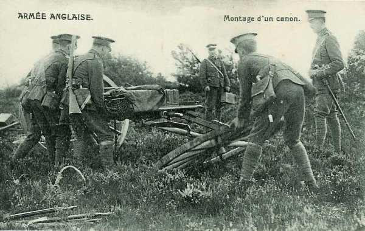
_Montage d’un canon anglais_
_Collection privée_

Une attaque de flanc est bloquée sur la route d’Harmignies. Les défenseurs du canal, menacés sur leur droite par l’évacuation de Mons, se replient sur le front Hensies, Nouvelles.

Les Middlesex qui se trouvent à Obourg commencent à reculer vers l’ouest à travers le bois d’Havré. L’infanterie allemande avance par flots vers le front du IV/Middlesex et IV/Royal Fusiliers. La 49e batterie tire à partir du Bois-la-Haut.

**12 h30 :**

Les Allemands réussissent à passer le canal à l’ouest d’Obourg et à atteindre le chemin de fer. Les Royal Irish reçoivent l’ordre de renforcer les Middlesex et se déploient à gauche de ceux-ci.

Le 9e C.A. allemand pousse une attaque. Le terrain des Royal Irish est mauvais car en vue des hauteurs au nord du canal. Les batteries allemandes de la 18e division entre Saint-Denis et Maisières les tiennent sous un feu violent. L’infanterie allemande gagne lentement du terrain.

**14 h :**

La section des mitrailleuses des Royal Irish essaie d’entrer en action sur la route à 300 m du nord du Bois-la-Haut.

Les Royal Fusiliers se retirent au sud de Nimy, le sommet du saillant. Après avoir été reformé dans Mons, le bataillon continue son mouvement vers Ciply.

**15 h15 :**

L’infanterie allemande se trouve à 200 m des Royal Irish. Ceux-ci se retirent à un km et demi vers le sud, sur les pentes nord du Bois-la-Haut.

**16 h :**

Le bataillon se rallie à la gauche des Gordons. Les Lincolnshire se retirent par Mesvin sur Nouvelles, à 5 km au sud de Mons.

La plus grande partie des Irish est à nouveau forcée à la retraite.

Les Irish se reforment à l’ouest de la pointe nord du Bois-la-Haut.

Le IV/Middlesex marche sur Hyon (sud de Mons) en direction de Nouvelles. La 23e batterie reçoit l’ordre de quitter le sommet de Bois-la-Haut. Un combat d’arrière-garde se déroule à Hyon.

**19 h :**

Les Allemands déclenchent une attaque générale contre le front des Gordons et Royal Scots le long de la route Harmignies - Mons.

### Situation à la tombée du jour

Les 7e et 9e brigades sont retranchées à la gauche de la 8e (entre Nouvelles et Frameries) à 5 km et demi au sud du canal. Les canons sont au voisinage de Frameries, mais les West Kents sont toujours le long du canal. A la gauche des West Kents, les Scottish Borderers ont retiré leurs compagnies avancées du nord du canal. En face des Herbières, les East Surreys ont rejoint une seconde position au sud de la Haine.

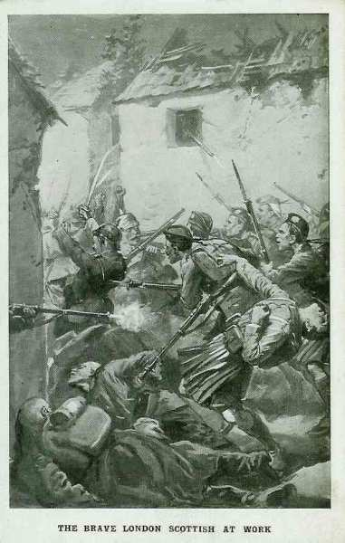
_Ecossais au combat_
_Collection privée_

A l’extrême gauche du dispositif, la 19e brigade est toujours en position sur la rive du canal. La gauche de la 3e division demeure sur la route entre Frameries et Cuesmes. La droite de la 5e division ne s’étend pas plus loin que la route de Quaregnon à Pâturages. Il y a donc un vide entre les flancs intérieurs de ces deux divisions. Il doit être comblé par la 5e brigade d’infanterie (en réserve près de Genly).

**21 h :**

Smith Dorrien donne l’ordre de reculer jusqu’à hauteur de Nouvelles.

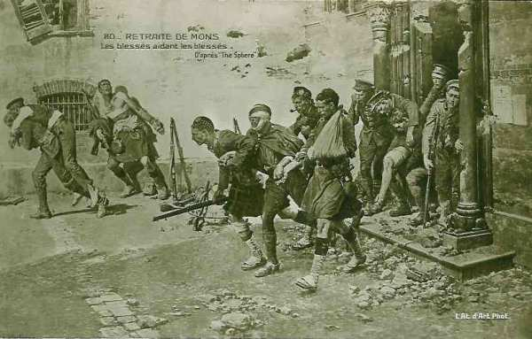
_La retraite de Mons_
_Collection privée_

French apprend que la Ve armée française bat en retraite vers la ligne Givet - Maubeuge. Son aviation lui signale une colonne de 20 km de long, en marche de Leuze à Peruwelz. La menace d’encerclement par les deux ailes se précise. Plus de dix D.I. sont signalées face aux quatre D.I. de French. Celui-ci ordonne la retraite et l’alignement sur la Ve armée.

**Minuit :**

Les Gordon Highlanders se mettent en marche et les Royal Scots se retirent compagnie par compagnie.

Les pertes des Britanniques se chiffrent à 600 hommes, surtout dans le saillant de Mons et parmi le 2e C.A.

Les clairons allemands sonnent le cessez-le-feu.

L’armée anglaise (80.000 hommes) a été disposée à l’extrémité ouest du dispositif allié, suite aux accords conclus de longue date avec l’Etat-Major français. Suite à cette disposition, elle s’est trouvée face à la Ie armée allemande (320.000 hommes).

L’armée anglaise est composée de volontaires aguerris par les incessants conflits que l’Angleterre a dû livrer pour conserver son empire (guerre des Boers notamment).

L’armée de von Kluck a eu affaire à un adversaire coriace et a subi de fortes pertes mais, comme la Ve armée française qui couvre la droite anglaise a dû battre en retraite, les Anglais se trouvent isolés, menacés d’encerclement et doivent décrocher au plus vite. Von Kluck, après cette victoire chèrement acquise, n’aura de cesse d’essayer d’encercler l’armée anglaise et la poursuivra sur plusieurs centaines de kilomètres.

### Souvenirs de la bataille

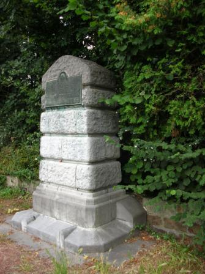
_Casteau : monument anglais_
_A cet endroit furent tirés les premiers coups de feu anglais sur le continent  depuis WaterlooPhoto de l’auteur_

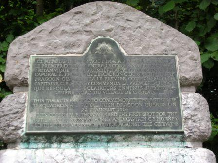
_Casteau : monument anglais_
_Photo de l’auteur_

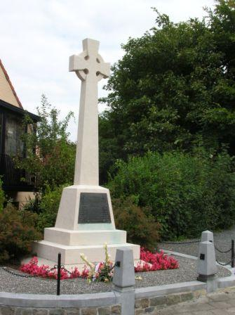
_La Bascule : monument du Royal Irish Regiment_
_Photo de l’auteur_

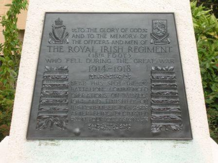
_La Bascule : monument du Royal Irish Regiment (détail)_
_Photo de l’auteur_

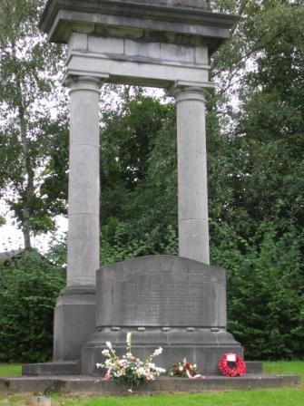
_La Bascule : monument commémoratif_
_Photo de l’auteur_

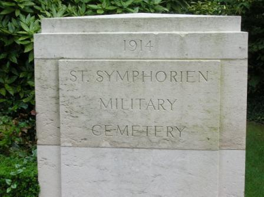
_Saint-Symphorien : cimetière militaire_
_Photo de l’auteur_

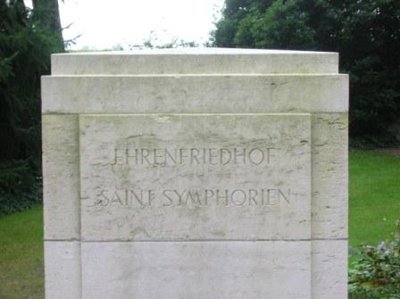
_Saint-Symphorien : cimetière militaire_
_Photo de l’auteur_

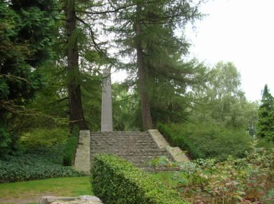
_Saint-Symphorien : monument allemand_
_Photo de l’auteur_

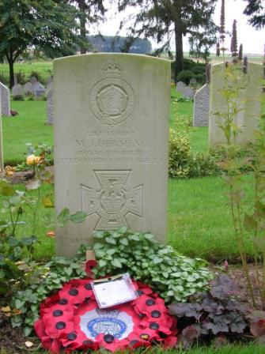
_Saint-Symphorien : stèle du lieutenant Dease, décoré de la Victoria Cross_
_Photo de l’auteur_

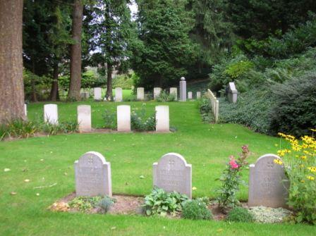
_Saint-Symphorien : tombes allemandes et anglaises_
_Photo de l’auteur_

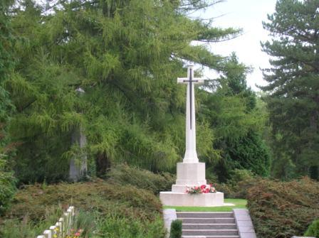
_Saint-Symphorien : croix anglaise_
_Photo de l’auteur_

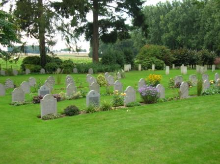
_Saint-Symphorien : tombes allemandes et anglaises_
_Photo de l’auteur_