# Bataille du Cateau (26 août 1914)

Après la bataille de Mons, les Anglais doivent retraiter, talonnés par le Ie armée allemande qui essaie de les déborder par l’ouest. Smith Dorrien décide, malgré la supériorité numérique de l’armée allemande, de marquer un temps d’arrêt dans la retraite et de tenir tête une journée.

### Les circonstances

Après la bataille de Mons où von Kluck n’a pas réussi à encercler l’armée anglaise, celle-ci retraite à marches forcées devant l’écrasante supériorité de la Ie armée allemande. Un obstacle d’importance se dresse sur ses routes de retraite : la forêt de Mormal située au sud de Bavai, au nord de Landrecies et au sud ouest de Maubeuge. Les deux corps d’armée sont obligés de se séparer, le IIe C.A. passant à l’ouest, le Ie passant à l’est.

Les ordres de French, de poursuivre la retraite vers Péronne, sont transmis à ses différentes formations, dont au IIe C.A. (Smith Dorrien), le 25 à 22h15. Smith Dorrien a la Ie armée allemande sur les talons et il sent que ses troupes sont épuisées par plusieurs jours de marche et de combats. Il accepte dans un premier temps de poursuivre la retraite, puis il se ravise, préférant donner un « coup d’arrêt » à la poursuite, tout en se rendant compte qu’il désobéit à un ordre. Il demande à Allenby (cavalerie) s’il est prêt à coopérer et celui-ci marque son accord.

### Le terrain

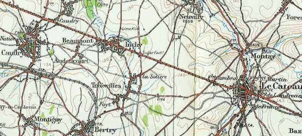
_Région du Cateau_
_Carte d’E.M. anglaise 1/100.000
éd 1916_

La bataille va avoir lieu dans une plaine légèrement ondulée, offrant peu d’abris pour l’artillerie et l’infanterie. Le terrain est parcouru du nord-ouest au sud-est par la route de Cambrai au Cateau sur une distance de 27 km.

La terre, sous le soleil d’août a durci et il est impossible de creuser des tranchées, seul un parapet peut être établi pour protéger les fantassins.

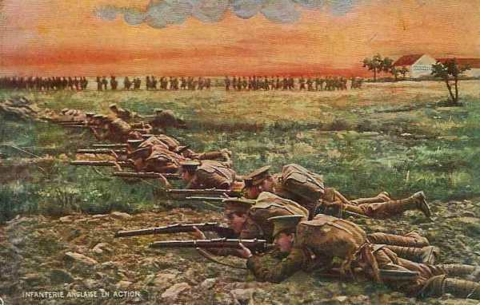
_Infanterie anglaise en terrain découvert_
_Collection privée_

La ligne que va choisir Smith Dorrien est un peu plus au sud de la route du Cateau à Cambrai, entre le Cateau et Caudry.

### Dispositif anglais

Le dispositif s’étend sur une longueur de 18 km d’est en ouest et forme une sorte de fer à cheval aplati.

- L’aile droite est tenue par la 5e division, la 14e brigade en arc au sud du Cateau, la 13e brigade à l’ouest de la route romaine partant de Bavay.

- Le centre est tenu par la 3e division, avec la 9e brigade à Inchy, la 8e brigade à Audencourt et la 7e brigade à Caudry.

- L’aile gauche est tenue par le 4e division, la 11e brigade à Fontaine-au-Pire, la 12e brigade près de Longsart et la 10e brigade à Haucourt, le long de la vallée de la Warnelle.

La 19e brigade d’infanterie est en réserve à Reumont, derrière l’aile droite, de même que les 2e et 3e brigades de cavalerie. La 4e brigade de cavalerie est derrière le centre à Ligny.

### Dispositif allemand

De gauche à droite, von Kluck dispose

- Le 3e C.A. (5e et 6e divisions).
  Le 4e C.A. (7e et 8e divisions)
  Le 2e C.C. (2e, 4e et 9e divisions)
  Une division du 4e C.A.R.

A la gauche des Anglais, Cambrai est occupé par la 84e division de d’Amade. Entre les Anglais et les territoriaux de d’Amade, il y a un vide de +- 2km, tenu par le C.C. Sordet.

La supériorité en moyens aurait permis à l’armée allemande d’infliger aux Anglais une défaite cuisante (du côté anglais, chaque brigade affrontera une division allemande, voir le tableau ci-dessous).

Von Kluck désire réaliser un double enveloppement de l’armée anglaise.

Voici de droite à gauche les unités qui  vont s’affronter :

| Anglais | Allemands |
| --- | --- |
| 14e brigade | 7e division |
| 13e brigade (partie) | 72e régiment d’infanterie |
| 19e brigade | 5e division |
| 3e brigade de cavalerie | 6e division |
| 13e et 15e brigades (partie) | 8e division |
| 9e, brigade | 4e division de cavalerie |
| 8e et 7e brigades | 9e division de cavalerie (partie) |
| 11e brigade | 9e division de cavalerie (partie) |
| 12e brigade | 2e division de cavalerie |
| 10e brigade | 7e division de réserve |

### Matinée

La bataille prend la forme d’un duel inégal d’artillerie. Les Allemands ont compris depuis Mons qu’ils n’avaient aucune chance s’ils opéraient une attaque d’infanterie en groupements serrés sans avoir neutralisé l’adversaire. Ils entreprennent de bombarder les positions anglaises : 230 canons anglais ripostent aux 550 pièces d’artillerie allemande sur toute la ligne de front.

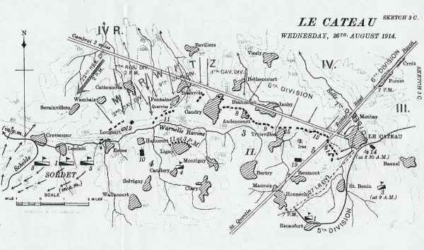
_Situation le 26 août 1914_
_Histoire officielle_

Une attaque sur l’extrême gauche du dispositif anglais est repoussée puis les Allemands se concentrent pendant la matinée sur la 5e division (aile droite) : l’attaque a lieu contre le King’s Own Yorkshire Light Infantry et les Suffolks.

Au centre du dispositif anglais, la matinée se passe sans incident. La 8e division du 4e C.A. et la 4e division de cavalerie ne lancent pas d’attaque dans ce secteur, à part un pilonnage inefficace. Les pertes britanniques sont de 200 hommes. Von Kluck désire en effet éviter une attaque frontale et prendre l’armée Anglaise en tenaille.

**6h :**

Deux compagnies des East Surreys à la droite du dispositif essaient d’obtenir la liaison avec le Ie C.A. (Haig), qui est en retraite. Ils sont surpris par le 4e C.A. allemand qui a traversé Le Cateau par temps de brouillard. Les Anglais perdent 200 hommes et rejoignent la 14e brigade vers midi dans la région de Honnechy et Maurois. L’infanterie allemande ne poursuit pas.

Les Allemands se rendent maîtres des collines à l’est. Ils disposent d’excellentes positions pour prendre les Anglais d’enfilade et la 5e division peut craindre d’être enveloppée.

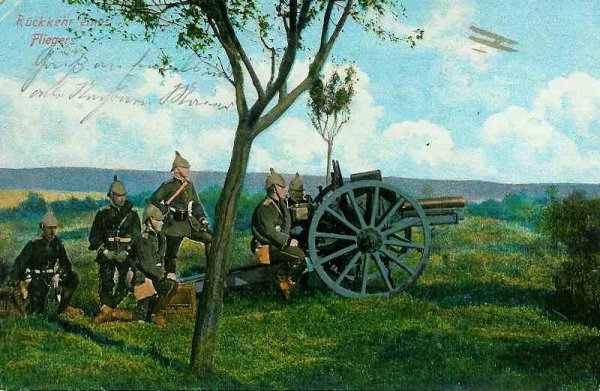
_Artillerie de campagne allemande_
_Collection privée_

Pourtant, les Allemands ne réussissent pas à percer. Les 42 canons de campagne anglais et une seule batterie de howitzers font obstacle à toutes les tentatives du 4e C.A. L’infanterie anglaise subit plus de pertes du fait des mitrailleuses qu’à cause de l’artillerie.

Les Allemands commencent à pilonner la ligne britannique. Les anglais répondent en avançant leurs canons pour protéger leur infanterie. Les canons des 28e, 15e brigades sont amenés à l’aile droite.

**10h :**

Les Suffolks (aile droite) sont écrasés par un important pilonnage d’artillerie. Les Anglais répliquent mais sont exposés au feu provenant de l’est du Cateau.

**11h :**

La position des Anglais est délicate et les Suffolks ont subi de nombreuses pertes.

Les Manchesters et deux compagnies des Argylls sont envoyés pour renforcer les Suffolks, mais, pris à revers, ils subissent de fortes pertes.

**12h :**

La ligne anglaise tient. Les Allemands  concentrent leurs attaques contre le flanc droit. La 5e division est prise en enfilade de deux côtés et sa position devient précaire.

**Après-midi :**

La grande menace réside dans le flanc droit non protégé et, au début de l’après-midi, la situation devient extrêmement critique quand la 5e division du 3e C.A. allemand entre dans la bataille et avance dans la vallée de la Selle. Les Suffolks, Manchesters et Argylls subissent le feu intense d’artillerie de trois divisions allemandes et les attaques frontales et de flanc de douze bataillons d’infanterie.

**13h :**

Sordet (général du C.C. français) a appris par téléphone la situation critique de l’armée anglaise. Il prépare une intervention sur le flanc droit des Allemands. Ses divisions se portent sur l’Escaut en trois colonnes :

- 5e division sur Crévecoeur.
  3e division sur Masnières.
  1e division sur Marcoing (ces trois localités sont dans la région de Cambrai).

Les deux premières divisions rencontrent les Allemands qui ont franchi la route du Cateau à Cambrai. L’artillerie des deux divisions et plusieurs escadrons à pied entrent en ligne pour ralentir la marche des Allemands.

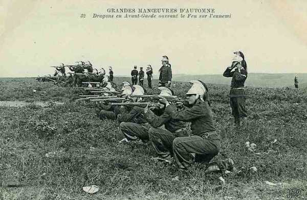
_Dragons français combattant à pied_
_Collection privée_

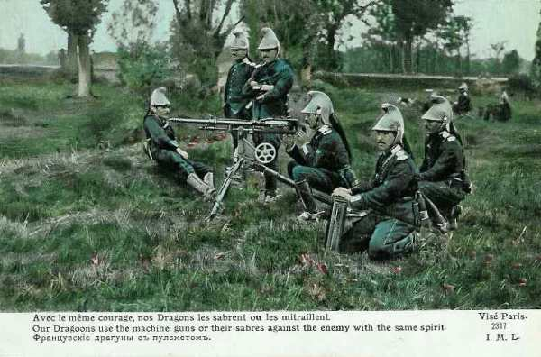
_Dragons français à la mitrailleuse_
_Collection privée_

**13h30 :**

Smith Dorrien estime le moment venu de se désengager : il donne l’ordre de retraite. Elle doit s’effectuer par divisions de droite à gauche : la 5e division sera la première à se retirer. Comme les téléphones de campagne sont détruits, l’ordre doit être transmis par porteur et il n’atteint la 5e division qu’à 14h. Le 2e régiment King’s Own Yorkshire Light Infantry et le 2e Suffolk ne recevront même pas cet ordre et seront cernés.

Les batteries sont retirées canon après canon. Ceux qui ne peuvent être amenés sont sabotés.

**14h :**

Von Kluck engage cinq divisions d’infanterie et trois de cavalerie, sans succès.

**15h30 :**

Hamilton (3e division) donne l’ordre de retraite, de droite à gauche, couvert par la 8e brigade d’infanterie à Audencourt. Les 9e et 7e brigades se retirent via Bertry et Montigny, suivies une heure plus tard par la 8e brigade.

**16h :**

Les restes de la 5e division opèrent leur retraite. Certaines unités n’ont pas reçu l’ordre de retraite et sont isolées.

**16h30 :**

Le C.C. Sordet fait échouer plusieurs tentatives du 4e C.A.R. allemand de tourner le flanc gauche britannique.

**17h :**

La 12e brigade commence sa retraite vers le sud, couverte par les Seaforths de la 10e brigade. La 11e brigade suit une heure plus tard depuis Ligny, couverte par la 29e brigade et le 4e brigade de cavalerie. Ces unités se dirigent vers Vendhuille et Le Catelet.

**18h :**

La 5e division anglaise a rompu le contact avec l’armée allemande.

**19h :**

Les soldats de Smith Dorrien constatent avec surprise que l’artillerie de von Kluck continue à pilonner les positions qu’ils ont abandonnées.

La 7e division atteint Reumont et la 5e Honnechy.

**21h :**

Les unités anglaises atteignent Destrées, 18 km au sud du champ de bataille.

### La poursuite

Les Allemands ne poursuivent pas immédiatement les Anglais.

Une controverse éclatera après la guerre entre French et Smith Dorrien sur le point de savoir si la bataille du Cateau aurait dû avoir lieu. French avait en effet donné l’ordre à ses deux C.A. de poursuivre la retraite. Il semble que Smith Dorrien, en résistant pendant douze heures ait donné un coup d’arrêt à l’armée de von Kluck, permettant au corps expéditionnaire de se dégager. Par la suite, von Kluck oriente mal son armée dans la direction de Péronne et Bapaume, relâchant la pression sur l’armée anglaise. Il pense que les Anglais vont se retirer vers les ports pour réembarquer.

C’est un second échec après Mons pour von Kluck dans sa tentative d’encercler l’armée anglaise.

### Les souvenirs de la bataille

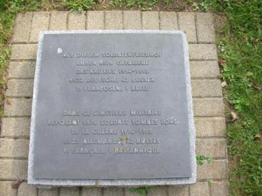
_Entrée du cimetière allemand_
_Photo de l’auteur_

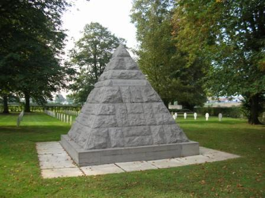
_Monument franco-allemand_
_Photo de l’auteur_

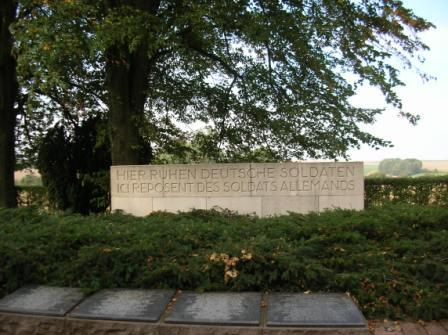
_Monument allemand_
_Photo de l’auteur_

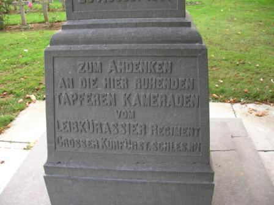
_Monument des Leibkuerassiere_
_Photo de l’auteur_

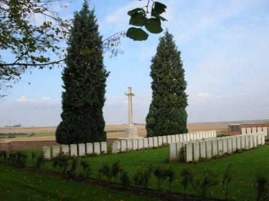
_Cimetière anglais_
_Photo de l’auteur_