# Bataille du Grand Couronné de Nancy (4 - 13 septembre 1914)

Après l’échec de l’offensive française en Lorraine, l’armée allemande essaie de s’emparer de Nancy, ce qui constituerait une victoire de prestige. L’empereur vient en personne suivre le déroulement de la bataille. Castelnau déploie ses troupes et son artillerie sur les hauteurs à l’est de Nancy. L’armée allemande ne parvient pas à en déloger les Français. Castelnau figure souvent sur les cartes postales avec le titre de "sauveur de Nancy".

### Circonstances

L’offensive en Lorraine (bataille de Morhange - Sarrebourg) s’est soldée par un échec. Les Ie et IIe armées françaises doivent se replier et les bavarois passent à l’offensive. Leur objectif est de s’emparer de Nancy car la prise de cette ville constituerait une victoire de prestige pour l’armée allemande. L’empereur Guillaume II y attache tellement d’importance qu’il vient en personne assister au déroulement de l’offensive. Il espère pouvoir défiler à la tête des cuirassiers de sa garde. Les Allemands tentent d’abord de forcer la trouée de Charmes mais échouent. Voir « Bataille de la trouée de Charmes ». Ils changent ensuite de tactique. Au lieu de déborder Nancy par le sud, ils vont l’attaquer de front et essayer d’enfoncer de vive force les défenses du Grand Couronné.

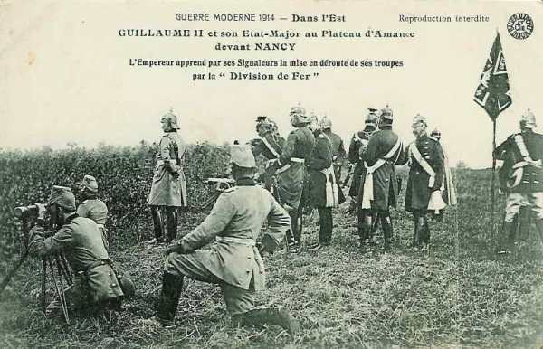
_Guillaume II sur le plateau d’Amance_
_Collection privée_

### Le terrain

"Grand Couronné" désigne une série de hauteurs dominant la plaine à l’est de Nancy. Voici le nom des collines du nord au sud :

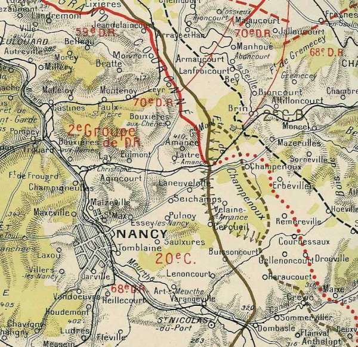
_Nancy et le Grand Couronné_
_La guerre racontée par nos généraux_

- La côte Sainte-Geneviève (394m)
  Le Mont Toulon (375m)
  Le Mont Saint-Jean (400 m)
  Le Plateau du Bois du Chapitre (400 m)
  Le Plateau du bois de Faulx avec l’éperon de la Rochette (406 m)
  Le plateau de Malzéville.
  Le Rembêtant

Ces hauteurs dominent nettement la plaine et constituent d’excellents postes d’observation.

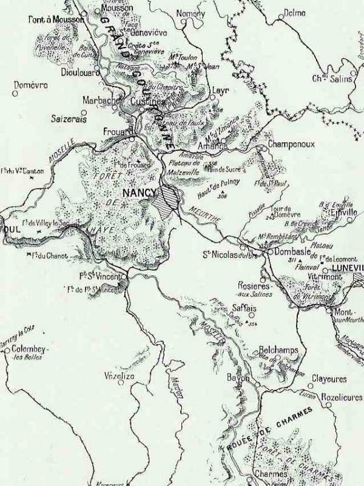
_Champ de bataille du Grand Couronné_
_C Michelin, selon guide édition 1919, autorisation 06-B-05_

La ville de Nancy, située à l’époque très près de la frontière allemande n’a jamais été fortifiée par crainte de complications diplomatiques avec l’Empire. Ce n’est qu’en mars 1914 que des travaux de campagne sont entrepris.

### Dispositif français

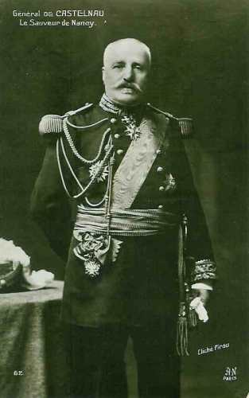
_Général de Castelnau (IIe armée)_
_Collection privée_

Le front de la IIe armée s’étend sur 70 km. Celle-ci comprend

- Le 16e C.A. (31e, 32e D.I., 74e D.R.)
  Le 20 e C.A. (11 e , 39 e D.I., 70e D.R.)

Elle dispose de cent pièces d’artillerie lourde.

En avant de Nancy, la défense comporte :

- Une ligne principale de résistance de Laneuvelotte au Rembêtant.
  Une position de repli de Seichamps à Lenoncourt.

Les pièces d’artillerie sont réparties au mont Toulon, au plateau de La Rochette, au mont Amance, au bois de Pulnoy et au Rembêtant.

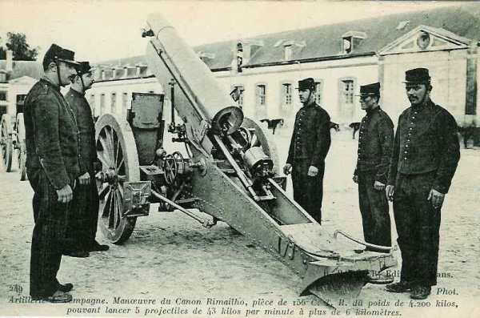
_Canon Rimailho 155_
_Collection privée_

Les forces sont disposées comme suit :

- 2e groupe de divisions de réserve : de la Moselle au Rembêtant, soit un front de 35 km pour un effectif de 30 à 35.000 hommes.

- 20e C.A. (Balfourier, qui a remplacé Foch) : de Réméréville à la Meurthe (Buissoncourt, Haraucourt, Flainval) avec des éléments avancés à Réméréville, Courbesseaux, Maix, Friscati.

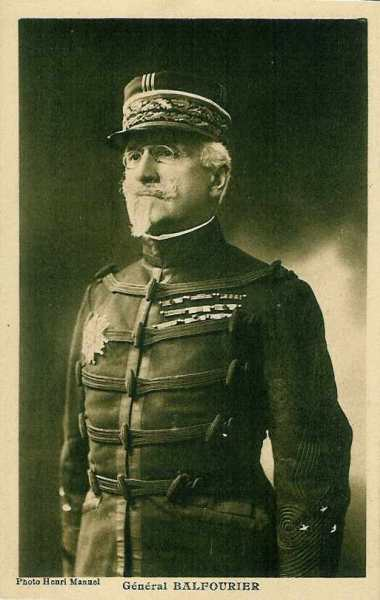
_Général Balfourier_
_Collection privée_

- 16e C.A. (Taverna) tient le reste du front et assure la liaison avec la Ie armée, ses gros sur la Mortagne.

Entre la IIe et la IIIe armée, il y a un vide de 13 km de terrain marécageux dont les issues sont barrées par les forts des Hauts de Meuse : les Paroches, Camps des Romains, Liouville, Girouville.

### 4 septembre

**11h :**

Les Allemands déclenchent un bombardement violent sur les hauteurs à l’est de Courbesseaux et de Drouville, Maixe, Friscati Vitrimont.

_Artillerie allemande de campagne_
_Collection privée_

**15h :**

L’infanterie allemande attaque le bois d’Einville en masses profondes Les avant-postes français doivent se replier en toute hâte. Les villages de Maixe, de Drouville, de Réméréville et de Courbesseaux sont perdus. La partie de la forêt de Champenoux, au nord de la route de Château-Salins, doit être évacuée.

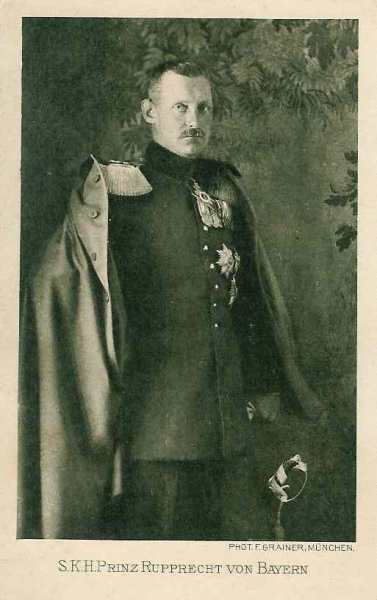
_Rupprecht de Bavière (VIe armée)_
_Collection privée_

A l’aile droite de la IIe armée, de violentes attaques obligent le 16e C.A. à se replier sur la rive gauche de la Mortagne.

**17h :**

Une contre-attaque, menée parallèlement par le 8e C.A. de la Ie armée, refoule les Allemands et les oblige à repasser sur la rive droite de la Mortagne.

**23h :**

Les Allemands attaquent le 20e C.A. Champenoux et Erbéviller deviennent le théâtre de combats acharnés.

### 5 septembre

**Matin :**

La ligne française passe par Champenoux, le bois de Crévic, le Léomont, Vitrimont, Xermaménil.

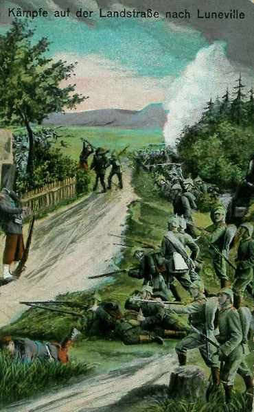
_Combats près de Lunéville vus du côté allemand_
_Collection privée_

**5h :**

La 136e brigade contre-attaque et rentre vers 6h dans Champenoux qui a été évacué. Erbéviller est pris et repris plusieurs fois et reste finalement aux mains des Allemands.

Le 20e C.A. tente de reprendre les positions perdues la veille, mais devant le feu violent de l’artillerie et des mitrailleuses, doit arrêter son offensive.

Un violent bombardement s’abat sur le signal de Xon et sur Mousson.

**11h :**

Devant la menace d’une forte colonne allemande, le 367e R.I. doit abandonner Pont-à-Mousson, fait sauter le pont sur la Moselle et se replie sur Dieulouard. Sur la rive gauche de la Moselle, les Allemands ont pénétré dans le Bois-le-Prêtre.

**14h :**

- A la droite de la IIe armée, la droite du 16e C.A. est sérieusement compromise.

- Au centre, le 20e C.A. a sa gauche appuyée aux hauteurs du Grand Couronné.

- A gauche, la retraite de la 73e div. rés. A découvert en partie le flanc du 2e G.D.R.

**17h :**

Les 31e et 15e D.R. déclenchent une offensive. Les Allemands sont refoulés sur la Mortagne. Seul Gerbéviller reste en leurs mains.

**18h :**

Au 20e C.A., les 11e et 39e D.I. lancent dans la soirée des contre-attaques pour reprendre le terrain perdu mais une nouvelle offensive allemande se déclenche sur la gauche du 20e C.A.

A Réméréville, les troupes de la 70e D.R. épuisées par une nuit de combats se replient, entraînant dans leur recul les défenseurs de Courbesseaux.

La 11e D.I. doit abandonner le signal de Friscati et la lutte se poursuit toute la nuit dans Deuxville et au Léomont, qui est soumis à un bombardement effroyable. Deuxville est perdue.

**Front français en fin de journée**

Le front du 20e C.A. passe par Haraucourt, le bois de Crévic, Deuxville, le Léomont, Vitrimont.

En résumé, les Allemands n’ont remporté aucun succès décisif et n’ont pas atteint les hauteurs du Grand Couronné.

### 6 septembre 1914

Deux batailles se livrent aux extrémités du front de la IIe armée.

A droite, les 16e et 8e C.A. rétablissent complètement leurs lignes.

- Le 16e C.A. réoccupe Gerbéviller.

- Le 20e réalise une importante avance. La 39e div. reprend Crévic. La 70e div. rés. Progresse mais ne peut réoccuper Réméréville et Courbesseaux.

L’effort principal des Allemands se porte à la gauche de la IIe armée, sur les deux rives de la Moselle. La position de Sainte-Geneviève est bombardée toute la journée.

**19h :**

L’infanterie monte à l’assaut de la position de Sainte-Geneviève vers 18h, en masses profondes, au son des fifres et des tambours mais les bataillons sont fauchés par le tir des 75 et des mitrailleuses. Les assaillants reprendront l’attaque pendant la nuit sans plus de succès. Le commandement allemand essaie ensuite de tourner la position.

**En soirée :**

La ligne de défense française est intégralement maintenue mais la retraite de la 73e D.R. sur une profondeur de 6 km découvre le flanc gauche du Grand Couronné.

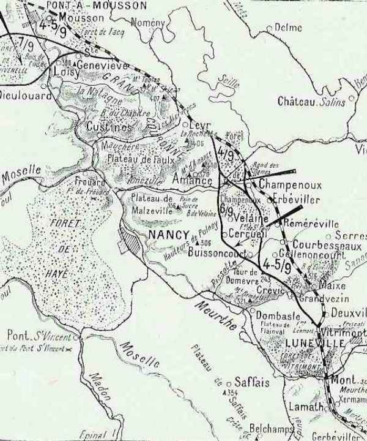
_Attaque du Grand Couronné (4 au 7 septembre 1914)_
_C Michelin selon guide édition 1919, autorisation 06-B-05_

### 7 septembre 1914 : point culminant de la bataille

L’armée allemande prononce une attaque directe sur Nancy. L’effort principal se porte sur la région du mont d’Amance, Velaine. L’axe est la route de Château-Salins à Nancy.

**6h :**

Les Allemands prononcent des attaques dans la région de Champenoux mais ne peuvent déboucher de la forêt. Au fur et à mesure qu’ils débouchent, ils sont massacrés par le tir des 75 en position sur le mont Amance. Mais plus au sud, les 206e et 212e d’infanterie se font presque anéantir lors d’une contre-attaque dans la forêt de Champenoux. Galvanisés par la présence de l’empereur, les Allemands s’emparent des villages de Cercueil, de Velaine et de Buissoncourt. Le Grand Couronné est débordé par le nord et par le sud.

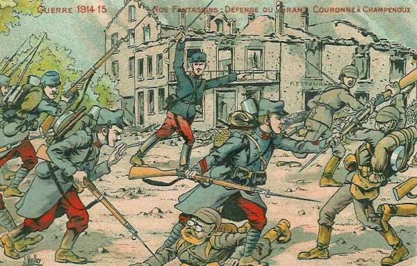
_Combats de Champenoux_
_Collection privée_

La 136e brigade perd Champenoux. Les batteries françaises d’Amance et de La Rochette sont écrasées par l’artillerie et réduites à l’impuissance. Le défilé de l’Amézule (entre le plateau de Faulx et de Malzeville) est aux mains des Allemands ainsi que la forêt de Champenoux. La route directe de Nancy est ouverte.

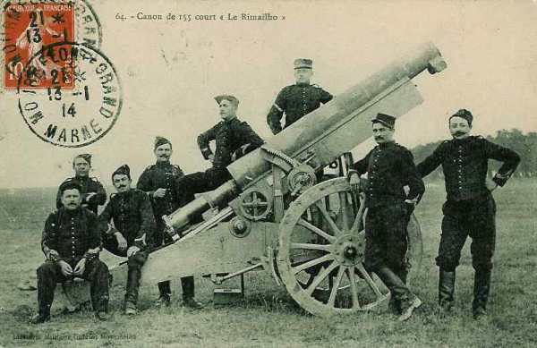
_Canon Rimailho 155_
_Collection privée_

Les forces allemandes qui opèrent sur la rive gauche de la Moselle refoulent les faibles éléments qui défendent le fleuve et s’avancent vers Dieulouard. Les défenseurs de Loisy et de la crête de Sainte Geneviève sont pris à revers. Le commandant qui défend Sainte-Geneviève refuse d’évacuer malgré les prescriptions du commandement et le fera finalement sur ordre écrit impératif.

**10h :**

Le nouveau commandant de la 73e div. rés. Reprend l’offensive et réoccupe Dieulouard. Les Allemands ne se rendent pas compte que la crête de Sainte-Geneviève a été abandonnée.

**19h :**

Les Français réoccupent la crête de Sainte-Geneviève.

Castelnau, pour échapper au désastre, envisage une retraite vers la place forte de Toul, mais ce recul mettrait la Ie armée dans une situation critique. Dubail insiste pour que l’on tienne devant Nancy.

Pour faire face à la menace directe sur Nancy, Castelnau constitue une masse de manoeuvre sous les ordres du général Ferry, dans la région de Lénoncourt : 8 bataillons et demi.

### 8 septembre 1914 : riposte de la IIe armée

Malgré la fatigue extrême des troupes, les débouchés sur de la forêt de Champenoux sont maîtrisés.

**6h :**

Le 20e C.A. attaque avec les 70e et 39e D.I.

**16h :**

Le 16e C.A. se porte en avant et progresse sur la rive droite de la Mortagne mais suite à une contre-attaque, doit regagner sa position de départ.

En conclusion : La reprise de la Bozule et d’une partie de la forêt de Champenoux referme la route vers Nancy. L’activité allemande se reporte en Woëvre et sur les Hauts de Meuse.

### 9 septembre

- Les 20e et 16e C.A. attaquent pour empêcher les Allemands de porter leurs réserves plus au nord.

- La 70e D.R. attaque entre la forêt de Saint-Paul et les bois d’Haraucourt, la 39e D.I. vers Drouville.

- Le 16e C.A. dirige la 64e brigade sur Rosières-aux-Salines.

Le 20e C.A. réalise d’importants progrès et pénètre jusqu’au milieu de la forêt de Saint-Paul. Sur la rive gauche de la Moselle, la 73e D.R. réoccupe Dieulouard.

### 10 septembre

Les Allemands bombardent Nancy et Castelnau décide de répliquer.

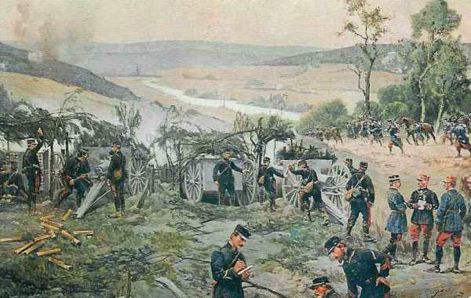
_Bataille du Grand Couronné_
_Collection privée_

L’attaque principale sera menée par le 2e G.D.R. et le 20e C.A. en direction de Champenoux pour le premier et Réméréville et Courbesseaux pour le second. La 16e C.A. agira vers Lunéville.

**11h :**

Les fantassins du 2e G.D.R. progressent sous un feu violent de l’artillerie allemande.

**11h45 :**

Au 20e C.A., le détachement Ferry passe à l’attaque.

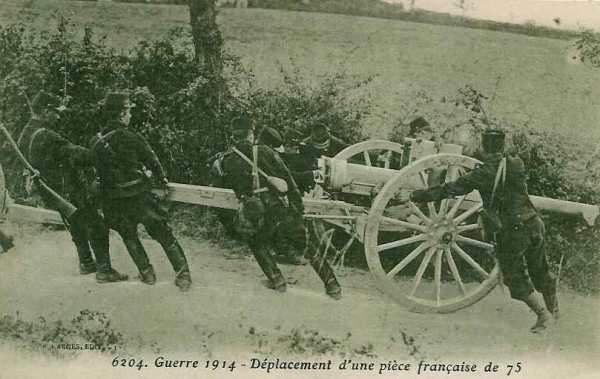
_Déplacement d’une pièce de 75_
_Collection privée_

**16h :**

Le 16e C.A. se heurte à des tranchées solidement occupées au nord de la Mortagne.

Joffre adresse ses félicitations à Castelnau :

« Depuis près d’un mois, l’armée que vous commandez a combattu presque tous les jours et a montré des qualités remarquables d’endurance, de ténacité et de bravoure. Quelque difficiles qu’aient été pour vous les circonstances, vous avez réussi à vous maintenir sur les hauteurs du Grand Couronné, à repousser les attaques furieuses lancées contre vous et à empêcher l’ennemi de pénétrer dans Nancy.

Je tiens à vous exprimer ma sympathie et vous prie de la transmettre aux troupes sous vos ordres. »

### 11 septembre : début du dégagement de Nancy

La lutte se concentre entre le mont d’Amance et le Sanon. La bataille de la Marne est déjà gagnée et la bataille en Lorraine n’a plus la même importance pour le commandement allemand.

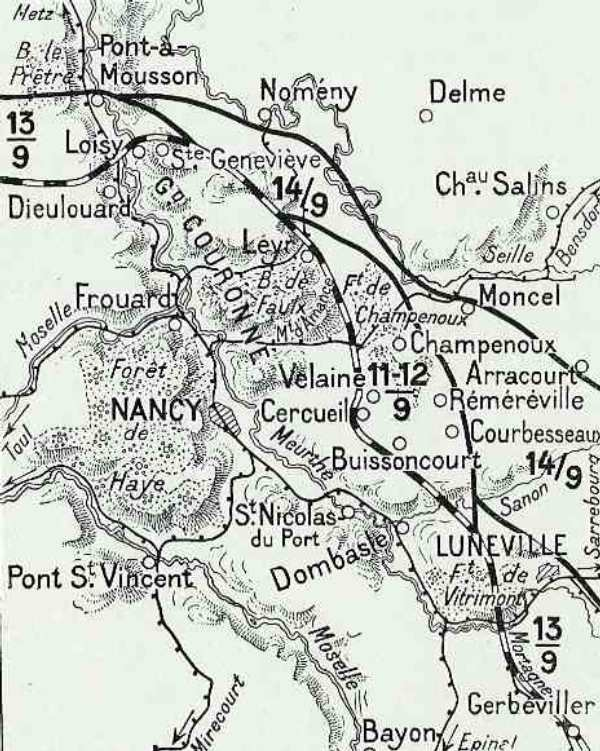
_Dégagement de Nancy_
_C Michelin selon guide édition 1919, autorisation 06-B-05_

Les ordres sont de poursuivre l’offensive à l’est de Nancy.

- Au 2e G.D.R., la lutte continue dans la forêt de Champenoux.
  Le 20e C.A. attaque vers Réméréville et Drouville.

L’avance est pénible. L’infanterie allemande, solidement retranchée, est bien pourvue de mitrailleuses et résiste avec ténacité.

### 12 septembre

Les Allemands sont en retraite sur tout le front. Les Ie et IIe armées françaises progressent sur toute la ligne.

La Ie armée rentre dans Saint-Dié et marche sur Raon-l’Etape et Baccarat.

**9h :**

Le 16e C.A. rentre dans Lunéville

Le 20e C.A. trouve Friscati libre d’ennemis et occupe Drouville, Courbesseaux et Réméréville.

Les Allemands se retirent derrière la Seille et la Loutre Noire.

**Après-midi :**

Joffre donne l’ordre au 20e C.A. de passer sur la rive gauche de la Moselle pour agir, avec la 73e D.R. sur la rive droite de la Meuse vers Verdun.

### 13 septembre

La bataille du Grand Couronné prend fin. Pont-à-Mousson est repris sans combat. Les armées françaises arrivent à la frontière allemande. La poursuite est effectuée jusqu’à la Seille où les Allemands se retranchent. Le front va se stabiliser pendant quatre ans.

### Les souvenirs de la bataille

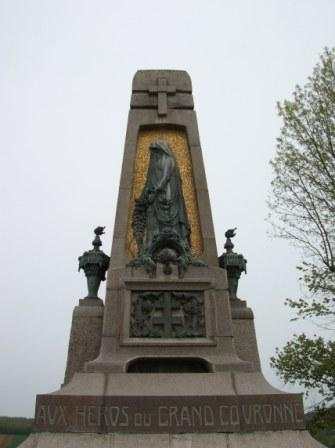
_Champenoux : monument_
_Photo de l’auteur_

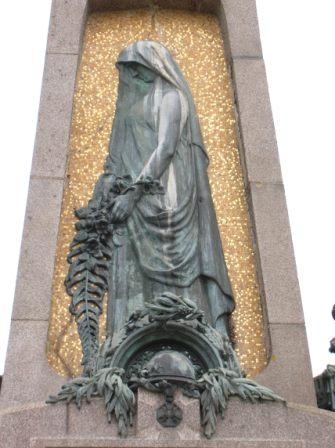
_Champenoux : détail du monument_
_Photo de l’auteur_

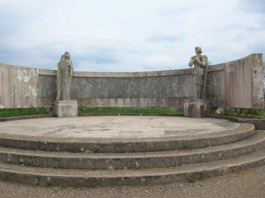
_Monument aux défenseurs du Grand Couronné (Sainte-Geneviève)_
_Photo de l’auteur_

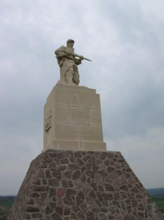
_Monument de Léomont à la 11e division_
_Photo de l’auteur_

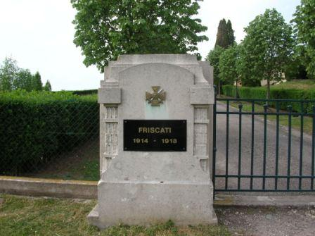
_Entrée du cimetière de Friscati_
_Photo de l’auteur_

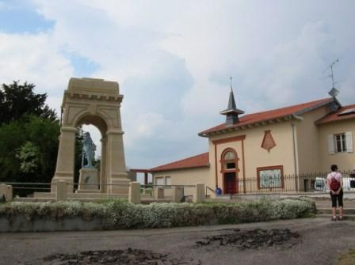
_Monument de Friscati_
_Photo de l’auteur_

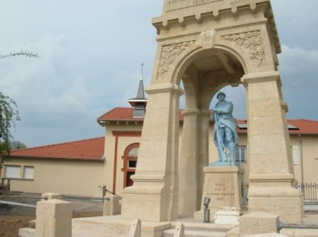
_Monument de Friscati_
_Photo de l’auteur_

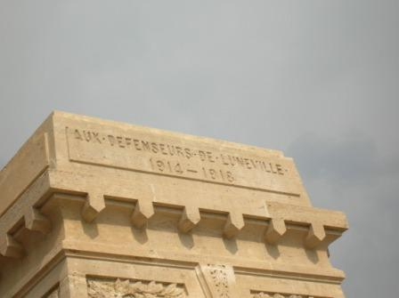
_Détail du monument de Friscati_
_Photo de l’auteur_