# Bataille des deux Morins (6 - 9 septembre 1914)

La bataille des deux Morins est un épisode de la bataille de la Marne, mettant aux prises la Ve armée française et l’armée anglaise contre la IIe armée allemande.

### Contexte de la bataille

Après avoir dû ordonner la retraite pendant treize jours, Joffre, à l’instigation de Galliéni, décide de lancer le 6 septembre une attaque contre le flanc de la Ie armée allemande (von Kluck), au moyen de la VIe armée, commandée par Maunoury. Pour parer à cette menace, von Kluck fait rétrograder successivement ses C.A., créant ainsi une brèche entre les Ie et IIe armées, et ne laissant qu’un rideau de troupes sur le front sud.
L’armée anglaise et la Ve armée française sont chargées d’exploiter cette opportunité.

### Le champ de bataille

**[Lien vers carte (vue d’ensemble)](../img/carte_deux_morins.jpg)**
c Michelin, d’après guide édition 1917 - autorisation 06-B-05

**[Lien vers carte (partie sud)](../img/carte_deux_morins2.jpg)**
c Michelin, d’après carte n 61 édition 3241-85 - autorisation 05-B-14

**[Lien vers carte (partie nord)](../img/carte_deux_morins3.jpg)**
c Michelin, d’après carte n 56 édition 1937 - autorisation 05-B-14

### Les forces en présence

**Ordre de bataille de la Ve armée française**, commandée par le général Franchet d’Esperey

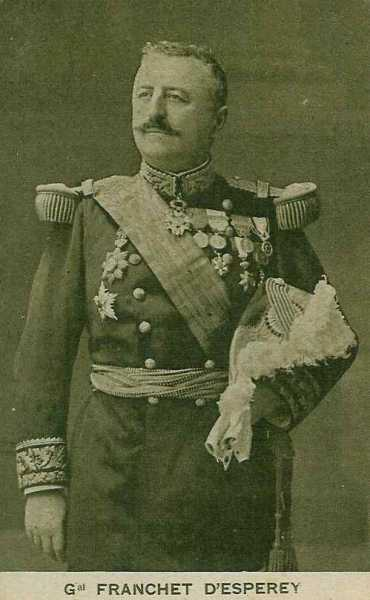
_Général Franchet d’Esperey (1e C.A.)_
_Collection privée_

**1e C.A. (Lille) : général Deligny**

1e division : général Gallet

| Unité                   | Commandant  | Régiments                                                                 |
| ----------------------- | ----------- | ------------------------------------------------------------------------- |
| 1e brigade              | de Fonclare | 43e R.I. (Lille)127e R.I. (Valenciennes)                                  |
| 2e brigade              | Sauret      | 1e R.I. (Cambrai)84e R.I. (Avesnes-sur-Helpe)                             |
| Elements divisionnaires |             | 6e régiment de chasseurs à cheval (un escadron - Lille)15e R.A.C. (Douai) |

2e division : général Duplessis

| Unité                   | Commandant | Régiments                                                                                             |
| ----------------------- | ---------- | ----------------------------------------------------------------------------------------------------- |
| 3e brigade              | Bernard    | 33e R.I. (Arras)73e R.I. (Béthune)                                                                    |
| 4e brigade              | Doyen      | 8e R.I. (Saint-Omer)110e R.I. (Dunkerque)                                                             |
| Eléments divisionnaires |            | 6e régiment de chasseurs à cheval (un escadron - Lille)27e R.A.C. (Saint-Omer, Aire-sur-Lys)          |
| Réserves                |            | 201e R.I. (Cambrai)284e R.I. (Avesnes-sur-Helpe)1e régiment d’artillerie à pied (Maubeuge, Dunkerque) |

**3e C.A. (Rouen) : général Hache**

5e division : général Mangin

| Unité                   | Commandant | Régiments                                                                 |
| ----------------------- | ---------- | ------------------------------------------------------------------------- |
| 9e brigade              | Tassin     | 39e R.I. (Rouen)74e R.I. (Rouen)                                          |
| 10e brigade             | Lautier    | 36e R.I. (Caen)129e R.I. (Le Havre)                                       |
| Elements divisionnaires |            | 7e régiment de chasseurs à cheval (un escadron - Evreux)43e R.A.C. (Caen) |

6e division : général Pétain

| Unité                   | Commandant | Régiments                                                                       |
| ----------------------- | ---------- | ------------------------------------------------------------------------------- |
| 11e brigade             | Hériot     | 24e R.I. (Bernay, Paris)28e R.I. (Evreux, Paris)                                |
| 12e brigade             | Lavisse    | 5e R.I. (Falaise, Paris)119e R.I. (Lisieux, Courbevoie)                         |
| Eléments divisionnaires |            | 7e régiment de chasseurs à cheval (un escadron - Evreux)22e R.A.C. (Versailles) |

37e division : général Comby

| Unité                   | Commandant  | Régiments                                                                                           |
| ----------------------- | ----------- | --------------------------------------------------------------------------------------------------- |
| 73e brigade             | Degot       | régiment de marche du 2e zouaves (Oran)régiment de marche du 3e zouaves (Batna)                     |
| 74e brigade             | Le Bouhélec | régiment de marche du 2e tirailleurs (Mostaganem)régiment de marche du 3e tirailleurs (Constantine) |
| Elements divisionnaires |             | 6e régiment de chasseurs d’Afrique (Mascara)2e groupe d’artillerie d’Afrique                        |
| Réserves                |             | 239e R.I. (Rouen)274e R.I. (Rouen)11e R.A.C. (Rouen)                                                |

**10e C.A. (Rennes) : général Defforges**

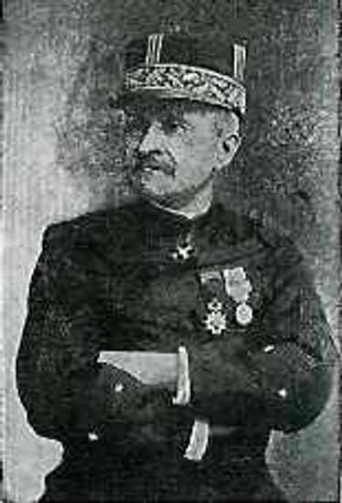
_Général Defforges_

19e division : général Bailly

| Unité                   | Commandant | Régiments                                                        |
| ----------------------- | ---------- | ---------------------------------------------------------------- |
| 37e brigade             | Pierson    | 48e R.I. (Guingamp)71e R.I.                                      |
| 38e brigade             | Passaga    | 41e R.I. (Rennes)70e R.I. (Vitré)                                |
| Elements divisionnaires |            | 13e régiment de hussards (un escadron - Dinan)7e R.A.C. (Rennes) |

20e division : général Rogerie

| Unité                   | Commandant  | Régiments                                                         |
| ----------------------- | ----------- | ----------------------------------------------------------------- |
| 39e brigade             | Ménissier   | 25e R.I. (Cherbourg)136e R.I. (Saint-Lô)                          |
| 40e brigade             | de Cadoudal | 2e R.I. (Granville)47e R.I. (Saint-Malo)                          |
| Eléments divisionnaires |             | 13e régiment de hussards (un escadron - Dinan)10e R.A.C. (Rennes) |

51e division de réserve : général Boutegourd

| Unité                   | Commandant | Régiments                                                                                                                                            |
| ----------------------- | ---------- | ---------------------------------------------------------------------------------------------------------------------------------------------------- |
| 101e brigade            | Petit      | 233e R.I. (Arras)243e R.I. (Lille)327e R.I. (Valenciennes)                                                                                           |
| 102e brigade            | Leleu      | 208e R.I.273e R.I. (Béthune)310e R.I. (Dunkerque)                                                                                                    |
| Eléments divisionnaires |            | 4e régiment de cuirassiers (deux escadrons - Cambrai)15e R.A.C. (un groupe - Douai)27e R.A.C. (un groupe - Saint-Omer)41e R.A.C. (un groupe - Douai) |
| Réserves                |            | 241e R.I. (Rennes)270e R.I. (Vitré)13e régiment de hussards (Dinan)50e R.A.C. (Rennes)                                                               |

**18e C.A. (Bordeaux) : général de Maud’huy**

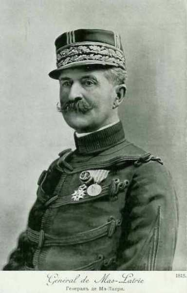
_Général de Mas Latrie (18e C.A.)_
_Collection privée_

35e division : général Marjoulet

| Unité                   | Commandant | Régiments                                                               |
| ----------------------- | ---------- | ----------------------------------------------------------------------- |
| 69e brigade             | Durand     | 6e R.I. (Saintes)123e R.I. (La Rochelle)                                |
| 70e brigade             | Pierron    | 57e R.I. (Rochefort, Libourne)144e R.I. (Bordeaux)                      |
| Elements divisionnaires |            | 10e régiment de hussards (un escadron - Tarbes)24e R.A.C. (La Rochelle) |

36e division : général Jouannic

| Unité                   | Commandant        | Régiments                                                          |
| ----------------------- | ----------------- | ------------------------------------------------------------------ |
| 71e brigade             | Dion              | 34e R.I. (Mont-de-Marsan)49e R.I. (Bayonne)                        |
| 72e brigade             | Trinité-Schilmans | 12e R.I. (Tarbes)18e R.I. (Pau)                                    |
| Eléments divisionnaires |                   | 10e régiment de hussards (un escadron - Tarbes)14e R.A.C. (Tarbes) |

38e division : général Schwartz

| Unité                   | Commandant | Régiments                                                                                                                 |
| ----------------------- | ---------- | ------------------------------------------------------------------------------------------------------------------------- |
| 75e brigade             | Vuillemin  | régiment de marche du 1e zouaves (Alger)régiment de marche du 1e tirailleurs (Blida)                                      |
| 76e brigade             | Bertin     | régiment de marche du 4e zouaves (Tunis)régiment de marche du 4e tirailleurs (Sousse)8e régiment de tirailleurs (Bizerte) |
| Eléments divisionnaires |            | 5e régiment de chasseurs d’Afrique (Alger)32e R.A.C. (trois groupes)                                                      |
| Réserves                |            | 218e R.I. (Pau)249e R.I. (Bayonne)10e régiment de hussards (Tarbes)58e R.A.C. (Bordeaux)                                  |

**4e groupement de divisions de réserve : général Valabrègue**

53e division de réserve : général Journée

| Unité                   | Commandant | Régiments                                                                                                                                                                                      |
| ----------------------- | ---------- | ---------------------------------------------------------------------------------------------------------------------------------------------------------------------------------------------- |
| 105e brigade de réserve | Montangon  | 205e R.I. (Falaise, Paris)236e R.I. (Caen)319e R.I. (Lisieux, Courbevoie)                                                                                                                      |
| 106e brigade            | Masson     | 224e R.I. (Laval)226e R.I. (Toul, Nancy)329e R.I. (Le Havre)27e régiment de dragons (Versailles)11e R.A.C. (un groupe - Rouen)22e R.A.C. (un groupe - Versailles)43e R.A.C. (un groupe - Caen) |

69e division de réserve : général Néraud

| Unité        | Commandant | Régiments                                                                                                                                                                                                                                                                                                                    |
| ------------ | ---------- | ---------------------------------------------------------------------------------------------------------------------------------------------------------------------------------------------------------------------------------------------------------------------------------------------------------------------------- |
| 138e brigade | Piguet     | 251e R.I. (Beauvais)254e R.I. (Compiègne)267e R.I. (Soissons)48e bataillon de chasseurs à pied5e régiment de dragons (deux escadrons - Compiègne)28e R.A.C. (un groupe - Vannes)35e R.A.C. (un groupe - Vannes))44e R.A.C. (un groupe - Le Mans)46e R.A.C. (un groupe - Camp de Châlons)50e R.A.C. (neuf batteries - Rennes) |

**C.C. Conneau**

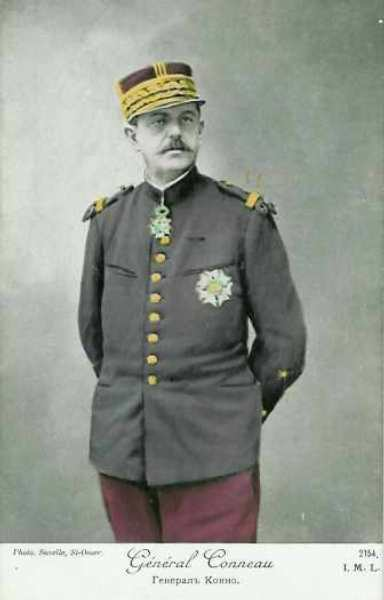
_Général Conneau (2e C.C.)_
_Collection privée_

4e D.C. : général Abonneau

| Unité                     | Commandant | Régiments                                                                           |
| ------------------------- | ---------- | ----------------------------------------------------------------------------------- |
| 4e brigade légère         | Requichot  | 2e régiment de hussards (Verdun)4e régiments de hussards (Verdun)                   |
| 4e brigade de dragons     | Dodelier   | 28e régiment de dragons (Sedan)30e régiments de dragons (Sedan)                     |
| 3e brigade de cuirassiers | Monpoly    | 3e régiment de cuirassiers (Vouziers)6e régiments de cuirassiers (Sainte-Menehould) |
|                           |            | 19e bataillon cycliste (un groupe)                                                  |
|                           |            | 40e R.A.C. (Saint-Mihiel, Mézières)                                                 |

8e D.C. : général Baratier

| Unité                                     | Commandant | Régiments                                                        |
| ----------------------------------------- | ---------- | ---------------------------------------------------------------- |
| 8e brigade légère                         | Peillard   | 12e régiment de hussards (Gray)                                  |
| 14e régiment de chasseurs à cheval (Dôle) |
| 8e brigade de dragons                     | Gendron    | 11e régiment de dragons (Belfort)18e régiments de dragons (Lure) |
|                                           |            | 15e bataillon cycliste (un groupe)                               |
|                                           |            | 4e R.A.C. (un groupe - Remiremont)                               |

10e D.C. : général Grellet

| Unité                  | Commandant  | Régiments                                                                                                                            |
| ---------------------- | ----------- | ------------------------------------------------------------------------------------------------------------------------------------ |
| 2e brigade légère      | de Contades | 17e régiment de chasseurs à cheval (Lunéville - Vitry-le-François)18e régiment de chasseurs à cheval (Lunéville - vitry-le-François) |
| 10e brigade de dragons | Chêne       | 15e régiment de dragons (Libourne)20e régiment de dragons (Limoges)                                                                  |
| 15e brigade de dragons | Sauzey      | 10e régiment de dragons (Montauban)19e régiments de dragons (Castres)                                                                |
|                        |             | 1e bataillon cycliste                                                                                                                |
|                        |             | 14e R.A.C. (Tarbes)                                                                                                                  |
|                        |             | une escadrille d’avions                                                                                                              |

**Ordre de bataille de l’armée anglaise, sous le commandement du maréchal French**

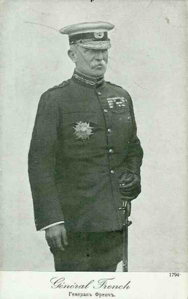
_Maréchal French (armée anglaise)_
_Collection privée_

**1e C.A. général Haig**

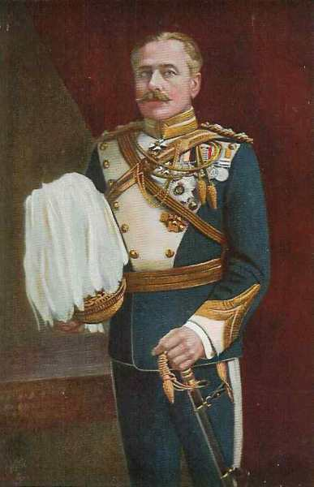
_Général Haig (1e C.A.)_
_Collection privée_

1e division : général Lomax

| Unité                    | Commandant | Régiments                                                                                                                             |
| ------------------------ | ---------- | ------------------------------------------------------------------------------------------------------------------------------------- |
| 1st (Guards) Brigade     | Maxse      | 1st Coldstream Guards1st Scots Guards1st The Black Watch (Royal Highlanders)2nd The Royal Munster Fusiliers                           |
| 2nd Infantry Brigade     | Bulfin     | 2nd The Royal Sussex Regiment1st The Loyal North Lancashire Regiment1st The Northamptonshire Regiment2nd The King’s Royal Rifle Corps |
| 3rd Infantry Brigade     | Landon     | 1st The Queen’s (Royal West Surrey Regiment)1st The South Wales Borderers1st The Gloucestershire Regiment2nd The Welch Regiment       |
| Cavalerie divisionnaire  |            | A Squadron, 15th (The King’s) Hussars1st Cyclist Company                                                                              |
| 25e brigade d’artillerie |            | 113th, 114th, 115th Battery, RFA                                                                                                      |
| 26e brigade d’artillerie |            | 116th, 117th, 118th Battery, RFA                                                                                                      |
| 39e brigade d’artillerie |            | 46th, 51th, 54th Battery, RFA                                                                                                         |
| 43e brigade d’artillerie |            | 30th, 40th, 57th (Howitzer) Battery, RFA26th Heavy Battery, RGA                                                                       |

2e division : général Monro

| Unité                    | Commandant | Régiments                                                                                                                                                           |
| ------------------------ | ---------- | ------------------------------------------------------------------------------------------------------------------------------------------------------------------- |
| 4th (Guards) Brigade     | Scott-Kerr | 2nd Grenadier Guards2nd Coldstream Guards3rd Coldstream Guards1st Irish Guards                                                                                      |
| 5th Infantry Brigade     | Haking     | 2nd The Worcestershire Regiment2nd The Oxfordshire and Buckinghamshire Light Infantry2nd The Highland Light Infantry2nd The Connaught Rangers                       |
| 6th Infantry Brigade     | Davies     | 1st The King’s (Liverpool Regiment)2nd The South Staffordshire Regiment1st Princess Charlotte of Wales’s (Royal Berkshire Regiment)1st The King’s Royal Rifle Corps |
| Cavalerie divisionnaire  |            | B Squadron, 15th (The King’s) Hussars2nd Cyclist Company                                                                                                            |
| 34e brigade d’artillerie |            | 22nd, 50th, 70th Battery, RFA                                                                                                                                       |
| 36e brigade d’artilerie  |            | 15th, 48th, 71st Battery, RFA                                                                                                                                       |
| 41e brigade d’artillerie |            | 9th, 16th, 17th Battery, RFA                                                                                                                                        |
| 44e brigade d’artillerie |            | 47th, 56th, 60th (Howitzer) Battery, RFA35th Heavy Battery, RGA                                                                                                     |

**2e C.A. : général Smith-Dorrien**

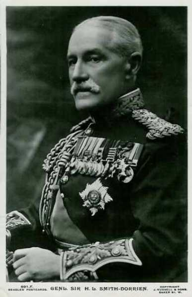
_Général Smith Dorrien (2e C.A)._
_Collection privée_

3e division : général Hamilton

| Unité                    | Commandant | Régiments                                                                                                                                                                 |
| ------------------------ | ---------- | ------------------------------------------------------------------------------------------------------------------------------------------------------------------------- |
| 7th Infantry Brigade     | McCracken  | 3rd The Worcestershire Regiment2nd The Prince of Wales’s Volunteers (South Lancashire Regiment)1st The Duke of Edinburgh’s (Wiltshire Regiment)2nd The Royal Irish Rifles |
| 8th Infantry Brigade     | Doran      | 2nd The Royal Scots (Lothian Regiment)2nd The Royal Irish Regiment4th The Duke of Cambridge’s Own (Middlesex Regiment)1st The Gordon Highlanders[4]                       |
| 9th Infantry Brigade     | Shaw       | 1st The Northumberland Fusiliers4th The Royal Fusiliers (City of London Regiment)1st The Lincolnshire Regiment1st The Royal Scots Fusiliers                               |
| Cavalerie divisionnaire  |            | C Squadron, 15th (The King’s) Hussars                                                                                                                                     |
| 3rd Cyclist Company      |
| 23e brigade d’artillerie |            | 107th, 108th, 109th Battery, RFA                                                                                                                                          |
| 40e brigade d’artillerie |            | 6th, 23rd, 45th Battery, RFA                                                                                                                                              |
| 42e brigade d’artillerie |            | 29th, 41st, 45th Battery, RFA                                                                                                                                             |
| 30e brigade d’artillerie |            | 128th, 129th, 130th (Howitzer) Battery, RFA48th Heavy Battery, RGA                                                                                                        |

5e division : général Fergusson

| Unité                    | Commandant     | Régiments                                                                                                                                                                           |
| ------------------------ | -------------- | ----------------------------------------------------------------------------------------------------------------------------------------------------------------------------------- |
| 13th Infantry Brigade    | Cuthbert       | 2nd The King’s Own Scottish Borderers2nd The Duke of Wellington’s (West Riding Regiment)1st The Queen’s Own (Royal West Kent Regiment)2nd The King’s Own (Yorkshire Light Infantry) |
| 14th Infantry Brigade    | Rolt           | 2nd The Suffolk Regiment1st The East Surrey Regiment1st The Duke of Cornwall’s Light Infantry2nd The Manchester Regiment                                                            |
| 15th Infantry Brigade    | Count Gleichen | 1st The Norfolk Regiment1st The Bedfordshire Regiment1st The Cheshire Regiment1st The Dorsetshire Regiment                                                                          |
| Cavalerie divisionnaire  |                | A Squadron, 19th (Queen Alexandra’s Own Royal) Hussars5th Cyclist Company                                                                                                           |
| 15e brigade d’artillerie |                | 11th, 52nd, 80th Battery, RFA                                                                                                                                                       |
| 27e brigade d’artillerie |                | 119th, 120nd, 121st Battery, RFA                                                                                                                                                    |
| 28e brigade d’artillerie |                | 122nd, 123rd, 124th Battery, RFA                                                                                                                                                    |
| 8e brigade d’artillerie  |                | 37th, 61st, 65th (Howitzer) Battery, RFA108th Heavy Battery, RGA                                                                                                                    |

**3e C.A. : général Pulteney**

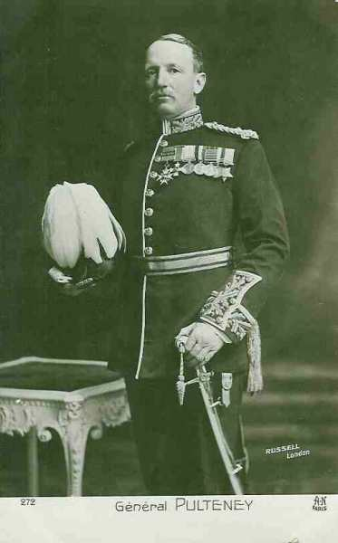
_Général Pulteney (3e C.A.)_
_Collection privée_

4th Division : général Snow

| Unité                    | Commandant    | Régiments                                                                                                                                                                        |
| ------------------------ | ------------- | -------------------------------------------------------------------------------------------------------------------------------------------------------------------------------- |
| 10th Infantry Brigade    | Haldane       | 1st The Royal Warwickshire Regiment2nd Seaforth Highlanders (Ross-shire Buffs, The Duke of Albany’s1st Princess Victoria’s (Royal Irish Fusiliers)2nd The Royal Dublin Fusiliers |
| 11th Infantry Brigade    | Hunter-Weston | 1st Prince Albert’s (Somerset Light Infantry)1st The East Lancashire Regiment1st The Hampshire Regiment1st The Rifle Brigade (Prince Consort’s Own)                              |
| 12th Infantry Brigade    | Wilson        | 1st King’s Own (Royal Lancaster Regiment)2nd The Lancashire Fusiliers2nd The Royal Inniskilling Fusiliers2nd The Essex Regiment                                                  |
| Cavalerie divisionnaire  |               | B Squadron, 19th (Queen Alexandra’s Own Royal) Hussars4th Cyclist Company                                                                                                        |
| 14e brigade d’artillerie |               | 39th, 68th, 88th Battery, RFA                                                                                                                                                    |
| 29e brigade d’artillerie |               | 125th, 126th, 127th Battery, RFA                                                                                                                                                 |
| 32e brigade d’artillerie |               | 27th Battery, 134st, 135th RFA                                                                                                                                                   |
| 37e brigade d’artillerie |               | 31st, 35th, 55th (Howitzer) Battery, RFA31st Heavy Battery, RGA                                                                                                                  |

6e division : général Keir

| Unité                    | Commandant          | Régiments                                                                                                                                                                                                              |
| ------------------------ | ------------------- | ---------------------------------------------------------------------------------------------------------------------------------------------------------------------------------------------------------------------- |
| 16th Infantry Brigade    | Ingouville-Williams | 1st The Buffs (East Kent Regiment)1st The Leicestershire Regiment1st The King’s (Shropshire Light Infantry)2nd The York and Lancaster Regiment                                                                         |
| 17th Infantry Brigade    | Doran               | 1st The Royal Fusiliers (City of London Regiment)1st The Prince of Wales’s (North Staffordshire Regiment)2nd The Prince of Wales’s Leinster Regiment (Royal Canadians)3rd The Rifle Brigade (The Prince Consort’s Own) |
| 18th Infantry Brigade    | Congreve            | 1st The Prince of Wales’s Own (West Yorkshire Regiment)1st The East Yorkshire Regiment2nd The Sherwood Foresters (Nottinghamshire and Derbyshire Regiment)2nd The Durham Light Infantry                                |
| Cavalerie divisionnaire  |                     | C Squadron, 19th (Queen Alexandra’s Own Royal) Hussars6th Cyclist Company                                                                                                                                              |
| 14e brigade d’artillerie |                     | 21st, 42nd, 53rd Battery, RFA                                                                                                                                                                                          |
| 24e brigade d’artillerie |                     | 110th, 111th, 112th Battery, RFA                                                                                                                                                                                       |
| 38e brigade d’artillerie |                     | 24th, 34th, 72nd Battery, RFA                                                                                                                                                                                          |
| 12e brigade d’artillerie |                     | 43rd, 86th, 87th (Howitzer) Battery, RFA24th Heavy Battery, RGA                                                                                                                                                        |

**Division de cavalerie : général Allenby**

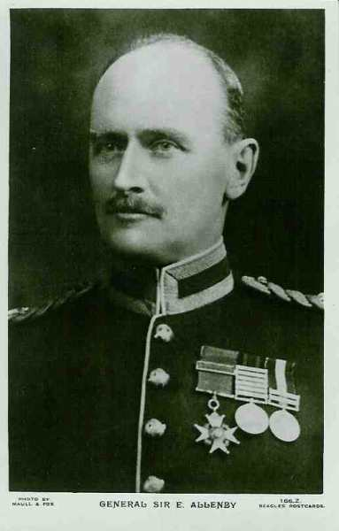
_Général Allenby (C.C.)_
_Collection privée_

| Unité                   | Commandant | Régiments                                                                                                             |
| ----------------------- | ---------- | --------------------------------------------------------------------------------------------------------------------- |
| 1st Cavalry Brigade     | Briggs     | 2nd Dragoon Guards (Queen’s Bays)5th (Princess Charlotte of Wales’s) Dragoon Guards11th (Prince Albert’s Own) Hussars |
| 2nd Cavalry Brigade     | de Lisle   | 4th (Royal Irish) Dragoon Guards9th (Queen’s Royal) Lancers18th (Queen Mary’s Own) Hussars                            |
| 3rd Cavalry Brigade     | Gough      | 4th (Queen’s Own) Hussars5th (Royal Irish) Lancers16th (The Queen’s) Lancers                                          |
| 4th Cavalry Brigade     | Bingham    | Household Cavalry Composite Regiment6th Dragoon Guards (Carabiners)3rd (King’s Own) Hussars                           |
| 3e brigade d’artillerie |            | D Battery, RHAE Battery, RHA                                                                                          |
| 7e brigade d’artillerie |            | I Battery, RHAL Battery, RHA1st Field Squadron, RE                                                                    |

**5e brigade de cavalerie**

| Unité               | Commandant | Régiments                                                                                        |
| ------------------- | ---------- | ------------------------------------------------------------------------------------------------ |
| 5th Cavalry Brigade | Chetwode   | 2nd Dragoons (Royal Scots Greys)12th (Prince of Wales’s Royal) Lancers20th HussarsJ Battery, RHA |

**Ordre de bataille de la IIe armée allemande**, commandée par le generaloberst von Bülow.
Chef d’Etat-Major : Generalleutnant von Lauenstein.

Moltke a prélevé sur la IIe armée le C.A.R. de la Garde (von Gallwitz) et le 7e C.A.R. assiège Maubeuge.

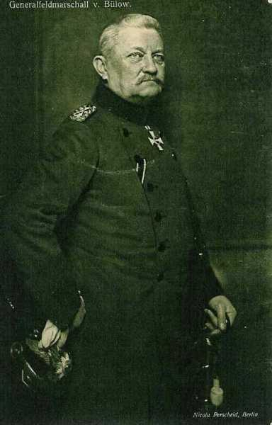
_Général von Bülow (IIe armée)_
_Collection privée_

**7e C.A. (Münster) : General der Infanterie von Einem**

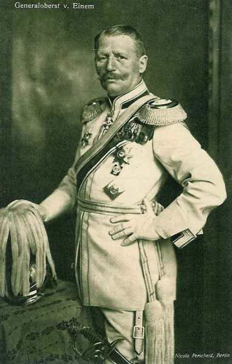
_Général von Einem (7e C.A.)_
_Collection privée_

13e division d’infanterie : général von dem Borne

| Unité                      | Commandant | Régiments                                                                                                              |
| -------------------------- | ---------- | ---------------------------------------------------------------------------------------------------------------------- |
| 25. Infanterie-Brigade     |            | Infanterie-Regiment Nr. 13 (Münster)7. Lothringisches Infanterie-Regiment Nr. 158 (Paderborn)                          |
| 26. Infanterie-Brigade     |            | Infanterie-Regiment Nr. 15 (Minden)Infanterie-Regiment Nr. 55 (Detmold)Westfälisches Jäger-Bataillon Nr. 7 (Bückeburg) |
| Cavalerie divisionnaire    |            | Stab u. 3.Eskadron/Ulanen-Regiment Nr. 16 (Salzwedel)                                                                  |
| 13. Feldartillerie-Brigade |            | 2. Westfälisches Feldartillerie-Regiment Nr. 22 (Münster)Mindensches Feldartillerie-Regiment Nr. 58 (Minden            |

14e division d’infanterie : général Fleck

| Unité                      | Commandant | Régiments                                                                                                           |
| -------------------------- | ---------- | ------------------------------------------------------------------------------------------------------------------- |
| 27. Infanterie-Brigade     |            | Infanterie-Regiment Nr. 16 (Cologne)5. Westfälisches Infanterie-Regiment Nr. 53 (Cologne)                           |
| 79. Infanterie-Brigade     |            | Infanterie-Regiment Nr. 56 (Wesel)Infanterie-Regiment Nr. 57 (Wesel)                                                |
| Cavalerie divisionnaire    |            | 3.Eskadron/Ulanen-Regiment Nr. 16 (Salzwedel)                                                                       |
| 14. Feldartillerie-Brigade |            | 1. Westfälisches Feldartillerie-Regiment Nr. 7 (Wesel, Dusseldorf)Klevesches Feldartillerie-Regiment Nr. 43 (Wesel) |

**10e C.A. (Hannover) : General der Infanterie von Emmich**

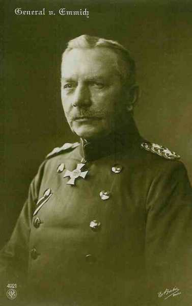
_Général von Emmich (10e C.A.)_
_Collection privée_

19e division d’infanterie : général Hofmann

| Unité                      | Commandant | Régiments                                                                                                         |
| -------------------------- | ---------- | ----------------------------------------------------------------------------------------------------------------- |
| 37. Infanterie-Brigade     |            | Infanterie-Regiment Nr. 78 (Osnabrück)Oldenburgisches Infanterie-Regiment Nr. 91 (Oldenburg)                      |
| 38. Infanterie-Brigade     |            | Füsilier Regiment Nr. 73 (Hannover)1. Hannoversches Infanterie-Regiment Nr. 74 (Hannover)                         |
| Cavalerie divisionnaire    |            | 3. Eskadron/Braunschweigisches Husaren-Regiment Nr. 17 (Braunschweig)                                             |
| 19. Feldartillerie-Brigade |            | 2. Hannoversches Feldartillerie-Regiment Nr. 26 (Verden)Ostfriesisches Feldartillerie-Regiment Nr. 62 (Oldenburg) |

20. division d’infanterie : général Schmundt

| Unité                      | Commandant | Régiments                                                                                                                                 |
| -------------------------- | ---------- | ----------------------------------------------------------------------------------------------------------------------------------------- |
| 39. Infanterie-Brigade     |            | Infanterie-Regiment Nr. 79 (Hildesheim)4. Hannoversches Infanterie-Regiment Nr. 164 (Hameln)Hannoversches Jäger-Bataillon Nr. 10 (Goslar) |
| 40. Infanterie-Brigade     |            | 2. Hannoversches Infanterie-Regiment Nr. 77 (Celle)Braunschweigisches Infanterie-Regiment Nr. 92 (Braunschweig)                           |
| Cavalerie divisionnaire    |            | Stab und "1/2"-Regiment/Braunschweigisches Husaren-Regiment Nr. 17 (Braunschweig)                                                         |
| 20. Feldartillerie-Brigade |            | Feldartillerie-Regiment Nr. 10 (Hannover)Niedersächsisches Feldartillerie-Regiment Nr. 46 (Wolfenbüttel)                                  |

**C.A. de la Garde (Berlin) : General der Infanterie von Plettenberg**

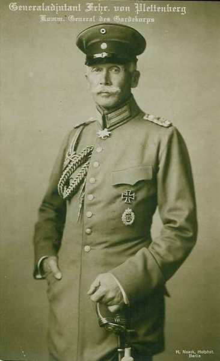
_Général von Plettenberg (Garde)_
_Collection privée_

1e division d’infanterie : général von Hutier

| 1e et 2e brigades |     | 1e brigade infanterie de la GardeRégiment de Hussards de la Garde1e brigade d’artillerie de la Garde |
| ----------------- | --- | ---------------------------------------------------------------------------------------------------- |

2e division d’infanterie : général von Winckler

| 3e et 4e brigades |     | Régiment de cavalerie légère2e brigade d’artillerie de la Garde |
| ----------------- | --- | --------------------------------------------------------------- |

**10e C.A.R. : (Hannover) General der Infanterie von Kirchbach**

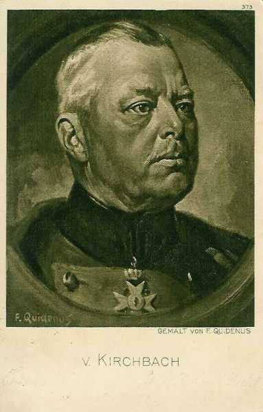
_Général von Kirchbach (10e C.A.R.)_
_Collection privée_

2e div. infanterie de rés. de la Garde : général von Süsskind

| Unité                                            | Commandant    | Régiments                                                                                                                                    |
| ------------------------------------------------ | ------------- | -------------------------------------------------------------------------------------------------------------------------------------------- |
| 26. Reserve-Infanterie-Brigade                   |               | Westfälisches Reserve-Infanterie-Regiment Nr. 15Westfälisches Reserve-Infanterie-Regiment Nr. 55                                             |
| 38. Reserve-Infanterie-Brigade                   |               | Hannoversches Reserve-Infanterie-Regiment Nr. 77Hannoversches Reserve-Infanterie-Regiment Nr. 91Hannoversches Reserve-Jäger-Bataillon Nr. 10 |
| Cavalerie divisionnaire                          |               | Reserve-Ulanen-Regiment Nr. 2                                                                                                                |
| Artillerie                                       |               | Reserve-Feldartillerie-Regiment Nr. 20                                                                                                       |
| 19e division d’infanterie de réserve de la Garde | von Bahrfeldt |                                                                                                                                              |

### 2 septembre

En soirée, le gros de la Ve armée est entre la Vesle et la Marne, reliée à l’est au détachement d’armée Foch par la brigade mixte Rogerie, et à l’ouest à l’armée anglaise par la 4e D.C.

Les 8e et 10e D.C. sont occupées à se grouper entre Condé et Montmirail. Les têtes de colonnes de la Garde et du 10e C.A. (IIe armée allemande) ont franchi la Vesle à Jonchery et à Fismes et talonnent la Ve armée. Le 1e C.C. allemand est arrivé sur l’Ourcq et l’aile droite de von Kluck tient Oulchy-le-Château par sa 17e division et Château-Thierry par sa 18e.

A 11h du soir, Lanrezac remanie son dispositif : le 18e C.A. occupera l’aile ouest de la Ve armée à la place du groupe de divisions de réserve, qui s’intercalera entre les 18e et 3e C.A.

**Du côté allemand :**

La Garde est chargée d’obtenir la reddition de Reims et en cas de besoin de l’y contraindre par un bombardement. Le Q.G. de l’armée est porté à Fismes.

### 3 septembre

En matinée, les Allemands débouchent de Château-Thierry, de Chézy et de Nogent-l’Artaud.

- Les différentes unités de la Ve armée retraitent derrière la Marne.
    Le 18e C.A. franchit la Marne de bon matin, la 35e division à Dormans, la 36e à Tréloup, la 38e à Jauglonne.

- La 38e se dirige vers Condé, la 36e vers Courboin et la 35e vers Pargny.

- Le 3e C.A. franchit également la rivière : la 5e division (Mangin) à Binson, la 37e (Comby) et la 6e (Pétain) à Venteuil.

- Le 1e C.A. franchit à son tour la Marne : la 1e division (Gallet) à Reuil sur un pont d’équipage, la 2e division (Deligny) à Damery.

- Le 10e C.A. cantonne dans la région d’Epernay.

Un vide de 25 km existe entre le 18e C.A., installé derrière la Dhuys et le C.C., retiré vers Rebais et relié à l’armée anglaise. Le 9e C.A. de von Kluck s’avance dans ce vide.
A 17h, Lanrezac est limogé et remplacé par Franchet d’Esperey.

Franchet d’Esperey rencontre Wilson à Bray et ils conviennent d’attaquer le 6 après avoir lu le télégramme du G.Q.G. prescrivant la reprise de l’offensive. Le 5 septembre, l’armée britannique continuera son repli jusqu’à la ligne Provins - Sézanne. Elle effectuera ensuite un changement de front face à l’est, sur la ligne Changis - Coulommiers si son flanc gauche est soutenu par la VIe armée, qui devra avancer le 5 septembre jusqu’à la ligne de l’Ourcq.

Franchet d’Esperey envoie un message au G.Q.G. :
« Circonstances sont telles que pourrait être avantageux de livrer bataille demain avec toutes les forces de la Ve armée, de concert avec l’ armée britannique et les forces mobiles de Paris contre les Ie et IIe armées allemandes ».

- Voici la position des armées alliées au soir :
    VIe armée : au nord-est de Meaux, prête à franchir l’Ourcq vers Château-Thierry.
    Armée anglaise : sur le front Changis - Coulommiers, prête à faire mouvement vers Montmirail.
    Ve armée : sur le front Courtacon - Sézanne, prête à attaquer vers Montmirail.

**Du côté allemand :**

la poursuite des armées alliées est vigoureusement continuée jusqu’à la Marne en direction de Château-Thierry - Binson.

Le Q.G. de laIIe armée est porté à Fère-en-Tardenois.
Les C.A. d’aile gauche de la Ie armée marchent vers le sud-est, de telle sorte que le 9e C.A. (Ie armée) glisse devant le front du C.A. de droite (7e) de la IIe armée, ce qui l’oblige à obliquer vers le sud-est.

- Les objectifs à atteindre par les différents C.A. sont :
    7e C.A. : Pargny-la-Dhuis et Verdon.
    10e C.A.R : Le Breuil.
    10e C.A. : Mareuil-en-Brie et Ablois-Saint-Martin.
    Garde : sud de la Marne par Epernay.

### 4 septembre

Les Allemands ont franchi la Marne à Nogent-l’Artaud, Chézy et Château-Thierry. Il faut soustraire l’aile gauche de la Ve armée à leur emprise. C’est la mission du C.C. Conneau, qui a quitté la région de Rebais avant le jour pour partir à la rencontre des Allemands sur les routes de Nogent-l’Artaud et de Château-Thierry.

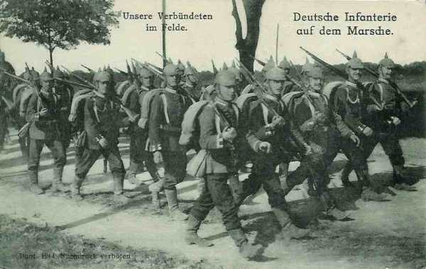
_Infanterie allemande en marche_
_Collection privée_

Le général Conneau a donné l’ordre de défendre le Petit Morin, de Verdelot à Montmirail. Le soir, le C.C. doit toutefois revenir sur ses pas pour aller abreuver les chevaux sur le Grand Morin, à La Ferté-Gaucher.

- Le 18e C.A., dont la 38e division a été surprise à Pargny, gagne ses cantonnements entre Montolivet, Tréfols et Le Vézier.

- Le 3e C.A. se retire par échelon de division. A 16h, la division Pétain repousse les Allemands qui ont débouché d’Orbais. A 16h, les troupes bivouaquent dans la région de Vauchamps, Fromentières, Janvillers.

- Le 1e C.A. stationne dès 17h dans la région de Bannay - Baye.

- Le 10e C.A. est dès 17h dans la région d’Etoges - Congy. Ce C.A. n’a pas été en contact avec l’armée allemande.

- Voici les ordres de Franchet d’Esperey pour le lendemain.
    Le C.C. doit se porter dans la région de Provins.
    Le 18e C.A. dans la région de Voulton.
    Le groupe Valabrègue dans la région de Beauchery.
    Le 3e C.A. dans la région de Nesles-la-Reposte.
    Le 10e C.A. au sud de Sézanne.

A 22h le général Maud’huy, venu de Lorraine, arrive au Q.G. de Romilly. Il remplacera le général de Mas-Latrie à la tête du 18e C.A.

Comme l’armée anglaise continue à retraiter, le flanc gauche de la Ve armée risque d’être à découvert.

**Du côté allemand :**

le Q.G. de la IIe armée s’établit à Dormans où il demeurera jusqu’au 5 septembre.
von Bülow apprend que Reims est occupé par la Garde.
8h30 : de nouvelles instructions de l’O.H.L. parviennent.
La IIe armée doit se disposer face à Paris entre la Marne et la Seine. L’armée commence une conversion.

### 5 septembre : mesures préparatoires à l’offensive

L’artillerie lourde est rapprochée du front dans les zones des 3e et 18e C.A.

**[Lien vers croquis](../img/bataille_morains1.jpg)**

**9h15 :**

Franchet d’Esperey reçoit un coup de téléphone du major Huguet, chef de la mission française auprès de l’armée anglaise :

« Le maréchal (French) va se conformer aux instructions exprimées dans l’ordre général n° 6 (ordre de Joffre prescrivant l’offensive) du G.Q.G., mais en raison d’un mouvement de retraite effectué de nuit, il ne sera pas possible d’occuper exactement la position Changis - Coulommiers, mais un peu plus en arrière ».

**12h30 :**

Le 18e C.A. a dépassé Rupéreux. Il lui a fallu seize heures pour franchir une distance de 25 km. Les bataillons ne comptent en moyenne pas plus de 200 hommes. Le C.C. se replie vers Provins.
Le groupe Valabrègue a marché pendant quatre jours et quatre nuits sans repos.
Pétain et Mangin informent leurs bataillons de la fin de la retraite et ceux-ci les acclament.

**18h :**

Les avant-gardes du 3e C.A. se sont installées et solidement retranchées. Du 23 août au 5 septembre, les hommes ont parcouru 350 km, soit 25 km par jour, tout en se battant à Guise.

Au 10e C.A., on établit des tranchées entre Sézanne, Mœurs et Barbonne.

L’armée anglaise a continué à battre en retraite pendant toute la journée et elle se trouve derrière la forêt de Crécy, sur le front Tournan - Les-Ormeaux face au nord au lieu de se trouver sur le front Changis - Coulommiers face à l’est comme il avait été convenu avec le général Wilson.

Von Kluck est arrivé sur le grand Morin qu’il franchit entre Chauffry et Esternay. Von Bülow a franchi la Marne dans la matinée et se trouve sur la ligne Champaubert - Etoges - Vertus.

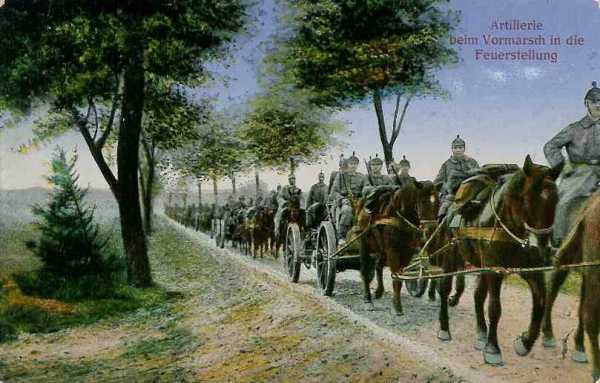
_Colonne d’artillerie allemande_
_Collection privée_

**18h30 :**

L’ordre d’attaque est expédié aux C.A. par Franchet d’Esperey.

« Demain, 6 septembre, la Ve armée attaquera la Ie armée allemande, tandis que l’armée anglaise et la VIe armée l’attaqueront de flanc et menaceront sa retraite. La liaison avec l’armée anglaise est assurée par le C.C. qui couvre en même temps la gauche de l’armée. La liaison avec l’armée de Foch (IXe) est assurée par le 10e C.A. qui opérera en collaboration étroite avec elle dans la région de Sézanne. Attaque droit au nord par les 1e, 3e et 18e C.A., qui seront échelonnés la droite en avant ».

**Du côté allemand**

- von Kluck, alerté par la flanc-garde laissée devant Paris (4e C.A.R.), arrête la poursuite et donne ordre aux quatre C.A., parvenus au sud du Grand Morin, de se replier immédiatement entre Marne et Oise.
    Le 2e C.A. doit se porter vers Crouy pour appuyer le 4e C.A.R., attaqué depuis 5h du matin par l’armée Maunoury.
    Le 4e C.A. doit se grouper à La Ferté-sous-Jouarre.
    Le 3e C.A. doit se rassembler à La Ferté-Gaucher.
    Le 9e C.A. reste momentanément sur place.

### 6 septembre : début de l’offensive

L’aviation apporte d’intéressants renseignements : les observateurs ont aperçu de vastes mouvements de retraite dans la région de Montceaux-les-Provins et Montmirail.

Franchet d’Esperey donne ordre d’attaquer la ligne Montceaux - Courgivaux - Esternay.

- 18e C.A. attaque vers Montceaux-les-Provins.
    3e C.A. vers Courgivaux.
    1e C.A. vers Esternay.
    Le 10e C.A. prête son appui pour l’attaque d’Esternay en se reliant à la IXe armée.
    Le C.C. coopérera à l’attaque du 18e C.A. et se reliera à la cavalerie britannique.

**6h :**

Les 3e et 9e C.A. allemands n’ont pas dépassé Sancy, Montceaux-les-Provins et Esternay. Les 7e et 10e C.A. de l’armée von Bülow n’ont pas dépassé le Petit Morin.

L’attaque est fixée pour 6h du matin. Le C.C. quitte la région de Provins avant le jour.

- Le 18e C.A. va attaquer vers le nord-nord-est par Sancy, Meilleray et Montolivet.

- Le 3e C.A. est en situation de déboucher de la ligne Brasseaux - Saint-Genest-les Essarts.

- Le 1e C.A. va attaquer vers Bricot-la-Ville, les Essarts-le-Vicomte - Esternay - Montmirail.

- Le 10e C.A. fait mouvement en direction du nord-nord-ouest sur l’axe Mœurs - Soigny - Vauchamps, en se reliant à droite à la 42e division de l’armée Foch.

- Le groupe de divisions de réserve (Valabrègue) forme la deuxième ligne.

Au total, le front de la Ve armée s’étend sur 50 km.

**8h30 :**

Le 18e C.A. réalise une avance de 5 km.

**9h30 :**

Des reconnaissances signalent que des forces considérables ont passé la nuit dans la région de Saint-Martin-du-Boschet - Montceaux-les-Provins. Une tranchée court tout au long de la route Cerneux - Sancy - Montceaux.

Le général Hache (3e C.A.) signale que les Allemands tiennent fortement la ligne Montceaux-les-Provins - Les Châtaigniers - Courgivaux - nord d’Escardes.

La 6e division (Pétain) va attaquer la position Montceaux-les-Provins - Courgivaux. L’artillerie du C.A. est en position près du château de Flaix, prête à appuyer la progression et tire déjà sur Montceaux-les-Provins.

**13h30 :**

Un ordre de la Ve armée prescrit d’attaquer la position Cerneux - Montceaux - Esternay.

Le C.C. Conneau reste sur une prudente défensive mais les chevaux restent harnachés sous le soleil ardent, sans avoine et sans eau !
**18e C.A.**
**14h :**

Le 18e C.A. arrive sous le canon de la position allemande de Montceaux - Sancy. L’artillerie française bombarde ces deux localités. De Maud’huy reçoit l’ordre d’attaquer Montceaux-les-Provins et d’atteindre la ligne Couperdrix - Montceaux - Esternay.

**15h :**

de Maud’huy rédige son ordre d’attaque : Montceaux-les-Provins sera attaqué vers 17h par la 35e division (Marjoulet). La position Montceaux - Les Châtaigniers constitue un véritable bastion dominant la région. Il est flanqué à l’ouest par Sancy. Montceaux est relié à Sancy et à Courgivaux par une tranchée tenue par la 6e division du Brandebourg, appuyé par une puissante artillerie. L’artillerie française est en position d’attente à 4.500 m du clocher de Montceaux-les-Provins et doit collaborer à l’attaque du village en ouvrant le feu dès 16h.

**3e C.A.**

Il doit attaquer vers Courgivaux - Tréfols - Marchais-en-Brie.

**9h :**

La division Pétain occupe Saint-Bon et Villouette.
Mangin tient les bois au sud de Haut-l’Escardes. La division va se porter sur Courgivaux par Escardes dès que le 1e C.A. sera sur le Grand Morin vers Esternay.

**11h :**

Escardes est occupé et la division Mangin progresse vers Courgivaux.

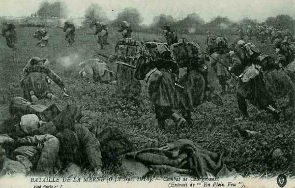
_Combat de Courgivaux_
_Collection privée_

**12h :**

L’artillerie canonne Courgivaux et Montceaux-les-Provins. La division Pétain progresse vers Champfleury qui est occupé à midi.

**16h30 :**

Montceaux-les-Provins est devenu l’objectif de toute l’artillerie du groupe des divisions de réserve, de la 35e division et du 18e C.A., de la 6e division et d’un groupe d’artillerie du 3e C.A. : 200 canons tirent chacun à raison de 3 ou 4 coups à la minute. L’artillerie allemande doit cesser son tir, ses observateurs ayant été éliminés.

Une grande ferme dominant la route de Villers-Saint-Georges est encore tenue par des Allemands équipés de mitrailleuses. La division Marjoulet l’attaque et fait appel à l’artillerie dont les obus percutants ouvrent de larges brèches dans le mur d’enceinte de la ferme.

**17h30 :**

Le terrain vers la ferme des Châtaigniers est un véritable glacis sans abri. Les mitrailleuses allemandes fauchent tout ce qui se lève. La brigade Hollender réussit à s’en emparer au prix de la perte de 600 hommes.

**19h :**

Une contre-attaque allemande repousse la 11e brigade (Hollender) des Châtaigniers pour couvrir la retraite des troupes opposées au 18e C.A.

**20h :**

La lisière sud de Montceaux-les-Provins est enlevée. Les Allemands ont quitté la localité.

**22h30 :**

Les français s’installent à la lisière nord du village, où ils creusent des tranchées.

**23h :**

de Maud’huy est avisé que les Allemands ont été définitivement chassés de Montceaux-lez-Provins. La 6e division (Pétain) a contribué à ce succès d’une manière efficace.

**En fin de journée,**

- La 35e division (Marjoulet) et la 69e brigade tiennent Montceaux-les-Provins, la 70e brigade se trouvant à Villiers-Saint-Georges.

- La 36e division laisse la 72e brigade sur la ligne Couperdrix - Brantilly, la 71e est dans la région Rupéreux - Voulton.

- La 38e division est dans la région de Bouchaire.

**1e C.A.**

L’obstacle à enlever est sérieux : Esternay, grosse agglomération de 2000 habitants est blottie dans une cuvette et dominée par deux massifs, l’un à l’est et l’autre au sud.

Le 9e C.A. allemand tient Esternay et Retourneloup par sa 17e division, la région de Courgivaux par sa 18e. Le C.A. voisin, le 10e C.A.R., est dans la région de Vauchamps à +- 10 km au nord d’Esternay.

- La division Mangin a pris comme objectif Courgivaux.
  Le général Deligny (1e C.A.) a chargé
    La 1e division (Gallet) d’attaquer la position Esternay - Retourneloup.
    La 2e division (Duplessis) de prendre la position à revers par la forêt de la Loge-à-Gond.

**12h30 :**

Maître des Escardes, Mangin lance sur Courgivaux deux bataillons du 74e.

**13h30 :**

Le 74e a dépassé Courgivaux où seule la ligne Bel-Air - le cimetière a opposé une résistance.

**16h :**

Mangin envoie la compagnie du génie à Courgivaux pour en organiser la lisière nord. Subitement, une grêle d’obus s’abat sur Courgivaux et le 74e reflue en désordre sur Escardes. Les Allemands pénètrent dans le village et la compagnie du génie doit se retirer. Mangin se jette au-devant des fuyards. Trois groupes d’artillerie du 1e C.A. qui se trouvent en batterie entre le Haut-d’Escardes et le bois de Près-du-but, tirent sur Esternay pour contrebattre l’artillerie allemande.

**19h :**

L’attaque allemande est brisée et reflue sur Courgivaux avec de lourdes pertes. Mangin donne ordre de réoccuper le village. La division s’installe pour la nuit entre Escardes, Courgivaux et Pont-à-Sec.

**10e C.A.**

Le C.A. doit marcher en direction de Mœurs - Soigny - Vauchamps en se reliant à droite à la 42e division de l’armée Foch.
Il doit atteindre d’un premier bond la ligne Essarts-les-Sézanne - Lachy.

**5h30 :**

Le général Defforges installe son PC sur la route de Sézanne à Esternay, à 1 km de Sézanne.

**8h :**

L’avant-garde de la division Rogerie (20e) tient le Bout-de-la-Ville mais doit s’arrêter car la 42e division n’a pas atteint Villeneuve-les-Charleville et le 1e C.A. est encore très au sud dans la forêt du Gault.

**10h :**

Les 25e et 2e R.I. sont sur la ligne Charleville - Le Recoude.

**12h :**

Franchet d’Esperey prescrit au 10e C.A. de faciliter le débouché du 1e C.A. par une attaque vers Esternay (sud-ouest) et d’attendre sur le front général Le Châtelet - Le Clos-du-Roi que le 1e C.A. ait pu déboucher d’Esternay.

**13h :**

Une avion allemand lance une fusée et une grêle d’obus de 150 s’abat sur le groupe d’artillerie située sur le mamelon 213 et le met hors de combat. En même temps, une formidable attaque d’infanterie allemande déferle : il s’agit de la 19e division de réserve du 10e C.A.R., venue du Gault, qui a pris comme objectif le secteur de Jouy à Le Recoude, et la 2e division de la Garde qui marche sur Charleville.
La lutte acharnée dure jusque la nuit, jusque dans Charleville, mais à partir de 17h, la situation est assurée sur cette partie du champ de bataille par l’intervention de la 37e brigade (Pierson).

**16h30 :**

La brigade Pierson reçoit l’ordre de se diriger vers la forêt du Gault et d’ empêcher le 84e régiment allemand de prendre à revers la brigade Passaga, qui occupe la ligne Le Guébarré - Le Châtelot.

**20h20 :**

Le commandant du 10e C.A. adresse l’ordre de stationnement. La 19e division doit conserver la ligne Le Châtelot - Le Guébarré, la 20e (Cadoudal) est en flèche vers Charleville, entre la 42e division (armée Foch) et la 19e qui est installée en arrière.

**Situation en soirée**

- Aucun succès décisif pour la Ve armée.
    A l’extrême gauche, le C.C. a repris ses cantonnements du 5 au soir.

- Le 18e C.A. a enlevé Montceaux-les-Provins mais n’a progressé vers le nord que de 4 à 5 km.

- Le 3e C.A. a conquis Les Châtaigniers, Escardes et Courgivaux mais la ligne des avant-postes n’a progressé que de 6 km.

- Le 1e C.A. a avancé ses cantonnements de +- 10 km et chassé les Allemands de Châtillon-sur-Morin mais n’a pu triompher de la résistance à Esternay.

- Le 10e C.A. a progressé de +- 10 km. La brigade Cadoudal se maintient dans Charleville.

Des reconnaissances d’aviation repèrent de très importants déplacements de troupes dans la région de Courtacon, La Ferté-Gaucher, Montmirail, Esternay, Montceaux-les-Provins vers le nord. C’est le 4e C.A. de l’armée de von Kluck qui rebrousse chemin. Le 3e C.A. a également été rappelé et commence sa retraite vers Sancy et Montceaux-les-Provins mais a été attaqué par le 18e C.A. français.

Le 9e C.A. allemand a dû se maintenir avec ténacité pour empêcher les français d’avancer dans la région d’Esternay, où il fait la soudure entre les Ie et IIe armées.

**17h :**

Les Anglais bordent le Petit Morin depuis Chauffry (8 km à l’est de Coulommiers) jusqu’à Villiers-sur-Morin, en liaison avec l’armée Maunoury qui a dépassé Meaux.

Franchet d’Esperey prescrit pour le 7 la reprise de l’offensive.

**Dans le camp allemand :**

Comme von Kluck a ordonné le retour en arrière de plusieurs C.A., la IIe armée se trouve dans une situation grave. La Ve armée française a le champ libre pour une attaque enveloppante contre le flanc droit de la IIe armée.

Pour venir en aide à la Ie armée, von Bülow prescrit au IIIe C.A. de se porter immédiatement (12h40) en direction de La Ferté-Milon.

Il ordonne également que le 7e C.A. occupe la coupure de la Dollau de Fontenelle à Montmirail, en réserve d’armée.
Le 1e C.C. reçoit l’ordre de disputer aux colonnes anglaises la coupure du Petit Morin.

### 7 septembre

Des instructions sont expédiées au C.C. et au 18e C.A., leur recommandant de se relier étroitement à l’armée anglaise.
Le 1e C.A. doit pousser vigoureusement au nord d’Esternay, en se reliant au 10e C.A.

**8h30 :**

Franchet d’Esperey reçoit un coup de téléphone du colonel Huguet. Au dire d’aviateurs français, toute la partie de l’armée allemande opposée à la Ve armée française serait en retraite vers le nord. Des reconnaissances aériennes françaises confirment ces informations.

**11h40 :**

L’ordre est téléphoné à tous les C.A. : l’ennemi bat en retraite sur tout le front. La Ve armée doit s’efforcer d’atteindre en soirée le Petit Morin vers Montmirail.

**12h :**

Un coup de téléphone de Foch indique que la IXe armée est en difficulté. La 42e division a perdu Villeneuve-lez-Charleville puis l’a repris. Les Allemands ont occupé Soisy. Or, par Soisy, les Allemands débordent la défense de Villeneuve-lez-Charleville et peuvent forcer le passage sur Sézanne. La gauche de l’armée de Foch est en péril.

**12h15 :**

Un message est téléphoné au général Defforges (10e C.A.)
« La 42e division et le 9e C.A. de la IXe armée sont violemment attaqués par un ennemi débouchant de Saint-Prix sur Soisy. Ce dernier point est occupé par les Allemands. Le 10e C.A. s’engagera pour soutenir la 42e division et le 9e C.A. de façon à arrêter complètement l’attaque allemande sur la gauche de la IX armée. Il aura soin de ne pas perdre la liaison avec la 1e C.A. ».

Cette mission prime pour le moment celle qu’avait donnée Franchet d’Espérey au général Defforges de chercher à couper sur Montmirail la retraite des forces allemandes qui se replient devant le 1e C.A.

**C.C.**

Les cavaliers doivent parcourir en matinée 15 km avant de gagner les points indiqués par le général Conneau, les escadrons n’ayant rejoint leur cantonnement que vers minuit. Le C.C. réalise un léger mouvement vers l’avant. Les trois D.C. peuvent pousser vers l’Aubentin.

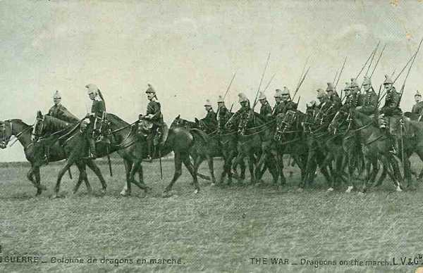
_Dragons français_
_Collection privée_

**10h :**

Un ordre de poursuite parvient : les Allemands cèdent de partout.

- La 10e D.C. doit faire mouvement vers Courtacon - Vieils-Maisons.
    La 8e D.C. doit se diriger par Beton Bazoches sur Chartronges - Lescherolles.

**12h :**

L’avant-garde de la 10e D.C. traverse l’Aubentin à Courtacon, mais le débouché au nord de ce village est difficile car l’artillerie allemande tient ce village sous son feu.

- La 8e division (Baratier) a traversé Bois Arthault et est arrivé sur l’Aubentin d’où elle ne peut déboucher.
    La division Abonneau (4e) a franchi l’Aubentin à Beton Bazoches.

Le C.C. est devant le vide séparant les champs de bataille de la Marne et de l’Ourcq mais Conneau de se rend pas compte de la situation car il n’a pas fait effectuer de reconnaissances.

**18e C.A.**

- Le C.A. arrive sans combat sur le Grand Morin.
    35e division (Marjoulet) à Sancy
    36e division (Jouannic) à Augers et Cerneux

A Sancy, les tranchées ont été abandonnées. Une reconnaissance est poussée vers Maisoncelles, abandonnée par les Allemands dès 9h.

**12h :**

Les nouvelles affluent : les Allemands se retirent et les Anglais avancent.
Dès 12h40, de Maud’huy rédige un ordre de poursuite vers le Petit Morin. La brigade de cavalerie va essayer d’en saisir les passages. Un premier bond conduira les C.A. jusqu’à la route de Paris à Vitry-le-François.

**En fin de journée :**

La 35e division s’installe au nord de la route de Paris à Vitry-le-François, la 36e a ses avant-gardes à cheval sur le Grand Morin, la 34e à Montcel et à la Chapelle-Veronge.

**3e C.A.**

Le 3e C.A. s’aligne aussi sur le Grand Morin.

**5h15 :**

Des effectifs allemands importants du 9e C.A., que l’ordre de retraite n’a pas touchés, exécutent une vigoureuse attaque vers Pont-à-Sec. Les avant-postes français sont rejetés sur Escardes.

**6h :**

Le 28e de la division Pétain est attaqué à Champfleury mais Pétain le renforce et les Allemands sont repoussés.
A ce moment, le 3e C.A. prend l’offensive vers Courgivaux, Tréfols, Marchais-en-Brie. Un premier bond, appuyé par toute l’artillerie, doit porter le C.A. sur la ligne Artillot - Bois-des-Prés - Neuvy et un second vers Villeneuve-la-Lionne - Tréfols.

**9h15 :**

La division Mangin entre dans Courgivaux après une vigoureuse préparation d’artillerie. Parvenue à la route Esternay - Courgivaux, la division marque un temps d’arrêt pour attendre la division Pétain, qui progresse méthodiquement et prudemment.

**12h :**

Les deux divisions sont à la même hauteur. Mangin pousse ses brigades vers Aulnay - Neuvy en se reliant au 1e C.A. La division Pétain progresse à travers Les Châtaigniers évacués.

**16h :**

Il n’est plus possible de douter de la retraite allemande. Ils ont abandonné Esternay.

La division Mangin stationne dans la région Joiselle - Tréfols au nord du Grand Morin et à Neuvy.

Le 3e C.A. a réalisé une avance de +- 12 km sur la journée.
1e C.A.

Par Esternay, le C.A. atteint le Petit Morin à Montmirail. Deligny, qui avait éprouvé le 6, une forte résistance à Esternay - Retourneloup, a pris les dispositions nécessaires pour en triompher le 7.

La division Gallet est chargée d’attaquer, en liant son action à celle de la division Mangin. Toute l’artillerie du C.A. doit appuyer l’attaque de la position allemande à Retourneloup. L’offensive doit se déclencher vers 6h.

**6h :**

La canonnade commence sur la cote 200, sur Retourneloup et le château d’Esternay. L’infanterie se porte en avant prudemment.

**8h30 :**

On apprend que les Allemands se sont dérobés. Le village et le château d’Esternay sont évacués.

**10h :**

Deux colonnes sont formées pour mener la poursuite sans arrêt : la 1e division (Gallet) par Esternay et Champguyon sur Mécringes, la 2e (Duplessis) par Vivier et Montvinot sur Maclaunay.

A la nuit tombante, la division Gallet bivouaque dans la région de Moncet - Rieux, la division Duplessis à Montvinot et à Perthuis. Les ponts du Petit Morin sont tenus, de Vinet à Courbetaux.
Le bataillon Blanchard est aux portes de Montmirail.

Le C.A. a progressé pendant la journée du 7 de 23 km.

**10e C.A.**

Le C.A. se trouve entre le 1e C.A. et l’armée de Foch. Son objectif est de marcher sur Vauchamps et Soigny, en liaison sur sa droite avec la 42e division (armée Foch) et sur sa gauche au 1e C.A. qui marche sur Montmirail.

**7h30 :**

La division Bailly va attaquer vers Soigny mais Defforges donne l’ordre de surseoir à l’attaque : il a reçu des nouvelles alarmantes de la droite où l’armée de Foch serait fortement pressée. Or, le général Defforges a reçu pour première mission de soutenir l’armée de Foch.

**12h :**

Le 1e C.A. fait savoir qu’Esternay a été évacué.

**12h30 :**

Le général Defforges avait pour mission de poursuivre les colonnes allemandes en retraite vers le nord mais un nouvel ordre lui prescrit de s’engager vers l’est pour enrayer l’attaque qui met l’armée de Foch en difficulté.

- La 20e division doit attaquer le hameau des Culots et se porter vers Soisy, pour appuyer la division marocaine qui marchera vers cette localité.

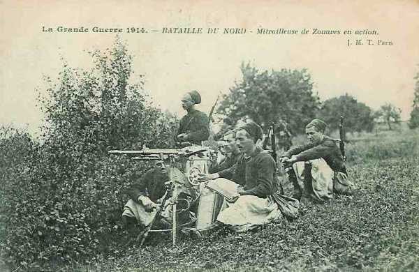
_Zouaves actionnant une mitrailleuse_
_Collection privée_

- La 51e division de réserve a pu se porter vers Chapton et est également prête à soutenir l’attaque de la division marocaine vers Soisy.

**Situation en soirée**

- L’armée anglaise est sur le Grand Morin, la gauche vers Maisoncelles, le centre vers Coulommiers, la gauche vers Jouy-sur-Morin.
    Le 18e C.A. borde le Grand Morin.
    Le 3e C.A. a ses avant-gardes au nord du Grand Morin.
    Le 1e C.A. touche le Petit Morin à Montmirail.
    Le 10e C.A. est 3 - 4 km au sud du Petit Morin.

L’adversaire le plus dangereux est l’armée de von Bülow qui menace de percer le centre français.

- Ordres de Franchet d’Esperey pour le 8 septembre
    Le C.C. conserve sa mission de liaison avec l’armée anglaise.

- Le 18e C.A. garde son axe de marche par Meilleray et Montolivet.

- Le 3e C.A. obliquera sur Montmirail, Corrobert et Verdon.

- Le 1e C.A. attaquera sur Vauchamps et Ville-sous-Orbais.

- Le 10e C.A. doit faire mouvement vers Boissy-le-Repos, Fromentières, Chapelle-sous-Orbais.

Franchet d’Esperey s’attend à une lutte sérieuse sur le Petit Morin où von Bülow paraît décidé à ternir ferme.

### 8 septembre : la gauche de la IIe armée allemande est bousculée.

Comme l’armée anglaise a dû déboucher à 6h de la ligne Saint-Remy - Boissy - Hautes-Maisons vers le nord-est, le C.C. et le 18e C.A. pourront marcher franchement.

**5h :**

La 42e division fait savoir que les Allemands se sont retirés devant elle et qu’elle va se porter en avant, vers Soisy, Baye et champaubert.

L’armée de Maunoury a refoulé le 4e C.A.R. et le 2e C.A. sur l’Ourcq et signale que devant l’armée anglaise et la Ve armée, les Allemands se retirent.

Les munitions d’artillerie commencent à manquer : il n’y a plus que 348.000 obus de 75, soit moins que 40 coups par pièce.

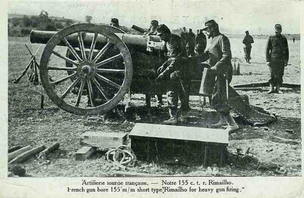
_Canon 155 Rimailho_
_Collection privée_

Maubeuge est tombée après une résistance assez courte : le C.A. de siège et une brigade du 7e C.A. sont libres pour intervenir dans la bataille.

**8h15 :**

Foch appelle à l’aide : sa droite et son centre luttent contre une action combinée de la Garde, du 12e C.A. et du 1e C.A.R. Il demande que la droite de la Ve armée collabore à l’offensive de la 42e division et du 9e C.A. vers l’ouest de Champaubert. Franchet d’Esperey adresse un ordre par téléphone au général Defforges : le 10e C.A. devra infléchir sa marche vers le nord-est pour appuyer l’action de la 42e division.

**9h :**

Des observations aériennes ont vu des colonnes d’infanterie, d’artillerie et de voitures battant en retraite vers le nord. La région de Rebais, La Ferté-sous-Jouarre - Coulommiers est vide d’ennemis, les colonnes se dirigent vers le nord pour franchir la Marne entre La Ferté-sous-Jouarre et Château-Thierry.

**C.C. et armée anglaise**

Le C.C. conserve sa mission d’assurer la liaison avec l’armée anglaise. Ses avant-gardes doivent se mettre en route à 6h à partir de Champ-Martin - Villers-les-Maillets, entre le Grand et le Petit Morin. Les avant-gardes signalent que les Allemands se sont retirés jusqu’au Petit Morin.

**7h :**

Les éclaireurs de pointe, arrivés devant Bellot, sont accueillis à coups de fusil. Les Allemands tiennent la vallée sous le feu, de leur position dominante de Château-Renard.

**9h :**

La brigade légère, qu’accompagnent le groupe cycliste et une batterie, réussit à entrer dans Bellot mais ne parvient pas à franchir le Petit Morin. Le gros de la 4e division s’engage sur le plateau mais est accueillie par des obus, ce qui l’immobilise. Or, elle n’a devant elle que des arrière-gardes. Pendant que von Kluck se bat sur l’Ourcq, appuyant sa gauche à la Marne, le cours de la Marne est surveillé par deux D.C. L’intervalle entre La Ferté-sous-Jouarre et Villeneuve-en-Bellot, soit 25 km est tenu par la 5e D.C. et la D.C. de la Garde, décimée. Sur un front de 12 km, aucune unité allemande ne garde le Petit Morin.

**9h30 :**

L’infanterie anglaise est arrivée sur le Petit Morin et va forcer le passage. Une grosse colonne allemande se dirige de Montmirail vers Château-Thierry, une autre vers Chézy et Nogent-l’Artaud. L’armée anglaise va attaquer la deuxième colonne, le 9e C.A., rappelé par von Kluck. Le général Conneau expédie à ses trois divisions l’ordre d’attaquer le 9e C.A. mais cet ordre n’est finalement pas exécuté.

**11h :**

Le plateau de Château-Renard a été nettoyé par l’infanterie anglaise qui a franchi le Petit Morin à Sablonnières et à Bellot.

**18h30 :**

La D.C. Abonneau fait mouvement vers Vieils-Maisons pour attaquer une colonne allemande mais celle-ci est déjà à Château-Thierry.

**20h30 :**

Les trois D.C. françaises sont dans leur cantonnement sur les deux rives du Petit Morin.
Quant aux anglais, la D.C. Allenby est à Replonges, le 1e C.A. à Bassevelle, le 2e C.A. aux Feuchères, le 3e C.A. aux portes de La Ferté-sous-Jouarre.

**18e C.A.**

La droite de l’armée von Bülow s’est retranchée en aval de Boissy-le-Repos. La rive nord du Petit Morin domine la rive sud avec une altitude moyenne de 200 m et constitue un bastion naturel. La 19e division (10e C.A.) occupe le terrain de la Haute-Vaucelle à Montmirail, la 13e division du 7e C.A. forme un crochet défensif de Marchais à Fontenelle, mais à l’ouest de Vendières, le cours du Petit Morin n’est pas gardé, ce qui rend possible une manoeuvre débordante, effectuée par les 3e, 1e et 18e C.A. français.

- Les 1e et 3e C.A. fixeront de front les défenseurs du bastion de Montmirail et le 18e C.A. les débordera par Marchais.

- Le 18e C.A. doit attaquer par Meilleray et Montolivet puis infléchir son axe de marche par Vendières et Fontenelle.

**7h :**

- Les avant-gardes franchissent la ligne Saint-Martin-des-Champs - Le Vézier
    36e Jouannic
    35e Marjoulet
    38e Schwarz

**9h30 :**

L’avant-garde de la division Marjoulet a dépassé Moncets, la division Jouannic est à Mont-Dauphin et a parcouru 10 km en deux heures et demie. A ce moment, de Maud’huy est informé de la présence allemande sur le Petit Morin mais aussi que les ponts de Vendières et de la Celle sont intacts et non défendus.

La division Marjoulet va attaquer par le sud la position Montmirail - Marchais ; la division Jouannic franchira le Petit Morin à Vendières et prendra la position allemande à revers.

**10h30 :**

Les deux divisions de première ligne progressent sans trop de difficultés jusqu’au Petit Morin.

**11h :**

La 35e division doit prendre pied sur plateau de Vendières - Marchais et fixer l’ennemi, la 36e doit attaquer à l’ouest en débordant la position.

**12h :**

La division Marjoulet a gravi les pentes escarpées au nord de la Celle. Dès son apparition sur le plateau, elle est soumise à des rafales : le bois Jean, la hauteur 182 et les couverts avoisinants jusqu’à Marchais sont occupés par une infanterie retranchée pourvue de mitrailleuses. Marjoulet ordonne de stopper et de fixer l’ennemi par le feu en attendant que la 36e division ait effectué sa manoeuvre débordante.

**13h :**

La division Jouannic (36e), chargée de prendre à revers la position de Marchais, est à pied d’œuvre. L’artillerie est en position sur les croupes de Monthubert, entre l’Epine-aux-Bois et Vendières.
Les éclaireurs ont signalé les Allemands solidement retranchés sur la croupe Marchais - 207.

**L’après-midi :**

Le 18e C.A. bouscule la droite de l’armée von Bülow au nord de Marchais.

**15h :**

La 70e brigade réussit à se glisser dans le ravin de Courcemont et à atteindre la Petit Morin au pont de Villiers.

La division Jouannic entame son attaque. Dès la sortie de Vendières, les obus arrivent par rafales et il faut espacer les unités. Toutefois, devant l’attaque résolue, le bois de Courmont est abandonné par les Allemands.

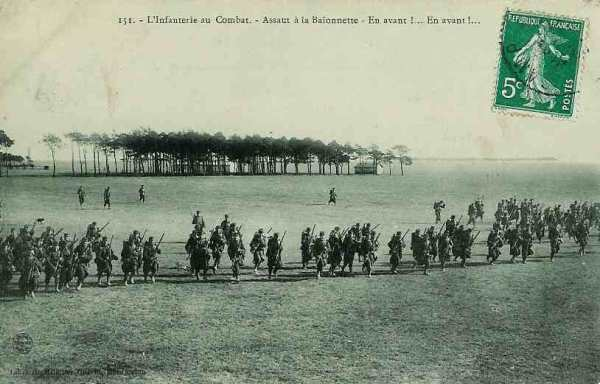
_Assaut à la baïonnette_
_Collection privée_

- Les divisions passent la nuit sur les positions conquises :
    36e (Jouannic) cote 207 - route de Montmirail - Lisière du bois de Courmont.

- 35e (Marjoulet) crête du plateau de Vendières, à cheval sur le Petit Morin.

- 38e (Schwarz) la division n’a pas été engagée.

Globalement, le 18e C.A a fait un bond de 18 km. Grâce à la victoire de Marchais, la défense du bastion Montmirail - Montcoupot - Marchais est gravement menacée.

**17h :**

Le 144e débouche sur la position Vendières - Courmont.

**En soirée :**

Le C.A. a franchi le Petit Morin et déborde Marchais.

**3e C.A.**

Le C.A. doit aborder de front la position de Montmirail. L’axe de marche, infléchi vers l’est, passe par Tréfols, Montmirail et Corrobert.
A droite, la 5e division (Mangin) est dirigée sur le pont de Montmirail ; au centre, la 6e division (Pétain) et à gauche la 37e division (Comby) se dirigent vers le pont de Vinet.

**7h :**

Les avant-gardes débouchent de la ligne Rouillis - Leuze, à 7 km du Petit Morin. Pour arrêter la progression du C.A., les Allemands effectuent des tirs d’interdiction à chaque carrefour ou au débouché des villages. Le 1e C.A. (Deligny) va attaquer tout de suite Courbeteaux, ce qui facilitera l’installation du 3e C.A. sur les plateaux de Mécringes et du Chêne. Les rapports signalent que les Allemands sont fortement retranchés à Montmirail et à Montcoupot et que leur artillerie interdit les abords du Petit Morin.

**10h30 :**

- L’avant-garde de la division Mangin arrive à La Fontaine-Armée
    La division Comby est au sud de Rieux.
    La brigade Tassin marchera vers la région de Hochecourt.
    La brigade Léautier fera mouvement vers Cornantier.

**15h :**

Les deux brigades abordent la plateau de Hochecourt, tenu sous le feu des canons allemands. A la même heure, la division Comby, retardée par des tirs d’interdiction allemands, dépasse à peine Rieux et Les Chanots.

**17h :**

Le massif Cornantier, Hochecourt et Montrobert sont entièrement aux mains de l’infanterie du 3e C.A. Celle-ci creuse des tranchées pour s’assurer la possession de la rive sud du Petit Morin. La rive nord sera attaquée le lendemain, la division Mangin par Montmirail, la division Comby par Dorgenterie.

**20h :**

La division Mangin essaie de prendre pied sur la rive nord du Petit Morin. Dès que les premiers éléments d’infanterie montent sur la crête, ils sont accueillis par des rafales d’artillerie et Mangin préfère surseoir à l’attaque.

**A la nuit :**

Les division Mangin et Comby tiennent le rebord nord du plateau de Cornantier et Le Chêne. La 6e division (Pétain) est dans la région de Morsains - Champ-Gilliard - Rouillis - Le Moncet.

**1e C.A.**

Dès 7h, les divisions ont été arrêtées sur les plateaux de la rive sud du Morin par un barrage d’artillerie lourde. Il n’a pas été possible de neutraliser les obusiers qui échappent aux investigations de l’aviation.

**11h :**

A gauche du C.A., le 3e C.A. est toujours en retard mais à droite, le 10e C.A. a progressé et occuperait Soigny.
L’attaque de la Haute-Vaucelle pourra être tentée, d’autant plus que les batteries lourdes ont été repérées.

**12h :**

Le général Deligny donne ordre à ses deux divisions de se porter à l’attaque du Petit Morin. Le village de Courbeteaux est attaqué de front et à l’est, mais au passage de la crête du plateau 212, les avant-gardes sont clouées au sol par une grêle de projectiles. L’artillerie française entre en action et engage la lutte contre les obusiers allemands. Le feu des batteries allemandes faiblit bientôt, de même que celui des mitrailleuses défendant Courbetaux (localité au sud de Montmirail). A ce moment, la brigade Sauret réussit à franchir la rivière. Courbeteaux, abordé à la baïonnette par le sud, par l’est et l’ouest, est enlevé. Lors de cette action, le général Christian Sauret est tué.

**14h :**

La division Duplessis a reçu ordre de s’emparer de Bergères-sous-Montmirail. Le 73e de la brigade Bernard doit franchir le Petit Morin au Moulin-Henry. Des bois cachent le mouvement et elle parvient à gagner la vallée mais les difficultés commencent dans le bas-fond, dominé par les mitrailleuses. Il faut appeler à l’aide l’artillerie du 10e C.A.

**17h30 :**

Les canons allemands ralentissent sensiblement leur tir. De petites fractions réussissent à s’infiltrer jusqu’à la rivière.

**19h :**

Assaut est donné à Bergères, abordé par l’est et l’ouest.

- Le C.A. bivouaque :
    1e division : dans la zone de Courbetaux - Maclaunay.
    2e division : vers Montmirail - Le Gault.

Le C.A. tient les passages du Petit Morin et pourra le lendemain déclencher son attaque.

**10e C.A.**

Le C.A. appuie la IXe armée. Selon l’ordre du 7 septembre, il faut attaquer vers Boissy-le-Repos, Fromentières et Chapelle-sous-Orbais, en agissant en liaison avec la 42e division, et déborder par Bannay les forces allemandes engagées vers Saint-Prix et Soisy contre la gauche de l’armée Foch.

- Le général Defforges a prescrit le rassemblement de ses C.A. pour 6h30.
    19e division (Bailly) à Soigny
    20e division (Rogerie) à Bout-du-Val
    51e division à Charleville

**7h :**

La 19e division marche sur Boissy-le-Repos, la 20e sur Le Thoult. Les obus allemands de 77 et 150 commencent à pleuvoir. A la division Bailly (19e) il est impossible de déboucher de Soigny. Des batteries françaises ouvrent le feu sur Boissy vers 11h mais sont repérées par des Drachen (ballons) et enveloppées de rafales de gros obus.

Foch demande que la Ve armée prenne l’offensive avec la 42e division vers le plateau ouest de Champaubert mais l’artillerie allemande est maîtresse du terrain.

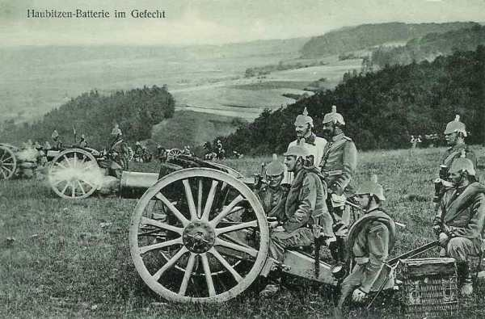
_Batterie d’obusiers allemands_
_Collection privée_

**13h :**

Pour mettre fin à une situation sans issue, Defforges prescrit à son C.A. une offensive générale contre le front Boissy-le-Repos - Corfélix.
La 19e division progresse péniblement et les pertes sont lourdes. Après trois heures d’effort, elle n’a progressé que de 500 m.

**16h :**

La situation change. Les Français ont réussi à repérer au sud de Fontaine-au-Bron une ligne d’artillerie allemande. Le feu est immédiatement ouvert sur cet objectif. Le tir allemand cesse bientôt de tomber sur le plateau de Pommerose. Une autre ligne d’artillerie est découverte au sud de Bannay et prise sous le feu des 75. La progression peut alors reprendre et la crête du plateau est franchie. Les vagues d’assaut dévalent dans la vallée du Petit Morin.

Du côté de Le Thoult, le 47e se heurte à des tranchées garnies de mitrailleuses. La division Boutegourd a reçu pour mission d’attaquer Corfélix. Elle se glisse par le ravin qui conduit de Charleville aux Culots. L’artillerie ouvre le feu sur Corfélix qui est ensuite abordé à la baïonnette, mais les allemands ont abandonné la localité, ne laissant que leurs blessés.

**Le soir,**

La 20e division est dans la région Le Thoult - Le Recoude.
La 19e bivouaque à Charmotte et au Recoude.

Le 10e C.A. n’a progressé que de 5 km mais a prêté un appui efficace à la 42e division Il tient le passage du Petit Morin au pied du bastion de Montmirail.

**Armée anglaise**

Elle a progressé de 20 km et conduit dès 15h ses trois C.A. sur le Petit Morin, depuis La Ferté-sous-Jouarre à La Trétoire. Le vide entre l’armée anglaise et la Ve armée (15 km) est tenu par cinq D.C. françaises et anglaises.
Un message radio intercepté à 11h indique que le C.C. von Richthofen a évacué la région entre le Petit Morin et la Marne au sud de Charly. La voie est libre jusqu’à la Marne.

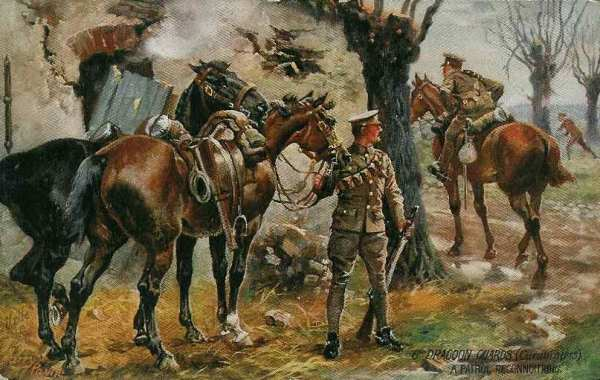
_Dragon Guards_
_Collection privée_

**Les ordres au soir :**

**19h30 :**

Franchet d’Esperey reçoit des ordres du G.Q.G. : la Ve armée doit couvrir le flanc droit de l’armée anglaise en dirigeant un fort détachement sur Azy - Château-Thierry. A sa droite, l’armée continuera à appuyer l’action de la IXe armée et le centre marchera du sud au nord.

**20h30 :**

L’Etat-Major a traduit ces instructions en ordres d’opération pour le 9 :

- Le gros de l’armée se dirigera vers le nord, en restant lié à la IXe armée.

- Le C.C. assurera la liaison avec l’armée anglaise.

- Le 18e C.A. poursuivra vers Château-Thierry - Azy.

- Le G.D.R. et 1e C.A. iront droit au nord, en direction de Condé-en-Brie pour pénétrer dans la brèche ouverte entre les Ie et IIe armées allemandes.

- Le 10e C.A. ira vers Fromentières, prêt à pousser vers le nord en direction de Domery ou vers l’est sur Etoges, dans le flanc de von Bülow.

- Les équipages de ponts seront poussés en avant pour réparer les ponts de la Marne, supposés détruits.
  Dès 10, le P.C. de Franchet d’Espérey sera à Montmirail.

**21h :**

Franchet d’Esperey adresse encore un ordre à ses différents C.A. :
« L’ennemi est en pleine retraite. Il n’y a pas à se laisser arrêter par des résistances d’arrière-garde qui se sacrifient pour retarder notre marche. Ces arrière-gardes doivent être écrasées par un violent tir d’artillerie, tournées par l’infanterie et poursuivies par la cavalerie. Seule une poursuite vigoureuse permettra de recueillir les bénéfices de la situation actuelle. »

**21h30 :**

Un message de Foch provoque une certaine inquiétude :
« Le 11e C.A., corps de droite de la IXe armée, attaqué par les 12e C.A., 12e C.A.R. et la Garde, plie. Le commandant a besoin de sa 42e division, sa division de gauche, et il demande que la Ve armée prenne à sa charge la mission de cette division, qui est de couvrir la droite du 10e C.A. et de progresser avec lui. »

Franchet d’Esperey va mettre les deux divisions actives du 10e C.A. (19e et 20e) à la disposition de Foch pour le lendemain. Ordre en est donné au général Defforges.

**Du côté allemand**

4h : un message radio de von Bülow signale que son armée est très fatiguée et réduite à l’effectif de trois C.A., mais qu’elle attaque tout de même.

**8h45 :**

Un message radio de von Richthofen (1e C.C.) rend compte que le front est percé et que ses divisions se replient sur le Dolloir. Une brèche de 30 km est ouverte entre La Ferté-sous-Jouarre et Montmirail.

Un conseil de guerre est immédiatement réuni dont le résultat est l’envoi du lieutenant colonel Hentsch au Q.G. des armées. Ce dernier n’emporte aucune instruction écrite mais ses instructions verbales visent à laisser au commandant d’armée toute liberté de continuer le combat ou de se retirer, si les circonstances l’exigent.

En cas de retraite, il faut diriger l’aile intérieure des Ie et IIe armées vers Fismes pour que la soudure s’y opère et que la résistance s’organise derrière la Vesle.

**11h :**

Hentsch part de Luxembourg puis passe par les Q.G. des armées de l’aile est.

**19h45 :**

Hentsch arrive à Montmort (IIe armée). Une conférence à lieu, à laquelle prennent part le général Lauenstein, chef d’Etat-Major, le capitaine Matthes, chef du bureau des opérations et Hentsch. Ils constatent qu’il n’y a aucune disponibilité derrière l’armée pour combler la brèche.

**21h :**

Un nouveau renseignement parvient. La 13e division qui couvrait la droite de l’armée, en crochet défensif sur l’éperon de Marchais, a été bousculée et se retire derrière la Verdoncelle entre Le Thoult et Margny. La brèche s’élargit encore de +- 12 km. Si cette nouvelle est confirmée, il sera sage d’envisager un repli de la IIe armée. Ce repli ne s’effectuerait toutefois qu’au moment où les français et Anglais franchiraient la Marne avec des forces considérables et devrait être combiné avec un repli de la Ie armée.

### 9 septembre : élargissement de la brèche

**Situation générale**

Le Q.G. de von Bülow est à Montmort et celui de von Kluck à Mareuil-sur-Ourcq.

**7h :**

Des nouvelles alarmantes arrivent du côté de l’armée Foch : le général Humbert est menacé d’une très forte attaque sur Mondement et demande à être appuyé par une contre-attaque dans la clairière de Montgivroux. Ordre est donné à Deligny d’arrêter le 1e C.A. sur la ligne Margny - Junvilliers, prêt à s’engager vers l’est.

**11h30 :**

Un aviateur a parcouru toute la zone de combat de la Ve armée. Il a vu vers 9h des combats violents se dérouler autour de Saint-Prix, Montgivroux et Broussy. Il a constaté que la ligne de bataille de la IXe armée s’était fortement déplacée vers le sud, sur la Maurienne, soit 20 km au sud de Sézanne. L’aile droite de la Ve armée est donc largement débordée. Il a également vu Château-Thierry vide, les ponts d’Azy et de Jauglonne intacts. Seul celui de Mézy est détruit.

Franchet d’Esperey adresse au général Conneau l’ordre formel de franchir la Marne à Azy, d’agir vigoureusement sur la colonne allemande en retraite et d’assurer le débouché du 18e C.A. au nord de la Marne.

Les Allemands attaquent toujours la IXe armée dans la région de Saint-Prix et Soizy-aux-Bois.

Le 1e C.A. se portera dans la région de Margny et le 3e dans celle de Verdon - Corrobert.
Franchet d’Esperey fonce vers Etoges au P.C. du général Deligny et lui dit « Foch a été battu ce matin, mais il tient bon et doit contre-attaquer, sans doute vers 16h. Il faut l’aider. Marchez sur Etoges. »

**1e C.A.**

- Le C.A. est orienté vers Etoges
    La 37e brigade (Pierson) avance par La Roquetterie sur Fromentières.

- La 38e brigade (Passaga) attaque les Petites-Censes.

Les Allemands ne résistent pas et se retirent vers Bannay. Le 10e C.A. allemand, engagé au sud des marais de Saint-Gond, pourrait être encerclé, mais il se retire à temps.

**17h :**

L’armée Foch a repris l’offensive sur toute la ligne, la 20e division se porte sur Bannay - Baye, avec Corrobert comme objectif.
La division Pierson traverse Fromentières et arrive à 3 km de Champaubert. La brigade Passaga se porte par La Mortière sur Mesnil, à 3 km de Montmort.

- L’ordre de stationnement est donné à 18h45.
    La division Gallet à Fontaine-Chacun.
    La division Duplessis est à Janvilliers - Fromentières - Chapelle-sous-Orbais - Bouc-aux-Pierres - Le Mesnil.

Le 1e C.A. a progressé de 14 km mais il n’a pas pu encercler le 10e C.A. allemand, engagé au sud des marais de Saint-Gond. Ce dernier s’est replié par Champaubert sur Etoges.

**3e C.A.**

La journée est une longue marche militaire sans incidents notables. Le 3e C.A. doit se porter par Corrobert vers Montigny-les-Condé où il serait en mesure soit de continuer sur Dormans (Marne) pour pénétrer plus avant dans le dispositif allemand, soit se rabattre sur Château-Thierry pour participer à la droite du 18e C.A. à l’encerclement de l’armée de von Kluck.

- La division Comby (37e) doit protéger l’opération de franchissement du Petit Morin en occupant le mamelon de Marchais.

- La division Mangin (5e) doit franchir le Morin à Courbeteaux, contourner Montmirail par l’est et prendre la route de Corrobert.

- La division Pétain (6e) franchirait le Morin à La Chaussée et contournerait Montmirail par l’ouest, se dirigeant vers Montigny.

**5h :**

Comby couvre les passages du Petit Morin ; Mangin fait arroser par son artillerie la lisière de Montmirail et les tranchées qui bordent la rivière, précaution inutile car les Allemands sont partis à 3h. Sans perdre une minute, la division franchit le Petit Morin au pont de la ferme Boulante. Des reconnaissances indiquent que les arrière-gardes de cavalerie allemande se retirent par Artonges.

**9h :**

Nouvel ordre d’opérations :

- La division Mangin occupera la zone Verdon - Corrobert, en liaison avec la division Gallet du 1e C.A.

- La division Pétain occupera la zone de Pargny - Courbouvin, poussant ses avant-gardes vers Montigny-sur-Condé.

**10h :**

La cavalerie a dû déloger des détachements de cavalerie allemande combattant à pied.

**15h30 :**

La division Pétain dépasse La Charmoise.
Mangin fait mettre en batterie près de Corrobert l’artillerie lourde du C.A. (canons de 120 mm court).

**16h :**

Mangin apprend que la division Galet (1e) du 1e C.A. est aux prises avec un ennemi qui occupe fortement Margny et Fontaine-Chacun. Il pousse son artillerie divisionnaire et son artillerie lourde vers la ferme Les Minières. L’artillerie ouvre le feu sur des batteries et des tranchées près de Margny.

**17h30 :**

L’artillerie allemande s’est tue et la résistance de Margny a cessé.

**18h :**

L’avant-garde de la division Mangin est à Violaines. Sur ces entrefaites, le général Hache a dicté l’ordre de stationnement. La division Mangin est à Verdon et celle de Pétain dans la zone de Sauvagesse - Courbouvin.

L’ordre d’armée du 8 septembre prescrivait au groupe Valabrègue de se porter, par Marchais-en-Brie et Artonges sur Pargny, à gauche du 3e C.A. et de pousser son avant-garde jusqu’à Montlevon.

Dès 6h, Valabrègue met ses divisions en marche vers Marchais-en-Brie, Villemoyenne et Pargny. L’étape se déroule sans le moindre incident.

**14h30 :**

Alors que la tête d’avant-garde dépasse Montlevon, une violente canonnade éclate sur la droite. L’artillerie française est mise en batterie sur la crête au nord-ouest de Pargny mais l’intervention s’avère inutile car les colonnes du 3e C.A. avancent.
Le soir, la 53e division de réserve est dans la zone Pargny - Montlevon - Montgrimont, la 69e à Artonges et Villemoyenne.

**18e C.A. : occupe Château-Thierry sur la Marne**

Le 18e C.A. marche en deux colonnes :

- À l’est, la 38e division par Vendières et Fontenelle-sur-Viffort.

- A l’ouest, la 36e par l’Epine-aux-Bois et Rozoy.

**7h :**

La route Marchais - Paris est franchie par les têtes des deux divisions.

**12h :**

La tête de la 38e division atteint Viffort. Une reconnaissance aérienne signale que Château-Thierry est vide d’Allemands et la ville est enlevée. En même temps, les anglais franchissent la Marne à Nanteuil et Charly.

Ordre est immédiatement expédié au général Jouannic de pousser sur Azy une brigade de la 36e division, pour préparer le franchissement de la Marne. Aucune réaction allemande à Château-Thierry, aucune à Azy. Chézy est vide d’adversaires. Le 12e franchit la Marne et occupe Bonneuil, le 18e occupe Azy, Rouvroy et Aulnois, sur la rive nord de la Marne.

**En fin de journée**

- Le reste de la 35e division occupera Essizes, Ville-Chambon, Montfaucon et Coquerets.
    Le 1e zouaves couvre Château-Thierry sur la rive nord de la Marne.

- Le 4e zouaves couvre la rive sud ainsi que Nogentel, Etampes et Nesles.

- La brigade de tirailleurs cantonne à La Malmaison avec des avant-postes à la Grande-Hurtebise et à Courboin.

- La 35e division occupe la zone Viffort - Fontenelle - Rozoy.

**C.C.**

Le C.C. ne peut franchir la Marne qu’au pont d’Azy, le pont de Nogent-l’Artaud étant utilisé par l’armée anglaise et celui de Château-Thierry par le 18e C.A.
Des reconnaissances sont poussées au nord de la Marne par la division Abonneau au-delà du secteur Azy - Nogent-l’Artaud et par la division Grellet au-delà du secteur Azy - Château-Thierry. La cavalerie ne progresse pas plus vite que l’infanterie. Par exemple, la division Grellet parcourt 7 km en deux heures.

- La division Grellet (10e) se porte par Viffort sur Château-Thierry.

- La division Abonneau (4e) se porte sur Azy, franchit la Marne et monte sur le plateau d’Etrepilly.

- La division Baratier (8e) se met en marche sur Chézy.

Les Allemands ont laissé des tirailleurs en arrière-garde. Les dragons de la Garde doivent mettre pied à terre.

**16h :**

L’artillerie française entre en scène. Quelques obus réussissent à faire tomber la résistance et les mitrailleuses allemandes cessent subitement de crépiter. Les dragons français franchissent les ponts de Château-Thierry au pas de course.

Dès la sortie nord de la ville, un peloton se trouve aux prises avec des hussards allemands de la Garde.

L’ordre de stationnement prescrit de s’arrêter à Château-Thierry.

Les ordres pour la journée du 10 sont transmis aux différentes unités : la Ve armée doit s’efforcer de border la Marne entre Château-Thierry et Dormans et d’y préparer des passages.

- Le 18e C.A. doit organiser une solide tête de pont à Château-Thierry.

- Le C.C. doit pousser vers Oulchy-le-Château sur l’Ourcq (14 km au nord de Château-Thierry).

- Le G.D.R. doit aborder la Marne à Mézy.

- Le 3e C.A. doit franchir la Marne à Jauglonne.

- Le 1e C.A. doit traverser la rivière à Dormans.

**Du côté allemand**

Le lieutenant colonel Hentsch est resté à Montmort (Q.G. de la IIe armée) le 8 au soir. Le9 au matin, avant de gagner le Q.G. de la Ie armée, Hentsch a une dernière conversation avec le général Lauenstein, chef d’E.M. Il résulte de cet entretien qu’il est indispensable de rapprocher la Ie armée de la IIe.

**7h :**

Hentsch quitte Montmort.

**9h :**

Un message radio du Q.G. de von der Marwitz signale que de fortes colonnes alliées se portent de La Ferté-sous-Jouarre vers l’est.

**10h :**

Un renseignement d’aviation d’une gravité exceptionnelle signale que cinq colonnes débouchent du Petit Morin entre La Ferté-sous-Jouarre et Montmirail et marchent vers le nord.

- Une colonne débouchant du Petit Morin à Saint-Cyr et dont la tête était à 9h15 à Saacy près de la Marne.

- Une colonne venue d’Orly et dont la tête était à 9h15 sur la Marne à Nanteuil.

- Une colonne venue de Boitron et dont la tête était à 9h10 à Pavant, sur la Marne.

- Une colonne venue de Sablonnières dont la tête était à 9h10 à Nogent-l’Artaud.

- Une colonne venue de Vieils-Maisons, dont la tête était à 9h à Chézy.

- Une masse de cavalerie est également signalée dans la région d’ Essizes.

Le renseignement est corroboré et complété à 10h30 par un nouveau message radio de von der Marwitz, signalant que de fortes colonnes sont signalées avançant au-delà de la Marne. La IIe armée va donc être obligée de commencer sa retraite, sa droite vers Damery.

**12h30 :**

von Richthofen doit ordonner le repli de la D.C. de la Garde par Dormans-sous-Vincelles, la 5e D.C. s’étant déjà repliée d’elle-même sur Bézu-Saint-Germain puis sur Courpoil et Beuvardes.

**13h :**

Un message radio de von Kluck annonce que la gauche de la Ie armée recule derrière le Clignon, le C.C. couvrant le mouvement.

**14h :**

L’aile gauche de la IIe armée est repliée. La Garde doit se replier sur Bergères-les-Vertus, la 14e division sur Oger, le 10e C.A. dans la région d’Epernay.

**15h :**

L’aile droite de la IIe armée reçoit l’ordre de se replier à son tour : la 13e division par Orbais et Isny-le-Jard, sur Pont-à-Binson.

Hentsch est arrivé au Q.G. de la Ie armée à Mareuil. Il y retrouve von Kuhl, chef d’E.M. de la Ie armée. Le commandement de la Ie armée ne songe nullement à se retirer, marquant des points contre la VIe armée française. Von Kuhl réunit le colonel Bergmann, sous-chef d’E.M. et Hentsch. Von Kluck n’y assiste pas.

Hentsch montre le danger imminent menaçant la gauche et les arrières de la Ie armée : les Anglais débouchant de la Marne pourrait l’encercler. L’armée de von Bülow a été obligée de se replier. Von Kuhl déclare une retraite vers Fismes impossible mais accepte de se retirer vers Soissons. Von Kluck, mis au courant par la suite, se contente d’entériner.

Au soir, la Ie armée a reculé sur la ligne Crépy-en-Valois - La Ferté-Milon - Neuilly-Saint-Front et les dispositions sont prises pour la retraite jusqu’à l’Aisne.

La bataille de la Marne est terminée. Paris est sauvé.
