# Bataille des marais de Saint-Gond (6 - 9 septembre 1914)

La bataille des marais de Saint-Gond est un épisode de la bataille de la Marne, mettant aux prises la IXe armée française (Foch) contre les IIe et IIIe armées allemandes.

### Contexte de la bataille

La bataille des deux Morins est un épisode de la bataille de la Marne, mettant aux prises la IXe armée française (Foch) contre les IIe et IIIe armées allemandes.
Le lendemain de la bataille des frontières (Mons - Charleroi - Neufchâteau - Longwy), une brèche se dessine dans le dispositif français entre la IVe et la Ve armée. Le soir du 27 août, un intervalle de 20 km sépare les deux armées. Joffre doit parer la grave menace de rupture de son dispositif.

A défaut de réserves, Joffre doit prélever des unités dans la IVe armée, qui ne compte pas moins de quatorze divisions
d’infanterie. Le commandement en est confié à Foch, général de grande réputation et commandant du 20e C.A.

Le 28, Joffre télégraphie au commandant de la IIe armée (de Castelnau) d’envoyer Foch d’urgence au G.Q.G. afin que lui soit confié le commandement de la nouvelle armée.

- Les troupes confiées à Foch seront :
    Le 9e C.A.
    Le 11e C.A.
    La 9e D.C.
    La 42e division, dirigée par chemin de fer vers Guignicourt.

Le chef d’E.M. est le colonel Weygand du 5e hussards, qui restera attaché à l’E.M. de Foch jusqu’à la fin de la guerre.

Les troupes sont en pleine retraite vers la Seine quand parvient l’ordre d’attaque du commandant en chef qui déclenchera la bataille de la Marne.

### Les forces en présence

**Ordre de bataille de la IXe armée française : Foch**

_Général Foch (IXe armée)_
_Collection privée_

Joffre a placé sous les ordres de Foch plusieurs unités prélevées sur les autres armées :

**9e C.A. : (Tours), général Dubois**

Ce C.A. a été transféré, le 16 août, de la IIe armée (Nancy) vers la IVe armée (Charleville)

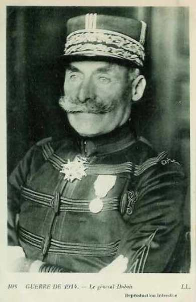
_Général Dubois (9e C.A.)_
_Collection privée_

17e division : général Moussy

| Unité                   | Commandant   | Régiments                                                           |
| ----------------------- | ------------ | ------------------------------------------------------------------- |
| 33e brigade             | Simon        | 68e R.I. (Issoudun)90e R.I. (Châteauroux)                           |
| 34e brigade             | Guignabaudet | 114e R.I. (Saint-Maixent)125e R.I. (Poitiers)                       |
| Elements divisionnaires |              | 7e régiment de hussards (un escadron - Angers)20e R.A.C. (Poitiers) |

18e division : général Lefèvre

| Unité                   | Commandant | Régiments                                                         |
| ----------------------- | ---------- | ----------------------------------------------------------------- |
| 35e brigade             | Janin      | 32e R.I. (Tours)66e R.I. (Tours)                                  |
| 36e brigade             | Eon        | 77e R.I. (Cholet)135e R.I. (Angers)                               |
| Eléments divisionnaires |            | 7e régiment de hussards (un escadron - Angers)33e R.A.C. (Angers) |
| Réserves                |            | 210e R.I. (Auxonne)268e R.I. (Issoudun)290e R.A.C. (Châteauroux)  |

**11e C.A. : (Nantes), général Eydoux**

Ce C.A. fasait partie de la Ve armée à la mobilisation et a été rattaché à la IVe armée. Il sera détaché vers la IXe armée (Foch) avant la bataille de la Marne.

_Général Eydoux (11e C.A.)_
_Collection privée_

21e division : général Radiguet

| Unité                   | Commandant   | Régiments                                                                    |
| ----------------------- | ------------ | ---------------------------------------------------------------------------- |
| 41e brigade             | de Teyssière | 64e R.I. (Ancenis)65e R.I. (Nantes)                                          |
| 42e brigade             | Lamey        | 93e R.I. (La Roche-sur-Yon)137e R.I. (Fontenay-le-Comte)                     |
| Eléments divisionnaires |              | 2e régiment de chasseurs à cheval (un escadron - Pontivy)51e R.A.C. (Nantes) |

22e division : général Pambet

| Unité                   | Commandant | Régiments                                                                                                 |
| ----------------------- | ---------- | --------------------------------------------------------------------------------------------------------- |
| 43e brigade             | Costebonel | 62e R.I. (Lorient)116e R.I. (Vannes)                                                                      |
| 44e brigade             | Chaplain   | 19e R.I. (Brest)118e R.I. (Quimper)                                                                       |
| Eléments divisionnaires |            | 2e régiment de chasseurs à cheval (un escadron - Pontivy)35e R.A.C. (Vannes)                              |
| Réserves                |            | 293e R.I. (La Roche-sur-Yon)317e R.I. (Le Mans)28e R.A.C. (Vannes)3e régiment d’artillerie à pied (Brest) |

**42e division, général Grossetti**

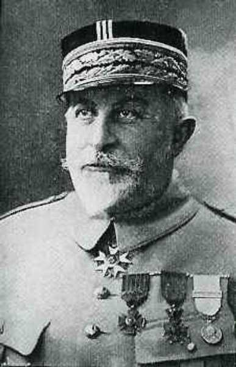
_Général Grossetti (42e division)_
_c Michelin, d’après guide édition 1917, autorisation 06-B-05_

| Unité                   | Commandant | Régiments                                                                                                                                 |
| ----------------------- | ---------- | ----------------------------------------------------------------------------------------------------------------------------------------- |
| 83e brigade             | Krien      | 94e R.I. (Bar-le-Duc)8e bataillon de chasseurs à pied (Amiens, Etain)19e bataillons de chasseurs à pied (Epernay, Verdun)                 |
| 84e brigade             | Trouchaud  | 151e R.I. (Saint-Quentin, Verdun)162e R.I. (Cambrai, Verdun)16e bataillon de chasseurs à pied (Lille, Conflans-en-Jarnisy, Labry)         |
| Eléments divisionnaires |            | 10e régiment de chasseurs à cheval (un escadron - Sampigny)46e R.A.C. (trois groupes - Camp de Châlons)61e R.A.C. (deux groupes - Verdun) |

**C.C. de l’Espée**

| Unité                          | Commandant   | Régiments                                                                                                                                                 |
| ------------------------------ | ------------ | --------------------------------------------------------------------------------------------------------------------------------------------------------- |
| 9e D.C.                        | de Séréville |                                                                                                                                                           |
| 1e brigade de cuirassiers      | de Cugnac    | 5e régiment de cuirassiers (Tours)8e régiment de cuirassiers (Tours)                                                                                      |
| 9e brigade de dragons          | de Sailly    | 1e régiment de dragons (Lucon)3e régiment de dragons (Nantes)                                                                                             |
| 16e brigade de dragons         | de Séréville | 24e régiment de dragons (Rennes)25e régiment de dragons (Angers)33e R.A.C.                                                                                |
| 6e D.C.                        | de Mitry     |                                                                                                                                                           |
| 5e brigade de cuirassiers      | deBuyer      | 7e régiment de cuirassiers (Lyon)10e régiment de cuirassiers (Lyon)                                                                                       |
| 6e brigade de dragons          | Laperrine    | 2e régiment de dragons (Lyon)14e régiments de dragons (Saint-Etienne)                                                                                     |
| 6e brigade de cavalerie légère | Morel        | 11e régiment de hussards (Tarascon)13e régiment de chasseurs à cheval (Vienne)13e batallion de chasseurs à pied (un groupe cycliste)54e R.A.C. (Sathonay) |

**Ordre de bataille de la IIe armée allemande**, commandée par le generaloberst von Bülow.
Chef d’Etat-Major : général von Lauenstein.

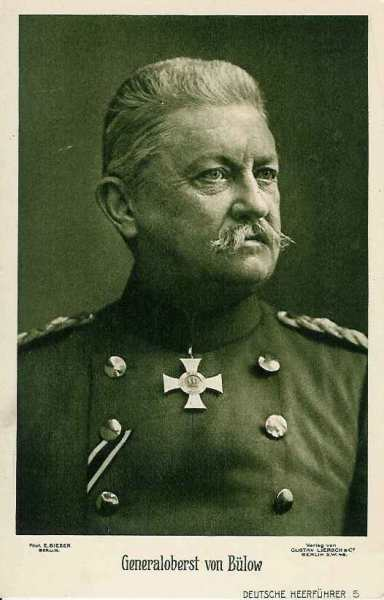
_Général von Bülow_
_Collection privée_

La IIe armée a été affaiblie : le 7e C.A.R. (von Zwehl) assiège Maubeuge et le C.A.R. de la Garde (von Gallwitz) a été transféré sur le front de l’est sur ordre de von Moltke.

**7e C.A. : (Münster), Général von Einem**

_Général von Einem (IIIe armée)_
_Collection privée_

13e division d’infanterie : général von dem Borne

| Unité                      | Commandant | Régiments                                                                                                              |
| -------------------------- | ---------- | ---------------------------------------------------------------------------------------------------------------------- |
| 25. Infanterie-Brigade     |            | Infanterie-Regiment Nr. 13 (Münster)7. Lothringisches Infanterie-Regiment Nr. 158 (Paderborn)                          |
| 26. Infanterie-Brigade     |            | Infanterie-Regiment Nr. 15 (Minden)Infanterie-Regiment Nr. 55 (Detmold)Westfälisches Jäger-Bataillon Nr. 7 (Bückeburg) |
| Cavalerie divisionnaire    |            | Stab u. 3.Eskadron/Ulanen-Regiment Nr. 16 (Salzwedel)                                                                  |
| 13. Feldartillerie-Brigade |            | 2. Westfälisches Feldartillerie-Regiment Nr. 22 (Münster)Mindensches Feldartillerie-Regiment Nr. 58 (Minden            |

14e division d’infanterie : général Fleck

| Unité                      | Commandant | Régiments                                                                                                           |
| -------------------------- | ---------- | ------------------------------------------------------------------------------------------------------------------- |
| 27. Infanterie-Brigade     |            | Infanterie-Regiment Nr. 16 (Cologne)5. Westfälisches Infanterie-Regiment Nr. 53 (Cologne)                           |
| 79. Infanterie-Brigade     |            | Infanterie-Regiment Nr. 56 (Wesel)Infanterie-Regiment Nr. 57 (Wesel)                                                |
| Cavalerie divisionnaire    |            | 3.Eskadron/Ulanen-Regiment Nr. 16 (Salzwedel)                                                                       |
| 14. Feldartillerie-Brigade |            | 1. Westfälisches Feldartillerie-Regiment Nr. 7 (Wesel, Dusseldorf)Klevesches Feldartillerie-Regiment Nr. 43 (Wesel) |

**10e C.A. : (Hannover), général von Emmich**

_Général von Emmich (10e C.A.)_
_Collection privée_

19e division d’infanterie : général Hofmann

| Unité                      | Commandant | Régiments                                                                                                         |
| -------------------------- | ---------- | ----------------------------------------------------------------------------------------------------------------- |
| 37. Infanterie-Brigade     |            | Infanterie-Regiment Nr. 78 (Osnabrück)Oldenburgisches Infanterie-Regiment Nr. 91 (Oldenburg)                      |
| 38. Infanterie-Brigade     |            | Füsilier Regiment Nr. 73 (Hannover)1. Hannoversches Infanterie-Regiment Nr. 74 (Hannover)                         |
| Cavalerie divisionnaire    |            | 3. Eskadron/Braunschweigisches Husaren-Regiment Nr. 17 (Braunschweig)                                             |
| 19. Feldartillerie-Brigade |            | 2. Hannoversches Feldartillerie-Regiment Nr. 26 (Verden)Ostfriesisches Feldartillerie-Regiment Nr. 62 (Oldenburg) |

20. division d’infanterie : général Schmundt

| Unité                      | Commandant | Régiments                                                                                                                                 |
| -------------------------- | ---------- | ----------------------------------------------------------------------------------------------------------------------------------------- |
| 39. Infanterie-Brigade     |            | Infanterie-Regiment Nr. 79 (Hildesheim)4. Hannoversches Infanterie-Regiment Nr. 164 (Hameln)Hannoversches Jäger-Bataillon Nr. 10 (Goslar) |
| 40. Infanterie-Brigade     |            | 2. Hannoversches Infanterie-Regiment Nr. 77 (Celle)Braunschweigisches Infanterie-Regiment Nr. 92 (Braunschweig)                           |
| Cavalerie divisionnaire    |            | Stab und "1/2"-Regiment/Braunschweigisches Husaren-Regiment Nr. 17 (Branschweig)                                                          |
| 20. Feldartillerie-Brigade |            | Feldartillerie-Regiment Nr. 10 (Hannover)Niedersächsisches Feldartillerie-Regiment Nr. 46 (Wolfenbüttel)                                  |

**C.A. de la Garde : (Berlin) General der Infanterie von Plettenberg**

_Général von Plettenberg (Garde)_
_Collection privée_

1. division d’infanterie de la Garde : général von Hutier

| Unité                           | Commandant | Régiments                                                                                           |
| ------------------------------- | ---------- | --------------------------------------------------------------------------------------------------- |
| 1. Garde-Infanterie-Brigade     |            | 1. Garde-Regiment zu Fuss (Berlin)3. Garde-Regiment zu Fuss (Berlin)Garde-Jäger-Bataillon (Potsdam) |
| 2. Garde-Infanterie-Brigade     |            | 2. Garde-Regiment zu Fuss (Berlin)4. Garde-Regiment zu Fuss (Potsdam)                               |
| Cavalerie divisionnaire         |            | Leib-Garde-Husaren-Regiment (Potsdam)                                                               |
| 1. Garde-Feldartillerie-Brigade |            | 1. Garde-Feldartillerie-Regiment (Berlin)2. Garde-Feldartillerie-Regiment (Potsdam)                 |

2. division d’infanterie de la Garde : général von Winckler

| Unité                           | Commandant | Régiments                                                                                                    |
| ------------------------------- | ---------- | ------------------------------------------------------------------------------------------------------------ |
| 3. Garde-Infanterie-Brigade     |            | Garde-Grenadier-Regiment Nr 1(Berlin)Garde-Grenadier-Regiment Nr 3 (Berlin)Garde-Schützen-Bataillon (Berlin) |
| 4. Garde-Infanterie-Brigade     |            | Garde-Grenadier-Regiment Nr 2 (Berlin)Garde-Grenadier-Regiment Nr 4 (Berlin)                                 |
| Cavalerie divisionnaire         |            | 2. Garde-Ulanen-Regiment (Berlin)                                                                            |
| 2. Garde-Feldartillerie-Brigade |            | 2. Garde-Feldartillerie-Regiment (Potsdam)4. Garde-Feldartillerie-Regiment (Potsdam)                         |

**10e C.A.R. : (Hannover), général Günther von Kirchbach**

_Général von Kirchbach (10e C.A.R.)_
_Collection privée_

2e div. infanterie de rés. de la Garde : général von Süsskind

| Unité                                            | Commandant    | Régiments                                                                                                                                    |
| ------------------------------------------------ | ------------- | -------------------------------------------------------------------------------------------------------------------------------------------- |
| 26. Reserve-Infanterie-Brigade                   |               | Westfälisches Reserve-Infanterie-Regiment Nr. 15Westfälisches Reserve-Infanterie-Regiment Nr. 55                                             |
| 38. Reserve-Infanterie-Brigade                   |               | Hannoversches Reserve-Infanterie-Regiment Nr. 77Hannoversches Reserve-Infanterie-Regiment Nr. 91Hannoversches Reserve-Jäger-Bataillon Nr. 10 |
| Cavalerie divisionnaire                          |               | Reserve-Ulanen-Regiment Nr. 2                                                                                                                |
| Artillerie                                       |               | Reserve-Feldartillerie-Regiment Nr. 20                                                                                                       |
| 19e division d’infanterie de réserve de la Garde | von Bahrfeldt |                                                                                                                                              |

1. C.C. : général von Richthofen

Garde-Kavallerie-Division : général von Storch

| Unité                            | Commandant | Régiments                                                                          |
| -------------------------------- | ---------- | ---------------------------------------------------------------------------------- |
| 1. Garde-Kavallerie-Brigade      |            | Regt. der Garde du Corps (Potsdam)Garde-Kürassier-Regt. Berlin)                    |
| 2. Kavallerie-Brigade            |            | 1. Garde-Ulanen-Regt. (Potsdam)3. Garde-Ulanen-Regt. (Potsdam)                     |
| 3. Kavallerie-Brigade            |            | 1. Garde-Dragoner-Regt. (Berlin)                                                   |
| 2. Garde-Dragoner-Regt. (Berlin) |
|                                  |            | Bataillon du 1. Garde-Feldartillerie-Regt. (Berlin)Garde-MG. Abtg. Nr. 1 (Potsdam) |

5. D.C. : général von Ilsemann

| Unité                  | Commandant | Régiments                                                                  |
| ---------------------- | ---------- | -------------------------------------------------------------------------- |
| 9. Kavallerie-Brigade  |            | Dragoner-Regt. Nr 4 (Lüben)Ulanen-Regt. Nr 10 (Züllichau)                  |
| 11. Kavallerie-Brigade |            | Leib-Kürassier-Regt Nr 1 (Breslau)Dragoner-Regt Nr 8 (Kreutzburg)          |
| 12. Kavallerie-Brigade |            | Husaren-Regt. Nr 4 (Ohlau)Husaren-Regt. Nr 6 (Leobschütz)                  |
|                        |            | Bataillon du Feldartillerie-Regt. Nr 5 (Sprottau)MG. Abtg. Nr. 1 (Breslau) |

Le 7e C.A.R. assiège Maubeuge.

**Ordre de bataille de la IIIe armée (von Hausen)**

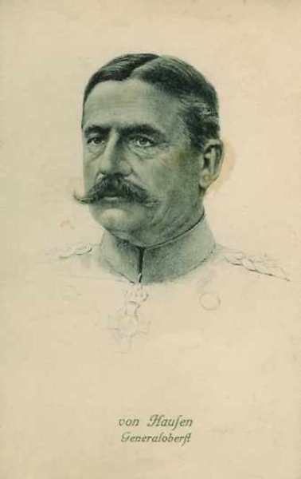
_Général von Hausen (IIIe armée)_
_Collection privée_

**12e C.A. : (Dresde), général d’Elsa**

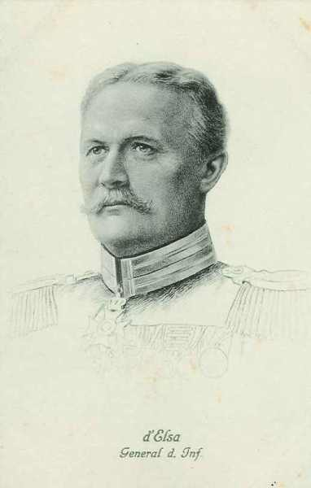
_Général d’Elsa (12e C.A.)_
_Collection privée_

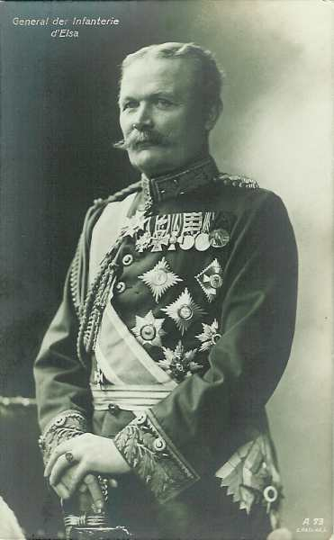
_Général d’Elsa_
_Collection privée_

23e division : général von Lindemann

| Unité                      | Commandant | Régiments                                                                                |
| -------------------------- | ---------- | ---------------------------------------------------------------------------------------- |
| 45. Infanterie-Brigade     |            | (Leib-)Grenadier-Regiment Nr. 100 (Dresden)Grenadier-Regiment Nr. 101 (Dresden)          |
| 46. Infanterie-Brigade     |            | Schützen (Füsilier)-Regiment Nr. 108 (Dresden)16. Infanterie-Regiment Nr. 182 (Freiberg) |
| Cavalerie divisionnaire    |            | Husaren-Regiment Nr. 20 (Bautzen)                                                        |
| 23. Feldartillerie-Brigade |            | Feldartillerie-Regiment Nr. 12 (Dresden)Feldartillerie-Regiment Nr. 48 (Dresden)         |

32e division : général von der Planitz

| Unité                      | Commandant | Régiments                                                                      |
| -------------------------- | ---------- | ------------------------------------------------------------------------------ |
| 63. Infanterie-Brigade     |            | Infanterie-Regiment Nr. 102 (Zittau)Infanterie-Regiment Nr. 103 (Bautzen)      |
| 64. Infanterie-Brigade     |            | Infanterie-Regiment Nr. 177 (Dresden)Infanterie-Regiment Nr. 178 (Kamenz)      |
| Cavalerie divisionnaire    |            | Husaren-Regiment Nr. 18 (Grossenhain)                                          |
| 32. Feldartillerie-Brigade |            | Feldartillerie-Regiment Nr. 28 (Bautzen)Feldartillerie-Regiment Nr. 64 (Pirna) |

**12e C.A.R. : (Dresde), général Hans von Kirchbach**

23e division réserve : général von Larisch

| Unité                          | Commandant | Régiments                                                                                                                               |
| ------------------------------ | ---------- | --------------------------------------------------------------------------------------------------------------------------------------- |
| 45. Reserve-Infanterie-Brigade |            | Kgl. Sächs. Reserve-Grenadier-Regiment Nr. 100Kgl. Sächs. Reserve-Infanterie-Regiment Nr. 101Kgl. Sächs. Reserve-Jäger-Bataillon Nr. 12 |
| 46. Reserve-Infanterie-Brigade |            | Kgl. Sächs. Reserve-Infanterie-Regiment Nr. 102Kgl. Sächs. Reserve-Infanterie-Regiment Nr. 103                                          |
| Cavalerie                      |            | Kgl. Sächs. Reserve-Husaren-Regiment                                                                                                    |
| Artillerie                     |            | Kgl. Sächs. Reserve-Feldartillerie-Regiment Nr. 23                                                                                      |

24e division réserve : général von Ehrental

| Unité                          | Commandant | Régiments                                                                                                                                |
| ------------------------------ | ---------- | ---------------------------------------------------------------------------------------------------------------------------------------- |
| 47. Reserve-Infanterie-Brigade |            | Kgl. Sächs. Reserve-Infanterie-Regiment Nr. 104Kgl. Sächs. Reserve-Infanterie-Regiment Nr. 106Kgl. Sächs. Reserve-Jäger-Bataillon Nr. 13 |
| 48. Reserve-Infanterie-Brigade |            | Kgl. Sächs. Reserve-Infanterie-Regiment Nr. 107Kgl. Sächs. Reserve-Infanterie-Regiment Nr. 108                                           |
| Cavalerie                      |            | Kgl. Sächs. Reserve-Ulanen-Regiment                                                                                                      |
| Artillerie                     |            | Kgl. Sächs. Reserve-Feldartillerie-Regiment Nr. 24                                                                                       |

**19e C.A. : (Leipzig), général von Laffert**

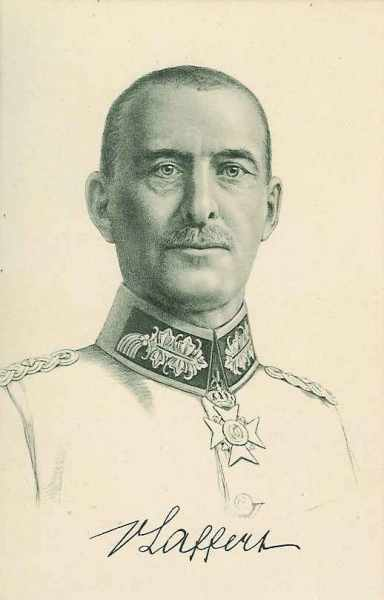
_Général von Laffert (19e C.A.)_
_Collection privée_

24e division : général von Nidda

| Unité                      | Commandant | Régiments                                                                       |
| -------------------------- | ---------- | ------------------------------------------------------------------------------- |
| 47. Infanterie-Brigade     |            | Infanterie-Regiment Nr. 139 (Döbeln)Infanterie-Regiment Nr. 179 (Wurzen)        |
| 48. Infanterie-Brigade     |            | Infanterie-Regiment Nr. 106 (Leipzig)Infanterie-Regiment Nr. 107 (Dresden)      |
| Cavalerie divisionnaire    |            | Ulanen-Regiment Nr. 18 (Leipzig)                                                |
| 24. Feldartillerie-Brigade |            | Feldartillerie-Regiment Nr. 77 (Leipzig)Feldartillerie-Regiment Nr. 78 (Wurzen) |

40e division : général von Olenhusen

| Unité                      | Commandant | Régiments                                                                      |
| -------------------------- | ---------- | ------------------------------------------------------------------------------ |
| 88. Infanterie-Brigade     |            | Infanterie-Regiment Nr. 104 (Chemnitz)Infanterie-Regiment Nr. 181 (Chemnitz)   |
| 89. Infanterie-Brigade     |            | Infanterie-Regiment Nr. 133 (Zwickau)Infanterie-Regiment Nr. 134 (Plauen)      |
| Cavalerie divisionnaire    |            | Husaren-Regiment Nr. 19 (Grimma)                                               |
| 40. Feldartillerie-Brigade |            | Feld-Artillerie-Regiment Nr. 32 (Riesa)Feld-Artillerie-Regiment Nr. 68 (Riesa) |

- Une partie du 12e C.A.R. investit Givet.
    Les 19e C.A. et 19e C.A.R. sont opposés à la IVe armée française.

Comme Moltke s’estime vainqueur sur le front ouest, il prescrit le transport de troupes vers le front oriental, menacé par les Russes, notamment le C.A.R. de la Garde et le 11e C.A. (IIIe armée).

### Le terrain

La IXe armée va lutter d’une part sur le plateau de Brie, d’autre part dans la plaine champenoise. Entre ces deux parties du champ de bataille se situe l’obstacle des marais de Saint-Gond.

Le plateau de Brie est coupé par la vallée du Petit Morin, rivière qui coule vers l’ouest, 80m en dessous du niveau du plateau. C’est par là que s’écoulent les eaux des marais de Saint-Gond. Les bois sont nombreux et couvrent une grande partie du plateau. Ce terrain sera la zone d’action de la 42e division et de la droite de la Ve armée.

Vers le sud-est, le caractère du pays change. Brusquement, l’on perçoit une dénivellation d’une centaine de mètres. C’est le rebord de la première crête concentrique du bassin parisien. Elle forme un cirque autour des marais de Saint-Gond. La crête d’Allemant coupe complètement le pays et offre des vues jusqu’à l’Aube et la Seine. Au milieu de la plaine se dressent quelques pitons isolés comme le Mont Août qui domine les marais au sud ; le Mont Aimé permet de surveiller les routes de Reims à Troyes et de Paris à Châlons.

Dans le vaste amphithéâtre limité au nord et à l’ouest par la côte tertiaire et au sud par la crête d’Allemant s’étendent les marais de Saint-Gond. Cette zone est en 1914 large de 3 km de longue de 19 km. Cinq routes et trois chemins traversent la zone marécageuse. En dehors de ces voies, les marais sont impraticables.

A l’est des marais s’étend la plaine champenoise. Aucun point dominant ne permet d’avoir une vue d’ensemble du pays. Il y a peu de cours d’eau au milieu de cette plaine à peine ondulée. La Somme, la Vaure et la Maurienne sont des ruisseaux coulant d’est en ouest. Le mouvement de terrain qui se trouve entre la Somme et la Vaure marque la ligne de partage des eaux entre affluents de la Seine et ceux de la Marne. La plaine est partiellement couverte de bois de pins s’étendant sur des hectares de superficie et formant une zone sans grands champs de tir et où l’infanterie peut s’infiltrer.

- Ainsi, le terrain où la IXe armée va livrer bataille présente trois zones caractéristiques :
    A l’ouest, la Brie, où les Français tiennent une coupure du terrain et où les bois et villages offrent des centres de résistance.
    Au centre, les marais, dominés au nord par une crête tenue par les Allemands et au sud par l’avancée d’Allemant d’où les observateurs français verront les mouvements de leurs adversaires.
    A l’est, la plaine champenoise, zone plate et libre, merveilleux terrain pour celui qui attaque.

### 28 août

La IIIe armée allemande marche vers le sud-ouest. Faute de cavalerie, elle ne voit pas la brèche qui s’est créée entre les IVe et Ve armées françaises. En outre, elle répond à une demande de secours émanant du duc de Wurtemberg et oblique vers le sud-est. Après une rencontre avec l’aile droite de la IVe armée française, elle reprend sa marche vers le sud (Attigny) et non vers le sud-ouest.

### 29 août

La IIe armée atteint l’Oise, de Guise à Saint-Quentin et se heurte à la contre-offensive de la Ve armée. Pour venir à bout de la résistance française, von Bülow fait appel à von Kluck pour qu’il converge vers La Fère - Laon. Von Kluck se rabat sur l’Oise vers Coucy - Matz.

### 1e septembre

Moltke oriente les différentes armées allemandes vers le sud.

### 2 septembre

Moltke envoie l’ordre suivant :

« L’intention du commandement est de couper les Français de Paris en direction du sud-est. La Ie armée suivra, en s’échelonnant, la IIe, et assumera dorénavant la protection du flanc des armées ».

Or, von Kluck continue sa marche vers le sud-est pour accrocher les Anglais. Il fonce vers la Ve armée française que von Bülow a laissé s’échapper en perdant 24h devant La Fère. La Ie armée précède la IIe armée d’une journée de marche. Le 9e C.A. se trouve sur les routes de marche que doit suivre l’aile droite de la IIe armée.

### 4 septembre

- Moltke sent une menace se profiler et envoie un ordre aux différentes armées :

« Il n’est plus possible de refouler toute l’armée française dans la direction du sud-est contre la frontière suisse. Il faut plutôt s’attendre à voir l’ennemi rameuter de nombreuses forces dans la région de Paris et de menacer le flanc droit des armées allemandes. Les Ie et IIe armées doivent, en conséquence, demeurer face au front est de Paris... La IIIe armée prendra sa direction sur Troyes - Vendoeuvre...

En conséquence, Sa Majesté ordonne
  La Ie armée, entre Oise et Marne, occupera les passages de la Marne à l’ouest de Château-Thierry.
  La IIe armée continuera à faire face au front est de Paris, pour enrayer toute tentative de l’ennemi venant de Paris, entre Marne et Seine.
  La IIIe armée progressera vers Troyes - Vendoeuvre »

Au 34e jour de la mobilisation allemande, des pointes de cavalerie sont à 50 km de Paris.

Des colonnes franchissent la Marne à Vaux, Charly-sur-Marne et Château-Thierry.

### 5 septembre

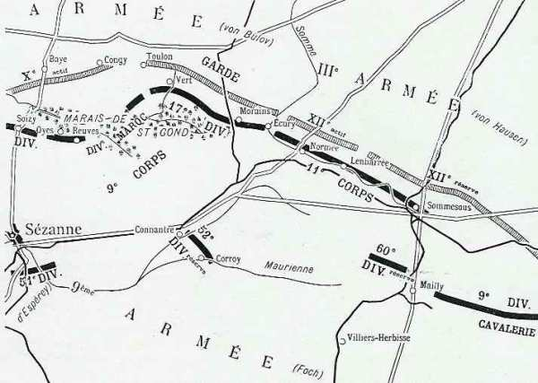
_Situation des armées le 5 septembre_
_c Michelin, d’après guide édition 1917, autorisation 06-B-05_

**Armée française**

L’ordre de Joffre prescrivant la reprise de l’offensive parvient au Q.G. de la IXe armée vers 2h30. Les C.A. et divisions sont aussitôt avisés de la fin de la retraite.

- Les ordres sont expédiés vers 5h aux différents C.A. par Foch.
    Le 9e C.A. ne dépassera pas la ligne Connantre - Oeuvy. Ses arrière-gardes tiendront la ligne Aulnay-aux-Planches - Morains-le-Petit - Ecury.
    La 52e division ne dépassera pas la ligne Allemant - Fère-Champenoise. Elle tiendra les débouchés des marais de Saint-Gond entre Bannes et Oyes.
    Le 11e C.A., se reliant à gauche avec le 9e s’arrêtera au sud de la Somme.
    La 9e D.C. couvrira la droite du dispositif, soit sur la ligne des marais de Saint-Gond et le cours de la Somme entre Ecury et Sommesous.

Les quatre divisions des 9e et 11e C.A. seront établies sur un front d’une vingtaine de km, entre Aulnay-aux-Planches et Sommesous, deux autre divisions formant la réserve. Le dispositif sera couvert à droite par la 9e D.C. et à gauche par la 42e division.

**9h30 :**

- Le dispositif est remanié pour lui donner un caractère plus offensif.

  La 42e division fera tenir par une forte avant-garde, le front La Villeneuve-les-Charleville - Soizy-aux-Bois.
  La 9e C.A. doit occuper par de fortes avant-gardes Congy et Toulon-la-Montagne. Il assurera la liaison avec la 42e division par Villevenard et avec le 11e C.A. à Morains-le-Petit.
  Le 11e C.A. restera sur sa position vers Normée.

Un vide s’est créé entre la IXe et la IVe armée, tenu par une seule D.C. Foch demande à de Langle de Cary « de vouloir bien appuyer sa droite en agissant par la route de Châlons - Arcis contre les forces allemandes qui déboucheraient de Châlons, mais de Langle doit décliner l’offre, son armée est déjà étirée sur un front trop large.

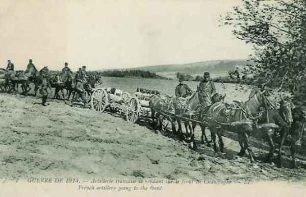
_Artillerie sur le front de Champagne_
_Collection privée_

- A 17h, Foch donne son ordre pour la journée du 6.
    La 12e division, liant son attaque à celle du 10e C.A. (Ve armée) vers Montmirail, se portera dans la direction de Vauchamps et de Janvillers pour conquérir et tenir le Petit Morin.
    Le 9e C.A. s’établira défensivement sur la ligne des marais de Saint-Gond, de Oyes à Bannes. Il maintiendra des avant-gardes fortement organisées au nord des marais. Il tiendra des forces prêtes à déboucher vers Champaubert.

- Le 11e C.A. s’établira défensivement de Morains-le-Petit à Lenharrée, pour barrer les routes venant de Châlons et de Vertus.

- La 9e D.C. à Vatry tiendra la direction de Châlons à Sommesous.

- **Armées allemandes**

Les armées allemandes sont échelonnées entre Paris et Verdun :
  Ie armée : s’étend entre Ermenonville et Esternay. Elle fait face à la VIe armée et à l’armée anglaise.

- La IIe armée est entre Montmirail et Vertus. Elle fait face à l’aile droite de la Ve armée et à la IX armée.

- La IIIe armée borde la Marne entre Tours et Châlons. Elle pourrait pénétrer dans la brèche qui existe entre la IXe et la IVe armée.

- La IVe armée se trouve entre Vitry-le-François et Revigny et fait face à la droite de la IVe armée française.

- La Ve armée s’étend de Villers-en-Argonne à la Meuse en aval de Verdun et est opposée à la IIIe armée.

Les ordres de l’O.H.L. du 4 septembre amènent von Bülow à modifier quelque peu la marche de son armée. Au lieu de continuer sa progression vers le sud, il doit faire face au sud-ouest (Paris), en pivotant autour de sa droite à Montmirail et en lançant sa gauche sur Marigny-le-Grand.

Toutefois, les ordres de von Bülow (18h) pour le 6 prescrivent toujours la marche de l’armée, la gauche en avant.

- Le 7e C.A. restera le 6 dans ses cantonnements, en liaison avec la Ie armée.
    Le 10e C.A., le 10e C.A.R et la Garde atteindront avec leurs avant-gardes la ligne Montmirail - Marigny-le-Grand.

### 6 septembre

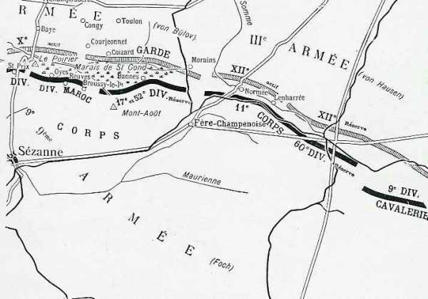
_Situation des armées le 6 septembre_
_c Michelin, d’après guide édition 1917, autorisation 06-B-05_

**Aile droite de la Ve armée**

La IXe armée se dispose à attaquer mais c’est l’armée allemande qui prend l’initiative.

Le 10e C.A. (19e et 20e divisions), qui constitue la droite de la Ve armée, se trouve dans la région sud-ouest de Sézanne. D’après les ordres du général Franchet d’Esperey, il doit attaquer vers Moeurs, Soigny, Vauchamps. La 20e division progresse d’abord sans encombre mais se heurte à hauteur de Charleville aux unités du 10e C.A.R. allemand qui marche vers le sud.

**14h :**

Un assaut allemand réussit à repousser les défenseurs de Charleville mais ceux-ci réoccupent le village vers 15h. La position de Charleville est en flèche par rapport au dispositif français mais le général de Cadoudal refuse de l’évacuer pendant la nuit.

**42e division**

La division a pour mission de couvrir le flanc droit de la Ve armée et de se porter dans la direction générale de Vauchamps et de Janvillers pour conquérir et tenir le Petit Morin. Dès le matin, elle se déploie face au nord. Le 162e s’avance au-delà de Soizy, le 151 pousse deux bataillons au nord de La Villeneuve, le troisième bataillon maintient la liaison avec la droite du 10e C.A.

**6h :**

Un renseignement signale de l’artillerie allemande progressant à vive allure entre Corfélix et Les Culots. Peu après, cette artillerie ouvre un feu violent.

**8h :**

Des tirs de mitrailleuses s’abattent sur les bataillons du 161e au nord de La Villeneuve ainsi que sur les batteries du 61e en position au nord du village. L’infanterie doit se replier au sud de La Villeneuve mais les Allemands n’y pénètrent pas.

**9h :**

Le 94e R.I. est engagé à droite du 151e, ce qui permet à ce dernier de réoccuper La Villeneuve.

**12h30 :**

Comme le Ie C.A. ne peut déboucher d’Esternay, le général Grossetti donne l’ordre de stopper et d’organiser solidement les positions conquises. Les Allemands renouvellent leurs attaques sur Charleville et La Villeneuve, sans succès.

Dans les bois des Grandes Garennes, le 162e est refoulé au sud du bois mais les Allemands ne parviennent pas à en déboucher, bloqués par un barrage d’artillerie.

L’artillerie est en batterie au nord du bois du Bout de la Ville et à l’est de la route Sézanne - Soizy, vers le bois de Saint-Gond.

**13h :**

Foch, mis au courant de la situation de la Ve armée, ordonne à la 42e division de s’organiser fortement, en se reliant au 9e C.A.

**18h30 :**

Le combat se ralentit et le feu cesse sur toute la ligne. La Villeneuve a été prise et reprise trois fois au cours de la journée et elle est restée en possession du 151e français.

**A la nuit :**

la 20e division est en flèche et n’a pas lâché Charleville.

**9e C.A.**

L’ordre donné par le général Dubois, le 5 septembre, est strictement conforme aux intentions de Foch : attaquer au nord des marais en créant une organisation défensive au sud, soit « le 9e C.A. a pour mission de s’établir défensivement sur la ligne des marais de Saint-Gond, de Oyes à Reuves, en maintenant de fortes avant-gardes au nord des marais et en tenant des forces prêtes à déboucher sur Champaubert. »

- La division du Maroc tiendra solidement Congy, son artillerie prête à battre les directions de Bannay, Etoges et champaubert.

- La 17e division, tiendra la position de Toulon-la-Montagne, Vert-la-Gravelle avec détachement au nord d’Aulnizeux, son artillerie battant les directions d’Etrechy - Mont-Aimé.

- Une brigade de la division du Maroc et l’artillerie de C.A. défendent les débouchés sud des marais de Saint-Gond, de Oyes à Broussy-le-Petit (exclu).

- La 52e division de réserve occupera le front Broussy-le-Petit - Broussy-le-Grand - Bannes. Son artillerie est au sud-ouest du Mont-Août.

**Brigade coloniale**

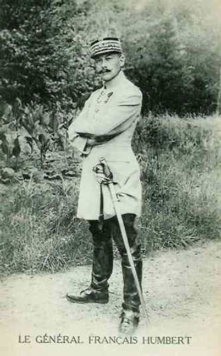
_Général Humbert (div. marocaine)_
_Collection privée_

A son tour, le général Humbert (brigade coloniale) donne son ordre :

La brigade Blondlat, qui aura passé les marais, poussera sur Congy et se retranchera solidement. Le général Blondlat recherchera la liaison avec la 17e division vers Aulnizeux.

**3h :**

Les troupes cantonnées à Broussy-le-Grand se portent vers Reuves. (Régiments Cros et Fellert). Ces troupes mettront en état de défense Oyes et Reuves.

**5h :**

Le régiment colonial occupe Coizard, vide d’ennemis et continue sur Courjeonnet qu’il occupe.

**6h :**

Le régiment de zouaves Levêque, qui vient de passer les marais, est surpris dans Coizard par le feu de l’artillerie mais il prend son dispositif et attaque en direction de Congy. L’artillerie française ne parvient pas à riposter et la situation apparaît comme grave.

**7h :**

Le bataillon Sautel tient Joches et Coizard mais il n’est plus question d’en déboucher. Les batteries françaises sont repérées et subissent une pluie d’obus.
Comme les Allemands occupent la corne sud du bois de Toulon, Coizard doit être abandonné et les troupes doivent se retirer sur Bannes.

**9h20 :**

Le général Blondlat tient ferme à Bannes et Broussy-le-Grand.

**9h30 :**

- Le général Dubois envoie un ordre prescrivant :
    A la 17e division, de se maintenir à tout prix sur le front Toulon - Vert-la-Gravelle et de pousser sa 33e brigade de Broussy-le-Grand vers Broussy-le-Petit.

- A la division du Maroc, de faire tomber la résistance de Congy puis de s’emparer de Baye.

- A la 52e division, de barrer les routes qui traversent les marais et aboutissent à Bannes, Broussy-le-Grand et Broussy-le-Petit ; d’ organiser le Mont-Août et envoyer un bataillon vers Aulnay-aux-Planches pour se retirer avec la 17e division vers Aulnizeux et avec le 11e C.A. à Morains-le-Petit.

**17e division**

L’ordre du général Moussy prescrit à l’avant-garde de se retrancher solidement à Toulon-la-Montagne et à Aulnizeux ; l’artillerie doit couvrir les débouchés d’Etrechy et du Mont-Aimé.

Le combat s’engage de bonne heure. L’artillerie française ouvre le feu sur l’artillerie allemande établie au sud-est de Loisy-en-Brie et sur des fractions de cavalerie signalées entre le château de La Gravelle et Etrechy. Une colonne allemande est en marche sur Toulon, une autre descend des hauteurs de Courmont vers Aulnizeux. Le colonel Eon envoie son bataillon en réserve pour barrer la route à cette colonne.

**7h :**

Le feu de l’artillerie allemande est de plus en plus puissant sur Coizard - Joches et sur Aulnizeux. Les deux batteries françaises ne sont pas à même de faire face à l’importante artillerie allemande, car le gros de l’artillerie de la 17e division est resté au sud des marais.

Les bataillons du colonel Eon sont bientôt en butte au feu de nombreuses mitrailleuses et doivent se replier. Vers la fin de la matinée, les deux batteries ont regagné Bannes.

Le 77e régiment part avec entrain, son colonel en tête. Malgré le feu de l’artillerie et des mitrailleuses, il atteint les pentes sud du mont Toulon, mais reçoit à cet instant l’ordre de repli, car le 135e à droite a repassé les marais au sud d’Aulnizeux et la droite de la division du Maroc a évacué Coizard et s’est reportée au sud des marais. Le 77e régiment laisse 500 hommes sur le terrain.

Le 135e a également gagné le Mont Août, mais il a dû refluer à travers Bannes en flammes ; seuls 600 hommes sont ralliés. Les deux groupes d’artillerie divisionnaire, restés en position sur la crête de Bannes, tirent sur les objectifs allemands aperçus vers Aulnizeux.

Devant l’insuccès de l’attaque du 9e C.A., Foch doit prescrire une attitude défensive, en se tenant sur la rive sud des marais de Saint-Gond.

- Le 9e C.A. s’établit pour la nuit au bivouac.
    La 17e division à la ferme Hozet et environs.
    La division du Maroc dans la région Montgivroux - Mondement, couverte par la brigade Blondlat sur la ligne Broussy-le-Grand - Broussy-le-Petit, par des éléments du régiment Fellert vers Reuves et par des éléments du régiment Cros à Oyes.

La 52e division stationne sur ses emplacements, une brigade sur le Mont-Août et une brigade au nord et au nord-est de Fère-Champenoise.

**11e C.A.**

La mission du 11e C.A., située sur le terrain le plus défavorable, est nettement défensive : « s’établir défensivement de Morains-le-Petit à Lenharrée, pour barrer indiscutablement à l’ennemi les routes venant de Châlons et de Vertus »

- Le général Eydoux attribue un front à chacune de ses divisions :
    21e division : de Morains-le-Petit inclus à Normée inclus.
    22e division : de Normée exclu à Lenharrée inclus.
    60e division de réserve : au nord de Fère-Champenoise, en détachant un bataillon à Montépreux.

Le Q.G. du C.A. est à Connantre.
Foch compte que le C.A. pourra barrer la route de Sommesous - Fère-Champenoise et insiste pour que l’infanterie se retranche.

Il existe une large brèche entre la IXe et la IVe armée. La 9e D.C. qui doit le combler semble insuffisante pour cette tâche.

**21e division**

Les 64e et 65e régiments d’infanterie reçoivent dans le courant de la nuit l’ordre d’occuper Morains et Ecury. Sur le chemin vers ces deux localités, les unités sont soumises à un violent feu d’artillerie et doivent avancer en terrain découvert. Le 65e progresse jusqu’à 1000 m de Morains, mais les hommes doivent s’écarter de la route et se disperser dans les bois, ce qui nuit à la cohésion des unités.

Le 64e réussit à pénétrer dans Ecury mais à peine y est-il installé que la canonnade redouble d’intensité.

**13h :**

Normée et Ecury doivent être évacués. Les Français entament une contre-attaque, voulant conserver Ecury à tout prix. La localité est battue par l’artillerie française afin de rendre le passage intenable à l’infanterie allemande.

**15h :**

Normée et Lenharrée doivent être abandonnés. Ce même jour, la 18e division, venue de Lorraine, vient renforcer le C.A.

**Pendant la nuit :**

Une attaque a lieu et les Français réussissent à nouveau à pénétrer dans Ecury, encore tenu par les Allemands. Il en résulte un combat de rues mais les Français ont le dessous et doivent à nouveau se réfugier aux abords du village.

- **22e division**

Les deux brigades sont accolées, la 44e tenant le front Normée - Lenharrée et la 43e couvrant le flanc droit.
  Le 19e est poussé à Lenharrée où il arrive à 8h30.
  Le 62e a un bataillon aux ponts de Haussimont et de Vassimont
  L’artillerie de la division est à La Maltournée, face au nord-est.

**60e division**

Elle assure la liaison avec la 9e D.C.

**9e D.C.**

La division se trouve à Soudé-Sainte-Croix, couverte par deux avant-gardes, l’une vers Vatry, l’autre vers Coole.
Vers 13h, l’avant-garde est attaquée par une colonne débouchant de Vatry et de Bussy-Lettrée. La division se regroupe en arrière, de façon à protéger Sommesous.

**Dans le camp allemand**

**IIe armée**

**10e C.A.**

Le général von Emmich, croyant les Français en retraite, a donné les directions de marche pour le 6 :

- 19e division : Charleville - Les Essarts - Saint-Prix - Lachy - Mœurs Elle doit traverser le Petit Morin à 8h.
    20e division : Sézanne.

- Un régiment de cavalerie renforcé, composé d’éléments des 19e et 20e divisions : Saint-Prix.
  Les colonnes allemandes se trouvent rapidement aux prises avec les avant-gardes françaises et soumises à des tirs d’artillerie vers Le Reclus et Corfélix. Les 78e et 73e R.I. se déploient mais sont en butte à un violent tir d’artillerie et d’infanterie provenant de La Villeneuve et de Soizy-aux-Bois.

Sur la droite, la 19e division, appuyée par la 2e division de réserve de la Garde, attaque en direction de Charleville. Les hauteurs de la Pommerose sont atteintes sans grandes difficultés. La division contourne Charleville par la droite mais ne peut pas s’approcher du village, puissamment défendu.

**9h30 :**

La cote 213 est atteinte non sans peine. Des mitrailleuses françaises installées vers Soizy causent de fortes pertes. Les unités se replient jusqu’à la lisière des bois au sud du Petit Morin.

A la 20e division, l’artillerie est installée dès 5h afin de prendre sous son feu les hauteurs entre Oyes et Reuves. L’infanterie se heurte dès le matin aux unités du 9e C.A. français à Villevenard, Courjeonnet et Joches. La 39e brigade marche sur les bois de Toulon-la-Montagne et en chasse les unités du colonel Eon vers 10h.

Von Bülow reçoit peu de renseignements et croit pouvoir pousser plus loin :

- le 10e C.A.R. sur Esternay - les Essarts-le-Vicomte - Villenauxe.

- Le 10e C.A. vers La Noue - La Forestière - Villenauxe - Barbuisse.

- La Garde sur Broussy - Chichey - Marcilly.
  Le combat reprend avec intensité sur le front du 10e C.A. La 2e division de la Garde repousse les Français au-delà du chemin Charleville - La Recoude, mais le 15e régiment échoue dans son attaque de Charleville. Il subit des pertes considérables, dues partiellement au tir mal ajusté de l’artillerie allemande. A la nuit, il doit bivouaquer au nord de Charleville.

Von Emmich a donné l’ordre à la 19e D.I. d’attaquer Mondement pour permettre à la 20e D.I. de traverser les marais et le Petit Morin. Le 73e pénètre dans La Villeneuve mais ne peut pas s’y maintenir. Le groupement von Stockhausen finit par s’emparer des hauteurs au sud de Saint-Prix.

En fin de journée, les Allemands occupent la ligne au nord de La Villeneuve et au nord de Soizy. La 20e division s’empare de Villevenard, Courjeonnet et Coizard, mais l’armée est loin d’avoir atteint les objectifs fixés par von Emmich.

**Garde prussienne :**

Le général von Plettenberg, commandant de la Garde prussienne, donne ses ordres pour le 6 :

- La 1e division marchera par Vert-la Gravelle, Broussy-le-Grand et Allemant jusqu’à Gaye.

- La 2e division marchera par Bergères et Fère-Champenoise jusqu’à Marigny-le-Grand. La ligne Bannes - Morains doit être franchie à 7h par les avant-gardes.

- Des explorations doivent s’effectuer jusqu’à la ligne Conflans - Méry-sur-Seine.

**Ie division**

**4h45 :**

La 1e division entame un combat vers le château de la Gravelle.

**7h :**

Toute la division entre en ligne. L’artillerie est en position vers la cote 190 (sud d’Etrechy) et au nord-ouest de Loisy, prenant sous son feu les hauteurs de Toulon.

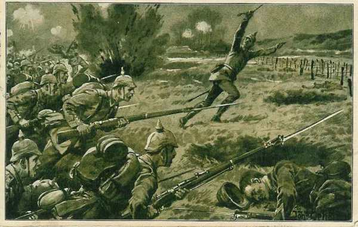
_Attaque de l’infanterie allemande_
_Collection privée_

**10h :**

Les Français sont rejetés des positions à l’ouest et l’est de Vert-la-Gravelle malgré des tirs de mitrailleuses qui causent de sérieuses pertes. Les Français repassent les marais sur les rares passages. Le 2e régiment de la Garde traverse Vert-la-Gravelle.

**10h45 :**

Le général von Hutier donne un ordre de poursuite : la 1e brigade traversera les marais vers Bannes, les 3e et 4e par Aulnizeux. L’artillerie doit appuyer le passage en s’installant au nord-ouest d’Aulnizeux et tirant sur Bannes et Aulnay. La progression s’arrête toutefois, l’artillerie française faisant barrage à la progression de la Garde.

**2e division**

La division commence au matin sa marche à l’est des marais.

**4h :**

Le renseignement parvient que Morains-le-Petit et Clamanges sont occupés. Le général von Winckler veut attaquer avec deux groupements : la 3e brigade sur Clamanges, la 4e sur Morains-le-Petit.

La 4e brigade quitte Vertus et doit attaquer la route Bergères - Morains-le-Petit et le chemin Pierre-Morains - Ecury-le-Repos.

**7h :**

L’artillerie ouvre le feu.

**8h45 :**

Le 2e régiment de grenadiers s’engage devant Pierre-Morains, le 4e régiment traverse Pierre-Morains. La 3e brigade occupe Clamanges sans coup férir mais doit s’arrêter devant Ecury-le-Repos car la 4e n’avance pas.

Von Plettenberg constate que les Français offrent une résistance sérieuse. La 1e division atteint à peine le nord des marais et la 2e division piétine devant Morains-le-Petit et Ecury-le-Repos. Von Plettenberg envoie un officier de liaison auprès du 12e C.A. saxon (IIIe armée) pour lui demander d’entrer en ligne à côté de la Garde.

Il envoie les instructions pour une nouvelle attaque :

- 1e division : sa droite sur Broussy-le-Petit - Chichey - Queudes - Marcilly ; sa gauche au Mont Août - Linthes - Gaye - Anglure.

- 2e division : sa droite en liaison avec la 1e division, sa gauche sur Fère-Champenoise - Marigny-le-Grand.

**1e division**

**13h :**

La 1e division essaie à nouveau de traverser les marais mais échoue.

**16h :**

La 1e division occupe Aulnay et Aulnizeux. En fin d’après-midi, la division reçoit un ordre du C.A. lui prescrivant un déplacement latéral vers Morains-le-Petit et Normée.

**2e division**

**13h :**

La 2e division de la Garde reprend son mouvement en avant Le 2e régiment de grenadiers tente de s’emparer de Morains-le-Petit en flammes. Il subit de fortes pertes.

**Dans l’après-midi :**

Le 4e régiment pénètre dans le village d’Ecury, traverse la Somme mais ne peut finalement se maintenir dans Ecury par suite de l’intensité des tirs. La 3e brigade parvient jusqu’à la route de Villeseneux à Normée. Le 2e régiment d’artillerie de la Garde se met en batterie au sud-ouest de Clamanges mais est réduit au silence par l’artillerie française.

Von Plettenberg devra modifier complètement son dispositif pour le lendemain.

**IIIe armée**

L’armée a eu le 5 un jour de repos. Les ordres de von Hausen pour le 6 sont de marcher sur Germinon et Coupetz. Le 12e C.A. est le seul qui intervient contre l’armée de Foch. Il doit marcher en deux colonnes :

- La 32e division par Jalons, Champigneul, Chaintrix, Vatry, Soudé-Sainte-Croix.

- La 23e division par Matougues, Nuisement, Coupetz.

Les avant-gardes doivent atteindre, dans la journée du 6, la route de Fère-Champenoise à Vitry-le-François.
Le commandant du C.A., le général von Elsa, arrive à la sortie de Châlons quand on lui signale que le C.A. de la Garde est engagé dans un violent combat près de Pierre-Morains. La bataille s’étend jusqu’à Clamanges.

L’entrée en ligne du 12e C.A. paraît souhaitable. Von Elsa, après en avoir référé au Q.G. de la IIIe armée, envoie l’ordre à la 32e division de se porter à l’aide de la Garde.

Entre temps, le commandant de la 32e division (von der Planitz) avait déjà pris l’initiative, pour agir contre le flanc français. La division aurait bien besoin de repos et compte de nombreux malades, mais von Planitz décide de ne pas s’arrêter avant d’avoir atteint les rives de la Somme. von der Planitz veut attaquer entre Normée et Lenharrée.

Les brigades subissent de grosses pertes du fait de l’artillerie française. Vu la violence du combat, von der Planitz demande à son tour d’être couvert par la 23e division.

Quand von Hausen avait donné ses ordres le 5 au soir, il pensait n’avoir affaire qu’à de fortes arrière-gardes jusqu’à la coupure de la Seine. Vers midi, la situation change : divers éléments semblent annoncer la fin de la retraite française. Il téléphone à l’O.H.L. où on lui demande des explications pour son arrêt le 5. La IVe armée lui demande être couverte. Pour lui donner satisfaction, il envoie la 23e division sur Coupetz.

**Vers 17h :**

von Hausen se trouve avec une armée coupée en deux tronçons, séparés par une trentaine de km. Dans la soirée, von Bülow demande l’engagement de toute la IIIe armée vers Fère-Champenoise pour soulager la Garde.
Résultats de la journée
En fin de journée, ni les Français ni les Allemands n’ont pu atteindre leurs objectifs.

- Il n’est plus question pour Foch d’attaquer avec la 42e division. Elle doit « s’organiser sur le terrain ».
    La ligne de la Somme a été abandonnée et le 11e C.A. paraît très fatigué.

- Le 10e C.A. allemand a été arrêté 2 ou 3 km au sud du Petit Morin et n’arrive pas à franchir les marais.
    La Garde a vu ses attaques se briser et doit demander du secours.

### 7 septembre

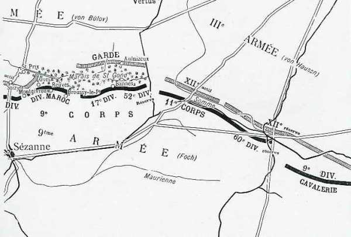
_Situation des armées le 7 septembre_
_c Michelin, d’après guide édition 1917, autorisation 06-B-05_

Quand les troupes reçoivent la proclamation solennelle de Joffre, elles sont engagées depuis 24h dans des combats indécis. Une brèche de 30 km existe entre la IXe armée et la IVe armée. Néanmoins, Foch veut maintenir l’offensive et il donne des ordres d’attaque pour le 7.

- « En vue de continuer à appuyer les progrès de la Ve armée, la IXe armée prendra immédiatement les dispositions suivantes :

  La 42e division poursuivra son offensive avec le 10e C.A.
  Le 9e C.A., continuant d’assurer la défense des marais de Saint-Gond, se tiendra prêt à déboucher vers Aulnizeux et vers Vert-la-Gravelle, avec l’aide du 11e C.A.

- Le 11e C.A., maintenant sa position de Morains-le-Petit, Ecury, Normée, s’emparera des hauteurs 167, 144 ainsi que de Clamanges ; il se portera ensuite à l’attaque dans la direction Pierre-Morains, Coligny, Mont Aimé.

- La 9e D.C., à Sommesous, surveillera les routes de Vitry-le-François à Châlons et assurera la liaison avec la IVe armée, qui occupera Meix-Tiercelin et Humbeauville avec détachement au camp de Mailly.

- La 18e division (général Lefèvre) sera à 6h en réserve d’armée aux environs d’Oeuvy.

- Poste de commandement à Pleurs, à partir de 6h. »

Comme la veille, les Allemands déclenchent une attaque, contre la IXe armée et celles qui sont à sa droite. Il en résultera que la IXe armée, liée à sa gauche à la Ve armée qui progresse en Brie, et liée à sa droite à une armée qui a grand peine à se maintenir, devra effectuer un mouvement de bascule.

Ce mouvement s’effectuera autour du pivot constitué par les hauteurs autour des marais de Saint-Gond. Foch consacrera les forces nécessaires pour que l’aile gauche de son armée tienne sur place.

**42e division**

L’évacuation de La Villeneuve est terminée vers 5h et ne semble pas avoir été perçue par l’armée allemande. Les Allemands ne l’occupent pas mais la bombardent sans arrêt. Vers 5h45, le général Grossetti donne l’ordre de la reprendre. Le 151e reçoit cette mission. L’attaque du régiment sera appuyée par l’artillerie.

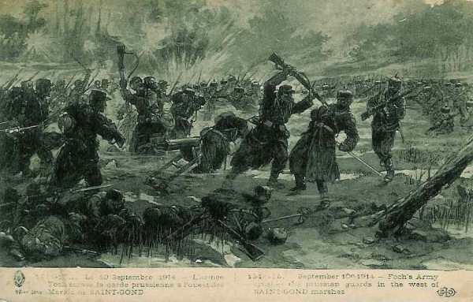
_Combats des marais de Saint-Gond_
_Collection privée_

**6h :**

L’appui d’artillerie commence mais les Allemands ripostent avec acharnement. Le 151e réussit malgré tout à réoccuper le village mais les Allemands déclenchent une forte attaque contre le 162e d’infanterie qui tient Soizy, le sud du bois de Botrait et le bois de Saint-Gond. Le régiment doit abandonner Soizy et se replier jusqu’à hauteur de la route de Montgivroux.

La 42e division est dans une situation critique : la gauche a repris place à hauteur du 10e C.A. (Ve armée) mais la droite s’infléchit sous la poussée allemande. Elle risque de perdre la liaison avec la division du Maroc qui se trouve vers Oyes et la crête du Poirier. Le 94e doit également reculer.

Toutes les unités sont en ligne et les pertes sont élevées. La matinée est marquée par des mouvements de flux et de reflux. Le 10e C.A. va toutefois pouvoir apporter une aide car entre midi et 14h, selon les unités, les Allemands reculent. Le 10e C.A. entame immédiatement sa poursuite, la 20e division marchant vers Boissy-le-Repos et suivie par la 51e division de réserve. Tandis que la gauche de la 20e division atteint les lisières du Bout-du-Val, la 51e division de réserve met une partie de son artillerie en batterie vers la ferme des Epées pour agir en avant de la ferme Chapton et attaque ensuite le bois de la Branle.

Une vaste poche s’est créée dans la dispositif de la 42e division : le 151e tient toujours à La Villeneuve, le 94e à sa droite s’est infléchi vers le sud-est et s’est relié au 16e chasseurs et au 162e.

Le 8e bataillon de chasseurs est reporté vers la lisière nord du bois de Mondement pour arrêter une tentative allemande qui menace de séparer la 42e division de la division du Maroc.

Au centre, ce sont le 94e, 162e et 233e qui, par des contre-attaques répétées, refoulent les Allemands dans le bois de la Branle, puis au-delà de la route de Soizy - Charleville. Le village de Soizy est pris et repris plusieurs fois mais reste dans les mains allemandes.

Si les Français avaient lâché Chapton ou La Villeneuve, la rupture entre la Ve et la IXe armée aurait été réalisée, un désastre pour l’armée française.

**9e C.A.**

La mission du C.A. pour le 7 est pour commencer nettement défensive.
L’ordre du général Dubois pour le 7 stipule :

- La 52e division de réserve maintiendra son front fortifié et renforcé, son artillerie sur le Mont-Août, battant les débouchés des marais au nord de Broussy-le-Grand et de Bannes.

- La division du Maroc maintiendra le front Mesnil - Broussy - Oyes, tout en aidant la 52e division vers Saint-Prix. Son artillerie divisionnaire, ainsi que l’artillerie de C.A. battront les débouchés des marais par Joches et Villevenard.

- La 17e division tiendra le front Broussy-le-Grand - Champ-de-Bataille. Son artillerie battra les débouchés de Bannes et d’Aulnay.

Le général Dubois organise deux secteurs de 7 km : à droite, la 17e division, à gauche la division du Maroc, fort réduite.

La droite est occupée par la brigade Blondlat, le centre par deux bataillons du régiment Fellert et deux du régiment Cros, à droite trois bataillons des régiments Cros et Fellert qui doivent coopérer à l’action de la 42e division.

Dès le matin, les Allemands attaquent le bois de Saint-Gond et Oyes. Le général Humbert appelle à l’aide et le commandant du C.A. lui envoie un des groupes d’artillerie de la 52e division et d’un bataillon de cette même division. Le sort de la bataille est lié à la conservation de la crête Mondement - Allemant.

**14h45 :**

Foch prépare une attaque pour diminuer la pression allemande :
Les succès remportés par les Ve et VIe armées se confirment. Les Allemands sont en pleine retraite, sauf devant la 42e division et la division du Maroc, où ils résistent encore, probablement pour éviter l’enveloppement.

La 42e division a déjà repris l’offensive, sa droite ayant comme direction générale Montgivroux - Bois de Saint-Gond -bois de Botrait.

La division du Maroc entamera également l’attaque dès que le 77e sera en mesure d’y participer. Dès maintenant, l’artillerie préparera l’opération en canonnant les positions ennemies dans la partie est des bois de Saint-Gond, Oyes, crête du Poirier.

Le 77e s’acheminera par les bois au sud ouest du château de Mondement, dans la dépression de Montgivroux C’est de cet emplacement qu’il partira pour pousser une offensive méthodique sur Saint-Prix.

Vu la chaleur et la fatigue des hommes, le régiment ne parvient à son emplacement que vers 17h. Il est trop tard pour que l’attaque puisse avoir lieu dans la soirée. Humbert surseoit à l’attaque.

Dès 3h30, l’artillerie exécutera la préparation d’attaque intensive sur Oyes, la crête du Poirier, Saint-Prix, Bois de Botrait. Le feu durera trente minutes. En cas de résistance, l’infanterie devra s’arrêter et une nouvelle préparation d’artillerie devra avoir lieu.

**11e C.A.**

Les ordres pour la journée sont de poursuivre l’attaque et de continuer à appuyer les progrès de la Ve armée :

- La 21e division s’efforcera de reprendre Morains-le-Petit, Ecury et Normée.

- La 22e division appuiera l’attaque de la 21e sur Normée et tiendra solidement Lenharrée.

- La 60e D.R. portera son gros à Montepreux et se tiendra prête à fournir des détachements sur la Somme à Lenharrée, Vassimont et Haussimont.

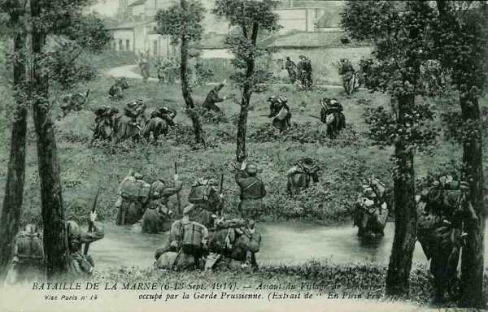
_Attaque de Lenharrée_
_Collection privée_

**5h :**

Le combat reprend sur tout le front. Les Allemands continuent à attaquer mais sont arrêtés par une résistance énergique. Lenharrée est fortement attaqué mais le 19e s’y maintient non sans de fortes pertes. Les tirs de 75 ont permis d’arrêter net les assauts allemands et à aucun moment, ces derniers ne peuvent pénétrer dans le village.

Plus à l’est, la 9e D.C. a cherché à pousser sur Soudé-Sainte-Croix et sur Vatry. Les Allemands s’emparent de Sommesous mais en sont délogés par la suite.

En fin de journée, Eydoux donne l’ordre de stationnement :
Les C.A. d’infanterie bivouaqueront sur les emplacements occupés en fin de journée, couverts par des avant-postes de combat retranchés.

**Dans le camp allemand**

**IIe armée**

Von Bülow donne ses ordres pour le 7 : la IIe armée doit reprendre l’attaque dès l’aube et la IIIe armée est invitée à agir contre le flanc droit français. A la droite de l’armée, les 3e et 9e C.A. sont ramenés de la région de Sancy et d’Esternay vers le Petit Morin, en aval de Montmirail. Von Bülow ordonne au 7e C.A de fermer la brèche à l’ouest du 11e C.A.R. L’aile gauche poursuit son offensive avec l’aide des forces de la IIIe armée.

La IIe armée continuera à attaquer au lever du jour par son aile gauche.

**10e C.A.**

Le général von Emmich engagera son C.A. sur le plateau de Brie en espèrant atteindre Sézanne. Les 73e et 78e (19e division) s’empareront des hauteurs au sud de Villeneuve. Pendant toute la journée, ces régiments seront soumis à une telle canonnade qu’ils resteront pratiquement inactifs.

La 20e division doit aussi se lancer à l’attaque vers 7h mais une nouvelle instruction de l’armée arrête toute progression : la 19e division se maintient à La Villeneuve et la 20e ne peut pas dépasser Mondement avec son aile gauche. La résistance française est opiniâtre, particulièrement devant Soizy et Mondement.

Vers 20h parvient l’ordre de l’armée de se replier derrière le Petit Morin. Von Emmich proteste contre cette décision mais n’obtient pas gain de cause. Il est obligé d’ordonner le mouvement vers la rive nord du Petit Morin. La 19e division se replie sur Le Thoult - Saint-Prix, la 20e sur la ligne des hauteurs de Villevenard et Courjeonnet.

Von Plettenberg décide de faire appuyer tout son C.A. vers l’est pour attaquer au-delà des marais : la 1e division de la Garde doit prendre la place de la 4e brigade de la Garde. L’axe d’attaque du C.A. sera Ecury - la ferme Hozet - Linthes.

- Les mouvements se sont effectués dans la nuit du 6 au 7.
    La 1e division vient au nord-est de la route Morains-le-Petit - Ecury-le-Repos.
    Le 2e régiment vient à l’ouest d’Ecury.
    Le 1e arrive à minuit à Pierre-Morains.
    Le 4e régiment atteint également Pierre-Morains.
  L’artillerie prend position au cours de la nuit de part et d’autre de la route Bergères - Morains-le-Petit et le long de la voie ferrée de Bergères à Fère-Champenoise.

La ligne Morains-le-Petit - Normée doit être franchie à 6h. Les régiments de la 1e division cherchent à progresser : le 1e régiment de la Garde à pied pénètre dans le bois au sud de la route de Morains-le-Petit à Ecury ; le 2e régiment partant d’Ecury-le-repos avance lentement dans la plaine découverte mais est pris à partie par un violent feu de mousqueterie ; le 4e régiment de Garde à pied subit de lourdes pertes.

La 2e division de la Garde doit franchir la ligne Ecury - Normée à 8h. La 3e brigade est chargée de l’attaque principale.

Les troupes n’ont eu aucun repos pendant la nuit.
Le régiment Elisabeth s’empare de Normée et des passages sur la Somme. Cependant, la 63e brigade recule et entraîne une partie du régiment Elisabeth dans les bois aux alentours de Lenharrée. Deux bataillons du régiment Augusta sont engagés sous un feu violent de shrapnells.
A la nuit, la division s’installe sur ses positions de départ sur la rive nord de la Somme.

Le C.A. de la Garde n’a pas progressé et ses pertes ont été importantes.

**IIIe armée**

Dans la matinée, des comptes rendus d’aviateurs signalent de la cavalerie sur la route Arcis - Sommesous, se dirigeant vers Vatry. De gros rassemblements sont également repérés vers Fère-Champenoise, Oeuvy, Gourgançon d’une part, et vers Vitry-le-François d’autre part. Entre ces deux groupes, il y a une division de cavalerie.

**6h :**

Une attaque de la 22e division française a lieu devant Lenharrée mais elle est repoussée. L’attaque empêche la 32e division allemande (IIIe armée) de faciliter le débouché de la Garde au-delà de la vallée de la Somme.

**7h :**

La 23e division de réserve allemande reçoit pour mission d’occuper les hauteurs au nord de Sommesous, en vue de flanquer la gauche allemande sur la Somme. Elle progresse sous le feu à travers les boquetaux jusqu’à la Somme.

**11h :**

Le 100e régiment de grenadiers entre en ligne à gauche de la 64e brigade. La situation est difficile ; les Saxons ne progressent pas, les tirs de l’artillerie française empêchent toute avance.

**Le soir :**

Les deux divisions saxonnes bivouaquent sur leurs positions sans avoir franchi la Somme.

Les armées opposées à celle de Foch sont dans un piètre état : les pertes ont été importantes et les troupes sont fatiguées par la marche ininterrompue depuis le 20 août et les combats qu’elles ont dû livrer. C’est l’artillerie française qui a causé le plus de ravages.

La situation stratégique dans ce secteur est défavorable : une brèche a été créé dans le dispositif de la IIe armée : le 11e C.A. a glissé vers l’ouest afin de déborder les marais de Saint-Gond et la Garde a appuyé vers l’est. La rive nord des marais n’est plus occupée sauf par quelques escadrons et compagnies. Ni le 10e C.A. ni la Garde ne disposent de renforts pour tenir la rive nord des marais. Von Emmich et von Plettenberg s’en rendent compte.

La 14e division, qui se trouvait le matin à Fromentières, dans l’après-midi à Artonges doit effectuer un nouveau déplacement dans la nuit du 7 au 8 vers Champaubert, où elle arrive à 4h du matin.

Von Hausen considère que seule une attaque vigoureuse de l’aile gauche de la IIe armée, de l’aile droite de la IVe armée et de la IIIe armée permettrait d’attaquer le point faible du dispositif français. Pour provoquer la surprise et éviter les tirs de l’artillerie française, von Hausen envisage une attaque de nuit à la baïonnette. L’assaut serait poussé jusqu’aux positions des batteries. Le duc de Wurtemberg et von Bülow marquent leur accord.

**17h :**

von Hausen envoie son ordre en vue de l’attaque au petit jour. L’idée de cet assaut est diversement appréciée : un assaut sans bruit, dans l’obscurité, sans préparations d’artillerie semble bien difficile aux commandants de division. Au contraire, les fantassins sont soulagés d’éviter les tirs de l’artillerie française. L’heure de l’attaque est fixée à 3h30 pour la 1e division de la Garde et à 3h pour le groupement von Kirchbach.

- La 1e division de la Garde doit attaquer entre Morains-le-Petit et Ecury-le-Repos.

- La 2e division de la Garde se dirigera entre Normée et Connantray.

- La 32e division attaque de Lenharrée à Haussimont.

- La 23e division de réserve se déploie entre Haussimont et Sommesous.

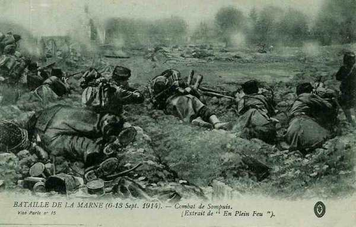
_Combat de Sompuis_
_Collection privée_

### 8 septembre

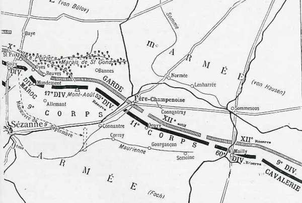
_Situation des armées le 8 septembre_
_c Michelin, d’après guide édition 1917, autorisation 06-B-05_

**Dans le camp allemand**

**Garde prussienne**

L’ordre d’attaque de la Garde parvient à la 1e division vers 1h15. Elle doit être en position sur la route d’Ecury-le-Repos - Morains-le-Petit pour 3h15. A 3h30, les régiments de la Garde à pied se précipitent en avant.
Trois régiments sont en ligne, de l’ouest vers l’est, les 1e, 2e et 4e régiments de la Garde à pied.

Les Français sont surpris par l’impétuosité de l’attaque ; une partie des hommes dorment et ne sont pas équipés. Les Allemands parviennent jusqu’aux positions d’artillerie, où les canonniers sont surpris.

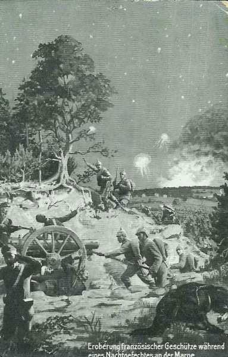
_Combats de nuit_
_Collection privée_

**5h30 :**

La voie ferrée de Fère-Champenoise à Vertus est dépassée.

**9h :**

Les régiments de la Garde atteignent la route de Bannes à Fère-Champenoise.

**12h :**

La 1e division est le long de la route de Bannes à Fère-Champenoise. Les hommes tombent de sommeil. Von Plettenberg ordonne une attaque combinée de tout le C.A., la 1e division à droite, au nord de la route Fère-Champenoise - Sézanne, la 2e division à gauche, attaquant sur Corroy et Pleurs. Les unités ne progressent plus. L’artillerie française tire sans interruption et interdit toute avance.

**Groupement von Kirchbach**

La 2e division doit franchir la ligne de la Somme à 3h, son aile droite doit marcher le long de la ligne Ecury-le-Repos - Fère-Champenoise, son aile gauche entre Normée et Connantray. Le premier objectif est la route Normée - Ecury-le-Repos. Sur certains points, les Français résistent avec acharnement, à d’autres endroits, ils sont complètement surpris.

**5h :**

La Somme est atteinte par des bataillons du régiment Königin Augusta, puis la division avance jusqu’à la voie ferrée Fère-Champenoise - Sommesous où elle est arrêtée par une énergique résistance d’infanterie.

La 32e division attaque à 3 heures sans bruit, fusils déchargés. Les bataillons saxons s’avancent en lignes denses de tirailleurs. Le point de direction de la division est Lenharrée. Les 102e, 103e, 177e et 178e régiments doivent s’emparer des hauteurs entre Vaurefroy et Montepreux. Les avant-postes français installés au nord de la Somme sont complètement surpris mais ils alertent les unités situées à l’arrière. De violents combats de corps à corps se livrent près de l’église de Lenharrée.

**5h30 :**

Lenharrée est aux mains des unités de la 32e division. Il leur a fallu deux heures pour progresser de 2 km.
Le 177e régiment s’empare de vingt canons, le 178e en prend huit.

**8h55 :**

von Planitz prescrit aux unités de se reformer au sud et sud-ouest de Lenharrée. L’artillerie lourde allemande, en batterie au nord de la Somme, prend sous son feu l’artillerie française aperçue vers Connantray.

La 23e division de réserve doit attaquer sur le front entre Vassimont et Sommesous, en vue d’atteindre Montepreux et les lisières ouest de Mailly.

Les éléments français de surveillance au nord de la Somme sont facilement culbutés et la rivière facilement franchie. Les hauteurs au sud de Sommesous sont prises.

**9h :**

La résistance française est brisée à l’aile droite. Les 101e et 102e régiments de réserve prennent Vassimont. Le 103e régiment de réserve attaque Sommesous. Le village est pris après un combat de rues où le régiment subit de lourdes pertes. Les Saxons poussent jusqu’aux lisières sud de la localité puis s’arrêtent épuisés.

L’artillerie française, tirant des hauteurs au sud-est de la Somme, cause des pertes sévères.
La 2e division s’empare de Fère-Champenoise mais les troupes sont incapables de continuer leur marche.

**11h45 :**

von Bülow, dont l’armée est en difficulté sur le Petit Morin, presse von Kirchbach de poursuivre son attaque vers Connantray.

**14h :**

Le groupement continue sa progression, mais plus lentement

Von Kirchbach voudrait repousser les Français vers le sud avant d’opérer une conversion vers le sud-ouest. Il ordonne à ses divisions d’atteindre la ligne Fère-Champenoise - sud de Connantray - La Motte. La 23e division de réserve doit attaquer vers l’ouest de Montépreux. Dans le courant de l’après-midi, la 32e division repousse les Français au-delà de Connantray.

La 23e division s’empare des hauteurs au sud de Sommesous et au nord-est de Montépreux mais est soumise à de violents tirs de batteries françaises. Son aile droite parvient à Montépreux et occupe le village. Les Français sont derrière la Maurienne et tous les espoirs sont permis, le lendemain, pour le camp allemand.

A la nuit, la division saxonne bivouaque dans les environs de Connantray et vers Oeuvy.

**10e C.A.**

Ce C.A. fait toujours face au 10e C.A. français et à la 42e division. Un ordre de von Bülow prescrit au 10e C.A. de se replier sur la rive nord du Petit Morin. La 19e division s’installe sur la ligne Le Thoult - Le Reclus - Talus, la 20e division prendra position depuis le moulin de Thoury jusqu’à Courjeonnet. Les deux divisions doivent se retrancher. Les Français ne viennent pas perturber ce repli.

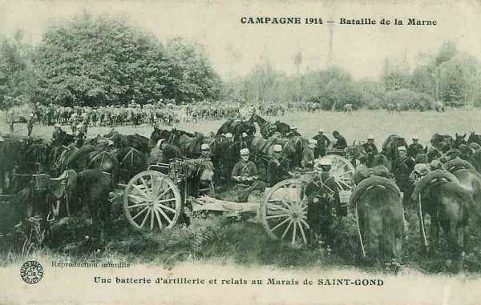
_Batteries françaises aux marais de Saint-Gond_
_Collection privée_

La 14e division, jusqu’à présent en réserve d’armée, fait mouvement vers Joches et Coizard de façon à pouvoir intervenir contre la ligne Mesnil-Broussy - Bannes.

Dès qu’il apprend le succès de l’attaque de nuit du groupement von Kirchbach, von Emmich veut se joindre à l’attaque. A 8h30, il donne l’ordre à la 20e division d’attaquer sur le front Soizy - Mondement. Les troupes de

la 20e division ne comprennent pas la nécessité de reprendre l’offensive alors qu’elles ont la veille au soir abandonné le terrain. Cependant, l’offensive reprend et arrête la 42e division française.

**Les ordres du général Foch**

La situation de la IXe armée n’est guère brillante :
La gauche a enrayé les progrès allemands, le centre a maintenu ses positions mais la droite (11e C.A.) a fléchi sous l’effet de l’attaque de nuit : les 21e, 22e, 52e et 18e divisions tentent de se rallier six à huit kilomètres au sud de leur position de nuit.

La liaison avec la IVe armée paraît compromise et pourtant, les ordres pour le 8 sont offensifs. En effet, Foch sait que les Allemands reculent devant les armées de gauche. Il perçoit déjà un ralentissement de la pression devant la gauche de sa propre armée.

Il donne au 11e C.A. un ordre nettement offensif :
« Occuper Fère-Champenoise, établir la liaison avec le 9e C.A. dans les bois de Fère-Champenoise et contre-attaquer éventuellement vers Morains-le-Petit ».

Vu la situation, Foch doit faire appel à ses voisins : il téléphone à Langle de Cary (IVe armée) à 7h :
« A droite de la IXe armée, le 11e C.A. attaqué par des forces supérieures, a été obligé d’abandonner la ligne de la Somme de Morains-le-Petit à Lenharrée ; il se replie vers Fère-Champenoise et va employer sa dernière réserve pour exécuter une contre-attaque sur Morains-le-Petit. »

Malheureusement pour Foch, le 21e C.A. (IVe armée) est dans une situation difficile et ne peut intervenir.

A 7h30, il téléphone à Franchet d’ Esperey :
« Il est demandé à la Ve armée de reprendre, si cela lui est possible, en liaison avec la 42e division et avec la gauche du 9e C.A.,l’offensive contre le plateau ouest de Champaubert en vue de dégager la droite de la IXe. »

Franchet d’Esperey répond aussitôt
« Le 10e C.A. devra progresser vers le nord et s’infléchir vers le nord-est de façon à appuyer de la manière la plus vigoureuse l’action de la 42e division. »

Foch avise la 42e division en l’invitant à poursuivre ses attaques en liaison avec ses voisins.

Tranquille sur sa gauche, Foch se retourne vers la droite : la 9e D.A. a dû abandonner Sommesous. De ce fait, la direction de Montépreux est découverte, donnant ainsi la possibilité de tourner le 11e C.A.

Il prescrit au 11e C.A. de barrer cette direction et à la 9e D.C. de manoeuvrer sur la route Sommesous - Mailly pour agir vers Montépreux.

Il émet le soir son bulletin de renseignements :
« Les armées allemandes, qui font face à la IXe armée, ont prononcé depuis hier une vigoureuse offensive, dont le but évident est de couvrir la retraite de la Ie armée et d’une partie de la IIe.

« A la gauche de la IXe armée, la 42e division, en liaison avec la 10e C.A., a repoussé l’ennemi au nord des marais de Saint-Gond. Saint-Prix, à l’ouest des marais, a été enlevé et occupé par nos troupes. Le 9e C.A. a trouvé en face de lui une partie de la IIe armée et une partie de la IIIe.

« Le 11e C.A. a dû soutenir, dans la journée du 8, l’attaque de la Garde prussienne et de renforts saxons. Il s’est replié en combattant au sud de la Maurienne (ligne Corroy - Gourgançon - Semoine), en liaison à sa gauche avec la 52e division de réserve, qui, dans l’après-midi, a prononcé une contre-attaque d’ouest en est, dans la direction de Fère-Champenoise, tandis que le 11e C.A. réoccupait les hauteurs au nord d’Oeuvy.

« A la droite du 11e C.A., la 9e D.C. se lie, dans la région de Mailly, aux premiers éléments du 21e C.A. (IVe armée), qui a attaqué, dans l’après-midi du 8, dans la région de Sompuis, tandis que le reste de la IVe armée marchait du sud au nord dans la direction de Vitry-le-François, et que la IIIe armée s’avançait d’est en ouest dans la direction de Châlons-sur-Marne. »

« C’est donc la IXe armée qui a eu à supporter le choc principal, à sa gauche dans la journée du 7, à sa droite dans la journée du 8, l’attaque étant menée par des renforts comprenant la Garde et des éléments saxons. »

L’on retient de Foch cette phrase légendaire : « Ma droite est enfoncée, ma gauche cède ; tout va bien : j’attaque ! ».

**21h20 :**

Foch appelle Franchet d’Esperey au téléphone. Il lui explique la situation de la IXe armée, la gravité de l’attaque subie dans la matinée et l’impossibilité de compter sur l’intervention du 21e C.A. à la droite. Il conclut en demandant à la Ve armée de libérer la 42e division, en prenant à son compte la mission de celle-ci : couvrir la droite du 10e C.A. et progresser avec lui.

Il demande donc une extension du front de la Ve armée. Franchet d’Esperey met le 10e C.A. à la disposition de Foch. C’est un des rares exemples, dans l’histoire militaire, d’un chef se démunissant en pleine bataille d’une partie de ses forces.

**11e C.A.**

Le C.A. mène un combat défensif depuis trois jours. Certains combattants n’ont pas reçu d’eau depuis 48 heures !
Vers 9h, la ligne sur laquelle les généraux essaient d’enrayer le repli et de regrouper les unités passe par la lisière sud de Fère-Champenoise - croupe sud de Connantray - chemin de Connantray à Montépreux. Ce regroupement va être facilité par l’arrivée de régiments de réserve intacts : le 290e derrière la 21e division et le 268e derrière la 22e.

La 21e division a perdu un de ses brigadiers, trois de ses chefs de corps, la moitié de son artillerie.
A la 18e division, une des brigades a été anéantie, le 66e régiment ayant perdu 24 officiers et 1.284 hommes.

Vis-à-vis de Fère-Champenoise, la 21e division recule. Le général Eydoux donne ordre à la 18e division de tenir les hauteurs sud-ouest de Connantray et de tenter une contre-attaque vers le nord-ouest (La fontaine-d’Ivoire).
Il dispose comme réserve de deux régiments venus de Lorraine : le 268e et le 290e.

Le front défensif à tenir à tout prix, le long de la Maurienne, est la crête sud de Gourgançon, de Corroy à Semoine, la 21e division à gauche, la 18e au centre et la 22e à droite. Le 290e constituera un point d’appui avancé, au moulin de Connantre.

La 52e division (9e C.A.) doit prononcer une attaque partant des fermes Sainte-Sophie et Morin vers le nord de Fère-Champenoise. Quand la contre-attaque se produira, les troupes placées au point d’appui du moulin de Connantre l’appuieront. De l’artillerie se portera sur les hauteurs de Corroy et sur celles du moulin de Connantre.

- Trois attaques seront dirigées vers Fère-Champenoise :
    Par la 18e division, débouchant de la crête du moulin de Gourgançon vers Connantray

- Par un détachement partant des hauteurs du moulin de Connantre (290e), s’étendant sur la croupe au nord d’Oeuvy et marchant vers Fère.

- Par la 52e division, partant des fermes Sainte-Sophie et Morin pour se diriger vers le nord de Fère.
  42e division et 10e C.A.

Le 10e C.A. (Ve armée), qui doit agir en faveur de la 42e division, ne progresse guère au cours de la journée.
Le général Grossetti donne ses ordres pour la journée :
« L’ennemi ne répond pas au canon de la division marocaine. Il est à présumer qu’il est en retraite et il est nécessaire que la 42e division réaffirme son succès en se portant en avant. »

- En conséquence :

  Le 8e bataillon et la 10e chasseurs se porteront par l’est, des bois de Saint-Gond sur Saint-Prix ; le 10e chasseurs poursuivra ensuite en direction de Baye et de Champaubert.

- Le 162e se portera sur Soizy-aux-Bois et portera ensuite un bataillon sur Saint-Prix.

- Le 151e se portera sur les Culots.

- L’artillerie portera 6 batteries sur la crête à l’ouest de Mondement-Montgivroux pour appuyer le mouvement.

**7h :**

Le 151e sort de La Villeneuve et marche sur les Culots mais, en arrivant devant ce village, se heurte à une forte résistance organisée sur les deux rives du Petit Morin. Le 162e réoccupe sans combat le village de Soizy

**9h :**

Le 10e chasseurs reçoit l’ordre d’aller par la ferme Montalard reprendre le contact. Le régiment débouche par Montgivroux, puis se porte au sud-ouest d’Oyes. Comme il a été aperçu, des obus de gros calibre s’abattent sur lui. On a l’impression que les Allemands sont encore sur la rive sud du Petit Morin.

Les Allemands organisent les pentes nord de la vallée du Petit Morin, aux hameaux de Talus et de Voizy. Toutes les tentatives de franchir la vallée sont vaines.

**Dans la matinée :**

Les Allemands contre-attaquent ; ils reprennent Saint-Prix ; sur la crête du Poirier, on aperçoit l’infanterie allemande progressant par bonds. Une batterie française ouvre immédiatement le feu.

**16h :**

Le général Grossetti ne peut obtenir un appui d’artillerie de la division du Maroc ; il doit se résigner à autoriser le repli de sa droite.

Après avoir occupé la crête du Poirier, les troupes allemandes s’infiltrent dans les bois des Grandes-Garennes, mais ne réussissent pas à atteindre la lisière sud du bois. Le 19e bataillon de chasseurs contre-attaque sur la croupe du Poirier mais est obligé de s’arrêter devant les trous de tirailleurs creusés par les Hanovriens. Les Français se reforment à l’abri le long de la route de Soizy à Oyes.

**En soirée :**

Les Français occupent Corfélix et Les Culots, Montgivroux. Les Allemands occupent la rive nord du Petit Morin.

La 42e division a perdu 1.250 hommes mais elle a gardé la liaison avec le 10e C.A. et la division marocaine.
9e C.A.

**4h :**

La préparation d’artillerie commence.

**6h :**

Les troupes commandées par le colonel Eon atteignent presque la route d’Oyes à Soizy. Elles poursuivent vers la crête du Poirier et sur Saint-Prix. L’infanterie l’atteint et l’artillerie reçoit l’ordre de gagner la crête, mais il faut s’arrêter car un compte rendu signale que de grands rassemblements allemands se forment vers Courjeonnet. De nouvelles décisions s’imposent pour poursuivre l’attaque, notamment organiser une attaque concordante de la 42e division et de la division du Maroc.

D’autres problèmes plus urgents se présentent : le recul du 11e C.A. suite à l’attaque de nuit menace la droite du 9e C.A. Le premier réflexe serait d’établir un crochet défensif. Comme Foch a donné à 10h45 des ordres pressants de porter vers la droite toutes ses forces disponibles, le général Dubois donne de nouvelles instructions.

- Au général Blondlat : tenir le front le Ménil-Broussy - Broussy-le-Petit.

- Au lieutenant-colonel Fellert : tenir le front Reuves - Oyes avec son régiment.

- Au lieutenant-colonel Cros : tenir la position du Poirier en se retranchant avec les troues de la division du Maroc.

- Au 77e : rallier Saint-Loup

L’attaque par le 9e C.A. allemand, pressentie depuis la matinée, se produit vers 14h. L’infanterie allemande franchit les marais vers Bannes, la Verrerie et la ferme Saint-Gond. Le général Blondlat est obligé d’ordonner l’évacuation de Broussy-le-Petit, Ménil-Broussy et Broussy-le-Grand et de gagner la crête d’Allemant.

Le général Humbert donne les ordres pour constituer une ligne de résistance :
« Les troupes aux ordres du général Blondlat, écrasées par un feu d’artillerie qui a duré toute la journée, se sont repliées en bon ordre dans la direction générale d’Allemant. »

« La division du Maroc reconstituera, sur le front : croupe du Poirier - Mondement - pointe est du bois, situé à 1 km de Reuves, le barrage qu’elle a la mission impérieuse d’imposer à l’ennemi. »

C’est l’entrée en ligne d’une division allemande, la 14e division, qui a mis le général Humbert en si mauvaise posture.

### 9 septembre

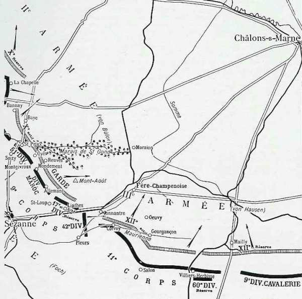
_Situation des armées le 9 septembre_
_c Michelin, d’après guide édition 1917, autorisation 06-B-05_

**La manoeuvre de Foch**

L’ordre déclenchant la manoeuvre est le suivant :
« La IXe armée étant fortement engagée par sa droite vers Sommesous et le 10e C.A. étant mis sous nos ordres, les dispositions suivantes seront prises, le 9 septembre, à la première heure : »

« Le 10e C.A. relèvera, dès 5h, la 42e division dans ses attaques contre le front Bannay - Baye, en particulier sur la route de Soizy-aux-Bois à Baye, où il se liera à la division du Maroc, qui tient les bois de Saint-Gond, Montgivroux et Mondement. Il aura, en tout cas, à interdire à l’ennemi, d’une façon indiscutable, le plateau de La Villeneuve-les-Charleville, Montgivroux ainsi que ses abords nord. »

« La 42e division, à mesure qu’elle sera relevée de ses emplacements par le 10e C.A., viendra se reformer par Broyes, Saint-Loup en réserve d’armée, de Linthes à Pleurs, en prévenant de son mouvement la division du Maroc. »

Foch conçoit donc un mouvement de rocade de la 42e division derrière son front en vue de la faire participer, dans le courant de la journée, à une attaque sur Fère-Champenoise. »

**9e C.A.**

Dès le matin, une violente canonnade retentit sur la crête Mondement - Allemant. Les régiments qui ont atteint la route de Bannes à Fère-Champenoise sont violemment contre-attaqués et sont rejetés. Le mouvement se fait difficilement à travers bois, sous un feu violent d’artillerie. Le général Dubois s’efforce d’arrêter le repli sur la ligne du Mont-Août - ferme Sainte-Sophie - débouchés sud de Connantre.

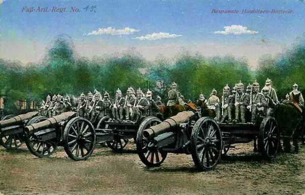
_Obusiers de campagne_
_Collection privée_

Cette dernière localité est bombardée violemment ainsi que le piton du Mont-Août, que les Allemands considèrent comme la clé de la position française. Le général Dubois est démuni de réserves

**11h15 :**

Dubois peut rendre compte à Foch que les liaisons entre les différentes unités sont rétablies.

**12h :**

La violence des attaques allemandes redouble, ce qui provoque un mouvement de repli jusque sur le front Chalmont - Linthes - route de Linthes à Pleurs. Le Mont Août tombe aux mains des Allemands. Le repli est finalement arrêté. La pression Allemande s’est relâchée. Les unités qui sont face à l’est entre Chalmont et Linthes peuvent conserver leurs positions. Cette ligne doit servir de base de départ pour la contre-attaque puissante que Foch veut lancer sur Fère-Champenoise, notamment au moyen de la 42e division.

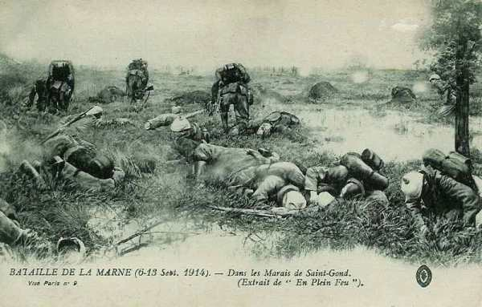
_Marais de Saint-Gond_
_Collection privée_

- **11e C.A.**

Voici l’ordre de stationnement dans la nuit du 8 au 9 :
  21e division : Corroy, La Colombière.
  18e division : Gourgançon, Oeuvy.
  22e division : Semoine.
  60e division : Semoine.

Les batteries devront ouvrir le feu vers 4h.

**10e C.A.**

Franchet d’Esperey a orienté dès le 8 au soir toutes les unités du 10e C.A. vers le nord-est. Le C.A. doit être prêt à aller sur Damery ou sur Etoges. Defforges doit relever la 42e division, se relier à la division marocaine et interdire le plateau de La Villeneuve à Montgivroux.

La 20e division cherche à progresser dès le matin, mais elle prise à partie par des feux très violents et subit de fortes pertes. Les éléments qui sont dans la vallée du Petit Morin, au Thoult et à Corfélix sont peu exposés, mais ceux qui sont sur le plateau reçoivent de nombreux obus.

**8h :**

Un renseignement fait connaître que la division marocaine est attaquée vers Mondement et Montgivroux. Les 208 et 310e régiments d’infanterie reçoivent l’ordre d’attaquer vers Montgivroux.

**10h25 :**

Foch insiste sur l’aide que le 10e C.A. doit apporter à l’aile gauche de la IXe armée, pour soulager la division marocaine et empêcher un débordement allemand à l’ouest des marais de Saint-Gond.

**11h :**

La division marocaine peut rétablir son front et tenter de reprendre la château de Mondement. La 20e division a franchi le Petit Morin. Le 2e régiment se rabat sur Bannay et le 47e débouche du Thoult en gravissant les pentes nord de la vallée.

**16h :**

Foch oriente le 10e C.A. vers l’est pour soulager davantage la division marocaine.

**20h :**

La 40e brigade progresse et atteint Belin, dépasse les bois de Bannay et atteint cette localité ; la 39e brigade est maintenue à Corfélix et aux Culots. La 101e brigade va attaquer Les Forges et Le Reclus ; le 273e R.I. va marcher de Soizy-aux-Bois vers Saint-Prix. Les Allemands doivent reculer devant cette attaque.

**Division marocaine**

C’est cette division qui va avoir l’action la plus célèbre de la journée : la reprise du château de Mondement.

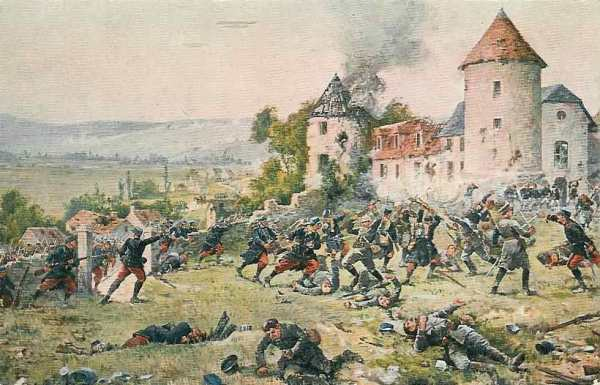
_Les Français s’emparent du château de Mondement_
_Collection privée_

**5h :**

Les Allemands (164e R.I.) attaquent dans la région de Mondement et rapidement s’emparent du château et du village. Les onze bataillons de la division marocaine sont en effet à effectifs réduits et sont répartis sur un front de 6 km. Le général Blondlat fait mettre une section d’artillerie en position vers la lisière nord-ouest du bois d’Allemant pour tirer sur le château mais fait bientôt cesser le feu, craignant de tirer sur des troupes françaises.

**6h :**

Le général Humbert demande du secours. Vu l’importance de la position stratégique, le général Grossetti prête deux bataillons de chasseurs et le général Dubois lui confie le 77e R.I.

**8h30 :**

Ordre est donné de se porter à Mondement.

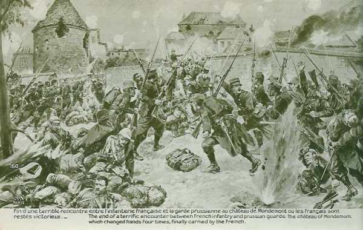
_Attaque du château de Mondement_
_Collection privée_

**8h45 :**

Le colonel Lestoquoi reçoit l’ordre du colonel Eon de se mettre le plus rapidement possible à la disposition du général Humbert avec deux bataillons pour contre-attaquer vers Reuves et Broyes.

**10h10 :**

Humbert donne l’ordre à Lestoquoi de porter un bataillon vers la lisière nord des bois de Mondement.

**11h :**

Lestoquoi dirige le 1e bataillon sur la lisière nord des bois de Mondement.

**12h30 :**

Le commandant de Beaufort réunit ses officiers et les avise que l’artillerie tirera sur Mondement jusqu’à 13h45 et que l’attaque se déclenchera alors. Les résultats des tirs d’artillerie sont inefficaces.

**13h45 :**

Le commandant de Beaufort fait allonger le tir de l’artillerie et porte son bataillon à l’attaque avec deux compagnies de zouaves. Le colonel Lestoquoi, constatant l’attaque, fait appuyer le mouvement par cinq compagnies. L’organisation défensive du château est puissante et les résultats de l’artillerie faibles.

Au cours de sa reconnaissance, le colonel Lestoquoi a demandé à l’artillerie d’amener une pièce à l’est, dans l’allée qui aboutit à la grille du château.

Le commandant de Beaufort attaque et le colonel Lestoquoi pousse en avant cinq compagnies. Les Allemands laissent les Français avancer, puis ouvrent un feu violent. En quelques minutes, deux bataillons son décimés et le commandant de Beaufort tué. Les soldats se replient. Le colonel Eon rallie le 2e bataillon à 1500m au sud du château, tandis que le colonel Lestoquoi arrête le recul des autres bataillons à la lisière nord-est des bois de Mondement. On se prépare à recommencer l’assaut.

Le colonel Lestoquoi décide de faire amener une pièce à bras dans l’allée du château, à 400m de la grille. Le colonel Eon a également demandé deux pièces de la division marocaine, pour les faire agir sur les murs sud du potager et du parc. Ces deux canons son amenés par la route de Broyes. Ils ouvrent le feu et créent cinq brèches dans les murs entourant les dépendances du château. La grange se met à flamber. La fusillade dure de deux à trois minutes puis l’infanterie s’ébranle.

**18h30 :**

Le château est abandonné par les Allemands. Les Français s’en emparent sans aucune perte. Une mitrailleuse de la division marocaine inflige des pertes sévères aux Allemands (164e R.I.) en retraite.

**19h :**

Le colonel Lestoquoi envoie un compte rendu au général Humbert : « Je tiens le village de Mondement. Je m’y installe pour la nuit. »

**42e division**

La division doit faire mouvement vers l’aile droite de la IXe armée, relevée par le 10e C.A. (Ve armée).

**13h :**

La division est rassemblée vers le carrefour est de Lachy puis fait mouvement vers Broyes, Péas, Linthes : elle précédée du 10e chasseurs à cheval.

**La contre-attaque**

Foch compte reprendre l’offensive au moyen de la 42e division par Connantre et Oeuvy. L’engagement de cette unité ne sera possible qu’à partir de la fin de l’après-midi.

La 42e division reçoit ses ordres : attaquer en partant de Pleurs, Linthes, flanquée au nord par le 9e C.A. qui attaquera l’éperon au sud d’Oeuvy.

- Le 9e C.A. (Dubois) reçoit comme objectif Fère-Champenoise puis le front de Morains-le-Petit - Normée.

- Connantre - Connantray puis le front de Normée - Lenharrée.

- La 11e C.A. (Eydoux) devra atteindre le front Lenharrée - Haussimont.

L’attaque devra partir à 17h15. C’est une vaste contre-attaque menée sur Fère-Champenoise au moyen de sept divisions.

Dans la réalité, la 42e division n’arrive pas avant la nuit sur le front de départ qui lui a été assigné. Elle bivouaque de part et d’autre de la route de Linthes à Pleurs.

L’attaque du 11e C.A. (Eydoux) dépend de l’entrée en ligne de la 42e division, il faut y surseoir.
Le 9e C.A. fait son possible pour arrêter l’avance allemande et doit remettre l’attaque à 18h. Ce n’est que tard dans la nuit que les régiments épuisés atteignent Sainte-Sophie et Connantre. A minuit, la brigade Simon est à la ferme Hozet, la 103e brigade à Sainte-Sophie. Les unités repartent à l’attaque vers 5h. Le 68e R.I. pénètre dans Morains-le-Petit. Dans la soirée du 9 septembre, la droite de von Hausen et l’armée de von Bülow sont en pleine retraite.

**Dans le camp allemand**

Von Bülow prescrit la continuation de l’attaque le 9 septembre dès 6h.
Il replie toutefois l’aile droite de l’armée et agrandit l’espace qui existe entre les Ie et IIe armées, mais prévoit la continuation de l’attaque dans la plaine champenoise, en liaison avec la IIIe armée. Le front de l’armée va se trouver orienté presque nord-sud, depuis Margny jusqu’à Fère-Champenoise.

**4h :**

La Ie division se trouve le long de la route Bannes - Oeuvy, prête à attaquer.

**7h :**

Le bataillon d’obusiers ouvre le feu sur le Mont Août ; la 2e division de la Garde attaque.

**8h :**

La division se porte à l’attaque. Malgré la forte préparation d’artillerie, elle ne peut avancer que lentement, en butte aux tirs nourris des batteries françaises.

Le premier régiment à pied de la Garde est commandé par le prince Eitel, fils de l’empereur.

**11h :**

Le premier bataillon du régiment du prince Eitel arrive devant la ferme Hozet, tandis que les fusiliers s’emparent du Mont Août. Les Français refluent mais leur artillerie fait rage. Les premiers régiments de la 1e division ne peuvent dépasser le Mont Août et la ferme Hozet ; le 3e régiment de la Garde à pied pénètre dans Connantre, le 2e s’arrête à la ferme Sainte Sophie. Les batteries allemandes sont amenées sur le Mont Août.

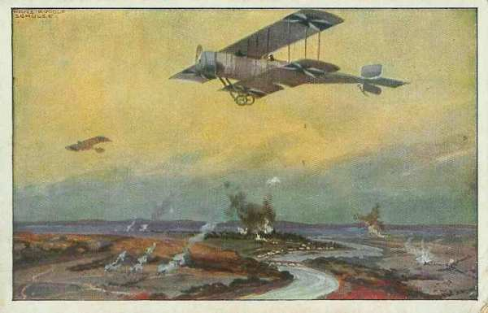
_Aviation allemande sur la Marne_
_Collection privée_

**12h :**

Le 3e régiment de grenadiers (2e division) s’empare des bois entre Corroy et Oeuvy et atteint la Maurienne.

**14h30 :**

Les Français se replient et la 2e division s’empare de la ferme Saint-Georges. Les grenadiers avancent jusqu’au moulin de Connantre et poussent des patrouilles jusque dans la Colombière.

**15h :**

Ce n’est qu’à 15h que Connantre et la ferme Hozet sont pris. Les pertes allemandes atteignent 1800 hommes.

L’attaque allemande est un succès. Les troupes aux ordres de von Plettenberg ont avancé et bousculé les unités françaises, mais les Allemands sont hors d’état de poursuivre une victoire locale si chèrement achetée.

- Von Hausen prévoit d’attaquer avec trois divisions :
    la 24e de réserve de Fère-Champenoise sur Connantre.
    La 32e vers Gourgançon.
    La 23e de réserve vers Semoine.

Suite à une mauvaise coordination, la 24e division reçoit le même terrain d’attaque qu’une partie de la 2e division de la Garde. Il en résulte une confusion dans la manoeuvre. La 24 division avance par la gare de Lenharrée mais le déploiement s’effectue sous un feu violent d’infanterie venant des bois au sud-est de Connantray.
Von Kirchbach prescrit à la 32e division d’attaquer les hauteurs au nord de la Maurienne.

**Dans la matinée :**

La 23e division de réserve repousse une attaque française débouchant de Mailly.

Si l’on regarde le front de la IXe armée, la victoire semble acquise aux Allemands et cependant, toute l’armée allemande va commencer son mouvement de retraite.

**10h45 : von Bülow prend la décision de se replier** :

Ll n’a pas de réserve et ne sait comment rétablir la situation à son aile droite. L’armée tiendra la ligne Damery - Tours - nord de la Marne. Le mouvement commencera par l’aile gauche.

Les officiers sont stupéfaits quand ils reçoivent l’ordre de repli. Ils ignorent que les alliés ont franchi la Marne dans la matinée à La Ferté-sous-Jouarre et à Château-Thierry. Il faut envisager le repli si l’on ne veut pas être séparé de la Ie armée qui se trouve toujours dans la région de l’Ourcq (voir la bataille des deux Morins).

Des ordres sont donnés pour refouler les bagages et les convois et l’on fait préparer des passerelles sur la Marne. Von Kirchbach et von Hausen décident de commencer la retraite à 16h30. En attendant, pour donner le change aux Français, les attaques se poursuivront

**11h :**

La 24e division de réserve pénètre dans Oeuvy, puis s’empare des hauteurs au nord-ouest de Gourgançon.

**12h :**

von Plettenberg donne l’ordre de repli à la Garde.

**13h :**

von Emmich (9e C.A.) envoie un ordre de retraite : la 19e division se repliant par Bannay et Baye sur Champaubert, la 20e par Saint-Prix et Villevenard sur Etoges.

**13h30 :**

Mailly est pris et les troupes allemandes victorieuses continuent à progresser vers le sud.

**14h :**

Arrivée au sud-est d’Oeuvy, la 64e brigade (24e div.) est soumise à un tir d’artillerie lourde. La 63e brigade avance à travers des boquetaux de pins mais est arrêtée à chaque instant par de petites fractions d’infanterie et ne parvient pas à atteindre la Maurienne.

**14h30 :**

La 20e division (9e C.A.) doit battre en retraite en laissant une forte arrière-garde sur la crête du Poirier. La 39e brigade livre encore des combats près de Mondement.

**16h :**

L’ordre de repli est transmis à la 2e division de la Garde, qui se trouve entre Connantre et Corroy. La division doit se replier vers Vertus.

**16h30 :**

Les colonnes allemandes entre Le Thoult et Sommesous sont en train de refluer vers le nord.

**17h :**

La 1e division d’infanterie de la Garde commence son mouvement vers le nord, sans que les français tentent de gêner l’opération. Les régiments marchent vers Bergères, croyant qu’ils sont appelés vers une autre partie du champ de bataille.

De fortes arrière-gardes sont laissées sur les hauteurs de Lenharrée - Haussimont et au nord de Sommesous.

**22h :**

La 20e division (9e C.A.) est rassemblée entre Champaubert et Etoges, ayant encore une arrière-garde sur la rive nord des marais, vers Congy.

**24h :**

La 19e division (9e C.A.) est reconstituée dans la région d’Etoges - Morangis - Morlins.

Toutes les unités allemandes abandonnent un terrain chèrement conquis le 8 septembre et le matin du 9. Les troupes françaises trouvent la voie libre devant elles.

### 10 septembre

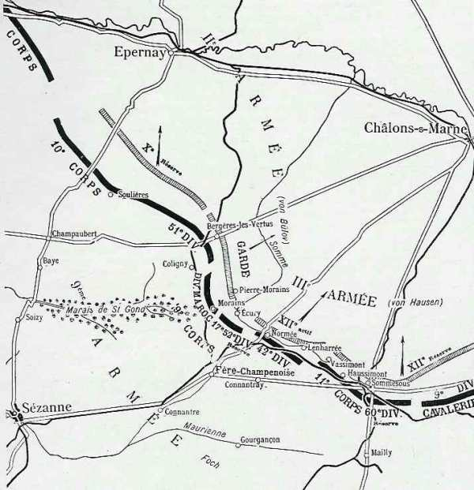
_Situation des armées le 10 septembre_
_c Michelin, d’après guide édition 1917, autorisation 06-B-05_

- **Les ordres de poursuite**

Foch prescrit une offensive générale sur toute la ligne « avec la dernière énergie ».
  Le 11e C.A. attaquera entre Sommesous et Lenharrée
  La 60e D.R. agira vers Mailly
  La 9e D.C. enverra des reconnaissances dès la pointe du jour vers Mailly.
  La 42e division poursuivra sa mission entre Normée et Lenharrée.
  La 9e C.A. agira de Normée à Morains-le-Petit au nord de la route de Fère-Champenoise à Normée.
  Le 10e C.A. attaquera en direction générale de Coligny et Bergères-les-Vertus par Etoges et Villevenard.

**12h30 :**

Foch prescrit de pousser les têtes de colonnes jusqu’à la Soude sur la ligne Vatry - Soudron - Germinon tandis que le 10e C.A. s’arrêtera à Bergères-les-Vertus et à Colligny. Toutefois, la fatigue des hommes est grande, les chevaux n’en peuvent plus et ces fronts ne peuvent être atteints.

**10e C.A.**

**3h45 :**

Le général Defforges a orienté ses deux divisions : la 20e division attaque dans la direction de Mont Aimé, tandis que la 51e D.R. marche sur Vert-la-Gravelle et Colligny. Les fractions de la 51e division n’éprouvent tout d’abord aucune difficulté, mais après Colligny, elles se heurtent à des arrière-gardes qu’elles bousculent en fin de journée.

**7h :**

La 20e division débouche des bois de Bayes.

**10h :**

Le 136e R.I. dépasse Vert-la-Gravelle et marche sur la station de Colligny.

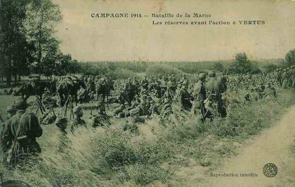
_Réserves françaises à Vertus_
_Collection privée_

**17h :**

Le 47e R.I. parvient à Bergères-les-Vertus. De nombreux blessés allemands y ont été laissés.

**9e C.A.**

**01h :**

Le général Dubois envoie ses ordres aux généraux Humbert et Moussy. La division du Maroc doit se reconstituer derrière la gauche du C.A. au fur et à mesure que la marche du 10e C.A. la libérera de sa surveillance des débouchés des marais de Saint-Gond. Ensuite, elle doit marcher sur Morains-le-Petit.

La 17e division et la 103e brigade ont comme objectifs la route Fère-Champenoise - Bannes ; la 104e brigade couvre l’attaque de la 17e division en progressant par le Mont Août.

**10h :**

La 17e division se heurte à une résistance allemande. Au nord de Morains-le-Petit, les troupes doivent manoeuvrer pour réduire des éléments allemands installés au nord de la route d’Ecury-le-Repos.

**17h :**

La 52e division de réserve s’engage contre Ecury-le-Repos. Comme la résistance est sérieuse, la division ne peut s’emparer du village. Les 68e et 90e régiments sont arrêtés par des feux violents d’artillerie partant de la région de Pierre-Morains mais la 51e division de réserve réussit à les faire cesser en s’emparant de la localité.

**42e division**

**05h :**

La division reprend sa marche. Aucun incident ne vient interrompre la progression dans la matinée. Après avoir dépassé Fère-Champenoise ; le 162e se heurte aux arrière-gardes du 12e C.A.R. L’artillerie allemande est en position au nord de Normée. Pendant toute l’après-midi, deux groupes du 46e d’artillerie tirent sans discontinuer sur Normée.

**16h :**

Grossetti ordonne à ses régiments de se porter en trois colonnes sur Villeseneux et Soudron. Ce mouvement se fait à partir de 17h. Certaines unités sont arrêtées devant Normée et seul le 151e R.I., en glissant par Lenharrée, se dirige vers Villeseneux.

**Dans la nuit :**

Le 151e se heurte à des arrière-gardes allemandes établies dans Villeseneux. Le lendemain, le village sera trouvé vide.

**11e C.A.**

**4h30 :**

Les batteries sont prêtes à ouvrir le feu. Dans la courant de la nuit, la droite du C.A. s’est avancée jusqu’à Montépreux.

**12h :**

Le C.A. atteint Connantray puis la ligne de la Somme, de Lenharrée à Sommesous. Aucune résistance ne vient ralentir la marche.

**9e D.C.**

**7h :**

La 9e D.C. occupe Mailly. En fin de journée, elle sera à Poivres-Sainte-Suzanne.

**Ordres de Foch pour le lendemain**

La IXe armée a ses têtes de colonne à Vertus, Colligny, Aulnizeux (10e C.A.), Pierre-Morains, Ecury-le-Repos (9e C.A.), Lenharrée et le cours de la Somme (11e C.A.), Normée et Sommesous n’étant pas encore occupés. Il prescrit à ses C.A. de marcher vers le nord à partir de 5h.

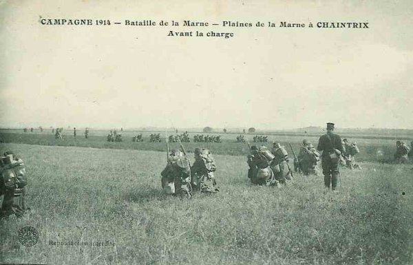
_Plaine de la Marne à Chaintrix_
_Collection privée_

**Dans le camp allemand**

Le manque de coordination est manifeste. Von Bülow a pris la décision de retraiter sans consulter ses voisins. Von Hausen n’est pas rassuré et envoie le général Hoeppner à son quartier général, pour s’assurer qu’il n’y a pas de dis continuité entre les deux armées pendant la retraite.

Von Hausen reçoit, par l’intermédiaire de la IVe armée l’ordre de l’O.H.L. de rester au sud de Châlons pour être prêt à une nouvelle attaque. En effet, le duc de Wurtemberg veut entamer une nouvelle offensive. Pendant que son voisin de droite retraite, von Hausen doit donner l’ordre de marcher vers le sud ! Les arrière-gardes restent sur la ligne Pierre-Morains - Sommesous - Sompuis tandis que celles de la IIe armés sont beaucoup plus au nord, vers Flavigny et Boursault.

Dans la matinée, les arrière-gardes de la 24e division de réserve se retirent sous la pression d’une attaque française.

**15h :**

L’attaque française se manifeste sur tout le front : vers Ecury, vers Pierre-Morains, qui est perdu vers 18h, devant Connantray puis à Normée.

**22h30 :**

La 24e division est violemment attaquée vers Clamanges par les 9e et 11e C.A. ; la menace du 10e C.A. français entre la Garde et les Saxons précipite le repli : l’ordre est donné au 12e C.A. de couvrir la retraite le lendemain : la ligne Chaintrix - Vatry doit être franchie à 8h.

**Conclusion**

La bataille des marais de Saint-Gond a été gagnée de justesse par Foch. Il a bénéficié de circonstances favorables.

L’armée de von Hausen, tiraillée entre deux demandes d’intervention, de la IIe armée d’une part, et de la IVe armée d’autre part, s’est scindée en deux et n’a pas pu exploiter la brèche qui s’était formée entre la IXe armée et la IVe armée françaises. Si von Hausen avait porté tout son effort sur ce point faible du dispositif français, la bataille de la Marne aurait été perdue pour Joffre. Au contraire, les Allemands se sont acharnés sur le terrain peu propice des marais de Saint-Gond, dominé par des hauteurs et difficilement franchissable.

Foch a également bénéficié de la solidarité de son voisin de gauche, Franchet d’Esperey, qui a mis à sa disposition le 10e C.A., bel exemple de solidarité dans l’histoire militaire.

Mais surtout, Foch a fait preuve, malgré les immenses difficultés rencontrées, d’un optimisme à toute épreuve, en attaquant alors que ses deux ailes étaient enfoncées. Une bataille est gagnée quand on croit l’avoir gagnée.
