# Bataille de l’Ourcq (5 - 10 septembre 1914)

La bataille de l’Ourcq constitue le déclenchement de l’offensive voulue par Joffre pour mettre fin à la retraite qui dure depuis l’échec de la bataille des frontières.

### Contexte de la bataille

La bataille de l’Ourcq est un épisode de la bataille de la Marne qui met aux prises la VIe armée française, une partie de l’armée anglaise et la Ie armée allemande.

La bataille des frontières ayant échoué, Joffre doit prescrire la retraite jusqu’au moment où l’occasion se présentera d’arrêter puis de refouler les armées allemandes. Il constitue à sa gauche une masse importante qui tentera de déborder la droite allemande : c’est la VIe armée, sous le commandement du général Maunoury. Elle est formée de troupes prélevées sur les armées de l’est, transportées par chemin de fer.

Entre temps, les armées allemandes poursuivent leur marche inexorable, en particulier la Ie armée allemande qui cherche depuis Mons à encercler les Anglais, mais ceux-ci se dérobent en traversant la Marne.

Au lieu de marcher sur Paris, comme le prévoit le plan Schlieffen, l’armée de von Kluck défile à l’est de Paris en talonnant l’armée anglaise.

**[Lien vers croquis](../img/marche_1earmee_28_5.jpg)**

Ce général ne se soucie pas du danger que peut présenter pour le flanc de son armée une attaque venant de Paris. Il ne dispose d’ailleurs d’aucun renseignement sur l’importance des troupes qui stationnent dans la région parisienne.

L’O.H.L. (Obere Heeresleitung), consciente du danger, prescrit à von Kluck d’assurer la couverture des armées allemandes en restant en retrait d’une journée de marche par rapport aux autres armées. Or, von Kluck est en avance d’une journée par rapport à son voisin, von Bülow. Il devrait stationner deux journées, ce qu’il juge inacceptable et il poursuit sa route, enfreignant les ordres du commandement suprême. Il ne laisse face à Paris q’un C.A.R.

**[Lien vers carte](../img/ourcq_champ_bataille.jpg)**c Michelin, d’après carte n° 56, édition 1937 - autorisation n° 05-B-18

### Premiers indices du mouvement de la Ie armée allemande vers la Marne

Ils remontent au 31 août. Le capitaine Lepic, commandant d’un escadron de cavalerie, est en observation sur la
petite crête au sud du hameau de Saint-Maur, à 500 mètres de la fourche des nationales 17 et 35. La première est la route de Paris à Senlis, la seconde se dirige vers Compiègne et, en la prolongeant, vers la Marne. Neuf escadrons de cavalerie allemande défilent, puis deux sections de mitrailleuses, des canons, puis, à quinze minutes d’intervalle, une colonne d’infanterie, et enfin une masse d’infanterie à perte de vue.

_Fourche des nationales 17 et 35_
_C Michelin, d’après carte n°56, édition 1937 - Autorisation n° 05-B-18Le hameau de Saint-Maur est au sud sud ouest de Ressons_

A 15h30, Lepic rédige son rapport : à la bifurcation, la masse des troupes a pris à gauche, abandonnant la route de Paris, une marche en direction du sud-est.

Quelques heures plus tard, le renseignement arrive au 2e bureau de la Ve armée, à Jonchery. Le renseignement est confirmé par l’aviation britannique : de nombreuses colonnes marchent vers le sud et l’est.

Le lendemain 1e septembre, les Français trouvent dans la sacoche d’un officier allemand blessé les ordres de mouvement de la Ie armée ellemande, établissant un changement de direction vers le sud-est.

**[Lien vers les positions au 1e septembre](../img/1stptembre_gallieni.jpg)**

Le 2, en survolant l’Oise, un observateur voit un énorme serpent gris traversant Verberie et suivant la vallée de l’Automne, qui conduit vers le sud-est.

Les 3 et 4, la tête des armées allemandes commence à franchir la Marne à Trilport. La poussée vers Paris a complètement cessé. La route de Paris - Senlis est vide d’Allemands.

**[Lien vers les positions au 3 septembre](../img/3setptembre_galliene.jpg)**

### La réaction de Galliéni

Dès la matinée du 4, Galliéni fait part à Maunoury de son intention « de se porter en avant, en liaison avec les troupes anglaises ». Il demande au général Clergerie d’informer de G.Q.G. de sa décision.

### La décision de Joffre

Le G.Q.G. est à Bar-sur-Aube. Joffre se lève à 5h. Il n’est pas encore 6h quand le 3e bureau se réunit autour de son chef, le colonel Pont. Les renseignements ont été reportés sur une carte : Les Ie et IIe armées allemandes s’engouffrent dans la nasse entre Paris et Verdun. Le lieutenant-colonel Gamelin est le premier à réagir « nous les tenons. Il faut attaquer dès demain ».

Toutefois, l’instruction n° 4 du 1e septembre indique comme limite extrême du recul une ligne passant par Bray-sur-Seine - Nogent-sur-Seine - Arcis-sur-Aube - Vitry-le-François et Bar-le-Duc. Le général Berthelot, chef d’Etat-Major de Joffre est intraitable. Toutes les dispositions sont prises pour un rétablissement sur la Seine : si les Allemands se trouvent dans une position aventurée, ils seront demain dans une position encore plus aventurée.

Joffre demande aux officiers de continuer leur discussion.
« L’occasion s’offre s’écrie Gamelin, si nous la laissons passer, nous ne sommes pas dignes de la victoire ».
Demain, le commandement allemand peut réparer l’imprudence...
Joffre se contente de dire « il faut demander à Franchet d’Esperey s’il peut se battre ».

Joffre fait répondre à Galliéni qu’il approuve le mouvement ordonné à l’armée Maunoury pour le lendemain 5 septembre. Il attend encore l’appréciation de Franchet d’Esperey.
La réponse arrive vers 20h. « mon armée n’est pas brillante mais elle peut se battre ».

L’ordre est prêt. Gamelin l’a rédigé : une page dactylographiée et trois paragraphes.

Le premier dit : « il convient de profiter de la situation aventurée de la Ie armée allemande pour concentrer sur elle les efforts des armées alliées d’extrême gauche ».

Le second résume les fronts d’attaque de la VIe armée, de l’armée anglaise, des Ve et IXe armées.

Le troisième comporte une seule ligne : « l’offensive sera prise le 6 septembre dès le matin ».

Joffre aurait préféré que les Allemands s’enfoncent dans la nasse pendant une journée de plus, mais Galliéni a déjà mis l’action en branle et tous les collaborateurs de Joffre insistent, sauf Berthelot, pour que l’action ait lieu sans délai.

Le 5, Joffre se rend auprès de French. L’entrevue a lieu au château de Vaux-le-Pénil. Il explique pourquoi la situation est devenue favorable et comment le concours britannique est indispensable, mais French reste sceptique. Tout à coup, Joffre frappe brutalement sur la table et dit « et puis, Monsieur le Maréchal, il y va de l’honneur de l’Angleterre ». Le visage de French s’empourpre, puis les lèvres de French remuent « I will do all my possible », ce que son adjoint Wilson traduit par « Mon général, le maréchal a dit oui ».

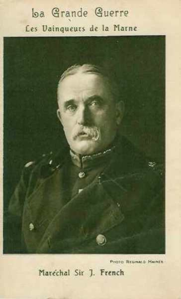
_Maréchal French (armée anglaise)_
_Collection privée_

### Ordre de bataille de la VIe armée française, général Maunoury

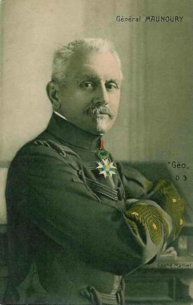
_Général Maunoury (VIe armée)_
_Collection privée_

**7e C.A. : (Besançon),général Vautier**

14e division : général de Villaret

| Unité | Commandant | Régiments |
| --- | --- | --- |
| 27e brigade | Berge | 44e R.I. (Lons-le-Saulnier)60e R.I. (Besançon) |
| 28e brigade | Faës | 35e R.I. (Belfort)42e R.I. (Belfort) |
| Elements divisionnaires |  | 11e régiment de chasseurs à cheval (un escadron - Vesoul)47e R.A.C. (Héricourt) |

41e division : général Superbie

| Unité | Commandant | Régiments |
| --- | --- | --- |
| 81e brigade | Bataille | 152e R.I. (Gerardmer)5e bataillon de chasseurs (Besançon, Remiremont)15e bataillon de chasseurs à pied (Montbéliard, Remiremont) |
| 82e brigade | Coste | 23e R.I. (Bourg en Bresse)133e R.I. (Belley) |
| Eléments divisionnaires |  | 11e régiment de chasseurs à cheval (un escadron - Vesoul)4e R.A.C. (Besançon) |
| Réserves |  | 352e R.I. (Gerardmer)45e bataillon de chasseurs à pied55e bataillon de chasseurs à pied11e régiment de chasseurs à cheval (Vesoul)5e R.A.C. (Besançon) |

**5e groupe de divisions de réserve, général de Lamaze**

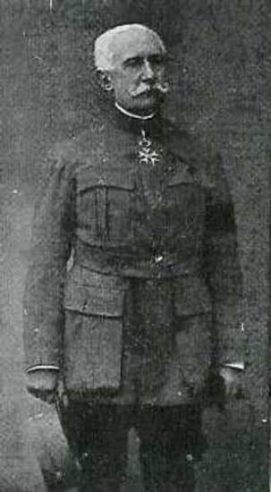
_Général de Lamaze (4e G.D.R.)_
_La guerre du droit_

55e division d’infanterie de réserve : général Leguay

| Unité | Commandant | Régiments |
| --- | --- | --- |
| 109e brigade d’infanterie | Arrivet | 204e R.I. (Auxerre)282e R.I. (Montargis)289e R.I. (Sens, Paris) |
| 110e brigade d’infanterie | Malubray | 231e R.I. (Melun, Paris)246e R.I. (Fontainebleau, Paris)276e R.I. (Coulommiers, Paris)32e régiment de dragons (deux escadrons - Versailles)13e R.A.C. (Vincennes)30e R.A.C. (Orléans)45e R.A.C. (Orléans) |

56e division d’infanterie de réserve : général de Dartein

| Unité | Commandant | Régiments |
| --- | --- | --- |
| 111e brigade | Bonne | 294e R.I. (Bar-le-Duc)354e R.I. (Nar-le-Duc, Lérouville)355e R.I. (Châlons-sur-Marne, Commercy) |
| 112e brigade d’infanterie | Cornille | 350e R.I. (Soissons, Saint-Mihiel)361e R.I. (Cambrai, Saint-Mihiel)13e régiment de hussards (un escadron - Dinan)25e R.A.C. (un groupe - Châlons-sur-Marne)32e R.A.C. (un groupe - Orléans, Fontainebleau)40e R.A.C. (un groupe - Saint-Mihiel) |

**4e C.A. : (Le Mans), général Boëlle**

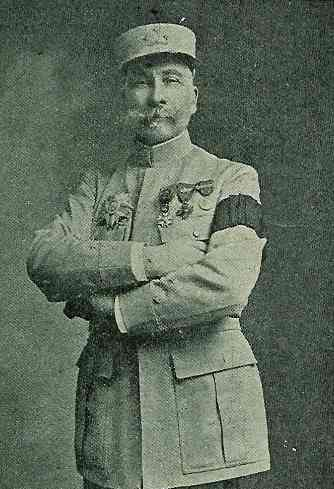
_Général Boëlle (4e C.A.)_
_La guerre du droit_

Ce C.A., qui a déjà participé à la bataille de Longwy, a été prélevé sur la IIIe armée par ordre de Joffre. Il a en outre été renforcé de plusieurs régiments.

7e division : général de Trentinian

| Unité | Commandant | Régiments |
| --- | --- | --- |
| 13e brigade | de Favrot | 101e R.I. (Saint-Cloud)102e R.I (Chartres, Paris) |
| 14e brigade | Félineau | 103e R.I. (Alençon, Paris)104 R.I. (Argentan, Paris) |
| Elements divisionnaires |  | 14e régiment de hussards (un escadron - Alençon)26e R.A.C. (trois groupes - Le Mans) |

8e division : général de Lartigue

| Unité | Commandant | Régiments |
| --- | --- | --- |
| 15e brigade |  | 124e R.I. (Laval)130e R.I. (Mayenne) |
| 16e brigade | Desvaux | 115e R.I. (Mamers)117e R.I. (Le Mans) |
| Elements divisionnaires |  | 14e régiment de hussards (un escadron - Alençon)31e R.A.C. (Le Mans) |
| Réserves |  | 315e R.I. (Mamers)317e R.I. (Le Mans)44e R.A.. (Le Mans) |

**6e groupe de divisions de réserve, général Ebener**

Ce groupe était, lors de la mobilisation, à la disposition du ministre.

61e division d’infanterie de réserve : général Deprez

| Unité | Commandant | Régiments |
| --- | --- | --- |
| 121e brigade | Delarue | 264e R.I. (Ancenis)265e R.I. (Nantes)316e R.I. (Vannes) |
| 122e brigade | Tesson | 219e R.I. (Brest)262e R.I. (Lorient)318e R.I. (Quimper)1e régiment de dragons (un escadron - Luçon)28e R.A.C. (un groupe - Vannes)35e R.A.C. (un groupe - Vannes)51e R.A.C. (un groupe - Nantes) |

62e division d’infanterie de réserve : général Ganeval

| Unité | Commandant | Régiments |
| --- | --- | --- |
| 123e brigade | Peyriague | 263e R.I. (Limoges)278e R.I. (Guéret, Limoges)338e R.I. (Magnac-Laval, Bellac) |
| 124e brigade | Ninous | 250e R.I. (Périgueux)307e R.I. (Angoulème)308e R.I. (Bergerac)20e régiment de dragons (deux escadrons - Limoges)21e R.A.C. (un groupe - Angoulême)34e R.A.C. (un groupe - Périgueux)52e R.A.C. (un groupe - Angoulême) |

**37e division d’infanterie, général Comby**

Cette division, composé de troupes africaines, a été prélevé sur la Ve armée.

| Unité | Commandant | Régiments |
| --- | --- | --- |
| 73e brigade | Degot | régiment marche du 2e zouaves (trois bataillons - Oran)Régiment du marche du 2e tirailleurs (trois bataillons - Mostaganem)Régiment de marche du 5e tirailleurs (deux bataillons - Rabat)Régiment de marche du 6e tirailleurs (deux bataillons - Taourit) |
| 74e brigade | Le Bouhélec | Régiment de marche du 5e zouaves (trois bataillons)3e régiment de tirailleurs (trois bataillons - Constantine)Régiment de marche du 7e tirailleurs (un bataillon - Constantine)6e régiment de chasseurs d’Afrique (un escadron - Mascara)3 groupes de 75 d’Afrique |

**45e division d’infanterie, général Drude**

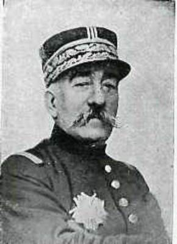
_Général Drude (45e D.I.)_
_La guerre du droit_

| Unité | Commandant | Régiments |
| --- | --- | --- |
| 89e brigade | Trafford | Régiment de marche du 1e zouaves (Alger)régiment du 3e zouaves (Batna) |
| 90e brigade | Quincandon | régiment de marche du 2e zouaves (Oran)régiment de marche du 2e tirailleurs (Mostaganem)1e régiment de chasseurs d’Afrique (Blida)2e régiment de chasseurs d’Afrique (Tlemcen)1e groupe d’artillerie d’Afrique52e R.A.C. (Angoulême) |

**Brigade de chasseurs indigènes, général Ditte**

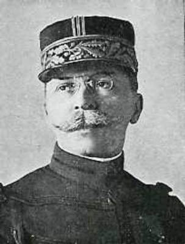
_Général Ditte (brigade de chasseurs indigènes)_
_La guerre du droit_

1e et 2e régiments de chasseurs indigènes (Maroc)

**1e C.C., général Sordet**

1e division de cavalerie : général Buisson

| Unité | Commandant | Régiments |
| --- | --- | --- |
| 2e brigade de cuirassiers | Louvat | 1e régiment de cuirassiers (Paris)2e régiment de cuirassiers (Paris) |
| 5e brigade de dragons | Silvestre | 6e régiment de dragons (Vincennes)23e régiment de dragons (Vincennes) |
| 11e brigade de dragons | Corvisart | 27e régiment de dragons (Versailles)32e régiments de dragons (Versailles) |
| Eléments divisionnaires |  | 1e groupe cycliste du 26e bataillon de chasseurs à pied (Vincennes, Pont-à-Mousson)13e R.A.C. (un groupe - Vincennes) |

3e division de cavalerie : général Dor de Lastours

| Unité | Commandant | Régiments |
| --- | --- | --- |
| 4e brigade de cuirassiers | Gouzil | 4e régiment de cuirassiers (Valenciennes, Cambrai)9e régiment de cuirassiers (Douai) |
| 13e brigade de dragons | Léorat | 5e régiment de dragons (Compiègne)7e régiment de dragons (Fontainebleau) |
| 3e brigade de cavalerie légère | de la Villestreux | 3e régiment de hussards (Senlis)8e régiment de hussards (Meaux) |
| Eléments divisionnaires |  | 3e groupe cycliste du 18e bataillon de chasseurs à pied (Amiens)42e R.A.C. (Stenay) |

5e division de cavalerie : général Bridoux

| Unité | Commandant | Régiments |
| --- | --- | --- |
| 3e brigade de dragons | Lallemand | 16e régiment de dragons (Reims)22e régiment de dragons (Reims) |
| 7e brigade de dragons | de Marcieux | 9e régiment de dragons (Epernay)29e régiment de dragons (Provins) |
| 5e brigade de cavalerie légère | Cornulier-Lucinière | 5e régiment de chasseurs à cheval (Châlons-sur-Marne)15e régiment de chasseurs à cheval (Châlons-sur-Marne) |
| Eléments divisionnaires |  | 5e groupe cycliste du 29e bataillon de chasseurs à pied (Epernay, Saint-Mihiel)61e R.A.C. (un groupe - Verdun) |

**Brigade de cavalerie Gillet.**

Soit 9 divisions d’infanterie et 3 de cavalerie.

### Ordre de bataille de la Ie armée allemande, generaloberst von Kluck

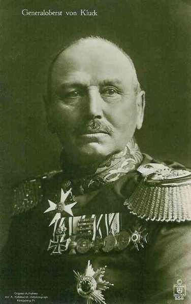
_Général von Kluck (Ie armée)_
_Collection privée_

Remarquons que la Ie armée allemande s’est affaiblie depuis la bataille de Mons : elle a perdu le 3e C.A.R. (von Beseler), chargé d’investir la place forte d’Anvers.

**4e C.A.R (Magdeburg) : général von Gronau**

_Général von Gronau_
_Collection privée_

7e division d’infanterie de rés. : général von Schwerin

| Unité | Commandant | Régiments |
| --- | --- | --- |
| 13.Reserve-Infanterie-Brigade |  | Magdeburgisches Reserve-Infanterie-Regiment Nr. 27Reserve-Infanterie-Regiment Nr. 36 |
| 14.Reserve-Infanterie-Brigade |  | Reserve-Infanterie-Regiment Nr. 66Reserve-Infanterie-Regiment Nr. 72Reserve-Jäger-Bataillon Nr. 4 |
| Cavalerie |  | Schweres Reserve-Reiter-Regiment Nr. 1 |
| Artillerie |  | Reserve-Feldartillerie-Regiment Nr. 7 |

22e division d’infanterie de rés.

| Unité | Commandant | Régiments |
| --- | --- | --- |
| 43.Reserve-Infanterie-Brigade |  | Reserve-Infanterie-Regiment Nr. 71Reserve-Infanterie-Regiment Nr. 92 |
| 44.Reserve-Infanterie-Brigade |  | Reserve-Infanterie-Regiment Nr. 32Reserve-Infanterie-Regiment Nr. 82Reserve-Jäger-Bataillon Nr. 4 |
| Cavalerie |  | Reserve-Jäger Regiment zu Pferde Nr. 1 |
| Artillerie |  | Reserve-Feldartillerie-Regiment Nr. 22 |

**2e C.A. : (Stettin), général von Linsingen**

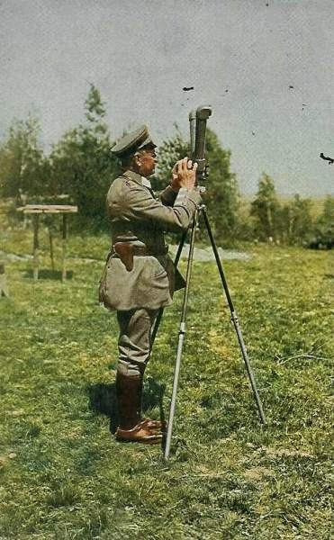
_Général von Linsingen ( 2e C.A.)._
_Collection privée_

3e division d’infanterie : général von Trossel

| Unité | Commandant | Régiments |
| --- | --- | --- |
| 5.Infanterie-Brigade |  | Grenadier-Regiment Nr. 2 (Stettin)Colbergsches-Grenadier-Regiment Nr. 9 (Stagard) |
| 6.Infanterie-Brigade |  | Füsilier-Regiment Nr. 34 (Stettin)Infanterie-Regiment Nr. 42 Stralsund) |
| Cavalerie divisionnaire |  | Grenadier-Regiment zu Pferde Nr. 3 |
| 3.Feldartillerie-Brigade |  | 1. Pommersches Feldartillerie-Regiment Nr. 2 (Kolberg)Vorpommersches Feldartillerie-Regiment Nr. 38 (Stettin) |

4e division d’infanterie : général von Pannewitz

| Unité | Commandant | Régiments |
| --- | --- | --- |
| 7.Infanterie-Brigade |  | Infanterie-Regiment Nr. 14 (Bromberg)6. Westpreußisches Infanterie-Regiment Nr. 149 (Schneidemühl) |
| 8.Infanterie-Brigade |  | 6. Pommersches Infanterie-Regiment Nr. 49 (Gnesen)4. Westpreußisches Infanterie-Regiment Nr. 140 (Hohensalza) |
| Cavalerie divisionnaire |  | Dragoner-Regiment Nr. 12 (Gnesen) |
| 4. Feldartillerie-Brigade |  | 2. Pommersches Feldartillerie-Regiment Nr. 17 (Bromberg)Hinterpommersches Feldartillerie-Regiment Nr. 53 (Bromberg) |

**3e C.A. : (Berlin), général von Lochow**

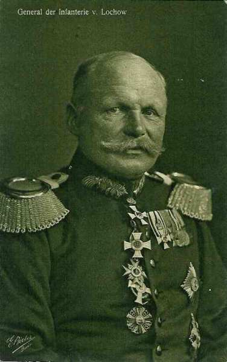
_Général von Lochow (3e C.A.)_
_Collection privée_

5e division d’infanterie : général Wichura

| Unité | Commandant | Régiments |
| --- | --- | --- |
| 9.Infanterie-Brigade |  | Leib-Grenadier-Regiment Nr. 8 (Frankfurt a.d.O.)Infanterie-Regiment Nr. 48 (Cüstrin) |
| 10.Infanterie-Brigade |  | Grenadier-Regiment Nr. 12 (Frankfurt a.d.O.)Infanterie-Regiment Nr. 52 (Cottbus)Brandenburgisches Jäger-Bataillon Nr. 3 (Lübben) |
| Cavalerie divisionnaire |  | "1/2" Husaren-Regiment von Zieten (Brandenburgisches) Nr. 3 (Rathenow) |
| 5.Feldartillerie-Brigade |  | Feldartillerie-Regiment Nr. 18 (Frankfurt a.d.O.)Neumärkisches Feldartillerie-Regiment Nr. 54 (Cüstrin) |

6e division d’infanterie : général von Rohden

| Unité | Commandant | Régiments |
| --- | --- | --- |
| 11.Infanterie-Brigade |  | Infanterie-Regiment Nr. 20 (Wittenberg)Füsilier-Regiment Nr. 35 (Brandenburg a.H.) |
| 12.Infanterie-Brigade |  | Infanterie-Regiment Nr. 24 (Neu-Ruppin)Infanterie-Regiment Nr. 64 (Angermünde)Brandenburgisches Jäger-Bataillon Nr. 3 (Lübben) |
| Cavalerie divisionnaire |  | "1/2" Husaren-Regiment von Zieten (Brandenburgisches) Nr. 3 (Rathenow) |
| 6.Feldartillerie-Brigade |  | Feldartillerie-Regiment Nr. 3 (Brandenburg a.H.)Kurmärkisches Feldartillerie-Regiment Nr. 39 (Perleberg) |

**4e C.A. : (Magdeburg), général Sixt von Arnim**

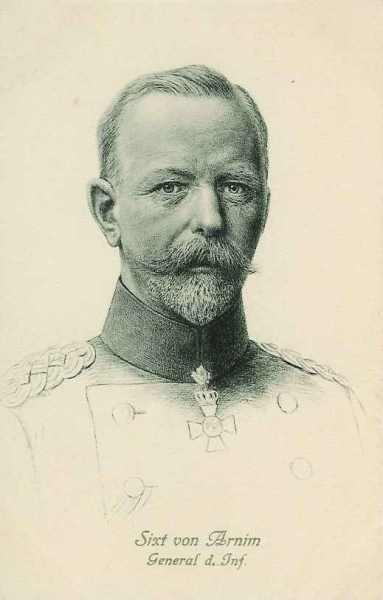
_Général Sixt von Arnim_
_Collection privée_

7e division d’infanterie : général Riedel

| Unité | Commandant | Régiments |
| --- | --- | --- |
| 13.Infanterie-Brigade |  | Infanterie-Regiment Nr. 26 (Magdeburg)3. Magdeburgisches Infanterie-Regiment Nr. 66 (Magdeburg) |
| 14.Infanterie-Brigade |  | Infanterie-Regiment Nr. 27 (Halberstadt)5. Hannoversches Infanterie-Regiment Nr. 165 (Quedlimburg) |
| Cavalerie divisionnaire |  | "1/2" Magdeburgisches Husaren-Regiment Nr. 10 (Leobschütz) |
| 7. Feldartillerie-Brigade |  | Feldartillerie-Regiment Nr. 4 (Magdeburg)Altmärkisches Feldartillerie-Regiment Nr. 40 (Burg) |

8e division d’infanterie : général Hildebrandt

| Unité | Commandant | Régiments |
| --- | --- | --- |
| 15.Infanterie-Brigade |  | Füsilier-Regiment Nr. 36 (Halle a.S)Anhaltisches Infanterie-Regiment Nr. 93 (Dessau)Magdeburgisches Jäger-Bataillon Nr. 4 (Naumburg a.S.) |
| 16.Infanterie-Brigade |  | 4. Thüringisches Infanterie-Regiment Nr. 72 (Torgau)8. Thüringisches Infanterie-Regiment Nr. 153 (Altenburg) |
| Cavalerie divisionnaire |  | "1/2" Magdeburgisches Husaren-Regiment Nr. 10 (Stendal) |
| 8. Feldartillerie-Brigade |  | Torgauer Feldartillerie-Regiment Nr. 74 (Torgau)Mansfelder Feldartillerie-Regiment Nr. 75 (Halle a.S.) |

**9e C.A. : (Altona), général von Quast**

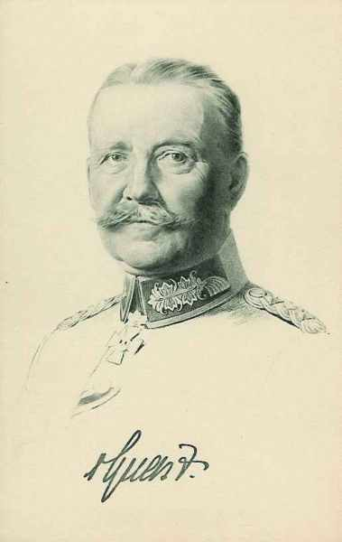
_Général von Quast  (9e C.A.)_
_Collection privée_

17e division d’infanterie : général von Bauer

| Unité | Commandant | Régiments |
| --- | --- | --- |
| 33. Infanterie-Brigade |  | Infanterie-Regiment Nr. 75 (Bremen)Infanterie-Regiment Nr. 76 (Hamburg) |
| 34.Infanterie-Brigade |  | Großherzoglich Mecklenburgisches Grenadier-Regiment Nr. 89 (Schwerin)
Großherzoglich Mecklenburgisches Füsilier-Regiment Nr. 90 (Rostock)
Lauenburgisches Jäger-Bataillon Nr. 9 (Ratzeburg) |
| Cavalerie divisionnaire |  | Stab u. 3.Eskadron/2. Hannoversches Dragoner-Regiment Nr. 16 (Lüneburg) |
| 17. Feldartillerie-Brigade |  | Holsteinisches Feldartillerie-Regiment Nr. 24 (Güstrow)Großherzoglich Mecklenburgisches Feldartillerie-Regiment Nr. 60 (Schwerin) |

18e division d’infanterie : général von Kluge

| Unité | Commandant | Régiments |
| --- | --- | --- |
| 35. Infanterie-Brigade |  | Infanterie-Regiment Nr. 84 (Haldersleben)Füsilier-Regiment Nr. 86 (Flensburg) |
| 36. Infanterie-Brigade |  | Infanterie-Regiment Nr. 31 (Altona)Infanterie-Regiment Nr. 85 (Rendsburg) |
| Cavalerie divisionnaire |  | 3. Eskadron/2. Hannoversches Dragoner-Regiment Nr. 16 (Lüneburg) |
| 18. Feldartillerie-Brigade |  | Feldartillerie-Regiment Nr. 9 (Itzehoe)Lauenburgisches Feldartillerie-Regiment Nr. 45 (Altona) |

**9e C.A.R. : (Altona), général von Böhn**

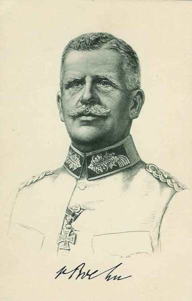
_Général von Böhn (9e C.A.R.)_
_Collection privée_

17e division de réserve : général Wagener

| Unité | Commandant | Régiments |
| --- | --- | --- |
| 81. Infanterie-Brigade |  | Infanterie-Regiment Nr. 162Schleswig-Holsteinisches Infanterie-Regiment Nr. 163 |
| 33. Reserve-Infanterie-Brigade |  | Reserve-Infanterie-Regiment Nr. 75Reserve-Infanterie-Regiment Nr. 76 |
| Cavalerie |  | Reserve-Husaren-Regiment Nr. 6 |
| Artillerie |  | Reserve-Feldartillerie-Regiment Nr. 17 |

18e division de réserve : général Gronen

| Unité | Commandant | Régiments |
| --- | --- | --- |
| 34. Reserve-Infanterie-Brigade |  | Hanseatisches Reserve-Infanterie-Regiment Nr. 31Großherzoglich Mecklenburgisches Reserve-Infanterie-Regiment Nr. 90 |
| 35. Reserve-Infanterie-Brigade |  | Schleswigsches Reserve-Infanterie-Regiment Nr. 84Schleswigsches Reserve-Infanterie-Regiment Nr. 86Reserve Jäger-Bataillon Nr. 9 |
| Cavalerie |  | Reserve-Husaren-Regiment Nr. 7 |
| Artillerie |  | Reserve-Feldartillerie-Regiment Nr. 18 |

**1e C.C., general der Kavallerie von der Marwitz**

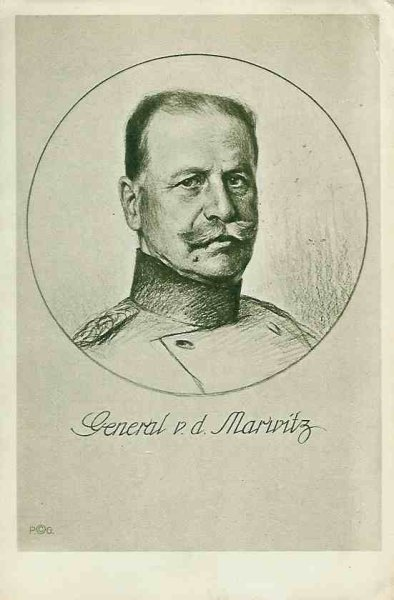
_Général von der Marwitz (2e C.C.)_
_Collection privée_

2. D.C. : général von Krane

| Unité | Commandant | Régiments |
| --- | --- | --- |
| 5.  Kavallerie-Brigade |  | Dragoner-Regt.  Nr 2 (Berlin)Ulanen-Regt. Nr 3 (Potsdam) |
| 8. Kavallerie-Brigade |  | Kürassier-Regt. Nr 7 (Halberstadt)Husaren-Regt. Nr 12 (Torgau) |
| Leib-Husaren-Brigade |  | 1. Leib-Husaren-Regt. Nr 1 (Danzig)2. Leib-Husaren-Regt. Nr 2 (Danzig) |
|  |  | Bataillon du Feldartillerie-Regt. Nr 35 (Eylau)MG. Abtg. Nr. 4 (Thorn) |

4. D.C. : général von Garnier

| Unité | Commandant | Régiments |
| --- | --- | --- |
| 3. Kavallerie-Brigade |  | Kürassier-Regt. Nr 2 (Pasewalk)Ulanen-Regt. Nr 9 (Demmin) |
| 17. Kavallerie-Brigade |  | Dragoner-Regt Nr 17 (Ludwigslust)Dragoner-Regt Nr 18 (Parchim) |
| 18. Kavallerie-Brigade |  | Husaren-Regt. Nr 15 (Wandsbek)Husaren-Regt. Nr 16 (Schleswig) |
|  |  | Bataillon du Feldartillerie-Regt. Nr 3 (Brandenburg)MG. Abtg. Nr. 2 (Trier) |

9. D.C. : général von Schmettow

| Unité | Commandant | Régiments |
| --- | --- | --- |
| 13. Kavallerie-Brigade |  | Kürassier-Regt. Nr 4 (Münster)Husaren-Regt. Nr 8 (Paderborn) |
| 14. Kavallerie-Brigade |  | Husaren-Regt Nr 11 (Crefeld)Ulanen-Regt Nr 5 (Düsseldorf) |
| 19. Kavallerie-Brigade |  | Dragoner-Regt. Nr 19 (Oldenburg)Ulanen-Regt. Nr 13 (Hannover) |
|  |  | Bataillon du Feldartillerie-Regt. Nr 10 (Hannover)MG. Abtg. Nr. 7 (Köln) |

### Position des armées la veille de la bataille

A l’extrême gauche du dispositif français, la VIe armée française est déployée face à l’est, la droite à quatre kilomètres au nord-ouest de Meaux, la gauche au sud de Senlis. Le C.C. Sordet est en marche du sud de Paris vers Nanteuil-le-Haudouin pour la flanquer au nord.
Le 4e C.A., provenant de la IIIe armée, est en cours de débarquement dans le sud de Paris.

L’armée anglaise se trouve à une vingtaine de kilomètres au sud de la Marne, à hauteur de la route Rozoy - Tournon, face au nord-est.

Lors de sa conversion à travers la Belgique, la Ie armée allemande a laissé son 3e C.A.R. en couverture face à Anvers et la IIe armée son 7e C.A.R. devant Maubeuge : elle s’est affaiblie.

- Quant au gros des armées, la directive de Moltke du 4 septembre avait prescrit que les Ie et IIe armées restent face à Paris :
  La Ie entre Marne et Oise en tenant les ponts de la Marne à Château-Thierry et à l’ouest de cette localité
  La IIe entre Marne et Seine.

Von Kluck n’a pas exécuté immédiatement les instructions de Moltke : il a poussé tous ses C.A. au sud de la Marne sauf un en flanc-garde.

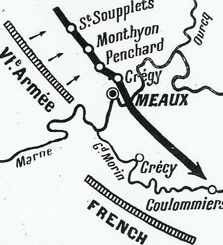
_Position des armées le 4 septembre_

### 5 septembre

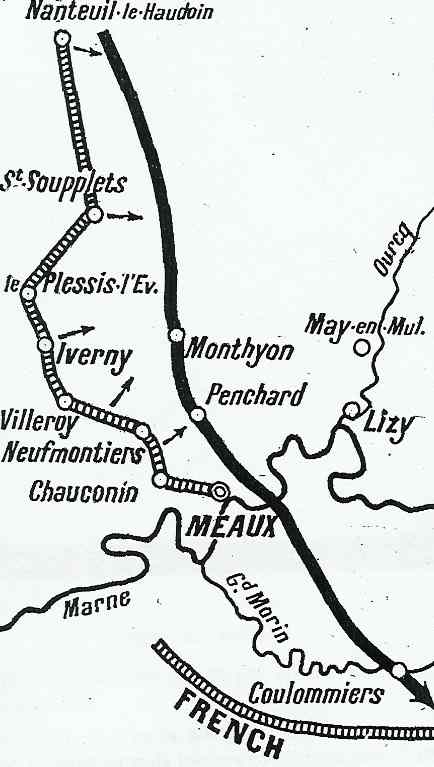
_Position des armées le 5 septembre_

**[Lien vers les positions au 5 septembre](../img/5septembre_gallieni.jpg)**

**En matinée :**

La VIe armée s’efforce de gagner la position assignée et prend contact avec le IVe C.A.R. allemand.

**11h :**

Le général von Gronau, commandant le 4e C.A.R. (flanc garde de la Ie armée allemande face à Paris) est informé que des colonnes d’infanterie française font route vers l’est, sur sa droite.

**12h :**

L’artillerie allemande tire des hauteurs de Monthyon sur l’artillerie française en train de se déployer.
Von Gronau donne l’ordre à ses divisions d’infanterie d’attaquer les Français et à sa D.C. de les déborder par le nord.

Les deux adversaires vont se disputer les lignes de crêtes qui suivent le cours de l’Ourcq.

- Au sud, la brigade Marocaine refoule les Allemands mais ne parvient pas à s’emparer de la colline de Penchard. Elle subit de grosses pertes en attaquant dans une plaine découverte, sous le feu de troupes allemandes qui occupent une position dominante.

- Au centre, la 55e division de réserve se lance à l’assaut des hauteurs de Monthyon en partant de la ligne Plessis-l’Evêque - Iverny - Villeroy. Au nord, des combats se déroulent à Saint-Soupplets et les français ne parviennent pas à s’emparer de la localité.

**Dans l’après-midi :**

Le lieutenant Charles Péguy, écrivain connu et servant dans le 276e régiment d’infanterie, est tué, à Villeroy, d’une balle dans la tête alors qu’il refusait de se coucher sur le sol.

**A la nuit :**

Craignant une menace sur leur flanc, les allemands se replient sur des positions plus favorables : Saint-Soupplets, Neufmontiers et Chauconin sont abandonnés et tombent dans les mains françaises.

Le groupe de Lamaze passe la nuit sur la ligne Montgé - Iverny - Charny, le 7e C.A. à sa gauche.

**24h :**

Von Kluck est seulement averti de l’offensive française. Il confirme son ordre au 2e C.A. de remonter vers le nord.

### 6 septembre : offensive générale des armées françaises

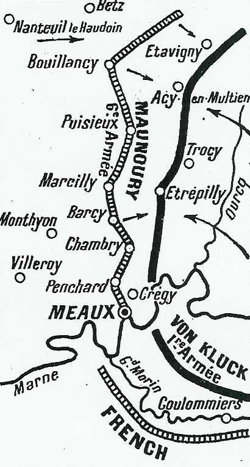
_Position des armées le 6 septembre_

**[Lien vers les positions au 6 septembre](../img/6septembre_gallieni.jpg)**

Le but de cette journée est pour la VIe armée l’attaque de front et le débordement par sa droite du IVe C.A.R allemand.

La proclamation historique de Joffre parvient aux armées :

« Au moment où s’engage une bataille dont dépend le salut du Pays, il importe de rappeler à tous que le moment n’est plus de regarder en arrière. Tous les efforts doivent être employés à attaquer et repousser l’ennemi. Toute troupe qui ne peut avancer devra, coûte que coûte, garder le terrain conquis et se faire tuer sur place plutôt que de reculer. Dans les circonstances actuelles, aucune défaillance ne peut être tolérée ».

**A l’aube :**

- La VIe armée relance l’offensive
  Le 7e C.A. attaque les crêtes du Multien
  La 55e division de réserve s’empare de Monthyon
  La brigade marocaine s’empare des collines de Penchard

Vers Meaux, les Français s’emparent de Chambry, Barcy et Marcilly, mais les barrages d’artillerie allemande empêchent les troupes de progresser plus avant.

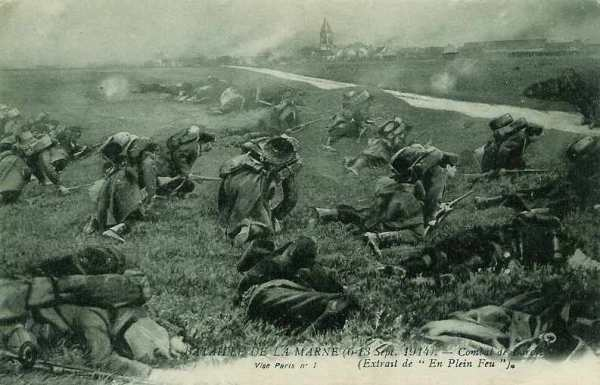
_Combat de Barcy_
_Collection privée_

**9h :**

Le groupe de Lamaze atteint le front de Chambry - Barcy - Oissery.

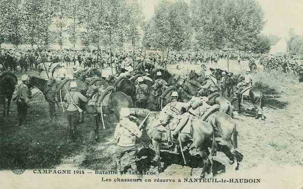
_Chasseurs à Nanteuil-le-Haudouin_
_Collection privée_

**En milieu de matinée :**

Von Linsingen (2e C.A.) engage la 3e division sur la ligne Vareddes - Etrepilly et bloque le mouvement débordant par le nord que doit effectuer le 7e C.A. français. La rencontre a lieu près d’Etavigny.

Von Kluck cède à la IIe armée (von Bülow) les 9e et 3e C.A. et décide de faire remonter vers l’Ourcq son 4e C.A. (von Arnim) pour soutenir le 4e C.A.R. (von Gronau) et son 2e C.A. (von Linsingen). Von Arnim doit pouvoir s’engager dès le 7 au matin.

Von Kluck transporte son PC à Vendrest-sur-Ourcq pour mieux suivre la bataille.

**17h30 :**

Le 4e C.A. allemand traverse la Marne à La Ferté-sous-Jouarre. Il doit attaquer dès l’aube sur la ligne Rosoy-en-Multien - Trocy.

**[Lien vers croquis](../img/marche_1earmee_6_9.jpg)**

**Au soir :**

Galliéni se rend compte que les assauts frontaux contre Torcy et Etrepilly ont été vains et il cherche à présent à manoeuvrer vers le nord. Il attend pour cela l’arrivée du 4e C.A. (IIIe armée). La 8e division (de Lartigue) a été placée à la gauche des Anglais. Au nord de Paris, il ne reste que la 7e division. Elle doit être transportée de toute urgence vers Nanteuil-le-Haudouin et pour ce faire est embarquée à bord de 600 taxis parisiens, réquisitionnés. Six autres bataillons sont transportés par chemin de fer. La 7e division pourra  marcher au combat dès le début de la matinée du 7.

Les Français occupent la ligne Chambry - Marcilly - Puisieux - Acy-en-Multien.

L’armée anglaise atteint la ligne Crécy-en-Brie - Coulommiers - Choisy-en-Brie.

Le 9e C.A. allemand, dans la région d’Esternay prend position à Sancy - Montceau afin de soutenir la IIe armée. Le 3e C.A. couvre le flanc droit du 9e C.A.

**22h :**

Ordre est donné aux 3e et 9e C.A. de revenir sur la rive nord du Petit Morin.

### 7 septembre

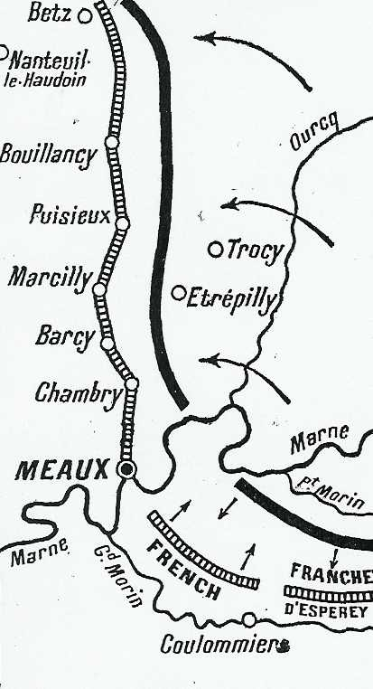
_Position des armées le 7 septembre_

**[Lien vers les positions au 7 septembre](../img/7_septembre_gallieni.jpg)**

Dès le matin, les Français reprennent leur attaque mais subissent le tir de l’artillerie lourde allemande à laquelle ils ne peuvent pas répliquer avec leur canon de campagne de 75.

C’est au cours de la nuit du 6 au 7 que se déroule l’épisode le plus connu et le plus symbolique de la bataille de la Marne : le transport d’une partie de la 7e division en taxis.

**02h :**

L’Etat-major de von Kluck rallie la ferme de Beauval où s’est installé von Linsingen.

**04h :**

La VIe armée reprend son offensive. Le 7e C.A., la 5e D.C. et la 61e division de réserve doivent entamer une manœuvre de débordement par le nord, mais les Allemands répliquent en envoyant la 7e division du 4e C.A. (von Arnim) qui prend à partie la 61e division du général Desprez. Les combats se déroulent dans le secteur de Nanteuil-le-Haudouin, où les français sont bloqués.

**En matinée :**

Les Français poursuivent leur offensive mais ils commencent à sentir les effets de l’artillerie lourde allemande établie entre Vareddes et May-en-Multien, hors de portée de leurs 75.

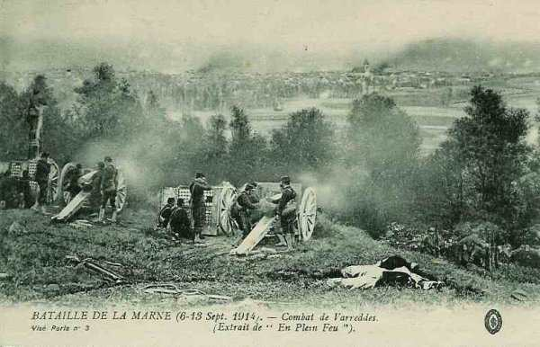
_Combat de Vareddes_
_Collection privée_

Les combats se déroulent autour de Marcilly - Barcy - Chambry. Au nord, le 7e C.A., prolongé par la 61e division de réserve, a pris pied sur le plateau d’Etavigny.

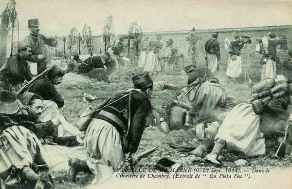
_Combat au cimetière de Chambry_
_Collection privée_

La 8e division allemande vient renforcer les unités dans le secteur d’Etrepilly et de Torcy.

Acy-en-Multien et la ferme de Nogeon sont le théâtre d’affrontements très violents allant jusqu’au corps à corps.

A Fosse Martin, le colonel Nivelle empêche les français de lâcher pied devant une attaque allemande en poussant ses batteries devant l’infanterie et faisant feu sur les masses allemandes.

**12h :**

Von Linsingen, chef du 2e C.A., a sous son commandement :

- Un groupe nord (Sixt von Arnim) sur la ligne Antilly - Acy-en-Multien
  Un groupe du centre (von Gronau), sur la ligne Vincy-Manœuvre, au nord-ouest de Trocy
  Un groupe sud (von Trossel) sur le front Trocy - Vareddes.

**12h15 :**

Von Linsingen ordonne l’attaque de la ligne Antilly - Acy - Trocy. Son aile droite rejette les Français au-delà de Villers-Saint-Genest - Bouillancy et la 22e division s’empare d’Etrepilly.

**[Lien vers mouvements des C.A. allemands](../img/mouvement_CA_allemands_7_septembre.jpg)**

**13h15 :**

Pour soulager l’aile gauche allemande, battue avec violence par l’artillerie française, les 3e et 9e C.A. se portent immédiatement en avant en soutien des 4e C.A.R. et 2e C.A.

**21h15 :**

Les 2e, 4e C.A. et le 4e C.A.R. sont sur la ligne Antilly - Puisieux - Vareddes.

**En soirée :**

Aucun des deux camps n’a remporté de succès vraiment significatif. Les affrontements à Chambry et Etrepilly restent indécis.

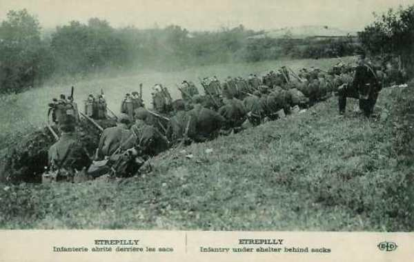
_Infanterie française à Etrepilly_
_Collection privée_

Le 4e C.A. allemand repasse la Marne et renforce les deux C.A. déjà engagés (4e C.A.R. et 2e C.A.). Il va essayer de déborder la gauche de la VIe armée française. Pour masquer le départ des 2e et 4e C.A., Von Kluck a déployé trois D.C. appuyées par de l’artillerie, qui lutteront avec opiniâtreté pour freiner l’avance anglaise et permettre de battre la VIe armée française avant qu’ils ne constituent une menace.

**[Lien vers croquis](../img/marche_1earmee_28_5.jpg)**

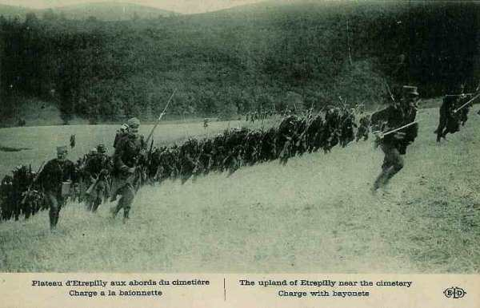
_Charge d’infanterie à Etrepilly_
_Collection privée_

Les anglais occupent au soir la ligne Maisoncelles - Coulommiers - Choisy-en-Brie. Ils n’ont pratiquement pas progressé.

Von Kluck donne ses ordres pour le lendemain :

- Le 3e C.A. partira à 02h de Montreuil par Mareuil et de La Ferté-sous-Jouarre par Crouy pour attaquer au nord d’Antilly

- Le 9e C.A. partira de Château-Thierry vers La Ferté-Milon.

- Le 2e C.C. couvrira le flanc gauche de l’armée vers le Grand Morin inférieur et Coulommiers.

### 8 septembre

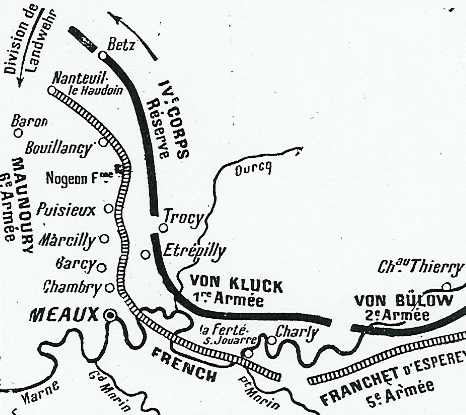
_Position des armées le 8 septembre_

**En matinée :**

La 7e division prend place entre la 61e division et le 7e C.A. mais l’arrivée du 4e C.A. allemand neutralise l’effet de ce renfort.

Sur tout le front, la lutte est acharnée : la 63e division et le 7e C.A. combattent autour d’Acy.

A droite, le groupe de Lamaze lance des attaques contre la ligne Etrepilly - Vareddes (45e division d’Afrique) mais sans succès.

Des forces alliées importantes marchent au nord du Grand Morin vers La Ferté-sous-Jouarre et Saint-Cyr.

**11h20 :**

Von Kluck prescrit au 9e C.A. d’assurer la protection contre un mouvement de flanc des Anglais en occupant la ligne de la Marne de La Ferté-sous-Jouarre à Nogent-l’Artaud et au 1e C.A. de défendre la ligne La Ferté - Villeneuve.

**[Lien vers croquis](../img/marche_1earmee_28_5.jpg)**

**Dans l’après-midi :**

L’armée anglaise refoule les arrière-gardes allemandes après de vifs combats à La Trétoire et Signy-Signets, franchit le Petit Morin et gagne le front La Ferté-sous-Jouarre - Vieils-Maisons. La 8e division française atteint les environs de Trilport.

**Dans la nuit :**

Nanteuil-le-Haudouin tombe dans les mains allemandes. Les quatre divisions des 3e et 9e C.A. sont lancées dans la bataille après avoir marché soixante kilomètres. Von Kluck dispose d’une nette supériorité sur l’Ourcq et il peut envisager le débordement de la VIe armée.

Les ordres de von Kluck prescrivent que la Ie armée sera maintenue sur la ligne de Cuvergnon jusqu’au coude de la Marne à Congis.

### 9 septembre

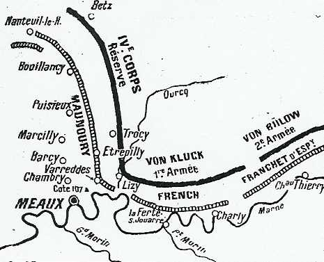
_Position des armées le 9 septembre_

**[Lien vers les positions au 9 septembre 1914](../img/8septembre_gallieni.jpg)**

Cette journée marque un renversement de situation : grâce au transfert de ses C.A. vers l’Ourcq, von Kluck a acquis la supériorité sur son adversaire, mais il a dégarni ses positions face aux anglais. Ceux-ci franchissent la Marne et menacent de prendre l’armée de von Kluck en tenaille.

**En matinée :**

La brigade Lepel, venue de Belgique, est prête à s’engager.
Von Kluck transporte son PC à Mareuil-sur-Ourcq.

Les Français perdent Villers-Saint-Genest, Boissy et Fresnoy mais ils parviennent à se maintenir à Plessis-Belleville et Silly-le-Long. Ils peuvent craindre d’être débordés.

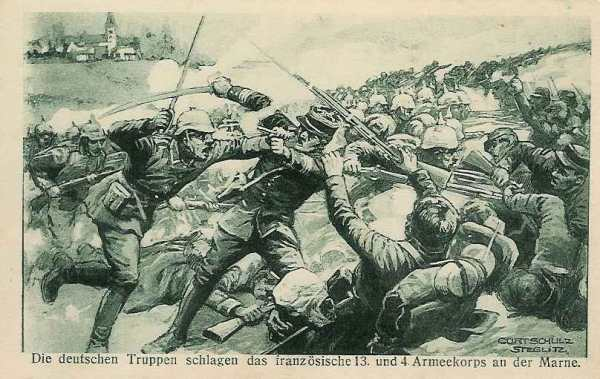
_Revers des 13e et 4e C.A. français_
_Collection privée_

**[Lien vers carte situation au 9 septembre](../img/schlacht_ourcq_9_september.jpg)**

**9h :**

L’aile droite du 9e C.A. avance au sud de Crépy-en-Valois pour tenter une attaque enveloppante.

**10h30 :**

Von der Marwitz a été attaqué par les Anglais qui ont franchi la Marne entre Luzancy et Nogent-l’Artaud, mais a réussi à les contenir.

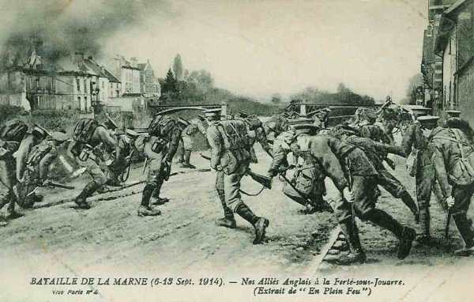
_L’armée anglaise à La Ferté-sous-Jouarre_
_Collection privée_

**11h :**

La 5e division d’infanterie allemande se porte vers Dhuisy à la rencontre des Anglais qui ont franchi la Marne. La Ie armée allemande risque d’être prise en tenaille entre la VIe armée et l’armée anglaise.

**12h :**

La situation de la Ie armée est favorable mais à ce moment arrive le colonel Hentsch, envoyé par l’O.H.L. Il traite avec von Kühl, chef d’E.M. de la Ie armée et demande de replier l’armée. En effet, suite au déplacement du gros de l’armée de von Kluck vers le front de l’Ourcq, une brèche s’est créée entre la Ie et la IIe armée allemande.

Von Kluck donne l’ordre à l’armée de se retirer vers Soissons afin de couvrir le flanc des armées allemandes, sur la ligne Gondreville - Crépy-en-Valois - La Ferté-Milon et la ligne de l’Ourcq.

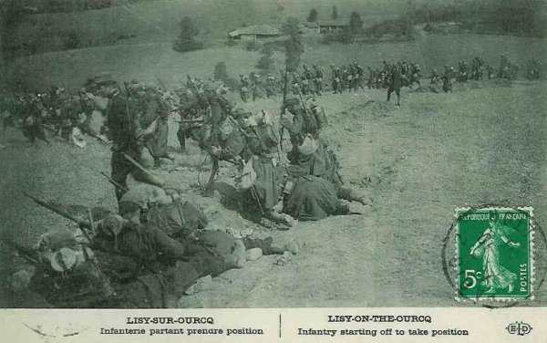
_Infanterie prête à l’attaque à Lizy-sur-Ourcq_
_Collection privée_

**14h :**

Etrepilly, Torcy et Vareddes sont évacués.

Alors qu’elles étaient prêtes à battre la VIe armée, les troupes allemandes entament leur repli. Les Français tiennent la ligne qui va de Chambry - Vareddes - Etrepilly - Puisieux - Acy-en-Multien - Nanteuil-le-Haudouin. Ils sont surpris de cette retraite.

### 10 septembre

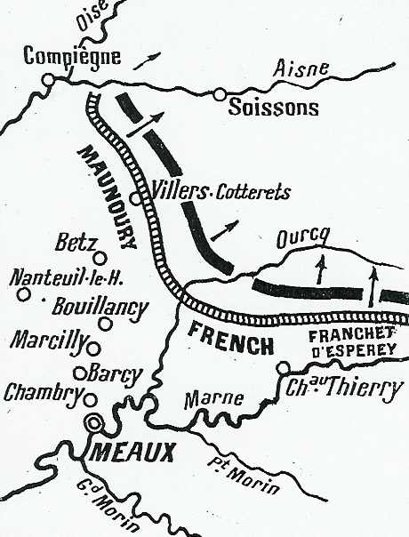
_Position des armées le 10 septembre_

**[Lien vers les positions au 10 septembre](../img/10septembre_gallieni.jpg)**

L’armée française entame la poursuite des armées allemandes en retraite vers Soissons.

**En matinée :**

Les 9e et 3e C.A. allemands refluent en direction de l’Aisne.

Le gros de la Ie armée s’arrête au nord des forêts de Villers-Cotterêts. L’arrière-garde est entre Crépy-en-Valois et Grumilly.

### Conclusion

La bataille de la Marne est le sursaut d’une armée battue sur les frontières et en retraite. Elle n’aurait pas été possible si le plan Schlieffen avait été respecté par von Moltke et par ses commandants d’armée. Ce plan prévoyait que la Ie armée passe à l’ouest de Paris, en réalisant un immense mouvement d’enveloppement autour des armées alliées. Au lieu de cela, von Kluck, qui rêvait d’en découdre avec l’armée anglaise, l’a poursuivie depuis la frontière belge et, espérant l’encercler, est passé à l’est de Paris.

Ce faisant, il a présenté son flanc droit aux troupes de Paris et un esprit vif comme celui de Galliéni a immédiatement saisi la chance qui s’offrait. Il fallait vite saisir cette opportunité, car von Kluck avait donné l’ordre le 5 septembre à ses corps d’armée de remonter vers le nord.

La bataille de l’Ourcq, qui a marqué un tournant dans la Grande Guerre a été possible :

- Parce que les armées allemandes sont passées à l’est de Paris.

- Parce que von Kluck n’a pas obéi aux ordres de von Moltke de rester en retrait d’un jour de marche par rapport aux armées voisines.

- Parce que Joffre, en rectifiant les erreurs initiales du plan XVII, a transféré par voie de chemin de fer des corps d’armée vers l’ouest, en les prélevant sur les armées de l’est pour constituer la VIe armée.

- Parce que Joffre a été conseillé par Galliéni, qui a pu saisir l’opportunité qui se présentait.

- Et enfin parce-queles troupes françaises, épuisées par la retraite, ont malgré tout pu attaquer. von Kluck a dit d’elles :
"Que des hommes ayant reculé pendant dix jours, que des hommes couchés par terre et à demi-morts de fatigue puissent reprendre le fusil et attaquer au son du clairon, c’est là une chose avec laquelle nous n’avions jamais appris à compter".

Attaqué de flanc, von Kluck a dû faire remonter ses C.A. vers le nord pour contrer la menace, créant une brèche entre son armée et celle de von Bülow, brèche masquée par un rideau de cavalerie.

Les armées allemandes auraient pu être défaites et reconduites à la frontière si l’armée anglaise et la Ve armée française avaient franchi la Marne plus rapidement et exploité la brèche entre la Ie et la IIe armée allemande. Les Allemands vont effectuer une retraite planifiée vers des positions favorables et vont s’y retrancher. Ce sera le début de la guerre de positions.

### Souvenir de la bataille

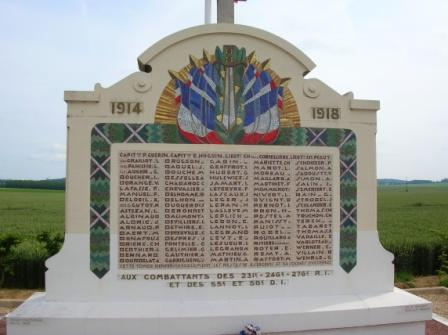
_Villeroy - monument du cimetière_
_Photo de l’auteur_

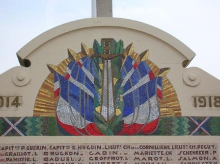
_Villeroy - monument du cimetière (détail)_
_Photo de l’auteur_

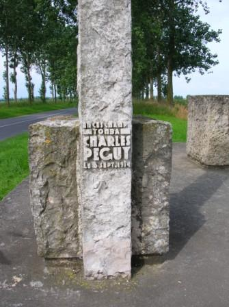
_Villeroy - monument de Charles Péguy_
_Photo de l’auteur_

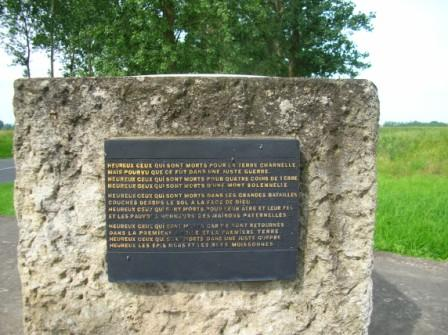
_Villeroy - monument de Charles Péguy_
_Photo de l’auteur_

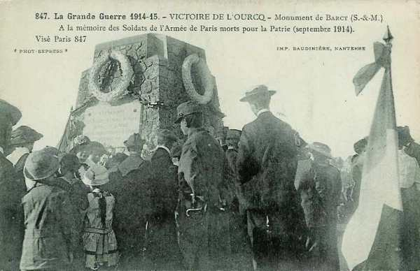
_Monument de Barcy_
_Collection privée_

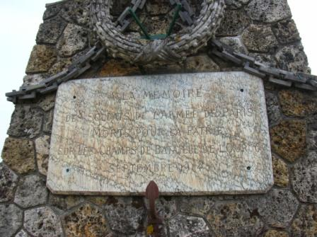
_Barcy - monument_
_Photo de l’auteur_

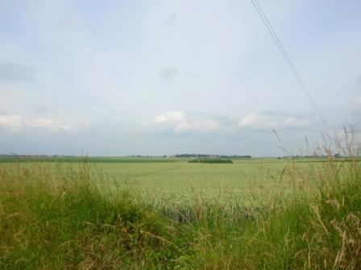
_Penchard - vue vers Villeroy_
_Photo de l’auteur_

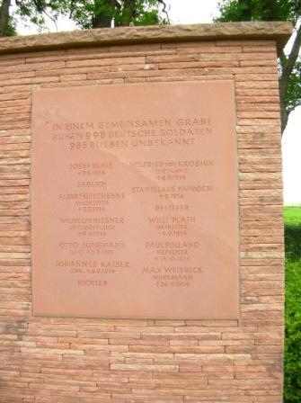
_Chambry - cimetière allemand_
_Photo de l’auteur_

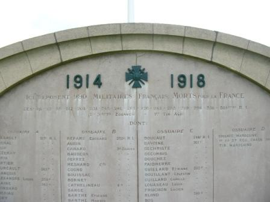
_Chambry - cimetière français_
_Photo de l’auteur_

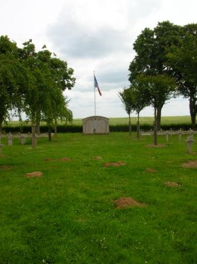
_Chambry - cimetière français_
_Photo de l’auteur_

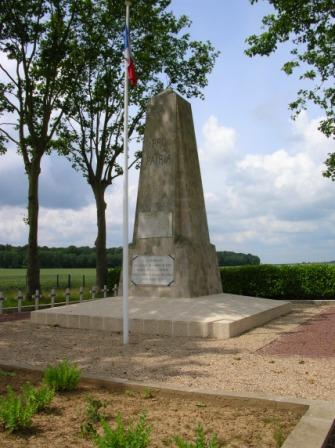
_Betz - monument_
_Photo de l’auteur_

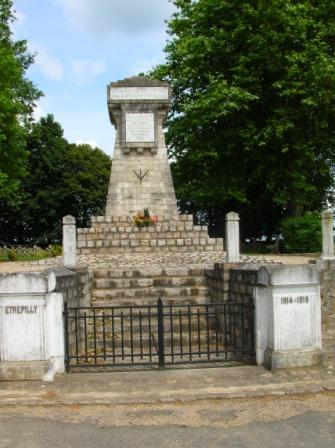
_Etrepilly - monument_
_Photo de l’auteur_

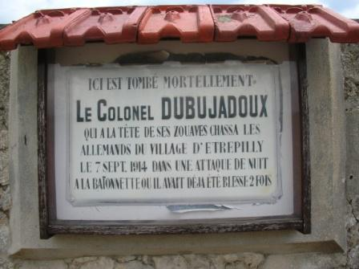
_Etreplly - plaque pour le coloel Dubujadoux_
_Photo de l’auteur_

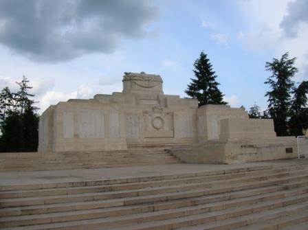
_La Ferté-sous-Jouarre - monument anglais_
_Photo de l’auteur_