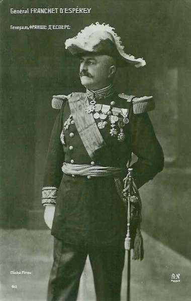
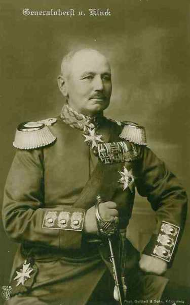
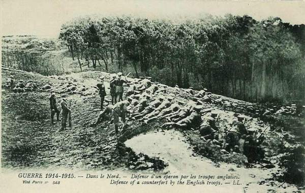
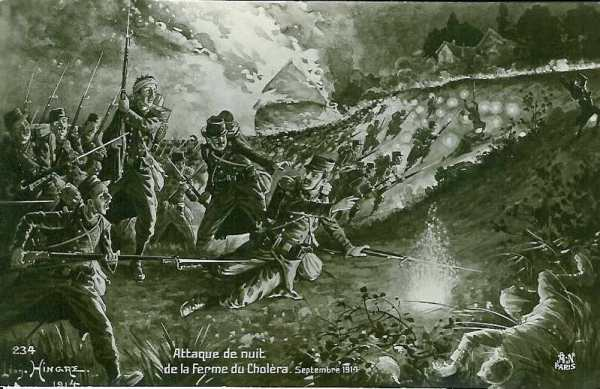
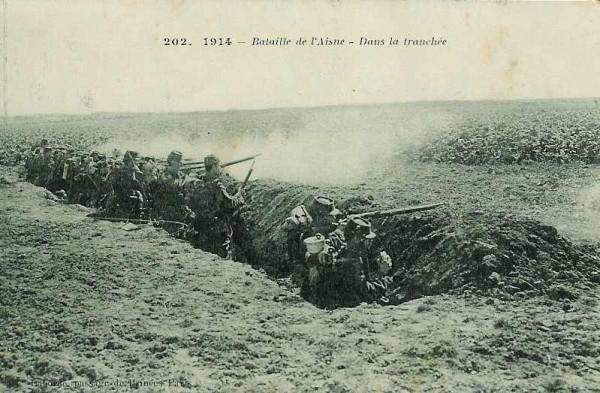
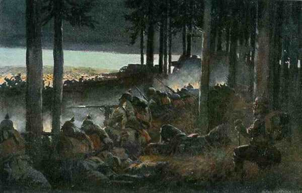
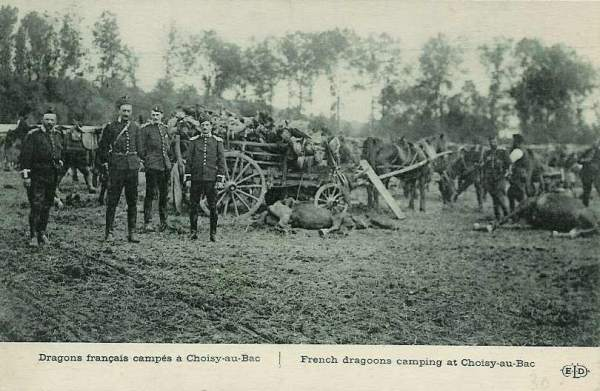
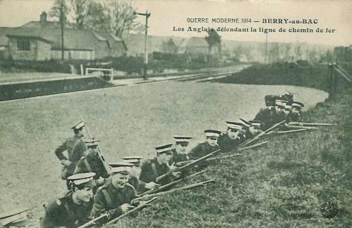

# Première bataille de l’Aisne (13 - 28 septembre 1914)

Vaincus sur la Marne, les Allemands opèrent une retraite systématique, sous le commandement de von Falkenhayn, et s’arrêtent sur un terrain qui leur est favorable pour résister, notamment le long de l’Aisne. Cette rivière est dominée par des falaises abruptes, creusées de galeries, offrant une position dominante sur un assaillant. Les alliés vont essayer vainement de les en déloger. Ils ne parviendront pas non plus à contourner cette position en s’emparant de Noyon. La bataille de l’Aisne marque la transition, dans ce secteur, entre la guerre de mouvement et la guerre de tranchées.

### Le prélude de la bataille

Après la victoire alliée de la Marne, les Allemands doivent opérer une retraite.

La VIe armée française (Maunoury) reste depuis le soir du 9 septembre maîtresse du champ de bataille de l’Ourcq. Von Kluck se replie vers le nord-est. La VIe armée a reçu mission de gagner le nord en appuyant sa droite sur l’Ourcq. Elle marche vers Compiègne - Soissons. Le 11, elle porte ses avant-gardes sur Pierrefonds - Chaudun.

_Général Maunoury (VIe armée)_
_Collection privée_

Le 12, la gauche de l’armée tente de franchir l’Oise à Verberie, la droite borde l’Aisne, assurant la liaison avec les Anglais. A 19h, le front atteint par l’armée s’étend sur le plateau occidental entre Aisne et Oise, vers Tracy-le-Mont - Moulin-sous-Touvent - Vingré - Nouvion et sur les bords de l’Aisne, de Fontenoy à Soissons.

Les Anglais sont arrivés à peu près à la même heure sur la rive gauche de l’Aisne qu’ils comptent passer entre Soissons et Bucy-le-Long. Le 1e C.A. (Haig) vise Bourg-et- Comin, le 2e (Smith-Dorrien), Vailly et le 3e (Pulteney), Bucy-le-Long. D’après certains indices, French se forme l’opinion que les Allemands ont suspendu leur retraite  et se préparent à disputer le passage de l’Aisne.

La Ve armée (Franchet d’Esperey) vient de bousculer le 9 septembre le 2e C.A. allemand autour de Montmirail et entame la poursuite, le 18e C.A. à gauche, le 3e au centre et le 1e à droite. Il a atteint la Marne à Château-Thierry mais la nécessité de soutenir la IX armée (Foch) l’a empêché de poursuivre vers le nord.

Le 11 au soir, le 18e C.A. arrive dans la région de Fismes. Franchet d’Esperey oriente le 3e C.A. vers Saint-Thierry et Thillois en direction de Brimont et le 1e C.A. vers Reims.

Dans la journée du 11, le 3e C.A. enlève les hauteurs de aint-Thierry, au nord-ouest de Reims et les 1e et 10e C.A. poussent leurs avant-gardes jusqu’aux faubourgs de la ville. Le 18e C.A. est arrêté à Fismes et doit ouvrir le passage pour pousser de l’autre côté de l’Ailette jusqu’au château de La Bove. Les Français pensent que la résistance qu’ils commencent à rencontrer n’a pour but que de gagner du temps.
Le 12, de Maud’huy porte sa 35e division sur Fismes et à 15h, les ponts sur l’Ailette sont enlevés et le 18e C.A. marche sur l’Aisne.

- Le 12 au soir,
  L’extrême gauche de Maunoury franchit l’Oise, les autres éléments ont passé l’Aisne, de Choisy-au-Bac à Fontenoy et l’extrême droite est arrêtée de Fontenoy à Soissons.

- L’armée anglaise garnit les plateaux  au sud de l’Aisne, qu’elle compte passer entre Soissons et Oeuilly.

- La Ve armée est dirigée vers le nord-est, son 18e C.A. peut déboucher entre Pontavert et Berry-au-Bac, son 3e C.A. est en face de Brimont, son 1e C.A. est dans les faubourgs de Reims et son 10e C.A. est en face de Berru et de la Pompelle.

_Général Franchet d’Esperey  (Ve armée)_
_Collection privée_

Le 11 septembre, la Ie armée allemande (von Kluck) bat en retraite dans la direction nord-est, entre l’Oise et la ligne Braine - Laon. La IIe armée opère sa retraite à l’est de la Ie armée, sans parvenir à recréer la liaison.

_Général von Kluck (Ie armée)_
_Collection privée_

Le 12, la Ie armée s’étend de l’Oise à la ligne de chemin de fer Soissons - Laon ; la IIe armée occupe les plateaux entre Soissons et Corbeny ; la IIIe armée (von Hausen) prolonge la IIe armée entre la région de Reims et la Suippe.

### Le terrain

Le Chemin des Dames est une crête de 30 km de long, entre l’Aisne et l’Ailette. Les falaises abruptes sont exploitées depuis très longtemps et comportent de nombreuses cavernes qui constituent de redoutables positions défensives, à l’abri des tirs d’artillerie. La plus connue est la Caverne du Dragon.

Joffre, connaissant le caractère inexpugnable des falaises de l’Aisne, est persuadé que cet obstacle doit être tourné soit à l’est soit à l’ouest. En fait, il fonde ses principaux espoirs sur la manœuvre vers l’ouest. Le massif sera tourné par l’armée de Maunoury (VIe) qui doit engager son gros dans la vallée de l’Oise.

### 12 et 13 septembre

**Ve armée française** :

L’armée d’Esperey se trouve devant un coude du front : il lui faut faire face au nord et à l’est. Etant liée à la IXe armée, sa liberté de marche au-delà de l’Aisne est réduite.

**[Lien vers carte](../img/aisne_5e_armee.jpg)**c Michelin, d’après carte n° 56, édition 1937 - autorisation n° 05-B-18

Seuls Maud’huy et Valabrègue sont dans la bonne direction. Le premier a d’abord pensé s’engager dans la direction d’Amifontaine mais les Allemands paraissent s’installer sur le massif. Le 18e C.A. reçoit l’ordre de porter ses gros dans la région de Corbeny - Craonne - Pontavert - Roucy - Beaurieux. Le C.C. placé à sa droite est lancé vers le camp de Sissonne et le groupe Valabrègue doit s’engager dans la région de Juvincourt.

A 14h, la 70e brigade, ayant passé l’Aisne à Pontavert, se dispose à attaquer Corbeny et Craonne.

A 15h, le 5e chasseurs d’Afrique enlève d’un coup de main le pont de Maisy avant que les Allemands aient eu le temps de le détruire et elle aborde les bois de Beaurieux et Craonnelle. Si elle était apparue cinq heures plus tôt, elle aurait trouvés abandonnés Hurtebise et le plateau de Vauclerc car les Allemands s’étaient jetés de l’autre côté de l’Ailette. Ils avaient ensuite réoccupé les positions et après un violent combat, l’infanterie doit s’arrêter à la lisière nord du bois, au sud d’Oulches et de Craonnelle.

A 19h, Corbeny est enlevé, puis Craonne par la 70e brigade.
Le reste de la Ve armée attaquent sur le front Brimont - Berru - Nogent-l’Abesse  (3e et 2e C.A.)

**VIe armée française** :

Maunoury se trouve aux prises avec de grandes difficultés : le gros de ses forces, qui a passé l’Aisne les 12 et 13, est engagé sur l’énorme plateau occidental. Ebener et Vautier se heurtent à une forte résistance allemande, appuyée par l’artillerie lourde. Le groupe Lamaze n’a pas pu franchir le 13 l’Aisne entre Fontenoy et Soissons. Sur le plateau occidental, les C.A. engagés avancent lentement. La 37e division a toutefois franchi l’Oise à Verberie ; le 4e C.A. cherche à franchir la rivière à Plessis-Brion, Pimprez et Ourscamp.

**[Lien vers carte](../img/aisne_6e_armee.jpg)**c Michelin, d’après carte n° 56, édition 1937 - autorisation n° 05-B-18

Les divisions de Lamaze doivent tenter de franchir l’Aisne, la 56e à Pommiers, la 55e au sud de Pasly. La 45e doit se jeter sur Cuffies, en liaison avec l’armée anglaise. Le génie parvient à jeter des passerelles devant Soissons et, sur ces passages, la 45e division puis la 289e brigade de la 55e division atteignent la rive droite (nord) mais ces troupes se trouvent trop hasardées pour tenter d’attaquer des positions bien défendues.

**Armée anglaise** :

Le 2e C.A. de l’armée anglaise a trouvé devant lui des ponts détruits sauf celui de Condé, tenu par les Allemands. Le 1e C.A. a pu passer l’eau à Missy : une des brigades a pu s’établir à Sainte-Marguerite, au nord-est du Bucy-le-Long. Le 3e C.A. a devant lui le pont intact de Venizel et la 12e brigade a pu franchir la rivière.

**[Lien vers carte](../img/aisne_armee_anglaise.jpg)**c Michelin, d’après carte n° 56, édition 1937 - autorisation n° 05-B-18

### 14 septembre

**Ve armée française** :

Les soldats de Maud’huy s’apprêtent à donner l’assaut au moulin de Vauclerc et à la ferme d’Hurtebise mais les Allemands se sont renforcés.

A 11h30, de fortes colonnes allemandes se dirigent vers Corbeny qui, violemment bombardé, doit être abandonné.
A gauche, la 36e division enlève le plateau de Vauclerc.
Valabrègue, quant à lui, a été beaucoup moins heureux. Il n’a pas pu se défendre à l’est de Berry-au-Bac, laissant le C.A. de Maud’huy en flèche.

**VIe armée française** :

Le 7e C.A. piétine en face de la ligne Puisieux - Vingré - Fontenoy - Nouvron. Nampcel, fortement tenu, résiste. Il faudrait que le 4e C.A., à la gauche du 7e, attaque sur le plateau à l’ouest de Nampcel, sur Puiseleine et Tracy-le-Mont.

**Armée anglaise** :

L’armée anglaise entend, avant d’attaquer, que les ponts soient assez solides pour que l’artillerie puisse suivre immédiatement l’infanterie.

Le travail du génie est pénible : les obus pleuvent et le temps est pluvieux, ce qui rend les abords de la rivière vaseux. Néanmoins, après 48 heurs de travail acharné, huit ponts de bateaux sont établis et une passerelle est jetée, les trois ponts carrossables de Venizel, Missy et Vailly sont réparés et le pont de chemin de fer entre Vailly et Chavone rétabli.

### 15 septembre

**Ve armée française** :

Franchet d’Esperey tente un grand effort sur tout le front. Le 1e C.A. enlève le château de Brimont mais au centre, Valabrègue continue à marquer le pas et devant de fortes attaques allemandes, de Maud’huy est appelé à la rescousse.

Les Allemands attaquent sur La Ville-aux-Bois (est de Craonne) et ce village est perdu.

Au centre, une autre attaque allemande se produit au nord de Craonne et l’on doit se replier sur le bourg.

A gauche, en revanche, la brigade Pichon, descendant du plateau, lance ses éléments sur Ailles, dans la vallée de l’Ailette.

Sur ces entrefaites, Valabrègue perd ses positions de la rive gauche et la situation de Maud’huy devient difficile.

**VIe armée française** :

L’attaque  du plateau échoue. L’espoir réside dans le 13e C.A., en marche dans la vallée de l’Oise. S’il réussit à faire tomber Noyon et s’emparer de Saint-Quentin, le mouvement enveloppant s’amorcerait et la résistance sur le plateau tomberait.

En fait, les Allemands massent leurs troupes, résolus à barrer la route à Maunoury. Ce dernier se heurte aux 9e, 2e, 4e et 3e C.A., au 4e C.A.R., soit toute l’armée de von Kluck. Les Allemands sont résolus à résister sur le plateau.

**Armée anglaise** :

French décide de faire avancer ses troupes mais il ne sait pas si les Allemands marquent simplement un arrêt temporaire couvert par de fortes arrière-gardes. L’attaque revient au 1e C.A. (Haig).

Le C.A. de Haig doit attaquer le plateau de Chivy, au nord de Pont Arcy. A 3h du matin, les fusiliers du Roi et la royal Sussex se portent en avant, tandis que le Northampton Regiment est dirigé à droite sur l’éperon est de Troyon, et le Royal North Lancashire sur Vendresse. La droite de Haig s’appuie sur le plateau de Paissy.
Des engagements assez âpres ont lieu sur le plateau. Les Allemands sont finalement rejetés à la baïonnette.

A gauche, la 5e brigade est engagée à l’ouest du plateau de Chivy, dans la direction de Courtecon et la 6e brigade, franchissant la rivière à Pont-Arcy, remonte le ravin entre le plateau d’Ostel et de Chivy. Les Allemands les criblent de projectiles d’artillerie lourde puis se jettent entre les deux C.A. anglais pour les séparer.

Haig se dégage puis, voyant faiblir les attaques allemandes, ordonne une nouvelle avance et arrive à quelques centaines de mètres du Chemin des Dames au nord-est de Chivy. Il appuie sa droite au 18e C.A. français.

Le reste de l’armée anglaise (2e et 3e C.A.) a franchi l’Aisne, le 2e à Vailly et à Mezy, le 3e à Venizel et l’artillerie des deux C.A. s’installe au sud de Montreuil et au nord de Celles-sur-Aisne.

En fin de journée, les Anglais ont perdu 5000 hommes. French se rend compte que le 7e C.A. allemand, arrivant de Maubeuge, vient en renfort de l’armée et qu’une grande partie des pièces de siège renforcent la position allemande.

French se contente de faire organiser les positions. Le 1e C.A. reste au sud du Chemin des Dames, le 2e au sud de Chivres, le 3e le long de l’Aisne.

_Défense d’un éperon rocheux par les troupes anglaises_
_Collection privée_

### 16 septembre

**Ve armée française** :

Le 18e C.A. reprend ses attaques, appuyé par le 1e et le groupe Valabrègue peut aller de l’avant. Maud’huy s’apprête à agir dans la trouée entre Craonne et Prouvais lorsque Craonne, violemment attaqué et écrasé par l’artillerie lourde, doit être abandonné. L’offensive sur Prouvais est compromise : il faut pour cela	 reprendre Craonne et Corbeny. La brigade Passaga est chargée de cette mission.

**VIe armée française** :

Les Allemands opposent une résistance acharnée. L’attaque du 7e C.A. ne peut progresser et le 4e C.A. est obligé de se replier sous la menace d’une contre-attaque. Ce repli met en péril la 37e division qui occupe Cuts et se trouve en flèche. La brigade marocaine est lancée sur Carlepont, localité située au nord-ouest du plateau et dernière position défensive des Allemands.

Maunoury espère que le 13e C.A. pourra s’emparer de Noyon, les Allemands seraient alors pris entre deux feux.
Carlepont est pris par les Français et une contre-attaque allemande est repoussée par les Marocains. La 37e division se dirige sur Blérancourt.

En soirée, les cavaliers du C.C. Bridoux patrouillent dans la direction de Saint-Quentin.

La brigade marocaine doit se jeter à l’assaut. Elle s’élance contre la croupe 132 et enlève une partie des tranchées allemandes mais est arrêtée par des barrages à 300 m au sud de la ferme La Perrière. Les 45e et 55e divisions, derrière elle, essaient en vain de progresser. Ordre leur est donné de se fortifier sur les positions conquises.

Les batteries lourdes allemandes, bien défilées, couvrent Soissons de projectiles.

### 17 septembre

**G.Q.G.** :

Au matin, le sort de la bataille, engagée entre Noyon et Reims, tient au succès de l’extrême aile gauche, le 13e C.A. Si celui-ci enlève Noyon et marche sur Saint-Quentin, l’armée allemande sera contrainte d’abandonner l’extrême bord du plateau occidental de l’Aisne. Si les Français se rendent maîtres de Noyon, ils peuvent tourner le plateau occidental, de Noyon à La Fère. L’armée allemande devrait dans ce cas se replier sur Laon.

Mais la capitulation de Maubeuge a libéré le 7e C.A., qui vient en renfort aux armées de von Kluck et de von Bülow, de même que toute l’armée de von Heeringen (VIIe), retirée du front de l’Alsace.

Joffre insiste dans la soirée du 16 pour que le 13e C.A. marche sur Noyon, sur Guiscard, sur Vilquier-Aumont. Ainsi, les positions allemandes de Carlepont et de Cuts seraient tournées.

Le C.C. Conneau, alors à Compiègne, est mis à la disposition de Maunoury.

**Ve armée française** :

A la fin de la nuit, de Maud’huy jette la brigade Passaga sur Craonne, mais l’attaque s’égare.

A l’autre extrémité de la ligne, la brigade Brulard attaque sur la croupe qui, de la ferme du Choléra au Camp de César domine l’Aisne au nord-est de Berry-au-Bac. L’attaque est dispersée par des feux d’artillerie et de mitrailleuses partant des lisières sud de La Ville-aux-Bois.

_Attaque de la ferme du Choléra_
_Collection privée_

Au matin, le 18e C.A., loin de pouvoir attaquer, se trouve aux prises avec une violente attaque allemande, entre Juvincourt et La Ville-aux-Bois. Pontavert est menacé alors que la gauche de l’armée est encore en ligne, du Chemin des Dames à l’ouest d’Hurtebise.

La gauche de Maud’huy est également attaquée : la ferme d’Hurtebise est visée, mais la 38e division tient bon, de la Creute au poteau d’Ailles et reste toujours à cheval sur le Chemin des Dames, dominant la vallée de l’Ailette. Les Français espèrent en vain l’intervention des Anglais pour les soutenir.

Dans la nuit du 17 au 18, le 3e C.A. perd le château de Brimont.

Le 18e C.A. est réduit à la défensive : les Anglais préviennent que de fortes colonnes sont en marche entre Chamouille et Vendresse.

**VIe armée française : combats pour Noyon** :

Devant le 13e C.A. en marche sur Noyon, il n’y a au matin que deux divisions allemandes, mais la pluie ne cesse de tomber de 9h du matin à la chute du jour. La boue empêtre la marche du C.A. Les Allemands disposent d’une forte artillerie lourde à laquelle les Français ne peuvent opposer que leurs canons de campagne de 75.

Dès la matinée, le 13e C.A. se heurte à une contre-offensive allemande, qui se développe sur toute la ligne de l’Oise à Reims.

Le 13e C.A. est refoulé d’Elicourt sur Vaudelicourt (sud et sud-ouest de Noyon) et Vignemont, à sa gauche, ne parvient pas à passer Dressincourt et l’Ecouvillon.
La 37e division est attaquée violemment à Cuts et doit se replier.

Maunoury ne renonce pas. Il prend des mesures pour que le 4e C.A. soit porté à gauche du 13e et appuie la marche sur Noyon.

**Armée anglaise** :

Le flanc de la 1e division est menacé mais une contre-attaque du régiment Northampton déblaie le terrain : il se glisse à la faveur du brouillard à une centaine de mètres des tranchées allemandes, met la baïonnette au canon et refoule ses adversaires. Trois attaques allemandes sont ensuite repoussées.

### 18 septembre

**G.Q.G.** :

Joffre est plus que jamais décidé à obtenir la décision vers Noyon. Il pense que la manœuvre doit prendre, avec des forces supérieures, une plus large envergure.
Il décide le transfert, à gauche de la VIe armée, de la IIe armée (Castelnau), à laquelle seront rattachés les 13e et 4e C.A., repris à la VIe armée.

**VIe armée française** :

Maunoury espère toujours faire aboutir la manœuvre de débordement. Le général Ebener réoccupe la ligne Bailly - Tracy-le-Val - Bois de la Montagne et le 4e C.A. gagne la vallée de l’Oise par Compiègne pour prêter main forte au 13e C.A.

**Armée anglaise** :

Les Allemands attaquent violemment mais sans succès la droite du 2e C.A., puis la gauche du 1e et sont repoussés, mais les pertes des Anglais sont telles que French décide de n’entreprendre aucune offensive, comptant que le plateau sera dégagé grâce à l’offensive de la VIe armée.

### 19 septembre

Il continue à tomber une pluie torrentielle, ce qui rend la marche pénible.

**IIe armée française** :

La manœuvre de débordement passe au général Castelnau, qui jette ses forces dans la région de Lassigny (ouest de Noyon).

**Ve armée française** :

Entre dix heures et onze heures trente, une attaque allemande se produit mais les Allemands sont rejetés sur l’Ailette.

**VIe armée française** :

L’attaque dans la vallée de l’Oise sur la ligne Lassigny - Guiscard ne pourra se produire que le 20. Les munitions commencent à manquer.

### 20 septembre

**Ve armée française** :

Le C.A. de Maud’huy est attaqué avec une violence sans précédent, de l’aube au soir par deux C.A. allemands. L’isthme d’Hurtebise (nord-ouest de Craonne) est âprement disputé. A 16h, les Allemands reprennent pied sur le Chemin des Dames. En fin de journée, le plateau du moulin de Vauclerc est dans les mains allemandes.

**VIe armée française** :

Le centre de Maunoury est violemment attaqué et l’armée tient le front entre Tracy-le-Mont au nord-ouest et Fontenoy au sud-est.

### 21 septembre

**VIe armée française** :

La contre-offensive allemande est bloquée entre Tracy-le-Mont et Moulin-sous-Touvent. Les troupes reçoivent l’ordre de se retrancher, ce qui indique un tournant de la grande guerre.

_Les premières tranchées à la bataile de l’Aisne_
_Collection privée_

**Armée anglaise** :

Seul le 1e C.A. est réellement engagé. Son front s’étend du nord de Vailly au Chemin des Dames, en rejoignant le 18e C.A. français. Le reste de l’armée anglaise marque le pas au pied de la falaise de Vailly à  Bucy-le-Long.

**O.H.L.** :

Les Allemands, qui espéraient reprendre leur marche sur Paris, se rendent compte que l’armée française offre une telle résistance qu’il n’est pas possible « de la déraciner ».

### 22 septembre

Les alliés sont dominés par l’artillerie allemande de gros calibre, ce qui provoque un sentiment d’impuissance. L’artillerie de campagne française au tir tendu ne peut que difficilement battre les positions de l’artillerie allemande mais l’infanterie essuie d’une manière continue et intense le feu de l’artillerie lourde.

**G.Q.G.** :

Joffre prescrit une nouvelle tactique : « renoncer aux attaques générales qui usent les troupes sans résultat sérieux et procéder à des attaques locales exécutées en accumulant les moyens d’action sur les points choisis ».

**VIe armée française** :

Maunoury tente une attaque pour nettoyer le plateau oriental et demande l’appui de Castelnau, qui lance ses troupes de Lassigny, et de French, qui fait savoir qu’il est disposé à attaquer en liaison avec la VIe armée, mais uniquement si l’offensive est générale.

Maunoury maintient toutefois sa résolution :
Vautier attaquera sur Nampcel et Vingré, Ebener sur Moulin-sur-Touvent, Puiseleine et Tracy-le-Val, Lamaze sur les collines au nord de Soissons.

_Combats autour de Soissons_
_Collection privée_

**O.H.L.** :

Les Allemands n’entendent pour rien au monde laisser prendre de nouvelles positions aux alliés sur les plateaux, et qu’un point quelconque du Chemin des Dames reste dans les mains alliées.

Au centre, ils s’efforcent de maintenir les adversaires au pied de la falaise de Vailly à Fontenoy, adossés à l’Aisne et placés jour et nuit sous leur feu. Ils maintiennent dans le secteur des forces imposantes, soit onze C.A. entre Noyon et Reims. Les villages, fermes, buttes et terrasses sont fortifiés, en constituant un front inexpugnable.

### 23 septembre

**Ve armée française** :

Franchet d’Esperey tente une avance de ses C.A. :

- Le 18e sur Craonne
  Le 1e sur La Ville-au-Bois et la ferme du Choléra
  Le groupe Valabrègue sur les hauteurs est de Berry-au-Bac.

Cette attaque ne fait que des progrès insignifiants.
Le 18e C.A. continue à tenir les positions conquises de la ferme d’Hurtebise aux lisières sud de Craonne ; le 1e C.A. entame les bois de Ville-au-Bois, prend la ferme du Choléra. et récupère Berry-au-Bac.

**VIe armée française** :

L’offensive prescrite par Maunoury débute dans la boue et le brouillard. Presque partout, sauf à Tracy-le-Val, les troupes françaises sont arrêtées.

**Armée anglaise** :

Les Anglais restent dans leurs tranchées en attendant que le 18e C.A. fasse des progrès significatifs.

### 24 septembre : la crise des munitions

**G.Q.G.** :

Joffre est contraint d’avertir les généraux d’armée que les munitions d’artillerie vont manquer si on ne les ménage pas. Si la consommation continue, il sera impossible de continuer la guerre dans quinze jours.

**Ve armée française** :

Franchet d’Esperey constate que son armée est en flèche par rapport aux armées voisines et qu’elle doit se borner à consolider ses positions.

_Dragons français à Choisy-au-Bac_
_Collection privée_

**VIe armée française** :

Maunoury renonce à poursuivre son offensive, faute de résultats.

### 25 septembre

**G.Q.G.** :

Joffre apprend que Castelnau attaque à gauche et ordonne à nouveau à la VIe armée de soutenir l’action de la IIe armée.

**Ve armée française** :

Dans la nuit du 25 au 26, l’effort allemand se porte sur le flanc droit de la Ve armée : le 3e C.A. est attaqué entre Le Godat et Loivre, à l’ouest de Brimont et se défend avec énergie. Deux divisionnaires, sous le commandement du général Hache, vont s’illustrer : il s’agit à gauche de Pétain, commandant de la 6e division et à droite de Mangin, commandant de la 5e division. Les allemands, après avoir passé un instant le canal latéral de l’Aisne, sont refoulés sur l’autre rive.

L’armée est gardée sur son flanc droit par le 3e C.A. et peut supporter le suprême effort de la réaction allemande.

**VIe armée française** :

Maunoury donne l’ordre de pousser les attaques « avec la dernière énergie » du rebord nord-ouest du plateau occidental à la région de Crouy. Ces attaques sont sans résultat : partout, l’on constate les progrès énormes réalisés dans les travaux défensifs allemands.

**Armée anglaise** :

Pour couvrir leur mouvement vers l’ouest, les Allemands attaquent dans le secteur anglais. Un bombardement continuel et vigoureux persiste pendant la journée du 25 et les Allemands poussent des sapes vers les tranchées de la première division (Haig). Les anglais doivent arrêter les travaux d’approche par une offensive. Les Allemands contre-attaquent sans succès.

_Troupes anglaises défendant une ligne de chemin de fer à Berry-au-Bac_
_Collection privée_

**O.H.L.** :

Les Allemands tentent un suprême effort pour rompre le front français.

### 26 septembre

**Ve armée française** :

Le 18e C.A. est assailli. A tout prix, les Allemands veulent reprendre l’entrée du Chemin des Dames. Le C.A. de Maud’huy est attaqué sur tout son front.

- La 38e division repousse, au prix de fortes pertes, sur le plateau du Moulin de Vauclerc, l’assaut de forces supérieures.

- La 36e division fléchit un instant au sud d’Hurtebise mais reprend ses positions ; la 35e division repousse les attaques dans les lisières nord du bois de Beau Marais. Les Allemands ne parviennent pas à passer l’Aisne.

### 28 septembre

**G.Q.G.** :

Joffre adresse des félicitations aux troupes du général Franchet d’Esperey : « Depuis deux semaines, les troupes de la Ve armée, placées dans des conditions difficiles, repoussent victorieusement les attaques d’un ennemi supérieur en nombre dans des combats continuels de jour et de nuit. Elles ont montré, sous la conduite de chefs intrépides, une bravoure et un entrain qui ne se sont pas un instant démentis ».

Cet ordre du jour ferme la première bataille de l’Aisne.

### Epilogue

La bataille de l’Aisne marque un tournant dans la Grande Guerre en mettant fin, dans un important secteur, à la guerre de mouvement. Les Allemands cessent leur retraite en s’accrochant à une position inexpugnable : le Chemin des Dames. Ce n’est que trois ans plus tard que les français vont lancer dans ce secteur une offensive sous le commandement du général Nivelle, qui se soldera par une catastrophe : ce sera la deuxième bataille de l’Aisne. Il en résultera des mutineries dans l’armée française et le limogeage de Nivelle.