# Bataille de la trouée de Revigny (5 - 14 septembre 1914)

La bataille de la trouée de Revigny est un épisode lié à la bataille de la Marne, livrée à l’aile droite des armées françaises et mettant aux prises les IIIe et IVe armées contre l’aile gauche de la IIIe armée allemande (von Hausen), la IVe armée (duc de Wurtemberg et la Ve armée (kronprinz de Prusse). L’aile droite allemande est battue et von Moltke joue son va tout en essayant d’enfoncer le centre du dispositif français, ce qui rendrait caducs les succès remportés par les alliés sur l’Ourcq, mais il se heurte à la détermination des généraux de Langle de Cary et Sarrail.

### Les forces en présence

**Armée française**

Les IIIe et IVe armées françaises ont été remaniées depuis les batailles de Longwy et de Neufchâteau. Voici leur nouvelle composition.

**Ordre de bataille de la IVe armée française, général de Langle de Cary**

_Général de Langle de Cary (IVe armée)_
_Collection privée_

**2e C.A. : (Amiens), général Gérard**

_Général Gérard (2e C.A.)_
_Collection privée_

Ce C.A.,faisant partie de la Ve armée à la mobilisation, a été rattaché le 15 août à la IVe armée.

3e division : général Cordonnier

| Unité | Commandant | Régiments |
| --- | --- | --- |
| 5e brigade | Toulorge | 72e R.I. (Amiens)128e R.I. (Abbeville, Amiens) |
| 6e brigade | Caré | 51e R.I. (Beauvais)87e R.I. (Saint-Quentin) |
| Eléments divisionnaires |  | 19e régiment de chasseurs à cheval (un escadron)17e R.A.C. (La Fère) |

4e division : général Rabier

| Unité | Commandant | Régiments |
| --- | --- | --- |
| 7e brigade | Lejaille | 91e R.I. (Mézières)147e R.I. (Sedan) |
| 8e brigade |  | 45e R.I. (Laon)148e R.I. (Rocroi, Givet) |
| 87e brigade | Mangin | 120e R.I. (Péronne, Stenay)9e bataillon de chasseurs à pied (Lille, Longuyon)18e bataillon de chasseurs à pied (Amiens, Longuyon) |
| Eléments divisionnaires |  | 16e régiment de dragons (un escadron - Reims)42e R.A.C. (Stenay, La Fère) |
| Réserves |  | 272e R.I. (Amiens)328e R.I. (Abbeville, Amiens)29e R.A.C. (Laon) |

**12e C.A. : (Limoges), général Roques, futur ministre de la guerre**

_Général Roques (12e C.A.)_
_Collection privée_

23e division : général Masnon

| Unité | Commandant | Régiments |
| --- | --- | --- |
| 45e brigade | Arlabosse | 63e R.I. (Limoges)78e R.I. (Guéret, Limoges) |
| 46e brigade d’infanterie | Chéré | 107e R.I. (Angoulème)138e R.I. (Magnac-LAval, Bellac) |
| Eléments divisionnaires |  | 21e chasseurs à cheval (un escadron - Limoges)21e R.A.C. (Angoulème) |

24e division : général Descoings

| Unité | Commandant | Régiments |
| --- | --- | --- |
| 47e brigade | Jacquot | 50e R.I. (Périgueux)108e R.I. (Bergerac) |
| 48e brigade | Dubois | 100e R.I. (Tulle)126e R.I. (Brive-la-Gaillarde) |
| Eléments divisionnaires |  | 21e régiment de chasseurs à cheval (un escadron - Limoges)34e R.A.C. (Périgueux) |

**17e C.A. : (Toulouse), général Dumas**

33e division : général Guillaumat

| Unité | Commandant | Régiments |
| --- | --- | --- |
| 65e brigade |  | 7e R.I. (Cahors)9e R.I. (Agen) |
| 66e brigade d’infanterie | Bertaux | 11e R.I. (Montauban)
20e R.I. (Marmande, Montauban) |
| Eléments divisionnaires |  | 9e régiment de chasseurs à cheval (un escadron - Auch)18e R.A.C. (Agen) |

34e division : général Alby

| Unité | Commandant | Régiments |
| --- | --- | --- |
| 67e brigade | Dupuis | 14e R.I. (Toulouse)83e R.I. (Saint-Gaudens, Toulouse) |
| 68e brigade d’infanterie |  | 59e R.I. (Foix, Pamiers)88e R.I. (Mirande, Auch) |
| Eléments divisionnaires |  | 9e régiment de chasseurs à cheval (un escadron - Auch)23e R.A.C. (Toulouse) |

**C.A. colonial : (Paris), général Lefebvre**

_Général Lefèvre (C.A. colonial)_
_La guerre du droit_

2e division coloniale : général Leblois

| Unité | Commandant | Régiments |
| --- | --- | --- |
| 2e brigade coloniale |  | 4e R.I.C. (Toulon)8e R.I.C. (Toulon) |
| 4e brigade |  | 22e R.I.C. (Marseille)24e R.I.C. (Perpignan)6e régiment de dragons (un escadron - Vincennes)1e régiment artillerie coloniale |

3e division coloniale| : général Leblond

| Unité | Commandant | Régiments |
| --- | --- | --- |
| 1e brigade coloniale | Guérin | 1e R.I.C. (Cherbourg)2e R.I.C. (Brest) |
| 3e brigade coloniale | Lamolle | 3e R.I.C. (Rochefort)7e R.I.C. (Bordeaux) |
| Eléments divisionnaires |  | 6e régiment de dragons (un escadron - Vincennes)2e régiment d’artillerie coloniale |
| 5e brigade coloniale | Goullet | 21e R.I.C. (Paris)23e R.I.C. (Paris)3e régiment de chasseurs d’Afrique (Constantine)3e régiment d’artillerie coloniale (Lorient) |

**21e C.A. : (Epinal), général Legrand puis général Maistre à partir du 12 septembre**

_Général Legrand (21e C.A.)_
_Collection privée_

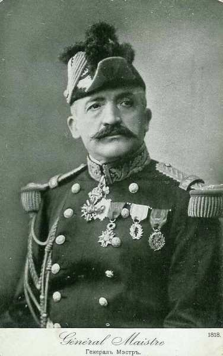
_Général Maistre_
_Collection privée_

13e division : général Baquet

| Unité | Commandant | Régiments |
| --- | --- | --- |
| 25e brigade | Barbade | 17e R.I. (Epinal)17e bataillon de chasseurs à pied (Rambervillers, Baccarat)20e bataillon de chasseurs à pied (Baccarat)21e bataillon de chasseurs à pied (Raon-L’Etape) |
| 26e brigade | Hamon | 21e R.I. (Langres)109e R.I. (Chaumont) |
| Elements divisionnaires |  | 4e régiment de chasseurs à cheval (un escadron - Epinal)62e R.A.C. (Epinal, Rambervillers) |

43e division : général Lanquetot

| Unité | Commandant | Régiments |
| --- | --- | --- |
| 85e brigade | Pillot | 158e R.I. (Bruyères, Corcieux)149e R.I. (Epinal) |
| 86e brigade | Olleris | 1e bataillon de chasseurs à pied (Senones)3e bataillon de chasseurs à pied (Saint-Dié)10e bataillon de chasseurs à pied (Saint-Dié)31e bataillon de chasseurs à pied (Saint-Dié) |
| Eléments divisionnaires |  | 4e régiment de chasseurs à cheval (un escadron - Epinal))12e R.A.C. (Bruyères, Saint-Dié) |
| Réserves |  | 57e bataillon de chasseurs à pied60e bataillon de chasseurs à pied61e bataillon de chasseurs à pied4e régiment de chasseurs à cheval (Epinal)59e R.A.C. (Chaumont) |

**Ordre de bataille de la IIIe armée française : général Sarrail**

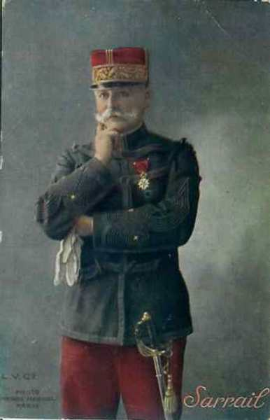
_Général Sarrail (IIIe armée)_
_Collection privée_

Cette armée met en ligne les unités suivantes :

**5e C.A. : (Orléans), général Micheler**

9e division : général Martin

| Unité | Commandant | Régiments |
| --- | --- | --- |
| 17e brigade | Marquet | 4e R.I. (Auxerre)82e R.I. (Montargis) |
| 18e brigade | Brissé | 113e R.I. (Blois)131e R.I. (Orléans) |
| Eléments divisionnaires |  | 8e régiment de chasseurs à cheval (un escadron - Orléans)30e R.A.C. (trois groupes - Orléans) |

10e division : général Gossart

| Unité | Commandant | Régiments |
| --- | --- | --- |
| 19e brigade | Gossart | 46e R.I. (Fontainebleau, Paris)89e R.I. (Sens, Paris) |
| 20e brigade | Coudein | 31e R.I. (Melun, Paris)76e R.I. Coulommiers, Paris) |
| Eléments divisionnaires |  | 8e régiment de chasseurs à cheval (un escadron - Orléans)6e R.A.C. (Valence, Grenoble) |
| Réserves |  | 313e R.I. (Blois)331e R.I. (Orléans)45e R.A.C. (Orléans) |

**6e C.A. : (Châlons-sur-Marne), général Verraux**

12e division : général Herr

| Unité | Commandant | Régiments |
| --- | --- | --- |
| 23e brigade | Huguet | 54e R.I. (Compiègne)67e R.I. (Soissons) |
| 24e brigade | Gramat | 106e R.I. 5châlons-sur-Marne)132e R.I. (Reims) |
| Eléments divisionnaires |  | 25e R.A.C. (trois groupes - Châlons-sur-Marne) |

10e division : général Leconte

| Unité | Commandant | Régiments |
| --- | --- | --- |
| 79e brigade | Fonville | 154e R.I. (Bar-le-Duc, Lérouville)155e R.I. (Châlons-sur-Marne, Commercy)26e bataillon de chasseurs à pied (Vincennes, Pont-à-Mousson) |
| 80e brigade | Feraudy | 150e R.I. (Soissons, Saint-Mihiel)160e R.I. (Neufchâtel, Toul)25e bataillon de chasseurs à pied (Epernay, Saint-Mihiel)29e bataillon de chasseurs à pied (Epernay, Saint-Mihiel) |
| Eléments divisionnaires |  | 40e R.A.C. (Saint-Mihiel) |
| Réserves |  | 301e R.I. (Dreux, Paris)302e R.I. (Chartres, Paris)304e R.I. (Argentan, Paris)12e régiment de chasseurs à cheval (quatre escadrons - Saint-Mihiel)40e R.A.C. (trois groupes - Saint-Mihiel) |
| 107e brigade | Estève |  |

**15e C.A. : (Marseille), général Espinasse**

_Général Espinasse (15e C.A.)_

29e division : général Carbillet

| Unité | Commandant | Régiments |
| --- | --- | --- |
| 57e brigade | Tocanne | 111e R.I. (Antibes)112e R.I. (Toulon) |
| 58e brigade | Gasguy | 3e R.I. (Hyères, Digne)141e R.I. (Marseille) |
| Elements divisionnaires |  | 6e régiment de hussards (un escadron - Marseille)55e R.A.C. (Orange) |

30e division : général Colle

| Unité | Commandant | Régiments |
| --- | --- | --- |
| 59e brigade | Marillier | 40e R.I. (Nîmes)58e R.I. (Avignon) |
| 60e brigade | Morgain | 55e R.I. (Aix-en-Provence, Pont-Saint-Esprit)61e R.I. (Aix-en-Provence, Privas) |
| Eléments divisionnaires |  | 6e régiment de hussards (un escadron - Marseille)19e R.A.C. (Angers) |
| Réserves |  | 38e R.A.C. (Nîmes)7e régiment d’artillerie à pied (Nice)10e régiment d’artillerie à pied (Toulon) |

**3e groupe de divisions de réserve (général Paul Durand)**

54e division de réserve : général Chailley

| Unité | Commandant | Régiments |
| --- | --- | --- |
| 107e brigade de réserve | Estève | 301e R.I. de réserve(Dreux, Saint-Cloud)302e R.I. de réserve (Chartres, Paris)303e R.I. de réserve (Alençon, Paris) |
| 108e brigade de réserve | Buisson d’Armandy | 324e R.I. de réserve (Laval)330e R.I. de réserve (Mayenne)363e R.I. de réserve (Nice) |

55e division de réserve : général Leguay

| Unité | Commandant | Régiments |
| --- | --- | --- |
| 109e brigade réserve | Arrivet | 204e R.I. de réserve (Auxerre)282e R.I. de réserve (Montargis)289e R.I. de réserve (Sens, Paris) |
| 110e brigade réserve | de Mainbray | 231e R.I. de réserve246e R.I. de réserve (Fontainebleau, Paris)276e R.I. de réserve (Coulommiers, Paris) |

56e division de réserve : général Micheler

| Unité | Commandant | Régiments |
| --- | --- | --- |
| 111e brigade réserve | de Dartein | 294e R.I. de réserve (Bar-le-Duc)354e R.I. de réserve (Bar-le-Duc, Lérouville)355e R.I. de réserve (Châlons-sur-Marne, Commercy) |
| 112e brigade réserve | Cornille | 350e R.I. de réserve (Soissons, Saint-Mihiel)351e R.I. de réserve (Cambrai, Saint- Mihiel) |

**65e division de réserve, général Bigot**

| Unité | Commandant | Régiments |
| --- | --- | --- |
| 129e brigade d’infanterie |  | 311e régiment d’infanterie (Antibes)312e régiment d’infanterie (Toulon)52e bataillon de chasseurs à pied (Villefranche)46e bataillon de chasseurs alpins (Nice)67e bataillon de chasseurs alpins (Villefranche) |
| 130e Brigade d’Infanterie |  | 203e régiment d’infanterie (Digne, Hyères)341e régiment d’infanterie (Marseille)47e bataillon de chasseurs alpins (Draguignan)63e bataillon de chasseurs alpins (La Bocca) |

**67e division de réserve, général Marabail**

| Unité | Commandant | Régiments |
| --- | --- | --- |
| 133e brigade d’infanterie |  | 211e régiment d’infanterie (Montauban)214e régiment d’infanterie (Toulouse)220e régiment d’infanterie (Marmande, Montauban) |
| 134e brigade d’infanterie |  | 259e régiment d’infanterie (Foix, Pamiers)283e régiment d’infanterie (Saint-Gaudens, Toulouse)288e régiment d’infanterie (Mirande, Auch) |

**75e division de réserve, général Vimard**

| Unité | Commandant | Régiments |
| --- | --- | --- |
| 149e Brigade d’Infanterie |  | 240e régiment d’infanterie (Nîmes)258e régiment d’infanterie (Avignon) |
| 150e Brigade d’Infanterie |  | 255e régiment d’infanterie (Pont-Saint-Esprit, Aix-en-Provence))261e régiment d’infanterie (Privas, Aix-en-Provence)) |

**Troupes de la défense de Verdun, général Heyman**

**7e D.C., général d’Urbal**

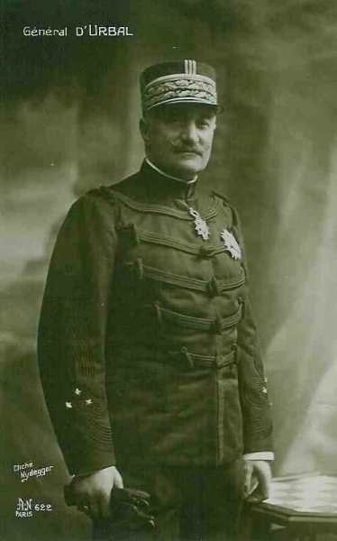
_Général d’Urbal (7e D.C.)_
_Collection privée_

| Unité | Commandant | Régiments |
| --- | --- | --- |
| 6e Brigade de Cuirassiers |  | 11e régiment de cuirassiers (Saint-Germain-en-Laye)12e régiment de cuirassiers (Rambouillet) |
| 1e Brigade de Dragons |  | 7e régiment de dragons (Fontainebleau)13e régiment de dragons (Melun) |
| 1e Brigade de Cavalerie Légère |  | 1er régiment de chasseurs à cheval (Chateaudun)20e régiment de chasseurs à cheval (Vendôme) |
| Éléments divisionnaires |  | 4e Groupe (10 et 11e Batteries à cheval) du 30e régiment d’artillerie de campagne (Orléans)7e Groupe Cycliste du 4e bataillon de chasseurs à pied (Brienne-le-Château, Saint-Nicolas) |

**Ordre de bataille des Armées allemandes**
Les trois armées allemandes sont restées de même, il s’agit des :
IIIe armée, général von Hausen
IVe armée, duc de Wurtemberg
Ve armée, kronprinz de Prusse

Les régiments composant ces armées ont été présentés dans les articles sur les batailles de Longwy et de Neufchâteau.

### 5 septembre

Les ordres de Joffre parviennent aux IIIe et IVe armées dans la journée, marquant la fin de la retraite. L’armée de Langle de Cary (IVe) devra arrêter celle du duc de Wurtemberg, la IIIe armée (Sarrail) prenant l’offensive pour se porter dans le flanc gauche des troupes du kronprinz qui descend vers le sud.

**Positions de la IV armée française**

- Le 17e C.A. a traversé la Marne entre Châlons et Vésigneul et tient, le soir, par ses arrière-gardes les abords sud de la voie ferrée Sommesous - Vitry.
  Le 12e C.A. occupe avec quelques éléments Huiron et Frignicourt.
  Le corps colonial passe sur la rive gauche de la Saulx et occupe Vauclerc et Favresse.
  Le 2e C.A. franchit l’Ornain, laissant des avant-postes de Le Buisson à Alliancelles.

**Positions de la IIIe armée française**

- Le 5e C.A. est établi au nord de Revigny, de Sommeilles à Vaubécourt.
  Le 6e C.A. tient le front Sommaisne - Beauzée - Deuxnouds.
  Le 4e C.A., qui constituait l’aile gauche, a été envoyé sous Paris pour faire partie de l’armée de Maunoury (VIe).
  Le 3e groupe de divisions de réserve a été détaché de l’armée de Lorraine et a été dirigé vers les Hauts de Meuse. Il occupe la position de Courouvre à Saint-Mihiel, en situation de pouvoir se porter soit à l’est, soit à l’ouest selon les circonstances.

### 6 septembre

**Opérations de la IVe armée**

- Le 17e C.A. se porte vers le nord. Malgré le feu de l’artillerie allemande établie au nord de la voie de chemin de fer de Sommesous à Vitry, une lutte d’infanterie se livre à l’ouest du château de Beaucamp.
Le soir, le 17e C.A. refoule le 19e C.A. saxon et porte ses avant-postes auprès de la ligne de chemin de fer à l’ouest de Huiron.

- Le 12e C.A. subit dès le matin une attaque allemande. Il perd Frignicourt, Courdemanges et Huiron mais les Allemands ne tirent pas parti de leur avance et les Français reprennent en soirée ces deux derniers villages.

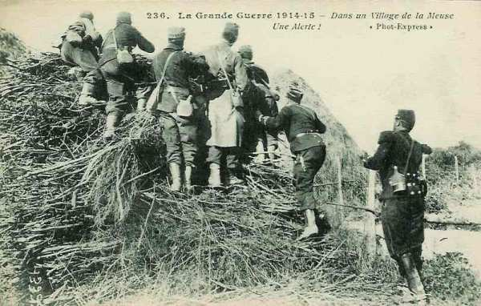
_Alerte dans un village de la Meuse_
_Collection privée_

- Le corps colonial : Après une lutte violente sur le canal de Saint-Dizier, les Allemands passent sur la rive sud et attaquent en force, mais ne peuvent entamer sur la gauche la ligne Blaise - Norrois - Matignicourt ; sur la droite, Vauclerc et Ecriennes tombent aux mains des Allemands.

- Face au 2e C.A., les attaques allemandes sont soutenues par un feu violent d’artillerie dirigé de Heiltz-l’Evêque et de Heiltz-le-Maurupt. Au cours de la matinée, le canal de Saint-Dizier est forcé à  l’ouest de Le Buisson. Une brèche se dessine entre le 2e C.A. et le corps colonial mais le général Gérard la bouche aussitôt en envoyant la brigade Lejaille autour de Favresse pour remplacer les coloniaux. La lutte s’étend bientôt à l’est de Le Buisson.  A 15h, tous les ponts jusqu’à Etrepy sont tombés aux mains des Allemands. Pargny est attaqué par le nord et par l’ouest mais résiste à tous les assauts.

**Opérations de la IIIe armée**

L’ordre général prévoit pour la journée du 6 l’attaque du flanc gauche allemand, ces derniers prennent les devants. Ils concentrent leurs efforts sur le 5e C.A., qui est en liaison avec la IVe armée. Ce C.A. plie sous le choc mais fait payer chèrement le terrain perdu. Quant au 6e C.A., il parvient à peine à conserver ses positions.

- Devant le 5e C.A., les Allemands prennent l’offensive un peu avant 06h. Sommeilles et Nettancourt sont perdus. Noyers doit être évacué sous un feu intense d’artillerie. Les Allemands intensifient leur poussée pour briser la liaison entre les armées Sarrail et de Langle de Cary. Ils poussent vers Villers-aux-Vents. Toute la journée, le 5e C.A. se défend pied à pied. Cependant, tout à tour, Villers-aux-Vents, Brabant-le-Roi, Revigny, Laimont sont abandonnés par les Français. Le soir, la ligne passe par Vassincourt - Louppy-le-Château - Villotte.

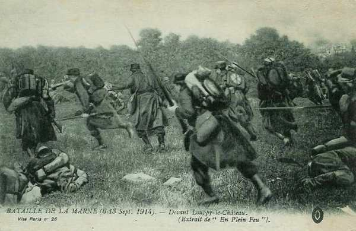
_Attaque de Louppy-le-Château_
_Collection privée_

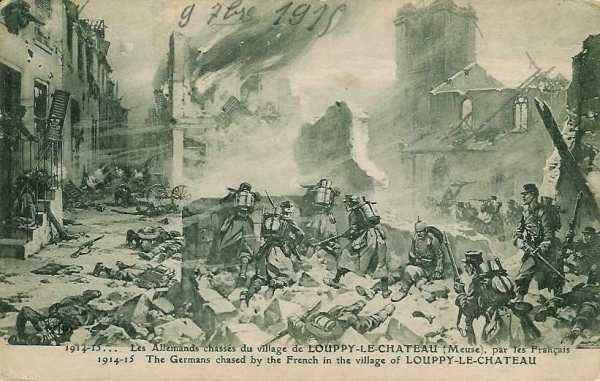
_Prise de Louppy-le-Château_
_Collection privée_

- 6e C.A. : les Allemands devancent son offensive et le général Verraux doit d’abord résister sur la ligne Sommaisne - Beauzée - Deuxnouds. Vers 10h, l’attaque française se prononce. A gauche, la 17e brigade dépasse Pretz et parvient à l’ouest d’Evres, puis doit se replier, prise de flanc par les feux allemands. Le centre du C.A. se voit obligé d’abandonner Sommaisne, Beauzée et Deuxnouds et se retire à l’ouest de Seraucourt. A droite, la 40e division, partant de Seraucourt, attaque dans la direction de Saint-André. Après avoir combattu sous bois toute la journée, elle regagne Seraucourt la nuit.

_Combat de Beauzée_
_Collection privée_

- Le 3e groupement de divisions de réserve attaque Issoncourt et Souilly, dans la direction de Saint-André-Ippécourt. Pendant toute la journée, il lutte avec acharnement et réussit à progresser jusque vers Saint-André-Osches mais il est finalement rejeté sur la ligne Signal d’Heippes - Souilly.

- Défense mobile de Verdun :  elle passe d’un rôle passif à un rôle actif et envoie la plus grande partie de la 72e division de réserve, la 108e brigade et les 164e et 165e régiments d’infanterie donner appui à l’extrême droite de la IIIe armée. Ces troupes attaquent le 16e C.A. allemand dans la direction de Jubécourt, Ville-sur-Cousances, Julvécourt. Le soir, elles se retirent à Rampont et à Les Souhesmes.

### 7 septembre

**[Situation au 7 septembre](../img/revigny_7_septembre.jpg)**

C Michelin, d’après guide édition 1918 - Autorisation n° 06-B-05

**Opérations de la IVe armée**

La IVe armée occupe par sa droite la vallée où coulent l’Ornain, la Saulx et le canal de la Marne au Rhin, c’est-à-dire la partie ouest de la trouée de Revigny. L’attaque allemande redouble de violence sur cet objectif important. Les efforts portent principalement sur Sermaize et Pargny. Les Allemands veulent à tout prix percer vers Saint-Dizier et la Marne, afin de contourner la droite de la IVe armée.

- 17e C.A. : Les Allemands ont accumulé autour de Sompuis de grandes forces d’infanterie. Pour parer à une offensive, le 17e C.A. est resserré vers le nord et le nord-est dans la nuit du 6 au 7. La tâche de la 9e D.C., qui doit conserver la liaison entre la IXe armée (Foch) et la IVe (de Langle de Cary), sera rendue d’autant plus ardue. Toute la journée, les lignes françaises sont soumises à un violent bombardement. La bataille est acharnée sur les crêtes d’Humbauville et à l’est de Sompuis.

Vers 17h, les efforts des Allemands décroissent et le 17e C.A., passant à l’offensive, gagne du terrain.

- 12e C.A. : Le général Roques rappelle tous les éléments disponibles. La 23e division sera envoyée à la gauche du 17e C.A. Dès 06h, Huiron est attaqué par l’infanterie allemande qui descend de Blacy mais le village résiste toute la journée et n’est abandonné que le soir. Les positions de Courdemanges et du Mont Moret sont soumises à un bombardement incessant et les troupes françaises se terrent dans le sol.

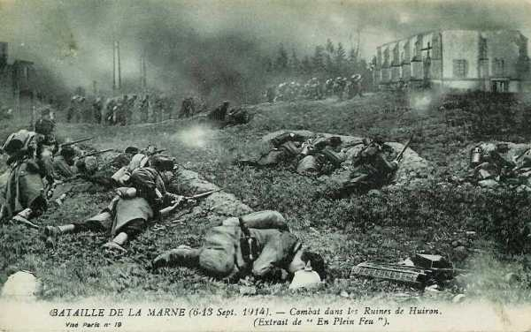
_Combat de Huiron_
_Collection privée_

- Corps colonial : le front du corps colonial est sous le feu des batteries allemandes de Vitry-le-François ; par contre, l’artillerie de ce C.A., établie à Blaise, pilonne le village de Frignicourt. La brigade Lejaille prend l’offensive dès le matin vers Vauclerc et Reims-la-Brûlée. La droite du C.A. colonial appuie ce mouvement durant toute la journée entre le canal et la grand ‘route Vitry - Saint-Dizier. Les coloniaux reprennent Ecriennes et s’établissent le soir à l’ouest de ce village. Le soir, la brigade Lejaille s’établit à Ecriennes et Favresse.

- 2e C.A. : la gauche de la 3e division, combattant pied à pied, parvient à garder Domprémy et empêcher les forces allemandes d’atteindre la ligne de chemin de fer. La droite perd le pont d’Etrepy et les Allemands s’emparent du village. Mais le feu de l’artillerie française, établie entre Pargny et Maurupt, écrase les colonnes débouchant d’Etrepy et de Buisson. Sur le front de la 4e division (droite), l’infanterie qui défend Sermaize succombe sous la poussée et, dans la crainte d’être tournée, évacue la ville en flammes et se replie à travers les bois de Maurupt.

**Opérations de la IIIe armée**

Les Allemands s’efforcent de rejeter la IIIe armée à l’est, vers Bar-le-Duc, mais Sarrail riposte en mettant en ligne au point dangereux le 15e C.A., provenant de la IIe armée. D’autre part, Sarrail est avisé d’une grande activité allemande sur les Hauts de Meuse. Il doit se préoccuper de ne pas être pris à revers.

- 15e C.A. : Seule la 29e division peut entrer en ligne à cette date et elle s’établit face à l’ouest, de Combles à Fains. Sa mission est de couvrir la gauche de la IIIe armée, tout en recherchant la liaison avec la IVe armée. Ses deux bataillons de chasseurs occupent le soir Couvonges et les bois avoisinants.

- 5e C.A. : Le front du C.A. est soumis toute la journée à un violent bombardement mais il tient bon partout. Vassincourt est disputé avec acharnement. La possession par les Allemands du plateau de Vassincourt, au centre de la trouée de Revigny, leur permettrait de pousser le long de l’Ornain vers Bar-le-Duc et le long de la Saulx vers Saint-Dizier, réalisant ainsi la rupture entre les IIIe et IVe armées.

- 6e C.A. : Aucun des adversaires ne parvient à obtenir un avantage. Les Allemands attaquent le village de Rembercourt, le bombardent mais ne parviennent pas à l’enlever.

La 107e brigade monte en ligne et doit attaquer dans la direction de Beauzée par la rive gauche de l’Aire. Elle traverse la ligne de chemin de fer et livre de furieux combats qui lui causent des pertes importantes et doit finalement se replier.

- Groupe des divisions de réserve : La 65e division a l’ordre d’attaquer vers l’ouest, dans la direction de Beauzée - Bulainville. Sa gauche arrive dans les environs immédiats de Beauzée et sa droite se porte sur les crêtes de la colline de Deuxnouds. La division se cramponne au terrain balayé par l’artillerie allemande puis doit se retirer vers Rignaucourt, Mondrecourt. La 75e division commence l’attaque de Saint-André et d’Ippécourt mais ne parvient pas à déboucher. A ce moment, la 67e division, qui s’est emparée d’Osches, continue son mouvement vers le nord-ouest. La 75e division fait passer au nord de Cousances des forces importantes et, en un large mouvement débordant avec la 75e division, s’empare d’Ippécourt.

- Défense mobile de Verdun : La 72e division attaque Jubécourt qu’elle ne peut enlever. Elle inflige toutefois de fortes pertes aux Allemands sur ce point ainsi que devant Ville-sur-Cousances et Julvécourt.

### 8 septembre

**[Situation au 8 septembre](../img/revigny_8_septembre.jpg)**

C Michelin, d’après guide édition 1918 - Autorisation n° 06-B-05

**Opérations de la IVe armée**

Von Hausen (IIIe armée allemande) a lancé une attaque de nuit sur la droite de la IXe armée (Foch), ce qui menace la liaison, mais un nouveau C.A. (21e), prélevé sur la Ie armée, intervient pour rétablir l’équilibre en ce point. De Langle de Cary prélève des effectifs sur les C.A. voisins :

- Sur le 17e C.A. ,un détachement aux ordres du colonel Breton.
  Sur le 12e , la 23e division.
Les Allemands attaquent brusquement à 04h. Le détachement Breton organise la résistance à l’ouest d’Humbauville et parvient à conserver ses positions au prix de pertes énormes en attendant l’arrivée de la 23e division, puis de la 13e.

- 17e C.A. : Le 19e C.A. saxon attaque le 17e C.A. Ce dernier perd un peu de terrain puis parvient à le regagner dans le courant de l’après-midi.

- 12e C.A : un violent bombardement est dirigé par les Allemands sur Courdemanges, le mont Moret, Châtel-Raould, tandis que leur infanterie attaque Courdemanges. Vers 8h, les Allemands s’emparent de Courdemanges et du Mont Moret. Toute la journée, une lutte violente se déroule à Châtel-Raould. Le soir, le Mont Moret peut être repris par les Français.

- Corps colonial : Ce C.A. participe aux combats entre Châtel-Raould et Courdemanges. A l’est du canal de Saint-Dizier, des combats opiniâtres sont livrés par la 2e division qui parvient à se maintenir. Ecriennes est toutefois repris par les Allemands.

- 2e C.A. : Le 7e C.A. allemand, descendant de Reims-la-Brûlée, attaque le front Ecriennes - Favresse, tenu par la brigade Lejaille. La ligne française doit se replier à Farémont, mais Favresse, pris et repris, reste dans les mains françaises.

- 8e C.A. de réserve : le C.A. enlève Domprémy au début de la matinée et tente de percer entre Favresse et Blesmes. Vers 18h, la brigade Lejaille est à nouveau dans Favresse.

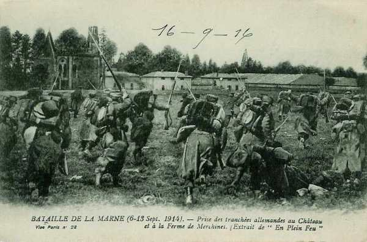
_Prise du château et de la ferme de Merchines_
_Collection privée_

### 9 septembre

**[Situation au 9 septembre](../img/revigny_9_septembre.jpg)**

C Michelin, d’après guide édition 1918 - Autorisation n° 06-B-05

**Opérations de la IVe armée**

La IVe armée fournit une aide puissante à celle de Foch (IXe armée) en attaquant dès le matin l’aile gauche de von Hausen (IIIe armée), qui a enfoncé la ligne française par sa droite. Cette intervention empêche les Saxons de pousser à fond leur avantage, mais au centre et à droite, ce sont les Allemands qui continuent leur violentes attaques.

- 21e C.A. : à l’extrême gauche du C.A., la 43e division s’avance dans le sud ouest de Sompuis. La 13e division combat toute la journée et fait reculer la 23e division saxonne. La 23e division française suit le mouvement de la 13e, chasse les Allemands d’Humbauville et bivouaque le soir dans les bois au sud de Sompuis.

- 17e C.A. : Le C.A. marque des progrès pendant la journée.

- 12e C.A. et corps colonial : Le Mont Moret, défendu par des éléments de la 24e division et de la 2e division coloniale, fait l’objet d’assauts impétueux. Le village de Norrois est fortement bombardé mais les Français ne cèdent pas un pouce de terrain.

- 2e C.A. : La brigade Lejaille et la gauche du 2e C.A. maintiennent leurs positions de Farémont, Favresse et Blesmes. Les troupes françaises tentent  un mouvement offensif vers Domprémy, mais ne parviennent pas à s’emparer du village. A droite, les Français parviennent à reprendre du terrain entre Maurupt et Pargny.

**Opérations de la IIIe armée**

La IIIe armée continue à agir par son aile gauche dans le flanc des forces allemandes qui pèsent sur la IVe armée. Son aile droite reste dans une situation critique car les forces allemandes font peser une menace sur l’arrière de l’armée dans les Hauts de Meuse. Sarrail reçoit l’autorisation de replier sa droite en laissant Verdun se défendre seule mais il continue à se cramponner à la place forte.

- 15e C.A. : L’attaque sur Vassincourt est reprise dès l’aube par la 57e brigade, en liaison avec la 19e brigade. Le soir, le village est en flammes et les troupes françaises l’enserrent par l’est et le sud. La 30e division fait passer la Saulx par plusieurs unités qui se portent dans la forêt de Trois-Fontaines. Ces troupes enlèvent la ferme de Maison-Blanche et continuent leur progression sur Mogneville dont elles s’emparent en soirée.

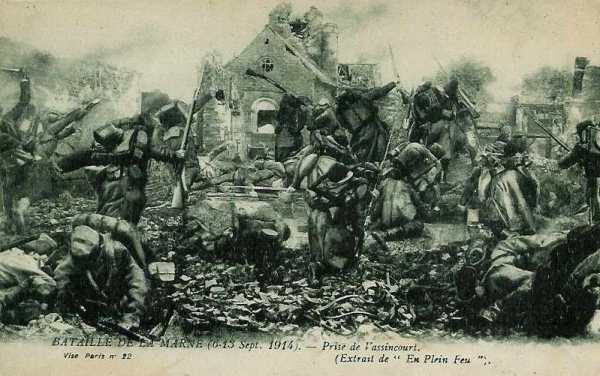
_Prise de Vassincourt_
_Collection privée_

- 5e C.A : Le C.A. coopère avec le 15e en attaquant de Vassincourt à l’Ornain. Sur la droite, un violent bombardement oblige la ligne à un peu reculer.

- 6e C.A : Sous un bombardement durant toute la journée, la ligne ne recule pas.

- Groupe des divisions de réserve : Il ne se produit aucune modification de terrain.

- Défense mobile de Verdun : La 72e division et la 108e brigade continuent à harceler le flanc allemand à Julvécourt et Ville-sur-Cousances.

- Hauts de Meuse : La situation s’aggrave : le fort de Troyon a cessé de tirer et celui de Génicourt commence à être bombardé.

### 10 septembre

**[Situation au 10 septembre](../img/revigny_10_septembre.jpg)**

C Michelin, d’après guide édition 1918 - Autorisation n° 06-B-05

**Opérations de la IVe armée**

La droite de von Hausen est en pleine retraite devant l’armée de Foch. De Langle de Cary fait prendre une vigoureuse offensive à ses forces de gauche.

- 21e C.A. : Le général Legrand reprend l’offensive à 06h malgré la canonnade de l’artillerie établie sur les hauteurs au nord de Sompuis. Les troupes françaises progressent rapidement et livrent un combat au Signal de Sompuis. Vers 17h, elles s’emparent du village. Le soir, le C.A. est établi le long du chemin de fer et les avant-postes se portent vers Coole.

- 17e C.A. : Le C.A. reçoit l’ordre de passer à l’offensive. Il a été renforcé d’une division provenant du corps colonial, arrivée dans la nuit à Le Meix-Thiercelin. Seule la gauche a progressé en fin de journée.

- 12e C.A. : Ce C.A., réduit à la 24e division, reçoit du renfort au cours de la nuit. L’offensive se déclenche dès le matin. La gauche avance de 3 km environ puis le feu de l’artillerie lourde allemande empêche tout nouveau progrès. La position défensive de Courdemanges ne peut être emportée.

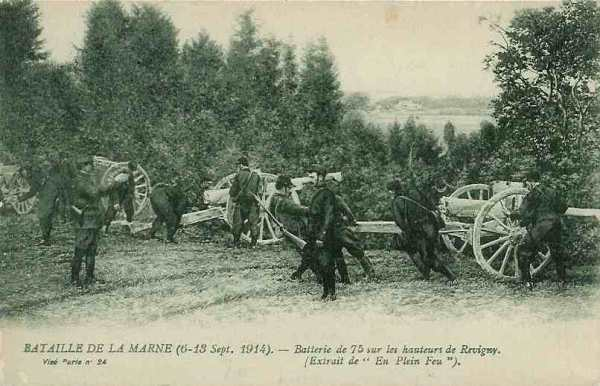
_Batterie à Revigny_
_Collection privée_

- Corps colonial : Une tentative vers Ecriennes échoue devant le feu des batteries allemandes.

- 2e C.A. : Au cours de la nuit, les attaques allemandes reprennent vers Favresse, Blesmes, Saint-Lumier. Dans le courant de la matinée, la partie ouest de Favresse tombe aux mains des Français. Dans les rues de Maurupt se livrent des combats acharnés. Les Allemands s’emparent de Le Montois par l’ouest et peuvent réattaquer Maurupt de front et à revers. A 11h, les Français abandonnent Maurupt, craignant d’être cernés.

**Opérations de la IIIe armée**

Par sa gauche, le IIIe armée refoule le coin enfoncé par les forces allemandes à sa jonction avec la IVe armée mais elle doit résister sur sa droite à une violente offensive. Le fort de Troyon résiste et la barrière de la Meuse n’est pas franchie.

- 15e C.A. : Il attaque face au nord-ouest, la 30e division sur la gauche, à cheval sur la Saulx dans la direction de Contrisson, la 29e division à droite vers l’ouest de Vassincourt. En fin de journée, les Allemands tiennent encore entre Vassincourt et la Saulx.

_Infanterie française en Argonne_
_Collection privée_

- 5e C.A. : Après un bombardement violent, les Allemands attaquent vers Lisle-en-Barrois. Le 5e C.A. recule jusqu’à Condé.

- 6e C.A. : A minuit, les forces Allemandes attaquent. Partout, la ligne française recule. La 17e brigade se replie lentement au petit jour vers Erize-la-Grande, une partie se rabat sur Condé. La 12e division abandonne Rembercourt et la ferme de Vaux-Marie. La 40e division se voit contrainte d’abandonner Courcelles mais arrête l’avance allemande devant Erize-la-Petite. Elle s’établit en fin de journée vers Chaumont et Neuville.

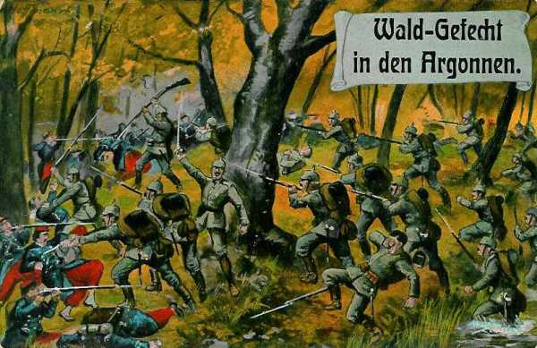
_Combat dans les bois en Argonne_
_Collection privée_

- Groupe des divisions de réserve : La 65e division est rejetée de Seraucourt et du signal d’Heippes. Les Allemands attaquent en pleine nuit la 75e division. Heippes est perdu au point du jour et dans la matinée, on se bat sur le plateau au nord de Rambluzin. Au début de l’après-midi, Souilly est abandonné.

- Hauts de Meuse : Le Ve C.A. allemand est toujours arrêté sur la Meuse. Il n’a pu s’emparer des forts de Génicourt et de Troyon. Pour parer à toute éventualité, Sarrail transporte dans la journée la 67e puis la 75e division dans la région de Courouvre, Pierrefitte.

### 11 au 14 septembre

**[Situation du 11 au 14 septembre](../img/revigny_11_14_septembre.jpg)**

C Michelin, d’après guide édition 1918 - Autorisation n° 06-B-05

**Opérations de la IVe armée**

La IVe armée poursuit son offensive. Von Hausen découvre l’armée du duc de Wurtemberg, qui est obligée de rompre à son tour devant le centre de l’armée de Langle de Cary  et de reculer jusque sur des positions où commencera la guerre de tranchées.

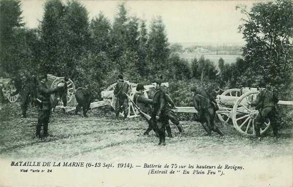
_Batterie de 75 sur les hauteurs de Revigny_
_Collection privée_

- 21e C.A. : Le 11, il va s’installer à Cernon et Coupetz, avec des avant-postes sur la Marne, à Mairy. Le 12, après avoir rétabli des ponts, il se porte, par une étape de 30 km, à Courtisols et  Bussy-le-Château. Le 13, il se bat à Suippes et au cours de la journée se fixe devant Souain.

- 17e C.A : Il attaque vigoureusement dans la nuit du 10 au 11 et refoule les troupes allemandes jusqu’au-delà de Maisons-en-Campagne où il s’établit. Le 12, il passe la Marne à Pogny et Omey et se dirige sur Somme-Suippes. En pourchassant l’arrière-garde allemande, il arrive au chemin de fer Paris-Verdun.

- 12e C.A. : Le C.A. se heurte, à Vitry, à une défense bien organisée. Le 11 avant l’aube, le général Roques fait reprendre l’offensive vers le nord-est mais partout, les Allemands résistent. En combattant, le C.A. s’avance par Frignicourt, Courdemanges, Huiron et Glannes pour s’établir à Vanault-Châtel, jusque sur l’Yèvre. Le 13, il oblique vers le nord-ouest, atteint Auve, la Chapelle-Felcourt et parvient à la ligne de chemin de fer Paris-Verdun.

- Corps colonial : Le 11, il occupe Ecriennes, Vauclerc, Reims-la-Brûlée et par sa droite, atteint le canal de la Marne au Rhin, vers Bignicourt. Le 12, il refoule les arrière-gardes allemandes et cantonne à Saint-Mard-sur-le-Mont et Noirlieu. Le 13, il s’avance sur l’Yèvre et s’établit sur la voie ferrée à l’ouest de Sainte-Menehould. Le 14, il attaque vers Ville-sur-Tourbe.

- 2e C.A. : Il attaque le 11 et prend Maurupt, Etrepy, Pargny, Sermaize. Le 12, le C.A. tient la ligne Charmont-Nettancourt. Le 13, il est à Sainte-Menehould et le 14 à Vienne-la-Ville.

**Opérations de la IIIe armée**

Le recul de l’armée du duc de Wurtemberg rend précaire la situation de celle du kronprinz et, malgré ses succès du 10, il est obligé de reculer par échelons. Ce n’est que dans la nuit du 12 au 13 que la retraite allemande devient générale.

- 15e C.A. : Le mouvement en avant se poursuit malgré une pluie diluvienne. La gauche occupe Andernay et Rémennecourt, tandis que la droite touche au canal de la Marne au Rhin. Le 12, la C.A. occupe Revigny. Le 13, il ira à Montzéville et aux Bois Bourrus.

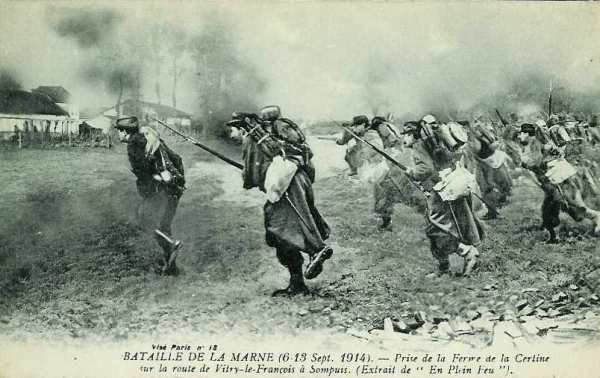
_Prise de la ferme de la Certine_
_Collection privée_

- 5e C.A. : Le 11, il s’empare de Laimont. Le 13, il se dirige sur Vauquois et Varennes.

- 6e C.A. et divisions de réserve. Le 12, les Allemands sont rejetés sur leurs positions. Dans la nuit du 12 au 13, les Allemands se retirent et le 13, le C.A. passe la Meuse, une divisions au nord de Verdun, l’autre au sud et gagne Beaumont et Vaux. Le groupe de divisions de réserve prend positions à droite de la IIIe armée vers Moulainville, Haudiomont et les Eparges.

### Conclusion

Cette bataille, livrée sur les Hauts-de-Meuse, est liée à celle de l’Ourcq, des deux Morins, et surtout à celle des marais de Saint-Gond.

Les Allemands tentent des attaques aux soudures entre la IXe armée et la IVe armée d’une part, et entre la IIIe et la IVe armée d’autre part, mais, partout, les armées françaises se soutiennent mutuellement en attaquant de flanc les troupes allemandes menaçant les points faibles. Sarrail, qui a pourtant reçu du G.Q.G. l’autorisation d’abandonner Verdun, s’y cramponne, en permettant à la place forte de rester dans les mains françaises. Deux ans plus tard, elle sera à nouveau âprement disputée.