# Bataille de Sarrebourg (18 - 20 août 1914)

La bataille de Sarrebourg est un épisode de la bataille de Lorraine, mettant aux prises le 8e C.A. et une partie de l’armée du kronprinz de Bavière.

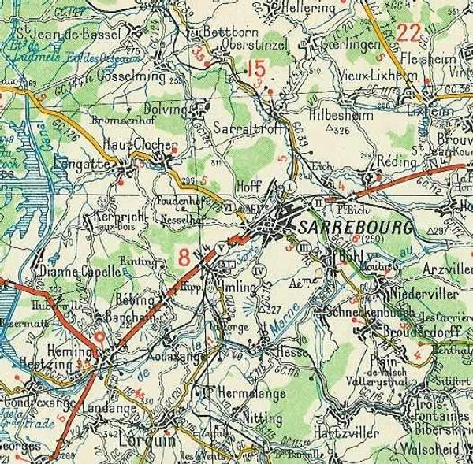
_Environs de Sarrebourg_
_C Michelin, d’après carte n° 87, édition 2820-28 - Autorisation n° 05-B-18_

### Les forces en présence

**Armée française**

8e C.A. (général de Castelli)

_Général de Castelli (8e C.A.)_
_La guerre du droit_

15e D.I. (général Bajolle)

| Unité                                  | Commandant          | Régiments                          |
| -------------------------------------- | ------------------- | ---------------------------------- |
| 29e brigade                            | Grandjean           | 56e (Hallouin), 134e R.I. (Perrin) |
| 30e brigade                            | Piarron de Mondésir | 10e (Brunck), 27e R.I. (Valentin)  |
| Cavalerie et artillerie divisionnaires |                     | 14e hussards (un escadron)         |
|                                        |                     | 48e R.A.C. (Diez)                  |

16e D.I. (de Maud’huy)

| Unité                                  | Commandant | Régiments                               |
| -------------------------------------- | ---------- | --------------------------------------- |
| 31e brigade                            | Reibell    | 85e (Rabier), 95e R.I. (Tourret)        |
| 32e brigade                            | Marié      | 13e R.I. (Frontil), 29e R.I. (Delaunay) |
| Cavalerie et artillerie divisionnaires |            | 1e R.A.C. (Lequime)                     |
|                                        |            | 16e chasseurs à cheval                  |

**Armée allemande**

VIe armée
1e C.A. bavarois (général von Xylander)

_Général von Xylander_
_Collection privée_

1e division d’infanterie bavaroise : général von Schoch

| Unité                                 | Commandant | Régiments                                                                                                                                  |
| ------------------------------------- | ---------- | ------------------------------------------------------------------------------------------------------------------------------------------ |
| 1e Kgl. Bayer. Infanterie-Brigade     |            | Kgl. Bayer. Infanterie-Leib-Regiment (Munich)Kgl. Bayer. 1. Infanterie-Regiment (Munich)                                                   |
| 2e Kgl. Bayer. Infanterie-Brigade     |            | Kgl. Bayer. 2. Infanterie-Regiment (Munich)Kgl. Bayer. 16. Infanterie-Regiment (Passau, Landshut)Kgl. Bayer. 1. Jäger-Bataillon (Freising) |
| Cavalerie divisionnaire               |            | Kgl. Bayer. 8. Chevaulegers-Regiment (Dillingen)                                                                                           |
| 1e Kgl. Bayer. Feldartillerie-Brigade |            | Kgl. Bayer. 1. Feldartillerie-Regiment (Munich)Kgl. Bayer. 7. Feldartillerie-Regiment (Munich)Kgl. Bayer. 10. Fußartillerie-Bataillon      |

2e division d’infanterie bavaroise : général von Hetzel

| Unité                            | Commandant | Régiments                                                                                           |
| -------------------------------- | ---------- | --------------------------------------------------------------------------------------------------- |
| 3e bayer. Infanterie-Brigade     |            | Kgl. Bayer. 3. Infanterie-Regiment (Augsburg)Kgl. Bayer. 20. Infanterie-Regiment (Lindau, Kempten)  |
| 4e bayer. Infanterie-Brigade     |            | Kgl. Bayer. 12. Infanterie-Regiment (Neu-Ulm)Kgl. Bayer. 15. Infanterie-Regiment (Neuburg a.d.)     |
| Cavalerie divisionnaire          |            | Kgl. Bayer. 4. Chevaulegers-Regiment (Augsburg)                                                     |
| 2e bayer. Feldartillerie-Brigade |            | Kgl. Bayer. 4. Feldartillerie-Regiment (Augsburg)Kgl. Bayer. 9. Feldartillerie-Regiment (Landsberg) |

### 2 août

C’est le premier jour de la mobilisation. Le 8e C.A., établi à Bourges en temps de paix, est transporté par Nevers, Chagny, Gray, Jussey vers sa zone de concentration (Charmes - Châtel-sur-Moselle). Il fait partie de la Ie armée, qui regroupe, de droite à gauche, le 7e, 14e, 21e, 13e, 8e C.A. et les 8e et 6e D.C.

- Les 7e ,14e C.A. et la 8e D.C. opèrent en Alsace
    Le 21e C.A. et la 6e D.C. sont en couverture dans les Vosges et sur la Meurthe.
    Le 8e C.A. est à l’aile gauche, en contact avec le 16e C.A., aile droite de la IIe armée.

La IIe armée comprend, de droite à gauche, les 16e,15e, 20e et 9e C.A.

- Le 8e C.A. est sur la rive droite de la Moselle, tenant les débouchés nord-est de la forêt de Charmes :
    16e division sur le front Domèvre-sur-Durbion - Hadigny-les-Verrières - Moriville.
    15e division à gauche de la première sur le front Ortoncourt - Haillainville - Saint-Boingt - Borville.

Il couvre donc le centre de la trouée de Charmes (Epinal - Toul).

La cavalerie de corps, soit le 16e chasseurs, est envoyée à Gerbéviller et doit chercher la liaison avec la 6e D.C. vers Flin et Azerailles, et avec la 2e D.C. qui s’est portée vers Château-Salins.

### 9 août

Le 8e C.A. reçoit l’ordre de se porter dès que possible sur la Meurthe pour atteindre le 10, par les têtes de ses gros, le front Glonville - Flin - Vathiménil - Fraimbois (localités au nord-ouest de Baccarat), et par ses avant-gardes, la ligne générale Hablainville - lisière nord de la forêt de Mondon par une marche de nuit.

**22h :**

- Le 8e C.A. se met en marche :
    La 16e division par Rehaincourt et Saint-Pierremont sur Domptail pour atteindre Glonville - Flin.
    La 15e division par Remenoville et Gerbéviller pour atteindre Vathiménil - Fraimbois.

La 16e division cherche la liaison avec le 21e C.A. à droite, vers Baccarat, la 15e avec le 16e C.A. (IIe armée), à gauche vers Lamath.

Le 16e chasseurs est envoyé de Gerbéviller sur Reillon et Vého, éclairant les passages de la Meurthe puis de la Vezouse et enfin la direction de Blâmont - Avricourt - Xousse.

### 10 août

L’avant-garde de la 16e division arrive à Domptail (ouest de Baccarat). Comme les Allemands sont attendus sur la Meurthe, les cartouches des caissons de bataillon sont distribuées, mais les Allemands se replient vers le nord et les avant-gardes des deux divisions effectuent une marche de 25km sans rencontrer l’ennemi. Les renseignements signalent une division allemande dans la région de Domèvre - Blâmont.

Le 8e C.A. est en échelon avancé entre les Ie et IIe armées et tient par ses avant-gardes les débouchés au nord de la Meurthe.

### 11 août

Le général de Castelli se rend au Q.G. du général Barbade, puis demande au général Dubail l’autorisation de faire passer la 16e division au nord de la Meurthe en tout ou en partie.

La 16e division renforce son avant-garde sur les hauteurs d’Hablainville (nord de la Meurthe) et porte une partie de ses forces de la Meurthe sur la Verdurette et Reherrey - Montigny. La 6e D.C. doit se porter d’Azerailles sur Buriville et Agéviller.

Ce mouvement dégage la 25e brigade mais le général Dubail prescrit de repasser le 12 sur la rive gauche de la Meurthe. La 16e division ne laisse au nord de la rivière que le 95e R.I.

**Nuit du 11 au 12 :**

Un télégramme du général Barbade (25e brigade, 21e C.A.), en couverture au nord de Baccarat, fait connaître qu’il a été attaqué dans la journée du 10 par des forces supérieures (1e C.A. bavarois) et a été obligé de se replier sur la Blette. Il demande l’appui du 8e C.A. pour le 11 août.

Le gros du 1e C.A. bavarois franchit la frontière et se heurte au sud de Cirey et de Blâmont à la résistance de la couverture française.

### 12 août

Comme la 16e division française s’est repliée au sud de la Meurthe, le 1e C.A. bavarois s’empare de Badonviller et rejette la 25e brigade (21e C.A.) sur cette rivière.

Une réunion a lieu à Epinal avec les commandants de C.A. de la Ie armée au cours de laquelle le général Dubail donne ses instructions pour l’offensive, prévue le 14 par le G.Q.G., par les Ie et IIe armées.
Cette offensive se développera vers le nord-est et s’étendra entre le col du Bonhomme et Nancy.

L’objectif du 8e C.A. est l’armée allemande établie dans la zone Sarrebourg - Vallée de la Bruche, qu’il faut chercher à refouler sur Strasbourg et la basse Alsace. La liaison avec la IIe armée, marchant sur Saarbrücken, s’établira dans la région des Etangs.

- L’offensive doit démarrer le 14 pour la Ie armée
    L’aile gauche (8e et 13e C.A.) s’avancera dans le couloir Blâmont -Sarrebourg, pour se rabattre ensuite à droite sur la trouée de Saverne.
    L’aile droite (21e C.A.) sera orientée vers la vallée de la Bruche.

### 13 août

C’est un jour de repos et de préparation. Le 8e C.A dispose de la zone comprise entre Gerbéviller - Moyen - Vathiménil - Bénaménil - Domjevin - Blemerey - Chazeille - Grandseille - Repaix d’une part, et la ligne Mignéville - Le Clair-Bois - sud de Frémonville - Tanconville d’autre part.

La Vezouse et la Blette seront franchies à 6h30.

Le premier objectif est le front Domèvre - Chazelles.

### 14 août

**05h :**

Le 8e C.A. se porte sur Domèvre et Blâmont où les Allemands sont signalés. Le 16e chasseurs éclaire le front ; la 6e D.C. éclaire dans les directions de Blâmont - Lorquin - Avricourt.

**09h :**

L’engagement commence. Le général de Castelli a son P.C. au signal de la Garde (cote 352, 1 km au S.O. d’Hablainville). De là, la vue s’étend sur la vallée de la Verdurette, de la Blette et de la Vezouse.

La 16e division (32e brigade en 1e ligne) franchit la Verdurette puis la Blette, avec l’appui de l’artillerie de C.A., établie à la cote 315 (sud de Mignéville), et chasse les Allemands du Bois Banal. La 32e brigade (13e et 29e R.I.) se porte à l’attaque de Domèvre et des hauteurs au nord de la Vezouse. Les Allemands sont bousculés sur les hauteurs de Saint-Martin et dans les bois des Haies d’Albe. Le 29e R.I. enlève le bois des Prêtres. Le C.A. bavarois laisse sur le terrain de nombreux tués et blessés.

Le bourg de Domèvre est enlevé par les 29e et 85e R.I., puis les bois situés au nord, dans la direction de Verdenal.

Le 13e C.A., à droite, atteint Montreux. La 16e division progresse vers Blâmont, qu’elle atteindra le soir. A gauche, la 15e division a débouché au nord de la forêt de Mondon.

**En soirée**

Le Q.G. du 8e C.A. se trouve à Agéviller. Les troupes bavaroises se sont retranchées sur les hauteurs au nord de Blâmont et vers Repaix.

A la droite du 8e C.A., le 13e a essuyé un échec devant Cirey, le 21e C.A. a atteint le Donon et Saint-Blaise sur la Bruche.

A la gauche, la IIe armée, qui fait face au 21e C.A. allemand et les 2e et 3e C.A. bavarois, a atteint Gondrexon, Xousse, Xures et Juvrecourt.

**22h :**

Le commandant de la 16e division prélève à Domèvre un bataillon du 95e et un peloton du 16e chasseurs et s’avance sans bruit par Blâmont pour enlever par surprise les tranchées allemandes, mais il est accueilli par un feu nourri et le bataillon doit se replier sur Blâmont. Les clairons sonnent pour faire croire à l’arrivée de renforts et les Bavarois, menacés sur leurs ailes, évacuent leurs retranchements et se replient vers le nord. Le 2e bataillon du 95e a toutefois perdu 300 hommes.

Ce qui reste du bataillon se regroupe à Blâmont puis rentre à Domèvre. Cette action de nuit assure aux Français la possession de Blâmont.

**15 août**

Le Q.G. du 8e C.A. s’établit à Blâmont. La frontière allemande est franchie au son de la Marseillaise. Le 13e C.A. occupe Frémonville et Cirey et le 21e C.A. se fortifie au Donon et à Saint-Blaise.
Le 16e C.A. (2e armée) atteint Igney, Avricourt (localité sur la frontière) et la gauche de la IIe armée la forêt de Bezange.

Un C.C. (2e, 6e, 10e D.C.) est formé sous les ordres du général Conneau et rattaché à la Ie armée pour opérer sur les arrières de l’adversaire.

Devant le front du 8e C.A., les Allemands se sont repliés vers Héming.

- L’ordre d’opérations du 8e C.A. prescrit la continuation de l’offensive.
    La 16e division a comme objectif la ligne Hattigny - Poirier des Barbiers.
    La 15e la ligne Saint-Georges - ferme d’Haussonville.
    Les objectifs une fois atteints seront mis en état de défense.

### 16 août

- Le 8e C.A. poursuit sa marche, avec pour objectif la ligne Hattigny - Saint-Georges.
    La 16e division à l’est de la route de Blâmont à Sarrebourg.
    La 15e division à l’ouest de Saint-Georges - ferme d’Haussonville.

La 16e division occupe dans la journée le signal de Fraqueling (95e R.I.) et le Poirier des Barbiers.
La 15e division s’avance sur les pentes du signal de Foulcrey. Elle est vivement prise à partie par l’artillerie lourde établie au nord du canal de la Marne au Rhin (sud de Sarrebourg vers Saverne), dont les projectiles tombent sur Ibigny, Hablutz et le signal de Foulcrey.

**6h15 :**

Le 27e R.I., soutenu par un groupe du 48e R.A.C., se porte d’Hablutz sur Saint-Georges. Les cavaliers allemands qui tenaient Saint-Georges se replient vers le nord.

**7h30 :**

Dès que le village de Saint-Georges est dépassé, l’artillerie allemande ouvre le feu. Le 10e R.I., en seconde ligne, se porte également vers Saint-Georges sous un feu violent d’artillerie.

Les pièces françaises ne portent pas assez loin pour contrebattre l’artillerie allemande de gros calibre, qui tire à une distance de 10 à 12 km. Les batteries du 37e s’avancent près de Saint-Georges mais l’artillerie lourde allemande, guidée par un avion, les prend comme objectif.

A la droite du 8e C.A., le 13e C.A. atteint Saint-Quirin, Niederhoff (localités dans les Vosges). A gauche, le 16e C.A. (IIe armée), abandonnant la direction nord-est, remonte vers le nord et atteint les environs de Maizières. Le reste de la IIe armée atteint Donnelay et Vic-sur-Seille.

### 17 août

Le front du 8e C.A. doit marquer le pas et se trouve sur la ligne Laneuveville - Lorquin - Aspach - Saint-Georges. Le 95e R.I. occupe Lorquin.

**En soirée :**

Le 85e R.I. pénètre dans Xouaxange, le 10e à Gondrexange, et les Français se rendent maîtres du canal de la Marne au Rhin. Les Allemands se sont repliés vers Sarrebourg. Le 16e chasseurs éclaire au nord du canal, le 1e escadron vers Gosselming et Dolving.

Sur la droite, le 13e C.A. est à Vasperviller et borde la Sarre rouge.

A gauche, le 16e C.A. (IIe armée) arrive à Bisping, sa droite au canal des Houillères. Le reste de la IIe armée occupe Marsal et Château-Salins.
Le 8e C.A. tient le canal de la Marne au Rhin, de Gondrexange à Xouaxange. Le 1e C.A. bavarois s’est replié sur Gosselming, Dolving et Sarrebourg, localités situées sur des hauteurs.

Le 16e chasseurs et le C.C. Conneau éclairent ces directions.

- Le 13e C.A. se trouve sur la Sarre rouge entre Neuveville-devant-Lorquin et Vasperviller.
    Le 21e C.A. est au Donon et dans la vallée de la Bruche.
    Le 14e C.A. est à Sainte-Marie-aux-Mines et le col du Bonhomme.
    L’armée d’Alsace n’a pas encore repris Mulhouse.

L’intention du général de Castelnau pour le 18 est de faire attaquer Héming et le bois de Rinting par le 8e C.A. Ce C.A. disposera de toute l’artillerie lourde de l’armée. (4 groupes de 155).

Le 13e C.A. appuiera à droite pour atteindre les hauteurs entre la Sarre rouge et la Bièvre supérieure.

**Du côté allemand**

- La VIe armée fait face à la Ie armée française.
    La 1e division bavaroise est à Fénétrange.
    Le 1e C.A. bavarois fortifie ses positions sur les hauteurs au nord et nord-est de Sarrebourg, entre Berthelming et Réding.
    La 7e D.C. est à Lixeim (nord-est de Sarrebourg)

- La VIIe armée, rappelée du sud de l’Alsace, continue à se concentrer entre Phalsbourg et la région sud-ouest de Strasbourg.
    Le 14e C.A., débarqué en soirée à Phalsbourg et à Saverne, prolonge la gauche du 1e C.A. bavarois, entre Réding et Saint-Louis.
    Le 15e C.A. se prépare à déboucher par Dabo.
    Le 14e C.A. est vers Barr et Molsheim.

La VIe armée doit continuer à organiser ses positions et la VIIe commencer son mouvement vers l’ouest pour passer sur le revers occidental des Vosges, en vue de préparer une manoeuvre d’enveloppement de l’aile droite française.

Le 1e C.A. bavarois recule, selon le plan de von Moltke, depuis le 14 et n’a même pas défendu l’obstacle que constitue le canal de la Marne au Rhin.

### 18 août

La 6e D.C. entre en matinée dans Sarrebourg mais ne peut s’y maintenir à cause des tirs d’artillerie allemands.

**10h :**

Le C.C. opère vers Haut-Clocher et canonne les Allemands vers Dolving, dans l’intention de franchir la Sarre vers Sarraltroff. Il cantonnera le soir dans la région de Diane-Capelle.

**En matinée :**

Le 8e C.A. franchit le canal entre Xouaxange et Gondrexange et se porte vers Rinting et Kerprich-aux-Bois (ouest de Sarrebourg). Des passerelles sont installées sur le canal de la Marne au Rhin par le génie. Le général de Castelli reçoit l’ordre du général Dubail de faire occuper Sarrebourg. A ce moment, les Allemands sont sur les hauteurs au nord de la ville.

**12h30 :**

La 31e brigade, avec le 95e R.I. en première ligne, débouche, via la route d’Imling à Sarrebourg, pour aller occuper cette dernière localité.

Dès que les premiers éléments atteignent la crête d’où l’on découvre Sarrebourg à 1500 m plus loin, l’artillerie lourde allemande déclenche son tir. Les compagnies passent à une formation plus diluée et progressent par bonds rapides, se couchant sans arrêt. Les pertes françaises sont minimes grâce à cette tactique.

**13h30 :**

Les compagnies de tête arrivent à la lisière de Sarrebourg et pénètrent dans la ville. Les Allemands sont retranchés sur les hauteurs 325 et 316 au nord et nord-est de Sarrebourg.

**16h :**

Le général de Castelli se rend en automobile à Sarrebourg où il adresse des félicitations au 95e R.I.

Le reste de la 16e D.I., à part le 95e maintenu dans Sarrebourg, tient les avant-postes sur le front Saint-Hubert - lisière nord du bois de Rinting, son gros se trouvant dans la région de Bébing - Barchain - Héming - Neuf-Moulin - Xouaxange.

La 15e division a ses avant-postes retranchés entre le chemin de Bébing à Haut-Clocher et l’étang de Stock et son gros dans la région de Diane-Capelle - Gondrexange - Hertzing.

Le Q.G. du 8e C.A. est à Héming.

Sur la droite, le 13e C.A. est à Nitting et Voyer, et a poussé ses avant-gardes sur Schneckenbusch et Plaine-de-Walsch, la brigade coloniale occupe la zone de Saint-Quirin à Walscheid.

Quant au 21e C.A., la 43e division est arrivée à Abreschwiller et la 13e dans la vallée de la Bruche.

A la gauche, la 16e C.A. (2e armée) a rencontré de sérieuses difficultés dans les bois de Mittersheim et se trouve à Angwiller.

Le 15e C.A. n’a pu occuper Dieuze et le 20e est à Château-Salins.

De Sarrebourg, l’on aperçoit les Allemands creuser des tranchées entre Sarraltroff et Réding. Ceux-ci occupent la région boisée entre Phalsbourg, Arschwiller et Obersteigen. La Ie armée peut s’attendre à une attaque dans son flanc droit, pouvant déboucher de Arschwiller et Guntzwiller.

- Pour pouvoir y résister, le général Dubail prend les dispositions suivantes :
    Le 8e C.A., au moyen d’une division, attaquera le 19 les hauteurs au N.E. de Sarrebourg (cotes 325 et 316) pour fixer les Allemands de ce côté et y attirer leurs forces. Il se couvrira vers Dolving et le nord par un détachement que le 16e C.A. (2e armée) mettra à sa disposition.
    Le 13e C.A. tiendra, par ses postes avancés, la ligne Schneckenbusch - Brouderdorff - Plaine-de Walsch.
    La 21e C.A. tiendra avec une division les hauteurs de Walscheid.

**En soirée :**

Rupprecht de Bavière croit que l’effort principal des forces françaises aura lieu avec deux C.A. et demi vers Sarrebourg et Saar-Union.

Il décide donc pour le 19 que les 1e et 14e C.A. continueront à organiser leurs positions, de Berthelming à Réding et à Saint-Louis.

Les 14e et 15e C.A. bavarois (VIIe armée) atteindront par leurs éléments de tête la ligne Hommert - Haarberg.

La IIe armée (général de Castelnau) se trouve sur la ligne Bisping - Rohrbach - Zommange - Marsal - Château-Salins.

- Le général de Castelli donne ses ordres pour la journée du lendemain.
    La 16e D.I. attaquera à 05h les hauteurs 325 et 316. Elle disposera de l’artillerie du C.A.
    Le détachement du 16e C.A. se portera en direction de Dolving pour couvrir le flanc gauche de la 16e D.I.
    La 15e D.I. sera en réserve d’armée.

### 19 août

**En matinée**

La 16e division prend ses dispositions pour attaquer les hauteurs 325, 316 (sud-est de Sarraltroff) en partant de Sarrebourg et de l’Etzewald, soutenue à gauche par le 2e C.C. (général Conneau) et par un détachement du 16e C.A. (général Sibille), qui a comme avant-garde le 85e R.I. Les avions allemands survolent les troupes françaises.

La 16e division se trouve face à une organisation défensive très solide, préparée de longue main, tenue par le 1e C.A. bavarois (général von Xylander), appuyé à droite par le 1e C.A.R bavarois et à droite par le 14e C.A. La position est renforcée par l’artillerie lourde de la VIe armée.

La 16e division réussit à occuper le triangle formé par les voies ferrées au nord-est de Sarrebourg, mais la 32e brigade échoue.

**8h :**

Le 2e bataillon du 85e R.I. atteint la route de Sarrebourg à Bühl. L’artillerie allemande ouvre alors un feu d’une extrême violence. Le bataillon progresse dans un terrain découvert, sous un feu très précis. Les pertes sont considérables.

**8h30 :**

Les Allemands sont chassés de Petit-Eich.

**14h :**

L’artillerie allemande ouvre le feu sur le PC du général de Castelli, survolé par un avion.

**16h :**

Tout le 85e R.I. est engagé mais la 16e division n’a pu entamer une attaque décisive, condamnée à échouer devant la supériorité de l’artillerie allemande. A gauche, le détachement Sibille (16e C.A.) s’est avancé vers Langatte. Le 13e C.A. n’a combattu qu’avec ses postes avancés ; le 21e C.A. (43e division) a poussé sur Vallerysthal, Walscheid et Haarberg.

**18h :**

Le général de Castelli reçoit l’ordre de continuer l’attaque le 20.

**20h30 :**

- Le kronprinz de Bavière prend ses dispositions pour le lendemain : la VIe armée attaquera de front les Ie et IIe armées françaises, la VIIe armée attaquera la Ie armée dans son flanc droit et sur ses arrières pour lui couper la retraite. Von Heeringen (VIIe armée) ordonne une attaque pour 11h afin de permettre au 15e C.A. de déboucher par Dabo.
    Le 1e C.A. bavarois marchera sur Langatte, Héming.
    Le 14e sur Lorquin.
    Le 15e sur Saint-Quirin et plus au sud.
    Le 14e C.A.R. cherchera à s’emparer du Donon pour attaquer le flanc droit de la Ie armée française.

### 20 août

_Combats de Sarrebourg le 20 août_
_Collection privée_

- L’ordre de bataille du 1e C.A. bavarois est le suivant :
    A droite, la 2e D.I., la 4e brigade d’Oberstinzel à Zitterdorf, la 3 e brigade au nord d’Hilbesheim.

- A gauche, la 1e D.I, la 2e brigade de Tinkelsberg vers Sarrebourg, la 1e brigade des deux côtés de Réding jusqu’aux hauteurs à l’est de Sarrebourg.

- L’artillerie de campagne est sur les hauteurs au N.E. d’Oberstinzel - Sarraltroff, sur le Tinkelsberg et au nord de Réding.

- L’artillerie lourde est en arrière, au sud d’Hilbesheim et de Rauweiler.

Les Allemands se sont retranchés à Dolving et dans la Bergwald, de sorte que l’attaque de la 15e division française ne peut agir par surprise.

**4h30 :**

La 15e division se porte sur Oberstinzel (30e R.I.) et Gosselming (29e R.I.). Le 27e R.I. atteint Haut-Clocher avec sa tête d’avant-garde. Il reçoit l’ordre de se porter sur Dolving, avec comme objectifs ultérieurs les ponts de la Sarre à Sarraltroff et à Oberstinzel.

Quand la pointe atteint le Bergwald, une fusillade intense se fait entendre au nord-ouest (c’est le combat de Gosselming). Le 3e bataillon occupe Dolving, le 2e est 500 m en arrière. Le 1e bataillon est au nord-est de Haut-Clocher, en liaison avec le 56e R.I.

Dès que les premiers éléments du 27e franchissent la crête de Dolving, le feu de l’artillerie allemande se déclenche. Les Allemands occupent la rive opposée de la Sarre, la croupe d’Oberstinzel et de Sarraltroff.

**5h30 :**

Le feu de l’artillerie allemande arrose le terrain de projectiles de tout calibre. Malgré ce tir meurtrier, les lignes de tirailleurs s’avancent par bonds. Le lieutenant-colonel Valentin, commandant du 27e R.I., est blessé. Les Allemands sont invisibles, terrés dans leurs tranchées, organisées de longue date.

**En matinée :**

La 16e division a repris l’offensive : à gauche, la 32e brigade (13e et 29e R.I.), débouchant de l’Etzewald et de Hoff, doit enlever Sarraltroff et la cote 325, mais elle ne peut franchir la Sarre, les troupes restant clouées sur place, de 05h à midi, à cause de la violence du feu allemand.

Les 31e et 32e brigades doivent enlever Réding. Entre Sarrebourg et Réding s’étend un long glacis coupé obliquement par la route de Strasbourg et la voie ferrée de Saverne. Au bas de cette pente coule la Bièvre.

A 300 m de la lisière de Eich, la 11e compagnie se déploie rapidement face au village. Elle est aussitôt prise à partie par un tir violent de 77. En bonds rapides, elle arrive au ruisseau. Les mitrailleuses allemandes ouvrent alors le feu. La compagnie se déploie contre le talus de la voie ferrée qui offre un abri contre les balles. Les tranchées allemandes sont à 400 ou 500 m au-delà du village. Les 9e et 11e compagnies se trouvent en pointe, le 13e R.I. à gauche et le 85e R.I. à droite n’ayant pu progresser.

D’importantes fractions allemandes descendent les pentes et commencent à déborder le village de chaque côté.
Bientôt, les 9e et 11e compagnies doivent se replier jusqu’à la lisière est de Sarrebourg. Devant la violence de la contre-attaque, ordre est donné à ces compagnies de tenir les lisières de la ville au nord de la route de Strasbourg.

Le 2e bataillon du 95e se déploie à la lisière de Sarrebourg, face à l’est et au nord-est, le 1e bataillon à gauche de la route de Bühl.

**8h :**

Les Allemands prononcent une violente attaque par le nord et l’est de Réding. Une brigade débouche à l’est de la localité et descend la pente au pas de course, en colonnes par quatre.

La garnison de Petit-Eich (85e R.I.) effectue des feux de salve qui jettent le désarroi chez l’assaillant, mais bientôt, la position devient intenable : les troupes françaises, écrasées par le feu de l’artillerie lourde, sont chassées de Eich par des incendies qui se déclarent en plusieurs endroits. Après une résistance qui dure deux heures, le 85e R.I., décimé, se replie par Bühl vers Imling.

**9h :**

Le bombardement de Sarrebourg commence : les Français aperçoivent des colonnes allemandes déboucher des hauteurs de Réding et des bois à 3 km à l’est de cette ville. Elles cherchent à gagner le fond de la vallée du ruisseau de Bièvre. Lorsque les premiers éléments arrivent à 1500 m, le 95e R.I. ouvre le feu. Il se produit un flottement dans les troupes allemandes, mais des renforts arrivent.

_Région de Sarrebourg_
_La grande guerre racontée par nos généraux_

Cette carte indique le front du 8e C.A. le 20 août à 06h (ligne rouge continue) et celui à 18h (ligne rouge pointillée)

Les batteries de 155 Rimailho, en position dans le parc d’Imling, ne peuvent contrebattre l’artillerie lourde allemande hors de portée. Ce duel inégal dure jusque vers

**11h :**

Le 85e, combattant à Bühl, a subi de grosses pertes et le régiment décimé se replie vers Imling (localité au sud de Sarrebourg), laissant à découvert le flanc du 95e R.I.

Les Allemands débouchent du ravin, mais le feu français les cloue à 400 m de la lisière. L’infanterie allemande ouvre le feu à son tour.

**12h30 :**

Par ordre supérieur, les restes du 27e R.I. sont repliés vers le sud-ouest. A gauche du 27e R.I., le 56e R.I. a pris position dans les bois situés au sud-ouest de Gosselming et commencé l’attaque au petit jour, sans préparation d’artillerie pour ménager la surprise. Le 2e bataillon se lance à l’assaut sous une fusillade meurtrière venant des lisières et des hauteurs avoisinantes. Le 56e enlève le village de Gosselming à la baïonnette et crée une petite tête de pont sur la rive droite de la Sarre, mais les colonnes allemandes opèrent une vigoureuse contre-offensive. Le 56e R.I. perd un tiers de son effectif et doit se replier.

Plus à l’ouest, le 134e R.I. est arrivé à Langatte. Les Allemands sont fortement organisés sur la ligne Dolving - Gosselming - Saint-Jean-de-Bassel. Les trois bataillons du 134e R.I. vont se déployer à la lisière nord et nord-est du bois du Commandeur et du Gabelwald.

Le 1e bataillon attaque Saint-Jean-de-Bassel qu’il ne peut enlever, car les mitrailleuses allemandes, dissimulées le long des lisières, rendent impossible toute avance.

Les Allemands, voyant l’arrêt de l’offensive française, veulent passer à l’attaque mais le 134e R.I. offre une résistance acharnée. Ordre est donné de se replier sur Langatte. 400 bavarois sont hors de combat.

Les attaques du 27e, 56e et 134e R.I. ont échoué.

**13h :**

L’infanterie allemande débouche de Dolving et se déploie au nord-est de Haut-Clocher, à la lisière sud du Bergwald.

Le 48e d’artillerie est déployé à l’est de Langatte et reçoit pour mission de couvrir la retraite.

Les 13e et 29e R.I. doivent se replier.

Le mouvement de retraite de l’armée française devient général. La 15e division se replie par échelons vers Kerprich-aux-Bois et les Allemands débouchent vers 13h au nord de l’étang de Stock.

**14h :**

La 32e brigade se replie sur l’Oberwald et cherche la liaison à l’ouest avec la 15e division.

La retraite de la 15e division est couverte par le 10e R.I. qui tient Haut-Clocher et la lisière nord de l’Oberwald et par le 210e R.I.

Les neuf batteries du 48e R.A.C., en position au sud-est de Langatte, parviennent à entraver la progression allemande, causant de lourdes pertes.

**15h :**

Le général de Castelli constate la nécessité de ramener ses forces sur le canal de la Marne au Rhin et donne des ordres en conséquence.

- La 15e division continuera sa retraite sur Héming, Hertzing et Gondrexange.
    La 16e division évacuera Sarrebourg et se repliera sur le canal.

Le général Dubail espère pouvoir maintenir la gauche de son armée au nord du canal et prescrit

- Au 8e C.A. de tenir le front Kerprich-aux-Bois - Bois de Rinting - Bébing.

- Au 13e C.A. de conserver ses positions au bois de Hesse et au bois de Voyer.

- Au 21e C.A. de se relier au 13e au bois de Voyer et détendre son centre et sa droite à Eigenthal et Soldatenkopf pour couvrir la route du Donon.

Le 8e C.A. ne peut toutefois rester en flèche sous peine d’enveloppement et il se replie derrière la canal. Les deux divisions se retirent par échelons, la 16e par Imling sur Xouaxange et le moulin de Hesse, la 15e par Barchain sur Héming, Hertzing et Gondrexange. Le 16e chasseurs contribue à couvrir la retraite. Les batteries du 8e C.A prennent position sur les hauteurs au sud du canal.

**16h :**

Les Allemands débouchent de l’Etzewald avec une nombreuse artillerie et obligent les forces françaises (32e brigade) à se replier sur le bois de Rinting.

Menacé d’être débordé sur son flanc droit par les Allemands venant de Hoff et de l’Oberwald, le 10e R.I. est obligé de se replier à son tour.

A gauche, le 16e C.A. (IIe armée), très éprouvé vers Rohrbach, et fortement pressé, se replie à son tour vers le sud, vers Maizières, ce qui découvre le flanc gauche de la Ie armée.

**16h30 :**

Les troupes allemandes commencent à s’infiltrer par la lisière nord de Sarrebourg et, à droite, des fractions importantes débordent Sarrebourg dans la direction de Bühl.

La 16e division évacue Sarrebourg, mais toutes les rues sont battues par les balles allemandes. Dès que la lisière sud est franchie, les unités françaises sont prises sous un feu violent de fusils et de mitrailleuses.

**En fin d’après-midi :**

Le repli se poursuit par Imling et Xouaxange. Le 37e R.I. a énergiquement contribué à la défense de Sarrebourg et couvert la retraite de la 16e division (sur la route de Sarrebourg à Haut-Clocher).

Les batteries du 37e R.A.C. ne tardent pas à être en butte à un tir intense.

Le 31e brigade peut plus aisément effectuer sa retraite. Le général de Maud’huy, impassible au milieu des obus, fait jouer la marche lorraine par la musique du 95e et ne se replie que l’un des derniers.

La général Bajolle, commandant de la 15e division à Kerprich-aux-Bois, maintient les Allemands en respect par des contre-attaques exécutées jusqu’à 19h.

**17h :**

Les Bavarois tiennent Dolving et les forêts à l’ouest de Sarraltroff, ainsi que la lisière sud de Sarrebourg.

**18h :**

Une contre-attaque de la 25e division (13e C.A.) atteint les abords sud-est de Sarrebourg, contribue à dégager le 8e C.A. et à faciliter sa retraite.

**20h :**

La 25e division revient au sud du canal de la Marne au Rhin et de la Bièvre, la 15e division parvient à Saint-Georges, la 16e à Lorquin.

Les pertes du 8e C.A. sont très élevées : 8.000 hommes. Un tiers de l’infanterie est tombé. Les autres C.A. ont été moins sérieusement et moins longtemps engagés que le 8e C.A.

**Situation en fin de journée :**

- A la droite du 8e C.A.
    La 25e division (13e C.A.) est revenue au sud du canal de la Marne au Rhin et de la Bièvre.

- La 43e division (21e C.A.) d’abord très éprouvée vers Walscheid, a fini par rejeter les Allemands au-delà du col de Saint-Léon.

- La 13e division (21e C.A.) s’est repliée vers le Donon.

- Le 14e C.A. a perdu Schirmeck et se trouve fortement pressé.

- A la gauche du 8e C.A.
  La IIe armée a subi
    A Rohrbach (16e C.A.)
    A Vergaville et à Dieuze (15e C.A.)
    A Morhange (20e C.A.)
  un échec qui l’a contrainte à reculer jusqu’à la ligne générale de Maizières - Château-Salins.

Le flanc gauche de la Ie armée (8e C.A.) est donc entièrement découvert. Les pertes allemandes sont lourdes, surtout dans l’infanterie (le 1e C.A ; bavarois a perdu 25% de son effectif).

Le kronprinz de Bavière espère que les deux armées s’arrêteront pour faire face sur la Seille et sur la frontière et compte les faire déborder sur leur flanc gauche par la VIe armée victorieuse à Morhange.

En face du 8e C.A., les Allemands occupent les hauteurs de la rive droite de la Sarre entre Berthelming et Arschwiller. D’autres forces, venant du Dabo, menacent son flanc droit.

**Nuit du 20 au 21 :**

Le général Dubail reçoit du G.Q.G. l’ordre de se retirer sur des positions à fortifier et il choisit le front Cirey - Blâmont - Chazelles - Reillon, avec l’appui du fort de Manonviller à sa gauche.

### 21 août

Les Allemands se montrent peu actifs dans leur poursuite. Au point du jour, ils cherchent à franchir le canal à Xouaxange, Héming, Hertzing et Gondrexange.

**En matinée :**

La 16e division s’apprête à résister sur le canal. La compagnie de génie a pour ordre de préparer la destruction des ponts permanents sur le canal.

Au moment où les Allemands s’engagent sur le pont d’Héming, l’ouvrage saute, mais un fort contingent allemand a réussi à passer le canal plus en amont. La situation devient intenable pour les Français.
Deux escadrons de la 6e D.C. et le groupe cycliste livrent un combat à Hertzing pour défendre le pont du canal.

Conformément aux ordres du général Dubail le 8e C.A. se replie en deux colonnes sur Blâmont et Domèvre (16e division) et sur Foulcrey et Gondrexon (15e division)
La 6e D.C., groupée d’abord au signal de Foulcrey, va opérer vers Avricourt. Les Allemands sont signalés à Réchicourt.

**En fin de journée :**

- Le 8e C.A. tient les hauteurs entre Blâmont et Reillon, la 6e D.C. est vers Agiviller et Fréménil.

- Le 13e C.A. est à Montreux, tenant la ligne de la Vezouse, de Blâmont à Cirey.

- Le 21e C.A. s’étend à droite du 13e.

- Le 14e C.A. a dû rétrograder sur Saint-Blaise.

- La IIe armée s’est repliée sur Lunéville, Dombasle et le Grand Couronné de Nancy.

- Le 1e C.A.R. bavarois est à Moussey - Réchicourt.

- Le 1e C.A. bavarois est à Saint-Georges.

- Les 15e et 15e C.A. bavarois sont sur la Sarre rouge.

- Le 14e C.A.R. bavarois est au Donon.

Le kronprinz de Bavière donne l’ordre de continuer la poursuite.

### 22 août

**En matinée :**

Les avant-gardes allemandes débouchent de Foulcrey et d’Avricourt.

Le 8e C.A. est établi au nord de Blâmont et de Domèvre, sur la ligne Repaix - Gondrexon - Reillon.
L’aile gauche du C.A. est sur le point de se trouver complètement découverte par le repli de la IIe armée qui va se retirer au sud de la Meurthe. Une trouée menace de s’ouvrir entre la Ie et la IIe armée, de Reillon à Lunéville. L’aile gauche du 8e C.A. va être fort exposée sur le plateau de Reillon, le dos à la Vezouse. La retraite derrière la Meurthe s’impose et est approuvée par le général Dubail.

Elle s’effectue à droite par Domèvre et Montigny, à gauche par la forêt de Mondon.

A l’heure où l’ordre de retraite est donné, les troupes de première ligne (95e, 85e, 13e, 10e R.I.) commencent à être aux prises avec les Allemands.

Le 95e a commencé à creuser des tranchées au nord de Blâmont quand l’ordre arrive de se replier sur Domèvre. Le 3e bataillon se déploie quand les Allemands apparaissent. Un feu violent ralentit leur marche, mais la section de queue du bataillon subit de fortes pertes.

Vers Domèvre, le gros de la colonne aperçoit les Allemands arrivant sur le flanc du régiment. Le 1e bataillon se déploie au sud du village et forme barrage. La retraite continue par échelons vers Flin sur la Meurthe.

Le 85e R.I. a un engagement d’arrière-garde à Verdenal.

Le 3e bataillon du 13e R.I. livre un combat au bois de Grand-Seille pour retarder la marche des Allemands.

Le général Dubail reçoit de nouvelles instructions du G.Q.G. : la IIe armée va se replier sur le Grand-Couronné et sur la position Saffais - Belchamps. La Ie armée doit conserver ses positions dans les Vosges, de manière à pouvoir prendre de flanc des attaques éventuelles contre la IIe armée. Dubail décide par conséquent de conserver le bastion des Vosges, de placer le centre à cheval sur la Meurthe à Baccarat et de replier sa gauche (8e C.A.) à l’est de la forêt de Charmes, de manière à créer une tenaille avec le front de la IIe armée.

Le 8e C.A. reçoit l’ordre de se porter dans la région de Damas-aux-Bois - Haillainville.

**En soirée :**

- Le 8e C.A. est sur la Meurthe, entre Azerailles et Fraimbois et se raccorde à la IIe armée par Lunéville.
    A droite, le 13e C.A. est vers Montigny - Merviller.
    Le 21e C.A. est vers Badonviller et Raon-sur-Plaine.
    Le 14e C.A. est vers Saint-Blaise et le col d’Urbeis.
    La 71e division de réserve a perdu le col de Sainte-Marie.

Le 2e C.A. bavarois et le 21e C.A. atteignent Lunéville au soir. Le 1e C.A bavarois cherche à déborder l’arrière-garde du 8e C.A. par l’ouest mais est arrêté par le feu du fort de Manonviller.

### 23 août

**En matinée :**

Le mouvement du 8e C.A. s’opère en deux colonnes, de Moyen par Mattexey sur Damas-aux-Bois (15e division) et de Domptail par Deinvillers sur Ortoncourt (16e division)

**Dans l’après-midi :**

Le 8e C.A. s’arrête, face au nord sur le front Fauconcourt - Haillainville - Damas-aux-Bois.
A droite, le 13e C.A. est à Roville-aux-Chênes et Baccarat, le 21e à Neuf-Maisons et Celles, le 14e à Bourg-Bruche et au col de Sainte-Marie, repris le 22.

A gauche, la 6e D.C. s’est repliée vers Mattexey, en liaison avec le 2e C.C., qui la relie à la IIe armée.

Le 8e C.A. est revenu à peu près à ses positions en début de campagne.

Le kronprinz de Bavière donne l’ordre au 2e C.A de franchir la Meurthe entre Blainville et Lunéville pour marcher sur Essey-la-Côte, la 21e C.A ; devant marcher sur Rambervillers par les deux rives de la Mortagne ; le 1e C.A. bavarois doit passer la Meurthe entre Baccarat et Flin pour pousser sur Fontenoy-la-Joute (est de Domptail).
Les 14e et 15e C.A. (VIIe armée) doivent prendre comme objectif la Meurthe supérieure, de Saint-Dié à Baccarat pour accrocher l’aile droite française.

### Conclusion

Le 23 août marque la fin de la retraite des Ie et IIe armées, après les échecs subis à Morhange et Sarrebourg.
L’objectif de Joffre était de reconquérir l’Alsace et la Lorraine, conformément aux désirs de l’opinion publique française. Malheureusement pour lui, les Allemands avaient, dans un premier temps, présenté un simulacre de résistance pour attirer ses troupes contre des positions naturelles avantageuses et fortifiées. Après leur retraite, les troupes françaises vont s’accrocher à leurs positions, fixant le front dans ce secteur pour le reste de la guerre.

### Souvenirs de la bataille

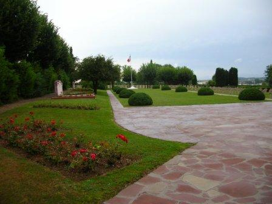
_Sarrebourg - cimetière militaire de Bühl_
_Photo de l’auteur_

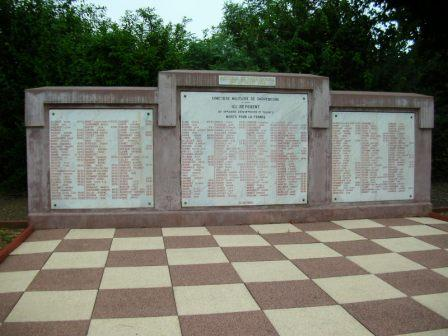
_Sarrebourg - cimetière miltaire de Bühl - stèle française_
_Photo de l’auteur_

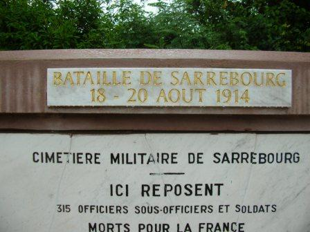
_Sarrebourg - cimetière militaire de Bühl - stèle française (détail)_
_Photo de l’auteur_

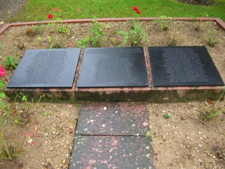
_Sarrebourg - cimetière militaire de Bühl - stèle allemande_
_Photo de l’auteur_

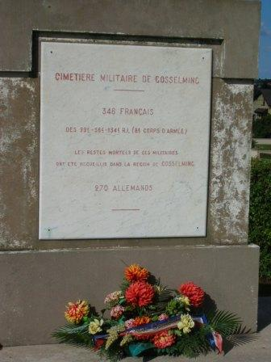
_Gosselming - cimetière militaire - stèle française_
_Photo de l’auteur_

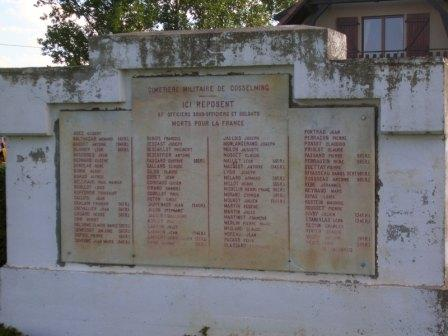
_Gosselming - cimetière militaire - stèle française_
_Photo de l’auteur_

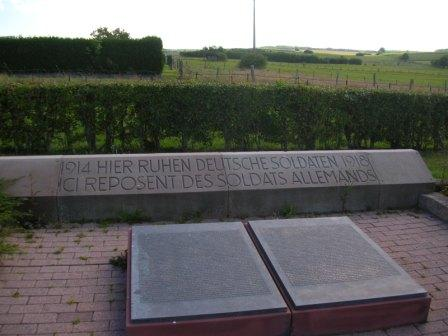
_Gosselming - cimetière militaire - stèle allemande_
_Photo de l’auteur_

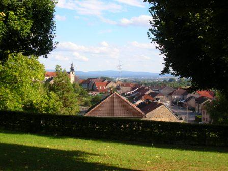
_Sarraltroff - vue vers le village_
_Photo de l’auteur_

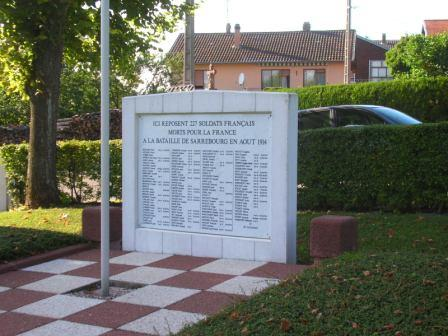
_Sarraltroff - Stèle française_
_Photo de l’auteur_

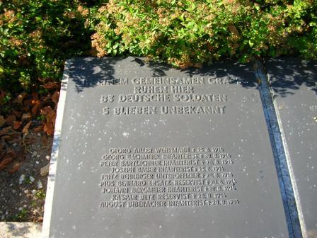
_Sarraltroff - stèle allemande_
