# Liège (5 - 16 août 1914)

Pour pouvoir mettre en oeuvre le plan Schlieffen, les Allemands doivent disposer des ponts sur la Meuse. La Belgique s’opposant à leur passage vu son statut de neutralité, ils doivent s’emparer de Liège, noeud de communications. Ils lancent un assaut de nuit qui échoue. L’artillerie lourde doit être mise en oeuvre pour réduire les forts un par un.

### Les plans allemands concernant Liège

Les lignes de marche des Ie et IIe armées allemandes (von Kluck et von Bülow) sont les routes qui franchissent la Meuse de Maastricht à Maaseik. Dès le moment où l’Allemagne renonce à violer le territoire hollandais pour ne pas se créer un adversaire de plus, elle doit engager ses armées dans la zone comprise entre le Limbourg hollandais et l’Amblève.

Le débouché de cette zone étroite est commandé par la position fortifiée de Liège. Il est par conséquent indispensable, pour le déroulement normal du plan Schlieffen, de réduire la forteresse dans le plus bref délai.

**[Article lié : le fort de Loncin](article_06_88.md)**

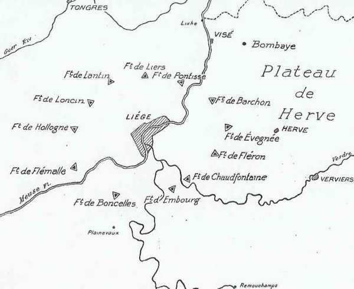
_Forts de Liège_
_Action de l’armée belge_

Le Commandement allemand compte n’avoir affaire qu’à deux régiments qui y tiennent garnison en temps de paix et charge de cette mission une brigade de chacun des C.A. de première ligne.

Dès le 4 août, l’Etat-Major allemand peut mettre en mouvement, sous les ordres du général von Emmich, commandant du 10e C.A., l’armée de la Meuse qui comprend :

- Le 25e R.I. de Aix-la-Chapelle.
  La 34e Br. du 9e C.A. venant de Schwerin.
  La 27e Br. du 7e C.A. venant de Cologne.
  La 14e Br. du 4e C.A. venant de Halberstadt.
  La 11e Br. du 3e C.A. venant de Brandebourg.
  La 38e Br. du 10e C.A. venant de Hanovre.
  La 43e Br. du 11e C.A. venant de Cassel.

Soit 59.800 hommes lourdement armés d’artillerie et de mitrailleuses. Les unités sont prélevées sur l’effectif de la IIe armée (von Bülow).

_Général von Emmich (10e C.A.)_
_Collection privée_

L’armée de la Meuse s’adjoint le 2e C.C., 2 batteries de mortiers de 210, une escadrille d’avions et un zeppelin.

Dès le troisième jour de la mobilisation, ces forces doivent franchir la frontière belge et tenter un coup de main contre Liège dès le cinquième jour. En cas d’échec, l’artillerie de gros calibre interviendra dès le onzième jour. Quand Liège sera prise, l’O.H.L. enverra l’ordre de mise en route de la masse tournante de l’armée, qui doit déferler à travers le territoire belge. La route de Liège doit être forcée au plus tard le 12e jour de la mobilisation.

Les cinq ponts de Liège doivent tomber intacts aux mains des Allemands, de même que les quatre lignes de chemin de fer reliant en cet endroit l’Allemagne et la Belgique à la France, car le ravitaillement des armées s’effectue par chemin de fer.

### La position fortifiée

**[Lien vers carte](../img/forts_liege2.jpg)**

Les forts de Liège ont été conçus par Brialmont. Ils ont pu se réaliser grâce à la persévérance du Roi Léopold II et de Beernaert. La position fortifiée de Liège comprend douze forts, six petits triangulaires et six grands pentagonaux. Ils entourent la ville à une distance de 7 à 9 km du centre. Les distances entre forts varient entre 2 et 6 km.

Chaque fort est équipé de 2 canons vétustes de 150 pouvant tirer à 8 km un projectile de 40 kg, de 2 canons de 120, de 1 ou 2 obusiers de 210 et de 2 canons de 57 à tir rapide pour la défense rapprochée.

Ces canons dégagent une forte fumée car ils utilisent de la poudre noire, alors que la poudre sans fumée avait été inventée.

Brialmont a prévu des voûtes de béton susceptibles de résister au choc et à l’explosion d’obus chargés de 60 kilos de poudres brisantes. Le béton n’est pas armé, contrairement à celui des forts français. Les forts de Verdun pourront par exemple résister aux obus de 420.

Les forts belges ont été construits à l’époque où le béton était encore d’un usage expérimental et ne comportent qu’un seul étage, peu enfoui. Les cuirassements ne dépassent pas une épaisseur de 22 mm et peuvent résister aux obus de 210 d’un poids de 91 kilos. Or, les projectiles de 420 pèsent dix fois plus !

### Le général Leman prend le commandement

Le dernier jour de 1913, le lieutenant général comte de t’Serclaes de Wommerson, commandant de la position fortifiée, décède subitement. Le gouvernement belge songe à doter la place d’un gouverneur énergique et d’une réputation incontestée.

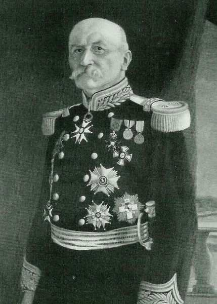
_Général Leman (P.F. Liège)_
_La Belgique et la guerre_

Leman accepte le poste et souhaite construire dans les intervalles entre les forts une ligne ininterrompue d’ouvrages d’infanterie, ligne couverte par une puissante artillerie mobile de forteresse. Mais le ministère de la guerre estime que Leman a « des visées trop hautes ». L’Etat-Major lui alloue toutefois un budget de 30.000 francs pour dégager les forts de Fléron et de Chaudfontaine.

Le jour de la déclaration de guerre de l’Autriche à la Serbie, le 28 juillet, Leman fait entamer la mise en état des forts. Il fait ériger les terrassements qui doivent former trois lignes concentriques de tranchées et de redoutes dont la plus éloignée, à hauteur des forts, mesure 48 km. Tout le long de la ceinture des forts, jour et nuit, des milliers de soldats et 20.000 travailleurs civils se mettent à déblayer les champs de tir, abattre arbres et maisons, creuser des tranchées et des redoutes.

Lundi 3 août, Leman sollicite l’autorisation de procéder aux destructions « de la première série » devant Liège. Le génie fait sauter les tunnels de Hombourg sur la voie ferrée de Verviers à Aix-la-Chapelle et de Nasproué, sur la voie de Liège à Luxembourg, ainsi que ceux de trois-ponts et de Stavelot. Les voies de chemin de fer sont coupées et des déraillements volontaires de locomotives sont provoqués dans les tunnels de Coo, de Roanne, de Remouchamps, de Verviers est et de la Sauvenière à Spa.

En même temps, les ponts sur la Meuse entre Liège et la frontière hollandaise, à Visé et à Argenteau, sont détruits.

Dans la nuit du 4 août, l’ordre est transmis de faire sauter tous les ouvrages d’art des chemins de fer de la province de Luxembourg ainsi que les ponts d’Engis, d’Ombret, d’Hermalle-sous-Huy.

Le 4 août, ces travaux sont inachevés.

### Les forces en présence

Les forces dont dispose le général Leman sont les suivantes :

Faisant partie de la 3e division d’armée

| Unité | Commandant |
| --- | --- |
| 9e brigade mixte | Général Gillis |
| 11e brigade mixte | Général Bertrand |
| 12e brigade mixte | Général Vermeulen |
| 14e brigade mixte | Général Aldringa |

Autres unités

| Unité | Commandant |
| --- | --- |
| Deux régiments de lanciers |  |
| 3e régiment d’artillerie |  |
| Un bataillon du génie |  |
| Un corps de transports |  |

A partir du 5 août

| Unité | Commandant |
| --- | --- |
| 15e brigade mixte |  |
| Un groupe d’artillerie | Commandant Massart |

Les troupes de forteresse

| Unité | Commandant |
| --- | --- |
| 9e régiment de forteresse |  |
| 11e régiment de forteresse |  |
| 12e régiment de forteresse |  |
| 14e régiment de forteresse |  |

12 batteries de forteresse||

Ce qui donne un effectif entre 33.000 et 35.000 hommes pour défendre un périmètre de 50 km.

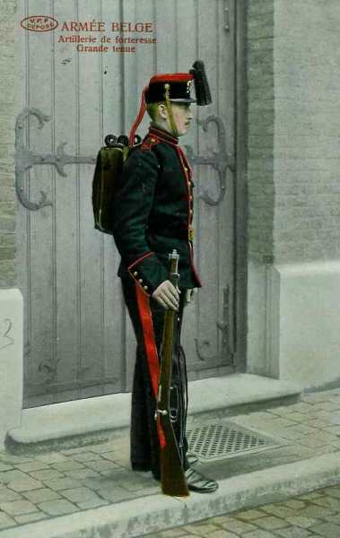
_Artilleur de forteresse_
_Collection privée_

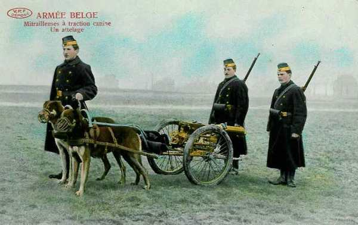
_Mitrailleuse belge_
_Collection privée_

Les forces mises en œuvre par les Allemands comprennent six brigades d’infanterie, trois divisions de cavalerie, de l’artillerie et du génie, soit 59.800 hommes, 166 canons et obusiers et 200 mitrailleuses.

### 4 août : reconnaissances et premiers affrontements

Dès le 4 août à 6 h, Leman ordonne de lancer des escadrons à la découverte de la rive droite de la Meuse. Le 2e lanciers franchit le pont sur la Meuse et continue vers le plateau de Herve. Dès 8 h, l’escadron arrête sa course à trois km de Herve. Le cavalier Fonck est envoyé en reconnaissance et découvre un groupe de cavaliers allemands. Il en abat un avec sa carabine mais son cheval est abattu par des cyclistes allemands. Fonck se dégage mais est encerclé et un coup de feu l’étend dans un fossé. C’est le premier belge tué de la grande guerre.

Les autres lanciers suivent la progression  allemande et renseignent le quartier du général Leman au moyen de messages par pigeons.

A Visé, un observateur belge signale une colonne allemande descendant sur la petite ville. A 13h, les cavaliers allemands débouchent dans l’axe du pont détruit et un feu roulant se déclenche de la rive tenue par les Belges, mais des tireurs allemands s’installent à leur tour le long de la Meuse. Vers 14h30, l’artillerie allemande se met à arroser les positions belges à partir de la butte de Mouland, provoquant la réplique du fort de Pontisse.

A Lixhe, face au gué, les Allemands arrosent la position belge et les cavaliers allemands entreprennent de passer la Meuse. L’ordre de retraite est donné à 16h45.

Le passage à Lixhe permettra aux Allemands de contourner les forts de Liège par le nord. Contrairement aux plans de Brialmont, aucun fort n’avait été construit pour défendre le gué de Lixhe.

### 5 août

**[Lien vers croquis directions d’attaque](../img/attaque_liege2.jpg)**

**4h30 :**

Les canons allemands commencent à arroser les forts de Liège mais ceux-ci subissent peu de dommages car il ne s’agit encore que de projectiles de petit calibre. En revanche, les batteries allemandes subissent de sérieux dégâts à Argenteau, Dalhem, Micheroux et ailleurs.

**5h30 :**

Un parlementaire allemand se présente à un avant-poste belge sur la route de Fléron. Il est emmené, les yeux bandés, au fort de Fléron, puis au quartier général, rue Sainte-Foi. Il présente l’ultimatum et déclare attendre la réponse jusqu’à 13h. En cas de refus, la ville sera bombardée par des zeppelins.

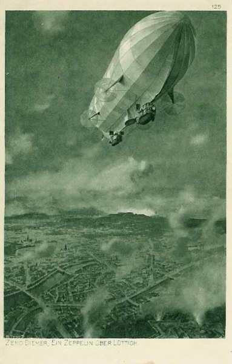
_Zeppelin survolant Liège_
_Collection privée_

Un échange de télégrammes a lieu entre Liège et Bruxelles et la réponse transmise rue Sainte-Foi est la suivante : « relations diplomatiques rompues. Continuez opérations : 15e brigade mixte a ordre de vous renforcer ».

Le général Leman refuse par conséquent d’accéder à cette demande et le parlementaire est reconduit dans les lignes allemandes. A peine a-t-il rejoint ses positions que le fort de Fléron se met à canonner les troupes de la 14e brigade allemande.

**10h :**

Le premier assaut en plein jour est déclenché contre le fort de Barchon. Les forts de Pontisse et d’Evegnée pilonnent les creux du terrain. Les Allemands, au prix de nombreuses pertes, parviennent au glacis mais y sont fauchés par le tir des mitrailleuses et de l’infanterie belge.

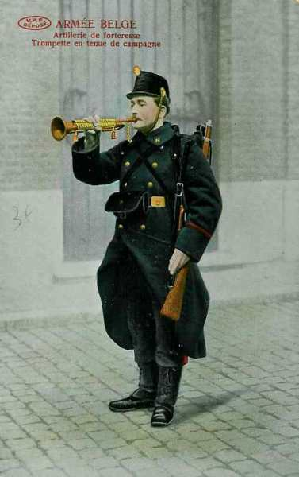
_Artilleur de forteresse_
_Collection privée_

**11h :**

Les derniers assaillants décrochent devant le fort de Barchon. Le bombardement d’artillerie reprend de plus belle et le fort perd ses observatoires de Blegny et de Cerexhe.

Pendant ce temps, à proximité du gué où étaient passées les avant-gardes de cavalerie, les Allemands construisent un pont destiné à la 34e brigade, chargée de passer au cours de la nuit entre les forts de Liers et de Pontisse. Un observateur surveille les travaux et fait tirer les grosses coupoles des forts, disloquant le pont. Par trois fois, le fort de Pontisse détruira l’ouvrage.

**12h :**

Le général Bertrand, commandant la 11e brigade belge, apprend que les intervalles proches du fort de Barchon ont été forcés et décide de mener une contre-attaque énergique. Les Allemands sont parvenus à Chefneux. Deux compagnies du 14e sont dirigées vers cette localité et le 31e de ligne marche vers Housse et le village de Barchon.

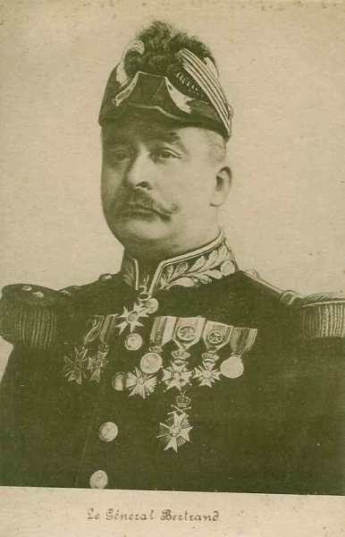
_Général Bertrand (20e brigade)_
_Collection privée_

**13h :**

L’artillerie allemande prend à partie les troupes belges qui s’avancent. Les Belges reprennent toutefois Chefneux et parviennent à la route militaire Barchon - Evegnée.

**Fin d’après-midi :**

L’observateur belge devant Lixhe doit battre en retraite, pourchassé par des patrouilles allemandes. Le fort de Pontisse doit à présent tirer à l’aveuglette. Il doit de plus répliquer aux mortiers de 210 installés sur la rive droite de la Meuse. Jusqu’à 16h, un « taube » (avion allemand) règle le tir des artilleurs en survolant Pontisse.

Le fort d’Evegnée, pilonné des heures durant par des mortiers de 210 voit ses deux pièces de gauche neutralisées. Deux bataillons du 32e de ligne nettoient les abords du fort et s’installent sur la route militaire dans l’axe Evegnée - Barchon.

**En soirée :**

La 34e brigade allemande entreprend de passer sur le pont construit par les pionniers mais l’artillerie se trouve encore sur la rive droite de la Meuse quand les fantassins belges entrent en action.

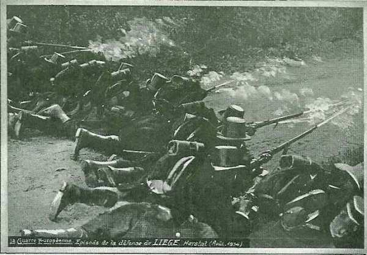
_Défense de Liège_
_Collection privée_

**21h :**

Leman télégraphie au Roi : « Cet après-midi, engagement sérieux dans l’intervalle Barchon - Meuse. Troupes allemandes repoussées par la 11e brigade. La nuit, attendons une attaque vis-à-vis Boncelles ».

Albert Ie fait télégraphier à Leman « Vous subirez certainement une attaque de nuit. Le Roi demande que vous placiez sans retard votre quartier général à l’abri de toute surprise ».

**A la nuit tombante :**

Les six brigades de l’armée de la Meuse sont rassemblées à distance d’attaque, à Hermée (34e), Argenteau (27e), Micheroux (14e), Saint-Hadelin (11e), au sud de Boncelles (38e) et vers Plainevaux (43e). A 22h, elles commencent une attaque concentrique.

**22h :**

Les troupes allemandes sont à 5 km de la citadelle de Liège. Elles comptent emprunter des chemins entre le fort de Liers et de Pontisse, mais soudain, le fort de Pontisse se met à arroser Hermée de ses projectiles, suivi peu après par le fort de Liers. La 34e brigade fonce en avant pour échapper au pilonnage et arrive au glacis du fort de Pontisse, mais se fait refouler par les tirs de l’infanterie belge.

### 6 août : assaut généralisé dans le courant de la nuit

**34e brigade allemande**

En résumé, La brigade a pour mission de remonter la rive gauche de la Meuse sur le plateau dominant le fleuve, d’Heure-le-Romain à la Citadelle.

L’intervalle est défendu par le 9e de ligne. Leman envoie sa réserve, la 15e brigade mixte, rassemblée à Fragnée, en renfort vers le fort de Boncelles. La 34e brigade allemande se décide à la retraite. Ses troupes se replient vers Sprimont.

**1h :**

Un accrochage a lieu au cimetière de Rhées, que les fantassins belges avaient transformé en redoute. Les grenadiers progressent et envahissent bientôt ce cimetière. Un combat de corps à corps s’engage.

**2h :**

Le 89e grenadiers allemand règne en maître sur la plaine et se regroupe près du cimetière de Rhées. La troupe allemande marche sur Herstal mais le reste de la 34e brigade, engagé entre les forts de Liers et de Pontisse, reste cloué sur place. Le 90e fusiliers s’empare du village de Pontisse et gagne la route de Vivegnis à Herstal, mais, à la lisière de Herstal, 400 fantassins belges veillent. Ils constituent la seconde ligne de défense. La grand’ route de Vivegnis - Herstal a été barricadée ainsi que la route de Rhées et le pont de Wandre. Chaque barricade est pourvue d’un tas de paille  imbibé de goudron.

Dès que les Allemands apparaissent,  les tas de paille sont allumés, le tir déclenché et les Allemands sont refoulés devant les barricades. Les pertes allemandes sont considérables.

Un drapeau allemand est capturé (le premier de la guerre) au pont de Wandre.

**3h30 :**

Une petite troupe allemande a réussi à s’infiltrer dans Liège et se rend au Q.G. belge, rue Sainte-Foi. Le général Leman échappe à la capture et se rend à la citadelle puis au fort de Loncin.

**9h :**

Le chef de la 34e brigade allemande donne l’ordre de retraite. Les forts de Pontisse et de Liers tirent sur les concentrations allemandes se trouvant dans l’intervalle. La 34e brigade remonte tant bien que mal vers Hermée. La 34e brigade compte 900 prisonniers et 1500 tués ou blessés. Les troupes repassent la Meuse à Lixhe et battent en retraite jusqu’à Mouland. C’est un échec allemand dans ce secteur.

**27e brigade allemande**

La brigade doit remonter la rive droite de la Meuse sur la route de crête allant d’Argenteau avant de descendre sur Jupille, soit l’intervalle entre le fort de Pontisse et celui de Barchon.

Les Belges ont construit un point de résistance à Rabosée, au carrefour des « Quatre-Bras ». Le barrage dispose de 450 défenseurs. Chaque défenseur a reçu 400 cartouches.

**0h :**

La 27e brigade allemande attaque. Il n’y a que 450 belges pour faire face à 5000 Allemands. Ces derniers se présentent en formation de marche, en colonne par quatre. Dès que les troupes allemandes parviennent à hauteur du barrage, les Belges ouvrent le feu. Des dizaines d’assaillants sont foudroyés et les soldats allemands se réfugient dans les haies et les prairies. Les soldats belges ayant tiré trop haut, des balles vont frapper le 25e d’infanterie qui se trouve en deuxième position. Ceux-ci répliquent et tirent dans le dos de leurs compagnons du 53e, pris entre deux feux. Les soldats se retournent et tirent à leur tour sur le 25e régiment. Les deux régiments allemands se fusillent mutuellement !

Pendant deux heures, les Allemands lancent des vagues d’assaut successives.

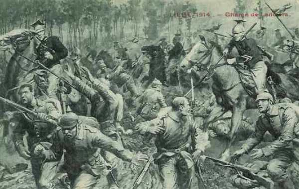
_Charge de lanciers à Liège_
_Collection privée_

**2h10 :**

Le capitaine Langemak, du 25e parvient à pénétrer dans une maison avec une mitrailleuse et il fait déclencher un tir meurtrier sur la tranchée belge qu’il domine.

**4h30 :**

Les Belges reçoivent une nouvelle dotation de munitions. Ils peuvent déloger les tireurs allemands qui dominent leur tranchée.

Le 53e d’infanterie allemand parvient à déborder la redoute dominant la vallée de la Meuse. Les Allemands doivent attendre jusqu’à 6h30 pour l’occuper car 18 survivants retranchés la défendent encore.

**5h :**

Les Allemands s’installent dans les premières tranchées belges. Ils mettent des mitrailleuses en batterie et prennent les Belges en enfilade. L’ordre de retraite doit être donné.

**6h30 :**

La 27e brigade déferle sur le barrage belge. Il y a 133 tués parmi les défenseurs. Les Allemands ont un millier de tués et de blessés, si bien que la 27e brigade n’exploite pas son succès.

**7h :**

La retraite de la 27e brigade est sonnée et celle-ci fait demi-tour. Les troupes se regroupent à Argenteau et Dalhem. C’est l’échec total dans ce secteur.

**14e brigade allemande**

La 14e brigade allemande attaque le secteur entre Evegnée et Fléron à partir de Soumagne via Micheroux - Rétinne - Queue du Bois - Jupille. Cet intervalle est défendu par la 14e brigade belge. Le commandant de la 14e brigade allemande est tué. Ludendorff, quartier maître de la IIe armée allemande, est par hasard à cet endroit. Il prend le commandement de la brigade et parvient à atteindre Jupille dans la matinée.

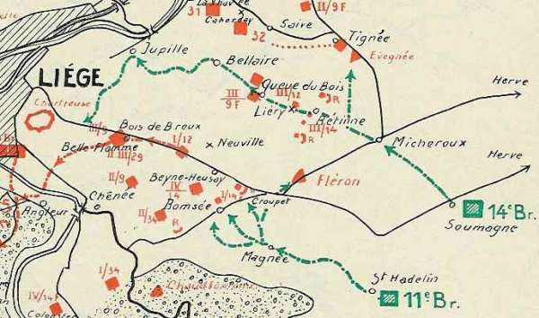
_Itinéraire de la 14e brigade allemande_
_La Belgique et la guerre_

**1h30 :**

La tête de la 14e brigade quitte Micheroux. Elle contrait à la retraite de petites positions belges et arrivent à Sur-Fossé, non loin de Liéry. A 700 m  de là, à Liéry, des Belges attendent les Allemands avec deux pièces de 75. Le commandant belge lance trois sommations et déclenche le tir quand les Allemands sont très proches des canons. Ils sont fauchés par le tir de boîtes à balles. Le général von Wüssow est mis hors de combat. A l’entrée de Rétinne, les soldats allemands se croyant attaqués par la population civile, se mitraillent mutuellement jusque 4h.

Ludendorff prend le commandement de la colonne, remplaçant le général von Wüssow, et marche sur Queue-du-Bois, soutenu par trois gros projecteurs et quatre obusiers de 105. Le village de Queue-du-Bois est défendu par dix compagnies.

**2h30 :**

Les premiers coups de feu sont échangés mais la vague allemande déferle et essaie de s’insinuer à travers les vergers qui bordent la route.

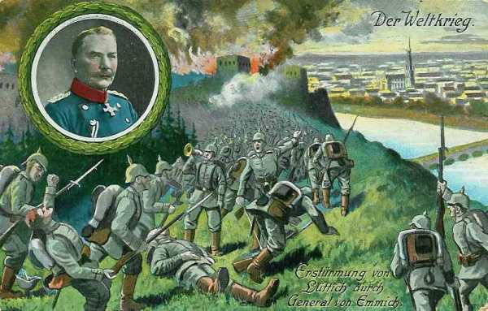
_Assaut de Liège_
_Collection privée_

**3h30 :**

Les Allemands amènent un, puis plusieurs obusiers de 105. Ludendorff crie inlassablement « mes chasseurs, en avant ». Une bataille de rues a lieu dans Queue-du-Bois. Les défenseurs refluent vers Bellaire, par crainte d’être encerclés. Seuls quelques groupes des 9e et 12e de ligne tiennent encore tête.

**5h :**

Un obusier de 105 commence à tirer sur Liège et n’arrête son tir qu’à 10 h. Les obus tombent dans le quartier d’Outre-meuse.

**5h40 :**

Toute résistance belge est annihilée dans le village ravagé de Queue-du-Bois. Les Allemands déferlent vers Liège.

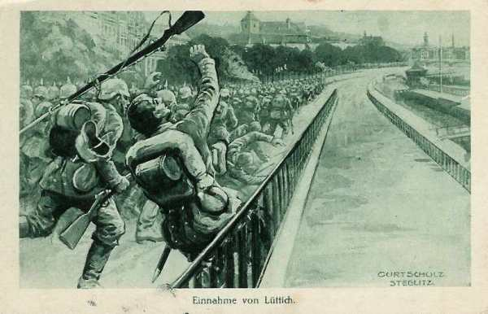
_Prise de Liège_
_Collection privée_

**7h20 :**

Les Belges sont rejetés vers Jupille où une compagnie du 32e de Ligne arrive dans le secteur. Ils essaient de contre-attaquer vers Bellaire.

**8h :**

Traqués par une fusillade intense et des tirs d’obusiers, les Belges quittent définitivement Bellaire et regagnent Jupille.

La 14e brigade est la seule à avoir réussi à percer la ligne de défense des forts de Liège.

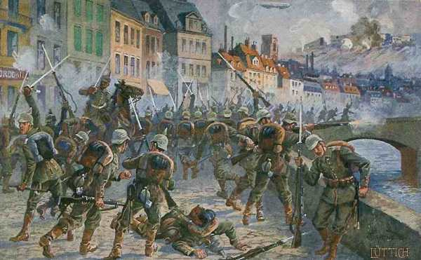
_Les Allemands pénètrent dans Liège_
_Collection privée_

**11e brigade allemande**

L’objectif de cette brigade (Général von Wachter) est l’intervalle entre les forts de Chaudfontaine et de Fléron. Le relief est accidenté car le plateau de Herve est traversé par la Vesdre, la route de Liège à Verviers et le chemin de fer de Liège à Aix-la-Chapelle.

Les défenseurs belges se retirent vers Beyne-Heusay mais le terrain est tellement battu par l’artillerie des forts que la 11e brigade abandonne le terrain conquis et reflue sur Magnée.

**2h :**

Une poignée de fantassins belges s’oppose à l’investissement de Magnée. Les premières vagues allemandes dépassent le village et se heurtent aux positions belges. Des tranchées occupent un vaste verger. La 2e compagnie du 14e de ligne arrose de balles la tête de la 11e brigade allemande. Le sud du village de Romsée reste bien défendu mais est tourné par des infiltrations allemandes au nord-est du fort de Fléron.

**4h :**

Le commandant belge du secteur reçoit un coup de téléphone des bureaux de la rue Sainte-Foi lui intimant l’ordre de battre en retraite. Cet ordre, en fait, n’a pas été donné par le général Leman. Le commandant demande confirmation mais ne parvient pas à joindre le Q.G. Les Belges refluent en bon ordre vers Beyne-Heusay et les obusiers allemands détruisent le village de Romsée. Les Allemands se rapprochent du fort de Fléron mais la défense rapprochée du fort les mitraille.

**9h :**

Le général von Wachter fait sonner la retraite. Les Allemands reculent jusqu’à Magnée mais sont pilonnés par les canons du fort de Fléron.

De nombreux civils sont abattus dans les villages traversés. L’intervalle Embourg - Chaudfontaine ne sera pas attaqué.

C’est un échec allemand dans ce secteur.

**38e et 43e brigades allemandes**

Elles sont commandées par le général von Hülsen.

L’objectif est de pénétrer dans Liège par les deux rives de la Meuse, en passant de part et d’autre du fort de Boncelles, vers le pont de chemin de fer à l’ouest d’Angleur et les hauteurs à l’ouest de la gare des Guillemins.

A Boncelles et dans les bois du Sart-Tilman, ont lieu des accrochages. Les 73e, 74e, 83e et 84e régiments s’avancent dans l’ordre. L’avant-garde se heurte à trois redoutes belges. Les tirs belges, dont ceux du fort d’Embourg, atteignent les régiments qui suivent l’avant-garde. Les fantassins allemands des 73e et 74e régiments tirent sur leur propre avant-garde, ce qui provoque la panique. Le général von Hülsen est blessé, probablement par un de ses hommes.

La brigade mecklembourgeoise occupe les hauteurs de Herstal mais ne peut aller plus loin. Le 6 à 8h15, le commandant donne l’ordre de retraite vers Visé. C’est également un échec allemand dans ce secteur.

**1h15 :**

Des compagnies de fantassins contournent la redoute 4 et capturent une partie des défenseurs, et la redoute 6 est attaquée à revers.

La 15e brigade mixte, qui arrive de Huy, reçoit l’ordre du général Leman de tenir le secteur du Sart-Tilman et l’intervalle Boncelles - Meuse. Toute la nuit, un âpre combat oppose Belges et Allemands dans la clairière du Sart-Tilman.

**4h45 :**

Les redoutes 1, 2 et 3 de la clairière du Sart-Tilman sont reprises par les Belges grâce à un soutien d’artillerie.

Le fort de Boncelles reçoit un tir nourri à revers, dirigé contre la gorge de l’ouvrage. Trois fois, des vagues d’assaut allemandes sont repoussées. Privés de leurs officiers, une centaine d’Allemands agitent le drapeau blanc, sont fait prisonniers, et sont amenés à l’intérieur du fort.

Les deuxième et troisième bataillons de chasseurs belges attaquent un groupe d’Allemands occupant encore le bois de Chatqueue au nord du fort de Boncelles. Les Allemands doivent reculer et le prince Frédéric de Lippe est tué.

**5h :**

Les Belges parviennent à reprendre la lisière ouest de la clairière de Sart-Tilman puis se dirigent vers la redoute 5, mais ils sont pris en enfilade par des mitrailleuses allemandes.

**6h15 :**

Deux bataillons du 29e de Ligne arrivent pour stabiliser la situation dans la clairière du Sart-Tilman.

**9h :**

Dans le secteur, l’armée belge a perdu 428 hommes, les Allemands probablement autant, mais les Belges restent maîtres du terrain. Cinq des six brigades assaillantes refluent. Dans ce secteur non plus, les Allemands ne parviennent pas à percer.

**Citadelle de Liège**

La citadelle de Liège est bombardée. Elle n’est occupée que par quelques réservistes. Le commandant de la citadelle, un colonel des gardes civiques, fait hisser le drapeau blanc après deux heures de bombardement. Ludendorff et von Emmich en sont avisés et font suspendre le bombardement.

Von Emmich décide d’envoyer un de ses représentants au général Leman. Les parlementaires allemands sont accompagnés jusqu’au fort de Loncin par les autorités civiles de la ville de Liège.

**Q.G. belge et allemand**
**7h30 :**

Malgré l’échec du coup de main allemand, Leman est persuadé que la ville est perdue. Il donne l’ordre à la 3e division de rejoindre l’armée de campagne qui se trouve le long de la Gette. Les forts sont livrés à eux-mêmes pour leur défense et serviront de forts d’arrêt.

« Les troupes de la rive droite devront repasser la Meuse et se reformer sur la ligne allant  du fort de Lantin au fort de Hollogne, face vers Liège. Mon quartier général est au fort de Loncin. »

**13h :**

Une première colonne de la 3e division se met en marche vers 13 h et parvient à la nuit tombante à Waremme

**16h :**

Leman envoie le message suivant au Q.G.Q.

« 3e D.A. a résisté avec vrai succès à des attaques violentes de forces nombreuses. La 3e D.A. est complètement usée. Prenons dispositions pour nous porter le plus tôt vers Waremme avec le reste de la 3e D.A. Ces troupes se rassemblent entre Loncin et Hollogne ».

**17h :**

Le parlementaire allemand est mis en contact avec le général Leman après que le drapeau blanc ait été hissé sur la citadelle de Liège mais s’entend dire que la reddition de la citadelle n’a aucune signification. Leman lui déclare « On a hissé le drapeau blanc sans mon ordre. Je continue à me défendre ».

**18h :**

Le parlementaire allemand rejoint von Emmich. Ludendorff ordonne immédiatement la reprise du bombardement avec les batteries dominant les collines de la rive droite de la Meuse. Le gazomètre explose.

**22h :**

Ludendorff ordonne à la compagnie de chasseurs d’occuper les accès des ponts de la Meuse à Liège. La compagnie arrive aux ponts sans rencontrer personne. La 14e brigade commandée par Ludendorff se trouve seule à l’intérieur de la ceinture des forts, isolée du reste de l’armée. Elle n’est pas en danger puisque la 3e division belge est partie et qu’elle est hors de portée du tir des forts.

**24h :**

Toute la 3e division a quitté Liège et les douze forts restent totalement isolés.

### 7 août

Les Allemands arrivent au pont d’Amercoeur qu’ils croient miné, en utilisant des prisonniers belges comme bouclier.

Ludendorff se présente devant la porte de la citadelle. Il en fait sortir la garnison. La 14e brigade occupe la citadelle. Peu après, von Emmich arrive à son tour dans Liège et 5000 hommes prennent possession de la ville.

Leman décide de défendre les forts jusqu’ au bout. Le Gouvernement français décerne le cordon de grand croix de la Légion d’Honneur à la ville de Liège.

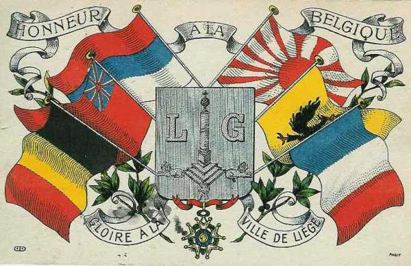
_La ville de Liège, décorée de la Légion d’Honneur_
_Collection privée_

Ludendorff se risque à faire entrer à Liège la 14e brigade rassemblée près de la Chartreuse.

Les forts continuent toutefois de résister et à barrer les routes et les voies ferrées. Le général von Emmich menace de détruire Liège si les forts ne se rendent pas. Sa demande est refusée après consultation du gouvernement belge.

Comme aucun fort ne veut se rendre, Ludendorff est chargé de quitter Liège et d’aller exposer la situation au commandant de la IIe armée, von Bülow.

Moltke constitue une armée de siège, composée de trois C.A. Le général von Einem est désigné pour la commander, soit 120.000 hommes.

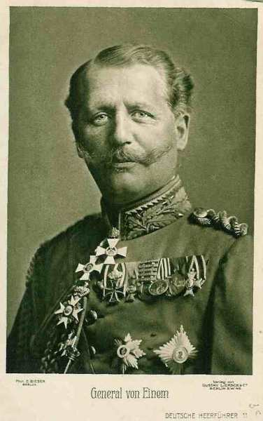
_Général von Einem (IIIe armée)_
_Collection privée_

Comme les Allemands sont dans la ville de Liège, ils pourront y faire rentrer des canons de gros calibre et bombarder les forts à revers, leur point faible.

**Fort de Pontisse**

Un capitaine allemand vient demander la reddition du fort mais est renvoyé. Le commandant du fort fait détruire les échelles métalliques servant à escalader les fossés et donne l’ordre d’abattre celui qui abandonnerait son poste.

**Fort de Loncin**

Le fort tire sur une colonne allemande qui vient de franchir le passage à niveau Ans - Liers. Vers midi, le bourgmestre de Liège demande à être reçu par le général Leman, qui fait part des intentions des Allemands de détruire la ville si les forts ne se rendent pas. Le commandant du fort, Naessens, déclare que le fort de Loncin ne se rendra jamais (il a d’ailleurs fait prêter serment à la garnison) . Vers 18h, les premiers projectiles commencent à s’abattre sur le fort. Ce sont de simples tirs de repérage. Les guetteurs belges sont dans le clocher de l’église de Loncin et aperçoivent des Allemands sur un terril. Le fort dirige son tir sur celui-ci et les Allemands en sont délogés.

### 8 août : chute du fort de Barchon

Ludendorff met au point le plan qui doit emporter la décision à Liège et obtient l’approbation de von Bülow.

La deuxième vague d’assaut met en ligne 120.000 soldats, constitués par les 7e, 9e et 10e C.A. de la IIe armée allemande.

**Fort de Barchon**

Les Allemands concentrent le tir des mortiers de 210 sur le fort de Barchon, dont la plupart des coupoles sont rapidement mises hors service.

**15h :**

Des gaz de plus en plus denses se répandent dans le fort. Le commandant décide de réunir le conseil de défense du fort. Quatre membres sur cinq votent pour la reddition.

**16h :**

Le drapeau blanc est hissé et le bombardement s’arrête. La première brèche est creusée dans la ceinture des forts. Liège est occupée par trois brigades. Le pont de Visé est détruit.

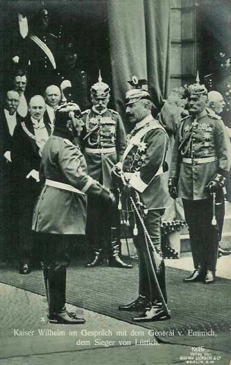
_L’empereur d’Allemagne en conversation avec le général von Emmich_
_Collection privée_

**Fort d’Evegnée**

Suite au bombardement, une petite coupole est déchaussée et trois gros canons sont mis hors d’usage. Vers midi, l’observateur du fort voit s’avancer une longue colonne allemande. Quelques minutes plus tard, les canons du fort ouvrent le feu et la colonne doit rebrousser chemin.

Les observateurs signalent également une colonne de munitions à quelques mètres du fort et celle-ci est soumise à un tir qui renverse les caissons.

**Fort de Pontisse**

La nouvelle de la chute du fort de Barchon porte un coup au moral des défenseurs. Le fort devait en effet, en collaboration avec Barchon, empêcher l’armée de von Emmich d’opérer sa jonction avec les renforts venus d’Allemagne.

### 8 août

La 3e Division d’armée rejoint, sous le commandement du général Bertrand, l’armée de campagne derrière la Gette.

Dans l’ordre du jour, le Roi Albert Ie rend hommage à cette division.

### 9 août

Les forts sont battus par l’artillerie allemande mais le calibre des obus (maximum 210) est insuffisant pour les détruire rapidement. Von Bülow demande l’envoi d’une batterie de 420.

**Fort d’Evegnée**

Un parlementaire allemand se présente à l’entrée du fort peu après 9h. Il demande, au nom de von Emmich, la capitulation du fort. Le commandant déclare vouloir continuer à se battre. Le fort continue à balayer son secteur. Peu après 17, les observateurs du fort doivent quitter le clocher de Tignée.

Une batterie allemande commence des tirs de repérage.

**Fort de Pontisse**

Dans la matinée, des batteries allemandes établies à Saint-Remy pilonnent le fort. Les Allemands proches du fort déclenchent un tir de mitrailleuses, empêchant les observateurs de faire leur travail.

D’autres batteries tirent de Wandre et de Cheratte.

**Fort de Loncin**

Les canons du fort commencent à tirer dès 9h du matin sur une colonne allemande perçue sur la côte d’Ans. Dans le courant de la soirée, un avion allemand est détruit.

### 10 août

Von Bülow rappelle la situation réelle à l’O.H.L. « tous les forts, sauf Barchon, sont encore au pouvoir de l’ennemi. Aussi longtemps que les forts ne seront pas tombés, la traversée de Liège est inexécutable ».

Le général de cavalerie von Einem (10e C.A.) est chargé de commander le « corps de siège ». Outre 120.000 hommes, il compte 42.000 chevaux et 500 pièces d’artillerie. Un train de 120 essieux, porteur des mortiers de 420, part de Essen et arrive en gare de Herbestahl à 23h, mais ne peut poursuivre plus avant : le tunnel a été obstrué par plusieurs locomotives. Il faut toute la nuit aux pionniers pour déblayer la voie.

**Fort de Pontisse**

Les officiers sont épouvantés par l’ampleur des dégâts : un fossé est entièrement rempli de gravats et deux canons de 150 sont fortement endommagés et les tourelles sont désaxées.

Toute la journée, le fort subit le tir de dix canons tonnant sans arrêt.

Dans la matinée, un groupe d’éclaireurs signale un rassemblement de troupes allemandes à Dalhem près de Visé. Le fort peut tirer et disperser la colonne et même détruire une batterie de 210.

**Fort de Fléron**

Le fort pilonne celui de Barchon, aux mains des Allemands. Les artilleurs réussissent à détruire une batterie allemande qui pilonnait le fort d’Evegnée. Comme le commandant du fort a été averti de l’arrivée du corps de siège, il pilonne tour à tour Julémont, Romsée, Micheroux, Rétinne, où les troupes allemandes sont signalées.

**Fort de Loncin**

Le fort essuie plusieurs projectiles allemands mais riposte, faisant taire les pièces allemandes.

### 11 août : chute du fort d’Evegnée

Le chargement et le transport terrestre, par tracteurs à vapeur, commencent. Il faut six heures pour amener au sol les dix remorques métalliques de 17 tonnes et les deux locomotives routières.

Les deux convois des mortiers de 420 démarrent dans l’après-midi. A 22h, les deux pièces de 420 s’arrêtent à Henri-Chapelle.

Sur ces entrefaites,  les 120.000 soldats chargés de réduire Liège entrent en Belgique. Le corps d’armée forme une colonne de 49 km de profondeur.

**Fort d’Evegnée**

Dès le matin, les tirs d’artillerie de calibre 210 s’intensifient. Le fort est pilonné de 6 à 8h sans pouvoir répondre, car plusieurs coupoles ont été mises hors d’état. Deux observateurs rejoignent le clocher de Tignée et repèrent une batterie derrière le château de Cerexhe-Heuseux. Les deux pièces encore valides du fort tirent dans cette direction mais la batterie allemande change d’emplacement.

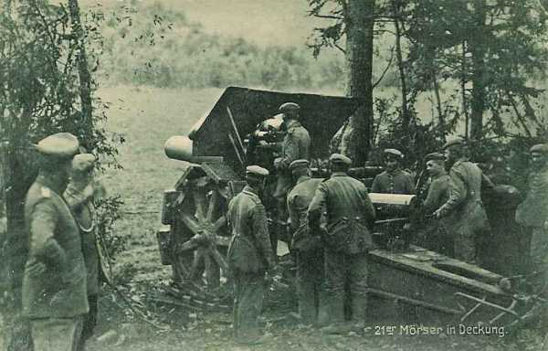
_Mortier allemand de 210 mm_
_Collection privée_

A midi, Evegnée n’a plus qu’une pièce utilisable pour les tirs à longue portée : l’obusier de 210. A 19h, les observateurs doivent abandonner le clocher de Tignée. L’obusier de 210 cale définitivement. Seul subsiste un canon de 150.

Il fait de plus en plus suffocant dans le fort. Certains soldats commencent à s’évanouir.

Devant cette situation désespérée, le commandant du fort consulte ses officiers.

A ce moment, un parlementaire allemand apporte un message demandant la reddition. Les officiers décident de rendre le fort pour éviter de faire périr la garnison de 380 hommes. A 16h, le drapeau blanc est hissé et les Allemands rendent les honneurs militaires à la garnison. Le commandant allemand prie le commandant belge de conserver son sabre.

**Fort de Chaudfontaine**

Les Allemands bombardent l’abbaye de Chèvremont qui constitue le poste d’observation du fort. Le fort lui-même est bombardé pendant une heure à partir du centre du village de Chênée, situé à près de trois kilomètres du fort.

**Fort d’Embourg**

Un feu roulant d’artillerie de calibre 210 s’abat sur Embourg et dure dix heures.

**Fort de Fléron**

Un hussard se présente devant le fort, drapeau à la main. Il est suivi par deux notables liégeois et demande à parler au commandant. Le hussard lit une longue note selon laquelle trente batteries de très gros calibre sont braquées sur Fléron et qu’elles tireraient jusqu’à ce que le fort soit anéanti. Le commandant du fort refuse de capituler. L’officier salue et repart pour Herve.

- En soirée, voici la position des troupes d’investissement :
  17e D.I. vers Moulaud.
  18e D.I. + 28e brig. vers Saive - Fort d’Evegnée - ouest de Soumagne.
  13e D.I. d’Ayeneux à Prayon.
  14e D.I. + 43e brig. de Prayon à Beaufays et Monchamps.
  Cavalerie de corps au confluent de l’Amblève.
  38e brig à Esneux.
  Gros du 10e C.A. à Louveigné.
  14e brig. de Vottem à Ans.
  11e brig. d’Ans à Tilleur.
  27e brig. à Liège où deux ponts de bateaux ont été construits.
  9e D.C. entre l’Ourthe et la Meuse.

### 12 août : début des bombardements d’artillerie lourde

La ligne d’nvestissement se resserre.

Les obusiers de 420 sont acheminés par voie routière au village de Mortier, dans l’après-midi, à cinq kilomètres du fort de Barchon. Vers 18 heures, le bombardement du fort de Pontisse commence. Les forts de Liège sont en béton non armé donc incapables de résister à des obus de 420 (un obus de 420 a la hauteur d’un adulte et pèse plus de 900 kg).

- Le 9e C.A. est chargé de conquérir les forts de Pontisse, Liers et Fléron avec le concours de la 28e brigade.
  Le 7e C.A. et la 43e brigade se chargent de Chaudfontaine et d’Embourg.
  Le 10e C.A. garde le flanc gauche de l’attaque allemande.

A partir du matin, le fort d’Embourg subit un tir de destruction à raison de plusieurs coups à la minute. Dans la soirée, toute l’artillerie de l’ouvrage est détruite.

### L’artillerie lourde de siège

**Le 305 autrichien**

Ce canon est fabriqué par Skoda a été mis au point en 1910. Il se démonte en trois parties - pièce, affût et plate forme amovible - et peut parcourir de 25 à 45 kilomètres par jour. En moins de trois quarts d’heure, il est complètement mis en batterie. Le démontage est encore plus rapide. Il a un angle de tir de 60 degrés et lance des obus-torpilles à retardement à une distance de plus de onze kilomètres.

Lorsque la guerre éclate, l’Allemagne en possède quatre exemplaires, prêtés par l’Autriche-Hongrie.

**Le 420 allemand dit « grosse Bertha »**

Ce canon tire à 14,5 kilomètres des projectiles d’un mètre de hauteur, pesant 931 kilos et chargés de 106 kilos d’explosif. Plongeant de très haut (4.000 mètres) sur leur objectif, ses projectiles sont équipés d’une fusée d’amorçage, à retardement d’une seconde, qui permet à la torpille de pénétrer profondément dans le béton avant d’éclater.

Il faut une minute à un obus de 420 pour effectuer sa trajectoire.

Cette pièce est longue de 7,20 mètres sur son affût et pèse 98 tonnes.

Cinq longues remorques de métal, lourdes chacune de 17 tonnes, en roulant sur des roues jantées d’acier, sont traînées par des locomotives routières.

En 1914, l’armée allemande dispose de deux 420 sur voie ferrée (premier type) et de deux autres transportables par route.

**Fort de Chaudfontaine**

De gros obusiers installés à Fraipont et à Trooz envoient plusieurs projectiles sur le massif de béton. Une petite coupole est mise hors d’usage. La cheminée de la salle des machines est bouchée par des éboulis.

**Fort de Pontisse**

Le bombardement reprend avec une grande intensité dès 8h et l’atmosphère dans le fort devient malsaine.

Vers 17h30, les Allemands envoient une dizaine d’obus de 420 à partir du village de Mortier.

**Fort de Fléron**

Le fort, bien que battu par les obusiers, tient toujours et peut répondre aux tirs. Peu avant midi, un obus allemand atteint une coupole de 120. Une pièce reste utilisable et la coupole tourne encore. Toute la nuit, un ouragan d’acier s’abat sur le fort. Les Allemands réussissent à cerner le fort à quatre cent mètres du front de gorge et quatre lance-mines (minenwerfer) peuvent lancer des projectiles de 100 kilos sur les structures du fort.

### 13 août : chute des forts de Chaudfontaine, Pontisse et Embourg

Les forts de Pontisse, d’ Embourg et de Chaudfontaine subissent des dégâts considérables. Des mortiers de 420, installés à 4 km à l’est du fort rendu de Barchon, pilonnent le fort de Pontisse. A 11h30, ce dernier capitule après avoir reçu 43 obus de 420.

Le magasin à poudre du fort de Chaudfontaine explose.

Les forts d’Embourg et de Chaudfontaine se rendent à leur tour.

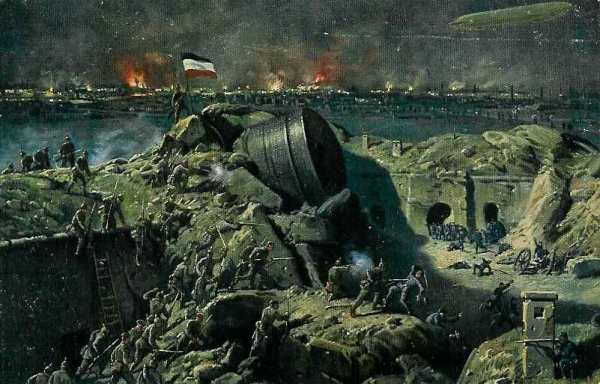
_Destruction des forts de Liège_
_Collection privée_

**Fort de Chaudfontaine**

Vers quatre heures du matin débute un bombardement intense qui va durer quatre heures. Les gaz pénètrent dans les locaux et menacent la garnison d’asphyxie.

A 10h30, un obus de 280 met feu aux réserves de poudre et de munitions. L’incendie qui en résulte transforme le centre du fort en brasier. Les explosions se succèdent pendant une demi-heure et 13.000 obus sautent. Le fort ne répondant plus à leurs tirs, les Allemands envoient une patrouille aux abords de la poterne et constatent la catastrophe. Les régiments entourant le fort organisent le sauvetage des blessés. Sur 300 hommes du fort, 60 sont morts et plus de 100 gravement blessés.

**Fort de Pontisse**

A 9h, un obus d’une puissance inouïe s’abat sur le fort. Un officier apporte le culot d’un obus qui s’avère être du calibre 420. Les artilleurs sont suffoqués par les gaz et ne peuvent plus répliquer.

A midi, le commandant décide de hisser le drapeau blanc. Le fort a encaissé 43 obus de 420.

Les Allemands rendent les honneurs de la guerre à la garnison et les officiers peuvent conserver leur sabre.

**Fort d’Embourg**

Les tirs des batteries allemandes s’attachent à détruire les coupoles.

**9h :**

Des parlementaires allemands demandent d’être reçus par le commandant. Celui-ci refuse de rendre le fort. Dès la chute de Chaudfontaine, tous les canons allemands du secteur sont pointés sur Embourg.

**Au milieu de l’après-midi :**

Deux petites coupoles sont retournées et leur canons détruits. Par la suite, les grosses coupoles doivent être abandonnées. Les Allemands se rendent compte que l’artillerie du fort est hors d’usage et décident de prendre l’ouvrage d’assaut.

**19h15 :**

Le 57e d’infanterie allemande se met en marche mais au moment où l’assaut va débuter, le fort hisse le drapeau blanc. La galerie centrale du fort menaçait en effet de s’effondrer.

**Fort de Fléron**

**11h :**

L’artillerie lourde interrompt son tir et des canons de campagne visent les coupoles. Le bombardement des grosses pièces recommence vers 13h. Les observateurs allemands sont juchés sur des terrils. A 17h, les canons du fort de Fléron se taisent et dans les galeries, l’air devient irrespirable. Un obus a percé la galerie centrale. Seules deux petites coupoles de 57 restent opérationnelles.

**Vers minuit :**

Des bruits inquiétants sont perçus : coups de pioches, cliquetis de machines. Le commandant du fort ordonne une sortie pour le défendre le fort contre un assaut. Les fantassins allemands occupés à des travaux d’investissement refluent, mais l’artillerie allemande intervient à nouveau, forçant les Belges à rentrer dans les souterrains.

**Fort de Lantin**

Le fort, le fort est soumis à un bombardement intensif. En deux jours, les coupoles sont neutralisées et une âcre fumée fait tousser les défenseurs.

### 14 août : chute des forts de Liers et de Fléron

**Fort de Fléron**

A l’aube, le bombardement reprend, puis le fort est atteint par un obus de 380, tiré du plateau de Belle-Flamme. Le commandant du fort réunit les principaux gradés et tous estiment qu’il serait inutile de prolonger la résistance. A 10h15, après les ultimes destructions, le clairon sonne la reddition.

**Fort de Liers**

Le commandement allemand décide d’en finir avec le fort de Liers et les deux mortiers de 420 quittent le village de Mortier pour s’attaquer à ce fort. Les autres batteries sont installées près de Milmort, dans le fond de Rhées et sur les hauteurs de Cheratte.

Les 400 hommes de la garnison risquent d’être asphyxiés par les gaz et le fort ne dispose plus ni d’électricité ni d’eau. Le conseil de défense se résout à la reddition. Les officiers belges, vu la belle résistance du fort, sont invités à conserver leur sabre.

**Fort de Boncelles**

Le fort a été isolé des combats jusqu’au 14 août. Un bombardement violent s’abat sur lui dans le courant de la journée. Très vite, l’aération est compromise.

**Fort de Loncin**

Les villages de Loncin et d’Alleur sont envahis par les Allemands. L’étau se resserre autour du fort.

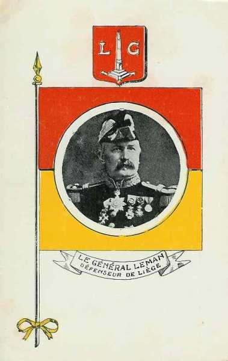
_Le général Leman, défenseur de Liège_
_Collection privée_

**Vers midi :**

Un parlementaire allemand s’approche, brandissant un drapeau blanc. Mais est blessé après trois sommations.

**Vers la fin de l’après-midi :**

Les derniers observateurs du fort de Loncin annoncent au général Leman que le fort est encerclé. Vu l’absence d’observateurs, le fort va devoir tirer au hasard.

**Vers 16h :**

Le bombardement systématique du fort commence. Les artilleurs et fantassins doivent s’installer dans la galerie centrale.

**Vers minuit :**

Un soldat essaie de sortir du fort pour observer les assaillants, mais il est immédiatement refoulé : les Allemands ne sont pas loin du fort.

### 15 août : chute des forts de Boncelles, de Lantin et de Loncin

Les mortiers de 420 sont amenés au champ de manœuvres de Bressoux.

La deuxième batterie de 420 arrive à Liège en gare des Guillemins d’où elle est transférée vers le par d’Avroy pour tirer sur les forts de Hollogne et Flémalle.

**Fort de Boncelles**

Le matin, un éboulement tue un sous-officier et blesse une quinzaine de soldats. Les coupoles sont disloquées et le courant électrique coupé. L’air devient irrespirable dans les galeries. Le fort ne peut plus riposter. Les officiers décident par conséquent la capitulation à 7h30 du matin

**Fort de Lantin**

Après avoir détruit tout ce pouvait l’être, la garnison capitule à 12h30.

**Fort de Loncin**

**Vers 1h du matin :**

Le fort est plongé dans l’obscurité suite à une panne de courant. Les fossés sont presque comblés.

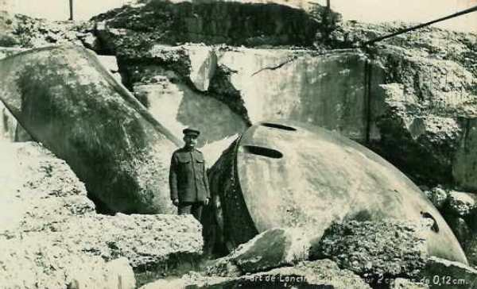
_Le fort de Loncin après bombardement_
_Collection privée_

Les munitions s’épuisent et vers 10h, le fort ne peut plus riposter.

**15 heures :**

Le bombardement du fort commence au départ de la plaine de manœuvres de Bressoux (à 9 km. du fort) par des mortiers de 420. Toutes les minutes, un obus de ce calibre tombe sur le fort. La fumée pénètre dans les galeries et menace d’asphyxier la garnison. Comme Lantin est tombé, le tir de tous les canons se concentre sur Loncin.

**17h20 :**

Un obus perce la carapace du fort et met le feu à la poudrière, soit douze tonnes de poudre. Les coupoles de 210, qui pèsent pourtant, 40 tonnes sont renversées et les voûtes s’effondrent. La galerie centrale se fend en deux et retombe sur les soldats qui attendent l’assaut.
Il ne reste qu’une centaine de survivants. Le commandant Naessens est sans connaissance et le général Leman est grièvement blessé. Les Allemands évacuent les blessés qui sont dirigés vers l’hôpital de Liège.

### 16 août : reddition des forts de Hollogne et de Flémalle

Peu après l’explosion du fort de Loncin, des parlementaires allemands se présentent à ceux de Hollogne et de Flémalle et annoncent que dix des douze forts sont pris. Les deux forts veulent continuer le combat, mais ils doivent se rendre respectivement à 8h30 et 9h30.

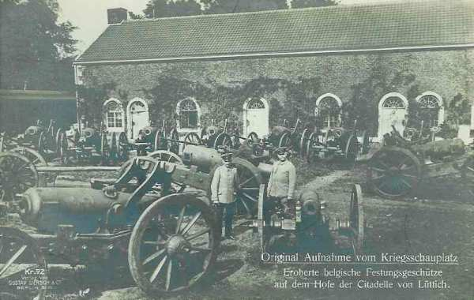
_Citadelle de Liège - Artillerie de forteresse prise aux Belges_
_Collection privée_

La position fortifiée de Liège n’existe plus. L’armée Allemande peut traverser librement la Meuse et entamer son mouvement à travers la Belgique.

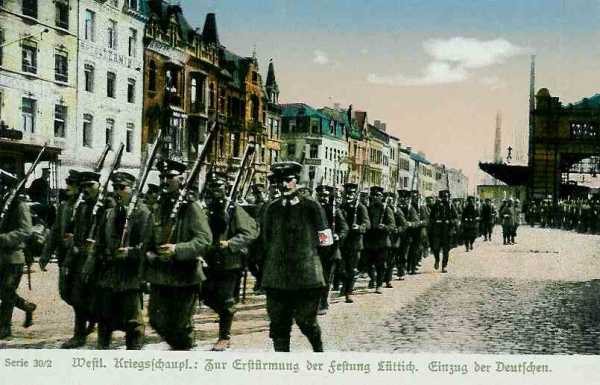
_Entrée des troupes allemandes à Liège_

La résistance des forts de Liège, et surtout de celui de Loncin, aura un retentissement international et pèsera lourd dans la suite de la campagne. On estime le retard de la progression allemande à quatre ou cinq jours par rapport à ce qu’escomptait l’O.H.L. Ce délai sera mis à profit par les armées alliées pour opérer leur concentration.

Le président Poincarré a dit à ce sujet : « Le retard que la résistance de Liège a imposé aux Allemands nous a permis d’achever entièrement notre concentration, de faire venir dans le Nord les troupes l’Algérie et même d’être sur le point d’y recevoir une partie des troupes du Maroc. En même temps, ce délai a laissé aux Anglais la possibilité de se concentrer ».