# Longwy (10 - 26 août 1914)

Vu sa proximité de la frontière, la ville de Longwy a été  investie par la Ve armée allemande dès les premiers jours de la guerre. En 1914, elle est encore dans l’état où l’a laissée Vauban et pourtant, elle va résister pendant seize jours aux bombardements d’artillerie lourde.

### Situation stratégique

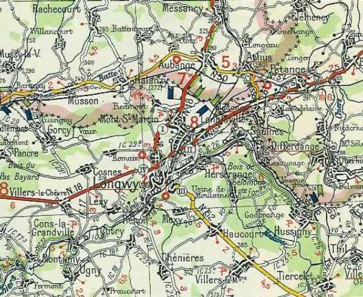
_Longwy et environs_
_c Michelin, d’après carte n°57, édition 1940- Autorisation n° 05-B-18_

Longwy est situé sur un éperon rocheux dominant la vallée de la Chiers. La ville fait partie de la France depuis le traité de Nimègue en 1678. Comme pour les autres villes frontières, Vauban trace le plan de la nouvelle place forte. Après Waterloo, les Prussiens occupent la ville haute jusqu’en 1818.

En 1871, les Prussiens assiègent la ville et en huit jours lancent 30.000 projectiles sur la place.

La ville occupe une position stratégique aux portes de la France. Le défilé de la Chiers depuis la frontière belgo-luxembourgeoise est le couloir principal de la trouée de Stenay et revêt une grande importance pour une armée d’invasion débouchant du Grand-Duché de Luxembourg. Une industrie lourde est installée dans la région et est intéressante pour un envahisseur.

Après la guerre de 1870, Séré de Rivières fortifie les Hauts-de-Meuse au nord, les côtes de Haute-Moselle au sud mais il laisse en avant de la ligne fortifiée la Woëvre et le bassin de Briey-Longwy à la merci de l’Allemagne : les gisements lorrains étaient inexploités à l’époque. Longwy est à quatre km de la frontière de l’Allemagne. Longwy et Montmédy deviennent des places d’arrêt et des places d’appui pour les troupes de couverture et de surveillance des débouchés de la forêt des Ardennes en cas de violation du territoire belge.
En 1913, la place est dans l’état où l’a laissée Vauban.

En 1914, un rapport daté du 16 mai, est présenté au Conseil supérieur de la guerre pour le déclassement éventuel de la place. Le 26 mai, le Conseil estime que la place ne présente plus qu’un intérêt médiocre pour interdire les voies de communication venant du Luxembourg et le déclassement est envisagé.

Le 17 juin 1914, le ministre prescrit au commandant du 2e C.A. d’étudier le démantèlement de la forteresse mais le 30 juillet, un décret ministériel charge le directeur du Génie de Mézières de centraliser les préparatifs éventuels de la défense de Longwy.

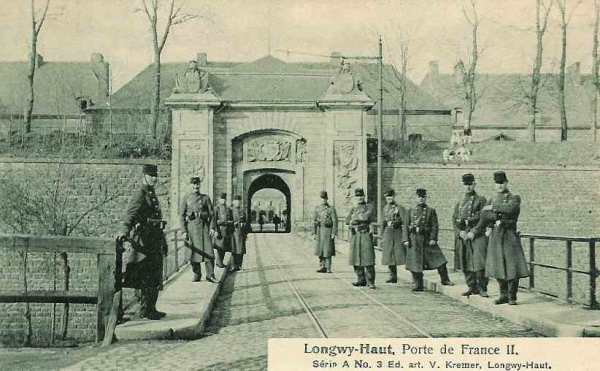
_Porte de France_
_Collection privée_

Le 31 juillet, l’Allemagne adresse un ultimatum à la Russie et à la France. Si la France reste neutre, les Allemands réclament comme gage de neutralité la remise des places de Toul - Verdun qui seront occupées par leurs troupes.

A 17h40 du même jour arrive le télégramme de couverture. Deux groupes constitueront la couverture, l’un à cheval sur l’Othain en avant de Marville, l’autre sur la Chiers en avant de Longuyon, couvrant la zone sud-ouest de Longwy.

Le 2e C.A. couvre la zone Marville - Jametz - Damvillers.

Le corps de la place est une enceinte hexagonale de 250 m de rayon auquel on accède par la porte de Bourgogne au nord et la porte de France au sud. Dans cette enceinte est bâtie la ville haute. Il y a 2.500 habitants dans la ville haute qui doivent être évacués à la première alerte.

Comme la plupart des places de guerre, Longwy doit compléter son organisation défensive dès le premier jour de la mobilisation, d’autant plus qu’elle risque une attaque surprise vu sa proximité de la frontière.

Il faut construire une ligne principale de résistance à 1.200 - 1.500 m des remparts sur les fronts nord, ouest et sud. Plusieurs redoutes extérieures doivent être remises en état (Bel-Arbre, Coulny, Tilleul, mont du Châ). Ces points d’appui permettent aux défenseurs de s’assurer la possession des hauteurs voisines de la forteresse. Une ligne avancée existe au sud de l’enceinte, contrôlant la vallée de la Chiers et le chemin de fer.

Les grand’gardes sont installées à Cosnes, au cimetière de Longwy, au Ratentout, au mont du Châ.

Voici l’armement de la place :

- 12 canons de 120.
  12 canons de 95.
  12 canons de 90 pour le flanquement des fossés.
  4 canons de 90 pour le flanquement de la vallée de la Chiers et de la Moulaine.
  6 mortiers de 12.

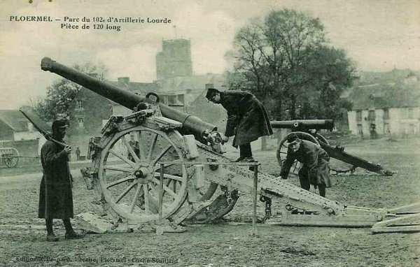
_Canon de 120 long_
_Collection privée_

Soit en tout 46 pièces de tir lent. Aucune pièce n’est abritée et elles fonctionnent toutes à la poudre noire.

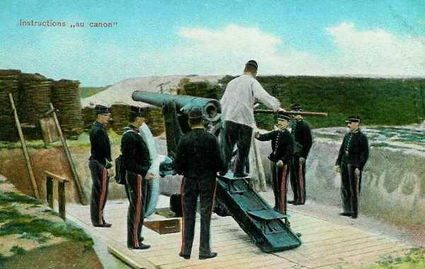
_Artillerie de forteresse_
_Collection privée_

En cas de bombardement, il est prévu que les troupes se réfugient dans des abris. L’hôpital de Longwy haut sera détruit dès les premiers tirs de l’assaillant, mais il existe un hôpital sous casemates.

La garnison comprend 3.500 hommes. Le gouverneur de la place est le colonel Darche. L’armature de la défense est le 164e R.I.

### 28 juillet

L’ordre d’application des mesures relatives à la surveillance de la frontière parvient dans la nuit du 28 au 29 juillet.

### 31 juillet

Le 164e R.I. reçoit l’ordre de prendre ses avant-postes. Les éclaireurs sont répartis dans un rayon de 2 à 8 km du noyau central. L’ordre de couverture parvient vers 17h.

Les sapeurs-télégraphistes se mettent en œuvre pour installer des postes téléphoniques reliant la ville aux postes avancés.

### 1e août

Le soir du 1e août, les bataillons des 164e R.I. et 45e R.I.T. sont à peu près au complet. Il n’y a pas de défection de réservistes.

On annonce l’arrivée d’officiers allemands à Luxembourg. L’infanterie allemande fait son apparition à Villerupt (15 km au sud-est de Longwy). L’ordre d’évacuation de la population civile de Longwy-Haut est affiché.

### 2 août

Le bataillon territorial est armé et doit garder les remparts et les abords immédiats de la ville.

Vers 9 h, un détachement allemand, en marche d’Hussigny vers Herserange est signalé. Darche fait tirer le canon d’alarme. Fantassins et artilleurs occupent immédiatement leurs positions. Les ponts-levis des portes de Bourgogne et de France sont levés. En fait, il s’agit d’une fausse alerte.

Dans l’après-midi, Darche apprend que le personnel de la gare s’est enfui en emmenant le matériel de chemin de fer. L’évacuation de la population doit s’effectuer au moyen de locomotives et de wagons trouvés dans les usines de Longwy-Bas.

### 3 août

Plusieurs violations du territoire sont signalées. A 18h45, l’Allemagne déclare la guerre à la France.

### 4 août

Les postes téléphoniques et la liaison optique avec Verdun sont prêts à fonctionner.

Dès 3 h, un escadron allemand franchit la frontière à l’est d’Hussigny, se dirigeant vers Thil, Tiercelet et Villers-la-Montagne. L’escadron du 19e chasseurs à cheval patrouille dans la région d’Hussigny - Crusnes - Joeuf - Homécourt - Audun-le-Roman.

### 5 août

Un peloton du 28e dragons (4e D.C. allemande), en mouvement vers le Luxembourg belge, traverse les lignes avancées de la place de Longwy.

### 7 août

Les Allemands brûlent le village de Morfontaine et de Laix. Les Allemands lancent des reconnaissances pour déceler les avant-postes. Ils sont accueillis à coups de fusil par les groupes cyclistes du 164e R.I.

### 8 août

L’artillerie est en place et pourra intervenir contre les formations ennemies. Le réseau de barbelés est complété de manière à entourer la ville. Les arbres gênants sont abattus et des créneaux de tir sont aménagés au moyen de sacs de terre.

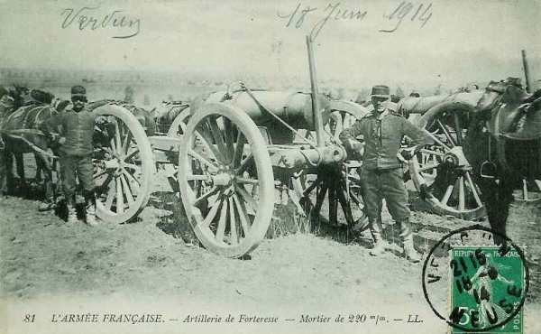
_Mortier de 220_
_Collection privée_

Les débouchés des mines de fer les plus proches où l’assaillant pourrait trouver un abri sont détruits ou obstrués, de même que les têtes du tunnel de Longlaville.

Les Allemands deviennent plus actifs. L’encerclement de Longwy commence. Les petits postes sont en alerte et ne se laissent pas forcer. Vers 9h 15, une brigade allemande de cavalerie avec de l’artillerie se rassemble à l’est du bois de Latiremont. Aussitôt, ordre est donné au commandant d’artillerie du secteur d’ouvrir le feu. Les cavaliers rétrogradent vers Baslieux.

Le 9e bataillon de chasseurs à pied luttent autour de Beuveille contre des forces importantes. Les chasseurs se replient la nuit tombante vers Villers-lez-Mangiennes.

L’investissement de Longwy est complet. Vers la fin de l’après-midi, des avions sillonnent le ciel.

### 9 août

Vers 10h 15, un détachement composé d’infanterie et de cavalerie à Morfontaine est signalé au gouverneur. Le feu est ouvert sur ce village. Les Allemands avancent vers Longuyon.

### 10 août : première sommation

Une sommation est remise, écrite par le baron von Hollen. Darche refuse catégoriquement. Les Allemands essaient une seconde fois et essuient le même refus.

Vers 19h, un peloton de cavalerie est repoussé à Longlaville. Au nord de Longuyon, la 3e D.C. a pris possession des passages de la Chiers. Plusieurs villages sont incendiés.

### 11 août

Le village de Bazailles est incendié.

### 12 août

Dans la matinée, Villers-la-Montagne (7,5 km au sud de Longwy) est occupé par les Allemands. A 12h, le gouverneur prescrit de réoccuper Villers-la-Montagne et vers 16, la localité est reprise.

Le poste cycliste de Villers-la-Chèvre ouvre le feu sur une patrouille du 5e dragons (3e D.C. allemande).

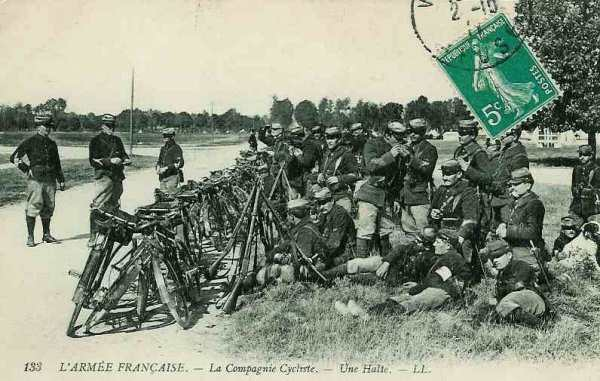
_Compagnie cycliste_
_Collection privée_

### 13 août

Vers 2h du matin, des forces supérieures obligent les petits postes du 164e R.I. en avant de Villers-la-Montagne de se replier sur le village.

Suite à une attaque par le 13e C.A., les Français se retirent sur Haucourt mais l’artillerie de Longwy bat la zone occupée. Vers 9h, les Allemands dirigent une compagnie vers Chenières mais le 164e R.I. les en expulse. A la nuit tombante, les Allemands évacuent Villers-la-Montagne.

### 14 août

Hussigny est saccagé et brûlé.

### 15 août

Des éléments du 164e R.I. se porte vers Haucourt contre l’adversaire débouchant de Villers-la-Montagne. Un combat a lieu à Chenières.

### 16 août

La cavalerie allemande cherche continuellement à percer le réseau des avant-postes. Le 164e R.I. reprend sont action contre les Wurtembergeois qui occupent Villers-la-Montagne. L’artillerie de Longwy tire sur une colonne qui descend de Laix à Chenières.

### 17 août

Au début de l’après-midi, les Allemands réapparaissent au sud-est de la place. Averti, le gouverneur ordonne la préparation d’un tir sur cette zone qui n’a finalement pas lieu. Un taube (avion allemand) survole la ville et les territoriaux du 45e régiment dirigent contre lui des salves qui le forcent à s’éloigner. L’armée allemande resserre son étreinte.

### 18 août

A la fin de l’après-midi, un peloton du 14e hussards, parti de Dombes, arrive à Longwy. Il franchit les avant-postes à Villers-la-Chèvre.

Vers 23h, un poste d’infanterie, tenu par le 13e/164e R.I. est assailli.

### 19 août

Vers 10h, un peloton de dragons français arrive à Gorcy. Le soir, il regagne les lignes de la IIIe armée. Au-delà de la frontière belge, vers Réchicourt, les avant-gardes des C.A. de droite de la Ve armée allemande apparaissent.

### 20 août

Mes Allemands deviennent plus pressants sur le front nord. Vers 13h, le gouverneur est informé que les détachements marchant d’est en ouest suivent la route Clémency - Messancy - Aix-sur-Cloye - Pétange - Rodange - Athus - Aubange. Ordre est donné d’ouvrir le feu à une distance de 6.400 m. Les troupes allemandes se retirent précipitamment vers Messancy. Le feu cesse à 12h45.

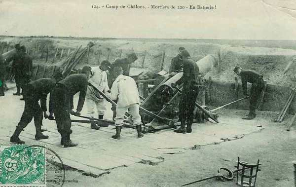
_Mortier de 220_
_Collection privée_

A 15h45, les observateurs découvrent une batterie d’artillerie de campagne à hauteur de Pétange. Les canons de Longwy doivent tirer à une distance de 8.800 m et les Allemands finissent par abandonner la position. Pendant ce temps, un avant-poste est attaqué par deux colonnes d’infanterie qui progressent vers Saulnes. Les postes sont obligés de rétrograder vers le col de Longlaville. Vers 19h, un escadron allemand occupe le village d’Halanzy.

Darche avertit la place forte de Verdun que l’attaque est imminente.

Dans l’après-midi, la 23e brigade d’infanterie occupe les hauteurs de Rodange et s’ébranle vers Hussigny pour investir Longwy par le sud.

### 21 août

Les Allemands occupent Aubange et se disposent à attaquer la ligne avancée. Vers minuit, ils descendent vers Mont-Saint-Martin après avoir franchi la frontière franco-belge. Un autre détachement se porte sur Piedmont. Le 14e/164e R.I. est attaqué par des effectifs supérieurs et munis de projecteurs. Aussitôt, la garnison de Longwy prend les armes et les artilleurs rejoignent leurs pièces. Une vive fusillade se fait entendre vers Mont-Saint-Martin - Halanzy. Piedmont est abandonné. Le poste avancé se replie sur la ligne de résistance (ouvrages de Coulmy et Bel-Arbre). Les garnisons de Bel-Arbre et de Coulmy sont renforcées. Les portes de Bourgogne et de France sont fermées.

A 4h du matin, un chantier est signalé au nord-ouest de Saulnes et une heure plus tard, l’artillerie de Longwy fait feu contre le rassemblement du 1e/10e régiment d’artillerie à pied (obusiers de 15 cm). L’artillerie allemande riposte énergiquement. Le tir est réglé par ballon d’observation. Les tirs s’abattent sur les bastions nord de la ville.

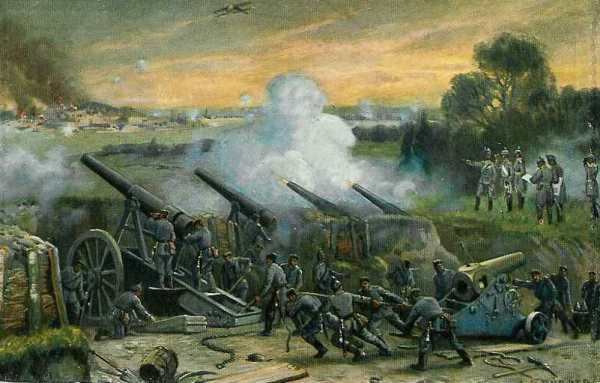
_Bombardement de Longwy_
_Collection privée_

Les canons de Longwy sont approvisionnés en poudre noire. Lors d’un tir, le canon dégage de la fumée et son emplacement est révélé. En revanche, les canons allemands utilisent de la poudre sans fumée. Les remparts sont bombardés à une cadence de 10 coups par minute. Plusieurs territoriaux qui se trouvent sur les courtines sont tués ou blessés.

Vers 5h 30, le feu provenant de Saulnes est tellement violent que les défenseurs des remparts doivent se retirer dans leurs abris. Peu après, le tir cesse et les territoriaux réoccupent leurs positions de combat.

Le bombardement reprend vers 6h30. Entre-temps, le 121e régiment wurtembergeois a repris sa marche vers Longwy. L’attaque s’étend vers Romain et le 122e régiment s’empare d’Halanzy, non défendu. Plusieurs postes avancés français doivent rétrograder. Les Allemands n’attaquent pas et attendent que les obus aient écrasé la garnison.

Des mortiers de 21 cm entrent en action dans la direction d’Halanzy.

Toutes les communications téléphoniques sont coupées à Longwy et plusieurs plates formes d’artillerie sont hors d’usage. Les Allemands tiennent les courtines sous le feu de leurs mitrailleuses et celles-ci deviennent intenables.

A 8h, le bombardement recommence et les défenseurs rentrent dans leurs locaux. La poussée de l’infanterie allemande reprend sur le front nord. Près de 5.000 obus sont tirés sur Longwy en vingt heures.

A 9h, le clocher de l’église doit être évacué par ses observateurs.
L’infanterie allemande occupe l’ouvrage de Coulmy. Les mitrailleuses parviennent à 200 m de la lunette 35.
Le 156e régiment allemand se dirige d’Hussigny vers Villers-la-Montagne où il parvient à 11h30.

Les Allemands parviennent à portée de fusil des remparts et quelques obus tombent sur Longwy-Bas.

A 14h, le tir venant de Saulnes et d’Halanzy s’allonge. Une salve tombe sur l’ouvrage de Bel-Arbre. Celui-ci doit être évacué. Vers 15h, Ratencourt doit être abandonné. Comme le bombardement ne cesse plus, la ville devient un immense brasier.

Dans la nuit, une avant-garde française annonce l’arrivée de la 10e division d’infanterie à Villers-la-Chèvre et la marche de la IIIe armée sur Longwy.

Vers 21h30, la canonnade reprend vigueur. Comme la ligne principale de résistance a été abandonnée, les Allemands sont à 600 m des fossés et les remparts sont en première ligne.

Sur ces entrefaites, la IIIe armée française est arrivée à l’ouest de Longwy et doit attaquer le lendemain. Le sort des défenseurs de la place dépend du succès ou de l’échec de l’offensive française. La IIIe armée parviendra-t-elle les dégager ?

- Le 4e C.A. (Boëlle) à gauche (Torgny - Lamorteau - Dampicourt - Virton - Chenois).

- Le 5e C.A. (Brochin)  dans la région de Saint-Pancré - Signeulx - Ville-Houdlemont - Cussigny - Cosnes-le-Romain - Montigny-sur-Chiers - Fermont.

- Le 6e C.A. formant flanc-garde face à Thionville et Metz.

### 22 août

Le bombardement continue. Les Allemands se sont rapprochés de l’enceinte à la faveur de l’obscurité sur le front nord-ouest et les tirailleurs et mitrailleuses sont à 500 m des remparts. Dès l’aube, l’apparition d’une silhouette au-dessus des parapets est immédiatement saluée par une fusillade.

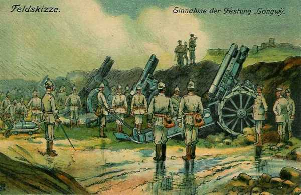
_Mortiers allemands devant Longwy_
_Collection privée_

Hors des murs de la ville fortifiée, le 13e/164e R.I. occupe toujours le Mont du Châ au nord-est de la ville et le 16e/164e garnit l’ouvrage du Tilleul.

Dès l’aube, la bataille s’engage entre l’armée de Ruffey (IIIe) et celle du Kronprinz (Ve). Le 5e C.A. doit attaquer de Signeulx à la redoute du Bel-Arbre. La 10e D.I. attaquera vers Bel-Arbre (113e R.I.) mais en peu de temps, ce régiment subit des pertes élevées et commence à refluer vers 17h30.  L’espoir s’éloigne peu à peu de voir se desserrer l’étreinte autour de Longwy. Débouchant de la vallée de la Chiers, la 20e brigade progresse dans la transversale Romain - Bel-Arbre (redoute occupée par les Wurtembergeois). Curieusement, l’artillerie de Longwy n’intervient pas pour aider la progression du 5e C.A., car aucune communication n’a pu être établie entre le C.A. et la place.

Dans la matinée, la brigade von Teichmann se dispose à passer à l’attaque du noyau central, mais le projet est abandonné. L’attention se porte  sur l’attaque du 5e C.A. français. Le bombardement de Longwy continue toute la journée du 22. Vers 8h, les troupes du génie ne quittent pas le souterrain et elles n’en sortiront que vers 18h. A la même heure, la brigade von Teichmann est libérée du souci causé par l’attaque du 5e C.A. et reprend ses opérations offensives vers l’ouest de Longwy. Vers 19h, l’artillerie allemande allonge son tir vers le sud et des mouvements d’infanterie sont signalés, laissant prévoir une attaque de vive force. Une fusillade est déclenchée et les Allemands n’insistent pas.

Le soir, Longwy-Haut n’est plus qu’un tas de ruines. Les français tiennent toujours des postes à  Rehon, Mont du Châ et Longlaville.

Vers la fin de la journée, la IIIe armée s’est retirée à une courte étape de marche de ses positions du matin.

Le 4e C.A. jalonne le front Mont-Quintin - Dampicourt et le 5e C.A. a reflué vers la Chiers en direction de Longuyon peu après 15h.

La IIIe armée a subi un échec, car elle s’est engagée contre un adversaire sur lequel elle n’avait aucune précision. Alors qu’elle croyait tomber sur le flanc de la Ve armée en marche vers le nord-ouest, les colonnes françaises se sont heurtées à l’armée du Kronprinz marchant droit devant elle. Son adversaire était averti et supérieur en nombre.

### 23 août

Les pionniers ont progressé sous la protection de nombreuses mitrailleuses jusqu’au réseau avant du fossé. Les pièces de gros calibre, établies à Messancy et Rochecourt entrent en action et l’artillerie de campagne rend les bastions intenables. L’artillerie plutôt sur les remparts du secteur ouest. Ce bombardement a pour but de créer une brèche par laquelle les colonnes d’assaut pourront prendre pied dans le noyau central.

L’armée de Ruffey opère une retraite définitive.

Le 5e C.A. doit occuper Tellancourt - Fresnois - Montigny-sur-Chiers. A 14h, Ruffey apprend que ce C.A. vient d’être attaqué et bat en retraite définitivement au sud de la Chiers.

Les derniers espoirs de débloquer Longwy s’évanouissent tandis que l’armée du Kronprinz marche vers Verdun.

### 24 août

C’est le cinquième jour de bombardement. Toute circulation à découvert est saluée par des salves d’une batterie de campagne. Grâce à la brume, les sapeurs peuvent procéder à quelques réparations mais les parapets et abris d’artillerie sont détruits. Les deux tiers du matériel sont hors service et la ville n’est plus qu’un champ de ruines.

Aux batteries de Rochecourt et d’Aix-sur-Cloye sont venues s’ajouter des obusiers lourds (15 cm) de la réserve de Metz. Les batteries de campagne sont installées aux environs de Cosnes et les mitrailleuses sont disposées sur le terrain de manoeuvre de Bel-Arbre. La pression wurtembergeoise se fait sentir sur les fronts nord, ouest et sud. A l’est, une compagnie se trouve encore au Mont du Châ et au col de Longlaville.

### 25 août

Darche demande une suspension des hostilités de 24h afin d’évacuer les nombreux blessés vers les hôpitaux de Longwy-Bas. Le commandant allemand refuse. Sur une nouvelle démarche des médecins, le gouverneur prend le parti d’évacuer les blessés pendant la nuit mais les hôpitaux de Longwy-Bas n’ont pas de médecins.

A 22h, le feu d’artillerie s’allonge vers le sud et sur la Porte de France. Les observateurs perçoivent des bruits insolites sur le glacis. L’alerte est donnée et la garnison occupe ses emplacements. Le gouverneur donne l’ordre de détruire les archives de la place dont le code chiffré.

Les Allemands ne parviennent pas une nouvelle fois à surprendre la garnison.

### 26 août

La canonnade fait rage toute la nuit. A l’aube, l’infanterie allemande et les pionniers occupent le glacis devant le bastion 2 et ont pris pied dans l’ouvrage à cornes. Sur les fronts nord et ouest, ils ne sont plus qu’à 200 m des remparts.

A 9h, le gouverneur réunit le conseil de défense dans le but d’examiner la situation. Chaque membre est invité à donner son avis sur les moyens de continuer la résistance.

- Commandant d’artillerie : toute prolongation de la défense par l’artillerie est impossible

- Commandant du génie : les locaux existants ont perdu toute valeur. Il n’est plus possible de continuer la résistance dans ces conditions.

- Commandant d’infanterie : la place peut encore tenir 24 heures.

- Chef de service de l’infanterie : les vivres ne manquent pas, il y en a encore pour deux mois.

- Médecin major : la situation est désespérée. Ces conclusions pèseront d’un grand poids sur la décision du gouverneur.

Toute prolongation de la résistance peut causer la mort de la majeure partie de la garnison. Comme les forces françaises sont en retraite vers Verdun et ne pourront délivrer la ville, la décision est prise : la capitulation.

Darche fait mettre hors service les quelques canons encore en état de fonctionner et l’on constate qu’il n’y a plus d’explosif pour détruire les vivres et munitions.

A 10h et demie, le gouverneur fait hisser le drapeau blanc. Le commandant d’artillerie allemand veut discuter les conditions avec le gouverneur lui-même, mais un gouverneur de place ne peut quitter celle-ci. Darche envoie le plus ancien officier de la garnison muni des pleins pouvoirs.

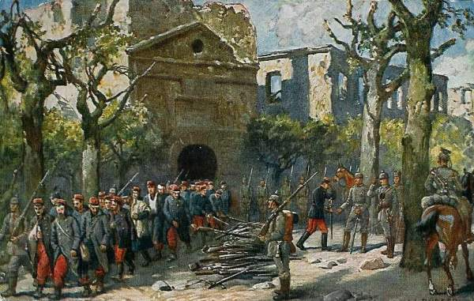
_Reddition de Longwy_
_Collection privée_

A 13h, les délégués sortent de la forteresse. Le général allemand exige que la ville se rende sans conditions mais le commandant demande pour ses troupes les honneurs de la guerre. Une convention est rédigée dans ce sens : les unités devront quitter Longwy dès 17h30 et déposer leurs armes individuellement à la sortie. En deux heures, les blessés sont sortis de leurs casemates et transportés vers les ambulances allemandes d’où ils seront transportés à l’hôpital Saint-Martin de Messancy. Le gouverneur reçoit ses armes en retour des mains d’un général allemand. Par après, Darche rencontrera le Kronprinz à Esch-sur-Alzette. Il apprendra qu’il est fait officier de la légion d’honneur.

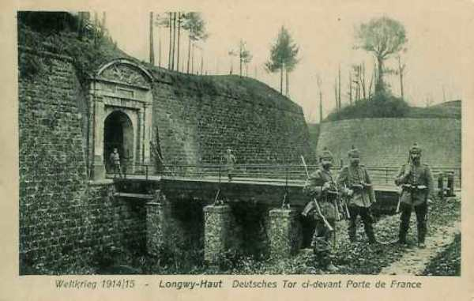
_Porte de France après la reddition_
_Collection privée_

Le siège de Longwy est remarquable car une place datant de l’époque de Vauban et des canons à poudre noire, a pu résister pendant plusieurs jours à des tirs d’artillerie de gros calibre tirant des obus modernes.