# Namur (20 - 23 août 1914)

La ville fortifiée de Namur est située au confluent de la Meuse et de la Sambre. Plusieurs lignes importantes de chemin de fer y passent. Leur possession est indispensable pour le ravitaillement des armées allemandes qui vont s’engager en France. Il échoit à la IIe armée (von Bülow) de s’emparer de la place forte.

### La situation stratégique de Namur

Namur occupe une position stratégique au confluent de la Sambre et la Meuse. C’est à cet endroit que fut construite la citadelle que l’on voit encore actuellement, à l’emplacement du château des Comtes de Namur. Celle-ci fit l’objet de plusieurs sièges, dont un par Louis XIV.

Les progrès de l’artillerie, au cours du 19e siècle, avaient rendu la citadelle indéfendable. C’est la raison pour laquelle il fut décidé, pour barrer le couloir mosan à l’invasion, de créer une ceinture de forts à  bonne distance de la ville. Comme la Belgique était un Etat déclaré perpétuellement neutre par le traité de Londres en 1839, la position fortifiée de Namur devait faire face à une éventuelle invasion de la part de la France en barrant la vallée de la Meuse.

Sous la direction de Brialmont, la ville fut ceinturée d’ouvrages tenant sous leur feu les axes routiers, les voies de chemin de fer et fluviales. Comme Liège, Namur était considérée comme une place d’arrêt, le réduit national étant Anvers. Les forts n’avaient pas été construits pour soutenir une attaque méthodique soutenue par de l’artillerie lourde.

### La position fortifiée

La position fortifiée de Namur comprend 9 forts distants de 5 à 8 km de la ville et espacés entre eux de 4 km en moyenne. L’intervalle maximum (6 km) se trouve entre les forts de Marchovelette et de Maizeret, l’intervalle minimum entre le fort d’Emines et de Cognelée (3,4 km). Le périmètre de la ligne est de 40 km.

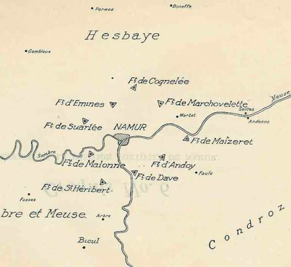
_Forts de Namur_
_L’action de l’armée belge_

Les forts sont :

- Cognelée
  Marchovelette
  Maizeret
  Andoy
  Dave
  Saint Héribert
  Malonne
  Suarlée
  Emines

Ces forts sont de plan triangulaire, sauf ceux de Maizeret et Malonne, qui ont une forme trapézoïdale.

Un fossé sec, large de 6 à 10 m et profond de 8, entoure le massif central. L’artillerie a une portée maximale de 8 km.

L’artillerie est répartie comme suit :

- Une coupole A pour deux canons de 15 cm.
  Deux coupoles B pour deux canons de 12 cm.
  Deux coupoles C pour un obusier de 21 cm.
  Quatre coupoles D à éclipse munies chacune d’un canon de 5 cm à tir rapide.

Au total, chaque fort dispose de 8 canons de gros calibre et de 4 petits canons. Toutefois, à Maizeret et Marchovelette, les coupoles de type B n’ont qu’un seul canon et il n’y a qu’une coupole de type C avec un obusier.

La position fortifiée est en principe défendue par la 13e brigade active et par des troupes de forteresse constituées en quatre régiments d’infanterie.

- 1e chasseurs de forteresse.
  8e, 10e et 13e régiments de ligne de forteresse.

Le 3 août, le Roi Albert décide que la 4e division d’armée restera à Namur pour défendre la position. Cette division se compose  des 13e, 8e, 10e et 15e brigades mixtes, du 1e lanciers (caserné à Namur en temps de paix), d’un groupe divisionnaire d’artillerie de campagne et d’un bataillon du génie.

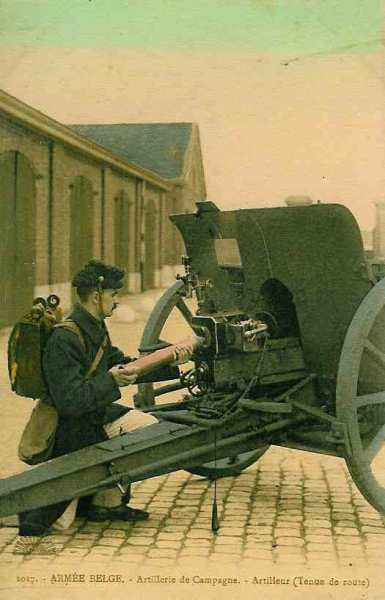
_Canon de campagne belge_
_Collection privée_

L’effectif total se monte à

- 15.000 hommes de troupes de forteresse.
  15.000 hommes de la 4e division avec 48 pièces de campagne de 75 à tir rapide.

La Position est divisée en quatre secteurs :

- Ie secteur : rive droite de la Meuse.
  IIe secteur : entre la Meuse (amont) et la Sambre.
  IIIe secteur : entre la Sambre et l’ouest du fort de Cognelée.
  IVe secteur : depuis le fort de Cognelée jusqu’à la Meuse (aval).

Chaque intervalle entre les forts est occupé par un régiment de forteresse. Des tranchées sont creusées pour constituer une seconde ligne de résistance.

### L’alerte

Dès qu’il a connaissance de l’ordre de mobilisation générale, le lieutenant-général Michel, commandant de la 4e division et gouverneur de la position fortifiée, met aussitôt tout en œuvre pour activer l’organisation défensive de la place.

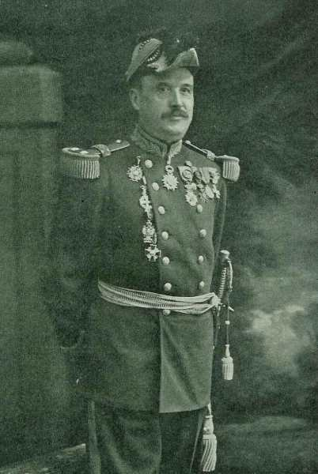
_Général Michel_
_La Belgique et la guerre_

### Le plan allemand

Gallwitz, commandant de l’armée de siège, décide d’attaquer par le nord-est et par le sud-est, entre le fort d’Andoy et le fort de Marchovelette, à cheval sur la Meuse.

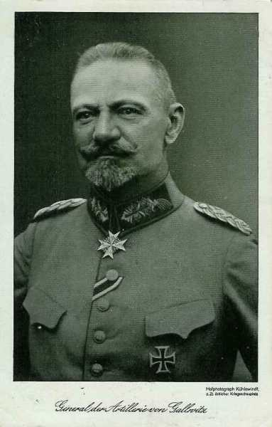
_Général von Gallwitz (C.A. de réserve de la. Garde)_
_Collection privée_

Trois divisions sont placées en première ligne :

- Une au nord de la Meuse (3e division de la Garde).
  Deux au sud du fleuve (22e et 38e D.I.).
  Une division de réserve vers Andenne (1e division de réserve de la Garde).

Les forces qui vont assaillir la position comprennent au 19 août :

- Le C.A.R. de la Garde.
  Le 11e C.A.
  Des formations d’artillerie de siège.

L’artillerie mise en œuvre est importante : des canons de 100 mm, de 130, de 210, des mortiers autrichiens de 305 et une batterie de mortiers de 420.

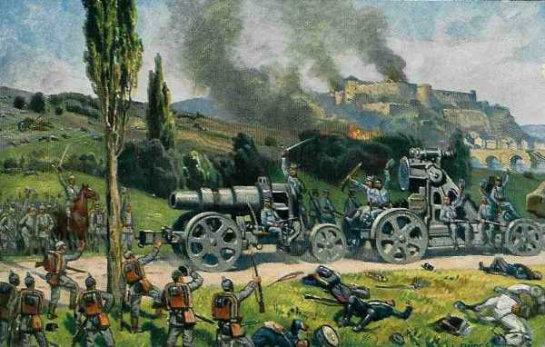
_Artillerie de siège allemande à Namur_
_Collection privée_

L’armée de siège se monte à 90.000 hommes et 400 bouches à feu.

Il n’y aura pas d’assaut de vive force comme à Liège, mais l’armée allemande va d’emblée écraser les forts au moyen d’ une puissante artillerie, dont des mortiers de 420, qui n’avaient pas été mis en œuvre immédiatement à Liège.

### Le dispositif belge

Les différents secteurs sont occupés comme suit :

- Ie secteur : 1e régiment de chasseurs à pied de forteresse

- IIe secteur : 13e régiment de ligne de forteresse.

- IIIe secteur : 10e régiment de ligne de forteresse et 8e brigade mixte. Le 28e de ligne fournit les avant-postes.

- IVe secteur : 8e régiment de ligne de forteresse et 10e brigade mixte.

### 20 août

Les troupes allemandes commencent leur déploiement. Le but est de refouler les troupes avancées et d’aveugler les forts en s’emparant des observatoires.

Von Gallwitz veut une ouverture simultanée des feux de batteries pour entraîner la chute rapide des forts.

La 3e division de la Garde, qui s’est avancée au nord de la Meuse, bouscule les grand’gardes du IVe secteur. Le déploiement de l’artillerie de siège est contrarié par le tir efficace des coupoles du fort de Marchovelette.

Au sud de la Meuse, les reconnaissances allemandes sont arrêtées par la cavalerie et l’infanterie et les forts de Maizeret, d’Andoy et de Dave prennent sous leur feu les batteries qui s’avancent derrière les troupes d’investissement du 11e C.A.

Dans la soirée, la 3e division de la Garde occupe par des postes avancés les villages de Marchovelette, de Gelbressée et de Wartet. Son artillerie de campagne commence le bombardement des intervalles entre les forts.

Le 11e C.A. a déployé ses divisions à l’est de la vallée du Samson.

La 1e division de réserve de la Garde s’établit autour d’Andenne, sur les deux rives de la Meuse.

### 21 août

L’investissement de Namur a commencé sur la rive gauche de la Meuse. Le bombardement commence à 10 heures et est d’une violence inouïe. Il s’adresse simultanément aux forts d’Andoy, de Maizeret, de Marchovelette et de Cognelée. Les canons sont situés sur la croupe de Sart Bernard - Faulx et à l’est de la vallée du Samson.

Au sud de la Meuse, les grand’gardes du Ie secteur sont attaquées par des forces supérieures et doivent se replier vers 11h

Vers le soir, le fort de Maizeret a reçu 2.000 projectiles dont un millier de 210 mm, mais ses coupoles sont encore en état. Au fort d’Andoy, qui a reçu 500 projectiles, plusieurs coupoles sont coincées par des débris de béton.

A 11h, toutes les grosses pièces de la rive gauche concentrent leur tir sur le fort de Marchovelette. Les mortiers de 420 et de 305 sont mis en batterie. Dans ce fort, une coupole de canons de 12 cm et 2 coupoles de canons de 5,7 cm sont seules encore en service. La voûte du magasin à munitions est défoncée. Une partie des défenseurs quitte le fort dans la soirée et le gouverneur fait compléter la garnison.

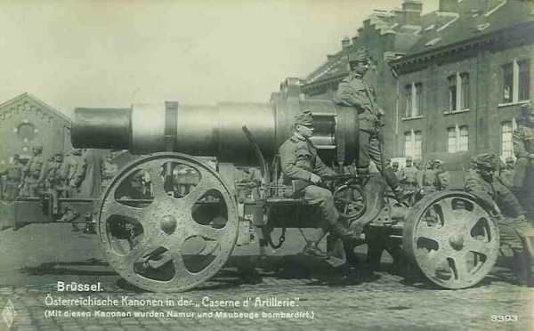
_Mortier autrichien_
_Collection privée_

Les ouvrages des intervalles sont également soumis pendant toute la journée à un feu nourri qui bientôt s’étend aux positions de 2e ligne et sur les arrières du IVe secteur. La ville de Namur elle-même reçoit des projectiles à deux reprises.

Il apparaît que le IVe secteur va supporter tout le poids de l’attaque ; aussi, Michel le fait-il renforcer par trois bataillons d’infanterie et par un groupe d’artillerie divisionnaire.

Dans la soirée, von Gallwitz définit le nouveau secteur d’attaque. Il sera limité à droite par la ligne Eghezée - Daussoulx - ligne de chemin de fer Namur Bruxelles, à gauche par la route de Hannut. (Bierwart - Gelbressée - Namur).

La 38e division doit passer au nord de la Meuse dans la journée du 22 août et constituera avec la 1e division de réserve de la Garde le groupement de rupture.

### 22 août

Pendant la nuit du 21 au 22 août, un bombardement intense a lieu contre les tranchées du IVe secteur. Les tentatives contre les ouvrages de la route de Hannut sont repoussées.

Les trois bataillons français qui avaient effectué une marche de nuit de Bioul à Namur, arrivent vers 6h et sont immédiatement affectés au IVe secteur.

Au sud de la Meuse, l’infanterie allemande arrête toutes les tentatives belges.

Les forts de Maizeret et d’Andoy sont bombardés de gros projectiles.

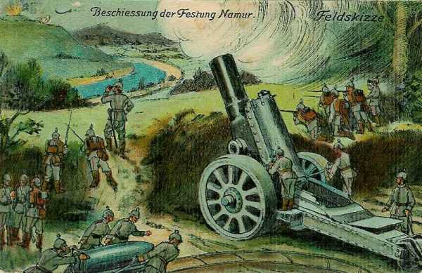
_Mortier de gros calibre devant Namur_
_Collection privée_

Le soir, le fort de Maizeret est évacué par sa garnison, qui rejoint le Ie secteur. Le fort d’Andoy a presque tous ses locaux démolis. Ses coupoles de 210 ripostent encore.

Les unités de la 6e brigade allemande se déploient aux lisières sud de Marchovelette et le long de la rive droite du ruisseau de Gelbressée, mais elles ne peuvent dépasser Jette-Foolz, ni se rapprocher de Beauloy et sont contenues à 500 m des positions belges.

Vers 13h, le fort de Cognelée, qui n’avait été pris à partie que par des pièces de petit calibre, commence à être soumis au tir des mortiers autrichiens de 305.

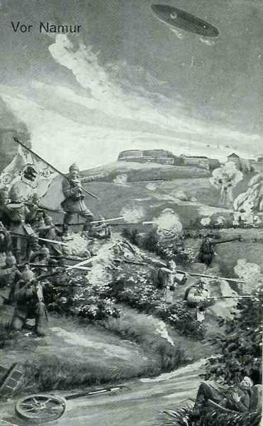
_Zeppelin au-dessus de Namur_
_Collection privée_

L’intervalle Cognelée - Marchovelette subit également un tir d’écrasement et le point d’appui du Bois-Royal doit être évacué. Dans le même temps, le fort de Marchovelette fait l’objet d’une tentative d’assaut. Les Allemands sont repoussés mais reviennent à charge vers 16h. A 19h, une troisième tentative arrive jusqu’au pied du glacis mais est brisée, de même qu’une quatrième et dernière attaque.

Au point d’appui de Beauloy, le bombardement est tel qu’une partie de la garnison évacue les tranchées. Ce n’est qu’à la deuxième tentative, avec la coopération d’un bataillon du 148e régiment français que les tranchées peuvent être réoccupées. L’ouvrage doit être définitivement évacué à 21h30. A la nuit, un seul point d’appui de première ligne reste occupé : celui voisin du fort de Cognelée.

Michel ordonne de monter une contre-attaque vers la région de Wartet (1.500 m au nord-est de Marche-les-Dames) pour s’emparer du terrain où l’artillerie ennemie pilonne le IVe secteur.

Le II/45e français et deux bataillons belges (I/10 et II/30) soutenus par deux groupes d’artillerie de campagne y participent. Leur effort est brisé par les batteries et le feu des mitrailleuses allemandes et c’est un échec sanglant : la 1e compagnie du 1e bataillon du 10e de ligne perd 130 hommes, la 66e batterie a ses quatre canons mis hors de combat.

Le tir des batteries allemandes continue pendant la nuit du 22 au 23. L’ultime bataillon de la réserve générale est envoyé dans le IVe secteur. Le point d’appui de la route de Cognelée, le dernier ouvrage tenu en première ligne dans le secteur nord, est abandonné.

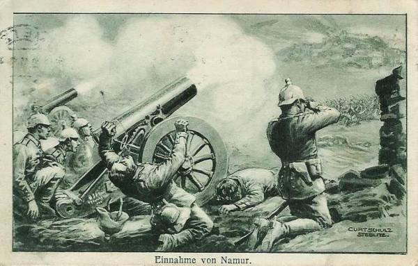
_Combats autour de Namur_
_Collection privée_

Gallwitz répartit définitivement le front d’attaque en trois secteurs placés sous les ordres des commandants de la 1e division de la réserve, de la 38e division et de la 3e division de la Garde. L’artillerie s’approche jusqu’à 2.000 m des forts de Marchovelette et de Cognelée et l’attaque générale est décidée pour le 23.

### 23 août

Sur un front de 4 km qui s’étend du fort de Cognelée à la route de Namur sont massées 3 divisions (40.000 hommes) appuyées par 300 bouches à feu. L’effectif belge est réduit à 8.000 hommes et 30 canons.

Au lever du jour, le bombardement s’accroît et une tornade ininterrompue s’abat sur les positions belges. L’infanterie allemande est à ce moment pratiquement invisible.

A 10h, les divisions allemandes s’ébranlent.

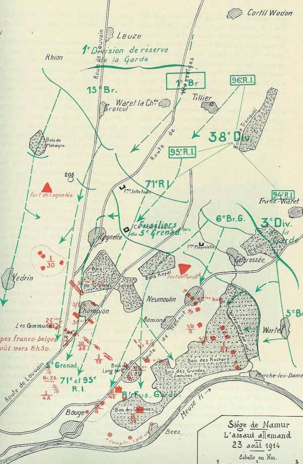
_Assaut de Namur_
_La Belgique et la guerre_

- A droite, la 1e division de la Garde enveloppe le fort de Cognelée, s’infiltre dans le village, puis marche sur Champion et Vedrin.

- Au centre, la 38e division donne l’assaut à travers les bois de Grandes-Salles vers Champion.

- A la gauche, la 6e brigade de la Garde (3e division) lance ses deux régiments par le nord et le sud du fort de Marchovelette.

- Plus à gauche, la 5e brigade pousse des pointes dans la région de Gelbressée.

Le commandant du IVe secteur estime que la position est devenue intenable. Vers 10h30, il donne l’ordre de retraite. Le II/45e français prend position à Bouge pour couvrir la retraite. Il résiste aux attaques de la 38e division allemande et certaines de ses compagnies se retirent vers 12h30. D’autres compagnies n’ont pas reçu l’ordre de retraite et continuent à se battre.

Le fort de Cognelée, écrasé sous les projectiles de 305, se rend.

Le fort de Marchovelette continue à résister ainsi que ses points d’appui de Neumoulin et de la Gelbressée. Vers 13h40, le fort est atteint par un obus de 420 qui explose dans la galerie centrale et brûle ou blesse les deux tiers de la garnison. Les magasins à munitions explosent. Les Allemands pénètrent dans l’ouvrage à 14h mais doivent encore subir le feu des derniers défenseurs. Le fort est détruit mais ne s’est pas rendu.

Les troupes du IVe secteur se dirigent vers Namur, passent dans l’entre Sambre-et-Meuse et ne se rendent pas dans le IIIe secteur comme il leur avait été prescrit. Le commandant du IIIe secteur, se voyant pris à revers, ordonne à la 8e brigade de se retirer.

Michel ordonne au charroi de se porter vers Bois-de-Villers pour dégager le IIe secteur qui doit constituer le réduit, dans l’angle des deux rivières.

Vers 12h30, des projectiles atteignent les tranchées voisines de la Meuse. Une décision s’impose car les Allemands vont interdire le franchissement de la Meuse. Comme la garnison risque d’être écrasée entre les IIe et IIIe armées allemandes, Michel ordonne la retraite générale. Le 13e régiment de forteresse, garnison du IIe secteur, formera l’arrière-garde.

A la nuit, la tête de colonne arrive épuisée à Bioul. La colonne a été en contact immédiat du C.A. de la Garde, qui a progressé à l’est de Saint-Gérard. Trois km seulement séparent la route de Bioul des éléments allemands qui ont franchi la Meuse à Rouillon.

La seule voie de salut est le sud-ouest mais des éléments de la IIe armée allemande ont atteint vers 21h la route de Bioul à Morialmé et se sont glissés jusqu’aux lisières de Denée, d’Ermeton-sur-Biert et de Maredsous. Des fractions de la IIIe armée allemande sont passées sur la rive gauche de la Meuse à Yvoir, à Houx et à Dinant.

Il subsiste un couloir de 7 km entre la IIe et la IIIe armée allemande (Saint-Gérard, rive droite de la Meuse). Heureusement pour les Belges, les commandants de ces armées ignorent réciproquement leur situation. C’est dans cet étroit couloir que la 4e division belge, échelonnée le long de la route de Namur à Bioul, peut se dérober.

Vers minuit, les Belges bivouaquent entre Bioul et Arbre. La colonne réussit à se retirer à l’exception de l’arrière-garde qui est cernée à Ermeton-sur-Biert.

Les forts sont abandonnés à eux-mêmes. Les troupes allemandes pénètrent dans Namur, mais, ignorant le départ de la garnison, elles ne poursuivent pas vers l’Entre-Sambre-et-Meuse.

Dans le Ie secteur, vers 14h, la 22e D.I. a pris possession du fort de Maizeret évacué depuis la veille. L’assaut vers le fort d’Andoy est repoussé. Le fort de Dave est intact.

Devant le IIIe secteur, le 7e C.A.R. demeure déployé et son artillerie échange des feux avec le fort de Suarlée.

Le fort d’Emines a été bombardé sans grand dommage.

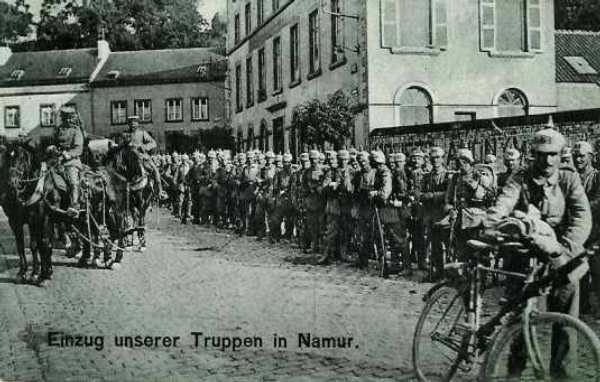
_Entrée des Allemands à Namur_
_Collection privée_

### 24 août

Michel est arrivé à Rosée et entre en contact avec le commandant du 1e C.A. français, qui ne peut le renseigner sur la situation générale. On lui dit que le C.A. bat en retraite vers Agimont - Vodelée - Philippeville. Les routes de Philippeville, d’Agimont et de Surice ne peuvent être utilisées par les troupes belges. Il reste une seule voie : la route de Mariembourg par Franchimont - Villers-en-Fagne - Roly.

Certaines unités se remettent en marche à 4h du matin et peuvent atteindre Mariembourg par Rosée.

D’autres unités partent plus tardivement et comme on leur avait laissé entendre que la retraite au sud de Bioul n’était plus possible, elles se dirigent vers Warnant en comptant gagner Sommières. Lorsque les premiers éléments atteignent Warnant, ils sont assaillis par des fractions de la 23e division de réserve qui avaient franchi la Meuse la veille. Après une heure de combat, la majeure partie des troupes se rabat sur Bioul.

Certaines unités peuvent atteindre Mariembourg par Sosoye. D’autres se heurtent à Denée à la 1e division de la Garde et sont en partie capturées. Le restant s’échappe à nouveau, gagne Philippeville puis Mariembourg par chemin de fer. Une partie du charroi, embouteillé à Bioul, est capturé vers 15h par les troupes de la 23e division de réserve.

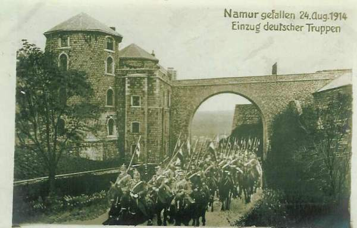
_Entrée des uhlans à Namur_
_Collection privée_

Seules les colonnes qui ont marché de Bioul sur Sosoye et Rosée parviennent à atteindre Mariembourg. Les autres sont capturées par la IIe ou IIIe armée.

Au soir, le gros des troupes sauvées est rassemblé autour de Mariembourg et Couvin.

Le fort d’Andoy se rend vers 11h après que les locaux aient été rendus intenables.

Le fort de Malonne, abandonné par sa garnison, se rend sans résistance et le fort de Saint-Héribert capitule vers 20h.

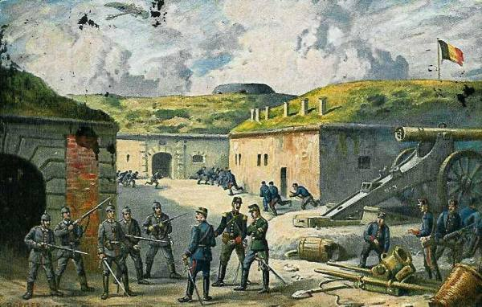
_Reddition du fort de Malonne_
_Collection privée_

Le fort d’Emines succombe sous les bombardements. Le fort de Suarlée résiste toujours et immobilise la 14e division de réserve.

### 25 août

Le fort de Dave se rend à 15h. Celui de Suarlée capitule à 17h après un bombardement notamment au moyen de pièces de 420.

La 4e division, couverte dans sa retraite par les 11e et 10e C.A. français, est définitivement hors d’atteinte par une marche de 42 km de Mariembourg à Auvillers.

### Du 26 août au 5 septembre

La 4e division, réduite de moitié par les pertes et les captures, arrive à Liart. Les troupes à pied sont embarquées en chemin de fer pour Rouen où elles arrivent le 26. Les troupes à cheval vont jusqu’à Laon qu’elles atteignent le 27 après une étape de 52 km. Une partie des unités (1e lanciers, un régiment d’artillerie) est utilisée par l’armée française, le reste est dirigé vers Rouen où il arrive le 29.

Réunies à Rouen, les troupes sont embarquées au Havre les 1e et 2 septembre et arrivent les 2 et 3 septembre à Zeebugge et Oostende d’où elles sont transportées le 5 dans la région de Oude God - Kontich (forts d’Anvers).

_Débarquement des troupes belges_
_Collection privée_

Les Allemands, qui avaient été échaudés lors de leur tentative d’un assaut de vive force contre Liège, sont devenus plus prudents : ils attendant d’avoir écrasé les forts au moyen de leur artillerie avant de donner l’attaque. Le manque de coordination entre les IIe et IIe armées allemandes permet à la garnison de s’échapper au dernier moment.

### Souvenirs du siège

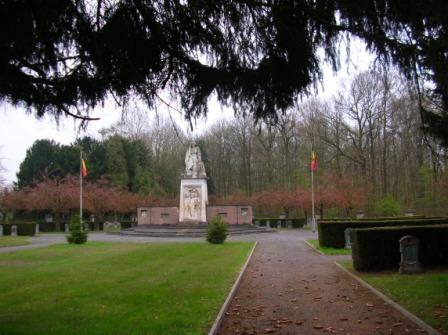
_Marchovelette - Vue générale du cimetière militaire_
_Photo de l’auteur_

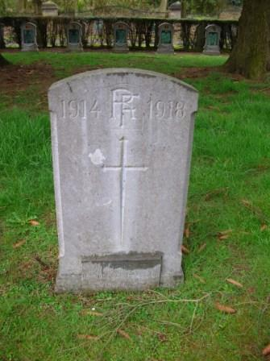
_Marchovelette - Stèle française_
_Photo de l’auteur_

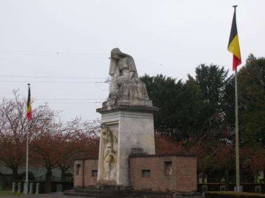
_Marchovelette - monument aux défenseurs de Namur_
_Photo de l’auteur_

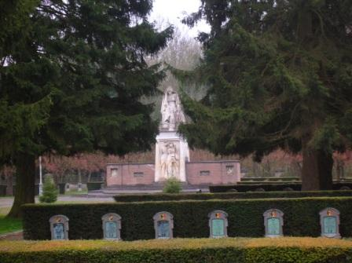
_Marchovelette - monument aux défenseurs de Namur_
_Photo de l’auteur_

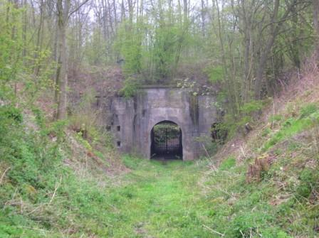
_Cognelée - entrée du fort_
_Photo de l’auteur_