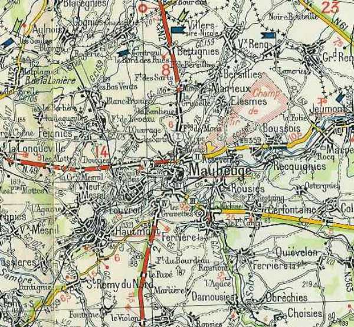
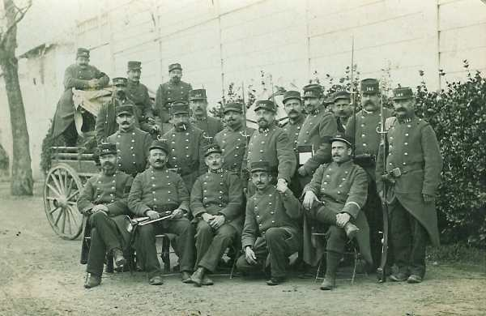
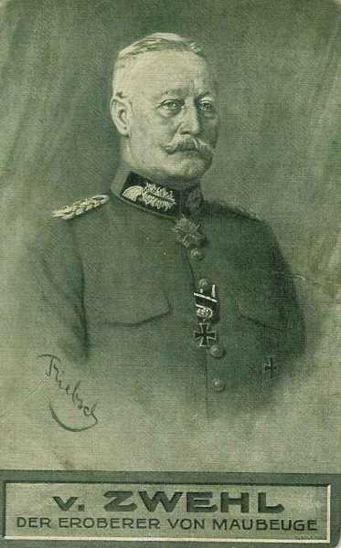
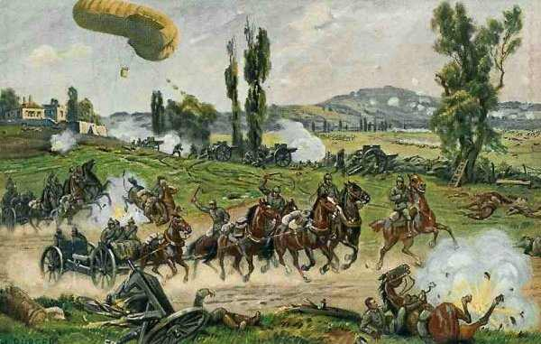
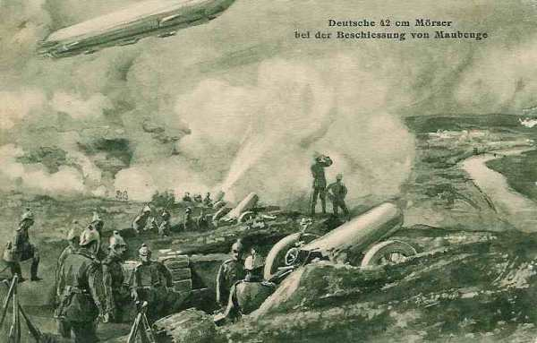
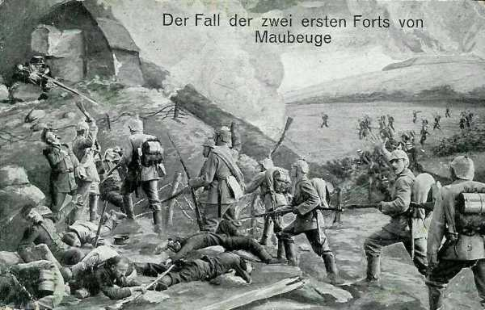
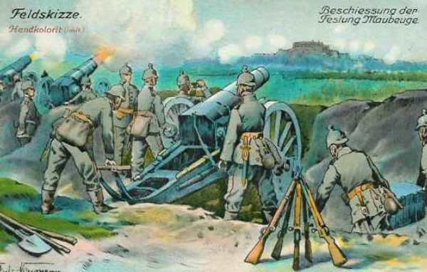
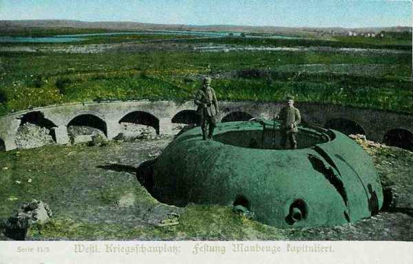

# Maubeuge (25 août - 7 septembre 1914)

La ville fortifiée de Maubeuge commande l’importante voie ferrée de Paris à Cologne, vitale pour le ravitaillement des armées allemandes. Les forts qui l’entourent sont toutefois dépassés. Un contingent de 60.000 hommes et une importante artillerie sont détachés des armées allemandes pour effectuer le siège de la ville. Quand la place tombe le 7 septembre, la bataille de la Marne est déjà engagée depuis deux jours et deux divisions et demie manquent à l’armée allemande sur le champ de bataille.

### Importance de la place de Maubeuge

La ville de Maubeuge est située sur la Sambre et commande la grande voie internationale de Paris à Cologne ainsi que les voies ferrées de Bruxelles à Paris. Elle barre la principale des voies d’invasion qui, de la Sambre, conduit à Paris par l’Oise.

_Maubeuge et environs_
_C Michelin, d’après carte n°4, édition 112-3741, autorisation 05-B-18_

Maubeuge avait été dotée d’une enceinte par Vauban, formant un cercle de 500 à 600 mètres de diamètre, puis entre 1878 et 1883, d’une ceinture d’ouvrages mesurant environ 32 km de circonférence.

Cette enceinte comporte six forts construits en brique avant l’adoption des obus à poudre brisante : les Sarts, Boussois, Cerfontaine, le Bourdiau, Hautmont et Leveau, et six ouvrages intermédiaires : Bersilies, la Salmagne, Ferrière-la-Petite, Gréveaux, Feignies et Hérifontaine.

- Au nord, la Sambre est gardée par le fort de Bersilies.
  Au sud, le fort de Cerfontaine commande la route de Luxembourg.
  Les forts de Bourdiau et d’Hautmont surveillent la route de Paris.

Certains ouvrages ont été modernisés : Boussois et Cerfontaine sont dotés d’une tourelle en fonte dure de 155. Seul le fort Bourdiau comporte une carapace en béton destinée à résister aux obus brisants.

### Maubeuge avant la guerre

La loi de 1899 classe Maubeuge en deuxième catégorie : ouvrages à maintenir dans leur état actuel sans améliorations. Toutefois, les idées évoluent : en 1908, un budget de 8.500.000 francs est consacré aux améliorations, mais in sera réduit à 3 millions en 1910.

En 1911, 1912 et 1913, la commission de défense de Maubeuge signale au ministre l’insuffisance du programme de rénovation : les anciens forts sont sans valeur, faute d’abris à l’épreuve. Joffre vient inspecter Maubeuge en 1912 et rend compte que « l’état actuel de la place lui permet de remplir sa mission ».

En 1913, le Conseil supérieur de la guerre décide que Maubeuge ne doit être considérée que comme un point d’appui pour une armée de campagne. En février 1914, le général Fournier devient gouverneur de Maubeuge. Il dispose de 31.000 travailleurs et fait creuser 15 kilomètres de retranchements et de tranchées, 50 batteries.

### Garnison de Maubeuge

La garnison compte un régiment actif, le 145e, doublé de son régiment de réserve, le 345e et de deux régiments coloniaux de réserve, les 31e et 32e  ainsi que cinq régiments d’infanterie territoriale, soit au total 50.000 hommes. L’artillerie est démodée et ne comprend que des pièces ayant une portée de cinq à neuf kilomètres et des calibres de 80 à 220 mm, au total 450 pièces approvisionnées à environ 600 coups.

_Quelques membres de la garnison de Maubeuge_
_Collection privée_

### Troupes d’investissement

Les troupes d’investissement allemandes (IIe armée) comprennent le 7e C.A.R. et une brigade du 7e C.A., sous les ordres du général von Zwehl, soit un total de 60.000 hommes. L’artillerie comprend les calibres 210, 280, 320 et 420. Le mortier de 420 envoie à 14 km un projectile pesant 900 kg avec 150 kg d’explosif. Les forts de Liège en béton n’ont pu lui résister.

_Général von Zwehl (7e C.A.R.)_
_Collection privée_

**13e division de réserve**

| Unité | Commandant | Régiments |
| --- | --- | --- |
| 25e brigade de réserve |  | 13e, 56e R.I. de réserve |
| 28e brigade de réserve |  | 39e, 57e R.I. de réserve |
| Cavalerie, artillerie et génie divisionnaires |  | 7e bn chasseurs de réserve |
|  |  | 5e régiment de hussards de réserve |
|  |  | 13e régiment de Feldartillerie de réserve |
|  |  | 14e compagnie du 7e bataillon de pionniers |

**14e division de réserve**

| Unité | Commandant | Régiments |
| --- | --- | --- |
| 28e brigade d’infanterie |  | 39e rég.de fusiliers, 159e R.I. |
| 27e brigade d’infanterie |  | 16e, 53e R.I. de réserve |
| Cavalerie, artillerie et génie divisionnaires |  | 8e régiment de hussards de réserve |
|  |  | 14e régiment de feldartillerie de réserve |
|  |  | 1e, 2e compagnie du 8e bataillon de pionniers |

Von Zwehl décide de porter son attaque dans le secteur nord-est : Bersilies, La Salmagne, Fagnet et Boussois, soit un front de huit kilomètres.

### 23 août

Les deux régiments, le 145e et 245e, sont envoyés pour garder la Sambre et faire sauter le pont du chemin de fer entre Jeumont et Erquelinnes, mais les Allemands ont déjà franchi la rivière ; Un autre détachement est envoyé à Aulnoye pour couper la voie, remplit sa mission mais est ensuite fait prisonnier.

### 24 août

Le 7e C.A.R., renforcé par des mortiers lourds, investit le camp retranché de Maubeuge (40.000 hommes). Les parcs d’artillerie arrivent après avoir consommé beaucoup de munitions lors du siège de Namur et le ravitaillement ne peut pas être assuré. En effet, la destruction du pont-rail de Namur ne laisse qu’une seule ligne de chemin de fer aux Allemands pour l’approvisionnement des trois armées de l’aile droite : Cologne - Liège - Bruxelles.

_Siège de Maubeuge_
_Collection privée_

Quant au chemin de fer Liège - Huy - Namur - Maubeuge, la destruction du tunnel de Seilles (à hauteur d’Andenne) interdit son emploi jusqu’au 5 septembre. La bataille de la Marne est à ce moment imminente.

Le feu des batteries doit donc être ralenti. Le manque de puissance du bombardement fit que la place a pu tenir jusqu’au 7 septembre, en distrayant deux divisions et demie de la bataille de la Marne.

### 25 août

Une sortie est organisée vers le nord dans la direction de Givry par deux escadrons du 6e chasseurs.

### 26 août

Une nouvelle sortie est tentée vers l’ouest. Les Allemands sont délogés de La Longueville.

### 29 août

A 13h commence le bombardement qui ne cessera que le 7 septembre à 18h. Dès le premier jour, le noyau central de la place est atteint et des incendies se déclarent à plusieurs endroits dans la ville. L’effort principal se dirige sur la trouée de 4 km entre le fort de Boussois et l’ouvrage de La Salmagne.

### 30 et 31 août

Le fort de Boussois est soumis à un déluge de feu. Le magasin à poudre est crevé, engloutissant soixante hommes. La tourelle de 155 est mise hors d’usage et le fort abandonné provisoirement. Il est ensuite réoccupé dès le 31 jusqu’au 6 septembre. La ville souffre beaucoup et les conduites d’eau sont coupées, l’appareil de télégraphe atteint. Dans la nuit du 31 au 1e septembre, une partie de l’arsenal de Falize saute, atteint par un obus, détruisant une réserve de 2.000 projectiles.

### 1e septembre

La garnison tente une importante sortie en direction de l’artillerie lourde de l’assaillant au nord de Jeumont. L’action dure de 15 à 20h, certaines unités poussant jusqu’à 250 m des pièces, mais elles sont arrêtées par les mitrailleuses. A la fin du siège, le 145e aura perdu 33 % de son effectif.

Dans la  nuit du 1 au 2 septembre, le général Fournier, qui a pris connaissance des points de rassemblement allemands fait ouvrir un feu violent par toutes les pièces des fronts nord et est.

### 2 septembre

Les Allemands dirigent le feu sur les fronts nord et nord-est. Les ouvrages de Fagnet et de la Salmagne sont entièrement bouleversés. Pendant le bombardement, les défenseurs doivent quitter les ouvrages. Entre temps, un tir violent est dirigé sur les ouvrages de Recquignies et de Cerfontaine. Au fort de Cerfontaine, la tourelle de 155 est mise hors d’usage. Un obus de 420 traverse six mètres de terre et un mètre de maçonnerie.

_Bombardement de Maubeuge_
_Collection privée_

### 3 septembre

Le général Fournier envoie par pigeon une dépêche rendant compte de la situation.

### 4 septembre

Des combats acharnés ont lieu entre la route de Bruxelles et le fort de Cerfontaine. Fournier envoie au G.Q.G. le message par pigeon « points d’appui des fronts nord et est entièrement démolis. Notre artillerie est neutralisée ; noyau central bombardé cette nuit. Troupes de défense à bout de forces. Assaut commence près de la Salmagne. Situation critique ».

### 5 septembre

Les Allemands tentent de nouvelles attaques d’infanterie. Deux sont repoussées, provenant de Vieux-Reng et de Villers-Sire-Nicole. La troisième, partie des environs de Boussois, réussit à pénétrer dans les lignes. Le moulin de La Salmagne, le village et l’ouvrage de Bersilies sont pris à l’état de ruines fumantes. Les Allemands envoient une sommation par avion. Fournier, au contraire, prescrit d’accentuer la défense sur la rive gauche de la Sambre, dans la zone Boussois, La Salmagne et Bersilies. Au soir, la situation a encore empiré. Le gouverneur en avertit le G.Q.G.

_Chute des deux premiers forts de Maubeuge_
_Collection privée_

### 6 septembre

Le bombardement devient plus intense encore rendant intenable le noyau central. Le matin, le fort de Boussois est pris, puis ceux des Sarts et de Leveau sont complètement bouleversés. Le village de Recquignies est mis à sac. Dans le courant de l’après-midi, le front de Mairieux, Assevent tombe. Il faut organiser la défense le long de la route de Mons.

_Bombardement de Maubeuge_
_Collection privée_

Les allemands atteignent les portes de la ville et les troupes françaises, démoralisées, se retirent vers le sud-ouest. Après une réunion du Conseil de défense de 20 à 21h, Fournier donne l’ordre de faire sauter l’arsenal de Falize et de détruire le matériel et les approvisionnements. L’arsenal saute vers 22h. Le bombardement reprend avec une intensité croissante.

### 7 septembre

Le général Fournier envoie un message qu G.Q.G. « ennemi occupe deux tiers de l’intérieur du camp retranché. Troupes de défense refoulées sur Hautmont, attaquées de tous côtés. Divers points d’appui pris à revers. Plus longue résistance impossible, reddition place imminente. Troupes ont été admirables ».

A midi, le général Fournier envoie un parlementaire pour demander un armistice de 24h. von Zwehl refuse la suspension d’armes. Le bombardement ne sera pas arrêté. Vers 21h30, le gouverneur fait hisser le drapeau blanc. Il est convenu que la place et les forts seront rendus à midi le 8.

_Fort de Maubeuge après la reddition_
_Collection privée_

La résistance de Maubeuge a duré onze jours et a immobilisé un C.A. allemand qui a fait défaut lors de la bataille de la Marne.