# Anvers  (27 septembre - 10 octobre 1914)

Anvers est le réduit national belge. Malgré les tentatives de von Kluck pour couper l’armée belge d’Anvers, celle-ci réussit à s’y réfugier et tente par la suite plusieurs sorties vers les lignes de communications allemandes. Pour mettre fin à cette menace, les Allemands décident de mettre en oeuvre de gros moyens. von Beseler est chargé de s’emparer de la ville portuaire.

### La position fortifiée d’Anvers

La ville d’Anvers a été de tout temps une puissante place forte.
En 1859, elle possède une enceinte et deux citadelles. Entre 1859 et 1870 la place forte est agrandie sous la direction de Brialmont. Anvers est considéré comme le réduit national de la défense de la Belgique.

A cette époque, la forteresse consiste en une enceinte polygonale continue et une ligne d’ouvrages détachés - les forts de 1 à 8 et le fort de Merxem sur la rive droite de l’Escaut ; les forts de Kruibeke, Zwijndrecht et Sainte-Marie sur la rive gauche. Tous ces ouvrages sont placés à une distance de 3 à 4 kilomètres de l’agglomération pour mettre celle-ci à l’abri d’un bombardement.
Les forts sont distants de 2 kilomètres, construits en briques. Au total, Anvers est armée de plus de 1000 bouches à feu et est considérée comme la plus puissante forteresse du monde.

Pour pouvoir, suivant les circonstances, sortir de la place en direction de Bruxelles ou de Leuven ou y rentrer rapidement, l’on construit les forts de Waelhem, de Lier et la redoute de chemin de fer qui garantissent la possession des ponts sur la Nèthe.

Vers 1900, il s’avère nécessaire d’augmenter l’ampleur des installations maritimes et d’assurer le développement de la ville. Un projet de loi est adopté par les chambres législatives en 1906, prévoyant

- La création d’une ligne de défense composée de forts détachés distants de l’agglomération d’au moins 9 km, portée maximale de l’artillerie de siège de l’époque. Cette ligne a un développement total de 95 km (75 sur la rive droite et 22 sur la rive gauche), dont 10 km de front inondable.

- La création d’une enceinte de sûreté à hauteur de la ligne des forts de 1859, d’une longueur de 32 km.

- La démolition de l’enceinte de 1859.

- Le renforcement de la défense du Bas-Escaut par plusieurs batteries côtières à hauteur de Doel pour battre les passes du fleuve jusqu’à la frontière hollandaise.

Les forts,  au nombre de 17, sont espacés de 5 en 5 kilomètres et une redoute permanente s’élève au milieu de chaque intervalle.

- Chaque fort doit comprendre
  1 ou 2 coupoles pour canons de 150
  2 coupoles pour un obusier de 120
  4 à 6 coupoles pour un canon de 75.

Les redoutes n’ont qu’un canon de 75 sous coupole.

Les forts et redoutes sont construits en béton ordinaire avec des voûtes épaisses de 2m50 en clé. La garnison varie entre 100 et 500 hommes.

_Les forts d’Anvers_
_L’action de l’armée belge_

En 1914, au moment du déclenchement des hostilités, la transformation de la forteresse n’est pas terminée. Comme à Liège, les forts sont monolithiques donc vulnérables au tir de l’artillerie. Les Allemands, au contraire, avaient dispersé les organes des « Feste » sur une grande superficie.

Les pièces d’artillerie des forts ont une portée maximale de 8 km et tirent à la poudre noire. Un nuage de fumée les fait repérer après chaque coup.

Les cuirassements sont à l’épreuve du mortier de 21 cm, dont le projectile pèse 120 kg. Or, les Allemands vont mettre en œuvre des canons d’un calibre de 280, 305 et même 420.

Les canons de 150 ne disposent que de 800 coups et la garnison est composée de soldats des anciennes classes de milice.

En août 1914, la place est mise en état de défense. Les forts inachevés sont aménagés par des moyens de fortune ; les forts et redoutes sont réunis par un obstacle continu composé de plusieurs bandes de fil de fer et de tranchées pour l’infanterie.

### Importance stratégique de la position

La place d’Anvers contient les arsenaux, les réserves de vivres et les stocks de munitions de l’armée belge. Celle-ci ne peut par conséquent s’en laisser couper dans aucune circonstance.

- L’armée peut sortir de la place quand elle le veut pour menacer les lignes de communications allemandes.

- Anvers possède des relations faciles avec l’Angleterre. Des troupes anglaises peuvent débarquer pour venir en aide à l’armée belge.

- Anvers constitue un véritable rempart de l’Angleterre contre l’invasion allemande et protège le trafic maritime du Pas-de-Calais : une centaine de navires approvisionnent journellement la population anglaise.

- La traversée du « Channel » entre Douvres ou Folkestone et Dunkerque, Calais ou Boulogne constitue la ligne de ravitaillement de l’armée anglaise engagée en France.

### Les forces en présence

L’armée belge est considérée comme une menace pour les arrières de l’armée allemande. L’O.H.L. décide de mettre fin à cette situation.

Le 7 septembre, la capitulation de Maubeuge rend disponible un matériel d’artillerie très puissant, qui avait ruiné les forts de Liège et de Namur.
Le général von Beseler, commandant du 3e C.A.R., reçoit pour mission de s’emparer d’Anvers.

- Il dispose dès le 20 septembre des unités suivantes :
  3e C.A.R.
  Division de marine.
  4e division d’Ersatz.
  26e et 37e brigades de Landwehr.
  2e et 5e brigades d’artillerie à pied.
  24e et 25e régiments de pionniers.

- A ces forces impressionnantes viendront se joindre par la suite :
  La brigade de Landwehr bavaroise
  La 1e brigade d’Ersatz de réserve
Soit au total 130.000 hommes

- Le parc d’artillerie est considérable :
  40 canons de 10 et 13 cm.
  38 obusiers de 15 cm.
  48 mortiers de 21 cm.
  5 mortiers de côte de 30,5 cm.
  4 mortiers autrichiens Skoda de 30,5 cm.
  4 canons courts de 42 cm.

Quant à l’armée belge, elle compte les 90.000 soldats de l’armée de campagne (six divisions d’armée et une division de cavalerie) et 67.000 soldats de troupe de forteresse, soit un total de 157.000 hommes.

- Les 1e, 2e, 3e, 5e et 6e divisions défendent la ligne des forts en avant du Rupel et de la Nèthe.

- La 4e division, en occupant l’Escaut à Baasrode, Dendermonde et Schoonaarde, protège les lignes de retraite vers l’ouest.

- La D.C. surveille la rive gauche de la Dendre et protège les mêmes lignes de retraite.
Tant que la ligne de la Dendre ne sera pas franchie, la situation de l’armée ne sera pas compromise.

Comme les forces belges et allemandes s’équivalent, l’armée belge pourra tenter des sorties et pratiquer ainsi une stratégie défensive-offensive.

### Le plan de von Beseler

_Général von Beseler (3e C.A.R..)_
_Collection privée_

Nourri de l’expérience de l’attaque de Liège, von Beseler ne compte pas engager d’emblée son infanterie, mais détruire d’abord les forts et redoutes au moyen de l’artillerie lourde.

- Bombarder pendant plusieurs journées les forts et intervalles.

- Quand les ouvrages auront été réduits au silence par l’artillerie de siège, l’infanterie attaquera et occupera les ruines des forts et les lignes de défense au sud de la Nèthe. La rive nord de cette rivière sera bombardée et la Nèthe franchie.

- Le terrain au nord de la Nèthe sera occupé et la ville d’Anvers bombardée pour en obtenir la reddition.

Pour pouvoir concentrer le tir d’artillerie sur un secteur limité, von Beseler choisit comme front d’attaque le secteur Mechelen - Lier.

**[Lien vers défense d’Anvers](../img/defense_anvers.jpg)**

### 27 septembre

L’armée de siège refoule les grand’ gardes belges entre la Dyle et la Nèthe et prend possession de la crête Putte - Heyst-op-den-Berg, à quelques kilomètres de la ligne des forts.

La ville de Malines est bombardée dès 10h.

### 28 septembre

La division de marine, la 4e division d’ersatz et la 34e brigade de la Landwehr attaquent entre la Dyle et la Dendre. Les brigades belges avancées des 2e, 1e, 3e et 6e divisions se défendent avec opiniâtreté, soutenues par le canon des forts. Elles finissent par céder Mechelen et Tisselt mais conservent Sint-Amands et Lippelo. Les mortiers lourds s’installent sur les hauteurs de Putte. Vers midi, ils prennent à partie les forts de Walem, de Sint-Katelijne-Waver, de Koningshooikt et de Lier.

Les effets sont alarmants : un obus de 420 perce une voûte épaisse de 2 m 50 à Sint-Katelijne-Waver, défonce les voûtes de la poterne centrale, une coupole reste calée. Les autres forts subissent également des dégâts, mais dans une moindre mesure.

### 29 septembre

A l’ouest de la Senne, des attaques autour du Blaasveld sont repoussées. Entre Senne et Nèthe, la canonnade est encore plus violente. Elle prend à partie les tranchées des intervalles et les ouvrages permanents.

A partir de 5h du matin, le fort de Sint-Katelijne-Waver reçoit un projectile de 42 cm toutes les sept minutes. La majeure partie de la garnison doit se réfugier sur la berme du fossé et la plupart des coupoles du fort sont rendues inutilisables. Un magasin de munitions explose, ce qui provoque un incendie et tue soixante hommes.
Le soir, le fort est définitivement évacué.

Au fort de Walem, un magasin de munitions explose et une partie des voûtes s’effondre, ensevelissant septante personnes.

Les redoutes de Bosbeek et de Dorpveld sont bombardées intensivement par des mortiers de 21.

L’Etat-Major belge se rend compte que la place d’Anvers ne pourra plus résister indéfiniment et envisage de déplacer la base arrière vers l’ouest. La seule ligne de chemin de fer disponible est celle d’Anvers à Oostende. Dans le courant de la nuit, les trains se succèderont, tous feux éteints car ils sont sous le feu des canons allemands. Les troupes d’investissement ne s’en rendent pas compte et les transports durent plusieurs nuits.

### 30 septembre

Le bombardement des intervalles dans le 3e secteur est si violent que la 1e division, de garde entre l’inondation de Heyndonk et le fort de Sint-Katelijne-Waver doit abandonner ses retranchements et reporte la défense derrière la Nèthe. Les forts de Walem et de Sint-Katelijne-Waver se trouvent ainsi isolés.

Le fort de Lier et le fortin de Duffel sont bombardés. La plupart des pièces du fort de Koningshooikt sont hors d’usage et une partie de l’ouvrage est détruite. Au fort de Lier, l’explosion d’un obus projette hors de son puits une coupole de 57.

L’infanterie allemande n’a encore attaqué nulle part et déjà tous les forts sauf celui de Lier sont endommagés. Von Beseler ménage son infanterie. Il veut préalablement ruiner les organes de défense sous un pilonnage méthodique. L’infanterie n’interviendra qu’ensuite.

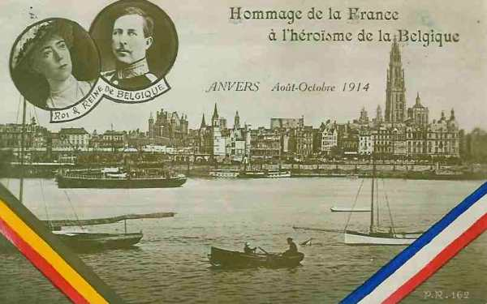
_Albert Ie et Anvers_
_Collection privée_

### 1e octobre

Dans la nuit, la 1e division a réoccupé tant bien que mal les emplacements à hauteur des forts de Walem et Sint-Katelijne-Waver. La 2e division se trouve entre le fort de Sint-Katelijne-Waver et la redoute de Tallaert ; la 1e brigade tient l’intervalle entre cette redoute et la Grand Nèthe.

Entre 02h et 04h, l’artillerie des forts bombarde les agglomérations tenues par l’armée allemande, mais celle-ci reprend son pilonnage.

A 16h, le bombardement cesse brusquement et l’infanterie allemande apparaît : von Beseler a donné le signal de l’assaut. Le fort de Walem, abordé de tous côtés par le 1e régiment de marine repousse les assauts
répétés jusqu’au lendemain en lui infligeant de lourdes pertes.

Le 12e régiment allemand entre sans coup férir dans le fort de Sint-Katelijne-Waver avant que sa garnison n’ait pu le réoccuper, mais toutes les tentatives pour progresser de part et d’autre sont bloquées.
La redoute de Dorpveld, qui a son unique canon hors service parvient à arrêter l’assaut du 48e régiment. Les assauts contre le village de Sint-Katelijne-Waver et contre la redoute de Bosbeek échouent.

Plus à l’est, la 6e division de réserve est reçue par un feu d’artillerie efficace. Les 6e et 1e brigades belges tiennent tête avec énergie et la division se retrouve après 24 heures de lutte à plus de 600 m de la ligne des forts de Koningshooikt et de Lier.
Entre l’Escaut et la Senne, des attaques de la division de marine et de la 4e division d’ersatz sont repoussées par les 3e et 6e divisions belges.

Pendant la nuit, les Allemands essaient de percer l’intervalle entre la redoute de Tallert et le fort de Lier, mais sans succès.

### 2 octobre

Les 1e et 2e divisions belges exécutent des contre-attaques pour reprendre les positions perdues sur la ligne des forts.

Après un premier échec, les pionniers allemands parviennent à jeter une passerelle sur le fossé de la redoute de Dorpveld et à s’installer sur le massif. Les pionniers attaquent le ciel du fort à la mine et le béton, de mauvaise qualité, cède sous l’effort des charges. Vers 5h, une mine fait une brèche dans la voûte et les Allemands prennent possession d’un étage mais se trouvent devant une barricade pour interdire le rez-de-chaussée.

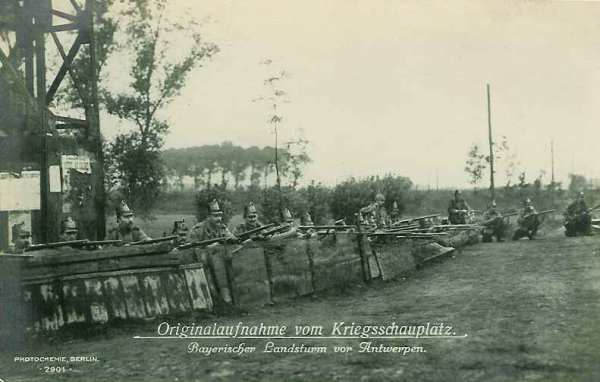
_Landsturm devant Anvers - Collection privée_

Vers midi, la redoute de Bosbeek et le fort de Koningshooikt en ruine sont évacués, de même que le village de Sint-Katelijne-Waver.

A 17h, le fort de Walem fait sauter sa dernière coupole et se rend.

La redoute de Tallert saute.

Dès 7h du matin, des mortiers de 42 cm pilonnent le fort de Lier, leur tir étant réglé par avion. Les projectiles parviennent à percer une voûte en béton de trois mètres d’épaisseur.

A 17h, le fort est pratiquement détruit et les débris de la garnison quittent le pied des remparts à 18h.

Au soir, Albert Ie décide de reporter la ligne de résistance en arrière de la Nèthe dont la rive sud est inondée. Le Roi souhaite que son armée tienne la place le plus longtemps possible, d’autant plus que les franco-britanniques gagnent du terrain vers le nord. Plus ils se rapprocheront, moins longue sera la distance à franchir pour les rejoindre.

- La 1e division est disposée à la droite, depuis Rumst jusqu’au pont-rail de Duffel.

- La 5e division est déployée à sa gauche, depuis Duffel jusqu’à Lier.

- Les 5e et 6e régiments d’infanterie de forteresse prolongent la ligne à gauche entre la Grande Nèthe et le fort de Broechem.

- Les 3e et 6e divisions défendent le front Rumst-Escaut.

La sécurité des communications vers l’ouest demande de la vigilance. Quatre régiments de cavalerie sont envoyés vers Lokeren.

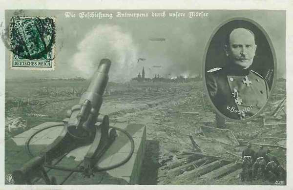
_Bombardement d’Anvers_
_Collection privée_

### 3 octobre

Dès 6h, le tir des pièces de gros calibre est dirigé sur le fort de Kessel. Une voûte s’effondre. A 8h30, la moitié du fort est déjà en ruines. Il est ensuite évacué.
Pour prolonger la résistance, l’armée belge ne dispose plus que de l’artillerie de campagne ainsi que de deux trains blindés armés de canons de 12 cm.

La redoute de Duffel, entourée par l’infanterie de marine tient l’assaillant en respect pendant toute la journée. La nuit venue, ses munitions sont épuisées et la garnison s’échappe homme par homme et rallie la rive nord de la Nèthe.

Winston Churchill, premier lord de l’amirauté britannique arrive à Anvers.
Dans la nuit, parvient un message de French annonçant qu’un C.A. anglais arrivera à Lille le 8, bientôt suivi de trois autres.

### 4 octobre

Dans la matinée, une brigade de marins anglais, forte de 2.200 hommes, arrive en renfort et se rend à Lier. Elle doit être suivie d’un autre contingent de 7.000 hommes.

La rive nord de la Nèthe est bombardée et les troupes de défense entre la Grande et la Petite Nèthe doivent abandonner le terrain. Le fort de Kessel doit être évacué. Les 5e et 6e régiments de forteresse refluent derrière la Petit Nèthe.

Les Allemands passent la Dendre et cherchent à franchir l’Escaut entre Schoonarde et Dendermonde, afin de couper la retraite de l’armée belge.

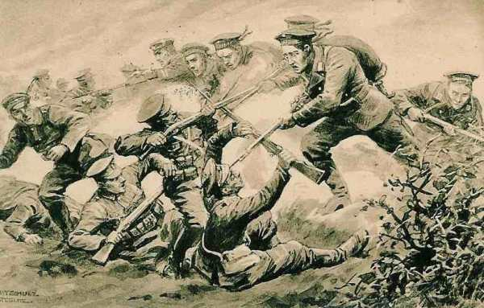
_Marins allemands contre Anglais_
_Collection privée_

### 5 octobre

Le fort de Broechem est bombardé par de l’artillerie lourde.
Un combat de rues a lieu dans Lier. Les Allemands veulent s’en emparer pour avoir un point d’appui sur la Nèthe, leur permettant de tourner le front inondé. Les Belges tentent vainement une attaque de nuit pour repousser les allemands au sud de la Nèthe.

De nouvelles attaques sont dirigées contre les troupes qui gardent les lignes de retraite à l’ouest d’Anvers. Elles sont repoussées mais la situation de la 4e division commence à être critique.

### 6 octobre

La lutte se poursuit dans Lier. Les Allemands sont cloués aux lisières de la ville par les feux de la brigade de marine anglaise mais, un peu en aval, ils établissent sept passerelles sur la Nèthe et lancent une attaque générale contre la position de la rive nord. Les 1e et 3e divisions tiennent toujours la Nèthe et la ligne des forts jusqu’à l’Escaut mais sont débordées par la gauche.

Dix ouvrages sont hors de combat dans la position principale et la brèche est large de 26 km. De nombreuses contre-attaques sont menées par les troupes belges mais sans pouvoir enrayer la progression allemande.

Plusieurs tentatives sont faites pour forcer le passage de l’Escaut à Baasrode, Dendermonde et Schoonaarde. La 4e division et la D.C. les arrêtent. Comme la situation dans ce secteur (4e) devient critique, la 6e division reçoit l’ordre de franchir l’Escaut pour se porter au secours de la 4e division.

Le fort de Breendonk est attaqué au moyen de mortiers de 305.

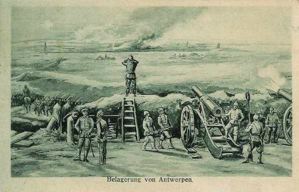
_Bombardement d’Anvers_
_Collection privée_

Albert Ie réunit le conseil supérieur de la guerre. Celui-ci déclare unanimement que « comme la ligne de la Nèthe est forcée et que la 5e division s’est repliée vers Bouchout, il faut faire passer le gros de l’armée sur la rive gauche de l’Escaut pendant la nuit, tout en assurant la défense de la deuxième ligne du camp retranché avec les forces nécessaires ».

La ligne de défense est organisée sur la ligne des forts de 1 à 8. Les forts de la première ligne de défense résisteront comme ouvrages isolés.

- Les ordres pour le franchissement de l’Escaut sont expédiés.
  La 3e division utilisera le pont de Temse.
  La 1e celui d’Hemixem.
  La 5e division celui de Burcht.

L’intention d’Albert Ie est de défendre l’Escaut de Dendermonde à Gent, car la ligne de l’Escaut est une position très forte.

### 7 octobre

L’armée de campagne se trouve tout entière sur la rive gauche de l’Escaut, sauf la deuxième division, les troupes de forteresse et trois brigades anglaises.

La 4e brigade est envoyée à Gent pour s’opposer à des tentatives éventuelles des troupes allemandes visant à empêcher la retraite de l’armée belge.

Le roi Albert quitte Antwerpen à 15h.

A 16h, un parlementaire allemand se présente à l’E.M. de la position fortifiée et fait part de la menace de bombarder Anvers à partir de minuit à moins d’une capitulation préalable. Convoqué par le général Deguise, commandant de la place, le conseil communal se déclare prêt à accepter toutes les conséquences de la défense poussée à ses dernières limites.

Les Allemands bombardent la ville d’Anvers dès minuit.

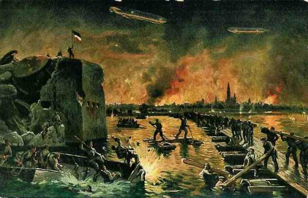
_Prise d’Anvers_
_Collection privée_

Des éléments du 3e C.A. allemand poussent des reconnaissances contre la seconde ligne de défense (forts de 1 à 8).

Deux bataillons allemands réussissent à passer l’Escaut en barque à Schonaarde.

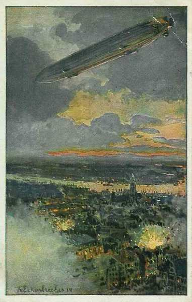
_Zeppelins au-dessus d’Anvers_
_Collection privée_

### 8 octobre

En matinée, les pontonniers allemands jettent un pont sur l’Escaut ; la 37e brigade et la brigade de Landwehr bavaroise le franchissent, suivies par la 4e division d’ersatz et poussent vers Dendermonde et Lokeren où ils se heurtent à la 3e division belge.

Comme la seconde ligne de forts ne présente pas un obstacle sérieux contre une attaque allemande et que le war office a pris la décision de réembarquer la division navale, le général Deguise renonce à lutter davantage sur la seconde ligne de défense et décide de profiter de la nuit pour replier sur la rive gauche de l’Escaut les troupes garnissant la position.

- La division navale britannique franchira l’Escaut pendant la nuit, ira s’embarquer à Sint-Gillis-Waes pour être transportée par train jusqu’à Oostende.

- La 2e division belge accompagnera la division britannique.

- Tous les ouvrages encore intacts de la rive droite se défendront comme forts isolés.

- Avec 20.000 hommes de troupes de forteresse, le général Deguise essaiera de prolonger la résistance dans le petit camp retranché formé par l’Escaut et les ouvrages de la rive gauche.

Les troupes anglaises quittent Anvers en soirée. La 2e division suivra avec les troupes de forteresse.
Le soir, la 1e division est transportée par chemin de fer de Sint-Niklaas à Oostende. Les autres divisions marchent vers le canal de Terneuzen.

### 9 octobre

L’armée de campagne se reforme sur la rive ouest du canal de Gent-Terneuzen. La division navale britannique rallie Sint-Gillis-Waas.
La 37e brigade de la Landwehr opère au nord de l’Escaut vers Lokeren. Elle est suivie par la 4e division d’Ersatz qui passe le fleuve à Schoonaarde. Deux bataillons belges attaqués par des colonnes allemandes débouchant de Lokeren, sont coupés de leurs arrières et doivent se réfugier en territoire hollandais.

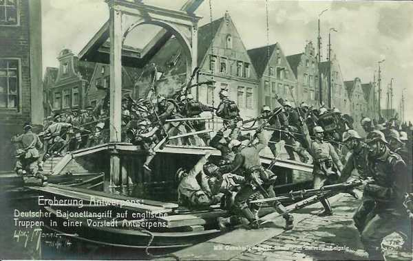
_Les Allemands pénètrens à Anvers_
_Collection privée_

Les autorités communales anversoises prennent contact avec l’E.M. de von Beseler en vue de la reddition de la place. Une dizaine d’incendies sont allumés par le bombardement et la distribution d’eau ne fonctionne plus.

### 10 octobre

Le général Deguise délègue son chef d’Etat-Major en parlementaire auprès de von Beseler pour s’enquérir des conditions de reddition. Il donne l’ordre aux forts de cesser toute résistance.

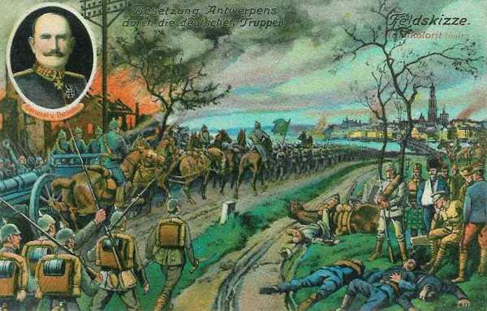
_Entrée des Allemands à Anvers_
_Collection privée_

Les troupes allemandes pénètrent dans Anvers mais von Beseler constate que l’armée de campagne s’est échappée ; les troupes de forteresse se sont réfugiées en Hollande. Les ouvrages non attaqués sont vides, le matériel hors service. Il ne peut contenir son dépit et dit « Une si fameuse forteresse sans un seul général ! ».

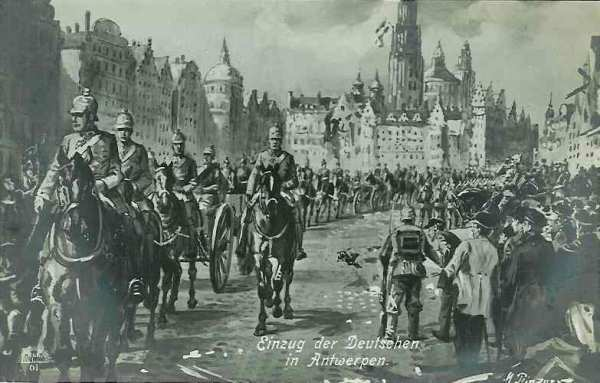
_Entrée des troupes allemandes à Anvers_
_Collection privée_

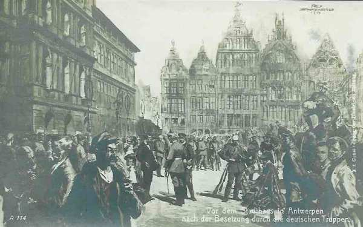
_Troupes allemandes devant ’hôtel de ville d’Anvers_
_Collection privée_

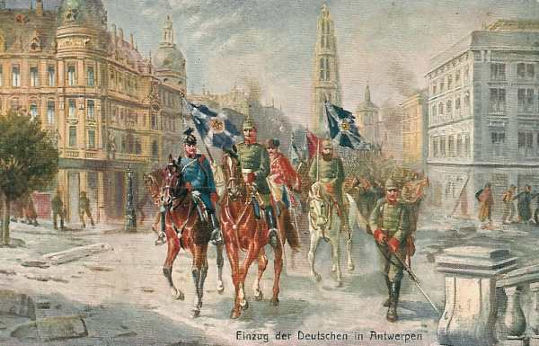
_Entrée des troupes allemandes à Anvers_
_Collection privée_

La consommation de munitions a été très importante du côté allemand :

- Mortiers de 420 : 590 coups.
  Mortiers de 305 : 2.130 coups.
  Mortiers de 210 : 11.800 coups
Ceci contre huit forts.

Au total, tous calibres confondus, 62.000 coups ont été tirés sur Anvers par l’artillerie allemande.

Une des causes de la chute rapide d’Anvers est que les forts ont été bâtis en terrain plat ; partout, la nappe aquifère obligeait à les construire en surface. Ils constituaient d’excellentes cibles pour l’artillerie lourde allemande.

La résistance d’Anvers a forcé l’armée allemande à maintenir autour de la place un important contingent, qui a manqué à la bataille de la Marne. Elle a ainsi contribué indirectement à la victoire alliée.