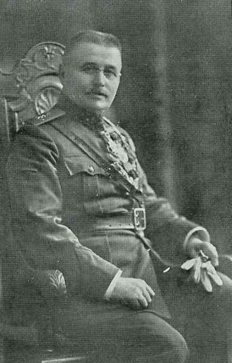
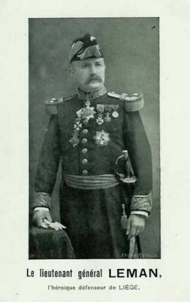
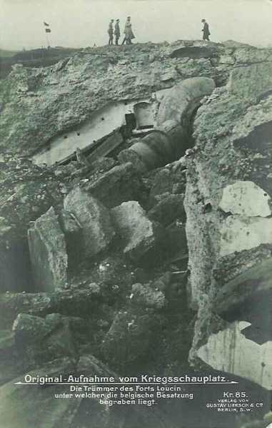
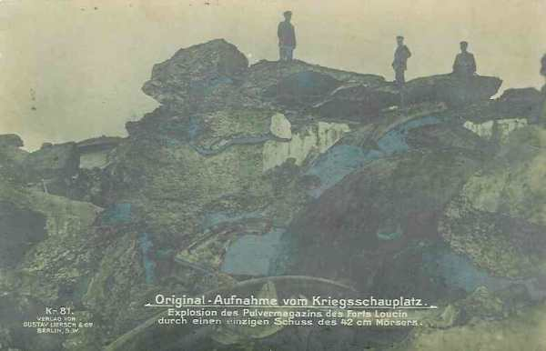

# Le fort de Loncin (5 - 10 août 1914)

Le fort de Loncin est le symbole de la résistance de Liège. Ce récit complète celui de l’assaut contre la position fortifiée.

### La position fortifiée de Liège

- La position comporte six grands forts :
  trois sur la rive droite de la Meuse : Barchon, Fléron, Boncelles
  trois sur la rive gauche : Pontisse, Loncin, Flémalle

- et six petits forts :
  trois sur la rive droite : Evegnée, Chaudfontaine,
Embourg
  trois sur la rive gauche : Liers, Lantin, Hollogne.

**[Lien vers carte](../img/forts_liege2.jpg)**

Loncin se trouve entre les forts de Lantin et de Hollogne, à trois kilomètres de ces ouvrages. Il commande toute la région, notamment la route Liège - Bruxelles, excepté du côté de Liège où une crête barre l’horizon à 600 m de distance.

### Le fort

Le fort, construit en 1888 par le général Brialmont, a un plan triangulaire, avec son massif central, énorme masse de béton surmontée des coupoles. Aux trois angles, on aperçoit une coupole à éclipse, contenant un canon de 570 mm destiné à battre les abords immédiats de l’ouvrage.

**[Lien vers plan](../img/plan_fort_loncin.jpg)**

Vers le milieu du massif, deux coupoles abritent chacune un obusier de 210 mm, lançant des obus de 91 kg selon une trajectoire courbe.

Au centre du massif se trouvent trois grosses coupoles tournantes. Celle du milieu comporte deux canons de 150 mm. Chacune des deux autres, à gauche et à droite, renferme deux pièces de 120 mm. Ces organes sont protégés par des voûtes d’acier et de béton.

Si un ennemi parvenait à forcer les défenses et à pénétrer dans le fossé, il serait pris sous le feu de pièces à tir rapide disposées dans les coffres flanquants. Une de ces pièces protège la poterne d’entrée. Quatre autres pièces battent le pourtour du massif central.

Ce dispositif, excellent lors de la construction, est devenu insuffisant en 1914 : en effet, l’épaisseur des murs et des cuirasses avait été établie en fonction des projectiles de l’époque, au maximum 210 mm, mais depuis lors, l’artillerie avait fait des progrès considérables.
Le fort était en béton ordinaire, sans armature.

### La garnison

A la défense du fort est attachée une compagnie d’infanterie de forteresse. Lors de la mobilisation, trois classes de miliciens viennent renforcer les effectifs de temps de paix.
Au premier août, la garnison au complet comporte 350 artilleurs et 200 fantassins, sous le commandement du colonel Naessens.

_Le commandant du fort de Loncin_

### Les préparatifs

**Dès le 29 juillet :**

Les travaux de mise en défense commencent. Les fils de fer barbelés sont posés. On relie par téléphone le bureau de tir au château de Waroux et aux clochers d’Alleur et de Loncin pour permettre aux observateurs de signaler les mouvements de l’ennemi et de régler le tir.

**Dès le 1e août :**

L’état de guerre permet de procéder à des destructions de biens civils. Les abords du fort sont dégagés. Dans un rayon de 600 mètres, les maisons sont détruites et les arbres abattus, les haies coupées, les moissons foulées, les chemins creux comblés.

Les vivres sont réquisitionnés. Douze mille kilos de pommes de terre destinées à l’Allemagne sont confisqués dans une gare des environs.

### Le serment de la garnison

A la nouvelle de la violation de la frontière belge, la garnison est réunie au complet dans le fossé. Le commandant Naessens fait jurer à ses hommes de lutter jusqu’au dernier obus, jusqu’à la dernière cartouche, jusqu’au dernier homme.

### 6 août : premiers engagements

Dans la nuit du 6 août, les colonnes allemandes attaquent les troupes de la 3e division belge qui occupent les intervalles entre les différents forts de la rive droite.

Toutes les colonnes sont repoussées sauf celle commandée par Ludendorff. Le commandant de la 3e division ordonne la retraite. Les forts continuent toutefois à résister et se défendent par leurs propres moyens.

Loncin est encore hors du secteur d’attaque, car les forts de la rive droite sont la première cible.

**05h30 :**

Une voiture battant pavillon du commandant de la 3e division apparaît et le général Leman, commandant de la place de Liège en descend pour établir son Q.G. dans le fort. La compagnie d’infanterie attachée à Loncin, et qui a participé à la bataille du 6 août, regagne le fort. Elle a perdu son chef et la moitié de son effectif.

_Général Leman_
_Collection privée_

Pendant tout le reste de la journée, la garnison du fort voit défiler la 3e division. Loncin demeure seul, sans l’appui d’artillerie de campagne ni d’infanterie.

**Dans l’après-midi :**

Le gouverneur de la province, le bourgmestre de Liège et un officier allemand se rendent au fort, sont introduits auprès du général Leman et l’informent que la drapeau blanc a été hissé sur la citadelle.

Le général Leman réplique « Le commandant de la citadelle n’a aucun droit d’arborer le drapeau blanc. Quant aux forts, ils se défendront jusqu’à la dernière extrémité ».

La communication entre forts par téléphone est devenue impossible, car les Allemands occupent le bureau central par lequel doivent passer les communications. Le commandant Naessens doit constituer une escouade d’estafettes chargée de porter les ordres.

### Organisation de la défense.

Comme les Allemands ont pu pénétrer, sous la conduite de Ludendorff, à l’intérieur du périmètre des forts, ils peuvent attaquer ceux-ci par l’intérieur, leur point le plus faible. La retraite de l’armée belge a laissé les forts sans appui extérieur. Le fort de Loncin ne peut compter que sur lui-même.

La garnison doit opérer à l’extérieur du fort pour assurer sa sûreté. Partout où ils tentent d’avancer, les Allemands sont reçus à coups de fusil. Les observateurs continuent à être postés dans les clochers et autres points dominants.

### 7 août

Les coupoles sont approvisionnées et les canonniers à leur poste. Le commandant d’artillerie du fort, le lieutenant Modard, est dans son bureau de tir, relié aux observateurs par cinq lignes téléphoniques.

**En matinée :**

Liège voit entrer en ses murs les premiers bataillons allemands. Une colonne allemande, sous le commandement du colonel Von Oven, se dirige vers la lisière ouest de Liège avec des canons, qu’il veut mettre en batterie sur la chaussée de Loncin. Les troupes allemandes s’engagent sur la côte d’Ans, chaussée reliant Liège à Loncin. Un guetteur épie l’arrivée de la colonne du haut d’un mat téléphonique et transmet le signal dès qu’elle atteint le passage à niveau Ans - Liers.

Le fort effectue un tir « en plate bande », qui échelonne les projectiles sur une profondeur de plusieurs centaines de mètres. Un seul obus de 210 mm à shrapnell contient 1360 balles. Huit tirs simultanés dispersent un ouragan de mitraille. Plusieurs fantassins allemands gisent sur la chaussée, les autres refluent vers Liège.

**Vers midi :**

G. Kleyer, bourgmestre de la ville, se présente à Loncin et déclare que les Allemands menacent de détruire Liège si les forts ne se rendent pas immédiatement. Il demande au général Leman un laissez-passer pour aller mettre le gouvernement belge au courant.

**Dans l’après-midi :**

Deux officiers allemands, portant le drapeau blanc, demandent à parler au commandant du fort. On leur bande les yeux et on les introduit auprès du commandant Naessens. Un des parlementaires lit une convention conclue entre les autorités civiles et le général von Emmich, aux termes de laquelle les forts ne pourraient plus tirer vers la ville sans exposer la population à des représailles.

Naessens déclare qu’il se moque de cette convention et que tant que le fort aura une pièce en état de tirer, il se défendra.

On remet les bandeaux aux parlementaires et ils sont reconduits jusqu’aux points de surveillance extérieure. Naessens donne l’ordre d’arrêter désormais les parlementaires et de les inviter à rebrousser chemin.

**18h :**

Le premier obus allemand, un projectile de 105 mm éclate : les Allemands effectuent un tir de repérage. D’autre obus viennent effleurer le massif central.

Les observateurs dans les clochers d’Alleur et de Loncin sont aux aguets. A côté du terril des Français, ils détectent de légères volutes bleues. Les Allemands disposent de poudre sans fumée.

Les coupoles du fort tournent et ajustent leur tir vers le terril. Au bout d’un certain temps, l’artillerie allemande ne donne plus aucun signe de vie. Il y avait deux batteries près du terril. Une dizaine de servants ont été mis hors de combat et trois pièces sont hors de service.

Le général Leman rédige un ordre prescrivant aux forts de résister à outrance.

### 8 août

**09h :**

Une colonne allemande est signalée dans la montée d’Ans et vient d’atteindre le croisement des rues de Bruxelles et de Rocour. Une nuée de shrapnells s’abat sur eux.

**Dans l’après-midi :**

Naessens fait sonner le rassemblement et annonce que le président Poincarré à décerné la croix de la Légion d’Honneur à la ville de Liège. Des cris enthousiastes éclatent : « Vive la France ».

Un avion allemand apparaît à l’horizon et se pose sur le champ d’aviation d’Ans. Plusieurs voitures y sont arrêtées, avec des officiers allemands. Le fort tire des obus à balles, le monoplan est frappé et plusieurs officiers s’affaissent.

**17h :**

Le fort de Barchon capitule.

### 9 août

**En matinée :**

Des troupes allemandes sont repérées aux environs de la gare d’Ans et le fort effectue un tir dans leur direction.

**Dans l’après-midi :**

Des fantassins allemands, cachés dans des chemins creux, subissent le tir des pièces du fort.

### 10 août

Le fort est bombardé mais comme il a repéré les batteries allemandes, les grosses coupoles entrent en action.

### 11 août

Von Bülow ordonne la constitution d’un puissant corps de siège et met une formidable artillerie à sa disposition, dont deux batteries de mortiers de 420 mm. Le commandement de cette armée est confié au général von Einem.

Les Allemands se glissent dans les agglomérations autour de Loncin. Le fort dirige un feu violent vers une maison où se trouve un état-major.

**17h :**

Le fort d’Evegnée tombe

### 12 août

- L’armée de von Einem met en batterie les pièces lourdes et le général donne aux C.A. leurs objectifs :
  9e C.A. : Liers, Pontisse et Fléron.
  7e C.A. : Chaudfontaine et Embourg.
  10e C.A. : Boncelles.

Lantin, Loncin, Hollogne et Flémalle seront réduits de l’intérieur de la position par des tirs d’artillerie.

**Fin de l’après-midi :**

Les batteries de 420 mm sont prêtes à entrer en action.

**17h45 :**

Le fort de Pontisse est ébranlé par une explosion formidable.

### 13 août

Une auto s’arrête devant le fort. Un lieutenant de gendarmerie vient chercher onze millions que le général Leman a emportés avec lui le 6 août. Après rédaction des procès-verbaux, les sacs d’or et liasses de billets sont entassés dans la voiture. Celle-ci est poursuivie par des uhlans mais elle parvient à les distancer.

**9h :**

Chaudfontaine est démoli par une explosion et se rend.

**12h30 :**

Pontisse, complètement défoncé par des obus de 420, cesse le combat.

**19h30 :**

Embourg, gravement atteint, se rend.
Les forts de Fléron et de Boncelles sont canonnés.

**Pendant la nuit :**

Les patrouilleurs rencontrent huit cents soldats belges qui n’ont pas été touchés par l’ordre de retraite. Ils se sont faufilés à travers les lignes allemandes et rejoindront l’armée de campagne.

### 14 août

Les villages de Loncin et d’Alleur sont occupés par les Allemands.

**9h40 :**

Les forts de Liers et de Fléron sont mis hors de combat.

**11h :**

Les éclaireurs annoncent que les Allemands construisent une barricade sur la route de Bruxelles. Naessens donne l’ordre d’aller la détruire. Quarante fantassins vont à la rencontre des Allemands mais se heurtent à un mur de feu. L’artillerie du fort entre alors en action.

**En début d’après-midi :**

Un officier allemand s’avance en brandissant un drapeau blanc.
Il déclare avoir été envoyé par von Emmich afin d’exiger la reddition du fort. Il essuie une fin de non recevoir.

**16h :**

Cinq forts continuent à tenir : Lantin, Loncin, Hollogne et Flémalle.

Les pièces de grande puissance sont concentrées sur Lantin. Le tir va se concentrer sur le front de gorge, qui n’a que 1,50 m d’épaisseur alors que l’avant du fort a une épaisseur de 2,50 m.

Les Allemands déclenchent un tir de destruction et le dernier poste d’observation, établi dans la tour de Waroux, est contraint à la retraite, ce qui empêche le fort de tirer avec précision sur des objectifs.

Après la rentrée des observateurs, les ponts sont éclipsés, les grilles fermées et les postes de surveillance extérieure abandonnés.

Des obus de 105, 130 et 210 mm s’abattent sur le fort. Les coupoles continuent à riposter sur les batteries repérées la veille.

Les locaux d’escarpe deviennent intenables et la garnison doit se réfugier dans la galerie centrale.

**Pendant la nuit :**

Un obus de 210 s’abat sur la caponnière en face de la poterne d’entrée, tuant le soldat Lardinois, de garde.

### 15 août

**01h30**

Les locaux du fort sont plongés dans l’obscurité : la cheminée du générateur à vapeur est obstruée, provoquant l’arrêt de la machine et une panne de courant. Les phares à acétylène sont allumés et une équipe s’efforce de dégager la cheminée.

**7h30 :**

Le dernier fort de la rive droite, Boncelles, capitule.
La garnison du fort de Loncin craint un assaut. Toutes les dispositions sont prises pour l’arrêter. Si les Allemands parviennent à franchir le fossé, ils seront refoulés à l’arme blanche.

**10h :**

Le fort cesse de tirer. La violence du bombardement redouble. De dix à quinze obus s’abattent chaque minute.
La cheminée du générateur est à nouveau obstruée. Il n’y a plus de lumière ni de ventilation.

Dans la coupole de 210 mm, le feu a pris à l’étoupe qui sert au nettoyage de la pièce. Le feu risque de faire exploser les charges de poudre et les obus mais l’incendie est maîtrisé.

**11h :**

Les obusiers de 210 allemands tirent par salves et quatre explosions simultanées se mêlent. Les premiers signes d’ébranlement de la masse bétonnée apparaissent. Les secousses disloquent insensiblement les voûtes. Les fumées et les gaz enveloppent l’ouvrage et les nappes suffocantes s’infiltrent dans les locaux. La ventilation électrique ne fonctionne plus. Naessens fait fonctionner les ventilateurs manuels dans les coupoles. Les hommes se relaient toutes les demi-minutes.

**12h :**

Brusque accalmie des tirs d’artillerie mais quelques minutes plus tard, le bombardement reprend avec violence.
Le fort de Lantin succombe. Immédiatement, les canons et obusiers sont braqués sur Loncin. Les mortiers de 420 sont prêts à tirer du champ de manœuvres à Bressoux (est de Liège).

Vingt sept obus à la minute s’abattent sur le fort.

**16h :**

Le premier projectile de 420 tombe à quelques centaines de mètres au-delà du fort. Les observateurs allemands communiquent les corrections aux artilleurs. Les obus suivants se rapprochent de l’objectif. Le quatrième projectile touche le fort de plein fouet et il l’ébranle. Jusqu’à la fin, ce coup de bélier se renouvelle toutes les quatre minutes, ponctuant les rafales de 210.

Le 2e bataillon du 165e reçoit l’ordre de prendre le fort d’assaut. On apporte les échelles.

**17h :**

Dans la galerie centrale, les hommes sont précipités les uns contre les autres.

**17h45 :**

Une immense flamme jaillit : le fort saute. Un obus de 420 a défoncé la poudrière, mettant feu à douze mille kilos de poudre. La déflagration fait sauter les voûtes, renverse les coupoles de 210 mm, qui pèsent 40.000 kg. La voûte de la galerie centrale se fend dans toute sa longueur. Seuls quelques hommes qui se trouvaient dans les locaux de la contrescarpe et dans les petites coupoles sont indemnes. Le commandant Naessens est évanoui près d’un tas de projectiles.

_Dégâts d’un obus de 420_
_Collection privée_

Devant les jumelles des observateurs allemands surgissent, l’un après l’autre, les premiers survivants. Une batterie continue à tirer, puis les derniers canons cessent le tir.

Les Allemands progressent prudemment. Une dizaine de fantassins belges font encore résolument face aux assaillants. Les fantassins allemands les abattent. Le combat dure à peine quelques minutes.

_Dégâts d’un obus de 420_
_Collection privée_

Dans la partie gauche du fossé gît le général Leman. Il se rendait dans le bureau du commandant quand un souffle violent l’a renversé. Des officiers l’ont hissé vers l’extérieur par une embrasure.

Les Allemands organisent les secours pour les derniers survivants. Des autos arrivent pour le transport des blessés.

Plus de quarante fantassins et artilleurs réussissent à s’échapper et reprendront les armes quelques jours plus tard.

### 16 août

Apprenant la fin tragique du fort de Loncin, les derniers forts de Liège se rendent et les armées allemandes peuvent s’ébranler.

### Conclusion

Comme tous les autres forts de Liège, le fort de Loncin n’était plus capable de résister aux projectiles modernes : il eût fallu pour cela un blindage en béton armé. L’armée allemande disposait de redoutables pièces d’artillerie telles que le canon de 420, tirant un obus de près d’une tonne. Malgré cette disproportion de moyens, le fort ne s’est jamais rendu et a été entièrement détruit par une explosion. Il était le dernier verrou empêchant les Allemands de mettre en œuvre le plan Schlieffen en passant à travers la Belgique.