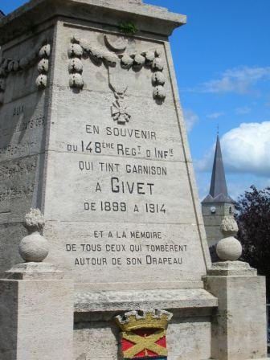
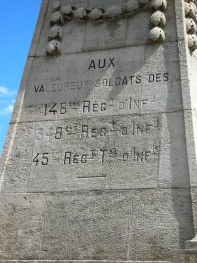

# Givet (24 - 31 août 1914)

Le siège de la citadelle de Charlemont est un épisode peu connu du début de la guerre. Les fortifications datent de l’époque de Vauban et dominent la vallée de la Meuse. Contre cet ensemble vétuste, les Allemands vont mettre en oeuvre leur artillerie lourde.

### Mission du fort

D’après les plans de mobilisation et de défense, Charlemont doit tenir les passages de la Meuse et servir de point d’appui de droite aux armées opérant entre Givet et Maubeuge.

### Etat du fort

La place de Givet, datant de l’époque de Vauban, était destiné à interdire la voie Namur - Mézières. En 1914, l’ensemble comprend la citadelle et le fort de Condé situé à 300 mètres. Face au sud, il domine la Meuse par une falaise impressionnante, mais est assez vulnérable, pouvant être écrasé par des tirs d’artillerie lourde. Le plateau est étroit et les superstructures dépassent largement le niveau du sol.

### Garnison

Le seul officier d’active est le lieutenant-colonel du Génie Pailla et l’ensemble de la garnison est composé de territoriaux (2e et 3e bataillons du 45e R.I.T.). L’artillerie se compose de 42 canons.

### Premières opérations

Au début du mois d’août, il ne semble pas que la garnison ait opéré en liaison avec le 148e R.I., puis du 348e R.I., chargés d’assurer la couverture de la région de Givet (voir combat de Dinant).

Une compagnie du 45e R.I.T. est détachée du fort avec pour mission de défendre le pont de Givet et le tunnel de chemin de fer (au pied de la falaise de Charlemont).

### 11 août

Le fort est mis à la disposition du commandant de la Ve armée qui le place sous le commandement du 1e C.A. (Franchet d’Esperey).

### 15 août

Franchet d’Esperey se rend à Charlemont.

### 19 août

L’artillerie du fort ouvre le feu sur quelques éléments ennemis.

### 24 août

Après l’échec de la bataille de Charleroi, la droite de la Ve armée (1e C.A. et 51e D.R.) s’éloigne vers le sud ouest, après avoir fait sauter le pont de Givet. Charlemont est laissé à ses seules forces.

### 25 - 27 août

L’artillerie du fort tire par intermittence et le 45e R.I.T. exécute des reconnaissances. Le premier contact avec l’ennemi est pris le 27 seulement : des cavaliers apparaissent et sont repoussés par le feu des mitrailleuses.

### 28 août

Le gouverneur envoie une reconnaissance à Foische (1500 m à l’ouest) qui trouve le village occupé, et une autre reconnaissance à Agimont (3,5 km au nord-ouest), qui ne rencontre aucune troupe allemande mais apprend  par les habitants que de l’artillerie de siège s’ installe dans la région à plus de 7 km de Charlemont, hors de portée de l’artillerie du fort.

### 29 août

L’investissement se resserre. Une demi compagnie est envoyée en reconnaissance à 2 km au nord et se heurte à des Allemands creusant des tranchées.

_Infanterie allemande devant Givet_
_Collection privée_

A 13h, les Allemands commencent à bombarder le fort avec de l’artillerie lourde. Dès les premiers coups, une poudrière saute avec un bruit formidable et une casemate saute en ensevelissant  27 hommes. Le bombardement dure une partie de la nuit.

_Siège de Givet_
_Collection privée_

### 30 août

Le bombardement continue avec violence. Les dégâts matériels sont considérables et l’artillerie du fort ne peut riposter : ses pièces sont endommagées et les batteries allemandes sont hors de portée. L’infanterie allemande se rapproche du front nord avec prudence sans passer à l’attaque. Dans la soirée, un colonel allemand vient sommer la place de se rendre. Le gouverneur, pour gagner du temps, donne une réponse dilatoire.

### 31 août

Le bombardement reprend à  5h avec une violence extrême. Beaucoup de pièces d’artillerie, les casemates, les citernes et l’hôpital de siège sont démolis. Il y a environ 200 tués et blessés. Les gaz qui se dégagent des obus provoquent des cas d’asphyxie et il devient impossible de tenir.
A 17h, la capitulation est signée. Le drapeau du 45e R.I.T. est brûlé. Munitions et approvisionnement sont détruits, mais imparfaitement.

_Assaut de Givet_
_Collection privée_

### Conclusion

Le fort de Charlemont a rempli sa mission en gênant le passage des troupes allemandes  dans la période du 23 au 25 août et a retenu pendant six jours la 24e division de réserve qui n’a pu faire son apparition sur le champ de bataille de la Marne que le 7 septembre au soir, à la suite de marches forcées. Toutefois, la garnison a été sacrifiée en devant défendre une citadelle vétuste datant de l’époque de Vauban.

### Souvenirs du siège

_Givet - vue du fort de Charlemont_
_Photo de l’auteur_

_Givet - Monument du 148e R.I._
_Photo de l’auteur_

_Givet - monument du 148e R.I. mentionnant le 348e R.I. et le 45e R.I.T._
_Photo de l’auteur_