# Combat de Halen (12 août 1914)

Le combat de Halen (anciennement Haelen) voit l’échec du C.C. von der Marwitz contre la D.C. belge. Pour emporter rapidement la décision, les cavaliers allemands chargent contre les guides et lanciers belges qui ont mis pied à terre. Les régiments allemands sont décimés par le feu et ne renouvelleront plus ce genre de tentative. La leçon de ce combat est que les cavaliers sont impuissants à lutter contre l’infanterie retranchée. Désormais, ils se limiteront à des missions de reconnaissance.

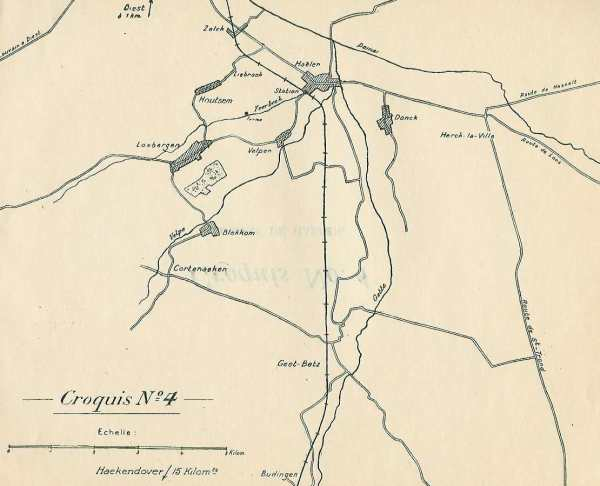
_Halen et environs_
_L’action de l’armée belge_

### Situation aux 10 et 11 août

La D.C. belge avait passé les journées du 10 et 11 août en garde le long de la Gette, tenant les passages de Dries, Budingen, Geet-Betz et Zelk, dont elle avait fait sauter ou barricader les ponts. Le Lieutenant général de Witte, commandant du C.C., est bien renseigné sur les mouvements de la D.C. allemande. L’orientation de la masse de cavalerie laisse pressentir une attaque soit vers Halen, soit vers Diest.

Les ordres du Haut Commandement sont de couvrir le flanc gauche de l’armée.

Dans la matinée du 11 août, une grosse masse de cavalerie est signalée à l’ouest de Orsmael-Gussenhoven. Un autre groupe est signalé comme se dirigeant de Herck-de-Stad vers Halen.

A 18h, le G.Q.G. expédie à la D.C. l’instruction suivante :

"Il y a lieu de supposer qu’un mouvement de cavalerie allemande s’effectue de Saint-Trond et environs vers Hasselt pour se porter ensuite vers le nord de Diest.
La D.C. fera reconnaître dans les directions de Herck-Saint-Lambert, Hasselt, Zonhoven, Beringen et Tessenderlo.
La mission qu’a la D.C. de couvrir le flanc gauche de l’armée reste entière.
La direction de Diest peut devenir la plus dangereuse."

**[Lien vers croquis des attaques allemandes](../img/combat_halen.jpg)**

### Les forces en présence

**1e C.C., general der Kavallerie von der Marwitz**

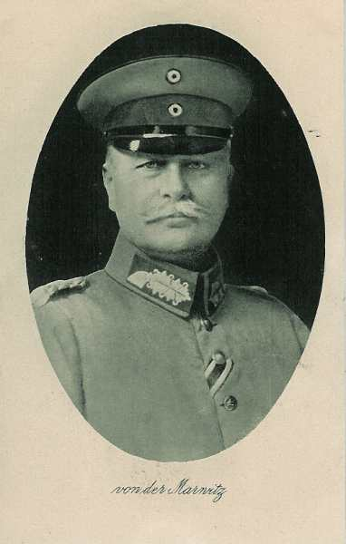
_Général von der Marwitz (2e C.C.)_
_Collection privée_

2. D.C. : général von Krane

| Unité | Commandant | Régiments |
| --- | --- | --- |
| 5.  Kavallerie-Brigade |  | Dragoner-Regt.  Nr 2 (Berlin)Ulanen-Regt. Nr 3 (Potsdam) |
| 8. Kavallerie-Brigade |  | Kürassier-Regt. Nr 7 (Halberstadt)Husaren-Regt. Nr 12 (Torgau) |
| Leib-Husaren-Brigade |  | 1. Leib-Husaren-Regt. Nr 1 (Danzig)2. Leib-Husaren-Regt. Nr 2 (Danzig) |
|  |  | Bataillon du Feldartillerie-Regt. Nr 35 (Eylau)MG. Abtg. Nr. 4 (Thorn) |

4. D.C. : général von Garnier

| Unité | Commandant | Régiments |
| --- | --- | --- |
| 3. Kavallerie-Brigade |  | Kürassier-Regt. Nr 2 (Pasewalk)Ulanen-Regt. Nr 9 (Demmin) |
| 17. Kavallerie-Brigade |  | Dragoner-Regt Nr 17 (Ludwigslust)Dragoner-Regt Nr 18 (Parchim) |
| 18. Kavallerie-Brigade |  | Husaren-Regt. Nr 15 (Wandsbek)Husaren-Regt. Nr 16 (Schleswig) |
|  |  | Bataillon du Feldartillerie-Regt. Nr 3 (Brandenburg)MG. Abtg. Nr. 2 (Trier) |

9. D.C. : général von Schmettow

| Unité | Commandant | Régiments |
| --- | --- | --- |
| 13. Kavallerie-Brigade |  | Kürassier-Regt. Nr 4 (Münster)Husaren-Regt. Nr 8 (Paderborn) |
| 14. Kavallerie-Brigade |  | Husaren-Regt Nr 11 (Crefeld)Ulanen-Regt Nr 5 (Düsseldorf) |
| 19. Kavallerie-Brigade |  | Dragoner-Regt. Nr 19 (Oldenburg)Ulanen-Regt. Nr 13 (Hannover) |
|  |  | Bataillon du Feldartillerie-Regt. Nr 10 (Hannover)MG. Abtg. Nr. 7 (Köln) |

La cavalerie allemande cherche, sous les ordres du général von der Marwitz, à forcer le passage de la Gette. Six régiments appartenant aux 2e et 4e D.C. soutenus par les 7e et 9e bataillons de chasseurs et par trois batteries se dirigent vers les positions belges. Cela représente 4.000 cavaliers, 2.000 fantassins et 18 canons. Les belges n’ont à opposer que 2.400 cavaliers (4 régiments de cavalerie), 500 carabiniers cyclistes et 12 canons sur un front de 20 km.

### Dispositif belge à 7 h du matin

**La division de cavalerie (Bruxelles, général-major de Witte)**

| Unité | Commandant | Régiments |
| --- | --- | --- |
| 1e brigade | de Monge | 1e et 2e régiments des Guides (Bruxelles)deux sections de fusils mitrailleurs |
| 2e brigade | Proost | 4e régiment de lanciers (Gent)5e régiment de lanciers (Mechelen)4e régiment de chasseurs à cheval (Leuven)bataillon de carabiniers cyclistesartillerie à cheval |

Pour mener à bien la mission, il convient de réunir vers Loksbergen (sud-ouest de Halen) une masse capable de s’opposer à l’ennemi qui tenterait de déboucher de la Gette par les chaussées de Halen ou de Diest.

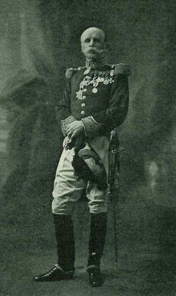
_Général de Witte (D.C.)_
_La Belgique et la guerre_

Le général de Witte décide que

- Dries sera gardé par un peloton cycliste.

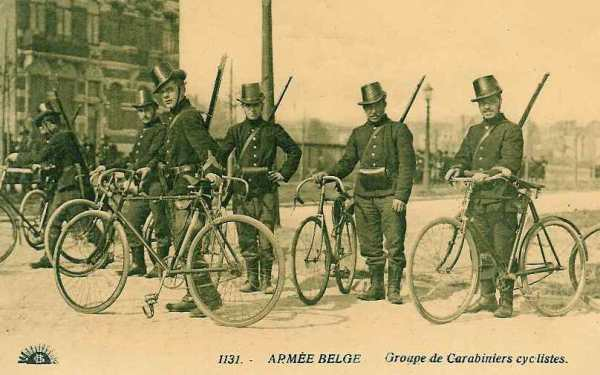
_Carabiniers cyclistes_
_Collection privée_

- Budingen et Geet-Betz chacun par un escadron, Halen par une compagnie cycliste et la section de mitrailleuses des carabiniers cyclistes.

- Zelk par un escadron (4e du 4e lanciers) et 2 pelotons cyclistes.

- En arrière, dissimulés dans les bois de Loksbergen, se tiennent en réserve onze escadrons, une compagnie cycliste et deux sections de mitrailleurs de cavalerie.

- Les trois batteries à cheval se tiennent se tiennent sur les croupes au nord de Loksbergen, sur les croupes voisines du Rynrodeberg.

Tous les ponts de la Gette sont détruits, à l’exception de ceux de Halen et de Zelk, dont la destruction est préparée et ceux de Dries, simplement barricadés.

Sur base de rapports d’officiers de l’Etat-Major qui ont reconnu le terrain et de renseignements multiples annonçant l’approche des Allemands par Alken et par Hasselt, le général de Witte assoit définitivement son plan d’action.

- Batteries aux mamelons 69 et 55, renforcées par un escadron pied à terre et deux sections de mitrailleuses.

- Une brigade de lanciers déployée pour combattre par le feu aux lisières est de Loksbergen.

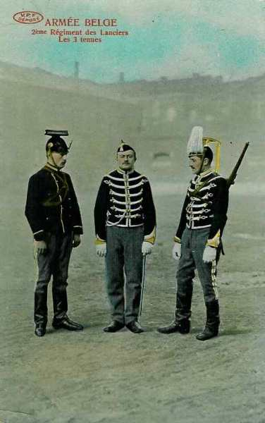
_Lancier belge_
_Collection privée_

- Brigade de guides à cheval prête à agir par le choc, à droite des lanciers.
  Première compagnie cycliste en réserve à Loksbergen.

### Dispositif allemand

L’attaque va partir de Herk-de-Stad. C’est la 4e division du C.C. von der Marwitz, sous le commandement du général von Garnier, qui est chargée d’emporter Halen. Von Garnier dispose ses troupes comme suit :

- Deux bataillons de chasseurs à droite de la route vers Halen
  3e brigade (2e cuirassiers et 3e uhlans) à gauche de la route
  L’artillerie à la sortie ouest de Herk-de-Stad.

**5h :**

La 4e D.C. allemande, sous les ordres du général von Garnier, part de Looz avec ordre de marcher sur Halen par Alken et Stevoort.

**7h :**

L’avant-garde de la 4e D.C. allemande atteint Stevoort.

L’instruction suivante est donnée par le général de Witte à l’artillerie à cheval :

"La cavalerie allemande a dû passer la nuit à Hasselt. Il est probable qu’elle marchera ce matin sur Diest ou Halen. Je porte le gros de la division sur Loksbergen ; Diest, Zelk et Halen sont occupés. Dirigez votre groupe vers la hauteur 82 (1.600 m à l’ouest de Loksbergen) et cherchez-y des positions d’où l’on pourrait battre les débouchés de Diest et de Halen."

**7h45 :**

Le général de Witte donne comme instruction au commandant de la 1e brigade :

"Si l’ennemi débouche en force de Halen, je le contiendra par la 2e brigade qui garnira de tirailleurs les lisières est de Loksbergen jusques et y compris la lisière du bois de sapins à 800 m sud-est du clocher.
Je réserve à votre brigade la mission d’agir à cheval dans le flanc gauche de la cavalerie ennemie."

Cette dernière instruction sera annulée par la suite et la brigade devra combattre pied à terre.

**7h50**

Le général de Witte répète les mêmes données au commandant de la 2e brigade et ajoute :
"Déplacez votre brigade de manière à la disposer derrière les lisières à occuper éventuellement. L’extrême nord du front pourrait être vers la croisée des chemins 800 m au nord du clocher de Loksbergen."

Des renseignements parviennent d’une reconnaissance de cavalerie et de télégrammes provenant du percepteur des télégraphes de Hasselt.
De l’ensemble de ces renseignements, il résulte que les Allemands venant de Hasselt et de Alken se dirigent en force vers Herck-de-Stad. Les forces dénombrées se montent à 2.500 cavaliers, 2.500 fantassins avec artillerie.

Le G.Q.G. décide qu’une brigade mixte de la première division d’armée, réunie à Sint-Margriete-Hautem, se portera immédiatement sur Kortenaken pour venir en aide à la division de cavalerie.

**8h :**

- La position de Halen est défendue par la 3e compagnie cycliste soutenue par sa section de mitrailleurs.
  1e peloton au sud du pont.
  3e peloton et mitrailleurs au nord du pont.
  2e peloton en réserve à la station.

**8h10 :**

le général von Garnier reçoit l’ordre suivant :
"La 4e D.C. ouvre le défilé près Haelen. La 2e D.C. avance avec la tête jusqu’à la coupure de la Herck à l’est d’Herck-de-Stad et couvre en direction de Lummen."

Un peloton du 2e cuirassiers se présente au pont de Halen. Il est fusillé à bout portant par les carabiniers de la 3e compagnie cycliste. Sept cavaliers sont mis hors de combat. Un peu plus tard, une ligne de tirailleurs allemands se glisse de haie en haie vers le village, de part et d’autre de la route vers Herk-de-Stad. Une fusillade s’ouvre entre eux et les carabiniers cyclistes.

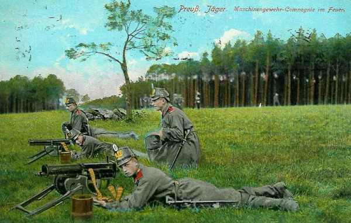
_Chasseurs prussiens_
_Collection privée_

Les forces assaillantes sont :

- Le 9e bataillon de chasseurs.
  La 3e brigade de cavalerie.
  Le groupe d’artillerie à cheval n° 3, qui prend position à l’ouest de Herck-de-Stad.

Le 9e bataillon attaque par la route de Halen et au nord de celle-ci.
Les cavaliers du 9e uhlans et du 2e cuirassiers attaquent pied à terre au sud de la route.

**8h15 :**

Le G.Q.G. expédie l’ordre suivant au commandant de la 1e division :

"I -Une colonne de cavalerie ennemis d’environ 2.500 cavaliers, accompagnée de 12 mitrailleuses a traversé Hasselt à 7h15, se dirigeant sur Curange.
A 6h45, une colonne d’infanterie (2.500 hommes) et d’artillerie (12 pièces) se porte de Alken sur Stevoort.
Ces mouvements font craindre une attaque en force sur Halen et Diest.

II - La brigade mixte de la 1e D.A. qui se trouve à Hautem-Sainte-Marguerite se portera immédiatement sur Cortenaeken et se mettra à la disposition du commandant de la D.C.
Le commandant de cette brigade mixte se mettra immédiatement en relations avec le commandant de la D.C. qui doit se trouver à Loxbergen.

III - Prenez toutes les dispositions que vous jugerez nécessaires mar suite du départ sur Cortenaeken de la brigade mixte de Hautem-Sainte-Marguerite."

La brigade mixte comporte :

- Les 4e et 24e régiments de ligne, armés uniquement du fusil.
  Deux compagnies de mitrailleuses à trois sections de deux pièces, l’une armée de mitrailleuses Maxim, l’autre de mitrailleuses Hotchkiss. Les mitrailleuses sont tirées par des chiens.

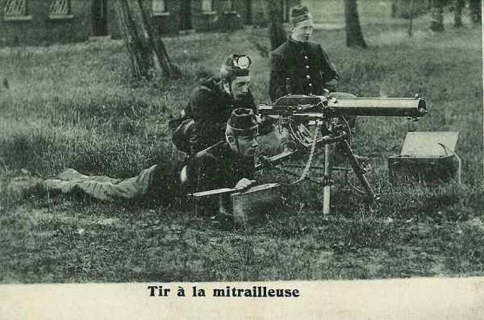
_Mitrailleuse belge_
_Collection privée_

- Un groupe d’artillerie comprenant les 7e, 8e et 9e batteries chacune de quatre canons de 75.
Le tout se monte à 2.800 hommes.

Le chemin à parcourir est le suivant :
Sint-Margriete-Hautem - Bunsbeek - Kersbeek-Miskom - Vroen - Kortenaken.

**8h30 :**

Entre 8h30 et 10h30, la 3e compagnie de carabiniers cyclistes tient tête, mais les assaillants parviennent à ramper jusqu’à une centaine de mètres de la Gette à l’abri de nombreuses haies qui gênent les défenseurs.

**9h30 :**

Un officier du Haut Commandement apporte au général de Witte l’avis que la 4e brigade mixte est en route vers Halen, en provenance de Hautem-Sainte-Marguerite. Cette brigade ne pourra toutefois pas intervenir avant 13 heures.

La 1e compagnie cycliste se porte de Loksbergen à Halen, en renfort de la 3e.

La brigade des guides est invitée à prolonger le front des lanciers jusqu’à la Velpe.

**10h :**

Vers 10h l’artillerie allemande ouvre un feu meurtrier sur le pont de Halen et rend intenables les lisières de la localité. Profitant de ce puissant appui, les tirailleurs allemands poussent de l’avant et franchissent la Gette au sud de la route sur un ponceau.

Les carabiniers font sauter le pont sur la Gette. Une partie du tablier s’effondre. L’artillerie allemande ouvre le feu sur les premières maisons du village et sur la barricade élevée en travers de la chaussée.

**10h30 :**

Comme l’adversaire commence à déborder la droite, les défenseurs se replient sur la première compagnie déployée le long de la voie ferrée. Les mitrailleuses prennent position au passage à niveau. Les cinq pelotons cyclites reçoivent l’ordre de résister à outrance pour permettre l’arrivée de la 4e brigade mixte.

Les chasseurs allemands, se rendant compte du départ des cyclistes, réparent le pont et pénètrent dans Halen. Au cours de cette accalmie, la 17e brigade de cavalerie est poussée jusqu’à Waterkant, tandis que la 3e brigade se reforme aux environs de Landwyck, où les cavaliers qui viennent de combattre pied à terre retrouvent leurs chevaux.

La 4e brigade mixte se met en marche de Sint-Margriete-Hautem vers Loksbergen (distance : 18 km).

**11h30**

Une colonne du 17e dragons traverse Halen au galop par la route qui aboutit au passage à niveau. Elle est arrêtée net par les feux. La 1e batterie à cheval belge ouvre le feu, tire vers le pont de la Gette, et inflige de lourdes pertes aux troupes allemandes.

L’infiltration du 9e bataillon de chasseurs allemands vers la ligne de chemin de fer se poursuit. Les cyclistes, menacés d’être tournés, doivent se replier et ils se déploient à 300 mères à l’ouest du chemin creux de Velpen - Liebroek, la section de mitrailleuses sur la route de Loksbergen à Halen. A la hâte, ils se protègent d’une petite levée de terre. Les Allemands rétablissent le pont de la Gette et lancent une passerelle à Donck. Les chasseurs garnissent la ligne de chemin de fer et engagent une fusillade avec les carabiniers.

A quelques centaines de mètres au nord, un escadron et deux pelotons cyclistes sont barricadés dans Zelk et trois escadrons du 4e lanciers occupent la ferme d’Yzerebeek, prolongés vers le sud par trois escadrons du 5e lanciers et deux escadrons du 2e guides.

**12h :**

Quatre escadrons de lanciers (deux du 4e lanciers et deux du 5e lanciers) sont pied à terre près de la ferme d’Yzerebeek, à 1.500 m au sud-ouest de Halen. Trois escadrons du 1e guides sont à la lisière du bois de Blekkom, au sud-ouest de Halen.

Les flancs du dispositif sont gardés au village de Zelk entre Diest et Halen par un escadron du 4e lanciers et deux pelotons cyclistes. A Velpen (sud de Halen), un escadron du 2e guides a pris position.

Une attaque de cavalerie débouche de Halen. von der Marwitz a donné l’ordre d’enfoncer la ligne des tirailleurs et d’enlever la 1e batterie à cheval.

**[Lien vers croquis des charges de cavalerie allemandes](../img/halen_charges_cavalerie.jpg)**

Les dragons du Mecklembourg (17e et 18e) chargent, se suivant, en colonne par quatre et s’élançant au galop.

- **Le 17e dragons** par la chaussée de Diest. La garnison du poste de Zelk (IV/4e lanciers et 2e compagnie cycliste)les reçoit par un feu d’enfer. L’escadron de tête, quasiment anéanti, s’est effondré devant la barricade et les cavaliers culbutés forment un rempart impossible à franchir par le 3e escadron qui, ne pouvant pas déboîter à cause des haies bordant la route, fait demi-tour et retourne vers Halen par ordre du commandant du régiment.

Du deuxième escadron, seuls quelques hommes parviennent à s’échapper. Le 1e escadron du 17e dragons a reçu ordre d’attaquer par le sud de la route de Diest.

- **Le 18e dragons** charge du passage à niveau vers la hauteur 55. Les 1e et 4e escadrons sont sortis les premiers de Halen et se lancent à l’attaque de part et d’autre de l’Yzerebeek tandis que le 3e ne suivra qu’à une certaine distance.

Le 1e escadron longe le nord du ruisseau ; mais lorsqu’il arrive à 300 m environ de la ferme, le 4e peloton du II/4e lanciers déclenche un tir précis qui fauche les premiers pelotons allemands. Les suivants, s’empêtrant dans les cadavres amoncelés au bord de la ferme, tourbillonnent et s’enfuient dans toutes les directions.

Quelque temps après, le 3e escadron qui suit tout d’abord le même itinéraire que le 4e, déboîte vers la droite pour éviter l’amoncellement des cadavres laissés par la charge précédente. Il s’engage dans le chemin d’exploitation qui va vers la ferme de l’Yzerebeek. L’élan est si impétueux qu’ils réussissent à aborder à toute allure les premiers défenseurs. C’est alors un véritable corps à corps au cours duquel tous les chevaux sont bientôt abattus ainsi que la plus grande partie des cavaliers et des officiers. Les lanciers belges ne comptent que quatre blessés dont un maréchal des logis chef atteint d’un coup de lance.

Le 1e escadron du 18e dragons charge plus au sud. Les officiers belges ordonnent à leurs hommes de rester couchés. Dès lors, la charge les dépasse sans encombre mais les cavaliers allemands sont pris ensuite entre le feu conjugué des défenseurs de la ferme d’Yzerebeek et les tirailleurs du III/4e lanciers. La charge tourne court et
le premier escadron est mis hors de combat.

L’attaque de la 17e brigade a échoué. Toutefois, sous le couvert des charges, le groupe d’artillerie de la 4e D.C. est parvenu à sortir de Halen au galop et à installer six pièces au nord de la station de Halen. De cet emplacement, les pièces vont prendre sous leur feu la 1e batterie à cheval belge.

Les Belges renforcent leur ligne de défense en faisant appel aux réserves : le II/5e lanciers doit se porter dans la ligne de feu entre le III/4e lanciers et le I/4e lanciers.

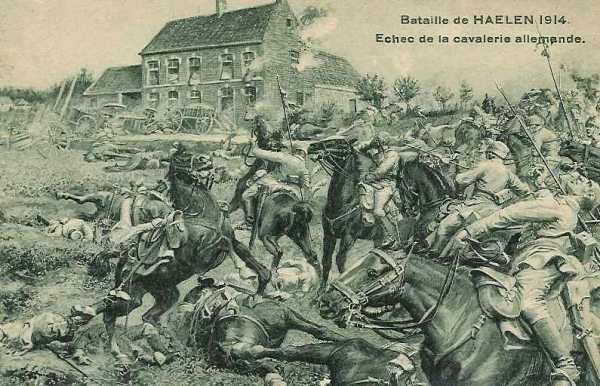
_Combat de Halen_
_Collection privée_

**13h :**

Le feu de mousqueterie reprend avec une intensité croissante. Pour renforcer les chasseurs, von der Marwitz a fait déployer pied-à-terre le 1e hussard (Hussards de la mort), établir l’artillerie en avant de Halen et poster dans Velpen (sud-ouest de Halen) le détachement des mitrailleuses.

Les Allemands attaquent entre Velpen et Liebroek. Leur artillerie est à présent sur la rive gauche de la Gette.

Devant cette attaque très supérieure, les carabiniers se retirent sur les lignes des lanciers et les Allemands finissent par enlever Velpen et Liebroek.

**14h :**

- La 3e brigade sort de Donck par Velpen (Cuirassiers de la Reine, 9e uhlans). Elle peut utiliser le pont provisoirement restauré sur la Gette.

Le **2e cuirassiers** passe le premier. Ses 3e et 4e escadrons débouchent des lisières nord-est de Velpen mais ne parviennent pas à franchir le chemin creux Velpen - Liebroek sous le feu violent des cyclistes de la 3e compagnie et des cavaliers des 4e,5e lanciers et 1e guides.

Les premiers escadrons du **9e uhlans** arrivent par la route Velpen - Halen. Les 1e et 2e escadrons sortent du couvert de Velpen et se ruent au galop vers la ferme de l’Yzerebeek. Ils sont soudain soumis à des feux d’écharpe des tirailleurs du 5e lanciers et du 2e guides et ne peuvent continuer leur progression. Ils refluent vers le chemin creux où ils trouvent un abri momentané.

Le commandant du régiment les rallie et le 9e uhlans va charger tout entier, appuyé à sa gauche par les débris du 2e cuirassiers. Cette dernière attaque échoue aux abords de la ferme, brisée par le feu des lanciers et le tir de la 1e batterie à cheval qui s’est déplacée.

La dernière charge allemande (la **huitième !**) vient d’être refoulée. Plus aucun régiment allemand n’osera encore se risquer à cheval dans ce terrain où viennent de succomber deux brigades entières.

Les pertes belges sont minimes par rapport à celles des Allemands

Les Allemands poussent leurs mitrailleuses à 400 m au nord et au sud d’Yzerebeek. Le 4e lanciers ne cède pas.

La pointe d’avant-garde de la 4e brigade mixte atteint la lisière est du bois de Loksbergen. Les éléments d’infanterie sont immédiatement engagés pour permettre de relever les cavaliers.

I/4e et III/4e ont pour mission de se porter vers le château de Blekkom par Velpen à l’attaque de Halen.
I/24e a l’ordre de réoccuper la ferme de l’Yzerebeek. Cette attaque sera appuyée par le 9e batterie d’artillerie établie à la lisière est du bois de Loksbergen.

La 4e compagnie se dirige sur Velpen. Elle aperçoit des guides tirant sur les deux premiers escadrons de uhlans.

**14h15 :**

Les 2 et 4/I arrivent à l’ouest du carrefour de Velpen. Brusquement, un feu nourri d’infanterie, surtout de mitrailleuses provenant des maisons de Velpen, s’abat sur les deux compagnies qui sont clouées au sol. Ce tir est effectué par le 2e détachement des mitrailleuses de la Garde, attaché à la 3e brigade de cavalerie qui avait pris possession du hameau lors des dernières charges. Un peloton essaie de contourner Velpen par le sud. Deux sections de mitrailleuses belges arrivent sur le terrain et installent les pièces à 250 m de Velpen.

**14h30 :**

La 4e brigade mixte (voir plus haut) débouche sur le champ de bataille. Elle représente une force de quatre bataillons (2.800 fusils), trois batteries et une compagnie de mitrailleuses. Elle avait marché sans arrêt malgré une chaleur accablante.

**[Lien vers croquis de l’intervention de la 4e brigade mixte](../img/combat_halen_brig_mixte.jpg)**

La brigade doit se poster dans la vallée de la Velpe, qui se prête à une offensive. Un des bataillons viendra au secours de la position d’ Yzerebeek. L’artillerie prend position pour contrebattre celle des Allemands près de la borne 59.

Vers 14h30, l’avant-garde d’infanterie belge débouche par le château de Blekkom sur Velpen. En arrivant sur la lisière ouest de cette dernière localité, elle subit un feu violent de mitrailleuses. Il est impossible de progresser et les mitrailleuses sont parfaitement invisibles.

Le bataillon qui avait relevé la brigade de lanciers ne parvient pas à s’approcher de l’Yzerebeek.

L’artillerie est plus efficace. Elle arrose les 5e et 8e brigades allemandes lors de leur traversée de Halen. von der Marwitz rappelle ses régiments sur la rive droite de la Gette. Ce demi tour jette toute la cavalerie dans la confusion.

**15h :**

Le général von der Marwitz se rend compte qu’il est impossible de briser la résistance belge par des attaques à cheval et monte une attaque par le fusil et le canon. Y prendront part :

- Le 9e bataillon de chasseurs.
  Le 4e bataillon de chasseurs.
  La brigade de Leib-Husaren (2e D.C.).
  L’artillerie des 4e et 2e D.C.

Les survivants des cinq pelotons cyclistes, très inférieurs en nombre, sont contraints de se retirer définitivement vers la ligne des lanciers. Le bourdonnement des balles et le crépitement des mitrailleuses deviennent particulièrement intenses vers la ferme d’Yzerebeek.

**15h15**

Une ligne très dense de tirailleurs allemands s’avance vers les I/4e et 5e lanciers tandis que les mitrailleuses  dirigent leur tir vers les II et III/4e lanciers.

A l’aile droite, les cavaliers belges arrêtent la progression allemande mais à l’aile gauche, sous le tir de plus en plus meurtrier des mitrailleuses allemandes, dont certaines commencent à prendre d’enfilade les défenseurs de la ferme d’Yzerebeek, la ligne ne va pas tarder à céder.
Le 3e peloton du II/4e lanciers et le III/4e lanciers battent en retraite vers un petit bois à 400 m de la ferme

**15h40 :**

L’artillerie allemande appuie les chasseurs. Une pluie d’obus s’abat sur l’Yzerebeek. Les mitrailleuses se rapprochent à 150 m. Les défenseurs doivent abandonner la ferme. La ligne du 5e lanciers est canonnée et la 1e batterie à cheval est prise d’écharpe.

**16h :**

Le restant de la 2e brigade va peu à peu quitter la ligne de feu à son tour.
C’est d’abord le I/4e lanciers qui, soumis depuis une vingtaine de minutes à un violent bombardement à schrapnells et obus brisants, se retire vers l’ouest.
En même temps, le III/5e lanciers se retire. Il vient d’être dépassé par des tirailleurs de la 4e brigade mixte, et fait place à ceux-ci, dans le fossé le long de la route.
Le II/5e lanciers a également été informé qu’il peut se retirer à l’arrivée de l’infanterie. Sa retraite s’effectue sous un feu intense de mitrailleuses, vers Loksbergen.

Le I/5e lanciers et la 1e batterie à cheval quittent leurs positions, sous la menace des mitrailleuses allemandes qui s’étaient avancées vers Liebroeck. Les pièces et les caissons sont tirés à bras et la batterie se reconstitue 300 m à l’ouest du mamelon 55. Le I/5e lanciers rejoint les chevaux pour se diriger ensuite vers Houtsum puis au nord de Loksbergen.

**16h30**

le IV/5e lanciers quitte sa position, devenue intenable. Les fermes qu’il occupait viennent en effet de prendre feu. Sa marche l’amènera dans la soirée à Cappellen, où il bivouaquera.

Deux pelotons belges sont parvenus à s’infiltrer près du pont de Velpen mais ils sont soumis au feu de l’infanterie et de l’artillerie. L’attaque enveloppante de Velpen ne donne aucun résultat, l’attaque frontale est bloquée. Devant cette situation, le commandant du I/4 doit ordonner la retraite. Celle-ci se fait en rampant vers le château de Blekkom et les bois de Loksbergen.

Le III/24e se rassemble et s’engage à l’attaque de Velpen. La 3e compagnie s’engage la première, la 2e suit. Les troupes atteignent le groupe de maisons à 300 m au sud du pont sur la Velpe, mais le 9e bataillon de chasseurs allemand reçoit l’ordre d’attaquer la ligne Houtsum - Velpen en collaboration avec la brigade de Leib-Husaren pied à terre. Les unités belges essuient des feux nourris de front et d’écharpe et sont obligées de battre en retraite .

**17h :**

Le groupe de batteries à cheval belges repère l’emplacement des batteries allemandes à l’ouest de Halen et les écrase d’un feu violent et elles doivent se retirer précipitamment.

Sous couvert de ces batteries, une nouvelle attaque belge a lieu contre l’Yzerebeek. Les tirailleurs allemands se retirent sur Halen.

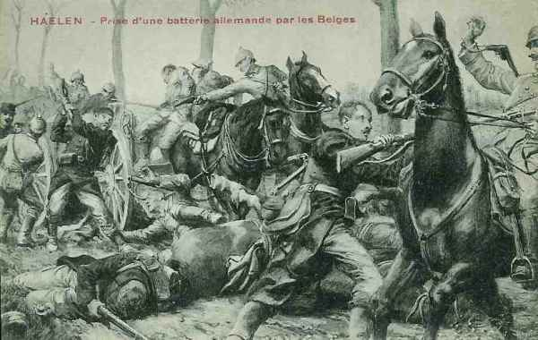
_Combat de Halen_
_Collection privée_

**18h :**

Vers 18h, les Allemands cèdent et se retirent sur Hasselt et Alken.

Les Belges restent vainqueurs sur leurs positions.

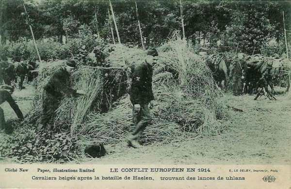
_Cavaliers belges trouvant des lances_
_Collection privée_

Le combat de Halen sonne le glas des charges de cavalerie et démontre l’impossibilité pour cette arme de lutter contre le feu de l’infanterie. Désormais, la cavalerie ne remplira plus que des missions de reconnaissance, de flanc garde ou éventuellement de poursuite d’un ennemi en retraite

### Souvenirs du combat

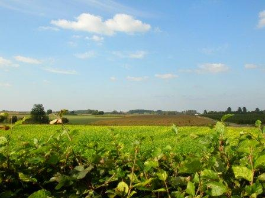
_Vue du champ de bataille_
_Photo de l’auteur_

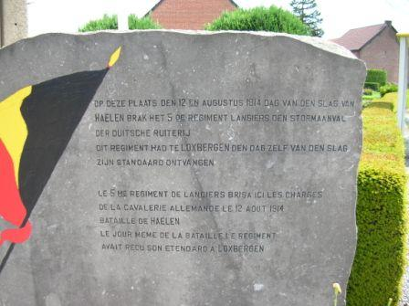
_Monument du 5e Lanciers_
_Photo de l’auteur_

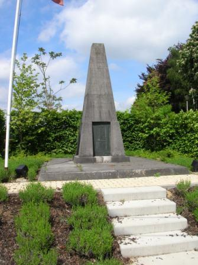
_Monument commémoratif du combat_
_Photo de l’auteur_

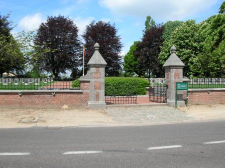
_Entrée du cimetière belge_
_Photo de l’auteur_

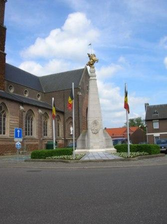
_Monument de la cavalerie_
_Photo de l’auteur_

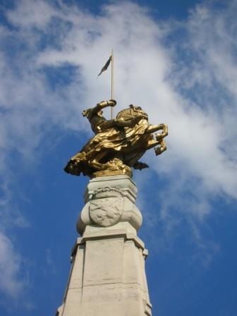
_Monument de la cavalerie (détail)_
_Photo de l’auteur_

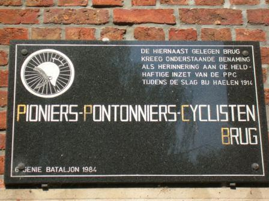
_Stèle des pontonniers cyclistes_
_Photo de l’auteur_

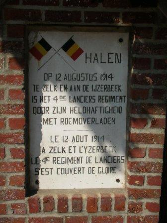
_Stèle du 4e lanciers_
_Photo de l’auteur_