# Combat d’Ethe (22 août 1914)

Le combat d’Ethe se déroule dans le cadre de la bataille de Longwy - Neufchâteau. Conformément aux ordres de Joffre, les troupes de la IVe armée française traversent la frontière belge pour pénétrer dans les Ardennes. Au débouché d’Ethe, les troupes françaises se heurtent aux Allemands, bien équipés d’artillerie.

### Cadre du combat

Le combat d’Ethe est un épisode de la bataille de Longwy - Neufchâteau, mettant aux prises une partie du 4e C.A. : la 7e division (général de Trentinian) et plus particulièrement la 14e brigade (général Félineau), avec le 5e C.A. allemand (général von Stranz).

### L’ordre d’offensive

Des reconnaissances signalent un glissement d’est en ouest des forces allemandes devant les armées françaises. Joffre a l’impression que dans les régions de l’Ardenne et du Luxembourg, le dispositif allemand  présente un point de moindre résistance. Ordre est donc donné à la IVe armée d’acculer à la Meuse les forces adverses qui se trouvent dans cette région et pour cela d’attaquer en direction générale de Neufchâteau (ordre particulier n° 16 à la IVe armée du 21 août).

La IIIe armée a pour mission de couvrir le flanc droit de la IVe contre les forces qui pourraient se trouver dans la région du Luxembourg (ordre particuliers n° 17 aux IIIe et IVe armées, du 21 août).

### Les forces en présence

**Armée française**

IIIe armée (général Ruffey)

_Général Ruffey (IIIe armée)_

4e C.A. (général Boëlle)

_Général Boëlle (4e C.A.)_
_La guerre du droit_

7e division (général de Trentinian)

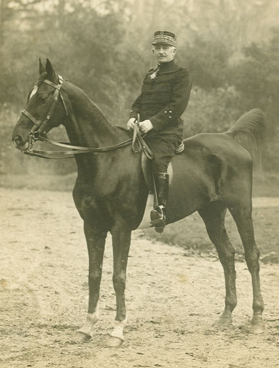
_Général de Trentinian (7e division)_
_Aimablement communiqué par Mr J. de Trentinian_

13e brigade (colonel Lacotte)

| Unité | Casernement | Commandant | Bataillons |
| --- | --- | --- | --- |
| 101e R.I. | Dreux, Saint-Cloud | Farret | 1e bataillon (Lebaud)2e bataillon (Laplace)3e bataillon (Tisserand) |
| 102e R.I | Chartres, Paris | Valentin | 1e bataillon (Wilbien)2e bataillon (Signorino)3e bataillon (Le Merdy) |
| 14e régiment de hussards | Alençon | de Hautecloque | Un escadron |
| 26e R.A.C. | Le Mans | Bertrand | 1e groupe (Durandin)2e groupe (Appert)3e groupe (Savoureau) |

14e brigade (général Félineau)

| Unité | Casernement | Commandant | Bataillons |
| --- | --- | --- | --- |
| 103e R.I. | Alençon, Paris | Cally | 1e bataillon (Rondenay)2e bataillon (Jouvin)3e bataillon (Vicq) |
| 104e R.I. | Argentan, Paris | Drouot | 1e bataillon (Forcinal)2e bataillon (Henry)3e bataillon (Levin) |
| 14e régiment de hussards | Alençon | de Hautecloque | Un escadron |

Troupes non engagées à Ethe

| Unité | Commandant | Régiments |
| --- | --- | --- |
| 15e brigade | Chabrol | 124e R.I.(Laval / Fropo130e R.I. (Mayenne / Laffargue)14e régiment de hussards (1 escadron) |
| 16e brigade | Desvaux | 115e R.I (Mamers / Gazan)117e R.I. (Le Mans / Jullien)14e régiment de hussards (Alençon / de Hautecloque)(1 escadron)31e R.A.C.)(Le Mans) |

.

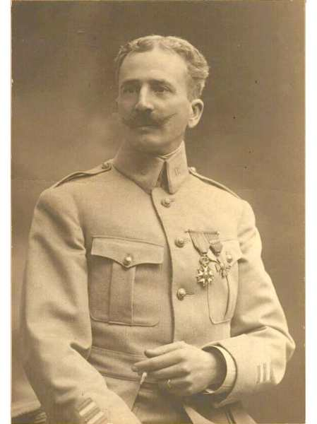
_Commandant Macker (chef d’E.M. 7e division)_
_Aimablement communiqué par Mr J. de Trentinian_

26e R.A.C. (artillerie divisionnaire)

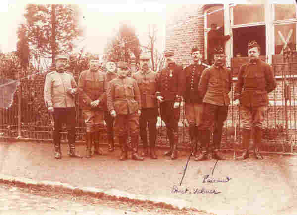
_l’ E.M. de la 7e division_
_Aimablement communiqué par Mr J. de Trentinian_

**Armée allemande**

Ve armée (kronprinz de Prusse)

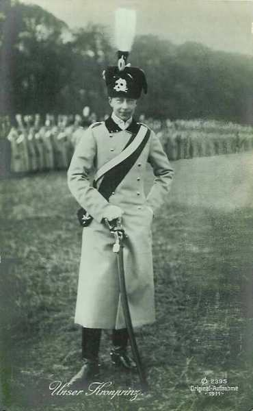
_Le kronprinz de Prusse (Ve armée)_
_Collection privée_

5e C.A. (général von Stranz)

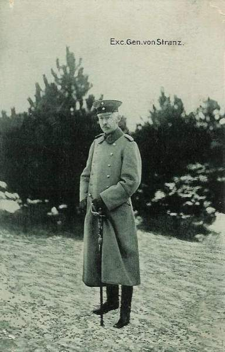
_Général von Stranz  (5e C.A.)_
_Collection privée_

9e D.I. (général von Below)

| Unité | Commandant | Régiments |
| --- | --- | --- |
| 17e brigade d’infanterie | Melms | Infanterie-Regiment Nr. 19 (Görlitz)Posensches Infanterie-Regiment Nr. 58e (Glogau / Zwenger) |
| 18e brigade  d’infanterie | Falkenheimer | Grenadier-Regiment Nr. 7 ( Liegnitz / Oscar de Prusse)Niederschlesisches Infanterie-Regiment Nr. 154e (Jauer)Ulanen-régiment Nr. 1 (Militsch-Ostrowo / von Kass) |
| 9e brigade de Feldartillerie |  | Feldartillerie-Regiment Nr. 5 (Sprottau)Feldartillerie-Regiment Nr. 41 (Glogau) |

Les troupes sont surtout constituées de montagnards des Sudètes.

10e D.I. (général von Kosch)

| Unité | Commandant | Régiments |
| --- | --- | --- |
| 19e brigade d’infanterie | Liebeskind | Grenadier-Regiment Nr. 6 (Posen)Infanterie-Regiment Nr. 46 (Posen) |
| 20e brigade d’infanterie | von der Horst | Infanterie-Regiment Nr. 47 (Posen)Niederschlesisches Infanterie-Regiment Nr. 50 (Rawitsch)Königs-Jäger zu Pferde Nr. 1 (Posen) |
| 10e brigade de Feldartillerie | Müller | Posensches Feldartillerie-Regiment Nr. 20 (Posen / Schleicher)Posensches Feldartillerie-Regiment Nr. 56 (Lissa / Lepper) |

- Les Polonais forment la presque totalité de la division, qui est appuyée en outre par plusieurs autres unités :
  5e Niederschlesisches Fussartillerie-Regiment Nr. 5 (obusiers de 150 mm)
  6e régiment de mortiers.
  6e détachement de mitrailleuses
  19e escadrille.

### Le terrain

**[Lien vers carte](../img/ethe2.jpg)**

La région de Virton fait partie de la Gaume, située à 10 km au nord de la frontière française et à 25 km à l’ouest du Grand Duché de Luxembourg. C’est un terrain très accidenté, avec des altitudes variant de 205 m à 350 m, car la région compte plusieurs vallées :  le Ton, la Vire et la Chevratte. Ethe est une petite localité installée dans la vallée du Ton, entourée de forêts.

### 20 août

**04h00 :**

La 53e brigade Wurtembergeoise (général Moser), formant la droite du 13e C.A. se met en route. Elle traverse le bois de Saint-Léger en position de combat :123e I.R. (colonel von Erpf), 124e (colonel Haas). Le brouillard est dense et le terrain particulièrement difficile : on marche à la boussole.

**05h00 :**

Les bataillons de première ligne des 123e et 124e I.R. atteignent la lisière sud des bois de Tasseinière, à 1200 m au nord-est de Bleid. L’avant-garde est accueillie par des coups de fusil. Une section française se trouve en effet dans Bleid en poste avancé, depuis la veille au soir.

**A la pointe du jour :**

Une reconnaissance conduite par le lieutenant d’Artis, du 3e dragons, a dû louvoyer au milieu de patrouilles de cavalerie allemandes opérant sur la ligne Athus - Musson - Ville-Houdlémont - Saint-Pancré - Tellancourt.

**06h00 :**

La division Kosch (10e division du 5e C.A. allemand) a traversé le bois de Vance et le 50e (colonel Diestel), avant-garde de cette division débouche des bois au nord d’Ethe. Les éclaireurs apprennent la présence des Français et certaines unités du bataillon creusent des tranchées, d’autres s’infiltrent par la vallée du Chou et par les rues transversales d’Ethe pour contourner l’obstacle.

Le lieutenant-colonel Schleicher, commandant du 20e régiment d’artillerie, installe le groupe de l’avant-garde à l’est de la route, sur le plateau 314, où il se tient prêt à agir dès que le brouillard sera dissipé.

Le général von Kosch (10e division) déploie  ses régiments :

- Le 50e (colonel Diestel) attaquera à la lisière nord d’Ethe.
  Le 47e (colonel Trieglaff) débordera la localité à l’est, par la lisière du bois de Laclaireau.
  Le 46e (colonel von Arent) débordera à l’ouest, par le ravin du Chou et prendra Belmont comme objectif.
  Le 6e grenadiers (lieutenant-colonel Heyn) restera provisoirement en renfort.
  Le 1e chasseurs royaux (major de Solms) assurera à l’est la liaison avec le 13e C.A., à travers le bois Lefort.
  Le 1e uhlans assurera la liaison avec la 9e division.

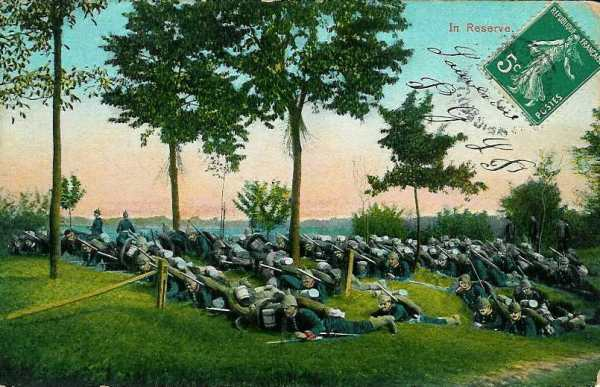
_Réserve d’infanterie allemande_
_Collection privée_

Le général Moser (53e brigade wurtembergeoise) décide de reprendre la marche vers le sud, environ à 500 m au nord-ouest de Bleid. La brigade a à peine dépassé la lisière du bois qu’elle se heurte à des troupes d’infanterie française sur le chemin de Bleid à Gévimont (localité entre Ethe et Bleid). La bataille s’allume immédiatement.

Sur ces entrefaites, une patrouille du 19e uhlans, venue d’Ethe, rend compte que des forces françaises considérables paraissent se diriger d’Ethe vers Saint Léger, en plein dans le flanc du 13e C.A. Le 123e grenadiers, qui patrouille vers Hamawé, est d’ailleurs pris à partie par l’infanterie française. Les Allemands se croient cernés et le général Moser envoi un essaim de patrouilles en arc de cercle, principalement vers l’ouest.

**07h30 :**

Des habitants signalent au lieutenant d’Otard d’Artis (3e dragons) la présence d’importantes forces allemandes de toutes armes à Clémency.

**08h00 :**

Le groupe d’artillerie sur le mamelon 314 (nord d’Ethe) est en mesure d’écraser de ses projectiles la colonne du groupe d’artillerie française visible à 2.600 m dans le chemin creux descendant du Jeune Bois. Les 54 canons de 77 mm et les 18 obusiers de 105 mm prennent par conséquent les lisières du Jeune Bois et du bois de Bampont sous leur feu.

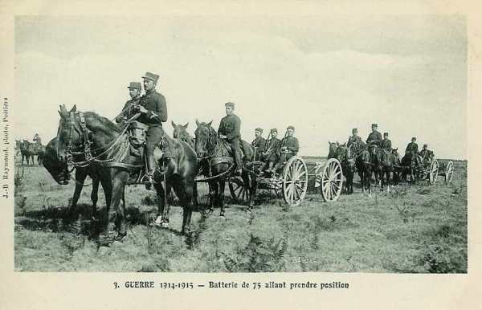
_Batterie française_
_Collection privée_

**08h30 :**

Plus personne ne pourra se déplacer sur les pentes du Jeune Bois, le lieu est criblé d’obus et de balles. Sous la protection de l’artillerie, neuf bataillons allemands vont essayer d’atteindre la lisière nord d’Ethe, sur un front de moins de 1200 m.

**10h30 :**

La patrouille du 3e dragons (allemand) trouve Ethe puis Saint-Léger, occupés par de l’infanterie.

**20h30**

Joffre rédige ses ordres pour la IIIe armée
"La IIIe armée commencera, dès demain 21 août, son mouvement offensif en direction générale d’Arlon.
Elle portera les têtes de ses deux C.A. de gauche sur Virton et Tellancourt, où elles s’installeront, son C.A. de droite en échelon refusé ayant sa tête à Beuveille.
La mission de la IIIe armée sera de contre-attaquer toute force ennemie qui chercherait à gagner le flanc droit de la IVe armée...
La route Jametz, Bazeilles, Ecouviez, Virton incluse est la limite de la IIIe armée à l’ouest."

### 21 août

### En matinée

Le général Ruffey établit l’ordre d’opérations réglant, pour la journée du 21, la manoeuvre des 4e, 5e et 6e C.A.
La IIIe armée a pour mission de prendre l’offensive en direction générale d’Arlon, sa droite se tenant prête à refouler dans Metz toute attaque qui déboucherait de cette place, sa gauche liant son action à celle du 2e C.A. (IV armée), qui doit se porter de Montmédy sur Tintigny.

La 7e D.C., opérant vers Audun-le-Roman et Aumetz, et soutenue par deux bataillons du 6e C.A., éclairera la marche de l’armée et poursuivra sa découverte dans les directions d’Arlon, de Luxembourg et de Bettembourg.

**9h30**

La 7e division franchit la Chiers à Colmey. A partir de Charency, la présence de détachements allemands l’oblige à des temps d’arrêt prolongés.

**11h30 :**

L’avant-garde du 14e hussards, marchant de La Malmaison sur Ruettes est accueillie par des coups de fusil à la sortie du bois de Ruettes. La localité est occupée par des fantassins dont les habitants estiment l’effectif à 1.500 hommes. A côté des Ruettes, Grandcourt est aussi occupé.

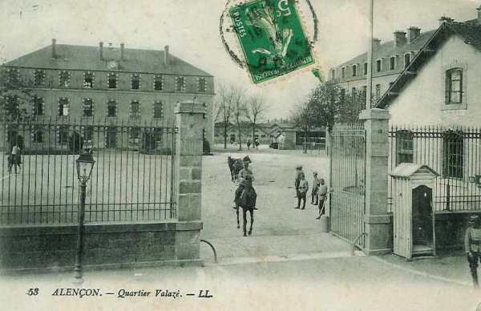
_Caserne du 14e régiment de hussards_
_Collection privée_

Une reconnaissance du 14e hussards, conduite par le lieutenant de la Ferté et qui avait pour ordre de pousser sur Robelmont, n’a pu franchir ni la Basse Vire ni le Ton, car tous les passages sont tenus par l’infanterie allemande.

Ces renseignements sont transmis au Q.G. de la IIIe armée à Verdun.

**En soirée :**

Après une première journée de marche, les avant-gardes de la IVe armée tiennent la Semois, depuis Alle jusqu’à Bellefontaine.

Les C.A. de la IIIe armée sont arrêtés :

- Le 4e C.A. dans la région de Virton - Latour - Les Ruettes, en liaison à gauche avec le 2e C.A. (IVe armée)
  Le 5e C.A. se trouve dans la région de Ville-Houdrémont - Gorcy.
  Le 6e C.A. est à Pierrepont, avec sa 42e division à Mercy-le-Bas - Circourt, sa 40e à Pienne - Norroy-le-Sec.

Cette dernière division couvre le flanc droit de la IIIe armée, que tout mouvement vers le nord expose à une offensive allemande pouvant déboucher de Metz - Thionville. Son action est prolongée par la 7e D.C., opérant vers Ozérailles et soutenue par le groupe des divisions de réserve concentré dans la région d’Etain.

- Voici les renseignements dont la IIIe armée dispose sur les forces allemandes :
  La région de Virton - Arlon paraît inoccupée.

- Des troupes adverses sont signalées dans la région au nord-est de Thionville, en marche vers le nord-ouest.

- Les patrouilles de cavalerie n’ont rien trouvé dans la région de Longuyon.

- Dans le Grand-Duché de Luxembourg, des colonnes allemandes ont traversé, le 20 août, la partie septentrionale, au nord de la Sûre, pour se porter en direction de Neufchâteau.

- Quelques  cantonnements ou bivouacs d’infanterie ou d’artillerie sont signalés entre Etalle et Arlon.

- Longwy a été attaqué le 20 août par le sud-est.

- La 8e division (général de Lartigue) a dû chasser de Virton le 3e bataillon du 123e régiment Wurtembergeois.
Les régiments de la division cantonnent :
  Le 115e à Virton.
  Le 117e à Saint-Mard.
  Le 124e à Harnoncourt.
  Le 130e à Dampicourt.
  L’artillerie de C.A. (44e R.A.C.) à Torgny et Lamorteau
  14e hussards : la moitié à Saint-Mard, la moitié à Chenois.

La division a ses avant-postes sur les plateaux de la rive nord du Ton, tenant Bellevue, la cote 295 et Houdrigny.

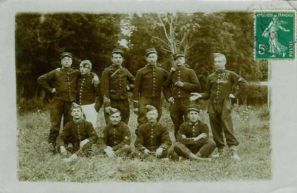
_103 et 104e R.I._
_Collection privée_

La 7e division (général de Trentinian), arrivée trop tard dans ses cantonnements, se contente de se couvrir au sud de la zone boisée Jeune Bois - Bois des Loges (sud de Ethe) par le 103e (colonel Cally). Les 1e et 3e bataillons s’installent à Latour (sud d’ Ethe), le 2e bataillon se trouvant à Gomery.

Derrière cette couverture,

- Le 104e (colonel Drouot) cantonne à Ruettes.
  Le 101e (colonel Farret) cantonne à Grandcourt.
  Le 102e (colonel Valentin) se trouve à la Malmaison.
  Le 2e groupe du 26e R.I. se trouve à Grandcourt.

Les troupes sont fatiguées. Depuis 48h, elles n’ont pas pris un repas substantiel.

L’armée du Kronprinz impérial se trouve largement déployée. Elle est couverte à droite par la 3e D.C., qui opère vers Rossignol et Neufchâteau, en assurant la liaison avec la IVe armée (duc de Wurtemberg).

Cette armée a :

- Son 5e C.A. dans les bois d’Etalle.
  Le 10e C.A. wurtembergeois dans la région de Châtillon - Meix-le-Tige - Rachecourt.
  Le 6e C.A.R. à Thil - Villerupt - Cantebronne.
  Le 16e C.A. à Ottange - Rochonvillers et Angevillers.
  Le 5e C.A.R. dans les bois de Bettembourg.

Au 4e C.A. français, on sent les Allemands très proches, car les indices suspects se multiplient.

Les 5e et 13e C.A. allemands, qui étaient jusqu’à présent orientés vers Montmédy (sud-ouest) reçoivent l’ordre de se tenir prêts à prendre l’offensive vers le sud, dans la région de Longwy. Le 6e C.A.R. doit contourner la forteresse par l’est, le 16e C.A. est la flanc-garde gauche du dispositif et le 5e C.A.R. reste disponible derrière le front de l’armée.

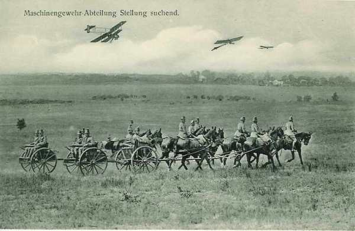
_Section de mitrailleuses allemandes cherchant une position_
_Collection privée_

Les colonnes françaises ont été signalées par le 19e uhlans et le 1e Jäger zu Pferde.

Un bataillon du 58e régiment silésien a été refoulé de Ruettes et de Latour par l’avant-garde de la 7e division française.

Le 5e et 13e C.A. reçoivent l’ordre de s’installer très solidement sur leurs positions. Leurs avant-postes se fortifient dans les bois de Villancourt, de Saint-Léger et d’Ethe, tandis que les gros se dissimulent hors des localités, dans les régions couvertes, prêts à contre-attaquer.

**18h :**

- L’ordre d’opérations est lancé pour le 22 :
  Le 13e C.A. devra refouler les Français au sud de la voie ferrée Virton - Musson, pousser la 26e division sur Ville-Houdlémont et Tellancourt, en se reliant à droite au 5e C.A.

- Le 5e C.A. servira de flanc-garde au 13e, la 9e division marchant d’Etalle par Huombois sur Virton, le 10e d’Etalle par Buzenol sur Ethe. Ce dernier C.A.  doit être en position le 22 à 16h30 sur les hauteurs entre Robelmont et Virton, le long de la vallée de la Basse-Vire, jusqu’à Latour. Ses éléments avancés doivent tenir la voie ferrée Virton - Rulles.

- Le 6e C.A.R se dirigera vers l’ouest, au sud de Longwy.

- Le 5e C.A.R. se portera en ligne entre Aumetz et Crusnes.

- Le 16e C.A. attaquera Audun-le-Roman.

L’offensive doit se déclencher à 05h. Les C.A. sont alertés à minuit.

**21h30 :**

- Le 4e C.A. français reçoit l’ordre d’offensive à Vélosnes. (instruction personnelle et secrète pour la journée du 22)
  Couvrir la droite de la IVe armée, qui marche vers le nord.

- Faire face à toute attaque venant du nord ou de l’est.

- Une division devra être poussée dans la région d’Etalle et l’autre division dans la région de Saint-Léger - Châtillon, de façon à pouvoir contre-attaquer,  par Etalle et par Vance, toutes les forces qui pourraient déboucher d’Arlon.

- Le 5e C.A.  agira entre les routes de Virton - Châtillon - Arlon - Musson - Halanzy - Messancy et viendra dans la région de Meix-le-Tige - Rachecourt avec mission de refouler tout ce qui déboucherait d’Arlon et d’aider le 6e C.A. à déboucher vers Aubange et Athus.

**24h :**

L’ordre général n° 18 pour le 4e C.A. français est rédigé comme suit :

- Le 4e C.A. a pour mission de couvrir la droite de la IVe armée (2e C.A.) qui marche vers le nord.

- Le 14e hussards se portera dans la région de Vance avec pour mission de renseigner sur les mouvements allemands entre la route Vance - Arlon et Etalle - Habay-la-Neuve - Heinstert. Départ de Virton à 4h30.

- La 7e division se portera par Ethe dans la région de Saint-Léger - Châtillon avec pour mission de contre-attaquer par Vance tout mouvement allemand vers l’ouest, menaçant le 2e C.A. Départ d’Ethe à 05h.

- La 8e division se portera par Huombois sur Etalle, avec mission de contre-attaquer toute troupe allemande menaçant le flanc droit du 2e C.A. Départ de Virton à 04h30.

### 22 août

**02h :**

Vu les difficultés de transmission, l’ordre n° 18 ne peut être remis que vers 02h au général de Trentinian dont le Q.G. est installé à l’entrée nord de Ruettes.
Il est 3h45 quand le général de Lartigue, commandant de la 8e division, reçoit ses instructions à Virton. Sa division doit quitter Virton à 4h30 et ses régiments sont immédiatement alertés.

Les Allemands sont à proximité immédiate : le 5e C.A. est dans la région d’Etalle et le 13e dans la région de Saint-Léger. Tous deux sont orientés vers Montmédy.

**02h15 :**

L’ordre du C.A. est remis à la 7e division : elle doit se porter par Ethe sur Saint-Léger et Vance.

Quatre km séparent les Ruettes d’Ethe et les bataillons du 104e, constituant l’avant-garde, doivent partir au plus tard à 04h.

**04h :**

Le général de Trentinian assiste au rassemblement des unités du 104e. Il bruine et il y a un brouillard épais. Comme l’on pense qu’il n’y aura pas de combat, les munitions du train ne sont pas distribuées et les hommes n’auront sur eux que les 88 cartouches réglementaires.

Le 2e bataillon du 103e est rassemblé au nord de Gomery, l’arme au pied.

Le 14e hussards (lieutenant-colonel de Hautecloque) quitte Chenois, le 4e escadron formant l’avant-garde. Il doit se diriger vers Saint-Léger, par la grand’ route, à travers Ethe. La marche est difficile et lente, on n’y voit pas à dix pas et il est impossible de détacher une flanc-garde car les propriétés sont entourées de fil de fer barbelé.

**04h30 : premiers combats d’avant-garde**

Deux bataillons du 101e sont prêts à quitter Grandcourt, quand l’un d’eux reçoit l’ordre de rejoindre Bleid.

L’avant-garde du 14e hussards marche avec une extrême prudence, par bonds rapides, d’un tournant du chemin à l’autre. Deux cavaliers sont envoyés vers Ethe, mais reviennent au galop : les uhlans sont dans la localité. Le peloton descend vers Ethe, le sabre à la main et charge. Les uhlans tournent bride et s’enfoncent dans Ethe. Un cheval français qui galope en tête tombe et l’élan du peloton est rompu. Les uhlans se rallient, il y a au moins un demi régiment. En infériorité numérique, les hussards français se retirent, tenant les uhlans en respect au révolver et à la carabine. Les trois pelotons français restants accourent mais les uhlans n’attendent pas le choc et se replient vers la gare où leurs carabines crépitent. Les Français doivent s’arrêter et répondre au feu par le feu.

Les uhlans sont poursuivis sur la route de Saint-Léger jusqu’au moulin de Hamawé.

**04h45 :**

Le 2e bataillon du 101e (commandant Laplace) fait route derrière un demi-peloton de hussards.

**05h :**

Toutes les unités de la 7e division sont en marche vers Ethe ou vers Bleid. Les éclaireurs du 50e régiment prussien, avant-garde de la 10e division, pénètrent dans le bois d’Ethe par la route de Buzenol, ceux du 123e grenadiers wurtembergeois, avant-garde de la 53e brigade, dans celui de Saint-Léger.

La tête de l’avant-garde de la 7e division arrive à Gomery à 05h au lieu de 4h30, retardée par le brouillard. A cette heure, elle aurait dû passer à Ethe et pourtant, le général Félineau ne juge pas prudent de franchir la transversale Gomery - Bleid sans savoir ce qui se passe dans ce dernier village. Les habitants signalent que les Allemands sont dans la région depuis une quinzaine de jours. Les éclaireurs français ont d’ailleurs été accueillis à coups de fusil vers Bleid.

**05h30 :**

Le colonel de Hautecloque (14e hussards) pénètre dans Ethe au grand trot. Il lance le 3e escadron sur le chemin de Bleid, pousse vers la gare d’ Ethe le 1e escadron et charge le 2e de la garde des issues de la localité. Devant l’intervention du 1e escadron du 14e hussards vers la gare d’Ethe, les uhlans se replient.

A hauteur de Gomery, l’attention du général Félineau, commandant de l’avant-garde, est mise en éveil par les premiers coups de fusil tirés par le peloton d’avant-garde du 14e hussards. Il décide de s’arrêter jusqu’à ce qu’il ait reçu quelques renseignements de la cavalerie.

Le général de Trentinian arrive à ce moment au carrefour et se montre mécontent car la tête de division devrait être à Ethe à 5h et qu’elle n’y sera pas avant 6h30. Il prescrit la reprise immédiate de la marche.

Il juge utile de prendre de sérieuses précautions et de protéger les deux flancs de la division.

**5h30**
Pour flanc-garder sa colonne, le général de Trentinian donne ordre au colonel commandant de la 13e brigade de porter de suite un bataillon du 101e sur Bleid (est d’Ethe), accomagné d’un peloton de cavalerie sous les ordres du capitaine de Jouvencel.

En même temps, deux compagnies, un bataillon devra se porter au nord d’Ethe, comme flanc-garde de gauche.

Le général de Trentinian rejoint l’artillerie de l’avant-garde.

Le gros de l’avant-garde de la 7e division est arrêté au carrefour de Gomery et pousse le bataillon Henry jusqu’au Jeune Bois.

**06h :**

L’avant-garde de la 7e division se trouve encore à Gomery. Les dernières unités sont sur le point d’atteindre la ligne de chemin de fer Virton - Musson, de sorte que les batteries se trouvent encore au nord de Ruettes, attendant que le passage soit ouvert. Les 2 bataillons du 101e sont près de Ruettes et le 102e est sur la route, sa tête à la sortie de Grandcourt.

Les éclaireurs aperçoivent des fantassins allemands sur la crête qui domine la rive sud du Ton. Les cavaliers sont partout arrêtés par des coups de fusil.

La 12e compagnie du 103e R.I. est chargée d’ouvrir le passage au 14e hussards et de dégager une ferme occupée par les Allemands, sur la rive du Ton. Un combat très vif s’ensuit : les pertes françaises sont graves. Une section de mitrailleuses est appelée à la rescousse.

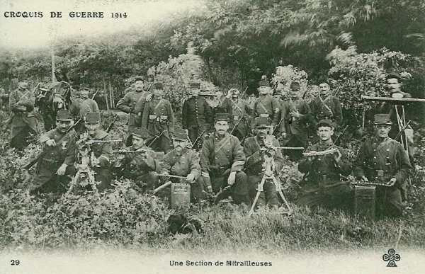
_Section de mitrailleuses françaises_
_Collection privée_

Pourtant, une mesure de prudence s’impose. Depuis Ethe jusqu’à l’entrée du bois Lefort (N.E. d’Ethe), la colonne va présenter son flanc gauche à un plateau très élevé et frangé de bois. Il est essentiel de tenir ce plateau pendant tout le temps que durera le défilé de la division. Le 2e bataillon du 103e (Jouvin) se chargera de cette mission.

Un renseignement provient du peloton Hubin de la pointe d’avant-garde et semble rassurant. Pourtant, dans le nord-est, l’on entend des coups de feu.

**07h :**

L’avant-garde de la 7e division se trouve subitement sous une trombe de balles qui s’abattent sur la route. Des fractions des 9e et 12e compagnies du 103e R.I. font le coup de feu contre les Allemands abrités. Déjà fort éprouvées, elles sont à court de munitions. Ordre est donné d’essayer de tourner l’adversaire.

Le capitaine Bertin, qui conduit la pointe de la 7e division, rencontre des hussards français, et les habitants signalent que les Allemands se sont retranchés. Le capitaine se rend compte que si la division s’engage en colonne de route, elle se trouvera en mauvaise position pour se battre. Malgré les ordres d’avancer, il s’arrête à la gare. Il rejoint ensuite le commandant Henry, qui se trouve à La Tuilerie. Il insiste pour que toute l’avant-garde ne descende pas des hauteurs et que le bataillon pénètre seul dans Ethe, mais le commandant est lié par un ordre formel et cet ordre est d’avancer.

**07h15 :**

Le bataillon Jouvin pénètre dans Ethe par le pont principal.

La 6e compagnie (Faugière) doit barrer la route, à la sortie ouest de Belmont et s’établir sur le mamelon au nord du village.

- La 7e compagnie (Joué) occupera le mamelon, au nord d’Ethe.
  La 8e compagnie (Richard) prendra position dans le ravin du chemin de fer vers l’étang de Laclaireau.
  La 5e compagnie (Grasset) sera disponible dans Ethe.
Pour gagner du temps, les cartouches ne sont pas distribuées, les voitures restant dans Ethe.

**07h20 :**

Le gros de l’avant-garde de la 7e division, constitué par les deux bataillons Levin et Forcinal du 104e R.I. et par trois batteries du 26e R.A.C. pénètre dans Ethe. A sa tête marche le général Félineau.

Au moment où le 2e bataillon (Forcinal) arrive à hauteur de la Tuilerie, une trombe de balles venue du nord s’abat sur la route, ce qui oblige la troupe à s’abriter dans les fossés.

**07h30 :**

Le général Félineau (14e brigade) envoie un rapport au général de Trentinian :
"A la sortie est d’Ethe, le gros de l’avant-garde a été accueilli par quelques coups de feu semblant provenir de patrouilles isolées. Le 14e hussards et son bataillon de soutien se sont intercalés dans la colonne, d’où cause momentanée d’arrêt, mais la marche reprend."

**101e R.I.**

Dans la région de Bleid, le bataillon Laplace du 101e R.I. est au contact des Allemands. Une compagnie a l’ordre de traverser le village puis de gagner la crête de Gevimont - Hamawé. Le brouillard ne permet pas d’apercevoir quoi que ce soit. Une batterie allemande, campée à la cote 325, ouvre le feu et oblige à se terrer.

**103e R.I.**

Au dépôt de la gare, la fusillade crépite sur un large front, notamment au carrefour de Laclaireau. Toutefois, l’avant-garde de la 7e division continue à progresser : il faut être à Saint-Léger avant midi.

A 300m du moulin de Hamawé, le capitaine Bertin met pied à terre et place sa compagnie en file indienne dans les fossés de la route. Des trombes de balles s’abattent sur celle-ci. Une vingtaine de blessés du 103e R.I. refluent. Il faut prendre le dispositif de combat. Bertin déploie trois sections dans le chemin forestier qui, du moulin de Hamawé, monte vers le nord.

Cent mètres plus loin, devant une clairière carrée de 400 m de côté, des fractions des 9e et 12e compagnies du 103e R.I. font le coup de feu contre un ennemi abrité. L’adjudant Mézières reçoit l’ordre d’essayer de tourner l’ennemi et de se rabattre ensuite sur la route.

Les mitrailleuses allemandes se trouvent quelque part au sud du Ton.

**104e R.I.**

La 12e compagnie du 104e, qui marche en tête, a à peine dépassé les dernières maisons d’Ethe sur la route de Saint-Léger qu’une violente fusillade éclate vers la gauche. Toute la compagnie fait face vers la gauche et va se coller contre le talus de la voie ferrée. Comme le feu cesse, le capitaine Vinter rappelle deux de ses sections sur la route.

Moins de cinq minutes plus tard, la fusillade redouble de violence. Il est évident que les Allemands occupent la région au nord d’Ethe. Il n’est pas possible de pousser plus loin tant que la situation ne sera pas éclaircie. Le général Félineau ordonne de constituer une ligne de tirailleurs le long de la voie ferrée.

Le bataillon Forcinal, qui suivait le bataillon Levin, arrive à son tour à la gare où il s’arrête. Il se range le long du talus à gauche du peloton Poirrier.

**07h45 :**

Les Allemands sont dans Ethe et une importante fraction occupe le pont de chemin de fer, coupant la 6e compagnie du reste du bataillon. Comment les Allemands en sont-ils arrivés là ? Est-ce à la faveur du brouillard ? Une compagnie descend la rue grande et se dirige en hâte vers le pont.

Les Allemands ont toute facilité pour se glisser au sud d’Ethe, franchir la rivière et prendre la localité à revers par le sud, et ce qui est encore plus grave, battre de ses feux le chemin de Gomery par où doit passer la colonne française. Ordre est donné au capitaine Grasset de rallier sa compagnie et de l’installer à 200m au sud du Ton, sur une butte d’où elle pourra surveiller la vallée dans la direction de Virton.

Le général de Trentinian entre dans Ethe en même temps que le bataillon Forcinal. Au pont d’Ethe, de nombreuses balles viennent ricocher autour de lui. Il veut garder Ethe à tout prix : des pièces sont mises en batterie et enfilent les rues par lesquelles les Allemands tentent d’avancer, tandis que d’autres battent la rive gauche du Ton empêchant les Allemands de tourner le village.

Un officier de liaison du 4e C.A. repart en automobile vers le PC du C.A, accompagné de feux de l’artillerie allemande, mais réussit à regagner le Jeune Bois. Il pourra ainsi exposer la situation de la 7e division.

Le long de la voie ferrée, les pertes françaises sont sensibles. Avisant le commandant Forcinal, le général de Trentinian lui ordonne de se porter vers le nord avec tout son bataillon et de refouler jusqu’à la lisière du bois les Allemands se trouvant sur le plateau.

**08h :**

**103e R.I.**

Le bataillon Vicq, soutien de cavalerie, est engagé tout entier dans un violent combat. Le lieutenant-colonel de Hautecloque (14e hussards) donne l’ordre au commandant Vicq de déblayer la route afin que son régiment puisse passer, car un ou deux escadrons de uhlans s’accrochent à la lisière du bois. La compagnie Moleux (12e) reçoit pour mission d’ouvrir le passage aux hussards. La marche sur Saint-Léger va reprendre. Le lieutenant-colonel de Hautecloque rallie ses escadrons pour être prêt à partir dès que la trouée sera faite et rédige, pour le commandant de C.A. le compte rendu suivant :

« Me portant de Latour sur Vance, par Ethe et Saint-Léger, j’ai trouvé Ethe occupée par l’ennemi. Je l’ai délogé du village en lui infligeant des pertes importantes. En arrivant à la lisière des bois, en quittant Ethe, j’ai été arrêté par l’infanterie ennemie. Le bataillon Vicq, du 103e R.I., qui m’était donné comme soutien, est entré en action et travaille en ce moment à m’ouvrir le chemin à travers les bois. »

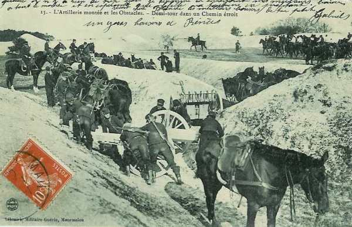
_La difficulté de manoeuvrer une batterie dans des chemins étroits_
_Collection privée_

La compagnie Moleux (12e) s’est portée en avant. Le brouillard est toujours épais et Moleux n’a pas de carte. La section d’avant-garde doit se diviser  pour longer les deux rives du Ton. Bientôt, les balles sifflent et le tir allemand devient très précis. La section du sous-lieutenant Mousseaux reçoit pour mission de déborder la position allemande, mais, arrivée sur la ligne de feu, elle doit se terrer. Le combat est très vif et les pertes sont graves. Les Français ne voient pas d’où vient le tir et ne peuvent pas répliquer.

Le capitaine Moleux appelle à l’aide le commandant Vicq, qui décide de l’appuyer par la section de mitrailleuses. Les mitrailleurs déchargent les mulets et portent les mitrailleuses sur leurs épaules.

Les coups de fusil persistent dans le bois Lefort, indiquant que les Allemands ne cèdent pas. La section Kelle est détachée vers le château de Laclaireau et son chef ordonne de se porter en avant jusqu’au moulin de Hamawé, pour être à même de soutenir la compagnie Moleux. La compagnie Kelle progresse jusqu’au moulin de Hamawé, le long de la lisière du bois Lefort. Elle est accueillie par un feu violent d’infanterie et de mitrailleuses, parti des hauteurs boisées de Gevimont. En quelques minutes, les troupes françaises sont décimées mais demeurent sur place.

Le 14e hussards s’engage au trot sous un passage dans le talus du chemin de fer mais un ouragan de fer s’abat sur les cavaliers. Le peloton passe devant la gare sous le feu des mitrailleuses allemandes. Le flot de cavaliers pénètre dans Ethe par la rue de la station mais se trouve face à une barricade allemande établie devant le moulin de Belmont. Le régiment décimé regagne de Jeune Bois (sud d’Ethe). Au bivouac, on ne pourra rallier que 10 officiers et 180 sabres. Les deux tiers de l’effectif jonchent les pentes du Jeune Bois.

Les Allemands disposent de grandes forces autour d’Ethe. Les batteries françaises ne peuvent ni avancer ni faire demi-tour, engagées dans un chemin étroit et encaissé. La 7e batterie est embouteillée

**08h15 :**

**103e R.I.**

Le bataillon Jouvin (2e) est engagé. A sa gauche et à sa droite, et aussi derrière, une violente fusillade s’est déclenchée. Sur la route d’Etalle, la compagnie Joué tient ferme un îlot de maisons et a devant elle des forces très supérieures. Du côté de Belmont, le capitaine Faugière fait de vains efforts pour rallier les sections Petitjean, Lafay et Fourel, puis réussit à ramener la section Meria près de la scierie de Belmont afin d’y constituer une position de repli.

Le capitaine Grasset occupe sa position au sud du Ton avec deux sections et demie. Il doit répondre à des feux violents provenant du plateau au nord d’Ethe. La section de mitrailleuses Figeac, placée près de la Tuilerie, a pris ses dispositions pour interdire aux Allemands le passage des deux ponts, mais elle est déjà soumise à une vive fusillade.

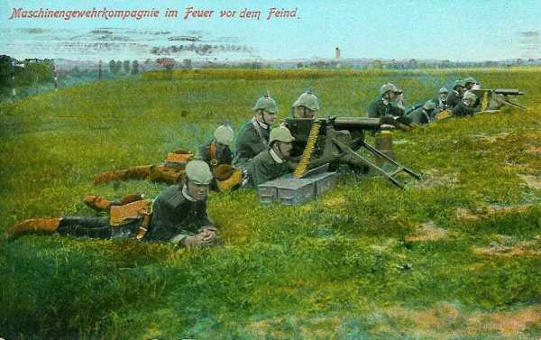
_Section de mitrailleuses allemandes_
_Collection privée_

La bataille s’allume entre la crête de Gévimont jusqu’au pont du chemin de fer qui sépare Ethe de Belmont, sur une distance de 4 km, tandis que l’avant-garde de la 7e division, continuant à descendre des hauteurs du Jeune Bois, traverse Ethe et s’engage dans la vallée du Ton.

Les batteries françaises sont embouteillées entre la rue Grande dans Ethe et le Jeune Bois, au sud de la localité. Comme la route est encaissée, elles ne peuvent ni progresser ni faire demi-tour. L’ordre de rechercher une position sur les hauteurs à la lisière ou au-delà de la zone boisée s’avère inexécutable. Une batterie peut toutefois prendre position au carrefour face à Belmont, une autre face au dépôt de la gare. Une autre batterie n’est pas encore engagée dans Ethe et ses pièces sont mises en batterie entre la Tuilerie et le pont des Roses.

Le brouillard se dissipe et révèle que l’infanterie et l’artillerie allemandes sont en position sur le versant nord de la vallée du Ton. Tout de suite, les balles s’abattent sur la longue file d’attelages qui s’échelonne jusqu’au Jeune Bois. Quelques instants plus tard, les obus s’abattent sur la même cible. C’est un désastre pour les Français

**08h30 :**

**Dans le camp allemand**

La brigade Moser (53e wurtembergeoise) est déployée sur un arc de cercle de 4 km entre Hamawé et Bleid : elle est engagée dans un combat contre le bataillon Vicq du 103e, Henry du 104e et Laplace du 101e.

**Dans le camp français**

Le bataillon Henry, du 104e R.I., tête d’avant-garde de la division, est déployé avec le bataillon Vicq, du 103e R.I., soutien de la cavalerie. Ces bataillons sont déployés en éventail, face au nord-est, sur un front de +- 2 kilomètres, englobant le château de Laclaireau et se prolongeant sur la crête qui, de Hamawé, s’élève au bois du Mât.

Toute la 14e brigade moins trois compagnies est engagée dans le combat dans le fond de la vallée du Ton. La lisière du Jeune Bois a été repérée par l’artillerie allemande et est rendue intenable.

Les six bataillons de la brigade Félineau et le bataillon Laplace  du 101e sont largement déployés sur un front de plus de 3 km contre quinze bataillons allemands appuyés par 90 canons.

- Le bataillon Jouvin du 103e est éparpillé sur la lisière nord d’Ethe, depuis Belmont jusqu’à Laclaireau.

- Le bataillon Rondenay du 103e est disloqué avec deux compagnies dans la vallée et deux compagnies clouées à la lisière du Jeune Bois.

- Le bataillon Vicq du 103e combat avec le bataillon Henry, depuis la région de Laclaireau jusqu’au bois « Sur le Mât » devant Bleid.

- Les bataillons Forcinal et Levin du 104e font le coup de feu le long du talus de la voie ferrée, leur gauche à la station d’Ethe.

- Les débris du 14e hussards ont quitté le champ de bataille.

Seuls neuf canons du groupe Savoureau ont pu être mis en batterie dans Ethe ou au sud du village, dans la vallée du Ton. Ils rendent difficiles les mouvements enveloppants, mais devront bientôt cesser le feu faute de munitions.

En face, neuf bataillons de première ligne de la 10e division allemande, éclairés par des avions, attaquent Ethe par le nord.

Vers Bleid, les six bataillons de la 53e brigade wurtembergeoise sont en mesure de constituer une puissante tenaille dans laquelle la 14e brigade française pourra être écrasée. Les Français ne disposent d’aucune ligne de retraite dans la vallée encaissée du Ton. Le général de Trentinian est bloqué dans Ethe avec son Etat-major.

La 14e brigade a été surprise en colonne de route dans une localité dont les Allemands tiennent les issues et doit lutter, en attendant d’être soutenue, contre des forces triples des siennes en infanterie et décuples en artillerie.

**103e R.I.**

Les unités qui tiennent la crête de Gevimont sont en butte au feu de huit compagnies du 123e grenadiers wurtembergeois et prises à revers par les obus du 20e et du 56e régiments d’artillerie, en batterie au nord d’Ethe. Toute la ligne de front finit par reculer dans la vallée, en laissant la position jalonnée par plusieurs centaines de morts et de blessés.

Les officiers et sous-officiers réussissent à porter de nouveau les unités en avant, mais c’est au prix de la perte de la moitié de l’effectif. Finalement, les éléments disloqués et décimés des deux bataillons sont ramenés dans la vallée.

**08h45 :**

**13e brigade**

Le colonel Lacotte reçoit, à Gomery, ordre du général de Trentinian de pousser en avant toute l’infanterie disponible. A ce moment, la situation est la suivante :

- Deux compagnies (11e et 12e) du bataillon Tisserand (101e) se trouvent à l’entrée de Gomery.

- Derrière se trouvent deux groupes du 26e d’artillerie, les dernières voitures à  la sortie de Ruettes, avec une compagnie (9e) du bataillon Tisserand.

- L’artillerie est suivie du bataillon Lebaud, du 101e et de trois bataillons du 102e, dont les dernières unités attendent sur la route près de la Malmaison.

Le bataillon Lebaud est à 4 km du Jeune Bois et les dernières unités du 102e à 8 km. On ne peut donc escompter l’entrée en ligne de la 13e brigade avant deux heures.

Le colonel Lacotte pousse tout de suite en avant les deux compagnies du 101e et prescrit au commandant du 26e R.A.C. de rechercher derrière la croupe 293 à Gomery une position permettant d’agir.

Un agent de liaison arrive à toute bride, qui déclare : « il faut dégager le général de division cerné dans Ethe et envoyer toute l’infanterie au pas de gymnastique. »

En ce moment, Ethe est attaquée par le nord et par l’est.

Le commandant du 26e place un groupe d’artillerie sur la croupe 293 (Gomery). Des obus de gros calibre s’abattent près des pièces : leur tir est réglé par un avion.
104e R.I.
Les éléments disponibles du bataillon Forcinal (2e), déployés face au nord, au-delà du talus de la voie ferrée, se disposent à partir à l’assaut en exécution des ordres du général de division. Devant ces troupes, le terrain présente une pente légèrement ascendante, couverte de hautes avoines. Une crête barre l’horizon à 150 m. Par bonds d’une trentaine de mètres, les sections françaises franchissent le glacis mais dès qu’elles tentent de dépasser la crête, elles sont immédiatement décimées par les rafales de mitrailleuses et les tirs d’artillerie.

- **9h**
Situation :
  Le bataillon Forcinal et une partie des bataillons Jouvin et Levin et deux batteries d’artillerie tiennent Ethe et les abords du village.

- A droite, les bataillons Vicq, Henry et quelques compagnies du bataillon Levin défendent le terrain entre Hamawé et la crête de Gevimont.

- En arrière de la droite, le bataillon Laplace vient d’atteindre Bleid.

- Le général commandant la 14e brigade, qui vient d’atteindre Gomery, reçoit l’ordre du général de Trentinian d’attaquer Belmont.

- En arrière de la ligne qui s’étend d’Ethe à Bleid, le colonel Lacotte dispose d’une large zone de manoeuvre couverte par les bois et les accidents de terrain.

- Les deux bataillons du colonel Farret (101e) se portent à la lisière du Jeune Bois.

**09h30 :**

**[Position des unités à 9h30](../img/Ethe_9h30.jpg)**

Source : Général de Trentinian Ethe La 7e division du 4e corps dans la bataille des frontières

Le commandant Vicq rallie tout ce qui appartient au 103e et sous la protection de la 12e compagnie déployée derrière une crête à 500 m du moulin de Hamawé, ramène les débris dans Ethe. Le commandant Henry entraîne ceux du 104e dans le bois Lefort et il regroupe toutes les unités dans les taillis, près du château de Laclaireau.

Le long de la voie ferrée, le combat est devenu âpre. Le 104e doit lutter contre un mouvement débordant du 47e régiment allemand. De ce côté, les Allemands occupent des tranchées nettement visibles devant la lisière du bois de Laclaireau. Pour répondre à ce feu, toutes les unités en réserve du bataillon doivent être mises en ligne.

**10h :**

Le major Kammler, commandant du 3e bataillon du 123e grenadiers constate l’abandon de la crête de Gevimont par les Français et, croyant la partie gagnée, il précipite ses compagnies dans le thalweg de Gevimont en colonnes d’assaut. Sur cet objectif, la compagnie Jongleux et une section de mitrailleuses françaises ouvre le feu en occasionnant de sanglants ravages. Les fantassins allemands regagnent l’abri des bois. Une compagnie allemande réussit toutefois à prendre pied dans la lisière du bois du Mât. De là, elle dirige des feux de revers en direction de la compagnie Jongleux, qui à son tour éprouve de fortes pertes. Le capitaine donne alors l’ordre de retraite.

Le généra Kosch, commandant de la 10e division, se rend compte de la difficulté de venir à bout de la défense d’Ethe par une attaque de front. Il confie au colonel Arendt, commandant du 46e régiment, la mission d’envelopper la gauche française en s’élevant sur les pentes du bois de Bampont.

Le général de Trentinian attend avec impatience l’intervention de la 13e brigade. Il a envoyé un cavalier porter au général Boelle un compte rendu sommaire de la situation.

**13e brigade**

Tout en avisant le colonel Lacotte, le colonel Farret donne immédiatement comme objectif au bataillon Lebaud la corne sud-ouest du Jeune Bois. La progression est pénible parmi les hautes avoines. La compagnie Nicolas atteint le Jeune Bois sans avoir subi de pertes, mais la compagnie Segonne, qui a dû franchir la crête près du point culminant 293, est saluée par des rafales et plusieurs hommes sont atteints. Cette compagnie dévale la pente vers le nord-est pour gagner tout de suite le bois.

**10h30 :**

**103e R.I.**

La compagnie Richard (8e), que l’offensive du 47e régiment allemand a isolée dans le bois de Laclaireau, a été balayée. Au nord du Fond de Bivaux, deux sections sont bousculées et les Français doivent opérer une retraite précipitée pour échapper à l’enveloppement. La ferme de Laclaireau doit être abandonnée. Les sections restantes doivent franchir le Ton et chercher à remonter les pentes du Jeune Bois.

**104e R.I.**

Des mitrailleuses crépitent à la corne sud-ouest du bois de Laclaireau, prenant en enfilade la ligne française. Ordre est donné de dessiner un crochet défensif avec les 9e et 12e compagnies, mais cet ordre, mal compris, provoque un commencement de panique. Le colonel Drouot court rallier ses soldats sous une pluie de fer. Il place les débris de la 9e compagnie face à l’est dans les dernières maisons d’Ethe.

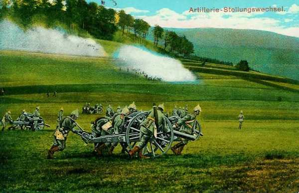
_Canon amené à bras d’hommes_
_Collection privée_

Le commandant Vicq se présente, suivi de 200 hommes. Ceux-ci forment l’arrière garde et ont dû, pour échapper à la destruction, cheminer dans le lit de la rivière. Une cinquantaine d’hommes sont retenus pour renforcer la défense des barricades et des maisons. Le reste doit se rendre à la Tuilerie.

**11h :**

Comme les éléments du 104e R.I. ont dû abandonner la voie ferrée, la défense va se concentrer dans Ethe. Belmont (ouest d’Ethe) est perdu et les Allemands tiennent la partie basse d’Ethe jusqu’à l’église mais les débris de la compagnie Faugières (103e R.I.) se défendent dans les maisons de la lisière sud. Les débris des sections Girard et Janin de la compagnie Grasset (5e du 103eR.I.) sont répartis dans quelques maisons de la ruelle Clesse et derrière une barricade qui interdit le débouché de cette ruelle sur la Rue Grande.

La partie est d’Ethe est encerclée et serrée de près par de grandes forces allemandes mais cette partie s’est peu à peu transformée en une forteresse que flanquent des canons. Une solide barricade ferme la Rue Grande et derrière cette barricade, deux canons prennent en enfilade la rue jusqu’à Belmont.

Des fractions allemandes sont signalées débouchant de Belmont et s’infiltrant par le pont du moulin dans le chemin creux qui conduit au bois des Loges. Le commandant Vicq reçoit l’ordre de se porter dans cette région et de s’opposer au mouvement enveloppant.

**13e brigade**

Les deux bataillons des 101e et 102e  R.I. garnissent la lisière du Jeune Bois et se trouvent ainsi disposés de la gauche vers la droite :

- 6e compagnie du 102e (Gérard)
  2e compagnie du 101e (Segonne) et 3e compagnie du 101e (Nicolas)
  7e compagnie du 102e (Fromont)
  4e peloton du 101e et section de mitrailleuses du 102e dont la droite est sur le chemin forestier reliant Ethe à Gomery.

Les autres unités des deux bataillons sont en renfort à l’intérieur du bois.

Quand les unités de première ligne tentent de dépasser la lisière, elles sont accueillies par un feu violent. Tout le terrain en avant, dévalant vers Ethe, est déjà jonché de centaines de cadavres. Le colonel Farret envisage un mouvement enveloppant à exécuter par le bois de Bampont sur Belmont (ouest d’Ethe).

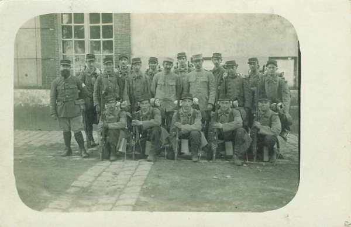
_101e R.I. -  13e brigade_
_Collection privée_

Les deux compagnies du bataillon Tisserand, parties les premières au secours de la 14e brigade, sont immobilisées. Elles avaient essayé de déboucher de la lisière du Jeune Bois vers Ethe, à l’est du chemin Ethe-Gomery, mais une grêle de balles les avait clouées au sol. Demeurées à mi-pente, elles ont été décimées.

Devant l’impossibilité de déboucher du Jeune Bois, le colonel Lacotte n’ose pas lancer ses dernières disponibilités dans une attaque sur Belmont.

**Du côté allemand**

Les éclaireurs allemands franchissent le Ton au moulin de Belmont (ouest d’Ethe) sous la protection d’un formidable tir de barrage qui bouleverse les lisières des bois de Bampont et des Loges. De proche en proche, les compagnies feldgrau se déploient derrière la crête Belmont - Bois les Loges, et se glissent vers 12h dans le Jeune Bois.

A l’est du champ de bataille, la destruction du bataillon Laplace laisse la brigade Moser libre d’intervenir à l’est d’Ethe ou, par le bois de Baconveau, de venir attaquer Gomery, au sud d’Ethe, encerclant complètement la 14e brigade.

**11h15 :**

Des forces allemandes considérables (47e I.R.) sont signalées venant du nord, par le ravin du ruisseau de Laclaireau.

Dans Ethe qui brûle, les débris des bataillons Levin et Forcinal ont reflué. Ces soldats vont étoffer la défense des lisières nord et est du village, ainsi que toutes les barricades. Une ligne est constituée par la compagnie du génie, par les sections Chanut (2e), Dupuy et Dicquelou (3e), Burté (4e), Brigaud (9e), Ricard (11e) du 104e , Sédillot (2e) et Rouget (4e), du 103e.

Le commandant Forcinal songe à occuper la lisière du Jeune Bois, une position qui permettra de répondre au feu allemand. Pour opérer une diversion permettant d’y hisser des canons, trois sections du 103e R.I. sont disponibles. Le commandant donne ordre de prononcer un mouvement offensif vers la gare, mais toute la région de la gare est écrasée sous une grêle d’obus, qui prépare une attaque du 47e régiment allemand.

Les Allemands encerclent déjà la gare et sont terrés dans des trous de tirailleurs. Le capitaine de Lavalade fait mettre baïonnette au canon et entraîne ses hommes à l’assaut, mais en moins de deux minutes, son détachement est détruit et l’effet de la diversion est manqué. Les projectiles allemands n’ont cessé de raviner les pentes du Jeune Bois et le mouvement projeté par le commandant Forcinal ne peut s’exécuter.

**11h30 :**

Dans Ethe, la Rue Grande est impraticable : les maisons en flammes, et elle est sous le feu des mitrailleuses allemandes en batterie près du pont de chemin de fer de Belmont. Une ligne d’infanterie allemande assez dense est déployée derrière la crête qui, de la corne sud-est du bois de Bampont descend sur Belmont.

**12h :**

On n’a pas encore de nouvelle de la 13e brigade, rien ne bouge à la lisière du Jeune Bois. Le général de Trentinian estime qu’il doit essayer de rejoindre le gros de la division. Il prescrit au général Félineau de tenir dans Ethe aussi longtemps qu’il le pourra. C’est une mission de sacrifice total, car une retraite est impossible. La seule possibilité de salut est de tenir jusqu’à la nuit.

Le général de Trentinian a rassemblé son E.M. et son escorte près de la Tuilerie. En quelques foulées, le général est dans le Jeune Bois. Quelques balles l’on à peine effleuré. La hampe du fanion que porte derrière lui le maréchal des logis Pacaud a volé en éclats. Le copmmandant Macker a son cheval tué mais passe. La moitié des hussards de l’escorte sont fauchés.

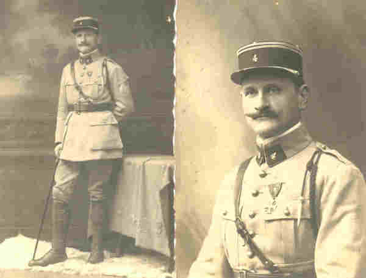
_l’ordonnance Paccaud_
_Aimablement communiqué par Mr J. de Trentinian_

En arrivant à Gomery, le général de Trentinian constate que la 13e brigade est en pleine retraite.

**13e brigade**

La menace allemande se précise à droite. Le commandant Nicolas, du bataillon Laplace, qui ramène de Bleid 150 hommes de sa compagnie (6e) rend compte que tout le reste du bataillon est anéanti et que de grandes forces allemandes, une brigade au moins, sont dans la région de Bleid, en situation de se porter sur Ruettes. Dans ces conditions, considérant que la 14e brigade est perdue, le colonel Lacotte juge qu’ il n’y a pas de meilleur parti à prendre que d’opérer une retraite sur les hauteurs nord de la Malmaison pour organiser une nouvelle ligne de bataille.

**12h30 :**

Deux bataillons évacuent le jeune Bois et toutes les troupes de la 13e brigade se mettent en retraite vers Ruettes. Tous ces mouvements sont en cours d’exécution quand le général de Trentinian, échappé d’Ethe, arrive à Gomery et donne l’ordre d’arrêter immédiatement tout mouvement de repli et de prendre une vigoureuse offensive pour dégager la 14e brigade.

**13h :**

Le flanc gauche de la 14e brigade n’est protégé que par une faible escouade, mais le 46e régiment allemand n’ose pas l’attaquer. Neuf canons français constituent l’ossature de la défense d’Ethe. Ils tirent sur le plateau au nord d’Ethe jusqu’à la lisière du bois de Laclaireau, ce qui n’empêche pas les 47e et 50e régiments allemands de se rapprocher à distance d’assaut. Les deux pièces de la batterie Jourdan balaient d’un ouragan de mitraille les groupes feldgrau qui se présentent.

A l’est du champ de bataille, la brigade Moser est libre d’intervenir à l’est d’Ethe pour venir attaquer Gomery. La compagnie Chameroy est débordée par tout le 2e bataillon du 123e grenadiers et le 2e bataillon du 124e I.R. Elle est même prise à revers par des mitrailleuses installées à la cote 293, puis refoulée à travers Bleid jusqu’au parc du château. Privés de chefs, les soldats des 5e et 7e compagnies vont se faire tuer sur place jusqu’au dernier.

La compagnie Battesti (8e) est attaquée de front et sur son flanc droit par le 1e bataillon du 123e grenadiers. La compagnie Vincent (103e R.I.) a été submergée par le 1e bataillon du 123e grenadiers et prise à revers par les 6e, 8e, 10e et 12e compagnies du 124e I.R.

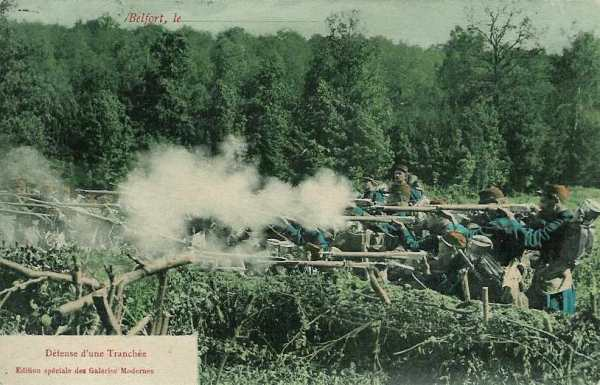
_Défense d’une tranchée française_
_Collection privée_

La lutte continue dans la région de Bleid tant qu’il reste quelques soldats français. Le bataillon Laplace était parti avec un effectif de 750 hommes. Seuls 150 rejoindront Gomery, mais les régiments allemands accusent une perte totale de 1.042 hommes.

**14e brigade**

Jusqu’à la nuit, la situation dans Ethe demeurera stationnaire. A cause du mélange d’unités, des combats individuels se livrent dans les maisons en flammes.

**13e brigade**

Des 18 compagnies qui constituent toutes les forces disponibles de la 13e brigade

- Neuf compagnies appartenant à quatre bataillons font face à Latour et sont engagées dans un combat contre le 47e régiment allemand, déployé derrière la crête 293 - Latour.

- Trois compagnies font face au Jeune Bois, d’où l’on s’attend à voir les Allemands déboucher.

- Une compagnie tient Gomery et quatre compagnies sont au sud de la voie ferrée pour organiser une position de repli.

Le colonel Lacotte a l’impression que les Allemands ne disposent pas d’effectifs considérables à Latour mais il estime avoir besoin des forces de la 13e brigade pour les y maintenir. Il est inquiet de ne pouvoir faire face à une offensive venant de Bleid.

Les Allemands cherchent à déboucher du bois de Baconveau, face à Gomery (123e grenadiers et 124e I.R.). L’objectif de la brigade est de se lancer vers Tellancourt (sud-est d’Ethe).

Dès que la ligne de tirailleurs allemands essaie de quitter la lisière, elle est accueillie par une fusillade nourrie des défenseurs de Gomery et elle reflue dans les sous-bois. Les Allemands ne renouvellent pas leur tentative d’assaut. Le colonel Lacotte est toutefois impressionné par la menace qui se dessine sur le flanc droit quand toutes les forces sont immobilisées devant Latour. Il sait également que le 5e C.A. est en retraite vers Tellancourt.

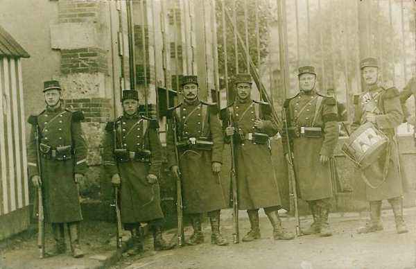
_115e R.I. - 16e brigade_
_Collection privée_

La destruction de la 14e brigade semble prochaine. Il vaut tenter de dégager sa gauche et prescrit une contre-attaque. Il faut pour cela franchir deux crêtes sous le feu d’un ennemi invisible. Les pertes sont tout de suite considérables et il faut arrêter à 500 m  de Latour, car les troupes sont soumises à des tirs d’artillerie convergents de l’artillerie postée au nord d’Ethe et dans la région de Bleid.

**14h :**

La Rue Grande d’Ethe n’est plus qu’un brasier, entre le pont de chemin de fer de Belmont jusqu’à la rue du Château-Cugnon. Les compagnies des 46e et 50e régiments prussiens se glissent prudemment au milieu des décombres. La localité, depuis la rue du Château-Cugnon jusqu’à la gare est une véritable forteresse dont les canons défendent les abords et où les allemands ne pénètrent pas.

**16h :**

Le général de Trentinian juge inopportun de laisser sans utilité la 13e brigade exposée à un double enveloppement et se décide de donner l’ordre de ralliement sur le plateau de la Malmaison. Le repli s’exécute dans le meilleur ordre et le bataillon de couverture peut rester en position jusqu’à 17h30 sans être inquiété.

Les canons français se taisent faute de munitions et un bataillon du 47e I.R. s’empare de la gare d’Ethe. Les Français luttent toujours à la lisière nord du village, sur la voie ferrée et dans les maisons qui en bordent le talus. Les efforts de quatre bataillons allemands sont entièrement annihilés.

**17h :**

Belmont et la partie occidentale d’Ethe sont occupés par deux bataillons du 60e I.R. allemand, la partie orientale de la localité est encore tenue par des forces françaises serrées de près par un bataillon du 50e et trois bataillons du 47e I.R. allemands.

Dans le bois Lefort, les Français tiennent le château de Laclaireau (groupement du commandant Henry)

Dans le bois de Baconveau, deux bataillons wurtembergeois observent Gomery ainsi que quatre bataillons de la brigade Moser dans la région de Bleid.

Depuis Belmont jusqu’à Latour, les trois bataillons du 46e allemand envoient des patrouilles dans le Jeune Bois où ils ne trouvent que deux compagnies françaises.

Tandis que la tenaille allemande menace Gomery, le 13e bataillon se retire vers la Malmaison, laissant le champ libre à l’enveloppement. Le 6e régiment de grenadiers allemand demeure disponible pour un assaut à la lisière du bois d’Etalle.

Et pourtant, la tenaille ne se referme pas, car l’objectif du 13e C.A. allemand est Longwy et non Gomery. Le général Kosch attend le résultat de la manœuvre enveloppante du 46e I.R. pour lancer le 6e grenadiers à l’assaut de la lisière nord d’Ethe, mais à ce moment, le commandant du 6e grenadiers et le chef d’E.M. de la 10e division sont tous deux mortellement atteints par le même obus, et l’ordre d’attaque n’est pas donné.

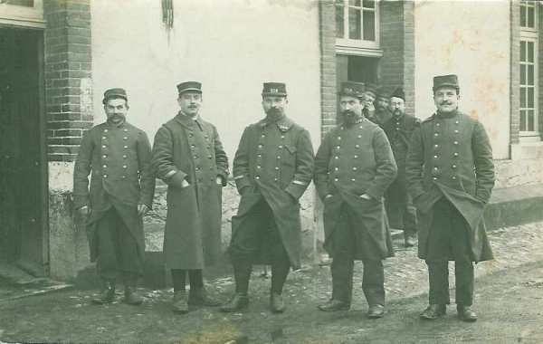
_104e R.I. (14e brigade)_
_Collection privée_

Le commandant de la 10e division allemande ne se rend pas compte exactement de la situation : il croit que le point d’appui d’Ethe ne constitue qu’une position avancée, la vraie position des Français étant sur les hauteurs du Jeune Bois. Vu la solidité de ces positions, il estime qu’une attaque de front n’aurait aucune chance d’aboutir.

Vers 17h, voyant que l’attaque débordante déclenchée depuis 10h ne produit aucun effet et sentant les défenseurs d’Ethe épuisés et à court de munitions, le commandant du 50e I.R. jette à l’assaut de la lisière nord d’Ethe son dernier bataillon maintenu jusque là en réserve. Ce bataillon qui a 500 m  à parcourir, marche droit au sud à travers les avoines jonchées de cadavres, mais il est immédiatement pris à partie par les compagnies de mitrailleurs du Jeune Bois et, décimé, il se disloque.

C’est le dernier effort des allemands durant cette journée, car il sont à bout de souffle : le 50e a perdu 600 hommes, de même que le 47e. L’artillerie a été également éprouvée : en amenant les pièces près des maisons d’Ethe, les Allemands ont subi des pertes en personnel et en matériel.

Le général Kosch décide donc de ne pas lancer son attaque décisive et de rallier sa division à la lisière du bois d’Etalle.

**18h :**

Le combat est rompu. Sur l’appel des clairons, les Allemands se retirent et les bataillons se rassemblent hors de portée des mitrailleuses françaises. Pour couvrir leur retraite, les allemands déclenchent un feu d’artillerie violent sur Ethe pendant un quart d’heure. La 14e brigade reste maîtresse du champ de bataille. Le général Félineau estime opportun de se retirer et de ne pas tenter une attaque de nuit. Avec l’aide d’un habitant, les Français se dégagent silencieusement en garnissant de paille les roues des voitures, en enveloppant les objets métalliques et les sabots des chevaux dans des linges.

**19h :**
Le 101e R.I. a rallié la Malmaison

**20h :**

Les restes de la 14e brigade, soit 500 fantassins, se mettent en marche dans la nuit.

**22h :**

La colonne française passe dans Gomery.

### 23 août

Au point du jour, la 14e brigade rallie le gros de la division à Charency. Tous les efforts allemands se sont brisée devant la résistance des défenseurs d’Ethe.

### Conclusion

La 7e division a tenu tête à des forces trois fois supérieures pendant toute la journée du 22 août.

La 14e brigade se trouvait dans une véritable souricière, sans possibilité d’opérer une retraite, car les pentes du Jeune Bois, au sud d’Ethe, étaient sous le feu allemand. Les troupes françaises étaient encerclées à la fois à l’ouest et à l’est.

Cette situation aurait pu conduire à un désastre si les Allemands avaient refermé la tenaille comme lors des combats de Rossignol dans la même région. L’attaque décisive ne s’est pas produite et les troupes françaises ont pu se dégager de ce mauvais pas. Ce combat a toutefois occasionné de grandes pertes de part et d’autre, sans véritable résultat. La 7e division a perdu 5.000 hommes tués, blessés ou disparus.

Cette division sera bientôt transportée par chemin de fer pour faire partie de la VIe armée (Maunoury) et s’illustrera dans l’un des épisodes les plus connus du début de la guerre : les taxis de la Marne.