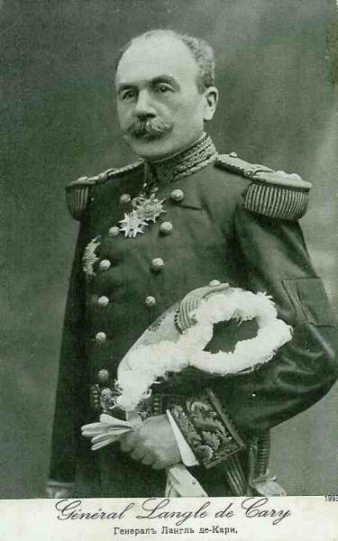
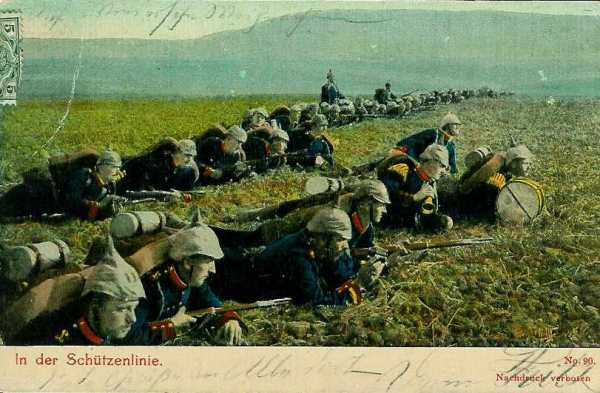
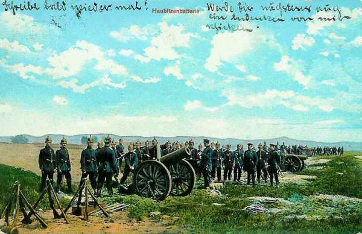
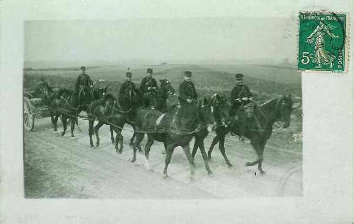

# Combat d’Ochamps - forêt de Luchy (22 août 1914)

Le combat d’Ochamps - Forêt de Luchy est épisode de la bataille de Neufchâteau - Longwy. En progressant vers le nord comme toute la IVe armée, le 17e C.A français (général Poline) affronte le 18e C.A. allemand (von Schenck), qui vient d’infléchir sa marche vers le sud.

### Cadre du combat

Le 20 août 1914, le G.Q.G. français, voyant les armées allemandes défiler d’est en ouest sur le territoire belge,  croit que le commandement allemand affaiblit son centre au profit de l’aile droite. Joffre décide de frapper au centre pour couper l’armée allemande en deux tronçons,  dans la région des Ardennes belges.
Il prescrit à la IVe armée de « porter cette nuit de fortes avant-gardes de toutes armes sur la ligne générale Bièvre - Paliseul - Bertrix - Straimont - Tintigny,  pour assurer les débouchés de l’armée au-delà de la Semois ».

### Le terrain

**[Lien vers carte](../img/ochamps_luchy.jpg)**

### Les forces en présence

**Armée française**

IVe armée française (de Langle de Cary)

_Général de Langle de Cary_
_Collection privée_

17e C.A. (général Poline)

_Général Poline (17e C.A.)_
_La guerre du droit_

33e D.I. (général de Villemejane)

| Unité | Commandant | Régiments |
| --- | --- | --- |
| 65e brigade | Huc | 7e R.I. (Cahors / Helo)9e R.I. (Agen / Duport) |
| 66e brigade | Fraisse | 11e R.I. (Montauban / Appert)20e R.I. (Montauban / Détrie)9e régiment de chasseurs à cheval (un escadron)18e R.A.C. (Paloque) (trois groupes de 75)Une compagnie du Génie |

34e D.I. (général Alby)

| Unité | Commandant | Régiments |
| --- | --- | --- |
| 67e brigade | Dupuis | 14e R.I. (Toulouse / Savatier)83e R.I. (Toulouse / Bretont) |
| 68e brigade |  | 59e R.I. (Pamiers, Foix / Dardier)88e R.I. (Auch / Mirande / Mahéas)9e régiment de chasseurs à cheval (un escadron)23e R.A.C. (Delmotte) trois groupes de 75Une compagnie du Génie |

Réserves
207e et 209e R.I.
9e régiment de chasseurs à cheval (quatre escadrons)
57e R.A.C. (quatre groupes de 75)
Génie du C.A.

**Armée allemande**

IVe armée allemande (duc de Wurtemberg)

_Duc de Wurtemberg_
_Collection privée_

18e C.A. (général von Schenck)

_Général von Schenck (18e C.A.)_
_Collection privée_

21e division (von Oven)

| Unité | Commandant | Régiments |
| --- | --- | --- |
| 41e brigade |  | Nassauisches Infanterie-Regiment Nr. 87 (Mainz)Nassauisches Infanterie-Regiment Nr. 88e (Mainz, Hanau) |
| 42e brigade |  | Füsilier-Regiment Nr 80Infanterie-Regiment Nr. 81.Thüringisches	Ulanen-Regiment Nr 6 |
| 21e  Feldartillerie Brigade |  | Nassauisches Feldartillerie-Regiment Nr. 27Nassauisches Feldartillerie-Regiment Nr. 63Nassauisches Pionnier-Bataillon Nr. 21 (une compagnie) |

25e division (général Kühne)

| Unité | Commandant | Régiments |
| --- | --- | --- |
| 49e brigade |  | Leibgarde Infanterie-Regiment Nr.115Infanterie_Regiment Nr.116 |
| 50e brigade |  | Infanterie-Leibregiment Nr. 117Infanterie-Regiment Nr. 118eMagdeburgisches Dragoner-Regiment Nr. 6 |
| 25e  Feldartillerie-Brigade |  | Grossherzogliches Hessisches Feldartillerie-Regiment Nr. 25Grossherzogliches Hessisches Feldartillerie-Regiment Nr. 61 |

Nassauisches Pionnier-Bataillon Nr. 21 (deux compagnies)|

Un tiers de régiment de Fussartillerie (artillerie lourde).
27e escadrille d’aviation.

### 20 août

Le duc de Wurtemberg, commandant de la IVe armée allemande, donne ses ordres de marche pour le 21 août.

1. Plusieurs C.A. français se sont mis en marche aujourd’hui à l’aube de la région de Hirson - Charleville dans une direction nord.

2. L’aile gauche de la IIIe armée allemande restera probablement près de Ciney ; l’aile droite de la Ve armée près d’Etalle. La 3e D.C. restera aujourd’hui près de Habay-la-Neuve.

3. La IVe armée atteindra le 21 la ligne Wanlin - Libin - Recogne.
Le 6e C.A. restera aux alentours de Léglise.

4. Le 7e C.A. atteindra de bonne heure, avec le gros, le secteur de la rivière l’Homme : Grupont - Smuid. Q.G : Saint-Hubert ... Le 8e C.A. poussera sur la ligne Eschweiler - Donkholz - Harlingen, son avant-poste se portant à 6h jusqu’à Hemroulle, au nord-ouest de Bastogne. Q.G. : Bastogne.

5. Le 18e C.A. poussera avec ses avant-gardes sur la ligne Libin - Ochamps - Neuvillers. La route Anlier - Fauvillers - Chaumont - Hompré sera franchie à 7h.

6. La 21 D.R. atteindra Fauvillers, avec son avant-garde à Ebly...

7. Le 6e C.A. serrera vers Léglise - Mellier.

Le commandement de l’armée restera à Bastogne jusqu’à 10h.

### 21 août

**7h25 :**

Joffre prescrit au général de Langle de Cary (IVe armée) d’entamer son offensive le jour même en direction de Neufchâteau. L’ordre dit :

« Orientez vos colonnes dès aujourd’hui, en mesure de déboucher au nord de la Semois.
Demain 22, le mouvement se poursuivra en direction du nord, votre droite marchant par Rulle - Léglise - Nives.
La 3e armée marchera en échelon refusé à votre droite.
L’ennemi sera attaqué partout où on le rencontrera ».

**Dans l’après-midi**

Les avant-gardes du 18e C.A. allemand entrent en contact près de Longlier avec les 4e et 9e D.C. françaises, appuyées par le 87e R.I.

**En soirée :**

La IVe armée française occupe une ligne générale sur la Semois depuis Alle jusqu’à Tintigny.

L’ordre du général de Langle de Cary pour la journée du 22 fixe les objectifs suivants :

- 17e C.A. : Jéhonville, Ochamps.
  12e C.A. : Recogne, Libramont.
  C.A. colonial : Neufchâteau
  2e C.A. : Léglise via Tintigny, se tenant en liaison avec le 4e C.A. (gauche de la IIIe armée), qui marchera sur Etalle.
  9e C.A. : avec sa seule D.I. débarquée, Bièvre, Houdremont, couvrant en échelon la gauche du 11e C.A.
  C.C. : reconnaîtra les mouvements allemands au sud de la ligne Recogne  -  Libin -  Beauraing, soit la partie ouest du front de l’armée. Si la bataille s’engage, il devra couvrir l’aile gauche du 11e C.A.

### 22 août

**En matinée :**

**Du côté français**

A l’aile droite de la IVe armée française se trouve le 11e C.A., qui marche en une seule colonne vers le nord par Tintigny et Mellier, sur Léglise. Son flanc droit est couvert par le 4e C.A. de la IIIe armée. A sa gauche marche la 3e division coloniale par Bellefontaine, Rossignol et Les Fosses vers Neufchâteau.

Plus à gauche, la 5e brigade coloniale doit marcher de Les Bulles par Suxy, également vers Neufchâteau.

A côté, le 7e C.A. doit pousser de la région de Chassepierre - Florenville vers celle de Grandvoir, Petitvoir.

Le 17e C.A. (général Poline) doit marcher avec sa 33e division sur Ochamps et sa 34e division sur Jéhonville. Le mouvement s’effectue sur trois colonnes :

- A droite, la 66e brigade (général Fraisse) marche par Sainte-Cécile - Herbeumont - Bertrix - Ochamps.

- Au centre, la 67e brigade doit avancer par Fontenoille, Cugnon, Blanche-Oreille.

- A gauche, la 68e brigade doit avancer par Muno, Dohan, Fayt-les-Veneurs et Offaigne.

Les avant-gardes doivent franchir la ligne Paliseul - Bertrix - Strimont à 9h. La 65e brigade doit marcher comme flanc-garde de droite vers Saint-Médard. Cette brigade doit occuper la région de Saint-Médard jusqu’à ce qu’elle soit relevée par l’avant-garde du 12e C.A. (général Roques). Ce C.A. est à une demi-journée de marche en arrière.

**Du côté allemand**

Le 18e C.A. doit pousser avec sa 25e division sur la ligne Transinne - Anloy. La 21e division est laissée vers Libramont. Le général von Schenck, commandant de corps, ordonne à la 25e division de se tenir prête près de Villance-Glaireuse. La 21e division doit occuper avec son gros les hauteurs au nord et au nord-ouest de Neuvillers et, avec un détachement mixte (87e R.I. et groupe du 27e régiment de feldartillerie), les hauteurs à l’est d’Ochamps.

_Ligne de tirailleurs allemands_
_Collection privée_

La 27e D.I. (général major von Oven) progresse de Saint-Pierre vers le point culminant 500 m  à l’ouest de Recogne. La division prend position à cheval sur la route Recogne - Fayt-les-Veneurs. Pendant la matinée, les nouvelles arrivent, faisant état de la marche de grandes masses de troupes françaises vers le nord.

**05h :**

La 65e brigade française est dans la position prescrite. Le premier groupe du 18e R.A.C. occupe un couvert à environ 1,5 km en arrière de la côte 444, à l’ouest de Saint-Médard. Un brouillard impénétrable couvre la région. Brusquement, celui-ci se dissipe et l’on constate que, du nord-est, du nord, dans la direction de Warmifontaine, et de l’ouest, en direction de Bretrix, les troupes allemandes sont visibles de toutes parts. L’horizon est barré par la forêt de Luchy. La position du I/18e R.A.C. a été mal choisie, elle est visible à des kilomètres de distance. En conséquence, les batteries se reportent derrière la crête 444.

**08h :**

Le détachement von der Esch (87e I.R. et le 1e groupe du 27e Régiment de Feldartillerie) se mettent en marche, du carrefour de Recogne vers Ochamps, en se faisant couvrir par des éclaireurs sur la ligne Maissin - Paliseul - Offagne. Le gros se rassemble sur la grand’route Bertrix - Recogne, la tête au carrefour de Recogne.

**08h45 :**

Une patrouille de cavalerie annonce au général von Oven que Bertrix est occupé par la cavalerie française, puis que deux escadrons français sont arrivés à Acremont et Jéhonville.

**10h30 :**

La situation des troupes françaises est la suivante :
Les II et III du 18e R.A.C., qui sont partis d’Herbeumont à 06h, intercalés dans le 11e R.I. suivent la route de marche de la 66e brigade dans la direction de Bertrix - Ochamps. Les troupes reçoivent l’ordre de s’arrêter avant de franchir la crête entre Bertrix et la lisière sud de la forêt de Luchy. Les batteries font halte à Bertrix et les commandants de batterie se portent en reconnaissance vers la crête pour pouvoir parer à une attaque provenant de la forêt de Luchy.

L’artillerie reçoit du général Fraisse, commandant de brigade, l’ordre de pénétrer  dans le bois où vient de s’engager le 20e R.I. Les groupes se remettent en marche, deux pelotons d’infanterie du 11e R.I. se trouvant entre les batteries. Un officier de liaison apporte au colonel Picheral, commandant de l’artillerie, l’ordre de reconnaître des positions vers la cote 471, à 2 km au nord-est de Blanche-Oreille pour le cas où Ochamps serait occupé. Acremont - Jéhonville est déjà atteint par la colonne de gauche, la 24e division.

Le général Fraisse (66e division) donne l’ordre de ne pas faire suivre l’artillerie dans la forêt, afin de faciliter ce déplacement vers la gauche.

**13h :**

Le général von Oven apprend qu’une forte colonne française de toutes armes est en marche de Bertrix vers le nord.

**13h15 :**

Aucun renseignement précis n’est parvenu au commandant de la 33e division française, qui prend sous son commandement la 66e brigade, formant la colonne de droite. On sait que le régiment de tête, le 20e R.I., marche dans la forêt de Luchy, en direction d’Ochamps. Un officier de cavalerie signale que la forêt de Luchy est vide et la lisière nord libre, alors qu’en fait l’infanterie allemande a déjà atteint Ochamps.

**13h30 :**

L’avant-garde du 12e C.A. arrive et, peu après, les 7e et 9e R.I. sont relevés. Ils se rassemblent près de Saint-Médard et se mettent en marche vers Bertrix.  De là, ils doivent marcher vers Blanche-Oreille, un peu au nord d’Assenois, pour devenir réserve de C.A.

Par contre, le I/18e R.A.C. doit prendre place dans la colonne de marche de la 66e brigade, devant le dernier bataillon du 11e R.A. Les habitants signalent que le nord de Bertrix est bourré d’Allemands, mais l’on croit que ces bruits sont exagérés. On entend un tir d’artillerie dans la direction est, vers Grandvoir, Petitvoir et Neufchâteau. C’est la 5e brigade coloniale qui se heurte au 18e C.A.R. allemand (combat de Rossignol).

**13h35 :**

Un feu de mousqueterie éclate dans le bois en direction d’Ochamps et peu après, le feu de l’artillerie s’y mêle. Dans cette situation, le lieutenant-colonel Picheral propose au général Fraisse de chercher une position sur une petite colline, à la partie ouest de la lisière nord de la forêt de Luchy. Le général donne son accord et l’artillerie trouve une position de tir.

Le 20e R.I. est déjà tombé sous le feu. La 12e compagnie, avant-garde, commence à se déployer à cheval sur la route qui conduit à Ochamps et cherche à atteindre la lisière nord de la forêt de Luchy. A sa droite intervient la 9e compagnie et à sa gauche la 10e. La 11e suit à une distance de 200 m environ. Elle ouvre un feu violent sur un détachement allemand qui occupe un dos de terrain à 600 m  environ à l’extérieur de la forêt, la hauteur de la Chapelle.

**13h45 :**

La 21e D.I. allemande reçoit l’ordre de se porter en avant.

**14h :**

L’artillerie allemande ajuste ses tirs pour empêcher le débouché du 20e R.I. français. Ce dernier, malgré ses efforts, ne parvient pas à déboucher de la forêt.

_Batterie d’obusiers allemande_
_Collection privée_

**Du côté français**

Le général Fraisse donne ordre à deux bataillons du 11e R.I. de se porter en avant pour soutenir le 20e R.I. Au moment où les deux bataillons attaquent dans la direction du sud-ouest, on entend des coups de feu venant du sud-est et du sud, ainsi que dans le flanc droit. Une partie de la 21e D.I. active allemande, débouchant de la grand’route Recogne - Fayt-les-Veneurs, attaque la 66e brigade au sud-ouest et au sud. Les deux bataillons du 11e R.I. ne continuent pas leur progression et doivent se tourner contre ce nouvel assaillant.

L’artillerie qui se trouve sur la route Bertrix - Ochamps s’y entasse, canons et caissons pêle-mêle. Certaines batteries ont fait demi tour et sont tournées vers le sud, dans la direction de Bertrix, car le général Villeméjane avait donné l’ordre de retourner sur la crête entre Bertrix et la forêt de Luchy. Le 1e groupe d’artillerie, qui avait rejoint la 66e brigade, obstrue le débouché sud de la route Bertrix - Ochamps, est attaqué par de l’infanterie allemande.

La 1e batterie perd tous ses canons et toutes ses voitures. Le capitaine Grandcolas parvient à sauver 118 hommes de la 2e batterie mais tous les canons restent sur place. La troisième batterie a perdu 250 hommes et 350 chevaux, tous ses canons et presque tout son charroi. La 9e batterie, qui se trouvait immédiatement en avant, perd également tous ses canons. Un officier en reconnaissance signale au colonel Paloque, qu’il a trouvé un chemin offrant la possibilité de se retirer dans la direction de Jéhonville (ouest). Le deuxième groupe du 18e R.A.C. reçoit en conséquence l’ordre de prendre ce chemin.. Du 3e groupe, les 7e et 8e batteries sont encore intactes et doivent également être retirées dans la direction de l’ouest.

Le 2e groupe prend le chemin vers Jéhonville mais se trompe de direction à la croisée des chemins à l’est du village, débouche trop au sud et galope vers Blanche-Oreille. Ce chemin passe par la cote 471 visible au loin et immédiatement tout le groupe est soumis à un violent tir d’artillerie qui le détruit presque complètement.

_Train d’artillerie en marche_
_Collection privée_

La 7e batterie du 3e groupe remarquant encore à temps que le 2e groupe est tombé sous le tir de destruction allemand, pivote et s’embarrasse dans les fils de fer qui bordent les chemins. Seuls deux canons peuvent être sauvés. La 8e batterie échappe au tir de destruction allemand mais s’embourbe dans un marécage et doit abandonner tout son matériel à l’exception d’un canon et de six caissons.

Entretemps, le combat d’infanterie continue à faire rage dans la forêt de Luchy. La 65e brigade s’engage d’après les ordres du commandant de C.A. : tout d’abord le 7e R.I. puis le 9e R.I., mais les deux régiments ne parviennent pas à redresses la situation. La brigade doit se retirer sur Herbeumont puis, durant la nuit, sur la Chiers, dans la région de Tétaigne et de Wé. La 66e brigade sauve ses débris vers Bouillon.

Le 20e R.I., qui marchait en tête, a perdu 1.363 hommes et le drapeau est tombé dans les mains allemandes. Du 11e, environ 1000 hommes sont restés sur le terrain. Les débris se retireront vers Mouzon, sur la Meuse.

**Du côté allemand**

Le détachement von der Esch (87e R.I. et le groupe du 27e régiment de Feldartillerie) se trouve en position d’attente à exactement un kilomètre d’Ochamps lorsqu’ arrive la nouvelle que l’infanterie française débouche de la forêt au sud d’Ochamps et qu’elle a atteint la hauteur de la chapelle à la lisière ouest du village. L’artillerie, qui se trouve à la cote 468 ouvre immédiatement le feu. Commence alors un  combat d’infanterie contre le 20e R.I. français. Le 4e escadron du 6e  uhlans  reçoit l’ordre de se porter vers la droite pour assurer la protection du flanc droit.

**15h20 :**

Le général-major von der Esch ordonne au 2e bataillon d’attaquer vers Ochamps. Le 1e bataillon reçoit l’ordre de pousser de l’avant au nord d’Ochamps et de se rendre maître de la ligne de hauteurs au nord-ouest de cette localité. Le 1e bataillon entoure le village d’Ochamps par le sud-est. Le général von der Esch a reconnu que l’infanterie française était supérieure en nombre et en mitrailleuses mais ne possédait pas d’artillerie. Comme l’artillerie fait défaut aux Français, le général von der Esch décide de prendre la hauteur de la Chapelle d’assaut. Les batteries d’artillerie, au nord-est d’Ochamps, appuient l’attaque du 3e bataillon.

**16h :**

La 3e batterie du 1e groupe du 63e régiment de Feldartillerie arrive sur une position à la lisière ouest de la forêt de Luchy. Elle peut de là bombarder une position de tir découverte de l’artillerie française (probablement le 1e groupe du 18e R.A.C.).

**Fin de l’après-midi**

Les Allemands conquièrent la supériorité du feu et le 20e R.I. français doit battre en retraite. Comme les Français se retirent vers la forêt de Luchy, l’artillerie allemande reçoit l’ordre de progresser par échelons jusqu’à la hauteur de La Chapelle.

- Les troupes engagées de la 21e division comprennent à ce moment :
L’avant-garde :
  Le 88e I.R.
  Le 1e groupe du 61e régiment de Feldartillerie

- Le gros :
  Le 81e I.R.
  Le 2e groupe du 27e régiment de Feldartillerie
  Le 80e I.R.

Les 5e et 8e compagnies du 81e I.R. marchent comme flanc-garde le long de la voie ferrée Recogne - Bertrix.

Lorsque le 1e bataillon du 88e I.R. atteint les parties boisées au nord de Rosais, sa dernière compagnie essuie brusquement sur son flanc un violent tir d’infanterie. Le 2e bataillon, qui suit le 1e , pivote vers la droite et commence à se déployer face à la lisière du bois. Le 3e bataillon fait volte-face et cherche à progresser vers la route Ochamps - Bertrix. Sur ces entrefaites, la batterie Reden (5e batterie) s’avance au galop sur la route et commence à assaillir les Français par un tir rapide. Les Français doivent commencer à retraiter.

La route Ochamps - Bertrix est atteinte et le 88e I.R. se heurte au 1e groupe du 18e R.A.C. Les batteries françaises sont complètement détruites. Le11e R.I. français doit reculer et des fractions du 88e I.R.  le poursuivent jusqu’au-delà de la voie ferrée Bertrix - Assenois. La poursuite n’est interrompue qu’au cours de la nuit. Le 88e I.R. a perdu 457 hommes.

Le 81e I.R. marchait en tête du gros. Comme le régiment entend la fusillade à l’avant-garde, il appuie vers le sud  et commence à se déployer à 800 m environ au sud de la route Recogne - Fays-les-Veneurs. Les 5e et 8e compagnies du 2e bataillon du 88e I.R. , percevant à leur tour le bruit d’un combat, obliquent vers le nord et prolongent le 3e bataillon du 81e I.R.  La 7e compagnie se déploie pour couvrir l’artillerie et progresse à travers la forêt. Lors d’un combat, elle réussit à s’emparer de douze canons français.

Le 80e I.R., qui marche en queue de colonne, perçoit le bruit du combat. Le milieu du régiment se trouve à ce moment vers le hameau de Luchy. Le colonel Hake, en tête du régiment ordonne « le régiment Gersdorff en avant au pas de course ». Les compagnies se précipitent vers la prairie de la clairière, baïonnette au canon et drapeaux déployés. Le combat dans la forêt épaisse élimine toute influence des officiers sur la conduite de l’action. Les troupes allemandes se heurtent à l’infanterie française. Les 2e et 3e bataillons attaquent les Français sur le flanc gauche et le flanc droit. Ils assaillent la 4e batterie du 27e R.A.C.  Il faut peu de temps pour immobiliser les batteries françaises, tous les attelages étant abattus.

Les Français se retirent vers Ochamps et les 10e et 11e compagnies s’avancent à cheval sur la route Rossart - Ochamps. L’infanterie française (20e R.I.) est repoussée dans la direction de Jéhonville mais la victoire coûte cher au 80e I.R. : 550 hommes, parmi lesquels de nombreux officiers, sont mis hors de combat.

**17h :**

Le 88e I.R. atteint le bois situé à 2 km au nord-est de Bertrix. L’attaque ne sera suspendue qu’à la tombée de la nuit et le régiment se rassemblera à la croisée des chemins Recogne - Fayt-les-Veneurs.

**18h :**

Tout le 1e groupe du 63e régiment de Feldartillerie se porte à la croisée des chemins à 1 km au nord-ouest de Bertrix, avec direction de tir vers l’ouest et le sud de Bertrix et canonne surtout l’infanterie française.

**18h30 :**

Une demande pressante de renfort de la 25e D.I. parvient au général von der Esch : elle se déclare engagée dans un combat difficile près d’Anloy, mais le général ne peut donner suite à cet appel de secours car il a besoin de ses forces.

**19h30 :**

L’infanterie française s’est retirée dans la forêt de Luchy et le 1e groupe du 27e régiment de Feldartillerie reçoit l’ordre de prendre position à l’ouest d’Ochamps et de soutenir le combat difficile de la 25e D.I. près d’Anloy.

Après que le combat ait pris fin, le général von der Esch rassemble le 87e I.R.  sur les hauteurs près d’Ochamps, à proximité immédiate de la Chapelle. Les avant-postes de combat sont poussés vers l’ouest. La route Ochamps - Bertrix est tenue par une forte grand’garde installée là où la route pénètre dans la forêt.

Le 4e escadron du 6e uhlans reçoit l’ordre de partir en pleine nuit en exploration sur la route Ochamps - Jéhonville et la route Ochamps - Bertrix, et d’établir la liaison à droite avec la 16e division de réserve (7e C.A.R.) qui a atteint le champ de bataille à marches forcées et s’est engagée pour soutenir la 21e division.

**En soirée :**

Le 80e R.I. est scindé en deux groupes de combat, l’un près de Bertrix et l’autre près d’Ochamps.

Le 6e régiment de uhlans , recevant l’ordre de progresser vers Bertrix,  pénètre peu après dans la ville qui brûle en deux endroits.

Les Allemands sont maîtres du terrain.

### Conclusion

Le combat d’Ochamps et de la forêt de Luchy se termine par une catastrophe pour l’artillerie française : l’infanterie allemande s’empare de nombreux canons qui n’ont pas pu être mis en batterie et réussit à en détruire d’autres par des tirs d’artillerie. Suite à cet engagement, l’ordre de retraite doit être donné.