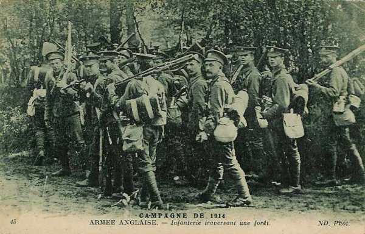
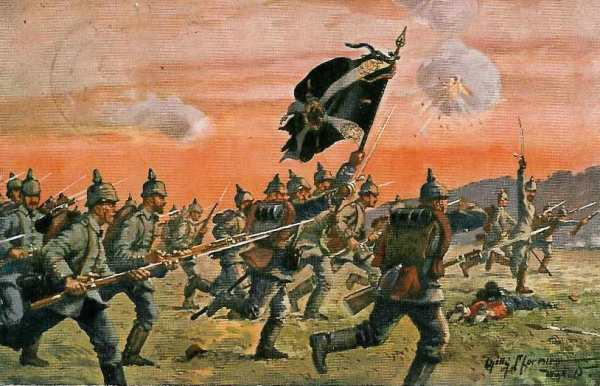
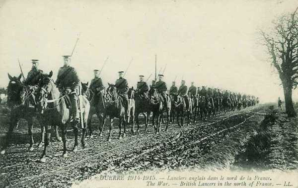

# Combat d’Elouges - Audregnies (24 août 1914)

Ce combat a eu lieu pendant la retraite de l’armée anglaise. Une charge de cavalerie tente de dégager les fantassins, fortement pressés par ls Allemands nettement plus nombreux.

### Cadre du combat

Le combat d’Elouges fait suite à la bataille de Mons. La Ie armée allemande se lance à la poursuite de l’armée anglaise en retraite. C’est au cours de ce combat qu’a lieu une charge du 9e lanciers et la destruction presque totale du régiment des Cheshire, qui, n’ayant pas reçu l’ordre de retraite, s’est accroché à ses positions jusqu’à être encerclé.

### Les forces en présence

**Armée anglaise**

_Division  de cavalerie
_Deux régiments de la 7e brigade d’infanterie : 1e Norfolk et 1e Cheshire

**Armée allemande**

**4e C.A. : (Magdeburg), général Sixt von Arnim**

_Général Sixt von Arnim_
_Collection privée_

7e division d’infanterie : général Riedel

| Unité | Commandant | Régiments |
| --- | --- | --- |
| 13.Infanterie-Brigade |  | Infanterie-Regiment Nr. 26 (Magdeburg)3. Magdeburgisches Infanterie-Regiment Nr. 66 (Magdeburg) |
| 14.Infanterie-Brigade |  | Infanterie-Regiment Nr. 27 (Halberstadt)5. Hannoversches Infanterie-Regiment Nr. 165 (Quedlimburg) |
| Cavalerie divisionnaire |  | "1/2" Magdeburgisches Husaren-Regiment Nr. 10 (Leobschütz) |
| 7. Feldartillerie-Brigade |  | Feldartillerie-Regiment Nr. 4 (Magdeburg)Altmärkisches Feldartillerie-Regiment Nr. 40 (Burg) |

8e division d’infanterie : général Hildebrandt

| Unité | Commandant | Régiments |
| --- | --- | --- |
| 15.Infanterie-Brigade |  | Füsilier-Regiment Nr. 36 (Halle a.S)Anhaltisches Infanterie-Regiment Nr. 93 (Dessau)Magdeburgisches Jäger-Bataillon Nr. 4 (Naumburg a.S.) |
| 16.Infanterie-Brigade |  | 4. Thüringisches Infanterie-Regiment Nr. 72 (Torgau)8. Thüringisches Infanterie-Regiment Nr. 153 (Altenburg) |
| Cavalerie divisionnaire |  | "1/2" Magdeburgisches Husaren-Regiment Nr. 10 (Stendal) |
| 8. Feldartillerie-Brigade |  | Torgauer Feldartillerie-Regiment Nr. 74 (Torgau)Mansfelder Feldartillerie-Regiment Nr. 75 (Halle a.S.) |

### Le terrain

Le terrain du combat forme un parallélépipède de 3km du nord au sud et de 4,5 km d’ouest en est. Il est délimité au nord par la grand’ route de Mons à Valenciennes, au sud par la route d’ Elouges à Audregnies, à l’ouest par la vallée de la Honnelle et à l’est par la route d’Elouges à Thulin.

Le champ de bataille est traversé par une voie locale de chemin de fer, allant d’Elouges à Quiévrain  et desservant un charbonnage. Parallèlement à la Honnelle court la chaussée de Brunehaut, qui coupe la grand’ route de Mons à Valenciennes à l’est de Quiévrain. Il y a une sucrerie le long de la chaussée de Brunehaut, au nord d’Audregnies et plusieurs terrils à l’est de celle-ci.

_Armée anglaise traversant une forêt_
_Collection privée_

La position d’Audregnies est favorable à la défensive. L’attaque allemande doit se dérouler sur un terrain plat vers une colline s’étendant du nord est d’Audregnies vers Elouges.

### Dispositif anglais

Deux batteries prennent position derrière la colline, le long de la route d’ Elouges à Angre, un village au sud est d’Audregnies. La batterie 119 occupe le flanc droit, près de la ligne de chemin de fer du charbonnage et la batterie L se trouve à gauche, près d’Audregnies.

Les deux régiments de cavalerie se trouvent derrière Audregnies, au début de la route romaine. Le 9e lanciers occupe la droite

- Trois compagnies des Norfolk tiennent le front entre la route Elouges - Baisieux et le chemin de fer du charbonnage, la quatrième est près du pont de la route Elouges - Audregnies.

- Les Cheshire sont à leur gauche, leur front s’étendant jusqu’aux faubourgs nord d’Audregnies.

Deux mitrailleuses sont placées dans une habitation abandonnée. Elles disposent d’une vue excellente sur le terrain et sur la route romaine. Les bâtiments principaux sont un moulin et une sucrerie.

Les hommes n’ont pas le temps de creuser des tranchées mais utilisent les accidents du terrain. Comme la route fait des ondulations, aucune compagnie ne peut voir l’autre. Comme le front à occuper est assez étendu pour l’effectif, les hommes sont disposés à de grands intervalles l’un de l’autre. Le champ de tir, constitué de champs de blé est assez favorable.

Il y a une contradiction dans les ordres donnés aux Norfolk et aux Cheshire : les Norfolk ont reçu une mission de flanc-garde et l’autorisation de retraiter si nécessaire, les Cheshire celle de résister à tout prix.

### Déroulement du combat

**En matinée :**

- Les Allemands s’approchent en confiance vu leur grande supériorité en effectif : tout le 4e C.A., avec
  La 8e division à l’ouest, venant de Quiévrain et de Quiévrechain, avec 9 batteries suivant la route de Mons.

_Régiment allemand à l’attaque_
_Collection privée_

- La 7e division à l’est, qui traverse la route et la voie de chemin de fer au sud de Thulin et se dirige vers Elouges.

**12h30 :**

Subitement, un feu d’artillerie et de mousqueterie se déchaîne, provenant du nord-ouest et signale que les Allemands commencent leur attaque. Celle-ci se développe en deux parties, l’une provenant de Quiévrain,  et l’autre venant de Baisieux, au nord-ouest d’Audregnies.

Les mitrailleuses ouvrent le feu en tirant à 700 m vers un avion survolant les positions britanniques. Très peu de temps après, un canon anglais est mis hors de combat.

La 119e batterie anglaise concentre son feu  sur la ligne de batteries allemandes sur la grand’ route vers Quiévrain et la batterie L tire sur les 72e et 93e régiments d’infanterie, quand ils débouchent des lisières sud de Quiévrain.

La canonnade allemande tire à une portée de 1.800 m.

Les 72e et 26e régiments passent à l’attaque en masses serrées comme à Mons, tirant debout, le fusil appuyé sur la hanche.

Du côté anglais, Allenby (commandant de la cavalerie) est appelé à la rescousse par Fergusson (commandant de la 7e brigade).

Le général de Lisle (2e brigade de cavalerie) ordonne au commandant du 9e lanciers d’attaquer à cheval vers le nord pour prendre l’offensive allemande de flanc et soulager les Cheshire. Pendant ce temps, une batterie anglaise prend position à l’est d’Audregnies. Elle dispose d’un bon champ de tir à travers les champs de blé en direction de Quiévrain.

**12h45 :**

Le 9e lanciers, renforcé de pelotons du 4e dragons, galope vers l’infanterie allemande, qui se trouve à 1,8 km. Il traverse une nappe de balles tirées par l’infanterie. Les shrapnells de l’artillerie allemande ont peu d’effet sur un objectif qui se déplace rapidement.

La charge se voit arrêtée par une clôture en fil de fer le long de la sucrerie. Les cavaliers s’égaillent dans toutes les directions et certains chevaux trébuchent ensuite sur les voies de chemin de fer.

_Lanciers anglais_
_Collection privée_

Les cavaliers se dirigent vers la droite, certains se mettant à couvert derrière la sucrerie et les terrils. Les pertes des Anglais sont de 250 hommes et 300 chevaux.

Les Allemands, un instant surpris, reprennent leur avance. Les canons de la 119e batterie anglaise doivent être évacués, tirés par les hommes. Le major Alexander recevra la Victoria Cross pour un acte de bravoure en évacuant les canons.

La charge a eu peu d’effet matériel et a simplement retardé quelque peu l’avance allemande.

**16h :**

Craignant d’être tournés par la droite, les Anglais se préparent à la retraite, mais cet ordre ne parvient pas aux Cheshire. Leur flanc est enveloppé par le 36e fusilier et le 153e régiment d’infanterie.

La batterie L a tiré 450 obus et il ne lui reste que peu de munitions. Les canons doivent être évacués par les hommes.

**18h30 :**

La plupart des Cheshire après avoir tenté vainement de se retirer au contact avec les Allemands sont fait prisonniers après avoir cessé le feu. Il ne reste que 40 hommes non blessés. Le régiment qui comptait 1000 hommes au début de la guerre n’en compte plus que 200 le soir du combat.

Les Norfolks ont perdu 250 hommes, la 119e batterie trente hommes, La division de cavalerie 250 hommes

Audregnies est évacué.

### Conclusion

Le combat d’Elouges a été livré par les Anglais dans une proportion de 1 à 4 : 2 régiments d’infanterie anglais contre deux divisions allemandes. La première charge de cavalerie anglaise de la guerre a été tentée mais le terrain ne se prête plus aux charges de cavalerie à cause des nombreux obstacles. A la suite de cet engagement, les Anglais devront poursuivre leur retraite jusqu’à la Marne.