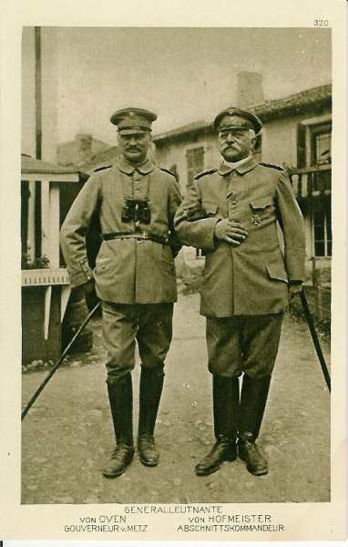
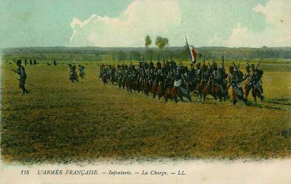
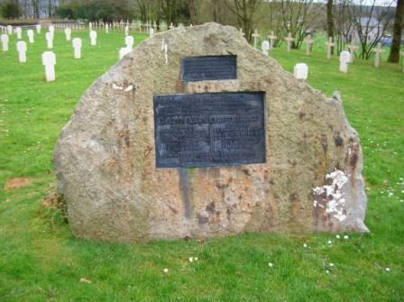
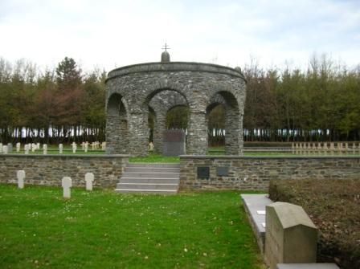
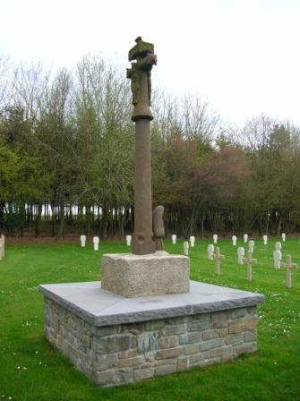

# Combat de Maissin (22 août 1914)

Le combat de Maissin est un épisode de la bataille de Longwy - Neufchâteau, mettant aux prises le 11e C.A. français contre une partie du 18e C.A. allemand.

### L’ordre d’offensive

- Les ordres pour le 22 sont : Le 11e C.A. marchera sur Maissin en deux colonnes :
  à droite, la 22e division d’infanterie, par l’est de Paliseul.
  à gauche la 21e division par l’ouest de Paliseul, Opont, Our.

### Les forces en présence

**Armée française**

IVe armée française (de Langle de Cary)

11e C.A. (Nantes) : général Eydoux

_Général Eydoux (11e C.A.)_
_Collection privée_

21e division : général Radiguet

| Unités | Commandant | Régiments |
| --- | --- | --- |
| 41e brigade | de Teyssières | 64e R.I. (Ancenis / Bouyssou)65e R.I. (Nantes / Balagny) |
| 42e brigade | Lamey | 93e R.I. (La Roche-sur-Yon / Retet)137e R.I. (Fontenay-le-Comte / de Marolles) |
| Eléments divisionnaires |  | 2e régiment de chasseurs à cheval (un escadron - Pontivy)51e R.A.C. (Nantes / Morizot) |

22e division : général Pambet

| Unités | Commandant | Régiments |
| --- | --- | --- |
| 43e brigade | Costebonel | 62e R.I. (Lorient / Costebonel)116e R.I. (Vannes / Estrabou) |
| 44e brigade | Chaplain | 19e R.I. (Brest / Chapes)118e R.I. (Quimper / François) |
| Eléments divisionnaires |  | 2e régiment de chasseurs à cheval (un escadron - Pontivy)35e R.A.C. (Vannes) |
| Réserves |  | 293e R.I. (La Roche-sur-Yon / Degrées du Loup)317e R.I. (Le Mans / Magnam)28e R.A.C. (Vannes / Darde)3e régiment d’artillerie à pied (Brest) |

La 22e division sera surtout concernée.

**Armée allemande**

IVe armée allemande (duc de Wurtemberg)

**18e C.A. (Frankfurt a/m) : général von Schenk**

_Général von Schenck (18e C.A.)_
_Collection privée_

21e division : général von Oven

_Général von Oven (à gauche)_
_Collection privée_

| Unités | Commandant | Régiments |
| --- | --- | --- |
| 41. Infanterie-Brigade |  | 1. Nassauisches Infanterie-Regiment Nr. 87 (Mayence)2. Nassauisches Infanterie-Regiment Nr. 88 (Mayence) |
| 42.Infanterie-Brigade |  | Füsilier-Regiment Nr. 80 (Wiesbaden)Infanterie-Regiment Nr. 81 (Francfort) |
| Cavalerie divisionnaire |  | Thüringisches Ulanen-Regiment Nr. 6 (Hanau) |
| 21. Feldartillerie-Brigade |  | 1. Nassauisches Feldartillerie-Regiment Nr. 27 (Mayence)2. Nassauisches Feldartillerie-Regiment Nr. 63 (Francfort) |

25e division : général Kühne

| Unités | Commandant | Régiments |
| --- | --- | --- |
| 49. Infanterie-Brigade |  | Leibgarde-Infanterie-Regiment Nr. 115 (Darmstadt)Infanterie-Regiment Nr. 116 (Mayence) |
| 50. Infanterie-Brigade |  | Infanterie-Leibregiment Nr. 117 (Mayence)Infanterie-Regiment Nr. 118 (Worms) |
| Cavalerie divisionnaire |  | Magdeburgisches Dragoner-Regiment Nr. 6 (Mayence) |
| 25. Feldartillerie-Brigade |  | 1. Großherzoglich Hessisches Feldartillerie-Regiment Nr. 25 (Darmstadt)2. Großherzoglich Hessisches Feldartillerie-Regiment Nr. 61 (Darmstadt) |

- Le C.A. est en outre appuyé par
  Un tiers de régiment de Fussartillerie (artillerie lourde)
  La 27e escadrille d’aviation

### 22 août

**07h :**

Eclairant les colonnes d’infanterie, les cavaliers du 2e chasseurs français atteignent Maissin. Tout de suite, c’est le choc brutal contre l’infanterie de la 25e division allemande.

**En matinée :**

L’avant-garde de la 22e division française, le 19e R.I., quitte Les Hayons. Après une courte halte à Paliseul, les 1e et 3e bataillons marchent en direction de Maissin, tandis que le 2e bataillon part à droite sur la route de Framont.

**12h :**

Les 1e et 3e bataillons du 19e R.I. quittent la route à hauteur de la ferme de Bellevue et entrent en colonnes de section par quatre dans les bois d’Hautmont. Ils y rencontrent les cavaliers du 2e chasseurs qui, après avoir occupé Maissin tôt dans la matinée, ont dû se replier dans le bois d’Houtmont suite à un combat contre l’infanterie allemande, venant de Villance.

Le général Pambet ordonne aux 1e et 3e bataillons du 19e R.I. de ne pas bouger du bois d’Hautmont avant que les deux groupes du 25e R.A.C. entrent en action mais cet ordre est ignoré.

**12h30 :**

Les tambours et clairons sonnent la charge et, drapeau déployé, deux bataillons s’élancent dans la direction de Maissin, baïonnette au canon. Ils franchissent les 400 m de prairie séparant les bois d’Hautmont du village. Un instant surpris, les Allemands se ressaisissent et bombardent d’obus de 77 la lisière du bois d’Hautmont et la prairie. Les mitrailleuses cachées dans le village de Maissin font beaucoup de dégâts dans les rangs du 19e R.I.

_Infanterie française chargeant_
_Collection privée_

**En début d’après-midi :**

Toute la 22e division est engagée. Les 1e et 3e bataillons du 19e R.I. ont reçu l’appui du 35e R.A.C. Un groupe est installé aux environs de la ferme de Bellevue, l’autre vers la ferme de l’Almoine.

Le 2e bataillon du 19e R.I. a quitté précédemment le reste du 19e R.I. à Paliseul pour se rendre au moulin de Villance par la route de Framont, afin de couvrir l’aile droite du régiment.

Des troupes allemandes, venant de Maissin, tentent une attaque qui échoue. Le chef de bataillon français, le colonel de Laage de Meux, décide d’attaquer en direction de Villance. Au cours de cette action, il est mortellement blessé et remplacé par le capitaine Lallemand. Celui-ci, considèrant la mission comme accomplie, décide de se replier sur Framont et de rejoindre les 1e et 3e bataillons du 19e R.I., toujours engagés à la lisière sud de Maissin.

Les Allemands tentent d’opérer une percée sur le flanc droit et se rapprochent de la route de Maissin - Paliseul.

**15h :**

Le 19e R.I. se bat dans Maissin en contenant les assauts allemands. Des compagnies des 93e, 116e, 118e et 137e R.I. arrivent en renfort et progressent pied à pied pour dégager Maissin.

**18h :**

Deux contre-attaques françaises sont menées par 500 hommes des 62e, 116e et 118e R.I. sous les ordres du général Duroisel. Une autre contre-attaque menée par le 62e R.I. repousse les Allemands au nord du bois d’Hautmont.

**19h :**

Par une attaque à la baïonnette au son des clairons, les fantassins français rejettent les Allemands du village. Pendant ce temps, les 62e, 64e et 65e R.I. luttent pour chaque crête de bois.

**En fin de journée :**

La 21e division occupe le plateau au nord-ouest de Maissin, la 22e occupe le village. Toutefois, le général Eydoux a l’impression d’être trop en flèche par rapport aux autres C.A. et craint l’encerclement. Il doit se résigner à donner l’ordre de retraite. Les unités se regroupent et se reforment à hauteur du ruisseau de Framont.

Le 2e bataillon du 19e, qui se trouve à Paliseul, reçoit l’ordre de s’établir à la sortie du village et de couvrir le repli du 11e C.A. L’ordre de repli n’est pas parvenu aux centaines d’hommes qui combattent dans Maissin. Ce sont les 1e et 3e bataillons du 19e, une section de mitrailleuses du 118e, la 1e compagnie du 116e et quatre compagnies du 62e. Ces troupes vont continuer à repousser les attaques allemandes.

### 23 août

**06h :**

Ordre est donné de rompre le combat et de battre en retraite vers Paliseul.

**07h :**

Le repli commence avec le 1e bataillon du 19e R.I., qui arrive à Bouillon vers 13h, sans rencontrer de difficultés.

**09h :**

Le 3e bataillon du 19e R.I. décroche avec les hommes des 118e et 62e R.I.

### Conclusion

Le 19e R.I. s’est lancé dans une attaque à découvert sans préparation d’artillerie. C’est une erreur commise fréquemment au début de la guerre, et qui sera évitée par la suite. Ce genre d’attaques faisait la part trop belle aux Allemands retranchés et munis d’armes automatiques. Les pertes françaises se chiffrent à 99 officiers et 4.085 hommes (rien que la 44e brigade perd 2.000 fantassins), les pertes allemandes à 95 officiers et 3.581 hommes, surtout pour la 25e division. Le régiment de la garde grand-ducale de Hesse perd à lui seul 27 officiers et 760 fantassins.

### Souvenirs du combat

_Maissin : le monument du 11e C.A._
_Photo de l’auteur_

_Maissin : le monument franco-Allemand_
_Photo de l’auteur_

_Maissin : calvaire breton_
_Photo de l’auteur_