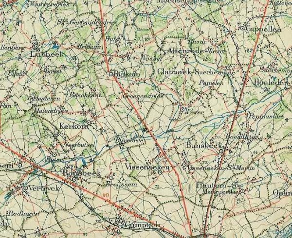
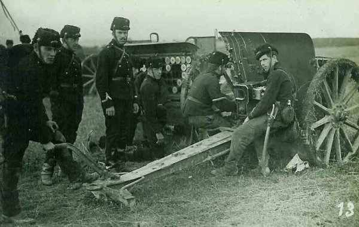
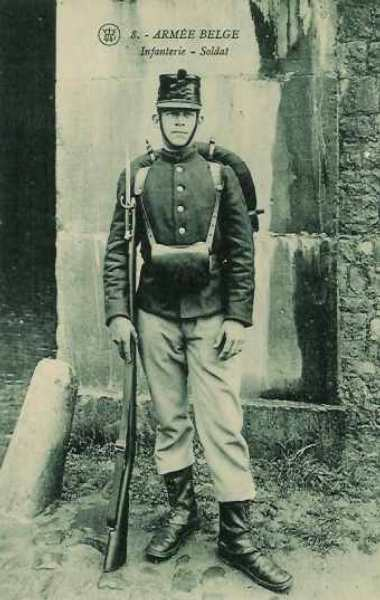
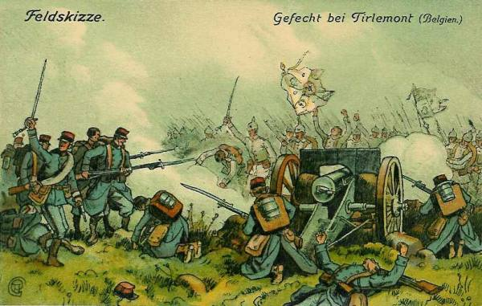
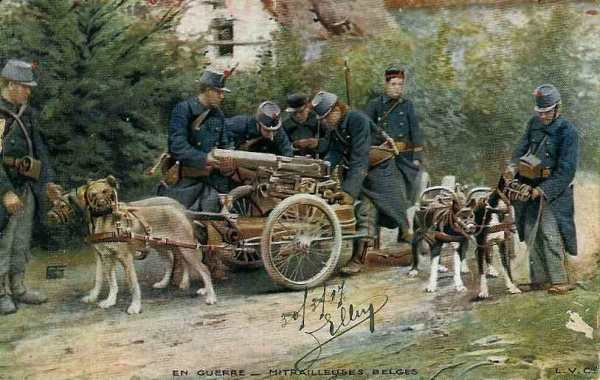

# Combat de Sint-Margriete-Hautem (18 août 1914)

L’armée belge se trouve sur le chemin de la Ie armée allemande. Forte de six divisions, elle a en face d’elle six corps d’armée actifs suivis de cinq corps d’armée de réserve. Au risque d’être encerclée, elle doit retraiter vers la place forte d’Anvers. Les Allemands réussissent à accrocher l’arrière-garde. Le 22e régiment de ligne doit se sacrifier pour permettre au reste de l’armée de se dégager et perd 2.200 hommes.

_Région Sint-Margriete-Hautem_
_Carte E.M. 1907_

### Les forces en présence

L’armée belge va devoir affronter la Ie armée allemande (von Kluck), infiniment plus puissante.

Les forces allemandes se composent de six C.A. suivie par cinq C.A.R. Trois D.C. les précèdent.

- 2e, 4e et 9e C.A. qui se dirigent sur l’aile gauche de l’armée entre Diest et Tirlemont. Ces C.A. sont flanqués par la 2e D.C. qui s’avance entre la Grande Nèthe et le Démer.

- 3e, 7e et 10e C.A. qui, ayant passé entre Liège et Huy de la rive sud de la Meuse à la rive nord, marchent vers le front Jodoigne - Namur. Ils sont précédés par les 4e et 9e D.C. qui se dirigent vers Wavre et Gembloux.

Ces 6 corps d’active sont suivis par 5 C.A.R.

Contre cette masse considérable, la Belgique ne peut opposer que six divisions et une division de cavalerie.

Ordres de retraite de l’armée belge

- La 1e division formant le centre de l’armée à Sint-Margriete-Hautem, Kumptich et Oirbeek est la plus menacée. Elle reçoit l’ordre d’éviter le combat et de se replier immédiatement sur Boutersem.

- La 2e division en position à Sint-Joris-Winghe doit se maintenir en place. Une brigade de la 3e division ira renforcer sa gauche à Aarschot.

- La 3e division en seconde ligne doit se replier sur Boortmeerbeek - Malines.

- La 5e division doit se replier à Beauvechain.

- La 6e division doit se replier à Kortenberg.

_Batterie belge_
_Collection privée_

**5h :**

L’armée belge prend ses positions d’alerte.

**7h :**

A 7h, Budingen et Geet-Betz, défendus par deux escadrons du 1e régiment de guides, sont attaqués par un fort détachement d’infanterie qui passe la Gette à 10h. Halen est canonné à partir de 7h30.

**7h45 :**

Les avant-gardes des 3e et 4e C.A. attaquent les postes de cavalerie belges sur la Gette.

La 1e division belge n’a pas encore reçu les ordres pour se replier sur Bautersem. La 3e brigade mixte tient Tienen et Oirbeek ; la 2e brigade les hauteurs à l’est de Sint-Margriete-Hautem.

Quand parvient l’ordre de retraite, le commandant de la division prescrit que la 2e brigade mixte constituera l’arrière-garde et couvrira le mouvement.

_Fantassin belge_
_Collection privée_

**9h15 :**

L’infanterie allemande aborde la Gette et y jette des ponts. A Diest, deux pelotons cyclistes et une compagnie de pionniers tiennent tête pendant une heure et demie à une brigade de troupes de toutes armes. La D.C. belge doit se retirer au nord de Sint-Joris-Winghe où la 2e division d’armée avait été envoyée pour prolonger la gauche de l’armée.

Plus au sud, un corps allemand marche contre la première division. Les Allemands occupent Tirlemont et attaquent de front et de flanc les positions de Sint-Margriete-Hautem. La 2e brigade résiste opiniâtrement et permet  au reste de la division de se dégager, mais elle est décimée.

**14h :**

Neerlinter est attaqué par la tête du 3e C.A. L’artillerie belge découvre des troupes de toutes armes vers Wommersom et les deux batteries en position à l’ouest de Sint-Margriete-Hautem ouvrent le feu. Elle est immédiatement écrasée par les projectiles de l’armée allemande.

_Combat près de Tienen_
_Collection privée_

Le 22e régiment de ligne se voit encerclé par les feux. Le 3e C.A. monte à l’assaut. Le régiment décimé se retire vers Vissenaken. Il a perdu 1.250 hommes sur 2.100.

**16h :**

Cinq compagnies du 3e de ligne défendent les entrées de Tienen. Elles sont réduites de moitié quand elles reçoivent vers 16h l’ordre de retraite.

**18h :**

Le 9e C.A. débouche de Tienen mais se heurte à la résistance inattendue du 2e de ligne qui couvre le repli du 22e.

_Mitrailleuse belge_
_Collection privée_

**Dans l’après- midi :**

Le Roi Albert décide la retraite de l’armée vers le nord-ouest, en direction de la place forte d’Anvers.

**19h30 :**
L’ordre est donné de gagner dès le lendemain à l’aube la rive gauche de la Dyle et d’arrêter l’armée sur le front sur la ligne Neeryse - Leuven - Rotselaer.

Le combat a coûté à l’armée belge 2000 hommes et 5 canons.