# Combat de Dinant (15 août 1914)

L’armée de Lanrezac (Ve) est remontée jusqu’à la Sambre. Pour couvrir son flanc, elle doit garder la Meuse. L’armée de von Hausen fait mouvement vers l’ouest et doit traverser la Meuse. Elle est précédée par la cavalerie et les chasseurs. Une rencontre se produit à Dinant.

### L’aspect de Dinant

_Combat de Dinant_
_Collection privée_

La ville proprement dite est située sur la rive est de la Meuse, dans une échancrure de la falaise. La Collégiale s’élève à l’entrée du pont qui unit Dinant au faubourg Saint-Médard, sur la rive ouest. Immédiatement au-dessus de l’église surgit le rocher sur lequel est construite la citadelle.

Les hauteurs de la rive ouest sont moins escarpées que celles de l’est de la Meuse. Dans cette partie de son cours, la Meuse est longée par une voie ferrée qui suit la rive ouest ou gauche.

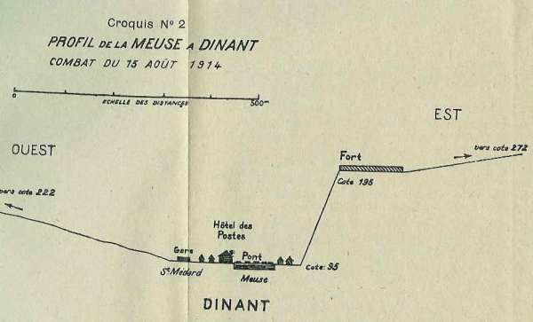
_Profil de Dinant_
_Ce schéma montre la position dominante de l’armée allemande par rapport à ses adversaires._

Outre le pont qui traverse la Meuse à Dinant, il en existe en 1914 un autre, en aval, à Bouvignes. La disposition des lieux fait que les habitations de la ville et des faubourgs s’allongent sur les deux rives et surtout sur la rive droite.

**[Lien vers croquis](../img/dinant5.jpg)**

### Forces en présence

- Du côté français :
  148e R.I.
  3e bataillon du 33e R.I.
  8e R.I. (qui interviendra par la suite)
  73e R.I.(qui appuiera le 8e R.I.)

- Du côté allemand :
  12e bataillon de chasseurs de Freyberg.
  11e bataillon des Garde-Schützen.
  13e bataillon des Garde-Jäger.

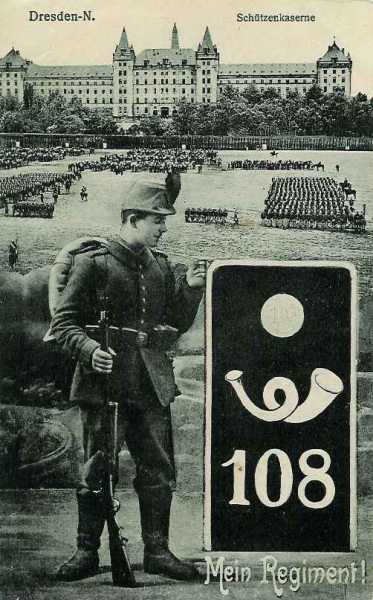
_Carte régimentaire des chasseurs saxons_
_Collection privée_

### Les événements

Des reconnaissances allemandes s’étaient montrées dès le 6 août sur la Meuse, vers Dinant et Anseremme.

Le 15 août a lieu une tentative sérieuse. Deux divisions de cavalerie, la 5e et celle de la Garde, appuyées par plusieurs bataillons dont les 12e et 13e bataillons de chasseurs se présentent face à Dinant. Il y a dans cette ville deux compagnies du 148e.Un bataillon du 33e et une section de mitrailleuses occupent la citadelle sur la rive droite. Des éléments de la 2e division (général Deligny), sont établis sur la rive gauche.

**5h45 :**

L’artillerie allemande, en position au mamelon 272 à l’ouest de Sorinnes tire un premier coup de canon.
Le commandant de la 12/33e dispose ses sections en avant de la citadelle, une section au nord-est du fort, une section à la porte de la citadelle et les 3e et 4e sections au nord et au sud de la route de Ciney.

**6h :**

Les batteries à cheval du 5e régiment d’artillerie allemand font pleuvoir une avalanche d’obus de 77 sur la citadelle.

Les Allemands démasquent leur infanterie. Lentement, elle s’infiltre dans les couverts qui garnissent le plateau à l’est de la citadelle. Le capitaine Bataille (12/33) dont le chemin de retraite se réduit à l’escalier qui descend au pont,demande si l’évacuation ne s’impose pas. Ordre lui est donné de se maintenir.

**10h :**

Les chasseurs s’approchent de plus en plus des crêtes. Ils ne sont plus qu’à 50 mètres des avant-postes de la 12e compagnie.

**10h45**

Les Allemands parviennent aux murailles extérieures et tentent de monter sur les superstructures. Ils établissent une mitrailleuse sur le chemin couvert et sur la tour de Mont-Fat. Malgré ce feu intense, les deux compagnies réussissent à redescendre l’escalier de la citadelle et à regagner la rive gauche.

**11h :**

Le général Deligny (2e D.I.) ordonne au 27e R.A.C. de se mettre en batterie.

**11h40 :**

La citadelle est aux mains des Allemands. Ils vont tirer des meurtrières et rendre la position intenable aux défenseurs de la rive gauche.

Les deux compagnies (10e et 12e) du 148e R.I. doivent s’abriter derrière des parapets trop bas sur la rive gauche et dans des maisons. Les obus tombent sur celles-ci et le Grand Hôtel des Postes.

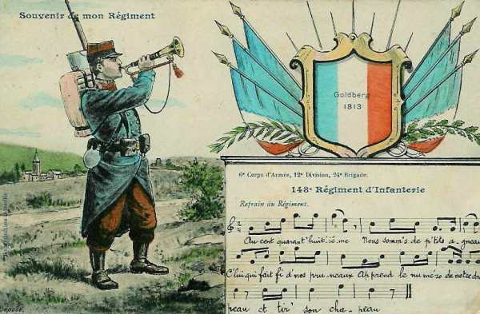
_148e R.I._
_Collection privée_

L’évacuation de Dinant est complète sauf pour deux sections isolées aux issues nord et sud de la ville.

Les chasseurs à pied saxons desccendent la rue Saint-Jâcques et se répandent dans les rues de la rive droite.

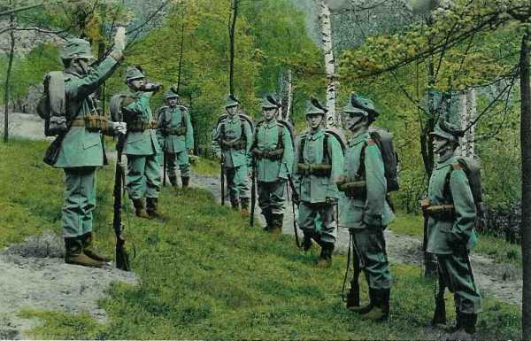
_Chasseurs saxons_
_Collection privée_

**13h20 :**

Le commandant de la 2e D.I., le général Deligny, sur l’ordre du général Franchet d’Esperey, décide de reprendre l’attaque de la ville.

**14h :**

Le 27e R.A.C. est engagé tout entier et le 3e groupe, en position à l’est d’Onhaye, bat de schrapnells les colonnes allemandes visibles sur la crête opposée.
Une batterie du 1e groupe du 15e R.A.C. prend la citadelle pour cible. Le C.C. Sordet met à la disposition du 1e C.A. le 45e R.I. et une brigade de dragons de la 1e D.C.

Le général Deligny organise la contre-attaque. Il fait avancer les batteries le plus près possible de la Meuse (cote 222) afin de déloger les Allemands de la citadelle et des crêtes de la rive droite.

**16h :**

Les deux bataillons du 8e R.I. pénètrent dans le faubourg Saint-Médard, appuyés par le 73e R.I. Ils atteignent le fond de la vallée et se regroupent le long du chemin de fer.

Les bataillons traversent la Meuse et se portent à l’assaut de la citadelle. Le drapeau allemand est abattu aux acclamations de la population, qui chante la Marseillaise.

A la citadelle, les Français font une vingtaine de prisonniers. Au cours de l’action, le 8e R.I. a eu 9 officiers blessés, 54 sous-officiers ou soldats perdus.

Les Allemands se retirent. Ce combat leur aurait coûté 3.000 hommes hors de combat.

Sur la route de Ciney, le 2e escadron du 6e chasseurs à cheval entame la poursuite des Allemands, en retraite vers la ligne Sovet - Lisogne - Foy-notre-Dame - Achène.

Les pertes globales du 1e C.A. ont été assez lourdes : 23 officiers et 1.074 hommes hors de combat. La tentative du C.C. de von Richthofen de déboucher au-delà de la Meuse a échoué

### Les régiments qui ont participé au combat :

**[8e R.I. (Saint-Omer)](article_09_114.md)**

**[33e R.I. (Arras)](article_09_139.md)**

### Les souvenirs des combats

Les différents monuments présentés ici se trouvent à l’arrière de la citadelle. Il existe également sur le pont une plaque rappelant que le capitaine de Gaulle a été blessé au combat de Dinant.

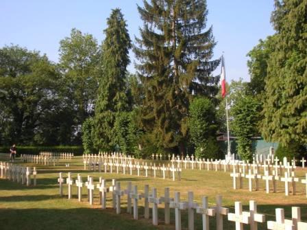
_Dinant - cimetière français de la citadelle_
_Photo de l’auteur_

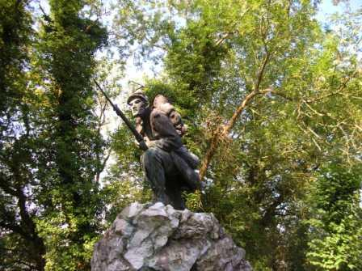
_Dinant - monument français_
_Photo de l’auteur_

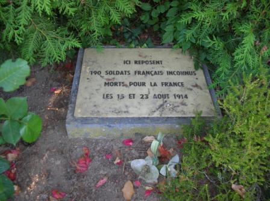
_Dinant - ossuaire français_
_Photo de l’auteur_

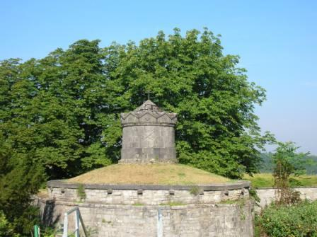
_Dinant - ossuaire allemand_
_Photo de l’auteur_

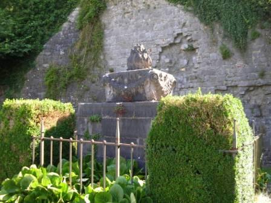
_Dinant - monument allemand_
_Photo de l’auteur_

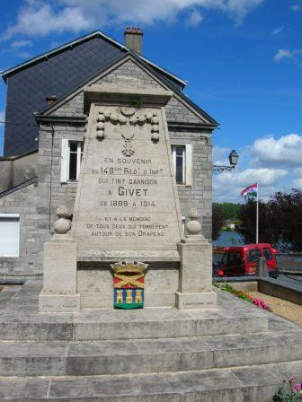
_Givet - monument du 148e R.I. qui a combattu à Dinant_
_Photo de l’auteur_

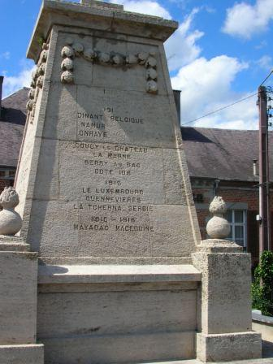
_Givet - monument du 148e R.I. mentionnant le combat de Dinant_
_Photo de l’auteur_

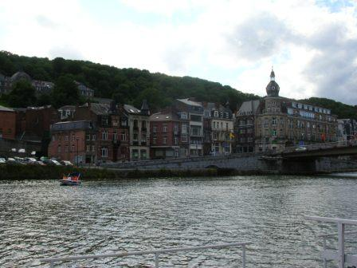
_Dinant - vue vers le faubourg St Médard (tenu par les Français)_
_Photo de l’auteur_

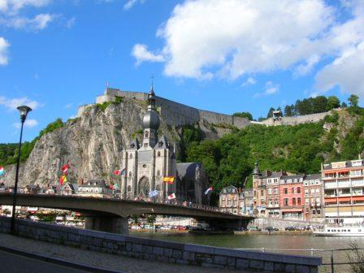
_Dinant - vue vers la citadelle_
_Photo de l’auteur_

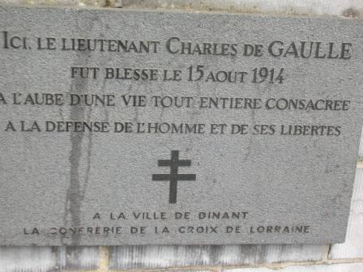
_Dinant - plaque commémorative du lieutenant de Gaulle_
_Photo de l’auteur_