# Combat de Rossignol (22 août 1914)

Ce combat est un épisode de la bataille de Neufchâteau. L’avant-garde de la IVe armée s’engage dans la forêt des Ardennes pour tenter de couper en deux l’armée allemande qui s’oriente vers l’ouest. La brigade coloniale pénètre dans la clairière de Rossignol mais tombe dans un traquenard.

### Circonstances

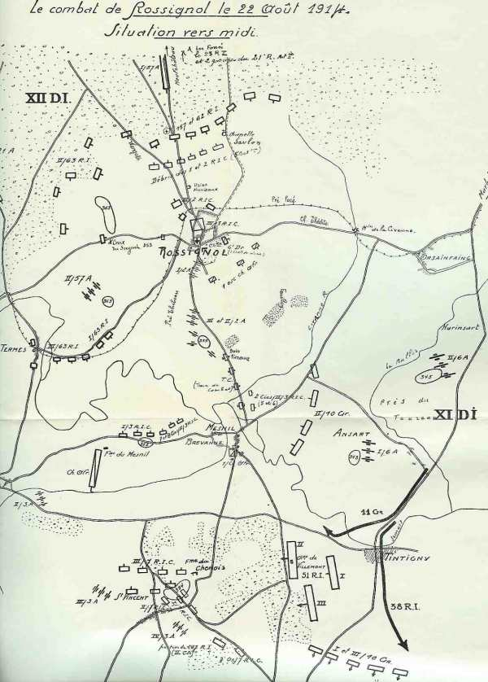
_Combat de Rossignol_
_Ancien croquis école de guerre_

Ce combat est un épisode de la bataille de Neufchâteau.
Joffre a réuni, à cheval sur la frontière franco-belge, entre Mézières et Virton, une IVe armée composée de six C.A.

Elle reçoit pour mission d’attaquer à fond le flanc gauche des colonnes allemandes de la IVe armée du duc de Wurtemberg.

### Forces en présence

**Du côté français**

Partie du Corps colonial : (Paris), général Lefebvre.

3e division d’infanterie coloniale (général Raffenel)

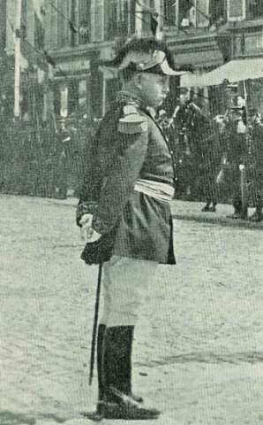
_Général Raffenel_
_3e division coloniale_

| Unité | Commandant | Régiments |
| --- | --- | --- |
| 1e brigade | Montignault | 1e R.I.C.,(Guérin),2e R.I.C.(Gallois) |
| 3e brigade | Rondony | 3e R.I.C. (Lamolle),7e R.I.C.(Mazillier) |

2e régiment d’ artillerie coloniale (Guichard-Monguers)|
3e chass. Afrique
6e régiment de dragons

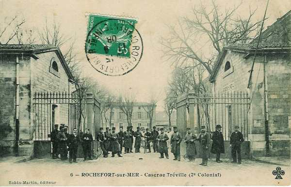
_Rochefort : caserne du 7e colonial_
_Collection privée_

**Du côté allemand**

Partie du 6e C.A. : (Breslau), général von Pritzelwitz

11e division d’infanterie (Breslau), général von Webern

| Unité | Commandant | Régiments |
| --- | --- | --- |
| 21. Infanterie-Brigade |  | Grenadier-Regiment Nr. 10Füsilier-Regiment Nr. 38 |
| 22.Infanterie-Brigade |  | Grenadier-Regiment Nr. 11Schlesisches Infanterie-Regiment Nr. 51Jäger-Regiment zu Pferde Nr. 11 |
| 11. Feldartillerie-Brigade |  | Feldartillerie-Regiment Nr. 6Schlesisches Feldartillerie-Regiment Nr. 42 |

12e division d’infanterie(Neisse), général Chales de Beaulieu

| Unité | Commandant | Régiments |
| --- | --- | --- |
| 23. Infanterie-Brigade |  | Infanterie-Regiment Keith Nr. 22Schlesisches Infanterie-Regiment Nr. 156 |
| 24. Infanterie-Brigade |  | Infanterie-Regiment Nr. 23Oberschlesisches Infanterie-Regiment Nr. 62 |
| 78. Infanterie-Brigade |  | Oberschlesisches Infanterie-Regiment Nr. 63Schlesisches Infanterie-Regiment Nr. 157 |
| 12. Kavallerie-Brigade |  | Husaren-Regiment Nr. 4Husaren-Regiment Nr. 6 |
| 44. Kavallerie-Brigade |  | Ulanen-Regiment Nr. 2Jäger-Regiment zu Pferde Nr. 11 |
| Feldartillerie-Brigade |  | Feldartillerie-Regiment von Clausewitz Nr. 21Oberschlesisches Feldartillerie-Regiment Nr. 57 |

### 21 août 1914

Le commandant de la 12e division allemande envoie un détachement (23e R.I., 3e escadron du 2e uhlans et de l’artillerie) pour tenir Neufchâteau jusqu’à l’entrée en ligne du 18e C.A.R.

### 22 août 1914

Le 6e C.A. allemand atteint

- Léglise et environs (12e D.I.)
  Thibésart et environs (11e D.I.)
  Habay-la-Neuve (3e D.C.)

Le 5e C.A. a sa division de droite, la 9e D.I. vers Etalle.

Du côté français, les avant-gardes de la IVe armée (de Langle de Cary) tiennent les débouchés de la Semois jusqu’à Izel.

Le 1e R.I.C. est aux avant-postes au nord de Saint-Vincent.

Le gros de la division a établi ses avant-postes vers les lisières sud de la forêt d’Orval et Merlanvaux.

La 8e division occupe Virton. La 5e brigade coloniale cantonne au sud de la forêt d’Orval et tient Jamoigne.

**6h :**

La 3e division coloniale (1e et 3e brigades) s’avance de Gérouville vers Neufchâteau.

L’avant-garde de la 3e division coloniale (6e dragons et 1e régiment d’infanterie avec de l’artillerie) quitte Saint-Vincent à 6h du matin, franchit la Semois au pont de Mesnil-Breuvanne vers 6h30 et atteint Rossignol. Le gros de la division, trois km en arrière, arrive à Saint-Vincent.

Du côté allemand, la 12e division marche également sur Rossignol. (Avant-garde composée du 157e R.I., 2e uhlans et d’une compagnie de Génie.

Les dragons français sont arrêtés  par les forces du 157e R.I. et font appel au 1e R.I.C. Le 157e R.I. allemand subit des pertes sévères.

**7h :**

Dès 7h, les cavaliers postés au mamelon 353 aperçoivent des colonnes françaises se diriger vers Rossignol. Le commandant de la 11e division fait poster des batteries au mamelon 360 à 1 km de Marbehan (est nord-est  de Rossignol) et au mamelon 345 (1 km au sud-ouest de Harinsart, est sud-est de Rossignol). Le 10e grenadiers occupe Orsainfaing (est de Rossignol).

L’artillerie ouvre le feu à 3000 m sur la colonne des Français au sud de Breuvanne (sud-est de Rossignol). Le II/6A est placé en batterie à 500 m au sud d’Harinsart et fait feu sur le pont de Breuvanne. Les grenadiers allemands ouvrent un feu violent sur l’artillerie française immobilisée sur la route vers Rossignol.

**7h30 :**

La tête de l’avant-garde dépasse Rossignol et s’engage dans la forêt de Neufchâteau. Elle est reçue par des coups de feu. L’infanterie se heurte à des tranchées dissimulées dans la forêt et doit les enlever par un assaut.

**8h 40 :**

La 63e R.I. s’oriente vers Termes pour s’emparer du mamelon 363 (1 km au nord-est de Termes) pour prononcer une attaque dans le flanc de l’adversaire posté au nord de Rossignol.

**9h :**

Le 2e régiment d’artillerie (3e division coloniale) a franchi la Semois au pont de Breuvanne. Il subit un bombardement au départ d’Harinsart.

Le commandant de ce régiment donne l’ordre de déployer des batteries

- à l’ouest de Rossignol et sur la crête de Rossignol - Termes.
  Sur la croupe Rossignol - Mesnil pour battre la forêt à l’est de Rossignol.
  2 km au sud de Rossignol avec pour mission de rechercher l’artillerie allemande tirant de l’est.

La situation de l’artillerie française est critique.

**10h :**

Le commandant de la 11e division d’infanterie allemande décide d’attaquer Bellefontaine (sud de Rossignol). Le 10e grenadiers attaquera Bellefontaine ; le 38e Fusiliers attaquera entre Saint-Vincent et Bellefontaine ; la 22e brigade face à l’ouest attaquera le flanc et les arrières des Français.

**10h30 :**

Le 3e R.I.C. est aperçu par les observateurs allemands. Il s’emploie à couvrir les lignes de communication des troupes engagées vers Rossignol.

- Le bataillon de tête poursuit sa route vers Rossignol.
  Le 2e bataillon doit tenir Mesnil-Breuvanne.
  Le 1e bataillon doit rester au sud de Mesnil Breuvanne.

Mais le pont de Mesnil Breuvanne est soumis à un violent feu d’artillerie. La plus grosse partie du régiment reste bloquée au sud de la rivière. La division est coupée en deux. Le 1e bataillon subit un feu de mitrailleuses venant du nord-est.

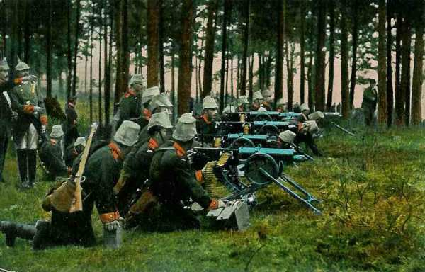
_Poste de mitrailleuses allemandes_
_Collection privée_

**10h 45 :**

Les éclaireurs du 63e R.I.C. atteignent le village de Termes. La colonne s’engage sur le chemin de Rossignol. Le 63e R.I.C. déploie son 3e bataillon le long du chemin de Termes à Rossignol.

Entre-temps, le gros de la 12e division allemande et la 3e division coloniale se déploient.

**11h :**

Le commandant de la 3e division coloniale, le général Raffenel, engage le 2e R.I.C. en soutien du 1e.

**11h30 :**

Comme le 157e régiment allemand ne progresse que péniblement, le commandant de la 12e division donne ordre d’appuyer ce régiment au moyen du 62e en gagnant la lisière sud de la forêt pour permettre le déploiement de l’artillerie.

Le commandant du 1e R.I.C. engage son bataillon de tête en le déployant à droite et à gauche de la route Termes - Rossignol sur un front d’environ 400 m. Celui-ci subit des pertes sévères.

Les Allemands débordent sur les flancs du dispositif français. Le commandant du 1e R.I.C. ordonne de se replier lentement et de prendre position sur la crête à 400 m de la lisière.

Le 3e chasseurs d’Afrique se porte vers l’est de Rossignol et reçoit l’ordre d’attaquer l’artillerie allemande en position sur le mamelon 343 à l’ouest d’Ansart. Il doit battre en retraite et son chef décide de recommencer l’attaque en passant par Breuvanne. L’opération ne réussit pas mieux. Canonné et fusillé le long de la route encombrée par des caissons d’artillerie, le régiment se réfugie au sud de la Semois.

**12h :**

Les Allemands s’emparent de la crête au nord de Rossignol. Les Français doivent retraiter vers Rossignol. L’artillerie allemande se déploie.

Les 157 et 62e et une partie du 23e régiment allemand voient leur progression arrêtée par les mitrailleuses françaises. Les Allemands amènent deux pièces d’artillerie qui prennent comme objectif le clocher de Rossignol.

**14h :**

Le 2e bataillon du 3e R.I.C. est décimé par l’artillerie allemande près du pont de Mesnil-Breuvanne.

Le III/51 progresse par la lisière nord du bois en direction de la ferme du Chenois (entre Tintigny et Saint-Vincent) mais son attaque est bloquée à 300 m  de la ferme et il faut faire appel à l’artillerie. Le I/6 d’artillerie ne peut franchir la Semois à Tintigny et lance des projectiles dans la région de Chenois. Les Allemands demandent du renfort et le 3e bataillon du 11e grenadiers vient au secours, avec une section de mitrailleuses. Le 7e R.I.C. subit des pertes sévères.

La 2e division coloniale de réserve (ouest de Montmédy) se porte aux Bulles (ouest sud-ouest de Rossignol) et attaque Termes. Le 2e bataillon est cloué sur place par les obus et les feux d’infanterie. Le 3e bataillon doit s’arrêter à 500 m du village de Termes.

**14h30 :**

Les Allemands reprennent l’attaque. Le II/62 aborde la crête de la chapelle de Savlon (nord nord-est de Rossignol), mais avec des pertes considérables Les derniers défenseurs français débordés se replient dans Rossignol.

**15h30 :**

Les Allemands poussent au sud de la Semois. Des patrouilles du I/62e vers Termes cherchent la liaison avec le 63e.

Le village est défendu principalement par les débris des 1e et 2e R.I.C.

Une seule section, celle du lieutenant Psichari, parvient à s’installer à la lisière nord du village pour tirer vers la chapelle Savlon. Ernest Psichari, écrivain français et petit-fils d’Ernest Renan, sera tué par la suite. Un obélisque a par la suite été dressé dans le village de Rossignol en comémoration de son sacrifice.

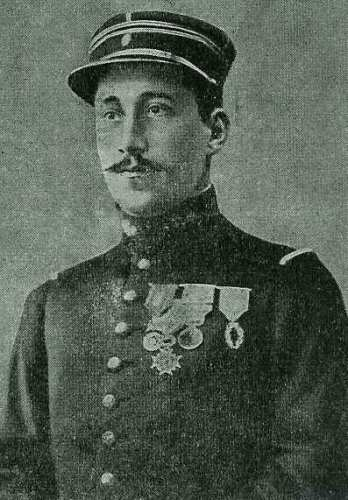
_Ernest Psichari_

**16h :**

Les unités des 157e, 62e et 23e régiments allemands se lancent à l’assaut du village. Les unités qui progressent à cheval sur la grand’ route sont fauchées par les mitrailleuses françaises. A l’ouest et à l’est, les Allemands parviennent à s’infiltrer. L’attaque se resserre autour du village et la retraite est coupée vers le sud. Une partie des Français décide de percer vers l’est. Une partie des hommes se porte vers Orsainfaing, mais la colonne est canonnée par l’artillerie allemande.

Cinq bataillons allemands se portent à l’assaut de la ferme du Chenois. Les Français refluent vers Saint-Vincent.

La moitié du village de Termes est aux mains du 3e bataillon de la 2e division coloniale de réserve, mais un ordre de repli parvient.

**17h :**

Les 157e, 23e et 62e R.I. allemands se reconstituent pour lancer un nouvel assaut à partir du nord de Rossignol. Ils sont appuyés par trois groupes d’artillerie. Les défenseurs de Rossignol sont canonnés à revers.

Au sud de la Semois, Mesnil et Breuvanne sont occupés par quatre compagnies des 51e et 11e grenadiers. La 22e brigade allemande s’est emparée de la ferme du Chenois et de Saint-Vincent.

**Chez les français**

Dans le village de Rossignol, les débris de la 1e brigade coloniale et le 3e bataillon du 3e régiment colonial sont pris au piège.

Au sud du village, le long de la route vers la Semois, l’artillerie divisionnaire ne peut pas manoeuvrer et est prise sous les feux convergents de l’artillerie et de l’infanterie allemandes.

A Bellefontaine, le gros de la 4e division soutient le choc de la 21e brigade allemande.

**17h30 :**

Les 157e, 62e et 23e régiments renouvellent leur attaque sur Rossignol.

**18h :**

Le village de Tintigny (sud sud-ouest de Rossignol) tombe aux mains des Allemands.

**19h :**

Les troupes françaises dans Rossignol sont complètement encerclées et l’artillerie divisionnaire doit être mise hors service.

**20h :**

Il ne subsiste rien de la 1e brigade coloniale ni du 2e régiment d’infanterie. Les deux autres bataillons ont recueilli un certain nombre d’isolés.

Les divisions coloniales se replient sur la ligne Soye - Jamoigne.

Lors du combat de Rossignol, une division entière a été anéantie suite à un encerclement rendant impossible toute retraite. La tactique allemande de se dissimuler dans les bois, de creuser des tranchées a permis de tendre une véritable embuscade.

### Les souvenirs des combats

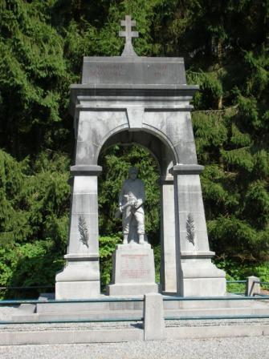
_Monument des troupes coloniales_
_Photo de l’auteur_

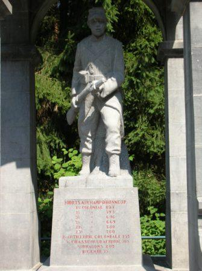
_Détail du monument_
_Photo de l’auteur_

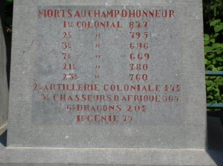
_Inscription sur le socle du monument_
_Photo de l’auteur_

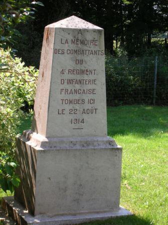
_Monument du 4e d’infanterie_
_Photo de l’auteur_

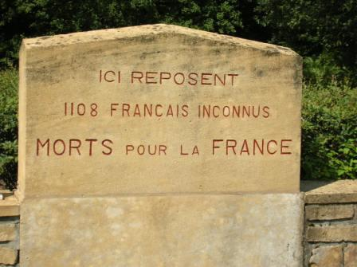
_Ossuaire_
_Photo de l’auteur_

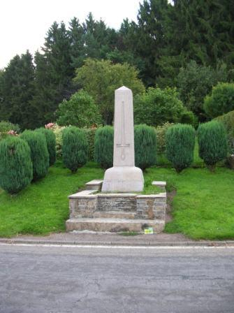
_Monument d’Ernest Psichari_
_Le monument fut élevé à l’endroit où Ernest Psichari a été tué
Photo de l’auteur_