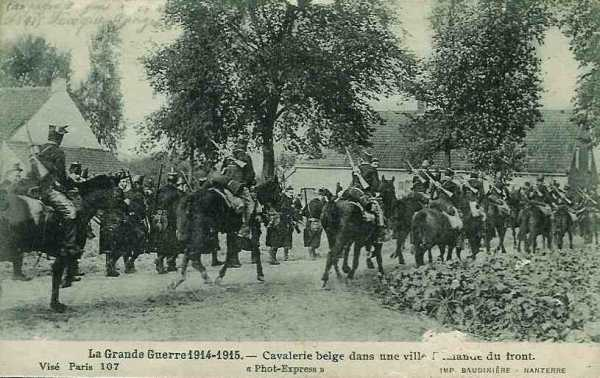
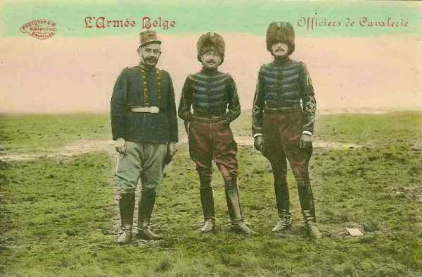
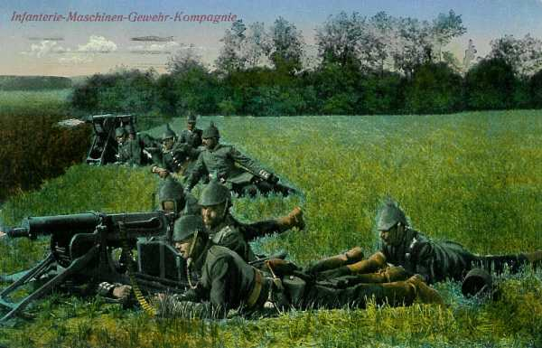
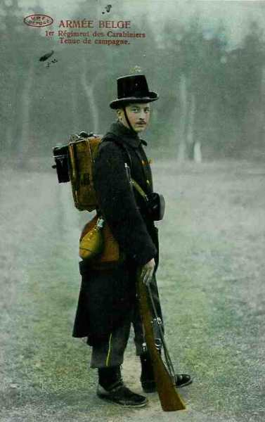
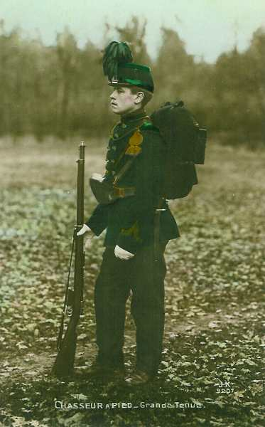

# La première sortie d’Anvers (24 - 26 août 1914)

Albert Ie sait que le général Joffre compte mener une offensive dans le sud de la Belgique, dans les Ardennes et la région de Charleroi. Il décide de seconder l’action des alliés en portant ses divisions à l’attaque des lignes allemandes établies au sud d’Anvers.

### Les positions allemandes

Les Allemands se sont établis au sud d’Anvers depuis le 21 août (3e et 9e C.A.R.). Ces lignes sont à une dizaine de kilomètres environ du nord de Bruxelles et de Leuven, à cheval sur le canal de Willebroek, la Senne, le canal de Leuven et la Dyle. Elles sont jalonnées par les villages de Wolvertem, Grimbergen, Eppegem, Zemst, Hofstade, Boortmeerbeek, Haacht, Tremelo et sont elles-mêmes protégées par une ligne de grand’gardes.

**[Cartes des sorties d’Anvers](../img/sortie_anvers_75.jpg)**

Le but de la sortie est de retenir devant Anvers un maximum de forces allemandes. Il s’agit d’inquiéter l’ennemi par une attaque en force, afin de l’empêcher de distraire des unités pour les jeter dans la bataille de la Sambre.

### 24 août

Des reconnaissances sont poussées vers les positions allemandes : des détachements en sont chargés par la division de cavalerie à l’aile gauche, la 6e division d’armée au centre, et la 5e à droite. C’est ainsi que la 5e D.A. doit livrer un engagement sanglant à Impde, au nord-ouest de Vilvoorde. Commandé par le général de Stein, ce groupement, composé de la 17e brigade mixte et des éléments de la 16e, se porte vers le sud en deux colonnes.

_Cavalerie belge_
_Collection privée_

- Celle de droite, sous les ordres du colonel Rucuqoi, commandant du 3e chasseurs à pied, s’est engagée dans le hameau d’Impde que des patrouilles avaient trouvé abandonné, quand, brusquement, une fusillade éclate des fenêtres et des soupiraux. Les compagnies, décimées, n’ont d’autre ressource que de battre en retraite pour échapper au massacre total.

- Partout ailleurs, les reconnaissances atteignent leur but sans dommage.

D’après les renseignements recueillis, le commandant arrête ses dispositions pour l’attaque.

- A l’aile droite, les 5e et 1e D.A. se porteront entre le canal de Willebroek et la Senne, leur flanc extérieur gardé par un détachement de la 5e division qui opérera sur la rive ouest du canal.

- Au centre, la 2e division progressera vers Boortmeerbeek et Over-de-Vaart avec l’appui de la D.C. chargée de couvrir l’armée contre toute tentative venant de l’est.

- La 3e D.A. formera la réserve générale.

### 25 août

Dès l’aube, les divisions effectuent les mouvements préliminaires. La 6e subit un léger retard dans la traversée de Mechelen que les Allemands bombardent dès 05h.

Les Allemands sont bousculés par les avant-gardes des grenadiers et des carabiniers. Ces régiments s’emparent de Hofstade et du bois de Schiplaken, mais c’est en vain qu’ils tentent de se porter à l’attaque d’Elewijt.

_Officiers de cavalerie belge_
_Collection privée_

- La première division s’empare de Zemst et de Weerde. En cherchant à attaquer Elewijt par l’ouest, elle se voit arrêtée dans sa progression par des rafales meurtrières, notamment au château de Steen (3e et 23e de ligne)

_Mitrailleuses allemandes_
_Collection privée_

- La 5e division, marchant en retrait et à gauche de la 1e fait également intervenir ses avant-gardes (2e chasseurs) sans résultat décisif.

- A l’aile gauche, la 2e division a pu pousser le 5e régiment de ligne vers Boortmeerbeek et le 25e aux débouchés de Haacht.

Après 14h, l’ordre d’attaquer prescrit à la 5e brigade mixte de marcher sur Over-de-Vaart, à la 6e vers Tildonk tandis que la D.C. se dirige vers Werchter pour couvrir le flanc de l’offensive. Ce mouvement se heurte bientôt à une vive résistance.

Les 5e et 25e régiments de ligne délogent les Allemands du hameau de Laar et de la station de Haacht, mais ils doivent se retirer à la tombée de la nuit. La D.C. avait, au cours de la journée, surpris la garnison de Werchter qui n’a pas eu le temps de détruire les ponts de la Dyle et du Demer.

### 26 août

De bonne heure, les attaques des 1e et 5e divisions reprennent vers Vilvoord - Elewijt, après relève par des unités fraîches. La 2e brigade mixte (2e et 22e régiments de ligne), qui devaient déboucher de Weerde et franchir la Senne, est rapidement mise à rude épreuve. Dès le lever du jour, l’artillerie allemande commence à bombarder le village et les abords de la rivière. Les batteries de campagne belges la contrebat difficilement car les retranchements allemands sont trop près des lignes belges.

A 10h parvient l’ordre du G.Q.G. de ne pas pousser plus loin les attaques et de s’établir défensivement au nord de la Senne.

A la 5e division, les bataillons réalisent une progression sensible mais une contre-attaque allemande les rejette sur Eppegem où le 6e chasseurs les recueille.

Jusqu’à 15h, les Belges tiennent bon, puis, menacés d’encerclement, doivent se rabattre sur Kampenhof.

_Carabinier belge_
_Collection privée_

A l’aile droite, un groupement du 2e chasseurs s’évertue à forcer le passage du canal de Willebroeck. A Pont-Brûlé, le caporal Trésignies accomplit un acte de bravoure et de sacrifice volontaire : les Allemands avaient relevé le pont-levis sur le canal. Or, la manivelle qui l’actionne se trouve sur la rive tenue par les Allemands. Trésignies plonge dans le canal, rejoint l’autre rive et, là, debout et exposé aux tirs, saisit la manivelle et abaisse le pont. Les Allemands lui rendront un solennel hommage.

Au centre, les grenadiers et carabiniers de la 6e D.A. se heurtent aux mêmes difficultés lors de l’attaque du château et du bois au nord d’Elewijt. Devant eux s’étend un glacis découvert et battu par des tirs. Deux pièces du 6e d’artillerie, conduites par le commandant Joostens, vont s’installer sur le ligne même des fantassins pour ouvrir le feu sur les retranchements et les maisons garnies de mitrailleuses.

A l’aile gauche de l’armée, la 2e division a repris ses attaques sur Over-de-Vaart et Tildonk. Les Allemands, qui avaient réoccupé la station de Haacht, en sont chassés.

Les troupes belges dépassent même le talus de chemin de fer, mais deux bataillons du 6e régiment doivent se replier et sont remplacés par deux bataillons du 25e.

_Chasseur à pied belge_
_Collection privée_

La D.C. est mise en péril, menacée de flanc par une colonne allemande débouchant de Rotselaar en direction de Werchter et doit céder du terrain.

Le général Dossin prescrit un repli par échelons, sous la protection de bataillons des 7e et 27e de ligne.

Le but de la sortie d’Anvers est atteint : aucune unité allemands n’a pu quitter la région d’Anvers et intervenir dans les batailles de Charleroi et des Ardennes.

A titre de représailles, les Allemands incendient Aarschot et Leuven.