# L’équipée du corps de cavalerie Sordet (6 août - 7 septembre 1914)

Le plan XVII prévoit la constitution d’un corps de cavalerie concentré dans les Ardennes françaises. Dès la violation du territoire belge par l’armée allemande, il pénètre en Belgique. Il va ensuite devoir effectuer un périple, selon les ordres reçus du G.Q.G., qui va l’amener dans plusieurs provinces belges, avant d’effectuer une retraite jusqu’à Paris.

### Composition du C.C.

Le 1e C.C., dont la formation était prévue par le plan XVII comprend trois D.C. : les 1e, 3e et 5e divisions, renforcées par la 8e brigade d’infanterie.

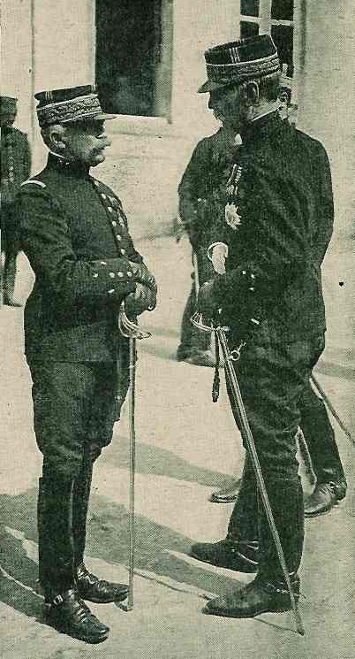
_A gauche le général Sordet_
_La guerre du droit_

- Chacune des D.C. comprend
    Un E.M.
    Trois brigades à deux régiments.
    Un groupe d’artillerie à cheval de trois batteries.
    Un groupe cycliste de 400 fusils.
    Des services divers : télégraphie, prévôté, service de santé, trésor et postes.

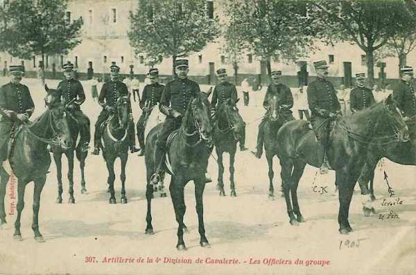
_Officiers français de cavalerie_
_Collection privée_

| Unité                          | Commandant          | Régiments                                                                                                             |
| ------------------------------ | ------------------- | --------------------------------------------------------------------------------------------------------------------- |
| 1e division de cavalerie       | Buisson             |                                                                                                                       |
| 2e brigade de cuirassiers      | Louvat              | 1e régiment de cuirassiers (Paris)2e régiment de cuirassiers (Paris)                                                  |
| 5e brigade de dragons          | Silvestre           | 6e régiment de dragons (Vincennes)23e régiment de dragons (Vincennes)                                                 |
| 11e brigade de dragons         | Corvisart           | 27e régiment de dragons (Versailles)32e régiments de dragons (Versailles)                                             |
| Eléments divisionnaires        |                     | 1e groupe cycliste du 26e bataillon de chasseurs à pied (Vincennes, Pont-à-Mousson)13e R.A.C. (un groupe - Vincennes) |
| 3e division de cavalerie       | Dor de Lastours     |                                                                                                                       |
| 4e brigade de cuirassiers      | Gouzil              | 4e régiment de cuirassiers (Valenciennes, Cambrai)9e régiment de cuirassiers (Douai)                                  |
| 13e brigade de dragons         | Léorat              | 5e régiment de dragons (Compiègne)7e régiment de dragons (Fontainebleau)                                              |
| 3e brigade de cavalerie légère | de la Villestreux   | 3e régiment de hussards (Senlis)8e régiment de hussards (Meaux)                                                       |
| Eléments divisionnaires        |                     | 3e groupe cycliste du 18e bataillon de chasseurs à pied42e R.A.C.                                                     |
| 5e division de cavalerie       | Bridoux             |                                                                                                                       |
| 3e brigade de dragons          | Lallemand           | 16e régiment de dragons (Reims)22e régiment de dragons (Reims)                                                        |
| 7e brigade de dragons          | de Marcieux         | 9e régiment de dragons (Epernay)29e régiment de dragons (Provins)                                                     |
| 5e brigade de cavalerie légère | Cornulier-Lucinière | 5e régiment de chasseurs à cheval (Châlons-sur-Marne)15e régiment de chasseurs à cheval (Châlons-sur-Marne)           |
| Eléments divisionnaires        |                     | 5e groupe cycliste du 29e bataillon de chasseurs à pied (Epernay, Saint-Mihiel)61e R.A.C. (un groupe - Verdun)        |

Soit : 18 régiments de cavalerie, renforcés de cyclistes et d’artillerie.

Un régiment de cavalerie comporte 500 sabres et chaque brigade dispose d’une section de mitrailleuses.

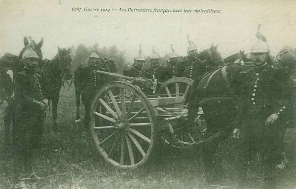
_Cuirassiers français avec une mitrailleuse_
_Collection privée_

### Premières instructions

L’instruction secrète du 7 février 1914 indique l’emplacement des cantonnements de concentration, soit dans la région de Montmédy, afin d’appuyer le 2e C.A., si les Allemands tentent un mouvement offensif par la Woëvre septentrionale.

Si, par contre, la neutralité belge est violée, le C.C. doit pénétrer sans retard en Belgique, pour se porter à la rencontre des colonnes allemandes, plus spécialement celles qui s’avanceraient par le Luxembourg belge, au sud de la région de Houffalize - Saint-Hubert, en utilisant comme soutien le 45e régiment d’infanterie tandis que le 148e garderait les ponts de la Meuse entre Namur et la frontière.

L’instruction du 7 février est complétée par une instruction particulière du commandant du C.C. : elle prévoit de s’assembler dans la région de Sedan. En cas d’opérations en Belgique, le C.C. se porterait vers Bastogne, contre les colonnes utilisant la région praticable au sud de la zone boisée Houffalize - Saint-Hubert. Cette instruction est soumise à Joffre et approuvée par lui.

Les directives principales sont donc :

- De porter au plus tôt le C.C. au nord de la Semois pour bousculer la cavalerie allemande débouchant au sud de la région Houffalize - Saint-Hubert.

- Dans le cas d’une offensive générale des forces françaises en Belgique, de porter le C.C. à l’aile gauche de la Ve armée afin de la protéger contre une tentative d’enveloppement.

### 30 juillet

Le général Sordet est averti par le général Joffre qu’en raison des préparatifs militaires de l’Allemagne, le gouvernement français a décidé de mettre en place le dispositif de couverture. Le C.C. fait partie des troupes de couverture.

### 1e août

Le général Sordet et le premier échelon de son E.M. débarquent à Mézières.

- La 1e D.C. se rassemble dans la zone de Charleville.
    La 3e D.C. dans la zone d’Aubenton.
    La 5e D.C. dans la zone de Poix-Terron.

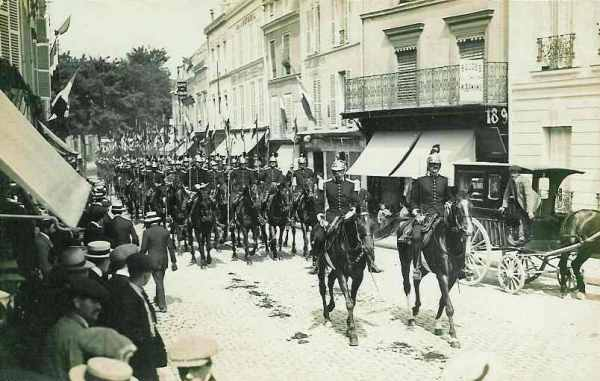
_Peloton de dragons_
_Collection privée_

Les postes de la 1e D.C. surveillent les passages de la Meuse en amont de Mézières et ceux de la 5e D.C. en aval de cette ville. Plus au nord, le 148e R.I. tient les ponts entre la 5e D.C. et la frontière belge.

### 2 août

Pour éviter tout incident, le gouvernement français prescrit le retrait des postes de surveillance à 10 km de la frontière.

### 3 août

Joffre apprend que les Allemands ont occupé Luxembourg.

### 4 août

On apprend que l’Allemagne a déclaré la guerre à la France, que l’Italie confirme sa neutralité et que la Belgique s’oppose au passage des troupes allemandes à travers son territoire.

La déclaration officielle de guerre incite Joffre à prescrire au général Sordet de se rapprocher de la frontière belge, dans la région de Sedan, afin de pouvoir faire mouvement soit vers Montmédy, soit vers Neufchâteau.

Suite à la violation de son territoire, le gouvernement belge adresse un appel à l’aide au gouvernement français, un des garants du traité de neutralité. Joffre envisage d’envoyer le C.C. Sordet en Belgique.

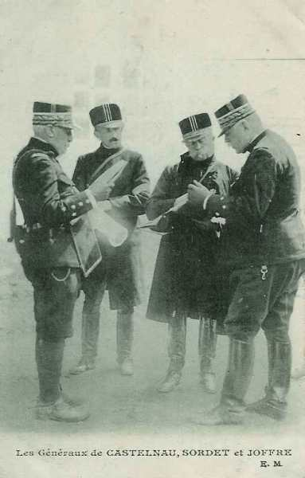
_Les généraux Castelnau, Sordet et Joffre_
_Collection privée_

### 5 août

Joffre prescrit au général Sordet de franchir la frontière belge, afin d’assurer la découverte en direction des frontières du Luxembourg et de Malmédy.

**19h :**

Un ordre parvient du G.Q.G. de Vitry-le-François :

« Porter dès demain le C.C. dans la région de Neufchâteau. Exploration du front Attert - Martelange - Bastogne - Houffalize - Laroche. Liaison à droite avec la 4e D.C. qui se portera dans la région d’Etalle pour explorer le front Attert - Arlon -Longwy - Audun-le-Roman et passera sous vos ordres.

Mission : préciser le contour apparent de l’ennemi sur la frontière orientale de la Belgique, retarder la marche des colonnes ennemies, déblayer la région de la cavalerie adverse. »

Le général Sordet décide d’utiliser la ligne Sedan - Bouillon - Paliseul pour assurer le ravitaillement de ses divisions et le transport du 45e R.I.
Dans la nuit :
Le 45e R.I. arrive à Bouillon.

### 6 août : début des opérations à l’est de la Meuse

**[Lien vers croquis](../img/sordet_6_15_aout.jpg)** : marche du C.C. du 6 au 15 août

**En matinée :**

Les D.C. entrent en Belgique en suivant différentes destinations :

- 1e D.C. vers Paliseul.
    5e D.C. vers Bertrix.
    3e D.C. et le Q.G. vers Bouillon.

La 8e brigade d’infanterie (à ce moment limitée au 45e R.I.) fait route en autobus et en chemin de fer, ou même à pied vers la Semois, vers Bouillon, Alle et Vresse.

Partout, les troupes françaises sont accueillies avec enthousiasme. La 3e D.C. est accompagnée par des automitrailleuses.

**12h :**

Le Q.G. du C.C. s’installe vers Bouillon. Le général Sordet adresse un télégramme au roi des Belges pour signaler la présence du C.C. en Belgique.

Les D.C. sont précédées de détachements de découverte. Elles
reçoivent leurs secteurs d’observation des mouvements allemands.

- 1e D.C. : secteur Bastogne - Houffalize - Laroche.
    5e D.C. : Allert - Martelange.
    3e D.C : Marche - Rochefort - Dinant.

Les grands carrefours entre Arlon et la Meuse sont reconnus.

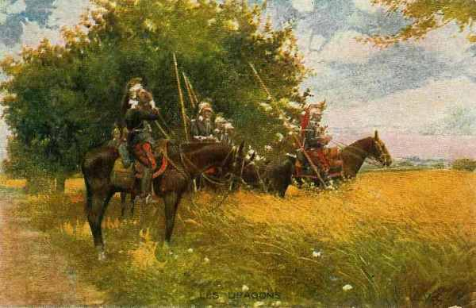
_Dragons en observation_
_Collection privée_

### 7 août

**[Lien vers croquis](../img/sordet_6_7_aout.jpg)** : marche du C.C. les 6 et 7 août

Les premiers renseignements parviennent au G.Q.G. : le débarquement du 13e C.A. bavarois a lieu vers Arlon.

**8h :**

Le général Sordet décide de rassembler ses divisions face à l’est dans la région d’Offagne.

**9h55 :**

Le C.C. téléphone au G.Q.G., en signalant qu’aucune activité allemande n’a lieu entre Saint-Hubert et la frontière du Grand Duché de Luxembourg., mais que des masses de cavalerie semblent se diriger au nord de Marche vers Dinant et Namur.

Le général Sordet décide par conséquent de porter ses divisions vers le nord pour déblayer la région de la cavalerie adverse.

**11h :**

Les divisions sont arrêtées sur la ligne Massin - Our - Grade et un repos de deux heures est accordé en raison de la chaleur torride.
Elles sont ensuite dirigées vers :

- 1e D.C. : Ave.
    3e D.C. : Honnay.
    5e D.C. : Chanly.

Le 45e R.I. cantonne plus loin à Jehonville. Les autobus doivent faire la navette et transporter les troupes bataillon par bataillon.

Les renseignements recueillis n’ont pas confirmé la présence de forces allemandes importantes de cavalerie au nord de la Lesse.

**11h30 :**

Le C.C. atteint la région de Ciney. Les divisions reçoivent l’ordre de faire grand’halte. Le Q.G. s’installe à Ciney.

**En début d’après-midi :**

Le général Sordet reçoit l’ordre du G.Q.G. de se mettre en marche vers Liège pour soutenir les troupes belges.

**13h30 :**
Le C.C. se met en marche vers Liège par trois itinéraires parallèles :

- La 5e D.C. par Maffe et Ouffet.
    La 1e D.C. par Verlée et Seny.
    La 3e D.C. par Havelange et Modave.

Ces itinéraires suivent la crête entre la Meuse et l’Ourthe.

Le commandant de l’escadrille de la 5e D.C. a reçu l’ordre de reconnaître les abords de Liège.

La vitesse demandée aux chevaux est de 9 - 10 km/h car Sordet compte atteindre Liège entre 5 et 6h du soir : il faut ménager un effet de surprise, mais la grande chaleur et la difficulté de liaison entre colonnes ralentit la marche.

**19h30 :**

Le gros du C.C. atteint Ouffet - Fraiture - Villers-le-Temple. Il arrive trop tard, les Allemands sont sur leurs gardes et les passages de l’Ourthe sont gardés.

Le général Sordet décide par conséquent de ramener les D.C. en arrière.

- 1e D.C. à Clavier.
    3e D.C. à Modave.
    5e D.C. à Durbuy.

### 9 août

**[Lien vers croquis](../img/sordet_8_9_aout.jpg)** : marche du C.C. les 8 et 9 août

**Dans la matinée :**

Le mouvement offensif vers Liège n’a pas donné les résultats escomptés et les Allemands sont avertis. On ne peut songer à le renouveler.
Le général Sordet décide de ramener ses divisions dans une position où il pourra :

- Soit faire mouvement vers le nord, pour opérer en liaison avec les Belges.

- Soit vers l’est, vers les grands carrefours de Marche et de Laroche, afin de ralentir les colonnes qui déboucheraient de la région Stavelot - Vielsalm.

- Soit au sud vers Bastogne, en liaison avec la 4e D.C. qui se trouve près de Neufchâteau.

Le C.C. est ramené au sud de la Lesse

- 1e D.C. à Wavreille.
    3e D.C. à Han-sur-Lesse.
    3e D.C. à Beauraing.
  Le Q.G. est à Rochefort.

La 1e D.C. qui couvre la marche vers l’est, signale de nombreuses patrouilles allemandes.

L’équipée vers Liège n’a donné aucun résultat et les chevaux ont dû parcourir une grande distance par une chaleur torride.

Le général Sordet prescrit l’envoi de nouveaux détachements de découverte.

- 1e D.C. vers Marche - La Roche - Houffalize - Durbuy.
    5e D.C. vers Saint-Hubert et Bastogne.
    3e D.C. vers Libramont et Neufchâteau.

**18h30 :**

Une note de la Ve armée fait connaître au général Sordet que la 4e D.C. est affectée à cette armée.

### 10 août

**[Lien vers croquis](../img/sordet_10_11_aout.jpg)** : marche du C.C. les 10 et 11 août

Le C.C. est maintenu dans ses cantonnements. La plupart des régiments ont parcouru en cinq jours une distance de 250 km, rendue encore plus pénible par la chaleur torride. Un dépôt de chevaux malades doit être créé à Givet. Les fers s’usent sur les routes empierrées et Sordet doit réclamer 15.000 ferrures de rechange.

De nouveaux renseignements parviennent au général Sordet :
De nombreux détachements de cavalerie allemande sont signalés dans la région de Marche - Laroche. L’impression est très nette que des forces allemandes se dirigent du Luxembourg vers la Meuse, entre Liège et Dinant.

### 11 août

Une D.C. allemande a marché de Martelange vers Neufchâteau, suivie d’une colonne de toutes armes.

Le général Sordet donne ses ordres d’opérations pour le 11, soit de se porter à la rencontre des forces allemandes. Les directions à emprunter par les unités sont les suivantes :

- 1e D.C. : par Tellin vers Saint-Hubert.
    3e D.C. : par Daverdisse vers Bertrix et Neufchâteau.
    5e D.C. : par Chanly vers Carlsbourg.
    45e R.I. : vers Maissin.

Les divisions atteignent la région de Maissin - Libin vers midi et s’établissent en halte gardée.

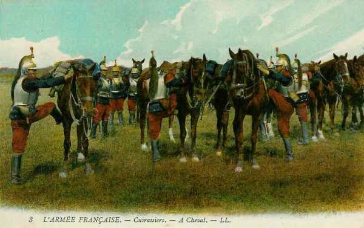
_Cuirassiers français montant en selle_
_Collection privée_

- 1e D.C. : à Villance.
    3e D.C. : à Aupont.
    5e D.C. : à Paliseul.
    45e R.I. : à Maissin avec le Q.G.

### 12 août

**6h30 :**

Les D.C. se rassemblent en colonnes de route face à l’est.

- 1e D.C. : près de Villance vers Saint-Hubert.
    3e D.C. : près de Sart vers Recogne.
    5e D.C. : près d’Offagne vers Bertrix - Neufchâteau.
    45e R.I. : vers Baronville.

**7h45 :**

- Le général Sordet prescrit aux D.C. de se porter vers l’est :
    1e D.C. : vers Anloy.
    3e et 5e D.C. : vers Ochamps.

**11h :**

Les avions qui ont survolé la région de Neufchâteau - Bastogne rendent compte que la région de Neufchâteau est évacuée mais que les détachements allemands se montrent plus nombreux dans la région de Tellin - Rochefort, soit plus au nord.

Le général Sordet pense que les forces allemandes se dérobent vers le nord-ouest. Il n’est plus nécessaire de maintenir les divisions dans la région de Paliseul. Il donne par conséquent l’ordre aux D.C. de se diriger vers les destinations suivantes :

- 1e D.C. : vers Lomprez.
    3e D.C. : vers Vonêche.
    5e D.C. : vers Beauraing.

**A la nuit :**

Le C.C. tout entier est à nouveau groupé au sud de la Lesse, le Q.G. à Pondrôme. Le général Sordet envisage de porter le C.C. à l’ouest de la Meuse car le mouvement des troupes allemandes vers l’ouest est de plus en plus certain.

### 13 août :

**[Lien vers croquis](../img/sordet_13_14_15_aout.jpg)** : marche du C.C. les 13, 14 et 15 août

**En matinée :**

- La 5e D.C. fait route de Ciney vers Anseremme.
    La 1e D.C. part de Buissonville et Sinsin vers Baillonville.
    La 3e D.C. se dirige vers Libin et Recogne en surveillant la route de Saint-Hubert.

Un ordre parvient du G.Q.G. : Si vous êtes obligés de passer la Meuse, portez-vous à la gauche de la Ve armée dans la région de Mariembourg - Chimay, pour protéger la réunion de nouvelles formations.

**9h :**

Le C.C. envoie au 1e C.A., qui garde les passages de la Meuse, le renseignement suivant : aucune infanterie dans la région de Neufchâteau - Libramont.

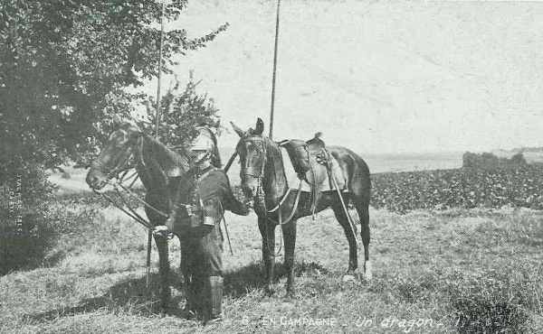
_Dragon français_
_Collection privée_

**18h :**

Le C.C. envoie un bulletin de renseignements : la région de Marche-Rochefort est occupée par de la cavalerie allemande. Aucune troupe d’infanterie n’y est signalée.

Le général Sordet prend alors les mesures suivantes :

- Deux compagnies doivent se porter vers Ave et Auffe puis vers Han-sur-Lesse afin de tenir les routes venant de Rochefort et Saint-Hubert.

- Il faut préparer pour le lendemain le débouché éventuel du C.C. au nord de la Lesse.

- Le 45e R.I. doit se porter à Villers-sur-Lesse et Ciergnon.

### 14 août

Le général Sordet obtient des renseignements sur les mouvements de l’armée allemande :

- Une des deux divisions de cavalerie allemande signalées serait la 5e division de cavalerie de la Garde.

- Une colonne d’infanterie est signalée, marchant vers 7h de Havrenne sur Mont-Gautier.

- La cavalerie allemande occupe Redu.

- Une colonne d’infanterie est signalée près de Conneux (sud-ouest de Ciney) et semble se diriger vers Dinant.

Le C.C. est alerté. La 5e D.C. fait mouvement vers Houyet afin de franchir la Lesse avec des éléments du 45e R.I. qui occupent le pont. Elle doit agir contre les colonnes allemandes marchant au nord de la Lesse.

La 1e D.C. se dirige vers Mont-Gauthier, appuyée par la 3e D.C.

La situation du C.C. est difficile : il n’a pas pu franchir la Lesse avec le gros de ses divisions afin d’attaquer les colonnes allemandes et celles-ci ont atteint Redu, menaçant ses lignes de communication. La liberté de manoeuvre est limitée vers le nord et vers l’est.

Le général Sordet estime prudent d’assurer le passage de ses divisions sur la rive gauche de la Meuse et il envoie ordre à l’unité d’infanterie qui assure la garde du pont d’Hastière de le faire dégager pour le 15 août à partir de 5h.

### 15 août

**[Lien vers croquis](../img/sordet_15_16_17_aout.jpg)** : marche du C.C. les 15, 16 et 17 août

**03h :**

Le général Sordet conserve toujours l’intention de tenter une nouvelle action au nord de la Lesse. Il donne par conséquent l’ordre de se rapprocher de cette rivière.

- La 1e D.C. se rassemble entre Mesnil-Saint-Blaise et Hulsonniaux.

- La 3e D.C. se rassemble entre Mesnil-Saint-Blaise et Lemaux.

- La 3e D.C. est cantonnée à Houyet et prête à monter à cheval.

- Le Q.G. est à Mesnil-Saint-Blaise.

On entend une violente canonnade dans la direction de Dinant : c’est l’avant-garde du 1e C.A. français, attaquée par la cavalerie allemande.

Les cyclistes de la 1e D.C. viennent d’atteindre Anseremme. Des reconnaissances de cavalerie rendent compte que le terrain au nord de la Lesse est presque impraticable en raison de nombreux abatis établis par l’armée belge, ce qui empêche tout mouvement offensif en direction des forces allemandes.

**En matinée :**

Un message parvient du G.Q.G. : le C.C. doit se tenir à la gauche de la Ve armée en assurant la liaison avec les forces belges et pourra passer sur la rive gauche de la Meuse si c’est nécessaire.

Le général Sordet estime qu’une action au nord de la Lesse a peu de chances de succès en raison des difficultés du terrain. Il décide donc de porter ses divisions sur la rive gauche de la Meuse par le pont d’Hastière.

**9h :**

Le général Sordet envoie les ordres de marche à ses divisions :

Le C.C. se portera sur la rive gauche de la Meuse par le pont d’Hastière.

- La 1e D.C. se mettre en marche immédiatement.
    La 3e D.C. suivra la 1e.
    La 5e D.C. et le 45e R.I. couvriront le mouvement et s’établiront sur la ligne Mesnil-Saint-Blaise - Falmagne.

Le mouvement s’exécute sans difficulté.

**14h :**

Le général Sordet se rend à Anthée où se trouve le commandant du 1e C.A. et met à sa disposition le 45e R.I. et une brigade de cavalerie pour renforcer l’attaque sur Dinant.

**En fin de journée :**

- La 1e D.C. est à Biesmerée.
    La 3e à Laneffe.
    La 5e à Florennes.
    Le Q.G. à Florennes.

Les renseignements recueillis par le C.C., par la Ve armée et par l’armée belge confirment la présence de forces allemandes importantes dans la vallée de la Meuse. Le G.Q.G., pour parer au danger qui menace l’aile gauche française, décide de porter la Ve armée dans la région de Philippeville - Mariembourg.

**A la nuit :**

Le 45e R.I. est à Hastière.

Le général Sordet reçoit l’instruction particulière n° 10 du G.Q.G.
« 1° L’ennemi semble porter son principal effort, par son aile droite, au nord de Givet ; un autre groupement de forces paraît marcher sur le front Sedan - Danvillers.

2° La Ve armée, laissant son C.A. de droite et ses divisions de réserve à la défense de la ligne de la Meuse et maintenant la 4e D.C. à la disposition de la IVe armée, portera le reste de ses troupes dans la région Mariembourg - Philippeville pour agir de concert avec les armées anglaises et belges contre le groupe allemand du nord.
Le C.C. Sordet passe sous les ordres du commandant de la Ve armée. »

Le général Sordet reçoit une instruction adressée par le général Lanrezac, commandant de la Ve armée
« Le C.C. couvrira le flanc gauche du 1e C.A. Il fera connaître les mouvements de l’ennemi au nord de Namur et sur la rive gauche de la Sambre.
Il prendra des mesures pour retarder les colonnes qui chercheraient à franchir la Sambre entre Namur et Maubeuge. »

### 16 août

Le général Sordet estime que la distance et l’état de fatigue des chevaux ne lui permettent pas de porter en une seule étape ses divisions au nord de la Sambre. Il décide de se rapprocher de cette rivière dans la journée du 16.

En fin d’étape, les D.C. s’échelonnent :

- 1e D.C. : à Fosse.
    5e D.C. : à Saint Gérard.
    3e D.C. et Q.G. : à Mettet.

Les éléments de sûreté tiennent les ponts de la Sambre.

**18h :**

L’ordre d’opérations n°5 prescrit aux divisions, marchant en trois colonnes, d’être rassemblées le 17 pour 10h30 au nord de la Sambre, les éléments de tête à hauteur de la grand’ route Namur - Nivelle.

**19h :**

Le général Lanrezac (Ve armée) adresse une dépêche au général Sordet, qui reflète les instructions du G.Q.G.
« Il est d’un intérêt majeur que le C.C. se porte dès le 17, entre Eghezée et Tirlemont pour prendre contact avec les troupes belges de campagne ».

### 17 août

Le général Sordet décide de laisser sur la rive droite de la Sambre une brigade de cavalerie afin de surveiller les ponts de Namur à Charleroi. Le gros des divisions se porte au nord de la Sambre, à la rencontre de la masse de cavalerie allemande devant la droite de l’armée belge, dont la situation devient critique.

La situation générale s’est aggravée : sur le front de l’armée belge, au moins deux D.C. allemandes ont franchi la Meuse et semblent préparer l’investissement de Namur.

**8h30 :**

Le C.C. s’ébranle en trois colonnes :

- A droite, la 5e D.C. par Onoz et Ramilies.
    Au centre, la 1e D.C. par Bossières et Perwez.
    A gauche, la 3e D.C. par Gembloux, le Bois-du-Buis sur Thorembais.

L’intention de Sordet est de marcher droit sur Bois-du-Buis avec la 1e D.C. et de manoeuvrer par Perwez avec les deux autres divisions.

**10h30 :**

Les éléments de tête sont à hauteur de la grand’route Namur - Nivelle.

- 5e D.C. : Est de Tongrinne.
    1e D.C. : Gembloux - Wavre.
    3e D.C. : Gentinnes - Ottignies.

Un escadron de la 5e D.C. effectue des reconnaissances à Spy et un de la 3e D.C. à Gembloux.
Les reconnaissances de la 5e D.C. prennent contact avec le groupe du colonel Iweins, de l’armée belge, vers Ottignies.

Les trois divisions marchent à travers champs. Les escadrons balaient les reconnaissances allemandes qui se retirent devant eux.

A la 1e D.C., un escadron du 6e dragons rend compte que Perwez est occupé. L’escadron pousse sur Grand-Leez. Les détachements allemands évacuent Perwez. La marche reprend sur Hottomont où l’avant-garde est accueillie par des coups de feu. L’artillerie de la 5e D.C. bombarde Hottomont qui est évacué.

**11h35 :**

La colonne de droite de la 5e D.C. reçoit ses premiers coups de feu.

**13h :**

Les 1e et 5e D.C. franchissent la route Leuven - Andenne au sud d’Hottomont. Les cyclistes gagnent les abords de Ramillies par Grand-Rosières. Ils se buttent à de solides organisations tenues par la 9e D.C. du C.C. von der Marwitz soutenue par des bataillons de chasseurs. Malgré les efforts des cyclistes, la ligne allemande ne peut être enfoncée.

L’artillerie des 1e et 5e D.C. ouvre le feu sur Geest - Gerompont et Ramillies.

Le général Sordet décide de faire la grande halte. L’avoine est distribuée aux chevaux.

**13h50 :**

Des rassemblements de cavalerie apparaissent vers Mont-Saint-André. Aussitôt, une salve d’obus tombe sur la 1e D.C. Les batteries françaises ouvrent le feu.

**15h :**

Le général Sordet se rend compte que les Allemands occupent solidement Thorembais-les-Béguines - Geest - Ramillies et vu l’heure tardive et la fatigue des hommes, il décide de replier le C.C. dans la région de Walhain-Saint-Paul - Sart-à-Walhain.

Au cours de la journée, le C.C. a eu une centaine d’hommes hors de combat.

**20h :**

Joffre téléphone à Lanrezac :
« Il est urgent que le C.C. remplisse la mission qui lui a été assignée hier. Bruxelles s’affole et le gouvernement se retire à Anvers. Il faut éviter à tout prix que l’armée belge suive ce mouvement. Par suite, il est indispensable que le C.C. prenne liaison avec elle. »

**20h45 :**

Le C.C. envoie un compte rendu à la Ve armée :
« Il y a seulement de faibles patrouilles de cavalerie entre la Sambre et la ligne Marbais - Gembloux - Eghezée. Rassemblements importants, en majorité de cavalerie, dans la région Perwez - Hannut, couverts par des détachements. Région de Namur libre. »

**22h :**

Le général Sordet reçoit l’ordre de marcher suivant l’axe Fleurus - Sombreffe - Gembloux. Pour faciliter le mouvement, une brigade d’infanterie belge se portera, le 18, par Longueville et Sart, sur Thorembais - Saint-Trond, de façon à lier son action avec celle du C.C. Sordet.

Un officier d’E.M. du général Sordet, envoyé à Namur, a obtenu du gouverneur de la place la promesse qu’un détachement mixte belge appuiera la cavalerie française par la vallée de la Meuse.

### 18 août

**[Lien vers croquis](../img/sordet_18_aout.jpg)** : marche du C.C. le 18 août

**En matinée :**

Les renseignements recueillis dans la journée du 17 font connaître au général Sordet qu’une masse importante de cavalerie allemande occupe la région de Perwez - Ramilies - Offus, en observation devant la droite de l’armée belge. Le général Sordet demande le soutien de l’infanterie, car le C.C. est aventuré à plus de deux étapes en avant des têtes de colonne de la Ve armée.

Le C.C. se porte vers le nord-est en trois colonnes :

- 5e division : sur Perwez.
    1e division : sur Perwez.
    3e division : sur Thorembais.

**10h :**

Les divisions de cavalerie franchissent la route Gembloux - Namur.
Les 1e et 5e D.C. prennent bientôt contact avec des détachements allemands qui occupent Perwez, Grand-Rozière, Hottomont. Dès que la cavalerie française apparaît, ces détachements, menacés d’être débordés, se replient.

**13h :**

La 1e D.C. franchit la route Leuven - Andenne, au sud d’Hottomont, appuyée à droite par la 5e division et découvre au nord, vers Mont-Saint-André un gros rassemblement de cavalerie allemande. L’artillerie de la 1e D.C. ouvre le feu.

Renseignements pris, les Allemands occupent solidement Thorembais - Geest - Ramilies. Les chevaux étant trop fatigués pour qu’une action offensive puisse être envisagée, le général Sordet décide de ramener le C.C. dans la région de Walhain-Saint-Paul.

**Dans la soirée :**

Le général Sordet rend compte au commandant de la Ve armée :
« J’ai balayé le terrain jusqu’à Ramilies des éclaireurs ennemis mais je me suis heurté à Geest - Terrompont, à de fortes positions organisées, défendues par de l’artillerie de campagne, obusiers, mitrailleuses, infanterie. Après avoir canonné ces positions, le C.C. s’est replié pour la nuit dans la région de Walhain-Saint-Paul. »

### 19 août

**[Lien vers croquis](../img/sordet_19_aout.jpg)** : marche du C.C. le 19 août

Le général Sordet est décidé de tenter une nouvelle action offensive contre les forces allemandes au nord de Perwez.

**6h :**

Le C.C. se rassemble face au nord-est, couvert par de forts détachements qui occupent la ligne générale Lonzée - Grand-Leez - Tourinnes-Saint-Lambert.

**8h30 :**

Un avion signale une forte colonne de cavalerie et d’artillerie en marche de Grand-Rozières sur Perwez et Orbais.

Le général Sordet se décide à l’attaquer de flanc avec ses trois divisions.

- Au centre, la 5e D.C. s’ébranle sur la route Gembloux - Thorembais - Saint-Trond.
    A gauche marche la 3e D.C. par Lerinnes - Tourinnes-Saint- Lambert.
    A droite, la 1e D.C. débouche de Malprouve entre le Bois de Buis et Grand-Leez. La 5e brigade de dragons est en avant-garde.

**9h45 :**

Des colonnes allemandes sont signalées marchant de Perwez sur Orbais.
Au moment où l’avant-garde de la 1e D.C. passe à hauteur de Bois du Buis, elle est canonnée par l’artillerie allemande en position vers Perwez. La batterie de la 1e D.C. prend position et riposte.

Les dragons de la 5e brigade doivent se retirer sous les obus, au sud du Bois de Buis, avec les 1e et 2e régiments de cuirassiers.

**12h :**

La 3e D.C. fait marche vers Tourinnes. L’artillerie française décime une colonne d’artillerie allemande qui défile sur la route Thorembais - Orbais.

Les têtes du 10e C.A. de von Bülow sont arrivées à Grand-Rosières. La droite du C.C. est menacée d’enveloppement et doit rétrograder vers le sud.

**13h**
Le demi-régiment Gasser du 32e dragons (11e brigade), qui couvre le repli, est sérieusement accroché au nord de Sauvenière (perte de 28 hommes).

A la gauche, la 3e D.C. se porte au nord-est de Tourinnes.

**14h :**

La 14e batterie tire sur un régiment de uhlans massé au sud-est d’Orbais et le disperse.

**15h :**

Le général Sordet reçoit son ordre de mission de la Ve armée :
« L’armée progressera légèrement, demain 20 août, vers le nord.
Le 1e C.A. et le C.C. conservent leur mission antérieure. »

**En soirée :**

- La 3e D.C. et le Q.G. sont à Fleurus.
    La 1e D.C. est à Boignée.
    La 5e D.C. est à Saint-Martin.

Le 22e dragons fait sauter la voie ferrée entre Mazy et Gembloux. Les Allemands talonnent le C.C. Sordet mais s’arrêtent sur la voie ferrée Namur - Bruxelles, au contact avec les avant-postes du C.C.

Le général Sordet adresse le bulletin de renseignements de la journée à Lanrezac :

« Les forces auxquelles le C.C. a eu affaire, les 18 et 19 août, appartiennent à la 9e D.C. allemande, forte de six régiments (4e cuirassiers, 19e dragons, 5e et 13e uhlans, 8e et 11e hussards) et deux bataillons de chasseurs (9e et 10e), de cyclistes, de pionniers, d’artillerie montée et d’artillerie à pied (obusiers).

La cavalerie allemande s’est dérobée devant la nôtre pour chercher refuge derrière son infanterie. Ses gros occupaient Ramillies - Merdorp, véritable zone fortifiée où toutes les localités étaient mises en état de défense.

L’armée belge s’est repliée sur la Dyle, appuyant sa gauche aux avancées d’Anvers, sa droite couvrant Bruxelles. De fortes colonnes ennemies ont passé la Meuse à Huy et en aval, marchant sur Hannut.

D’autres forces paraissent destinées à encercler Namur au nord de la coupure Sambre - Meuse.
L’armée anglaise achève sa concentration. »

**22h30 :**

Le général Sordet expédie son ordre réglant les détails du mouvement à effectuer le lendemain en vue du repli sur le canal de Charleroi à Bruxelles.

### 20 août

**[Lien vers croquis](../img/sordet_20_21_aout.jpg)** : marche du C.C. le 20 et 21 août

La présence des avant-gardes de la Ve armée française sur la Sambre, l’arrivée de la cavalerie allemande, déjà en contact dans la région de Fleurus, ne justifient plus le maintien du C.C. au nord de la Sambre.

Le général Sordet estime indispensable d’accorder aux D.C. un repos de 24 heures si on veut éviter leur usure complète. Il estime sage de porter le C.C. vers l’ouest, derrière le Piéton, où il couvrira la gauche de la Ve armée.

Le C.C. couvre également les débarquements anglais dans la région de Gosselies - Fontaine-l’Evêque.

**10h :**

Lanrezac approuve les dispositions du général Sordet et lui enjoint de faire reposer ses troupes pour qu’elles puissent participer à la bataille.

**En matinée :**

Les D.C. se portent à l’ouest du canal de Bruxelles - Charleroi. Le général Sordet établit son P.C. à Courcelles. Pendant l’exécution de ce mouvement, la 1e D.C. est serrée de près par un détachement allemand comprenant de l’infanterie et de la cavalerie. L’artillerie française ouvre le feu et le détachement allemand s’arrête dans la région de Fleurus.

**11h30 :**

Les ordres de stationnement parviennent aux D.C. :

- 3e D.C. et E.M. : à Courcelles.
    1e D.C. : à Bouvret.
    5e D.C. : à Monceau.

La 3e D.C. détache un escadron et un peloton cycliste à Liberchies pour surveiller la direction de Nivelles. Le village est occupé par un escadron de hussards (1e escadron du 13e hussards).

La 1e D.C. maintiendra à Gosselies son groupe cycliste et un peloton pour barrer les directions de Fleurus à Mettet.
La 5e D.C. établira la liaison avec la colonne de gauche du 3e C.A. (Ve armée).

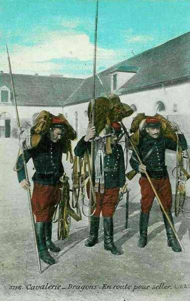
_Dragons allant seller leur cheval_
_Collection privée_

**14h :**

L’ordre de la Ve armée stipule que le C.C. couvrira la gauche de l’armée et les débarquements anglais dans la région de Gosselies - Fontaine-l’Evêque.

### 21 août

Les ordres pour la journée sont les suivants :

- Maintenir les divisions dans les zones de stationnement qu’elles occupent depuis la veille en conservant un service de sûreté sur le canal.

- Faire chercher le contact des forces allemandes par des éléments de découverte : une reconnaissance d’officiers sur Nivelles, un escadron sur l’axe Gosselies - Ottignies, un escadron sur l’axe Fleurus - Gembloux.

**3h30 :**

Une patrouille de hussards se dirige par Rêves vers les Quatre-Bras où les Allemands embusqués les fusillent à bout portant. La patrouille perd 4 cavaliers et rentre vers 7h.

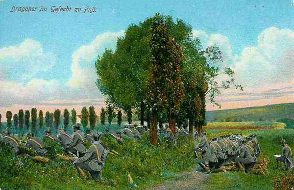
_Dragons allemands combattant à pied_
_Collection privée_

**6h :**

Des patrouilles sont lancées vers Nivelles, Gosselies - Ottignies.

**10h :**

Les avant-postes de la 3e D.C. sont attaqués à Pont-à-Celles et Liberchies. Les Allemands tirent sur tous les obstacles susceptibles d’abriter des Français. Peu à peu, les cyclistes se replient derrière le canal. L’artillerie française tire à partir du nord de Courcelles.

Devant les ponts et écluses du canal à l’est et au nord-est de Gouy-lez-Piéton, un demi-régiment de cuirassiers affronte un détachement du 16e uhlans appuyé par un peloton d’infanterie.

Les Allemands renforcent leurs attaques et la situation devient de plus en plus difficile : la 3e D.C. cède du terrain et la 1e D.C. se trouve compromise.

Le C.C., qui tient les ponts du canal face à l’ouest, de Monceau à Courcelles, forme, à partir de Courcelles, un crochet défensif face au nord, se reliant vers Binche à une brigade de cavalerie anglaise (5e brigade).

Le général Sordet essaie de limiter le repli de ses divisions et compte sur l’appui prochain d’une brigade d’infanterie que le général Lanrezac envoie d’urgence par camions à Fontaine-l’Evêque.

**16h :**

Le général Lanrezac envoie une instruction aux commandants de C.A. et au général Sordet :
« L’armée se tiendra prête à prendre l’offensive au premier ordre, en franchissant la Sambre pour se porter sur le front général Namur - Nivelles. Le C.C., continuant sa mission de couverture du flanc gauche de l’armée, sera renforcé d’une brigade d’infanterie du 3e C.A. »

Les Allemands franchissent le canal Bruxelles - Charleroi.

**18h45 :**

Le général Sordet envoie ses ordres aux 1e et 3e D.C.

- A la 1e division : la 3e division s’est repliée sur Carnières : combinez votre action pour repousser la poussée de l’ennemi sans lâcher les ponts.

- A la 3e division : retraitez sur Carnières en ralentissant le plus possible l’ennemi.

**21h30 :**

La 2e brigade d’infanterie arrive à Fontaine-l’Evêque. Elle doit se porter entre le Piéton et Forchies, poussant un bataillon sur Souvret et un bataillon sur Bellecourt pour s’opposer à la marche des Allemands qui ont débouché par Pont-à-Celles. Elle se repliera le 22 au lever du jour sur la ligne général Anderlues - Leernes, de façon à couvrir le C.C., qui cantonnera dans la région de Merbes-le-Château.

L’avant-garde du 18e C.A. français est à Thuin. Le général Sordet estime nécessaire de porter la 2e brigade d’infanterie à la hauteur du Piéton et il lui prescrit de s’établir sur les hauteurs d’Anderlues.

- Les mouvements prescrits s’effectuant pendant la nuit au prix d’une extrême fatigue, les régiments du C.C. ne peuvent atteindre Merbes-le-Château que vers 4 heures du matin et amènent les unités dans leurs différents secteurs :
    1e D.C. : Jeumont - Erquelinnes - Solre - Hantes - Wilheries - La Buissière, à gauche du 18e C.A.

- 3e D.C. : Vellereille-le-Brayeux, en contact avec la brigade anglaise Chetwode.

- 5e D.C. : Bienne-lez-Appart - Mont-Sainte-Geneviève.

### 22 août

**[Lien vers croquis](../img/sordet_22_23_24_aout.jpg)** : marche du C.C. les 22, 23 et 24 août

**6h35 :**

Le général Sordet adresse un message chiffré au Q.G. de la Ve armée à Chimay :
« Ai replié cette nuit corps de cavalerie région Merbes-le-Château couvert par infanterie Anderlues. »

Le général Sordet décide de maintenir le gros du C.C. dans la région de Merbes-le-Château sous la protection de la 2e brigade d’infanterie établie vers Anderlues.

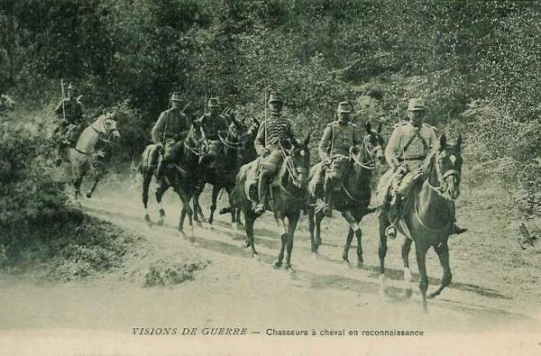
_Chasseurs à cheval en reconnaissance_
_Collection privée_

Le C.C. se relie aux autres forces alliées

- 3e division avec la brigade de cavalerie anglaise, à l’ouest.

- 5e division avec le 18e C.A. français à Thuin, à l’est.

- 1e division avec la division de droite de l’armée anglaise à Civry.

Peu après, le général Sordet prend des dispositions pour protéger la gauche de la Ve armée en attendant l’arrivée, sur la Sambre, des divisions de réserve du général Valabrègue.

**10h :**

La 3e D.C. est avertie que la cavalerie anglaise a évacué Binche devant une colonne de cavalerie allemande, appuyée par des cyclistes. La division reçoit l’ordre de monter à cheval pour tenir tête à cette colonne ennemie.

A la même heure, la 2e brigade d’infanterie est attaquée par des forces allemandes d’infanterie qui débouchent de Piéton.

Le général Sordet prépare le repli du C.C. sur la Sambre, où il pourra mieux résister. La 3e division continuera à faire face aux colonnes allemandes débouchant de Binche.

La 1e division est chargée d’occuper les ponts de la Sambre, de Fontaine-Valmont à Jeumont afin d’assurer le passage du C.C., mais après le passage, les sapeurs cyclistes des 3e et 5e D.C. préparent la destruction de ces ponts.

**16h :**

La 2e brigade d’infanterie doit se replier au sud de la Sambre, dans la région de Lobbes - Fontaine-Valmont.
A sa gauche, la 3e D.C. se replie vers Fontaine-Valmont - Jeumont, avec le 1e bataillon du 18e C.A.

**16h30 :**

Le général Lanrezac prévoit, dans une instruction, une offensive générale pour le 23 dans laquelle « le corps de cavalerie agira sur la rive gauche de la Sambre, en liaison avec le 18e C.A. d’une part et l’armée anglaise d’autre part. »

**21h :**

Le général Sordet télégraphie à la Ve armée : « En raison de la fatigue des hommes et des chevaux, il me semble difficile de remplir la mission qui m’a été confiée par l’instruction du 22 août ; en faisant une sélection, je pourrai envoyer un détachement sur la rive gauche de la Sambre, en liaison avec l’armée anglaise et avec la gauche du 18e C.A. »

**A la nuit :**

Les 3e et 5e D.C. sont regroupées vers Bersilies-l’Abbaye (3e division) et vers Boussignies (5e division).

Les passages de la Sambre sont tenus, De Jeumont à Fontaine-Valmont, par la 1e D.C., la 1e brigade d’infanterie et le groupe d’artillerie de la 3e division et de Fontaine-Valmont à Lobbes par la 2e brigade d’infanterie et l’artillerie de la 5e division.

Les ponts sont minés et prêts à être détruits.

La 2e brigade d’infanterie a subi de lourdes pertes. Le général Sordet espère pouvoir arrêter l’offensive allemande sur la Sambre.

### 23 août

Le C.C. se prépare à défendre la ligne de la Sambre, de Jeumont à Fontaine-Valmont avec la 1e D.C. renforcée de la 2e brigade d’infanterie, tandis que les 3e et 5e divisions sont maintenues en réserve générale vers Cousolre Bersilies - Bousignies.

**En matinée :**

Les escadrons qui ont passé la nuit en arrière de leurs positions gagnent leurs emplacements de combat. La 2e brigade de cuirassiers occupe la région de Jeumont - Erquelinnes

**8h30 :**

Le général Sordet reçoit ses ordres du commandement de la Ve armée :
« Ordre au C.C. de passer à gauche de l’armée anglaise. »

Peu après, le général Sordet est averti par la 5e brigade de cavalerie anglaise qu’elle occupe Haulchain et Fauroeulx et que la 1e division d’infanterie anglaise est à Rouveroy.

Le C.C. reste en attente de la relève par la 69e division de réserve, qui n’aura lieu qu’à partir de 16h.

**10h30 :**

Le groupe d’artillerie de la 1e D.C. ouvre le feu sur une colonne aperçue vers Sars-la-Buissière.

**13h :**

Le 1e escadron du 6e dragons annonce l’avance sur Lobbes d’une colonne d’infanterie allemande, d’un parti de uhlans à Biennes-lez-Appart et d’un escadron de cuirassiers de la Garde à Merbes-Sainte-Marie.

**14h :**

Le 4/6e dragons part à la découverte vers Binche, en cherchant le contact avec l’armée anglaise et se heurte à des patrouilles allemandes.

Les batteries de la 5e D.C., à Fontaine-Haute, ouvre le feu sur des groupes allemands débouchant du bois de la Houssière (près de Lobbes).

**15h :**

Des rafales d’obus de 77 et de 105 partent du plateau de Saint-Nicolas au sud du Bois de la Houssière et tombent sur les emplacements du 27e dragons. Les escadrons ramènent les chevaux en arrière. La canonnade dure jusqu’à 18h30.

**18h30 :**

Le C.C. se dirige en deux colonnes sur Maubeuge. Comme il ne peut pas, d’après le règlement, cantonner dans le périmètre de la place, le général Sordet choisit une zone de stationnement plus éloignée qui ne pourra être atteinte que dans une heure avancée de la nuit, au prix de lourdes pertes en chevaux.

- 1e division et Q.G. : vers Beaufort.
    3e division : vers Boussières.
    5e division : vers Ecuelin.

**En fin de journée :**

Le général Sordet apprend que l’armée anglaise doit se replier et il télégraphie :
« Armée anglaise, après engagement de ce soir, a demandé à traverser la place de Maubeuge pour se retirer sur le front Bavay - Maubeuge ; je demande si je dois conserver mission à sa gauche. »

La réponse du G.Q.G. est « oui ».

### 24 août : à l’aile gauche de l’armée anglaise

**7h30 :**

Un message radio de la Ve armée prescrit au général Sordet « de rassembler le C.C. dans la région de Berlaimont. »

Peu après, le général Sordet reçoit l’ordre général d’opérations de la Ve armée, selon lequel elle se retirera vers la ligne générale La Capelle - Hirson - Mézières, tandis que le C.C. se repliera sur Landrecies en gardant la liaison avec l’armée anglaise.

**Dans la matinée :**

Le général Sordet reçoit la visite du maréchal French (commandant du corps expéditionnaire britannique) qui lui exprime toute sa satisfaction de savoir que le C.C. soutiendra la gauche de l’armée britannique.

**En fin de journée :**

Le C.C. s’établit dans la région de Dompierre.

**En soirée :**

Le général Sordet reçoit des instructions du G.Q.G. : le C.C. cessera d’être aux ordres de la Ve armée et reviendra sous les ordres directs du commandant en chef. Quatre bataillons de chasseurs seront affectés comme soutien du C.C.

### 25 août

**0h30 :**

Le G.Q.G. donne l’ordre de mission du C.C. :
« La mission du C.C. est de renseigner sur la marche de l’aile droite allemande et de retarder si possible la marche des colonnes. Il pourra s’appuyer sur le barrage organisé par le général d’Amade.

L’intention du général Sordet est de gagner en deux étapes l’aile gauche de l’armée anglaise, afin de ménager ses régiments. Il décide de faire cantonner ses troupes au sud du Cateau, près de Bazuel, mais l’armée anglaise, serrée de près, précipite son mouvement et French demande instamment au général Sordet de gagner, le soir même, la gauche de son armée.

**12h30 :**

Le général Sordet prescrit de reprendre la marche vers l’ouest.

**En fin de journée :**

Après une marche de 50 km, le C.C. s’établit à la nuit dans la région de Walincourt, 15 km au sud de Cambrai.

### 26 août : bataille du Cateau

**[Lien vers croquis](../img/sordet_26_aout.jpg)** : marche du C.C. le 26 août

Les arrière-gardes de l’armée anglaise sont violemment attaquées, surtout le 1e C.A. à Landrecies - Le Cateau. Le maréchal French demande de couvrir la retraite au nord et à l’ouest.

**4h45 :**

Le chef de la mission française auprès de l’armée anglaise télégraphie au général Sordet :

- Le 1e C.A. anglais, attaqué dans ses cantonnements de Landrecies - Le Cateau, bat en retraite.

- Le 2e C.A. et la 4e brigade d’infanterie sont en retraite.

- Le 27, la retraite continuera sur Péronne.

- Le Maréchal French demande que vous couvriez la retraite au nord et à l’ouest.

**8h :**

Les divisions du C.C. sont alertées et rassemblées vers Gonnelieu, prêtes à intervenir.

**13h30 :**

Le général Sordet décide d’intervenir : le C.C. va se porter au nord de l’Escaut à l’attaque des forces allemandes.

- La 1e division attaque par Marcoing.
    La 3e division attaque par Masnières.
    La 5e division attaque par Crèvecoeur.

L’Escaut franchi, des reconnaissances signalent des troupes en marche contre l’aile gauche anglaise. L’artillerie des 1e et 3e divisions ouvre le feu sur une colonne allemande qui débouche de Cambrai et la 5e division attaque en direction de Séranvillers.

Les colonnes allemandes sont surprises par l’attaque de la cavalerie française et s’arrêtent pour lui faire face, ce qui permet à la gauche anglaise de se dégager, en échappant à l’encerclement.

Les Allemands n’osent pas poursuivre le C.C., qui peut à son tour se dégager et franchir l’Escaut.

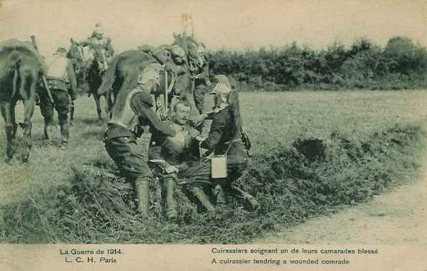
_Cuirassier français secouru par ses camarades_
_Collection privée_

**A la nuit :**

La C.C. s’établit à Longavesne (1e division), Liéramont (3e division) et Villers-Faucon (5e division et Q.G.).

### 27 août

**[Lien vers croquis](../img/sordet_27_aout.jpg)** : marche du C.C. le 27 août

**Dans la matinée :**

Le général Sordet apprend que l’armée anglaise continue son mouvement de retraite vers le sud, talonnée par les forces allemandes qui cherchent à la déborder par l’ouest. Déjà, on signale une colonne allemande en marche d’Havrincourt vers Fins. Dans ces conditions, il estime devoir maintenir son C.C. en liaison avec l’armée anglaise, pour la protéger d’un mouvement débordant.

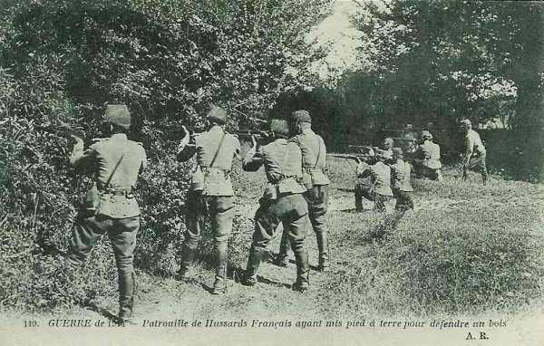
_Hussards français défendant un bois_
_Collection privée_

**9h :**

Les divisions sont rassemblées face au nord :

- 1e division vers Aizecourt-le-Bas.
    2e division vers Liéramont.
    5e division au nord de Villers-Faucon.

**9h30 :**

Les D.C. reçoivent l’ordre suivant :
« Une colonne, comprenant environ une brigade de cavalerie, deux bataillons d’infanterie, descend des bois d’Havrincourt vers le sud.
La 1e D.C. reconnaîtra et attaquera cette colonne par l’ouest.
La 5e division agira, en liaison avec l’armée anglaise (dont la gauche est en retraite vers Villers-Faucon), contre la colonne ennemie qui vient par Banteux sur Honnecourt.
Agir par mitrailleuses et canons, éviter l’accrochage.
Direction éventuelle de repli : entre Combles et Cléry. »

La 5e division livre un violent combat vers Epehy, les 3e et 1e D.C. s’engagent contre les colonnes débouchant d’Heudicourt et de Manencourt.

**En soirée :**

Le général Sordet est averti de la constitution de la VIe armée (Maunoury) à Moreuil et il est invité à adresser ses renseignements à cette armée, qui les transmettra au G.Q.G.

**A la nuit :**

Les divisions s’établissent à l’abri de la Somme

- 5e D.C. à Villers-Carbonel.
    3e D.C. à Estrées.
    1e D.C. à Foucaucourt.

### 28 août

**[Lien vers croquis](../img/sordet_28_aout.jpg)** : marche du C.C. le 28 août

Le général Sordet décide de porter ses C.C. dans la direction générale de Saint-Quentin pour attaquer les colonnes allemandes qui menacent les arrière-gardes anglaises.

**5h :**

Le général Sordet donne l’ordre de se diriger vers l’est pour chercher le contact avec la colonne de gauche de l’armée anglaise.

- 5e division vers Brie - Estrées - Vermand.
    3e division vers Saint-Christ - Athies - Tertry.
    1e division vers Epenancourt - Falvy.

**8h :**

Les quatre bataillons de chasseurs arrivent vers Villers-Carbonel en camion et doivent tenir les ponts de la Somme de Hem à Saint-Christ.

**10h :**

La 5e D.C. ouvre le feu d’Estrées-en-Chaussée contre la cavalerie allemande lorsque le général Sordet reçoit un télégramme du G.Q.G. lui enjoignant « d’agit en combinaison avec les 61e et 62e divisions de réserve, engagées au sud de Bapaume. »

Il décide de laisser la 5e D.C. en couverture face à l’est, dans la région d’Estrées-en-Chaussée et de rassembler les 1e et 3e D.C. pour les porter vers le nord. Les chasseurs maintiennent quelques sections pour garder les ponts de la Somme entre Hem et Cléry, le reste se dirigeant sur Moislains.

A peine les 1e et 3e D.C. viennent-elles d’entamer leur mouvement qu’une forte colonne de toutes armes est signalée entre Péronne et Vermand, près de Hancourt - Bouvincourt. N’entendant plus de canonnade, le général Sordet pense que le combat livré par les divisions du général d’Amade a pris fin, et dès lors il prescrit aux chasseurs de limiter leur mouvement vers le nord et de continuer à tenir les passages de la Somme.

**14h :**

Une forte colonne allemande de toutes armes se porte sur Mons-en-Chaussée sous la protection de batteries déployées au sud de Bouvincourt. Les 1e et 3e D.C. prennent les batteries allemandes à partie pendant une heure. La colonne allemande paraît arrêtée.

Comme les forces allemandes sont trop importantes pour tenter une attaque contre elles, le général Sordet ramène ses bataillons à l’ouest de la Somme, sous la protection des bataillons de chasseurs.

Les bataillons de chasseurs chargés de tenir la tête de pont à Péronne sont pris sous le feu de l’artillerie allemande. Ils finissent par être refoulés à l’ouest de la Somme.

**22h :**

La canonnade cesse. Les chasseurs se replient sur Montdidier, sous la protection de la cavalerie et gagnent la région de Roye.

### 29 août : à l’aile gauche de la VIe armée

**[Lien vers croquis](../img/sordet_29_aout.jpg)** : marche du C.C. le 29 août

Le général Maunoury (VIe armée) demande au général Sordet d’assurer la couverture de l’aile droite de la VIe armée sur l’Avre. Il compte reprendre l’offensive pour rejeter les Allemands au nord de la Somme.

Le C.C. est complètement épuisé par les combats des jours précédents et a dû effectuer une marche de nuit pour parvenir dans la région de Parvillers, où il arrive entre 2h et 3h du matin.

L’armée anglaise a abandonné la ligne de la Somme et les forces allemandes débouchent entre Bray, Péronne et Nesle.

**11h :**

Le général Maunoury se rend auprès du général Sordet à Parvillers. Il approuve les intentions de ce dernier de ramener ses divisions à l’abri de l’Avre. Le général Sordet constitue toutefois une division provisoire avec les meilleurs éléments de son C.C.

**13h :**

Le mouvement de repli vers l’Avre commence.
En fin de journée :

- Le C.C. s’établit sur l’Avre :
    QG et 3e division : à Ailly-sur-Noye.
    5e division : à Exclainvillers.
    1e division : à Saint-Firmin.

### 30 août

**[Lien vers croquis](../img/sordet_30_31_aout.jpg)** : marche du C.C. les 30 et 31 août

**01h :**

Le G.Q.G. télégraphie au général Sordet que le C.C. est rattaché à la VIe armée.

**Dans la matinée :**

Le C.C. reçoit ses ordres de marche :
La VIe armée va battre en retraite. Le C.C. doit faire mouvement vers Ailly-sur-Noye - Breteuil - Froissy - Bailleul.

**12h :**

Les D.C. sont alertées.

**14h :**

Les D.C. se rassemblent

- La 3e D.C. près de Rouvrel.
    La 5e D.C. au nord de Louvrechy.
    La 1e D.C. au nord-ouest de Paillard.

**17h :**

L’artillerie de la 3e D.C. ouvre le feu contre de l’infanterie et de l’artillerie allemande qui se déploient sur les hauteurs de Moreuil.

**18h30 :**

Les divisions abandonnent la ligne de l’Avre et viennent stationner dans la région de Froissy.

- 5e D.C. à Froissy.
    3e D.C. à Breteuil.
    1e D.C. à Crèvecoeur.

### 31 août

Le général Maunoury décide de continuer le mouvement de retraite vers le sud. En fin de marche, le C.C. doit éclairer à l’ouest dans les directions de Crèvecoeur - Breteuil - Montdidier.

**9h :**

Les divisions se mettent en marche par trois itinéraires différents. En fin de marche, elles se trouvent :

- 1e D.C. : à Saint-Martin-le-Nœud.
    5e D.C. : Warluis.
    3e D.C. : Abbécourt.

Maunoury décide de créer un front de résistance sur le Mont César - Fitz-James - Sacy-le-Grand en vue d’arrêter la ruée allemande. Cette ligne de résistance est prolongée vers l’ouest par le C.C., établi sur le Thérain, de Bailleul à Beauvais. La division provisoire tient la région de Pont-Sainte-Maxence.

### 1e septembre

**[Lien vers croquis](../img/sordet_1_5_septembre.jpg)** : marche du C.C. du 1 au 5 septembre

**En matinée :**

L’aile droite de la VIe armée est violemment attaquée et pour éviter une menace d’enveloppement, le général Maunoury doit envoyer l’ordre suivant :

« Une forte colonne allemande a passé l’Oise à Compiègne hier soir. Verberie est attaquée, ce matin, par la 2e division de réserve. L’armée anglaise est sur la ligne Nanteuil - Betz. »

Pour parer à la menace d’enveloppement sur son flanc droit et ne pas perdre le contact avec l’armée anglaise, la VIe armée va étendre sa droite jusqu’à Senlis. »

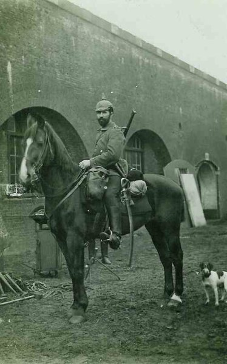
_Dragon allemand_
_Collection privée_

**12h :**

Le général Sordet alerte ses divisions qui sont rassemblées, prêtes à défendre la ligne du Thérain mais les reconnaissances ne signalent aucune force allemande.

**17h :**

Les divisions rentrent dans leur cantonnement.
Un violent combat se livre entre Pont-Sainte-Maxence et Verberie et doit se replier sur Senlis.

Maunoury donne ses instructions pour le 2 septembre :
La VIe armée se repliera vers le sud. La 56e division de réserve restera vers Senlis.
Du 2 au 3 septembre, la D.C. aura son Q.G. à Méru.

**En fin de journée :**

Le général Maunoury reçoit du général Galliéni son ordre d’opérations n° 1 qui lui apprend que la VIe armée fait partie des troupes de défense de Paris.

A droite de la VIe armée, l’armée anglaise se retire sur Dammartin-en-Goële. Un nouvel ordre de la VIe armée prescrit de pousser plus au sud les mouvements prévus.

### 2 septembre

Le C.C. poursuit la retraite et se dirige vers le sud en trois colonnes :

- 1e D.C. par Berneuil vers Monneville.
    5e D.C. par Auteuil vers Hénonville.
    3e D.C. par Abbecourt vers Amblainville.

**En soirée :**

- La 1e D.C. campe à Neuilly-en-Vexin.
    La 5e D.C. se trouve à Haravillers.
    La 3e D.C. est à Harronville.

**23h :**

L’ordre de la VIe armée stipule que le C.C. sera mis à disposition du G.Q.G.

### 3 septembre

**En matinée :**

Le commandant de la VIe armée, Maunoury, a décidé, dans la soirée du 2, de rapprocher son armée du camp retranché de Paris.

Le C.C. doit se diriger par Meulan au sud de la Seine. Les divisions marchent en trois colonnes jusqu’à la Seine.
La 1e D.C. franchit la Seine à Mantes et les deux autres à Meulan.

Les colonnes traînent de longues files de chevaux blessés. A l’arrière suivent les cavaliers démontés.

**En soirée :**

Voici la situation des unités

- La 1e D.C. : Guerville.
    La 5e D.C. : La Faloise.
    La 3e D.C. : Ecquevilly.

### 4 septembre

**[Lien vers croquis](../img/sordet_4_5_septembre.jpg)** : marche du C.C. les 4 et 5 septembre

**En matinée :**

Un télégramme du G.Q.G. stipule que les divisions doivent se trouver dans la région de Longjumeau - Brunoy le 7 septembre.

L’agent de liaison du G.Q.G. se présente au général Sordet et lui fait savoir que, au cours de opérations prochaines, le C.C. sera chargé de couvrir l’aile gauche des armées anglaises.

Le C.C. profite de son passage au voisinage des grands centres d’élevage pour remplacer certains chevaux. Le C.C. en acquiert 300 à 400.

Le général Sordet dirige le C.C. vers la région de Saint-Cyr. Son intention est de gagner la région de Longjumeau en trois petites étapes.

**Vers midi :**

Le Q.G. est à Saint-Cyr et les divisions se trouvent :

- 1e D.C. à Mesnil-Saint-Denis.
    3e D.C. à Voisin-le-Bretonneux.
    5e D.C. à Guyencourt.

**A 20h :**

Le général Sordet apprend que les armées françaises s’apprêtent à reprendre l’offensive et que le C.C. est à nouveau rattaché à la VIe armée. Il doit rejoindre le nord-est de Paris.

### 5 septembre : bataille de la Marne

L’armée allemande qui, après avoir traversé la Somme dans la région de Péronne, marchait sur Paris, a peu à peu infléchi ses têtes de colonnes vers le sud-est.

Paris n’est plus directement menacé et l’armée de Paris est en situation d’attaquer les Allemands de flanc. Joffre prescrit la reprise de l’offensive.

Le commandant de la VIe armée rappelle le C.C. à l’aile gauche de son armée, afin de couvrir son attaque sur l’Ourcq.

**15h30 :**

Le général Maunoury décide que le C.C. se portera d’abord de la région de Versailles dans la région de Nanteuil-le-Haudouin pour chercher ensuite à former un échelon avancé à l’aile gauche de la VIe armée.

Le C.C. fait mouvement vers l’est de Nanteuil-le-Haudouin et doit aborder l’Ourcq le 6 septembre. Il doit ensuite poursuivre jusqu’à Château-Thierry le 7. Une division est transportée par voie ferrée de Versailles à Dammartin-en-Goëlle et Nanteuil-le-Haudouin.

### 6 septembre

**En matinée :**

Les 1e et 3e D.C. faisant route par voie de terre débordent Paris, l’une par le nord, l’autre par le sud et gagnent la région de Gonesse où elles arrivent en fin d’après-midi.
Le Q.G. est installé à Gonesse. La 5e D.C. est embarquée à Versailles et transportée par chemin de fer jusqu’à Dammartin-en-Goëlle et Mesnil-Mitry.

La VIe armée prend contact avec l’aile droite des forces allemandes établies sur la ligne Acy - Marcilly - Chambry mais ne peut atteindre l’Ourcq.

**19h30 :**

Le général Maunoury prescrit que la 5e D.C. débouche par le nord de Bouillancy pour attaquer les bois de Montrolle et Etavigny.

### 7 septembre

**[Lien vers croquis](../img/sordet_7_septembre.jpg)** : marche du C.C. le 7 septembre

**En matinée :**

La 5e D.C., après avoir achevé ses débarquements à Dammartin-en-Goëlle et au Mesnil-Mitry, marche sur Betz qu’elle occupe, puis sur Antilly où elle se heurte à des forces allemandes qui l’obligent à évacuer Betz. Pendant ce temps, les 1e et 3e D.C. se dirigent sur Nanteuil-le-Haudouin.

**Vers midi :**

La 5e D.C. est rejetée à l’ouest de Betz et se reforme près de Boissy-Fresnoy. Les 1e et 3e D.C. débouchent au nord-est de Nanteuil-le-Haudouin.

Le général Sordet prescrit à la 5e D.C. de franchir le ravin de Macquelines et de s’établir sur le plateau nord-ouest de Betz.

Les Allemands, voyant le danger qui menace leur aile droite, occupent solidement Betz, Cuvergnon et Villers-les-Rotes.

Pour essayer de déborder les Allemands, les 1e et 3e D.C. sont déployées sur le front Betz - Cuvergnon et l’artillerie ouvre le feu sur ces localités. La 5e D.C. doit déboucher plus largement au nord et se porter vers La Ferté-Milon afin de menacer les lignes de communications allemandes.

**21h :**

Les D.C. se trouvent à nouveau réunies sur le plateau de Lévignen. Le C.C. a parcouru plus de 100 km.

**11h :**

Un convoi de ravitaillement arrive à Nanteuil-le-Haudouin. On distribue les vivres apportés par camions.

### 8 septembre

La VIe armée a gagné un peu de terrain mais les éléments avancés n’ont pas dépassé la ligne Etrepilly - Acy -Betz.

Le général Maunoury ordonne de reprendre l’attaque sur tout le front. La 3e D.C. atteint sans difficultés le plateau de Bargny. Elle reçoit l’ordre d’attaquer Cuvergnon. La 5e D.C. gagnera Boursonne pour essayer d’atteindre La Ferté-Milon. La 1e D.C est maintenue en arrière vers Levignen.

**9h :**

Un ordre du G.Q.G. remet le commandement du C.C. au général Bridoux, commandant de la 5e D.C.

### Conclusion

Le C.C. Sordet illustre la mauvaise utilisation de l’arme de la cavalerie. Le G.Q.G. lui donne, tout au cours du mois d’août 1914, des missions allant dans tous les sens, sous prétexte que la cavalerie est très mobile grâce à ses montures : passer du Luxembourg à la province de Liège, puis dans la province de Namur, dans le Brabant, vers le Hainaut et enfin effectuer une retraite jusqu’à Paris, sans laisser de répit aux hommes et aux chevaux.

Or, ces derniers nécessitent des soins : ferrer, desseller régulièrement, et surtout abreuver et bien alimenter en fourrage. Un cheval ne se plaint jamais mais quand il arrive au bout de sa résistance, il s’affale pour ne plus se relever.

Joffre, officier du Génie, n’a pas compris que l’on ne pouvait pas tout demander à des unités de cavalerie et celles-ci sont arrivées à bout de force à la bataille de la Marne. Elles n’ont pas pu effectuer leur rôle traditionnel de poursuite des Allemands en retraite.
