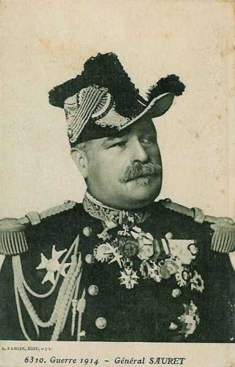
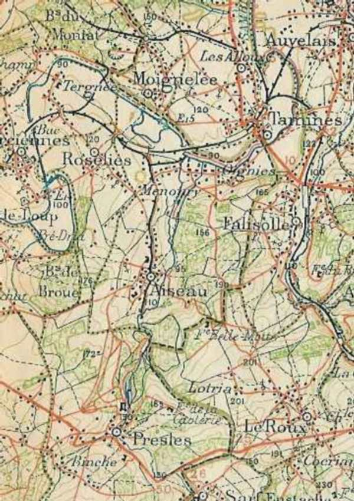
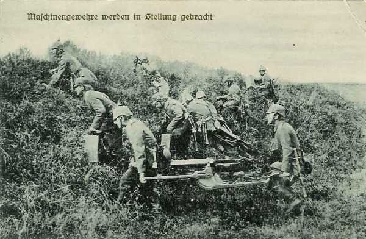
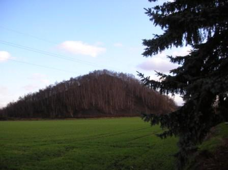
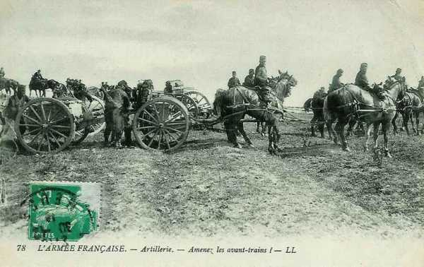

# Combat de Roselies (21 - 23 août 1914) - bataille de Charleroi

Le combat de Roselies est un épisode de la bataille de Charleroi. Les généraux de corps d’armée reçoivent l’ordre du général Lanrezac de faire garder les ponts de la Sambre par des sections mais de laisser les gros sur la rive sud de la rivière. Les Allemands bousculent les sections et traversent la Sambre. Le général Verrier veut à tout prix reprendre les ponts et lance des attaques.

### Cadre du combat

Le combat de Roselies est un épisode de la bataille de Charleroi, livré par une partie de la 5e division d’infanterie (général Verrier), faisant partie du 3e C.A (général Sauret.) d’une part  et une partie du 10e C.A. allemand (général von Emmich) d’autre part. 4060 soldats français y laissèrent leur vie, faisant partie surtout du 74e R.I. de Rouen.

### Les forces en présence

**Armée française**

_Général Sauret_
_Collection privée_

**Une partie du 3e C.A. : (Rouen), général Sauret**

| Unités | Commandant | Régiments |
| --- | --- | --- |
| 5e division | Verrier | 36e R.I.(Caen)39e R.I. (Rouen)74e R.I. (Rouen)129e R.I. (Le Havre)7e régiment de chasseurs à cheval (1 escadron)43e R.A.C. (Caen) |

**Le 25e R.I., faisant partie du 10e C.A.**

Les régiments ayant participé à l’assaut ont subi de fortes pertes : il s’agit des 25e, 74e et 129e R.I.

**Armée allemande**

_Général von Emmich (10e C.A.)_
_Collection privée_

**Une partie du 10e C.A. : (Hannovre), général von Emmich**

| Unités | Commandant | Régiments |
| --- | --- | --- |
| 19e division | Hoffman | Füsilier-Regiment Nr. 73 (Hannover)
Hannoversches Infanterie-Regiment NR (Hannover)
Infanterie-Regiment Nr 78 (Osnabrück)
Oldenbürgisches Infanterie-Regiment  Nr. 91 (Oldenburg)Braunschweigisches Husaren-Regiment Nr 17 (Braunschweig)Hannoversches Feldartillerie-Regiment Nr. 26 (Verden)Osfriesisches Feldartillerie-Regiment Nr. 62 |
| 20e division | Schmundt | Hannoversches Infanterie-Regiment Nr. 77Infanterie-Regiment Nr. 79Braunschweigisches Infanterie-Regiment Nr. 92 (Braunschweig)Hannoversches Infanterie-Regiment Nr. 164Braunschweigisches Husaren-Regiment Nr 17 (Braunschweig)Feldartillerie-Regiment Nr. 10 (Hannover)Feldartillerie-Regiment Nr. 46 (Wolfenbüttel-Celle) |

### Le terrain

La Sambre suit un cours sinueux entre Charleroi et Namur. Elle forme une boucle vers le nord entre Farciennes et Tamines. Roselies est située au centre de cette boucle, à 100/120 mètres d’altitude. Plus au sud, le terrain s’élève vers le plateau d’Aiseau (145 mètres d’altitude).

Le long de la boucle, entre Farciennes et Tamines, la Sambre est traversée par trois ponts :

- Le pont du chemin de fer (ligne Namur - Charleroi), à l’ouest de Roselies.
  Le pont routier entre Tergnée et Grand Champ, au nord.
  Le pont de l’écluse à l’est.

Roselies est à moitié agricole, à moitié minière. Deux fosses (et les terrils correspondants) se situent, l’une au nord-ouest de la localité (fosse Saint-Jacques), l’autre à l’est (fosse n° 2). Au sud de Roselies se situe le bois de la Broue.

_Roselies et environs_
_Ancienne carte d’E.M._

### Les dispositions du général Lanrezac

Les ordres du G.Q.G. sont d’attaquer les forces allemandes au nord de la Sambre. Toutefois, la Ve armée est en flèche par rapport à ses voisines.

A gauche, le corps expéditionnaire anglais fait savoir qu’il aura ses têtes de colonne le 23 sur le front Mons - Erquelinnes.

A droite, la IVe armée (de Langle de Cary) se trouve en retrait au sud de la Lesse. Lanrezac est par conséquent obligé de disposer le 1e C.A. le long de la Meuse pour flanc-garder son armée contre toute attaque venant de l’est.

La Ve armée doit-elle attaquer seule ?

Lanrezac réunit ses collaborateurs pour leur faire part de ses intentions et dit en substance qu’il ne peut attaquer avant que sont armée soit réunie. Il faut en outre que la IVe armée fasse sentir son action en direction de la Lesse pour que les troupes allemandes qui sont sur la rive droite de la Meuse (IIIe armée allemande, von Hausen) ne puissent attaquer les arrières de la Ve armée

Jusqu’à ce que la Ve armée soit entièrement réunie (on attend encore le 18e C.A.), les unités doivent se tenir sur la rive sud de la Sambre. Lanrezac interdit que les gros d’infanterie s’engagent dans les bas fonds de la Sambre. Les passages de la rivière doivent en revanche être tenus par des éléments légers qui interdiront leur franchissement par la cavalerie et seront prêts, quand aura lieu l’offensive générale, d’assurer le débouché au nord de la Sambre.

L’E.M. de la Ve armée rédige l’ordre à l’intention des généraux de C.A. dans ce sens :

« L’armée se tiendra prête à prendre l’offensive au premier ordre, en franchissant la Sambre pour se porter sur le front général Namur - Nivelles.
Cette offensive étant liée à celle des armées voisines, le moment où elle se produira ne peut être dès maintenant précisé.
En conséquence, les C.A. feront serrer demain leurs gros sur leurs têtes et prendront les dispositions d’attente suivantes, à l’effet de s’opposer éventuellement à un débouché des forces ennemies sur la rive sud de la Sambre.
.......
Les C.A. feront tenir par des postes les ponts de la Sambre sur leur front.
Ces postes auront pour mission, non pas de résister dans le fond de la vallée à des colonnes de toutes armes, mais simplement d’arrêter des incursions éventuelles de cavalerie.
Secteurs de surveillance des ponts de la Sambre :
1e C.A. : pont de Floreffe et pont en liaison avec la garnison de la place de Namur.
10e C.A. : du pont de Floreffe exclu, au Pont-de-Loup.
3e C.A. : du Pont-de-Loup inclus au pont de Marchiennes exclu.
18e C.A. : du pont de Marchiennes inclus au pont de Thuin inclus.
........ »

Cet ordre à la fois offensif et défensif place les commandants de C.A. devant un problème difficile. Ils doivent se tenir prêts à prendre l’offensive mais en attendant, ils doivent se mettre sur la défensive.

Quand cette instruction arrive le 21 à 14h30, le combat est déjà engagé à Roselies.

### 21 août

La boucle de Roselies est défendue  par les 7e et 8e compagnies du II/74e R.I. Les autres compagnies, réserve du bataillon, sont à Aiseau. Plus au sud, à Binches, les 1e et 3e compagnies du 74e s’installent.

**14h :**

Une colonne d’infanterie allemande, appuyée par une batterie d’artillerie, descend de Lambusart et vient se heurter aux sections chargées de la défense des ponts de l’Ecluse, du chemin de fer et de Tergnée. La première attaque échoue.

L’artillerie allemande, en position au Roton et à Wairchat (près de Farciennes), tire sur Roselies et Pont-de-Loup.

**15h :**
Deux nouvelles attaques sont repoussées mais les défenseurs de Tergnée subissent leurs premières pertes. Une ambulance a été installée dans une ferme de Roselies. Un détachement du 7e chasseurs à cheval se replie sur Aiseau.

Le 3e bataillon du 91e régiment hanovrien soutenu par une compagnie de mitrailleuses aborde les ponts précédés de civils et, cette fois, les deux compagnies doivent abandonner la ligne de la Sambre. La retraite s’opère sur le centre de Roselies, bombardé par l’artillerie allemande. Les troupes françaises se retirent ensuite sur Aiseau.

**17h30 :**
L’artillerie allemande suspend son tir  et les Allemands, précédés de leurs officiers pistolet au poing pénètrent dans Roselies. Les 7e et 8e compagnies regagnent le plateau d’Aiseau.

Les instructions du 21 août à 16h prescrivent aux C.A. d’occuper des positions défensives au sud de la Sambre et de ne tenir les passages que par des postes chargés d’arrêter les incursions de cavalerie, mais les commandants de division jugent indispensable de garder le contrôle des ponts de la Sambre.

La perte de Roselies alarme le commandement du 3e C.A., le général Sauret. A son initiative personnelle et sur les instances du général Verrier, commandant de la 5e division, la lutte va reprendre au cours de la nuit.

### 22 août

**01h :**

Les premières compagnies du I/74e abordent Roselies et y pénètrent. Les sections progressent avec précaution dans le village sans y rencontrer de résistance et croient que les Allemands se sont retirés.

Tout à coup, la fusillade crépite. Elle part des maisons, par les fenêtres et les soupiraux. Un combat de rues s’engage et dure jusqu’à l’aube, tandis que de nombreuses habitations flambent.

Dans le même temps, le III/74e s’est porté à gauche du 1e bataillon  en longeant les bois de Broue et a pris comme objectif l’ouest de Roselies. Il atteint les premières maisons.

**03h :**
Les compagnies du III/74e reçoivent leurs premières balles et ripostent aussitôt. Les Allemands sont juchés dans le clocher et font pleuvoir une grêle de balles qui causent aux troupes françaises des pertes sensibles.

_Soldats allemands installant des mitrailleuses_
_Collection privée_

Le colonel Schmidt demande l’aide à deux compagnies du 136e R.I. qui se trouvent à Aiseau. Il obtient d’abord satisfaction, mais elles doivent ensuite s’arrêter par ordre de la 20e D.I.

**04h :**
La 10e brigade informe le Q.G. du 3e C.A. des difficultés dans lesquelles se débattent les troupes engagées à Roselies mais le général Sauret fait part à la Ve armée de son intention de reprendre l’attaque avec de nouvelles forces.

**A l’aube :**
Le 129e R.I. reçoit l’ordre d’attaquer avec deux bataillons  (1e et 3e) qui ont passé la nuit à Presles et aux Binches. Le 2/43e R.A.C, en position à la cote 175 près des Binches doit appuyer l’attaque.

**05h :**
Le 129e est en marche. Les deux bataillons se portent en avant, le 1e à droite du 3e
Les deux bataillons se dirigent vers le nord, par l’ouest de la route Presles - Aiseau et atteignent sans incident la lisière sud du bois de Broue. Les deux bataillons prennent les dispositifs de combat, une moitié en première ligne, l’autre moitié en soutien 400 m en arrière. Aussitôt, l’artillerie allemande règle son tir. Les compagnies sont prises sous le bombardement qui leur cause des pertes sensibles. Les compagnies de première ligne atteignent les abords de Roselies, mais un quart de l’effectif est déjà hors de combat. Un dernier bond jette les unités dans le village où les Allemands se défendent pied à pied.

Le III/129e garnit les lisières à l’ouest de l’église, pendant que la 10/129e R.I. fait face à l’ouest vers Farciennes et que le I/129e R.I. borde l’est de la localité vers la gare d’Aiseau. Les fantassins sont soumis à un feu frontal et d’enfilade et les pertes sont lourdes. Au 129e, sept capitaines sont mis hors de combat.

Les Allemands engagent de nouvelles forces : les 2e et 3e bataillons du 92e régiment envahissent la boucle de la Sambre et le 2e groupe du 62e régiment d’artillerie tire sur Roselies, des hauteurs de Wairchat. Toute progression vers le nord est rendue impossible.

**9h :**
A l’ouest, les colonnes allemandes du 10e C.A., qui ont franchi la Sambre à Pont-de-Loup, apparaissent sur le champ de bataille dans le flanc gauche des régiments français, qui risquent d’être coupés.

Les Allemands ont placé leurs mitrailleuses sur les terrils et achèvent d’annihiler la résistance.

_Terril où les Allemands ont placé une mitrailleuse_
_Photo de l’auteur_

**9h15 :**
La retraite est décidée. Les bataillons décrochent péniblement sur Pierre-aux-Rossignols  à travers un terrain coupé de clôtures.
Le 3/74, maintenu en réserve, se déploie et attaque, permettant, avec l’aide d’une section de mitrailleuses, aux compagnies éprouvées de se replier.

**10h :**
Le 25e R.I. à droite reflue à son tour. Il ne reste à Aiseau que le III/136e dont la 12e compagnie, à 800 m au nord de la localité, est fortement menacée. La 11e compagnie doit contre-attaquer pour la dégager et perd près de 50% de son effectif.

**10h45 :**
Le 136e à son tour abandonne Aiseau, pendant que le 74e et le 129e s’écoulent vers le sud.

L’artillerie divisionnaire  tire encore sur l’infanterie allemande qui n’est plus qu’à 600 m des pièces. Les avant-trains sont amenés mais un canon doit être abandonné après avoir été mis hors d’usage, car tous les chevaux qui le tractaient ont été tués. La batterie perdra deux canons et trois caissons.

_Artilleurs amenant les avant trains_
_Collection privée_

- Le 74e retire ses compagnies aux Binches.
  Le 129e prend position à la lisière nord du parc de Presles puis rétrograde à l’abri de la cote 175.

### Conclusion :

Le 74e R.I. a été engagé sur l’ordre du général Verrier, dans les fonds de la vallée de la Sambre, en contradiction avec les ordres de la Ve armée qui prescrivaient de n’occuper que le versant sud de cette vallée. Le combat de Roselies est une illustration des doctrines d’offensive à outrance qui ont prévalu dans l’armée française au cours des premiers mois de la guerre.

### Régments ayant pris part au combat

**[25e R.I. (Cherbourg, Saint-Vaast-la-Hougue)](article_09_131.md)**

**[74e R.I. (Rouen, Elbeuf)](article_09_179.md)**

**[129e R.I. (Le Havre)](article_09_234.md)**

### Souvenirs de la bataille

Malgré plus de 90 années d’écart, le souvenir du combat s’est perpétué dans l’entité de Roselies.
Le 18 août 2007 a eu lieu une cérémonie en présence d’une délégation du 74e R.I.
Une place à Roselies porte le nom de ce régiment, et une rue à Rouen (lieu d’origine du 74e) s’appelle Rue de Roselies.

_Roselies : monument aux Français_
_Photo de l’auteur_

_Roselies : monument aux Français (détail)_
_Photo de l’auteur_