# Combat d’Arsimont (21 - 23 août 1914) - bataille de Charleroi

Le combat d’Arsimont est un épisode de la bataille de Charleroi. La 19e division est chargée de garder les ponts de la Sambre vers Auvelais - Tamines. Les Allemands profitent d’un pont non gardé pour franchir la rivière. La division va s’épuiser en vaines tentatives pour les reprendre.

### Cadre du combat

Le combat d’Arsimont est un épisode de la bataille de Charleroi, livré par la 19e division (général Bonnier), faisant partie du 10e C.A (général Defforges.), contre la 2e division de la Garde prussienne.

### Les forces en présence

**19e division d’infanterie, général Bonnier, partie du 10e C.A. français (Rennes), général Defforges**

| Unité       | Commandant | Régiments                                           |
| ----------- | ---------- | --------------------------------------------------- |
| 37e brigade | Bailly     | 48e R.I. (Guingamp)71e R.I. (Saint-Brieuc)          |
| 38e brigade | Rogerie    | 41e R.I. (Rennes)70e R.I. (Vitré)7e R.A.C. (Rennes) |

Le 47e R.I. sera également demandé en renfort.

**2e division d’infanterie de la Garde : général von Winckler, partie du C.A. allemand de la Garde (Berlin), général von Plettenberg**

| Unité                  | Commandant | Régiments                                                                                                 |
| ---------------------- | ---------- | --------------------------------------------------------------------------------------------------------- |
| 3e brigade de la Garde |            | Grenadier-Regiment Nr. 1 (Königsberg)Grenadier-Regiment Nr 2 (Stettin)Garde-Schützen Bataillon (Berlin)   |
| 4e brigade de la Garde |            | Grenadier-Regiment Nr 3 (Königsberg)Grenadier-Regiment Nr 4 (Rastenburg)2. Garde-Ulanen-Regiment (Berlin) |

### Le terrain

La Sambre suit un cours sinueux entre Charleroi et Namur. Elle forme trois boucles entre Tamines et Floriffoux.

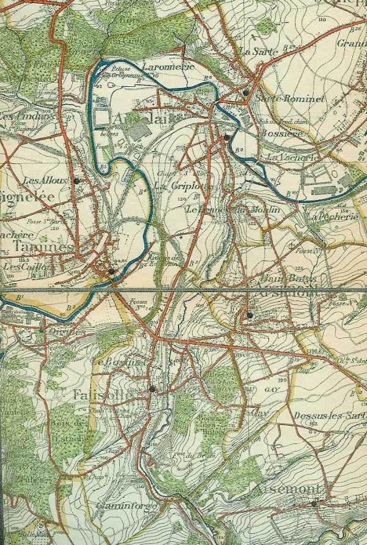
_Région d’Arsimont -Auvelais_
_Ancienne carte d’E.M._

### 20 août

La 19e division quitte ses cantonnements de Mettet à 7h, par un temps superbe. L’accueil de la population belge est chaleureux : les soldats reçoivent des cigares, de la bière... La distance à parcourir jusqu’à Fosse-la-Ville n’est que de 10 km, cette localité, but de la marche en avant, étant à 6 km de la Sambre.

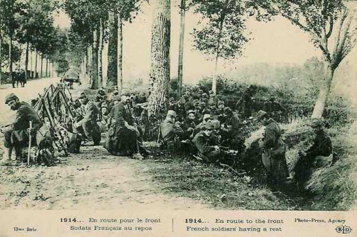
_Troupes françaises en route pour le front_
_Collection privée_

La mission de la 19e division est d’assurer la garde des ponts de la Sambre, de Floriffoux à Jemeppe, en soutien de la brigade de cavalerie de C.A. (6e chasseurs d’Afrique et 13e hussards).

L’avant-garde est sous les ordres du général Rogerie, qui commande la 38e brigade et dispose, en plus de ses régiments d’infanterie, de deux groupes de 75 (1e et 3e du 7e R.A.C.), d’un escadron de cavalerie divisionnaire et d’une compagnie de génie divisionnaire.

Le 41e R.I. (lieutenant-colonel Passaga) doit garder les ponts de la Sambre. Le reste de l’avant-garde cantonnera à Fosse-la-Ville, sauf les 1e et 2e bataillons du 70e, qui sont envoyés à Vitrival.

Le gros de la 19e division occupe des cantonnements à Mettet - Saint-Gérard - Stave - Denée. Le Q.G. de la division est à Fosse-la-Ville et celui du C.A. à Florennes. Le 1e bataillon du 41e occupe le secteur à gauche depuis Jemeppe, le 2e celui de droite jusqu’à Floriffoux. Une section est détachée à Auvelais, une autre à Tamines. A vol d’oiseau, le secteur fait 12 km, mais le front à garder est de 30 km en suivant les méandres de la Sambre.

**12h :**

Les compagnies du 41e atteignent la Sambre. Les passages à garder sont nombreux : un passage en moyenne par kilomètre de rivière.
Les soldats creusent des tranchées, les barricades sont montées sur les routes mais non sur les voies ferrées : on évacue un important matériel de Namur vers le nord de la France.

Les chasseurs d’Afrique battent le terrain au nord de la Sambre jusqu’à la route Velaine - Gembloux. D’après les renseignements, les divisions allemandes sont aussi près de la Sambre que les divisions françaises.

**16h30 :**

Le commandant du 10e C.A. envoie à la 19e division le télégramme suivant : « tenez la 19e division sous les armes, prête à partir, et portez immédiatement un bataillon à Arsimont pour tenir les ponts de Tamines et d’Auvelais. »

**17h :**

Le 2e bataillon du 70e est désigné pour la garde des ponts de Tamines et d’Auvelais.

**18h :**

- La 7e compagnie doit garder le pont de Tamines
    Les 6e et 8e compagnies cantonneront à Arsimont. **Les officiers ne disposent pas de cartes précises.**

**20h :**

Le capitaine Béhague constate qu’Auvelais est une importante localité de 10.000 habitants, largement étalée sur la boucle de la Sambre. Le pont est englobé dans une agglomération de maisons. Il est impossible de s’y déployer car il y en fait huit passages à garder dans la boucle d’Auvelais :

- A l’est, le pont de la Pêcherie, l’écluse n° 17 et le viaduc de la voie normale.
    Au nord, le grand pont, une passerelle et l’écluse n° 16.
    A l’ouest, le viaduc de la voie normale et celui de la voie étroite.

Ces passages s’étalent sur 1.500 m. Les sections doivent être scindées et réparties.

**20h10 :**

La 19e division prévient de la présence de l’infanterie allemande à Balastre, Saint-Martin, Musy, Corroy-le-Château.
Il est interdit de passer sur la rive gauche de la Sambre sans un ordre spécial.

### 21 août

**04h :**

Le 2e groupe du 7e d’artillerie est à Fosse-la-Ville et va reconnaître les positions. Un brouillard opaque emplit les vallons et enveloppe les crêtes, rendant les reconnaissances laborieuses.

Le 1e groupe prend position à la cote 190, à l’est d’Arsimont et le 2e groupe à la lisière du bois de Ham, le 3e sur la crête à l’est du château de Taravisée.

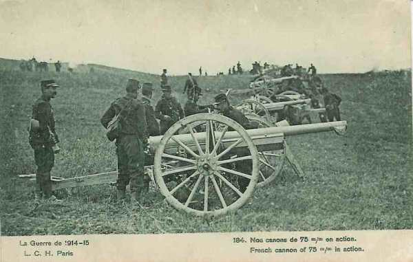
_Groupe de 75 en action_
_Collection privée_

Les bataillons de réserve de l’avant-garde sont alertés : le 1e bataillon arrive à Fosse-la-Ville à 4h, d’où il part aussitôt pour Taravisée où il arrive vers 6h.
Le 3e bataillon du 70e part à 9h pour la lisière sud d’Arsimont.

Le 71e est alerté à 2h dans ses cantonnements de Mettet et de Biesmerée. Il entre vers 9h à Vitrival.

Le capitaine Béhague se rend sur le grand pont d’Auvelais. Il peut se rendre compte que le pont est dominé par les pentes descendant de La Sarte. Les assaillants pourront fusiller les défenseurs du bas-fond d’Auvelais. Ces derniers ne pourront tirer couchés et seront obligés de se découvrir, offrant de belles cibles.

**05h :**

Le capitaine Béhague appelle au téléphone le commandant Blanchard et demande l’autorisation d’organiser la défense des hauteurs de La Sarte. Refus : il y a interdiction formelle de passer au-delà de la Sambre. Le commandant Blanchard désigne la 6e compagnie pour renforcer la compagnie d’Auvelais. La 1e section est envoyée au pont de la Pêcherie, les trois autres sections à la gare d’Auvelais.

**6h30 :**

Les trois sections sont déployées sur les pelouses rases au pied des hauteurs couvertes de La Sarte et du Bois du Curé qui les surplombent.

Personne ne garde les deux viaducs ouest de la boucle d’Auvelais. **Il y a un vide de 3 km entre les défenseurs d’Auvelais et ceux de Tamines.**

**7h :**

Les sections des prairies et de l’écluse n° 16 signalent que des cyclistes allemands commencent à sortir du Bois du Curé et qu’ils contournent la boucle par l’ouest. Ils se saisissent des viaducs non gardés et attendant que le gros de l’avant-garde arrive.

**7h30 :**

Le brouillard devient plus ténu et l’on voit s’infiltrer des Allemands sur les hauteurs de La Sarte.

**8h30 :**

Les balles tombent dru dans Auvelais. Au début, il n’y a pas beaucoup de blessés car le brouillard persiste dans le fond de la vallée, et les Allemands tirent au jugé, mais les hauteurs de La Sarte se garnissent de plus en plus d’Allemands.

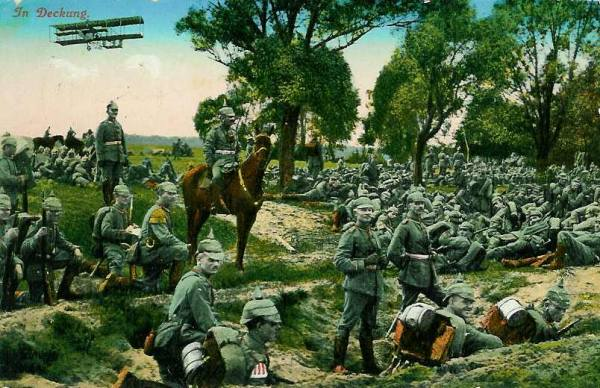
_Infanterie allemande en couverture_
_Collection privée_

**9h :**

Le brouillard se dissipe et le nombre de tués et blessés augmente rapidement. Pour leur échapper, les soldats se couchent dans les herbes, mais ils demeurent visibles des hauteurs et ne peuvent riposter, couchés contre des adversaires trop haut placés. L’argile est trop dure pour creuser des tranchées en cette période d’été.

**9h30 :**

Les survivants de la 2e section et de la 6e compagnie refluent vers la gare, ceux de la 3e section se rapprochent des maisons du chemin de halage. Entre Auvelais et le P.C. du 70e à Arsimont, il y a une distance de 2,5 km. Aussi quand le général Bonnier questionne au téléphone le commandant du 70, celui-ci lui répond « Rien de sérieux pour le moment ; l’ennemi semble exécuter devant nous une marche de flanc et se couvrir par des flanc-gardes mobiles ; nous n’aurons probablement pas d’engagement aujourd’hui. »

**10h :**

Le commandant du 3e bataillon reçoit l’ordre de porter deux compagnies à Auvelais.

**10h23 :**

Le général Bonnier a fait placer l’artillerie du 1e groupe du 7e R.A.C. au bord du plateau qui domine la Sambre de 100 m. Comme les ponts de la Sambre sont à la fois très rapprochée et très en contre-bas, les artilleurs ont placé leur canons presque sur la crête. Personne n’a pensé à utiliser la contre-pente un Km en arrière, qui aurait défilé les canons. Les batteries montreront donc leurs lueurs à chaque tir.

Le général Bonnier et son état-major aperçoivent des silhouettes en mouvement du côté de La Sarte, qui descendent vers la Sambre. Le général donne ordre à la 2e batterie de balayer le terrain. Sur ces entrefaites, il apprend que le pont de Tamines a été perdu. Les 1e et 3e batteries prennent position plus à l’ouest pour le battre. La 2e batterie reste en place à la cote 190.

**11h30 :**

Un cycliste arrive au PC du 70e régiment avec le message du chef du 3e bataillon : « Le village de La Sarte est fortement occupé par de l’infanterie ennemie. La 9e compagnie ne peut plus avancer.... ».

**12h30 :**

L’artillerie française, située sur la crête 190 - 192 essaie d’atteindre le clocher de La Sarte, à une distance de 3500 m. Une poussière indique que le clocher a été touché. Il ne se passe toujours rien sur le pont de Tamines.

**12h45 :**

On découvre que le pont de Tamines est toujours entre les mains françaises, que le renseignement donné était faux. Les Allemands occupent toujours Les Alloux dont le clocher leur sert d’observatoire.

**14h :**

Deux sections du III/70e occupent les greniers des maisons. Deux mitrailleuses françaises sont installées au sud de la voie ferrée. Les servants voient des tirailleurs allemands, à genoux, à l’ouest du clocher de La Sarte. Les mitrailleuses tirent sur l’église d’où partent des coups de feu.

La route de Velaine à Tamines apparaît noire de troupes. L’infanterie allemande arrive l’arme sur l’épaule. On distingue quatre files ininterrompues. L’artillerie française tire dans cette direction et le vide se fait sur la route.

**14h30 :**

Un grondement se fait entendre puis quatre obus de 150 éclatent près de la 2e batterie qui occupe la même place depuis le matin. Les salves se succèdent de deux en deux minutes, et enfin, un avion allemand survole la batterie canonnée. Quarante coups en tout sont tirés. La batterie française doit changer de place et se reporte 200 m à gauche.

L’artillerie de campagne allemande entre en jeu contre Tamines, la partie sud d’Auvelais et contre Arsimont. Ce bombardement a pour but d’ouvrir le chemin aux colonnes d’infanterie.

**15h :**

Les Allemands envahissent la boucle d’Auvelais par le viaduc ouest de la voie normale. C’est le point faible du dispositif car il existe un vide de 3 km entre les défenseurs d’Auvelais et ceux de Tamines.

La section de la 6e compagnie qui est dans les prairies en face de la passerelle est prise de dos et doit se disséminer dans les maisons voisines. A la nouvelle de cette irruption, la décision est prise d’évacuer Auvelais. La 5e compagnie décroche, couverte par les 9e et 6e compagnies. Le passage du pont se fait sans trop de pertes. La retraite commence par la grand’ rue de la ville qui occupe l’est de la boucle. Du beffroi de l’hôtel de ville, un lieutenant voit très nettement les tirailleurs allemands progressant, homme par homme, de villa en villa, à l’ouest de la ville. Les Allemands pénètrent dans Auvelais.

Les défenseurs du viaduc est d’Auvelais et de l’écluse n° 17 n’ont pas été prévenus de la retraite et sont encerclés.

**16h :**

La section d’arrière-garde s’arrête au Tienne du Moulin. De cet endroit, l’on voit de longues files de tirailleurs qui s’avancent par bonds de La Sarte vers la Sambre. Les obus de 77 commencent déjà à tomber sur Ham-sur-Sambre, mais, de ce côté, les Allemands seront tenus en échec par le I/41e. A l’ouest d’Auvelais, à l’intérieur de la boucle, les Allemands avancent vigoureusement. Des sections françaises situées à Tamines ouvrent le feu sur eux. Les Allemands se rejettent dans le ravin de la Biesme, d’où ils tenteront de gagner Arsimont par les pentes, et Falisolle par la vallée.

- Le 3e bataillon s’est réuni à la lisière nord d’Arsimont
    La 12e compagnie au carrefour nord.
    La 9e et la 10e près de la fosse n° 2.
    La 11e compagnie en réserve près de l’église au centre du village.

Les lignes allemandes progressent de clôture en clôture, de maison en maison sur la route d’Auvelais à Falisolle. Une batterie de 105 prend position près du nouveau cimetière d’Auvelais, à 2000 m. Les mitrailleuses ouvrent le feu. Il en résulte un grand désordre dans la batterie française dont les attelages et les servants s’enfuient.

La lisière nord d’Arsimont subit un bombardement intense. Un feu de mousqueterie part du Tienne du Moulin où l’infanterie allemande a pris pied. Le bombardement s’étend sur la crête d’Arsimont. Les compagnies de première ligne se replient sur cette crête, puis à la lisière sud de la localité.

**16h20 :**

Dès qu’il a appris la perte d’Auvelais, le général Bonnier décide de la reprendre et d’y engager le gros de la division. Il envoie au général Bailly l’ordre de rejeter les Allemands au-delà de la Sambre. L’ordre de soutenir la 37e brigade est envoyé au 7e R.A.C et à l’artillerie de C.A., mise à la disposition du général Bonnier par le général Defforges (commandant du 10e C.A.). Le 7e d’artillerie compte 9 batteries et le 50e, 12, à la cote 207 entre Vitrival et Le Roux (à 7 km d’Auvelais), mais ces batteries sont dans l’impossibilité de participer au combat, arrivées peu de temps avant le coucher du soleil.

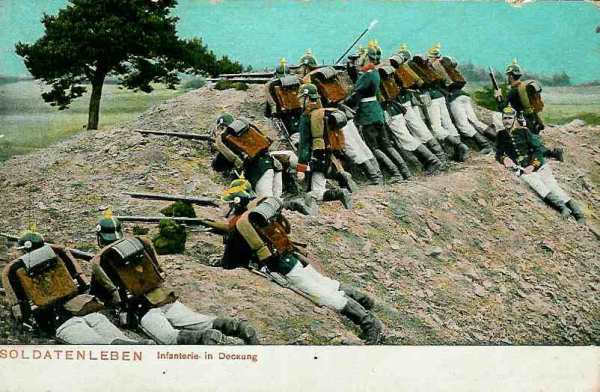
_Infanterie allemande tirant_
_Collection privée_

**16h30 :**

Le commandant du 1e bataillon du 70e reçoit l’ordre suivant : « Le 2e bataillon qui résiste depuis le matin dans Auvelais commence à être débordé ; portez-vous le plus tôt possible à Arsimont avec trois compagnies en laissant une compagnie à Taravisée pour garder le P.C. de la brigade et soutenir l’artillerie en batterie dans ces parages. »

Le bataillon part aussitôt vers le carrefour sud d’Arsimont. Au passage de la crête 190-192, le bataillon subit un bombardement important et les compagnies s’abritent dans les fermes et les maisons de la lisière sud. La troupe s’engage dans la rue d’Arsimont qui est balayée par les balles. Les Allemands ne sont pas très loin.

**17h :**

Le régiment est mis en alerte et un ordre est lu : « L’ennemi a réussi au prix de grandes pertes à passer la Sambre. La 37e brigade est chargée d’aller le rejeter au-delà de la rivière. » Les hommes se rassemblent en hâte mais on oublie de distribuer les cartouches des voitures à munitions. Chaque fantassin n’aura que 88 cartouches.
La troupe prend la route d’Aisemont.

**17h35 :**

Le 1e groupe du 7e R.A.C., qui se trouve au sud d’Aisemont, reçoit l’ordre de prendre position sur la crête 190-192 afin de soutenir la 37e brigade. Dix minutes plus tard, les batteries prennent position à la cote 190. Elles ne sont pas défilées et couronnent le sommet. Par-dessus la crête, les artilleurs voient les incendies dans Auvelais et Tamines. La fumée cache tout : pas un objectif visible vers Auvelais.

Le 71e arrive dans Aisemont, suivi des batteries du 7e qui traversent le village au galop. Le régiment se déploie en ligne de sections par 4 : à gauche le 2e bataillon, au centre le 1e et à droite le 3e.

- Les objectifs sont :
    2e bataillon : Tamines.
    1e et 3e bataillon : Arsimont et Auvelais.

La marche des bataillons est ralentie par de nombreuses clôtures de fil de fer.

**17h45 :**

La lisière nord d’Arsimont ayant été complètement abandonnée par les Français, les Allemands y pénètrent et la mettent en état de défense.

Lorsqu’il voit les Allemands descendre dans le ravin de la Biesme en direction d’Arsimont, le commandant décide d’évacuer Tamines. La 3e section de la 8e compagnie se porte sur le Tienne d’Amion pour couvrir de son feu le repli des 7e et 8e compagnies. La section s’installe face au débouché du pont qu’elle prend d’enfilade. Les 7e et 8e compagnies se replient sur le carrefour au nord de Falisolle. Par la suite, la 3e section sera décimée.

Après la guerre, un monument sera édifié en l’honneur du caporal Lefeuvre, tué après avoir tiré 243 étuis de cartouches.

- Les compagnies du 1e bataillon du 70e se déploient :
    La 1e au centre traverse la localité du sud au nord en suivant la route.
    La 4e marchera à droite.
    La 3e marchera à gauche.

**18h :**
Les compagnies du 70e partent sans se faire précéder de patrouilles. Elles se portent résolument en avant, sous les obus et sous les balles. Aux ailes, elles progressent par bonds successifs, mais au centre, la progression est plus lente : il faut se porter de maison en maison.
Le commandant du bataillon arrive au sud de l’église.

Les canons du 1e groupe du 7e ouvrent le feu vers Auvelais, à une distance de 2.800 m avec des obus explosifs. La riposte de l’artillerie allemande est immédiate. Les obus tombent sur les avant-trains et certains chevaux sont tués. L’artillerie allemande est bien défilée : elle ne montre aucune lueur et il est par conséquent impossible de lui répondre.

Le 48e part de Fosse-la-Ville par la route d’Arsimont vers Auvelais. **Les cartouches des voitures à munitions n’ont pas été distribuées.**

**18h30 :**

Sous les rafales de mousqueterie, la compagnie du centre (70e R.I.) est arrêtée à environ 100m au sud de l’église. Les rafales partent de toute la lisière nord d’Arsimont. Le 1e groupe du 7e R.A.C. tire à plein et le bataillon repart à l’assaut. L’église est dépassée. La ligne gagne 300 m est à présent à mi-pente, à hauteur du cimetière et des premières maisons de Haut-Batys (au nord d’Arsimont), mais, là, les feux partis du carrefour nord et du Tienne du Moulin l’arrêtent à nouveau.

Un peu plus tard, le 71e arrive sur les lieux et parvient à pousser au-delà. Les Français sont près du pont de la Pêcherie, où les Allemands commencent à arriver. Un corps à corps s’engage sur la rive sud de la Sambre.

La contre-attaque des trois compagnies du 1e bataillon (70e) lui a coûté 170 hommes. Le gros de la division va reprendre la suite du combat.

**18h45 :**

Le 71e aborde la crête 192 et la traverse entre Grosse Haie et le bois de Harsée. Le soleil s’est déjà couché. Tamines et Auvelais sont en feu.

Les 3e et 1e bataillons atteignent la grand route à droite et à gauche du carrefour sud d’Arsimont. Le commandant s’interroge sur la direction à prendre, ne connaissant pas précisément les positions allemandes.

**19h :**

- La 7e compagnie part par la grande route pour s’emparer du Tienne d’Amion, qui domine la Sambre.
    La 6e compagnie va occuper le moulin et la gare de Falisolle.
    La 5e compagnie s’établit au nord de la grande route, à la cote 135, d’où elle domine le charbonnage de Falisolle.
    La 8e compagnie est plus à droite, en liaison avec le 1e bataillon qui va entrer dans Arsimont.
  Les Allemands ne sont pas encore sortis de Tamines et ceux qui viennent d’Auvelais n’ont pas encore atteint le charbonnage de Falisolle.
  La 8e compagnie, entraînée dans le combat de rues d’Arsimont avec le 1e bataillon, va subir de fortes pertes.

**19h15 :**

Au 71e R.I., l’ordre de départ est donné aux 1e et 3e bataillons. Il n’y a plus qu’une demi-heure de clarté. La 3e compagnie suit la rue qui conduit d’Arsimont à Auvelais. Celle-ci est balayée par les balles. L’église est pourtant dépassée mais presque aussitôt après, les sections sont obligées de s’abriter dans les maisons.

- La 3e compagnie n’a pas vu d’Allemands et n’a pas tiré.
    A gauche, la 2e compagnie se maintient à hauteur de la 3e.

Plus à gauche, la 1e suit une ruelle étroite, traverse des jardins et aperçoit une localité que le capitaine croit être Auvelais (en réalité la lisière nord d’Arsimont). La compagnie effectue un premier bond de 100 m. Le mouvement en avant reprend et aborde des jardins entourés de haies. A ce moment, les pertes sont sévères, la compagnie est criblée de balles. Les soldats s’abritent derrière leur sac.

- A droite, la 4e compagnie a dépassé la crête d’Arsimont en rampant dans les cultures.

- Les 11e et 12e compagnies subissent de fortes pertes.

- La 10e compagnie est déployée le long de la route de la Clef d’Or et franchit la crête d’Arsimont, puis descend la pente entre Haut-Batys et la fosse n° 1. Dès le franchissement de la crête, les balles font des ravages. Un bond porte les hommes jusqu’à hauteur des maisons de Haut-Batys.

- A l’extrême droite se trouve la 9e compagnie. Elle descend le ravin, entre la fosse n° 1 et n° 2, qui aboutit au pont de la Pêcherie. La descente s’effectue par bonds, sans pertes. Toutes les autres compagnies sont arrêtées.

**19h30 :**

Le 48e régiment se déploie, le 1e bataillon à gauche de la grande route, le 3e à droite et le 2e en réserve. Il fait nuit noire quand le déploiement est terminé. La marche est assez lente à cause des clôtures en fil de fer.
Le régiment arrive à hauteur du chemin Aisemont - Ham, à 4 km d’Auvelais.

**19h45 :**

Le général Bailly se tient à cheval à 100 m au sud de l’église, malgré les balles qui pleuvent sur la route. Il fait nuit.

La clique du 1e bataillon (71e R.I.), rassemblée au carrefour, bat et sonne la charge. Bientôt, il ne reste plus que deux tambours.

- La 3e compagnie se porte en avant et descend la rue du village contre un ennemi invisible. Malgré d’importantes pertes, quelques éléments arrivent au contact des patrouilles allemandes. Un violent corps à corps s’engage dans les rues mais les fantassins français sont tirés à bout portant par les Allemands cachés dans les maisons.

- A gauche, la 2e compagnie traverse la rue qui descend à la Biesme vers l’ouest. Les maisons sont occupées par les Allemands qui fusillent les fantassins français au passage. Sous les balles parties du carrefour nord, la 2e compagnie finit par se coucher.

- Partie plus à gauche, la 1e compagnie s’est trompée de direction dans la nuit. Elle va aboutir au carrefour nord. La compagnie finit par gagner la rue d’Arsimont.

- A la 3e compagnie, dix sergents sont tués, ainsi que 125 hommes. Les survivants refluent à gauche dans le village. Dans la rue d’Arsimont se trouvent les débris des trois compagnies qui se regroupent autour des gradés qu’ils rencontrent.

- A l’extrême gauche, la 8e compagnie du 2e bataillon réussit à arriver jusqu’à Pont-à-Biesme, à l’entrée d’Auvelais.

- A droite, la 10e compagnie arrive à hauteur des patrouilles allemandes qui viennent d’occuper Haut-Batys et les fusillent de flanc. Elle ne parvient toutefois pas à pénétrer dans le village.

- A l’extrême droite, la 9e compagnie a continué à descendre dans le creux du terrain. Elle subit quelques pertes dues aux balles tirées du Haut-Batys et de l’autre rive de la Sambre, où la Garde prussienne ouvre le feu à 2000 m. Une section arrive à quelques mètres de la Sambre, à l’est du pont de la Pêcherie. La compagnie reste trois quarts d’heure sur cette position.

Dans le village d’Arsimont, des incendies viennent de se déclarer entre le carrefour nord et l’église du village. Les patrouilles allemandes ont mis le feu avant de quitter les maisons. La lueur des incendies éclaire la rue et les jardins et les mitrailleuses allemandes entrent en jeu à chaque mouvement.

Le 71e est définitivement arrêté devant le carrefour nord d’Arsimont, le Haut-Batys et la fosse n° 2.

**20h :**

Le général Bonnier fait savoir au C.A. que sa gauche, vivement pressée, réclame l’appui de la 20e division à Tamines et à Arsimont. Il est impressionné par l’étendue des pertes qu’a subi le 71e R.I.

**21h :**

Le général Bonnier ordonne à la 37e brigade d’abandonner Arsimont.

**21h15 :**

Le général Bonnier fait son rapport : « Arsimont a dû être abandonné en présence de forces considérablement supérieures. J’ai établi une position de repli avec les éléments de la division qui me restent entre Arsimont et Cortil-Mozet - Bois-de-la-Ville. Il serait urgent que la 20e D.I. appuie la 19e. Je garde encore les ponts de Ham-sur-Sambre, Mornimont et Franière. »

**21h45 :**

La 19e division donne un ordre à la 38e brigade : « Faites évacuer les ponts de la Sambre par le 41e ; tous les itinéraires des différents bataillons passeront par le château de Taravisée pour aller sur Fosse-la-Ville. »

**22h :**

Les clairons français sonnent le « cessez le feu, rassemblement. »
Les 71e et 48e R.I. rebroussent chemin vers le carrefour sud d’Arsimont, puis vers Aisemont.

**23h :**

Dans l’intervalle entre l’église et le carrefour nord d’Arsimont, les brancardiers français croisent les brancardiers allemands dans la recherche des blessés.

A Falisolle, les Allemands mettent le feu à de nombreux wagons de marchandises qu’ils arrosent de pétrole.

**24h :**

Les différentes unités se trouvent à Fosse-la-Ville. Les Allemands n’ont pas poursuivi. Ils occupent le charbonnage de Falisolle.

### 22 août

**En matinée :**

Il règne dans Fosse-la-Ville un énorme encombrement. Tous les régiments s’y trouvent :

- Le 70e R.I. est le premier arrivé, puis le 41e qui vient d’abandonner sur ordre les ponts de la Sambre.

- Les débris du 71e arrivent, suivis d’isolés qui tenaient encore la lisière sud d’Arsimont.

- Viennent ensuite le 48e, le 7e d’artillerie et deux bataillons du 270e et finalement le 50e d’artillerie : au total 15 ou 16.000 hommes.

Dans le 70e et 71e, le moral est assez bas : les soldats ont vu leurs camarades touchés par des balles sans savoir d’où elles venaient. Ces deux régiments ne prendront pas part aux combats du 22.

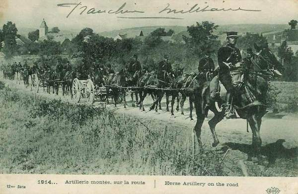
_Artillerie française montée sur route_
_Collection privée_

En revanche, dans les régiments non encore engagés, l’état d’esprit est excellent.

**1h45 :**

La 19e division reçoit du C.A. l’ordre d’attaquer au lever du jour dans la direction Arsimont - Auvelais tandis que la 20e division attaquera à 3h30 de Vitrival - Le Roux vers Tamines.

**4h :**

Le 2e R.I. de la 20e division s’engage à gauche de la 19e division. Il a ses avant-postes à Aisemont. La compagnie de tête se trompe de route et suit la voie ferrée jusqu’au passage à niveau à l’ouest d’Aisemont.
Le régiment ne parvient pas à trouver la liaison avec les régiments de la 19e division. La compagnie de tête aperçoit quelques maisons. Il s’agit de Gay et non d’Arsimont. La compagnie pénètre dans Gay. On s’y bat dans la rue presque corps à corps. Les Allemands se sont enfermés dans les maisons et fusillent les français, qui doivent se replier dans un vallonnement au sud du village.

**6h30 :**

Le général Bonnier est à son poste de commandement à Cortil-Mozet et ordonne que le 48e R.I. attaque vers Arsimont pour rejeter vers la Sambre les forces allemandes qui ont franchi la Sambre à Auvelais.

Le 2e bataillon du 41e aura pour mission de protéger le flanc droit du 48e.

L’ordre est donné au 7e R.A.C. de soutenir le 48e qui va reprendre Arsimont et Auvelais. Les trois groupes sont alignés à la lisière du bois.

Deux groupes du 50e auront pour mission d’occuper la crête 190 - 192 et d’appuyer la progression du 48e. Les deux groupes sont en position d’attente entre Cortil-Mozet et Grosse-Haie. Les deux autres sont derrière Cortil-Mozet.

**8h :**

La compagnie de droite du 2e R.I. a été arrêtée devant la ferme de Dessus Les Sarts par le feu d’une mitrailleuse allemande. Plus à droite, la 6e compagnie gravit la cote 192 et arrive à 200 m de la lisière sud de Grosse-Haie mais est prise sous le feu de mitrailleuses. Les soldats doivent s’aplatir sur le sol.

Le brouillard persiste dans le creux de terrain du Sec et masque le dispositif des 48e et 41e. La première ligne du 48e commence à émerger du brouillard et à monter la cote 190.

Le général Bonnier croit venu le moment de porter son artillerie en avant. Il se porte sur la cote 190 derrière laquelle le 48e vient de disparaître. Il ne doute pas du succès de l’offensive et demande au général Comby, commandant de la 37e division, un régiment en renfort. Celui-ci lui cède la 2e zouaves.

La 7e compagnie du 41e atteint le centre d’Arsimont. Avant d’arriver à l’église, elle se redresse face au nord et commence à descendre la pente qui conduit au nord de Haut-Batys. Plus à gauche, la 5e compagnie s’est portée contre le nord de La Grosse-Haie.

Les compagnies de première ligne du 48e franchissent la crête au nord du ruisseau de Supré. A ce moment, les mitrailleuses allemandes de Haut-Batys et de la fosse n° 2 se dévoilent, ouvrent le feu à 1000 ou 2000 m et balaient toute la crête. En un instant, le régiment est fauché.
Les survivants refluent et repassent la crête, cherchant un abri dans le ravin de Supré. A gauche du 48e, la 7e compagnie du 41e qui descendait les pentes du centre d’Arsimont vers Haut-Batys est de même arrêtée par le feu et elle reflue sur le centre d’Arsimont.

Le commandant du 2e zouaves décide d’une manoeuvre : le régiment passera à droite de la ferme et prendra pour objectif la fosse n° 2 du charbonage, tandis que le 48e reprendra la fosse n° 1.

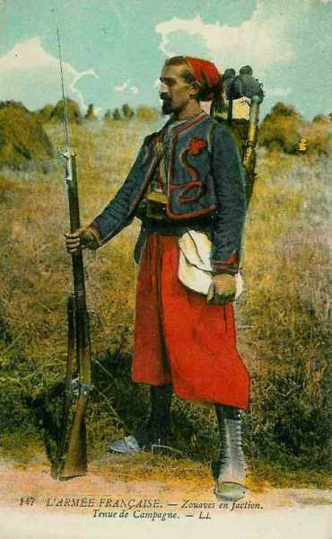
_Zouave_
_Collection privée_

**9h :**

Les compagnies de tête du 2e R.I. pénètrent dans le village de La Grosse-Haie. Elles sont accueillies par un feu violent de mitrailleuses et de mousqueterie partant du bois de Harsée. Les 5e et 11e compagnies organisent défensivement le village.

**9h15 :**

Le 2e zouaves monte sur la cote 190. Les zouaves descendent à droite de la ferme, peu inquiétés par les balles, car ils sont encore à 2 km des Allemands. Ils traversent le ruisseau de Supré. A leur gauche, les débris du 48e, galvanisés par leur exemple, arrivent à leur hauteur.

**9h30 :**

Les clairons des zouaves sonnent la charge. Devant eux, il n’y a plus le moindre couvert jusqu’à la fosse n° 2 du charbonnage et jusqu’à Haut-Batys. Alors, de toutes les maisons de Haut-Batys et de la fosse N° 2 jaillissent les balles des fusils et des mitrailleuses qui balaient la crête. De l’autre côté de la Sambre (Bois du Curé) arrivent des « marmites » qui éclatent avec fracas sur la crête. De larges brèches se produisent dans les rangs mais les zouaves continuent leur marche et arrivent au ruisseau de la Pêcherie. Cinquante d’entre eux poussent jusqu’à la fosse N° 2. En un rapide corps à corps, ils se rendent maîtres de l’usine et montent à l’assaut du terril mais quelques instants après, ils doivent se replier dans un taillis voisin. Après une deuxième tentative, le 2e zouaves est définitivement arrêté. Nulle part, l’on n’a vu une compagnie de la Garde prussienne à découvert.

**Le régiment a perdu 700 hommes.**

L’artillerie, qui se trouvait à 2.500 m de Haut-Batys et de la Fosse n° 2 n’a pas pu prêter main forte à l’attaque, faute de renseignements sur la position des Allemands.

**10h :**

Du PC de Cortil-Mozet, le général Bonnier a vu les zouaves refluer vers la cote 190. La grand’ route est couverte de blessés qui regagnent l’hôpital de Fosse.

Il décide de mettre en état de défense la position Cortil-Mozet - Aisemont, une crête de 2 km. Il y dispose les 156 canons du 10e C.A.

La situation reste toutefois précaire car dans la plaine rase, tous les mouvements sont surveillés par les mitrailleuses du Haut-Batys, de la fosse n° 2 et par les batteries situées dans le Bois du Curé.

**11h :**

Pour protéger le repli du 2e zouaves, le général Comby déploie en avant de la cote 190 une ligne du 2e tirailleurs. L’accalmie se produit sur le champ de bataille. Un soleil ardent brûle la plaine.

**14h :**

Les premiers éclaireurs allemands montés sortent de Haut-Batys sans recevoir un coup de fusil.

**17h :**

Le général Bonnier reçoit l’ordre du commandant de C.A. de battre en retraite.

### Conclusion

Le combat d’Arsimont est événement dramatique pour les forces françaises. En attaquant à découvert contre un adversaire retranché et disposant de mitrailleuses, trois régiments d’élite ont été décimés. Peu à peu, les généraux vont en tirer les conclusions et éviter de lancer les troupes dans de telles attaques sans une importante préparation d’artillerie.

### Régiments ayant participé au combat

**[41e R.I. (Rennes)](article_09_147.md)**

**[47e R.I. (Saint-Malo)](article_09_153.md)**

**[48e R.I. (Guingamp)](article_09_154.md)**

**[70e R.I. (Vitré)](article_09_175.md)**

**[71e R.I. (Saint-Brieuc)](article_09_176.md)**

### Souvenirs des combats

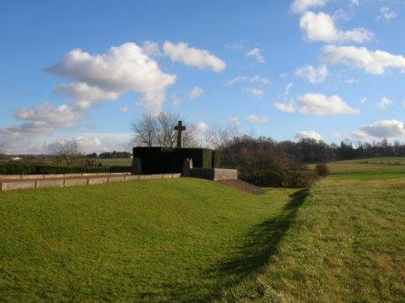
_Arsimont - Monument du 10e corps d’armée français_
_Photo de l’auteur_

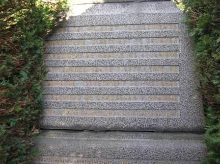
_Arsimont - Monument du 10e corps d’armée français - détail_
_Photo de l’auteur_

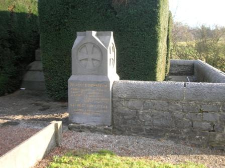
_Arsimont - Monument du 10e corps d’armée français - détail_
_Photo de l’auteur_

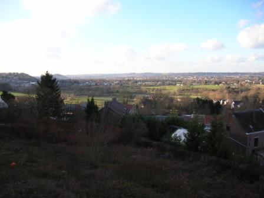
_Arsimont - Vue du champ de bataille_
_Photo de l’auteur_

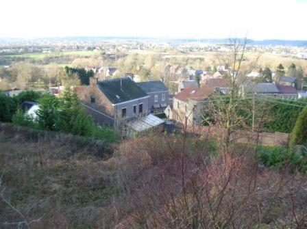
_Arsimont - Vue du champ de bataille_
_Photo de l’auteur_

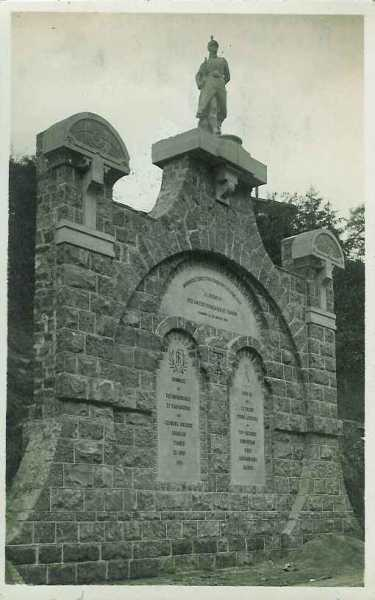
_Tamines - Monument du caporal Lefeuvre_
_Ce monument a été déplacé et reconstruit sous une autre forme en 1973_
