# Combat de Lobbes (22 - 23 août 1914) - bataille de Charleroi

Le 18e C.A. forme l’aile gauche de la ve armée française, et garde le secteur de Lobbes et de Thuin. Il se fait attaquer par deux C.A. allemands mais n’opère de retraite qu’après une vive résistance, sur ordre du général Lanrezac.

### Cadre du combat

Le combat de Lobbes est un épisode de la bataille de Charleroi, livré par le 18e C.A. français contre le 7e C.A. allemand et la 2e division de réserve de la Garde (10e corps de réserve).

### Les forces en présence

**Armée française**

**18e C.A. : (Bordeaux) général de Mas-Latrie**

_Général de Mas Latrie (18e C.A.)_
_Collection privée_

35e division : général Excelmans

| Unité | Commandant | Régiments |
| --- | --- | --- |
| 69e brigade | Durand | 6e R.I. (Saintes / Doé de Mandreville)123e R.I. (La Rochelle / Hubert) |
| 70e brigade | Pierron | 57e R.I. (Rochefort, Libourne / Dapoigny)144e R.I. (Bordeaux / Gauthier) |
| Elements divisionnaires |  | 10e régiment de hussards (un escadron - Tarbes)24e R.A.C. (La Rochelle / Dunal) |

36e division : général Jouannic

| Unité | Commandant | Régiments |
| --- | --- | --- |
| 71e brigade | Dion | 34e R.I. (Mont-de-Marsan / Capdepont)49e R.I. (Bayonne / Burgala) |
| 72e brigade | Sibille | 12e R.I. (Tarbes / De Sèze)18e R.I. (Pau / Gloxin) |
| Eléments divisionnaires |  | 10e régiment de hussards (un escadron - Tarbes)14e R.A.C. (Tarbes / Vincent du Portail) |
| Réserves |  | 218e R.I. (Pau)249e R.I. (Bayonne) |

**Armée allemande**

**7e C.A. : (Münster) général von Einem**

_Général von Einem (IIIe armée)_
_Collection privée_

13e division d’infanterie : (général von dem Borne)

| Unité | Commandant | Régiments |
| --- | --- | --- |
| 25. Infanterie-Brigade |  | Infanterie-Regiment Nr. 13Lothringisches Infanterie-Regiment Nr. 158 |
| 26.Infanterie-Brigade |  | Infanterie-Regiment Nr. 15Infanterie-Regiment Nr. 55Westfälisches Jäger-Bataillon Nr. 7Stab u. 3.Eskadron/Ulanen-Regiment Nr. 16 |
| 13. Feldartillerie-Brigade |  | 2. Westfälisches Feldartillerie-Regiment Nr. 22Mindensches Feldartillerie-Regiment Nr. 58 |

14e division d’infanterie : (général Fleck)

| Unité | Commandant | Régiments |
| --- | --- | --- |
| 27. Infanterie-Brigade |  | Infanterie-Regiment Nr. 16Westfälisches Infanterie-Regiment Nr. 53 |
| 79. Infanterie-Brigade |  | Infanterie-Regiment Nr. 56Infanterie-Regiment Nr. 573.Eskadron/Ulanen-Regiment Nr. 16 |
| 14. Feldartillerie-Brigade |  | 1. Westfälisches Feldartillerie-Regiment Nr. 7Klevesches Feldartillerie-Regiment Nr. 43 |

**10e C.A. de réserve : (Hannover) général von Kirchbach**

_Général von Kirchbach (10e C.A.R.)_
_Collection privée_

2e division d’infanterie de réserve de la Garde : (général von Süsskind)

| Unité | Commandant | Régiments |
| --- | --- | --- |
| 26. Reserve-Infanterie-Brigade |  | Westfälisches Reserve-Infanterie-Regiment Nr. 15Westfälisches Reserve-Infanterie-Regiment Nr. 55 |
| 38. Reserve-Infanterie-Brigade |  | Hannoversches Reserve-Infanterie-Regiment Nr. 77Hannoversches Reserve-Infanterie-Regiment Nr. 91Hannoversches Reserve-Jäger-Bataillon Nr. 10Reserve-Ulanen-Regiment Nr. 2Reserve-Feldartillerie-Regiment Nr. 20 |

### Le terrain

A l’ouest de Charleroi, la Sambre suit un cours sinueux, dans une vallée encaissée. La ville de Lobbes est bâtie sur la pente du plateau nord de la rivière. Face à elle se trouve le plateau de Heuleu, partiellement agricole et partiellement boisé. Un pont-route relie Lobbes à l’autre rive, en direction de Biercée.

**[Lien vers croquis](../img/carte_combat_lobbes.jpg)**

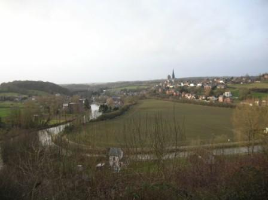
_Lobbes - La boucle de la Sambre avec à gauche le plateau du Heuleu_
_Photo de l’auteur_

Les alentours de Lobbes sont agricoles mais il subsiste au nord de la Sambre plusieurs bois importants dont le bois du Baron, le bois Féron et le bois de la Houssière, qui peuvent dissimuler les déplacements de troupes.

Comme la Sambre forme des méandres, elle est franchie en plusieurs endroits par la ligne 130 A de chemin de fer Charleroi - Erquelinnes - Paris, notamment au pont du Brûlé, aux Crochets, au pont Fignolle et à celui de la Roquette. Une dérivation (ligne 109)franchit la Sambre sur le pont de la Planchette.

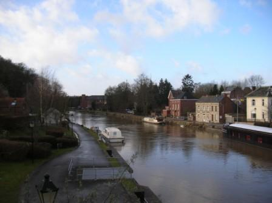
_Lobbes - La Sambre vers l’amont_
_Photo de l’auteur_

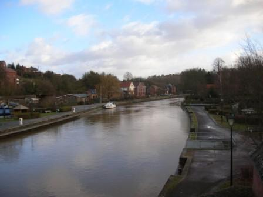
_Lobbes - La Sambre vers l’aval_
_Photo de l’auteur_

Un peu plus vers l’est se trouve la ville de Thuin, perchée sur un éperon.

### 21 août

**Le dispositif français**

Le 18e C.A. forme, avec le 4e groupe de divisions de réserve du général Valabrègue, la gauche de la Ve armée.

Il a été soustrait à la IIe armée pour venir renforcer celle du général Lanrezac. Les derniers éléments ont débarqué le 20 et s’ébranlent vers la Sambre le 21. Le Q.G. du C.A. s’est établi à Solre-le-Château.

- La 36e D.I. est  dans la région de Thuin.

- La 35e D.I. ,formant la gauche du C.A., occupe la région de Cousolre - Boussignies - Beaumont.

- En avant des divisions, le 10e hussards a gagné la région d’Anderlues au nord de la Sambre. Des patrouilles ont pris contact avec les Anglais à Binche.

A gauche et en arrière du 18e C.A., les divisions de réserve du général Valabrègue commencent leur mouvement vers le nord et leurs éléments de tête atteignent la Flamengrie (53e D.R.) et Clairefontaine (69e D.R.).
Mouvements de la IIe armée allemande (est -> ouest)

- La 1e division de la Garde  est autour de Mazy, face au secteur nord-ouest de Namur.

- La 2e division franchit la route de Velaine à Spy dès 6h30.

- Le 10e C.A. apparaît à Velaine et au sud-ouest de Fleurus entre 10 et 11h. La 2e division de réserve de la Garde s’approche de Liberchies et Villers-Perwin.

- Les têtes du 7e C.A. sont signalées dans la région d’Obaix

- Buzet et de Seneffe vers midi.

### 22 août

**En matinée :**

Le 10e hussards est attaqué au pont de Marchiennes par l’avant-garde de la 2e division d’infanterie de la garde et se voit forcé de se replier sur Gozée.

Les 11e et 12e compagnies du 49e reçoivent la mission de se rendre à Landelies pour surveiller les ponts.

La 11e compagnie surveille ceux de Landelies et de la Jambe-de-Bois et la 12e étend sa surveillance jusqu’à l’abbaye d’Aulne.

**10h15 :**

Une section de la 11e compagnie se replie à l’approche de l’armée allemande, une autre échange des coups de feu avec des fantassins allemands qui s’infiltrent dans les bois de la rive nord de la Sambre.

**14h :**

Derrière l’écran des grands bois qui s’étendent de Ham-sur-Heure à Thuin, et au sud de la Sambre jusqu’à Fontaine-Valmont, le 18e C.A. achève sa mise en place :

- A gauche, la 35e D.I. (général Exelmans), sur la ligne Montignies-Saint-Christophe - Thirimont. Le 57e R.I. s’installe en cantonnement d’alerte à Montignies-Saint-Christophe, en détachant le 3e bataillon en avant-poste sur la Sambre, de Merbes-le-Château à Fontaine-Valmont. Le 144e bivouaque à Thirimont et la 69e brigade est maintenue à Beaumont.

- A droite, la 71e brigade (général Bertin) de la 36e D.I. (général Jouannic) organise le front Thuin - Gozée. Le 49e R.I. met les avancées de ce dernier point en état de défense. Deux compagnies du 34e sont laissées à Lobbes et au pont d’Aulne et le reste du régiment se retranche sur les hauteurs de la rive droite de la Sambre de Thuin jusqu’à l’ouest de Gozée. Le 18e R.I. est sur la position Beignée - Marbais où il creuse des tranchées. En arrière, le 12e R.I. est maintenu sur la ligne Thuillies - Ragnies.

Le général de Mas-Latrie  adresse un compte-rendu de la situation du 18e C.A. et du 4e groupement des divisions de réserve au Q.G. de la Ve armée.

**16h :**
La 11/49e aperçoit à 1000 m deux compagnies allemandes remontant de la ferme de l’Espinette vers le nord. Le capitaine fait exécuter un tir auquel les Allemands ripostent. Les deux unités du 49e regagnent Gozée vers 18h.

**16h30 :**
Le général Lanrezac envoie aux généraux commandant les C.A. une instruction personnelle et secrète.
« Les 1e, 3e et 10e C.A. conservent leur mission antérieure. Le 18e C.A. fera appuyer demain 23 la brigade de sa division de queue vers Rognée (N.O. de Walcourt).
La route Silenrieux, Walcourt, Thy-le-Château, Gourdinne, Nalinnes appartenant au 3e C.A., limitera vers l’est la zone d’action du 18e C.A.

Le C.C. agira sur la rive gauche de la Sambre en liaison avec le 18e C.A. d’une part et avec l’armée anglaise d’autre part.

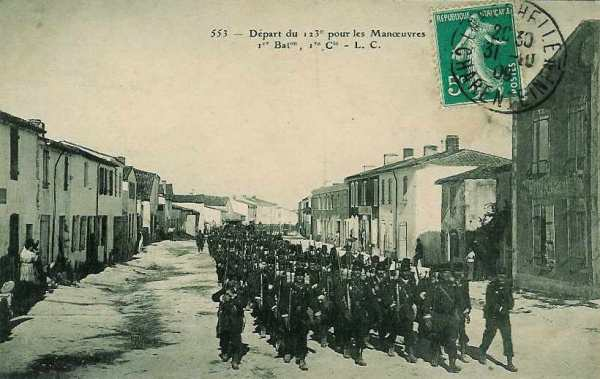
_123e R.I - 35e division_
_Collection privée_

Le groupe de divisions de réserve se portera jusqu’à la région comprise entre le camp retranché de Maubeuge, le cours de la Sambre de Recquignies à Solre-sur-Sambre et la route incluse Solre-sur-Sambre, Montignies-Saint-Christophe, Beaumont - Granrieu. »

Afin de réduire la solution de continuité entre leur droite et le 18e C.A., les anglais ont infléchi leur ligne de front de Mont jusqu’aux avancées de Maubeuge.

**En début de soirée :**

Le général Lanrezac prescrit au 18e C.A. de mettre une brigade à la disposition du 3e C.A. La 69e brigade quitte aussitôt Beaumont et fait route vers Somzée par Barbençon, Walcourt, Chastres.

Le 4e groupe de divisions de réserve du général Valabrègue poursuit sa remontée vers la Sambre. La 53e division de réserve s’arrête dans la région d’Avesnes au contact avec les Anglais ; la 69e division de réserve atteint Solre-sur-Sambre et Sars-Poterie. Ces unités devront le lendemain épauler la gauche du 18e C.A.

**Bilan de la journée pour la Ve armée :**

Au niveau de l’ensemble de l’armée, c’est  une journée d’échecs mais pas décisifs. A cette heure, l’offensive du général de Langle de Cary (IIIe armée), à droite de la Ve armée, s’est brisée net au nord de la Semois (voir la bataille de Neufchâteau).

### 23 août

**Le dispositif français**

Le 18e C.A. s’échelonne entre Ham-sur-Heure - Marbaix - Merbes-le-Château - Gozée - Thuin - Lobbes, en vue d’interdire l’accès du plateau au sud de la Sambre aux forces allemandes.

La 35e D.I. (général Exelmans) tient la coupure Lobbes - Merbes-le-Château, avec en première ligne la brigade Hollender, qui assure la défense des ponts de Fontaine-Valmont à Lobbes inclus.

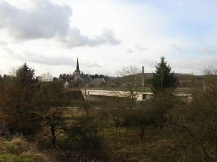
_Fontaine-Valmont - le pont-rail_
_Photo de l’auteur_

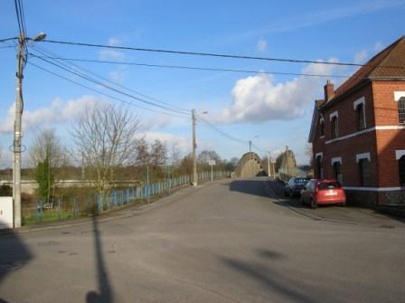
_Fontaine-Valmont - le pont-route_
_Photo de l’auteur_

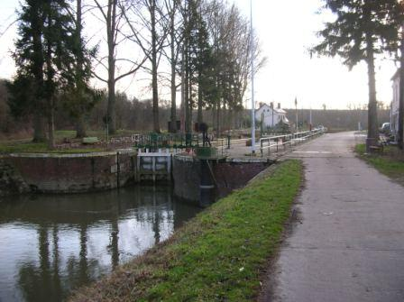
_Fontaine-Valmont - l’écluse_
_Photo de l’auteur_

- Le I/28e R.I. organise défensivement la rive sud de la Sambre. Les maisons sont percées de meurtrières, de façon à battre de ses feux l’accès du pont de la route de Beaumont. Des trous de tirailleurs sont creusés sur les pentes nord du plateau d’Heuleu.

- Les II et III/28e R.I. s’établissent au bois Janot (ouest de Biercée) et au sud-est de Fontaine-Valmont.

- Le III/57e R.I. tient les passages de Fontaine-Valmont et de Merbes-le-Château, le 1e bataillon au bois de Fontaine-Valmont et le 2e à la lisière nord de ce bois.

- Le 144e R.I. vient se poster à droite du 57e.

- La 70e brigade est en réserve de C.A. et se porte de la région Thirimont - Montignies-Saint-Christophe dans la direction de Lobbes.

- Le groupe de divisions de réserve Valabrègue poursuit son mouvement vers le nord. Il viendra se placer en fin de journée à la gauche du 18e C.A. Dans ce C.A., la brigade Hollender a remplacé la 69e brigade (général Durand), passée au 3e C.A.

- A la gauche du 18e C.A., le C.C. Sordet assure la liaison avec les forces anglaises, jusqu’à l’arrivée dans ce secteur des divisions du général Valabrègue. Il gagnera ensuite l’aile gauche des forces britanniques en contournant Maubeuge par le sud. Pour l’instant, il conserve les mêmes missions que la veille et se prépare à défendre la ligne Jeumont - Fontaine-Valmont avec la 1e D.C. La 5e D.C. est en réserve autour de Cousolre - Bersilies - Bousignies.

- A la gauche du dispositif, la 2e brigade de cuirassiers occupe la région sud de Jeumont - Erquelinnes.

- A droite, la 36e D.I. (général Jouannic) garde le front Thuin - Gozée - Marbaix - Ham-sur-Heure.

- Le 34e R.I., à la gauche de la division, tient les crêtes qui surplombent la vallée, de Thuin jusqu’au chemin du Chêne. Le II/34e est à l’est de Thuin ; le III/34e R.I. se trouve à gauche du IIe, de la croupe en avant des Hospices jusqu’à l’ouest de Thuin, où les tirailleurs garnissent les vieux remparts de la Ville Haute.

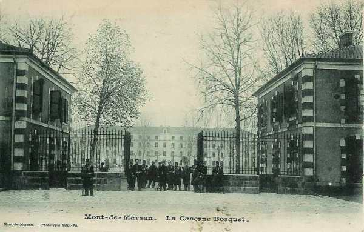
_34e R.I. - 36e div. -_
_Collection privée_

- Le 49e R.I. tient le village de Gozée.

- Le 18e R.I. tient le village de Marbaix, point d’appui de la droite du 18e C.A.

- Le 12e R.I. reste à la disposition du général Jouannic, les 1e et 2e bataillons à Thuillies, le 3e à Ragnies.

- Le 14e et le 58e R.A.C. ont disposé leurs batteries en arrière.

Comme Thuin constitue une position défensive de premier ordre, les Allemands concentreront leurs efforts vers Lobbes et le secteur de Thuin restera assez calme.

**En matinée :**

Devant le 18e C.A., les colonnes du 7e C.A. (général von Einem) et du 10e C.A. (général von Kirchbach) font leur apparition au nord de la Sambre.

**7h30 :**

Le 4/6e dragons part en reconnaissance vers Binche afin d’établir la liaison avec la 5e brigade de cavalerie anglaise. L’escadron se heurte aux patrouilles allemandes vers Merbes-le-Château.

**8h45 :**

- Le général Sordet reçoit l’ordre suivant :
« Ordre au C.C. de passer à gauche de l’armée anglaise. »
Au centre du front de la 1e D.C.
  Le 23e dragons surveille les passages de Solre-sur-Sambre.
  Le 32e brigade tient les passages de La Buissière, avec la 10/57e R.I.

Le 1e escadron part en reconnaissance vers Mont-Sainte-Geneviève. Il signale l’avance sur Lobbes d’une colonne d’infanterie, de la présence de uhlans à Bienne-lez-Happart et de cuirassiers de la garde à Merbes-Sainte-Marie.

**10h30 :**

Le groupe d’artillerie en position près de Hantes ouvre le feu sur une colonne aperçue vers Sars-la-Buissière.

**11h :**

Le 27e dragons, rassemblé au nord de Grand-Pré, reçoit l’ordre de renforcer la 9/57e R.I. au pont de Fontaine - Valmont. Le régiment se relie vers Lobbes au 28e R.I. de la brigade Hollender.

**14h :**

Les batteries de la 5e D.C., à Fontaine-Haute, prennent sous leur feu les groupes allemands débouchant du bois de La Houssière.
La batterie du 58e R.A.C. ouvre le feu sur Fontaine-Valmont et sur le plateau au sud, mais est contrebattue.

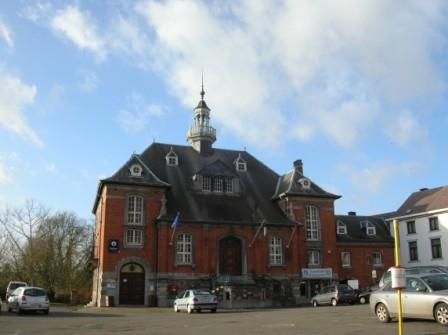
_Lobbes - La maison communale rebâtie après l’incendie_
_Photo de l’auteur_

**15h :**

Le 58e R.A.C., du bois de Montreuil, bombarde Merbes-le-Château.
Des rafales d’obus de 77 et de 105 partent du plateau de Saint-Nicoley, au sud du bois de la Houssière, où l’artillerie du la 14e division allemande a pris position et arrose les emplacements du 27e dragons. Les escadrons ramènent leurs chevaux en arrière et s’abritent.

Les premiers éléments de la 69e division de réserve arrivent à pied d’œuvre et relèvent les unités du C.C. Sordet. Celles-ci prennent la direction de Maubeuge via Cerfontaine, Jeumont.
La 1e D.C. cantonnera à Beaufort, la 3e autour de Boussière, la 5e à Ecuelin. Le C.C. quitte le territoire belge où il avait pénétré le 6 août.
Secteur de la 35e D.I.
La nuit se passe sans incident.

**5h :**

Une reconnaissance du 16e uhlans descend d’Anderlues vers Lobbes et arrive à la barricade élevée par le 24e R.I ,au carrefour de la route de Thuin. Elle est prise à partie par des salves qui partent de l’autre côté de la Sambre et rétrograde.

**9h :**

Une patrouille, utilisant les dépressions du terrain à l’ouest de Lobbes, parvient à la ferme de l’ancienne abbaye mais est dispersée.

Dans le même temps, l’avant-garde de la 14e D.I. allemande apparaît sur la route de Lobbes - Bascoup, au nord des Bonniers, avec en tête la 79e brigade qui doit s’emparer des passages de la Sambre. Les unités se déploient et prennent la direction de Saint-Nicoley, à l’orée du bois de la Houssière. Le 56e progresse vers la Portelette et le 57e descend vers l’Entreville.

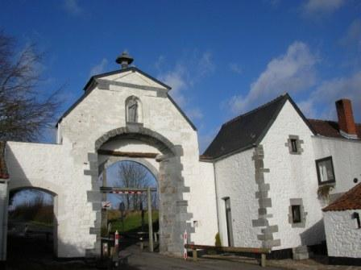
_Lobbes - La Portelette_
_Photo de l’auteur_

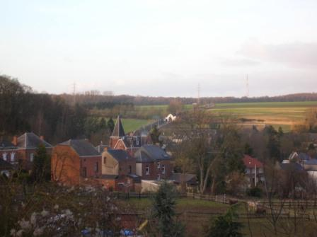
_Lobbes - vue vers la Portelette_
_Photo de l’auteur_

**9h30 :**

Les batteries françaises du I/14e R.A.C., en position près de la Maladrie, ouvrent le feu sur les lignes de tirailleurs très visibles, sur le plateau découvert en avant des bois de la Houssière et sur le carrefour de la route de Thuin - les Bonniers. L’artillerie allemande, déployée à la cote 190 ne tarde pas à riposter et prend la ferme de la Borne et la Maladrie sous son tir.

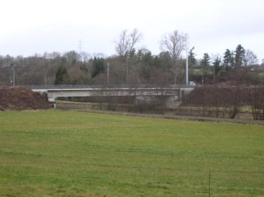
_Lobbes - Le pont-rail du Brûlé (reconstruit)_
_Photo de l’auteur_

Les postes qui défendent les abords du pont sont bientôt pris à partie  par le II/57e régiment allemand, embusqué dans les bâtiments en bordure nord de la Sambre, mais ce dernier ne réussit pas à franchir la rivière. Pendant ce temps, les 1e et 3e bataillons du 57e portent leurs efforts à l’ouest de Lobbes et gagnent les abords du Pont du Brûlé (pont-rail) par où ils prennent pied sur la rive droite de la Sambre.

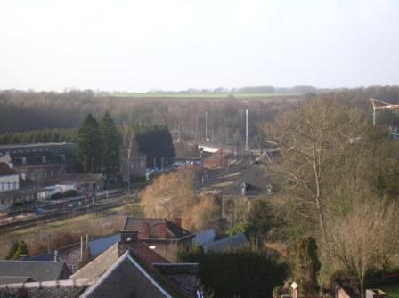
_Lobbes - La voie de chemin de fer (ligne 130 A) vers le pont du Brûlé_
_Photo de l’auteur_

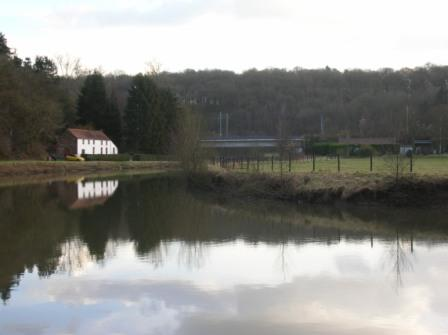
_Lobbes - le pont-rail du brûlé_
_Photo de l’auteur_

Dans les maisons proches de la Sambre, les fractions avancées de la brigade Hollender tiennent bon et empêchent les Allemands d’approcher du pont-route.

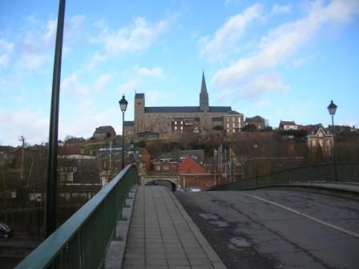
_Lobbes - Le pont-route sur la Sambre_
_Photo de l’auteur_

**10h :**

Une pointe de cavalerie arrive par le chemin de Mont-Sainte-Geneviève et pousse jusqu’à la voie ferrée, mais est obligée de se retirer sous les balles des mitrailleuses en position sur les pentes boisées de Heuleu.

**11h :**

- Le général Hollender, dont le P.C. est à l’est de Biercée, prend les dispositions en vue de la défense du secteur.
  Le I/24e est placé en avant de la ferme Fiévet.
  Le II/24e est à l’ouest du premier, sa gauche au Bois Janot.
  Le III/24e est maintenu en réserve.
Le 28e  ramène ses éléments disponibles vers La Maladrerie.

**13h30 : les ponts-rails ne sont plus défendus !**

Les Allemands engagent la 27e brigade. Les 16e et 53e gagnent les lisières du bois de la Houssière et de Hovis et font leur apparition sur les pentes qui descendent de Saint-Nicoley vers la Sambre. Grâce aux couverts nombreux, les compagnies avancent rapidement vers le quartier ouest de Lobbes. L’appoint de cette force nouvelle et surtout le repli de la ligne avancée de la brigade Hollender, qui défendait l’accès aux ponts-rails du Brûlé et de la Planchette, vont faire entrer la bataille dans une phase cruciale.

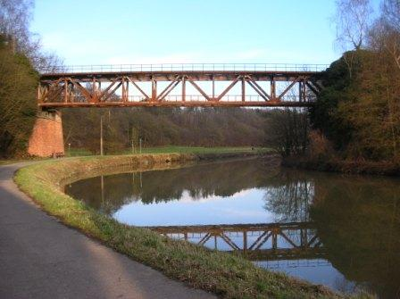
_Lobbes - le pont-rail des Planchettes_
_Photo de l’auteur_

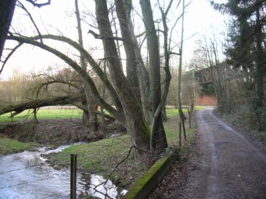
_Lobbes - le pont-rail des planchettes_
_Photo de l’auteur_

L’artillerie allemande bombarde le terrain occupé par le I/24e et le 28e qui restent sur leurs emplacements, puis se replient vers Ragnies sur ordre du général Hollender. Les tirailleurs allemands de la 27e brigade (4e G.D.R.) sont parvenus à la Sambre. Ils gagnent les ponts du Brûlé et de la Planchette qui n’ont pas pu être détruits faute d’explosifs. Ces passages sont franchis sans difficulté par les 1e et 3e bataillons du 57e, suivis des 16e et 53e régiments. S’infiltrant par la tranchée du chemin de fer, ils gravissent les pentes boisées d’Heuleu par l’ouest à l’heure où la 70e brigade débouche de la Borne, du Béni-Chêne et du bois de Viller.

Le 144e prend la formation de combat, suivi du II/57e en échelon arrière à gauche. La brigade adopte la formation utilisée à cette époque, les bataillons en colonne double, les compagnies en ligne de sections. L’ensemble du dispositif est éclairé par le 6/10e hussards.

De son côté, le 24e R.A.C. se porte rapidement sur les positions indiquées.

**13h :**

Les bois de Ragnies et de Leers-et-Fosteau sont dépassés par les troupes françaises. Le terrain découvert qui s’étend au nord de la corne orientale du bois Janot et du village de Biercée est balayé par l’artillerie allemande. Cet espace est franchi sans pertes par les sections diluées en lignes de demi sections, qui arrivent à la hauteur de Biercée et à l’entrée du bois de Viller.

En ce moment, la canonnade est générale. Les batteries du 24e R.A.C. à Leers-et-Fosteau et à la ferme Fiévet battent le plateau au nord de la Sambre sans réussir à maîtriser l’artillerie allemande.

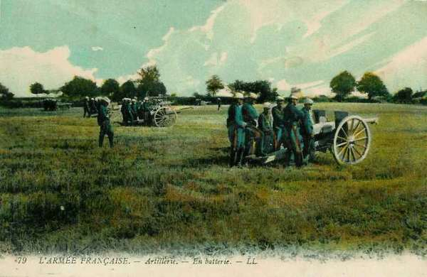
_Batterie française de 75_
_Collection privée_

**14h :**

La 70e brigade vient en renfort et rejoint le général Hollender. Le mouvement est repris. Les compagnies du 144e R.I. se déploient en tirailleurs. Le général Exelmans (35e D.I.) prescrit à la 70e brigade de « rejeter dans la Sambre tous les éléments ennemis qui l’auraient franchie. »

Le II/144e R.I. parvient au plateau de la Borne où l’artillerie allemande concentre le tir  des 150,105 et 77. La 7e compagnie gagne la droite du carrefour du Béni-Chêne et ouvre le feu sur les Allemands qui occupent les lisières sud de Lobbes.

Le I/144 R.I. traverse le vallon de Pommeroeul battu par les 77. L’avant-garde dépasse la corne est du bois de Viller et parvient au bord du plateau mais elle éprouve des pertes sérieuses.

**15h30 :**

Le feu allemand est de plus en plus nourri. Les hommes sont disposés dans les vergers face à la clairière d’Heuleu. L’artillerie française exécute un tir progressif sur les abords du plateau, bombarde le terrain occupé par le 2e compagnie et tue le capitaine Thomire.

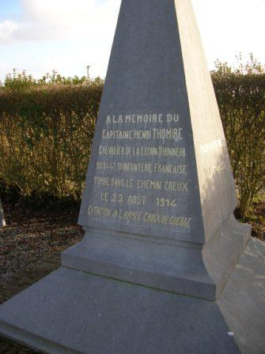
_Lobbes - Monument au capitaine Henri Thomire_
_Photo de l’auteur_

Tandis que la 3e compagnie tiraille dans la direction de Lobbes, la 4e est bientôt aux prises avec les Westphaliens du 53e R.I. qui ont envahi le nord du plateau par les ponts de chemin de fer.

En ce moment, le combat fait rage sur tout le front de la 70e brigade, particulièrement autour de la ferme Philémon. Les Allemands semblent un instant se retirer. Les sections françaises montent à l’assaut,  bousculent les tirailleurs du 53e R.I. allemand et réoccupent leurs anciens emplacements, mais la situation devient critique pour le 144e R.I. qui, très en pointe, est menacé d’enveloppement. Le régiment rétrograde et vient former un barrage défensif 200 m en arrière.

**18h :**

Le II/144e est pris sous des rafales d’obus et reflue. Le III/144e, resté jusqu’à ce moment en réserve, intervient, mais un feu violent d’artillerie l’oblige à se terrer.

Les régiments allemands n° 16 et 53 franchissent les ponts du Brûlé et de la Planchette vers 18h et marchent à la conquête de la rive sud de la Sambre. Les westphaliens tentent de repousser les unités des II/57e et I/144e qui se cramponnent au sol. Les survivants de la 5e compagnie résistent autour de la ferme Philémon pendant plus d’une heure. La 1e section de mitrailleuses vient installer ses pièces à l’angle de la haie sud de la ferme de Philémon et appuie de ses rafales l’action des unités engagées.

Les 1e et 4e sections se heurtent aux troupes allemandes au nord de la ferme de la Folie et après un bref corps à corps rétrogradent dans les bois. Les unités décimées sont regroupées au sud du bois du Fosty.

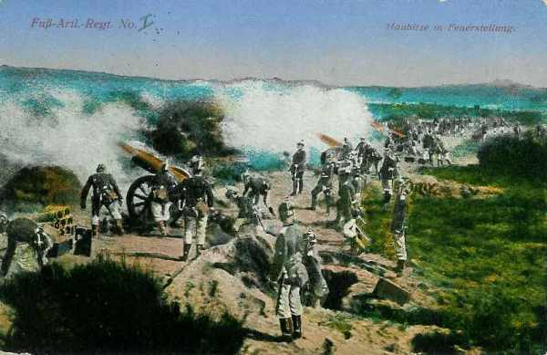
_Batterie d’obusiers allemands_
_Collection privée_

Les Allemands, qui ont regroupé, dans la tranchée du chemin de fer à l’ouest de Heuleu, les Ie et IIIe bataillons du R.I. n° 16 et les isolés des régiments 53, 56 et 57, se reportent en avant et engagent le II/R.I. n° 16, maintenu en réserve jusqu’à ce moment.

**19h :**

Réunies en arrière de la ferme de Philémon, les compagnies du 57e opposent une résistance farouche aux tirailleurs allemands sans cesse renforcés. La 6e compagnie défend les abords de la ferme de la Folie.

A ce moment parvient l’ordre de retraite. Lentement, les survivants se replient à travers les haies et les taillis. Une mitrailleuse est disposée à cent mètres des Allemands et fauche à raison de 600 coups à la minute les premières lignes qui s’écroulent. Le reste de la colonne s’aplatit. Profitant du désarroi créé, le II/57e se replie.
Les Allemands s’arrêtent ; le clairon appelle le gros de la 14e division d’infanterie qui repasse la Sambre et vient cantonner à Lobbes.

Les pertes de part et d’autre ont été assez élevées. A la 70e brigade française, 180 hommes restent sur le terrain et la conquête de Heuleu a coûté 245 hommes à l’armée allemande.

**19h30 :**

Le général Exelmans ramène la 70e brigade autour de Leers-et-Fosteau.

**20 h :**

La 35e D.I. transmet au général de Mas-Latrie un compte-rendu de la situation en fin de combat des unités engagées.
Secteur de la 36e D.I.

**En matinée :**

La 2e division de la Garde, droite du 2e C.A. (général von Kirchbach) se porte sur Gozée, par la route de Marchiennes - Beaumont.

**8h :**

Les éléments avancés de la 2e division de réserve de la Garde dépassent Montignies-le-Tilleul et parviennent aux abords de Gozée où ils se heurtent aux avant-postes du III/49e gardant les issues au Bout-la-Haut.

**9h :**

Le général von Süsskind prescrit à la 26e brigade d’infanterie de réserve de s’emparer de Gozée. Les premières lignes de tirailleurs du 15e régiment, qui a pris la formation de combat sous les couverts du bois d’Aulne, apparaissent au nord du Bout-la-Haut et de la cote 213. Elles sont accueillies par un feu nourri, se terrent et attendent l’intervention de l’artillerie.

**9h30 :**

Le I/20e de Feldartillerie amène ses pièces par les chemins du bois d’Aulne, prend position au nord de la ferme Beaudribut et ouvre le feu. Les premiers obus tombent sur les tranchées de la 3/49e.
De petites colonnes allemandes surgissent ensuite des taillis mais sont prises à partie par les 9e et 10e compagnies, soutenues par des sections de mitrailleuses.

Les Allemands jettent de nouvelles forces dans la mêlée : trois bataillons du 15e R.I. Ils s’infiltrent par le bois de la Grattière, prennent pied sur la crête 212 - 213 et tiraillent vers les positions des 2e et 3e sections du 49e R.I. Les feux du II/49e sont impuissants à annihiler la poussée allemande.

**10h55 :**

Les unités du II/34e R.I. se trouvent sous un feu violent d’artillerie allemande.

**11h30 :**

Serrée de près, une section de mitrailleuses doit se retirer, entraînant avec elle la 10e compagnie qui se replie vers Gozée.
Le II/14e R.A.C., établi à la Corbeillerie, arrose la cote 213, la ferme Beaudribut et le hameau de Clicotia.

**12h :**

La ligne française, ramenée à la hauteur de la Couronne, résiste vigoureusement aux 15e et 55e R.I. allemands.
Entre temps, la 38e brigade de réserve apparaît sur le champ de bataille et a pris pour objectif Marbaix, défendu par le 18e R.I. La fusillade crépite jusqu’aux avancées de Thuin.
Pressé de toutes parts, le III/49e reflue vers la lisière sud de Gozée.

Les batteries françaises installées à la Corbeillerie tirent à toute volée sur le nord de Gozée. Entre temps, les 3e et 4e sections du 58e R.A.C., en position au sud de Marbaix, canonnent l’infanterie allemande sur la route de Gozée - Charleroi.

**12h55 :**

Ordre est donné au 12e R.I. de se porter au nord de Biercée pour attaquer l’adversaire qui débouche de la Borne et le rejeter sur les ponts de Lobbes.
Dans le même temps, le I/34e reçoit l’ordre de se porter à la cote 179 et d’exécuter une contre-attaque dans le flanc gauche de la 14e D.I.  débouchant de Lobbes.

**15h :**

Les Français tentent un retour offensif pour reprendre Gozée. Le III/49e, efficacement soutenu par les 75 du 14e R.A.C. réoccupe la localité.

Inquiet de la tournure des événements, le général von Süsskind (2e division d’infanterie de réserve de la Garde) appelle à la rescousse la 19e division de réserve, aux prises avec la gauche du 3e C.A. vers Nalinnes. Le général von Bahrfeldt, dont la majeure partie des unités luttent autour de Limsonry contre la 6e D.I., ne peut lui céder q’un bataillon. Ces renforts ne sont acheminés vers le front de la 2e division de réserve de la Garde qu’à la fin de l’après-midi et n’auront pas l’occasion de s’engager.

Le général von Bülow accourt d’Acoz, gagne Gozée et intervient personnellement dans la direction du combat.

Les dernières réserves du général von Süsskind entrent en ligne et la 38e brigade passe à l’attaque vers Marbaix, où le 18e R.I. cède lentement. Devant Gozée, la 26e brigade d’infanterie de réserve repart en avant ; le III/91e R.I. arrive à marche forcée et intervient dans la bataille.

**15h30 :**

Deux bataillons du 34e R.I. prennent pied, sous un feu violent d’artillerie, sur le plateau sud-ouest de la Borne. Au sud de la Borne, le III/144e R.I. s’associe au retour offensif. Les unités parviennent aux abords de la crête où ils tiennent bon jusqu’à 19h30.

**17h :**

Malgré la forte résistance du 49e R.I., la ligne française plie et est ramenée aux lisières sud de Gozée.

**18h :**

Gozée est repris par les Allemands et le III/49e recule vers la Jonquière et la Folie.

**18h30 :**

L’ordre de retraite est donné. Les 10e, 11e et 12e compagnies sont presque encerclées et se ruent vers Jonquière et la Briqueterie dans un corps à corps d’une grande violence. Le 49e R.I., bordant la route de Thuin, bat en retraite vers le bois de Reumont. De nombreux isolés, restés dans les rues, sont faits prisonniers malgré une ultime tentative de s’ouvrir le chemin à la baïonnette.

Le II/14e R.A.C., amène les avant-trains alors que les balles cinglent le bouclier des pièces et se dirige vers Thuillies.

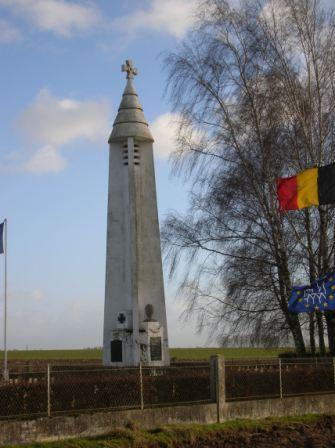
_Lobbes - Le phare du cimetière français_
_Photo de l’auteur_

**A la nuit :**

Le régiment se reconstitue à Thuillies. Les Allemands, sévèrement éprouvés, ne poursuivent pas. Ils organisent les positions conquises, creusant des tranchées autour de la Jonquière et crénèlent les murs du cimetière.

Le 18e C.A. garnit la ligne Thuillies - Donstiennes - Ragnies (36e D.I.) - Biercée - Leers-et-Fosteau (35e D.I.).

Dans la nuit parvient l’ordre de repli général du commandant de la Ve armée.
Au lever du jour le 24, l’armée viendra jalonner le front Merbes-le-Château - Beaumont - Philippeville - Givet.

### Conclusion :

Les Allemands ont profité de l’opportunité qui s’offrait à eux de franchir les ponts de la Sambre qui avaient été abandonnés sans avoir sauté faute d’explosifs. Plusieurs régiments, dont le 57e et le 144e, du 18e C.A. ont vaillamment résisté mais ont dû battre en retraite sur ordre du général Lanrezac, dont l’armée entière était prise en tenaille par les IIe et IIIe armées allemandes.

### Régiments ayant participé au combat

**[6e R.I. (Saintes, Oléron)](article_09_112.md)**

**[12e R.I. (Tarbes)](article_09_118.md)**

**[34e R.I. (Mont-de-Marsan)](article_09_140.md)**

**[49e R.I. (Bayonne)](article_09_155.md)**

**[57e R.I. (Rochefort, Libourne)](article_09_162.md)**

### Souvenirs du combat

Loin d’être oublié, le combat de Lobbes a fait l’objet d’ une étude par le Cercle de Recherches Archéologiques de Lobbes, qui a publié une brochure intitulée "Sambre rouge : 23 août 1914", disponible à l’office du tourisme.

Une promenade pédestre passant le long de la Sambre et par le plateau du Heuleu a été créée : la promenade héroïque.