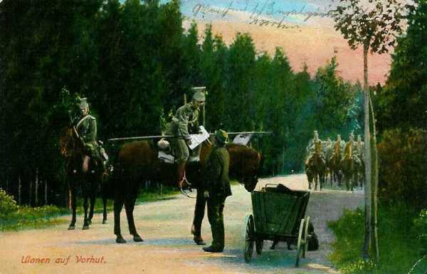
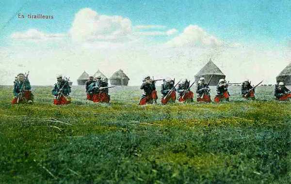
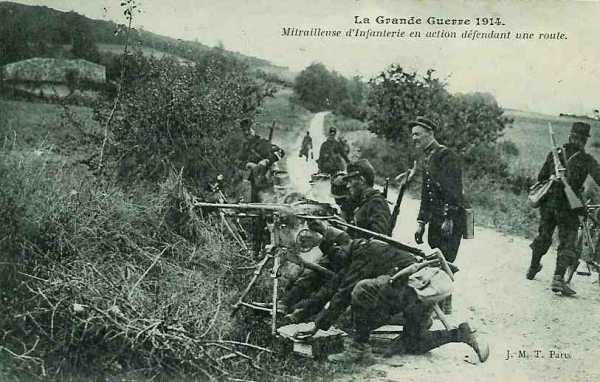
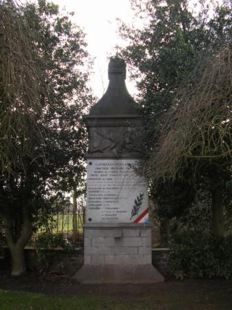
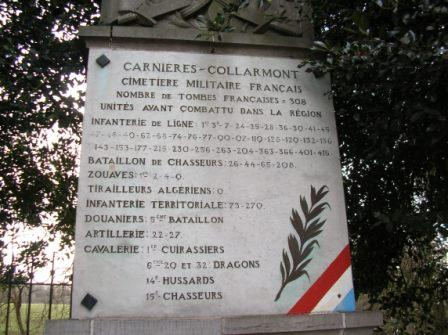
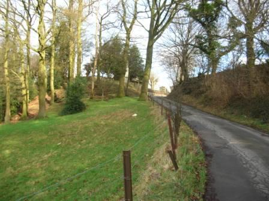
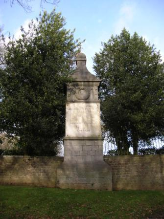
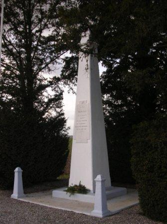
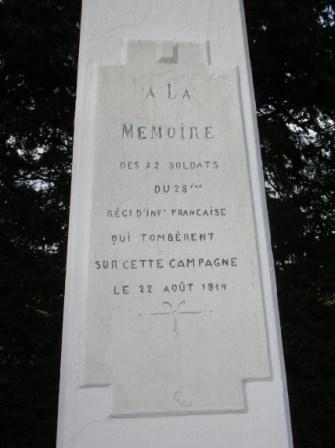

# Combat de Carnières - Collarmont (22 août 1914) - Bataille de Charleroi

Alors que l’ensemble de la Ve armée française se trouve le long de la Sambre, une brigade se trouve isolée au nord du fleuve, en avant-garde pour protéger le repli du corps de cavalerie Sordet. Elle se fait attaquer par cinq régiments allemands.

### Cadre du combat

La brigade Hollender a été détachée du 3e C.A. français et a effectué un déplacement au nord de la Sambre. Elle se trouve à 6 km au nord de la rivière, vers Collarmont - Carnières, en avant-garde. Le but est de faciliter le repli du C.C. Sordet, qui doit aller couvrir le flanc gauche de la Ve armée et assurer la liaison avec les Anglais en attendant l’arrivée des divisions de réserve du général Valabrègue.

Pendant ce temps, la IIe armée allemande infléchit sa marche vers le sud, avec Namur pour pivot. Joffre croit qu’il n’y a au nord de la Meuse et de la Sambre que cinq corps d’armée. En réalité, il y en a douze et cinq divisions de cavalerie. L’intention de Joffre est de porter la Ve armée au nord de la Sambre. Pour l’instant, l’ensemble de l’armée se trouve au sud de la rivière.

La brigade, isolée, va devoir affronter un corps d’armée complet.

**[Lien vers croquis](../img/combat__de__collarmont.jpg)**

### Les forces en présence

**Armée française**

**3e C.A. général Sauret**

6e division  général Bloch

11e brigade général Hollender - 24e R.I. (Paris, Aubervillers) et 28e R.I. (Evreux, Paris)

**Armée allemande**

**7e C.A. : général von Einem.**

| Unité | Commandant | Régiments |
| --- | --- | --- |
| 13e division d’infanterie | von dem Borne | Infanterie-Regiment Nr. 13 (Münster)Infanterie-Regiment Nr. 15 (Minden)Infanterie-Regiment Nr. 55 (Detmold)
Lothringisches Infanterie-Regiment Nr.158 (Paderborn)Westfälisches Jäger-Batalion Nr 7 (Bückeburg)Ulanen-Regiment Nr 16 (Salzwedel) (trois escadrons)Westfälisches Feldartillerie-Regiment Nr. 22 (Münster)Mindensches Feldartillerie-Regiment Nr. 58 (Minden) |
| 14e division d’infanterie | Fleck | Infanterie-Regiment Nr 16 (Köln)Westfälisches Infanterie-Regiment Nr. 53Infanterie-Regiment Nr. 56 (Wesel)Infanterie-Regiment Nr. 57e (Wesel)Ulanen-Regiment Nr 16 (Salzwedel) (un escadron)Westfälisches Feldartillerie-Regiment Nr. 7 (Wesel-Düsseldorf)Clevesches Feldartillerie-Regiment Nr. 43 (Wesel) |

Les régiments d’infanterie ayant participé aux combats sont les 16e, 53e, 55e, 56e et 57e.

On remarque l’énorme disproportion des forces entre Français et Allemands.

### Le terrain

Le champ de bataille est délimité au nord par la route de Charleroi vers Binche, par la Sambre au sud. Collarmont est situé sur une colline qui sépare les vallées de la Haie et de la Haine. La colline s’infléchit en pente assez raide vers Carnières. La Haie coule dans un vallon marécageux à certains endroits. La crête qui surmonte ce vallon sépare les communes de Carnières et d’Anderlues.

La région est agricole mais compte également plusieurs exploitations minières.

### 21 août

**4h :**

Une patrouille forte de 10 uhlans est signalée vers Fayt - Jolimont. Aussitôt, les patrouilles françaises partent sillonner toutes les directions.

_Uhlans en avant-garde_
_Collection privée_

**12h :**

Les têtes du 7e C.A. allemand sont signalées dans la région d’Obaix - Buzet.
Nuit du 21 au 22,
L’armée allemande est signalée à Piéton.

### 22 août

- Le III/24e est au nord d’Anderlues.
  Le II/24e se trouve au sud de Piéton.

**4h :**

Un engagement entre le C.C. Sordet et les avant-gardes allemandes se déroule à Pont-à-Celles.
Le 24e R.I. reçoit pour mission de résister à la poussée allemande sur les territoires de Carnières, Anderlues et Piéton.

Les compagnies formant les 2e et 3e bataillons se disséminent pour occuper les différentes positions au nord d’Anderlues et de Mont-Sainte-Aldegonde tandis que le premier bataillon se tient en réserve sur le point culminant dit le Planty (cote 212).

Les troupes couvrant le retrait du C.C. Sordet forment une chaîne continue au nord de la vallée de la Sambre. Les Français se mettent à creuser rapidement des tranchées.

A la droite du 24e, il y a quelques compagnies sur le territoire de Fontaine-l’Evêque et de Leernes. La gauche est occupée, vers Binche - Péronnes - Haine-Saint-Pierre par la cavalerie française et des mitrailleurs anglais.

- Le régiment prend ses positions :
  1e bataillon : en réserve sur les hauteurs du Planty.

- 2e bataillon : occupe les plaines de L’Allue et de Pasturia, avec la 8e cie à la lisière du bois des Vallées ; la 5e dans l’ancien charbonnage n° 6 de Monceau-Fontaine, avec une section de mitrailleuses sur le terril ; la 6e cie dans les plaines de L’Allue, dissimulée derrière les dizeaux de blé ; la 7e en réserve dans les plaines de Pasturia.

_Tirailleurs français_
_Collection privée_

- 3e bataillon : occupe l’aile ouest, avec la 9e cie qui a deux mitrailleuses placées sur le terril d’Anderlues, au puits n° 4 ; la 10e cie en réserve derrière la ferme au bois de Chèvremont ; la 12e cie à Mont-Sainte-Aldegonde et à Leval.

**8h45 :**

Une patrouille du 16e régiment de uhlans s’avance jusqu’à l’auberge de la Reine des Belges.

Le poste installé sur le terril du puits n° 6 du charbonnage de Monceau-fontaine ouvre le feu. Le commandant des uhlans et son cheval tombent sur le trottoir de l’auberge, trois soldats sont tués et le reste s’enfuit.

Les Allemands entament l’attaque : les uns essaient de gagner les plaines de Pasturia en longeant le chemin de fer, les autres marchent vers le hameau de L’Allue, tandis qu’une troisième colonne  cherche à gagner la colline de Collarmont en contournant le terril du bois des Vallées.

L’attaque allemande doit se faire de face, car il y a peu de possibilités de contourner la position française. De toutes les hauteurs occupées par l’infanterie française jaillit un feu meurtrier de Lebel et de mitrailleuses.

**10h :**

Dans les plaines, face au bois des Vallées, six bouches à feu allemandes entrent en action. Le 16e R.I. allemand se déploie et une partie envahit le bois des Vallées pendant que l’autre contourne les terrils du charbonnage.

**11h35 :**

Le 3e bataillon du 16e R.I. allemand a subi des pertes sensibles et est rejeté en arrière. L’attaque est reprise par de nouvelles forces avec Piéton comme objectif. Les Allemands progressent méthodiquement, s’abritent derrière les obstacles de cette région minière, s’infiltrent par les dépressions légères de la Haie, de la Haine et du Piéton et portent leur effort sur le bois des Vallées.

**11h45 :**

Un avion allemand survole les positions françaises et est la cible d’ une pluie de balles de mitrailleuses. L’avion est touché et ira s’abattre dans les lignes anglaises vers Péronnes, mais d’autres avions continuent à repérer les positions françaises.

L’infanterie allemande se déploie, descend la côte de Beauregard en sortant par la lisière du bois des Vallées, à l’abri d’un chemin creux (chemin des pèlerins) et tente de gagner le bois de Chèvremont.

**12h :**

L’attaque est générale.
Une première batterie allemande, installée au sud-ouest du bois de la Gade, entre en action, puis une seconde vers 13h, lançant sur les lignes françaises une pluie d’obus, mais les Français tiennent bon et canardent les Allemands qui envahissent Chèvremont. La 11e compagnie, débordée, demande du renfort aux 9e, 10e et 12e.

Les batteries de la 5e D.C. française sont restées muettes, faute d’emplacements adéquats au sud d’Anderlues. Les bataillons engagés sont réduits à la seule protection des feux d’infanterie et de mitrailleuses.

_Mitrailleuse française_
_Collection privée_

**12h45 :**

Deux batteries allemandes de 77 sont mises successivement en position au bois des Faux et à l’est de Mont-Sainte-Aldegonde, tandis que les régiments 53 et 57 entrent en ligne, à la droite du 16e.

Le général Hollender prescrit au 28e R.I. de se porter contre la gauche allemande afin de dégager le 24e. Il n’engage toutefois pas les réserves (I/24e et I/28e). Il ordonne également aux 10e et 11e compagnies du 24e d’attaquer à gauche des 9e et 12e compagnies par le bois de Chèvremont.

La 11e réussit à déboucher des bois et à neutraliser quelques instants la batterie allemande du bois de la Gade.

La 10e compagnie exécute plusieurs salves qui font reculer les Allemands à la lisière nord de Chèvremont. Cette dernière intervention permet au 2e bataillon de décrocher et de se replier sur Trieux, alors que le 3e bataillon, luttant dans le bois de Chèvremont, est en grand danger.

De son côté, le II/28e, après une tentative de déboucher à la droite du II/24e R.I., est contraint à la retraite.

**13h :**

Une lutte corps à corps a lieu. La 11e compagnie, réduite à 80 hommes, se précipite dans les bois, baïonnette au canon. Une moitié tombe sous les balles, l’autre parvient à repousser les Allemands. La 9e compagnie vient à la rescousse. On se fusille à 10 mètres de distance.

**14h :**

L’infanterie allemande gagne le hameau de la Gade pour se diriger vers Collarmont. Les Allemands envahissent le bois de Chèvremont par le nord-ouest.

La 10e compagnie arrive au secours de la 11e mais est prise à partie par de nouvelles troupes allemandes. Elle parvient à les refouler et gagne les bois de Chèvremont, qui sont déjà envahis.

Les Français se jettent à l’assaut mais les Allemands ont déjà gagné la lisière du bois et le passage est trop difficile à cause des marécages.
Les Français gagnent l’orée du bois du côté de Collarmont mais les Allemands y sont déjà. La 10e compagnie est complètement cernée et cependant les soldats se jettent dans la mêlée. L’artillerie allemande bombarde des hauteurs de Mont-Sainte-Aldegonde.

**14h30 :**

Le général Hollender informe le général Sordet de sa décision de se replier sur les Bonniers de Lobbes et sur Thuin. En réponse, celui-ci lui demande de poursuivre la résistance

**15h :**

Devant l’avalanche allemande, les débris des 9e, 10e et 11e compagnies décident de battre en retraite vers le hameau des Trieux. Les avions allemands survolent les troupes françaises, réglant le tir de l’artillerie et les obus éclatent de minute en minute, éclaircissant de plus en plus ce qui reste du 24e.  Les Allemands s’emparent de la crête de Collarmont.

### La retraite française

Comme des fractions allemandes sont apparues à Mont-Sainte-Aldegonde, le général Hollender fait rassembler les II et III/24e R.I. à Mont-Sainte-Geneviève. Le groupe d’artillerie de la 5e D.C. tire quelques salves du nord-est du Planty, ce qui ralentit la progression allemande. Celle-ci ne dépassera pas la route de Binche - Fontaine-l’Evêque. La brigade s’écoule par Bienne-lez-Happart vers Lobbes où elle bivouaque.
Les I et II/28e se retirent vers Lobbes et Thuin

### Bilan des pertes :

- 3.658 du côté allemand.
  939 du côté français.

### Des mineurs l’ont échappé belle

Pendant les combats, plusieurs mineurs se trouvaient dans les galeries des charbonnages d’Anderlues. Un obus allemand a traversé le châssis à molette sans le détruire, ce qui a permis de les ramener à la surface.

### Conclusion

Malgré une vaillante résistance, les deux régiments français, en flèche par rapport aux gros de la Ve armée, ont été submergés par l’attaque de cinq régiments allemands.

Remarquons du côté allemand la bonne coordination entre armes : un avion effectue des reconnaissances et dirige le tir de l’artillerie et la marche de l’infanterie, mais également la tactique prudente des Français, creusant des tranchées et disposant des mitrailleuses sur les terrils C’est ce qui explique probablement que les Allemands aient encouru plus de pertes que les Français.

### Régiments ayant participé au combat

**[24e R.I. (Paris, Aubervillers)](article_09_130.md)**

**[28e R.I. (Evreux, Paris)](article_09_134.md)*

### Souvenirs du combat

_Carnières - monument du cimetière militaire_
_Photo de l’auteur_

_Carnières - monument du cimetière militaire : liste des régiments_
_Photo de l’auteur_

_Carnières - montée vers le cimetière militaire_
_Photo de l’auteur_

_Carnières - monument du cimetière militaire : vue arrière_
_Photo de l’auteur_

_Leernes - monument du 28e R.I._
_Photo de l’auteur_

_Leernes - monument du 28e R.I. - détail_
_Photo de l’auteur_