# Combat de Virton (22 août 1914)

Le combat de Virton est un épisode de la bataille de Longwy - Neufchâteau, mettant aux prises la 8e division du 4e C.A. français (général Boëlle) et une partie du 2e C.A. (général Gérard) avec le 5e C.A. allemand (général von Stranz). Le combat va rester indécis mais entraînera de grosses pertes dans l’armée française

### L’ordre d’offensive

Des reconnaissances signalent un glissement des forces allemandes devant les armées françaises. Joffre a l’impression que dans les régions de l’Ardenne et du Luxembourg, le dispositif allemand présente un point de moindre résistance. Ordre est donc donné à la IVe armée d’acculer à la Meuse les forces adverses qui se trouvent dans cette région et pour cela d’attaquer en direction général de Neufchâteau (ordre particulier n° 16 à la IVe armée du 21 août).

La IIIe armée a pour mission de couvrir le flanc droit de la IVe contre les forces qui pourraient se trouver dans la région du Luxembourg (ordre particulier n° 17 aux IIIe et IVe armées, du 21 août).

### Les forces en présence

**IIIe armée française (général Ruffey)**

4e C.A. (général Boëlle) : ce C.A. constitue la gauche de la IIIe armée et est en liaison avec le 2e C.A. (IVe armée)

_Général Boëlle (4e C.A.)_
_La guerre du droit_

7e division (général de Trentinian)

_Général de Trentinian_

| Unité       | Commandant | Régiments                                                                                                                                           |
| ----------- | ---------- | --------------------------------------------------------------------------------------------------------------------------------------------------- |
| 13e brigade | Lacotte    | 101e R.I. (Dreux, Saint-Cloud / Farret)102e R.I (Chartres, Paris / Valentin)14e régiment de hussards (Alençon / de Hautecloque)26e R.A.C. (Le Mans) |
| 14e brigade | Félineau   | 103e R.I. (Alençon, Paris / Cally)104e R.I. (Argentan, Paris / Drouot)14e régiment de hussards (1 escadron) (Alençon / de Hautecloque               |

La 7e division rejoindra la VIe armée (Maunoury) et sera transportée dans les célèbres taxis de la Marne vers Nanteuil-le-Haudouin.

8e division (général de Lartigue)

| Unité       | Commandant | Régiments                                                                                                                                                                                                           |
| ----------- | ---------- | ------------------------------------------------------------------------------------------------------------------------------------------------------------------------------------------------------------------- |
| 15e brigade | Chabrol    | 124e R.I. (Laval / Fropo)130e R.I. (Mayenne / Laffargue)                                                                                                                                                            |
| 16e brigade | Desvaux    | 115e R.I. (Mamers / Gazan)117e R.I. (Le Mans / Jullien)31e R.A.C. (Le Mans / Wallut)14e régiment de hussards : (Alençon / de Hautecloque) (quatre escadrons actifs, deux de réserve)31e R.A.C. (Le Mans / Sabatier) |

**IVe armée française (général de Langle de Cary)**

2e C.A. (Général Gérard)

_Général Gérard_
_Collection privée_

3e division (général Regnault)

| Unité      | Commandant   | Régiments                                                                                                                                    |
| ---------- | ------------ | -------------------------------------------------------------------------------------------------------------------------------------------- |
| 5e brigade | Deffontaines | 72e (Amiens / Toulorge)128e R.I. (Abbeville / Lorillard)                                                                                     |
| 6e brigade | Caré         | 51e R.I. (Beauvais / Leroux)87e R.I. (Saint-Quentin / Rauscher)19e régiment de chasseurs à cheval La Fère) (un escadron)17e R.A.C. (La Fère) |

4e division (général Rabier)

| Unité       | Commandant | Régiments                                                                                                                                                                                                  |
| ----------- | ---------- | ---------------------------------------------------------------------------------------------------------------------------------------------------------------------------------------------------------- |
| 7e brigade  | Lejaille   | 91e R.I. (Mézières / Blondin)147e R.I. (Sedan / Rémond)                                                                                                                                                    |
| 87e brigade | Cordonnier | 120e R.I. (Péronne, Stenay)9e bataillon de chasseurs à pied (Lille, Longuyon)18e bataillons de chasseurs à pied (Amiens, Longuyon)19e régiment de chasseurs à cheval (La Fère)42e R.A.C. (Stenay, La Fère) |

**Ve armée allemande (kronprinz de Prusse)**

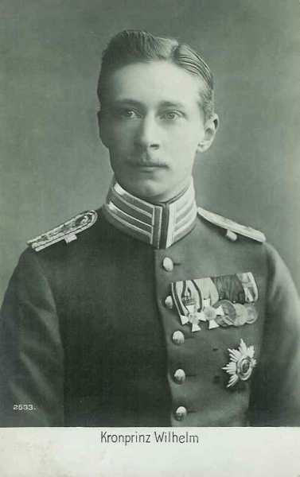
_Kronprinz de Prusse (Ve armée)_
_Collection privée_

5e C.A. (général von Stranz)

_Général von Stranz (5e C.A.)_
_Collection privée_

9e D.I. (général Eduard von Below)à ne pas confondre avec le général Fritz von Below, commandant du 21e C.A.

| Unité                     | Commandant   | Régiments                                                                                                            |
| ------------------------- | ------------ | -------------------------------------------------------------------------------------------------------------------- |
| 17e brigade               | Melms        | Infanterie-Regiment Nr. 19e (Görlitz / von Arnim)Posensches Infanterie_regiment Nr. 58e (Glogau / Zwengler)          |
| 18e brigade               | Falkenheimer | Grenadier-Regiment Nr. 7 (Liegnitz / Oscar de Prusse)Niederschlesisches Infanterie-Regiment Nr 154 (Jauer / Daubert) |
| Ulanen-Regiment Nr.1      |
| 9. Feldartillerie-Brigade |              | Feldartillerie-Regiment von Podbielski Nr. 52. Niederschlesisches Feldartillerie-Regiment Nr. 41                     |

10e D.I. (général von Kosch)

| Unité                      | Commandant | Régiments                                                                                                                                                                                                                                 |
| -------------------------- | ---------- | ----------------------------------------------------------------------------------------------------------------------------------------------------------------------------------------------------------------------------------------- |
| 19e brigade                | Liebeskind | Grenadier-Regiment Nr. 8 (Frankfurt a.d. Oder / Heyn)Infanterie-Regiment Nr. 46 (Wreschen / von Arenz)                                                                                                                                    |
| 20e brigade                | Horst      | Infanterie-Regiment Nr. 47 (Posen / Triegloff)Niederschlesisches Infanterie-Regiment Nr. 50 (Rawitsch / Distel)Ulanen-Regiment Nr 1 (Militsch-Ostrowo / von Kass)Regiment Königs-Jäger zu Pferde Nr 1 (Posen / comte de Solms-Wildenfels) |
| 10. Feldartillerie-Brigade | Muller     | 1. Posensches Feldartillerie-Regiment Nr. 202. Posensches Feldartillerie-Regiment Nr. 56                                                                                                                                                  |

19e détachement d’aviation.

### Le terrain

**[Lien vers carte](../img/virton_environs.jpg)**

La région de Virton fait partie de la Gaume, située à 10 km de la frontière française et à 25 km du Grand Duché de Luxembourg. C’est un terrain très accidenté, avec des altitudes variant de 205 m à 350 m, car la région compte plusieurs vallées : le Ton, la Vire et la Chevratte. Une immense forêt s’étend du nord ouest à l’est. Quelques villages sont situées dans une clairière : Meix-devant-Virton, Sommethonne, Villers-la-Loue et Robelmont, localités situées à l’ouest de Virton. Les villages de Robelmont et le lieu dit de Belle-vue surplombent la région et offrent une vue étendue.

### 20 août

**En matinée :**

Une reconnaissance française effectuée par le 3e dragons a détecté de nombreuses patrouilles de cavalerie allemande opérant sur la ligne Athus - Musson - Ville-Houdlémont - Saint-Pancré - Tellancourt.

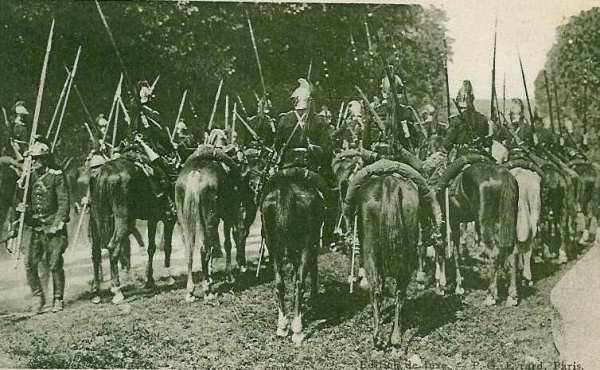
_Dragons français dans une clairière_
_Collection privée_

**10h30 :**

Le 3e dragons français trouve Ethe puis Saint-Léger occupés par de l’infanterie allemande.

### 21 août

**11h30 :**

Le 14e hussards français, qui couvrait la marche du 4e C.A., a été accueilli par des coups de fusil à La Malmaison en direction de Ruettes. La localité est occupée par de l’infanterie allemande. Les habitants estiment la force à 1500 hommes. Grandcourt est également occupé.

**En soirée :**

Une reconnaissance du 14e hussards, qui avait ordre de pousser jusqu’à Robelmont, n’a pu franchir ni la basse Vire ni le Ton, dont tous les passages étaient tenus par de l’infanterie allemande. Les troupes allemandes tiennent la basse Vire depuis Latour jusqu’à Signeulx.

Tous ces renseignements sont transmis au Q.G. de la IIIe armée, à Verdun. Des mesures de précaution sont prises pour la nuit du 21 au 22, par les deux divisions stationnées dans les régions de Virton et de Les Ruettes.

**IIIe armée française :**

- le 4e C.A. est dans la région de Virton (sud) - Latour - Les Ruettes.
    Le 19e chasseurs à cheval est à Bellefontaine.
    Le 120e R.I. est à Meix-devant-Virton.
    Le 147e est à Villers-la-Loue.
    Le 18e est à Sommethonne.
    Le 9e est à Thonne-la-Long.
    Un bataillon du 147e est à Robelmont, un autre à Villers-la-Loue et le troisième à Houdrigny.
    Le 91e bivouaque dans le Haut-Bois, entre Sommethonne et Villers-la-Loue.
    La 6e brigade est à Montmédy.
    Les 87e et 51e régiments d’infanterie sont à Montmédy.

Le général Boëlle donne l’ordre général pour la journée du 22 août.

I. - La zone méridionale du Luxembourg et particulièrement la région sud de Luxembourg est occupée mais on n’y a vu que des mouvements sans importance... Longwy a été attaqué le 20 août de la direction de Differdange.

II. - Le 4e C.A. a atteint la zone qui lui était fixée par l’ordre général n° 16. Il a pour mission de couvrir la droite de la IVe armée (2e C.A.) qui marche vers le nord.

III. - Le 14e hussards se portera dans la région de Vance, avec mission de renseigner sur les mouvements de l’ennemi, entre les routes de Vance - Arlon incluse et Etalle - Habay-la-Neuve - Heinstert incluse ....

IV. - Mouvement du C.A.
a) La 7e division se portera par Ethe dans la région de Saint-Léger - Châtillon avec mission de contre-attaquer par Vance tout mouvement de l’ennemi vers l’ouest, menaçant le 2e C.A.
Départ de Ethe à 5h.

b) La 8e division se portera par Huombois sur Etalle, avec mission de contre-attaquer toute troupe ennemie menaçant le flanc droit du 2e C.A., dans la zone à l’ouest de la route Etalle - Habay-la-Neuve incluse. Départ de Virton à 4h30.

La 8e division assurera la liaison avec le 2e C.A. et avec la 7e division sur la transversale Tintigny - Etalle - Châtillon.
..... »

**IVe armée française :**

- Les avant-gardes tiennent la Semois, depuis Alle jusqu’à Bellefontaine, soit à l’ouest de la IIIe armée.
    Le 2e C.A. (général Gérard), qui constitue la droite de l’armée, est cantonné sur une longueur de 18 km, de Bellefontaine jusqu’à Montmédy.

**Minuit :**

Le général von Below, commandant de la 9e division allemande, alerte ses régiments. Pour assurer la liaison avec le 6e C.A., il constitue, sous la direction du colonel Zwenger, commandant du 58e, un détachement composé du 58e, d’un escadron du 1e uhlans et d’une batterie du 41e régiment d’artillerie de campagne, qui reçoit comme mission de se porter vers Robelmont.

**6h :**

Les avant-gardes du 4e C.A. français franchissent l’Othain. Les avant-postes sont à Gomery (région d’Ethe) et à Bellevue (région de Virton).

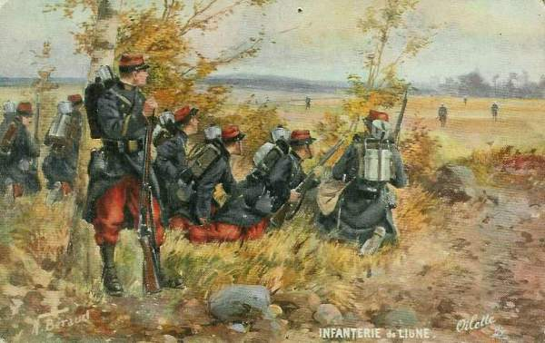
_Infanterie française en observation_
_Collection privée_

Quant à l’armée allemande,

- Le 5e C.A. est à Etalle.
    Le 13e C.A. est à Saint-Léger.
  Les deux C.A. font face à Montmédy, avec des avant-postes à Willancourt, Saint Léger et au bois d’Ethe.

**18h :**

- Les ordres de marche sont donnés aux divisions allemandes :
    9e division vers Virton via Huombois.
    10e division vers Ethe via Buzenol.

Le 5e C.A. doit se trouver le 22 à 16h30 sur les hauteurs entre Robelmont et virton.

### 22 août

**1h : reconnaissances allemandes**

L’avant-garde de la 9e division allemande (7e grenadiers, dont le colonel est le prince Oscar de Prusse, 3 escadrons du 1e uhlans), se met en marche par Huombois, sous le commandement du général von Falkenheimer. Les uhlans prennent les devants, accompagnés de quelques détachements d’infanterie transportés sur des voitures. Ils arrivent à la borne 28, à la lisière des bois de Virton.

Avant de s’engager sur le plateau qui domine Virton, quelques patrouilles sont lancées. Elles sont reçues à coups de fusil à la ferme de Bellevue. Le colonel rend compte que des forces françaises occupent Virton. La route d’Ethe jusque vers Houdrigny est tenue par des postes français. Les cavaliers et fantassins préparent une ligne de résistance le long de la lisière du bois.

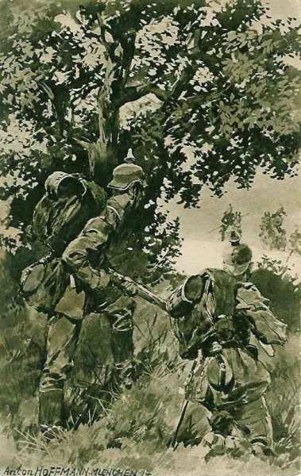
_Avant-gardes allemandes_
_Collection privée_

**2h :**

Le 2e C.A. français (IVe armée) se met en marche par un brouillard épais et froid. La tête doit se présenter à Bellefontaine vers 6h. La route est encombrée de voitures d’artillerie et les arrêts sont nombreux.

**2h30 :**

La 3e division (général Regnault) quitte Montmédy et marche très lentement, à cause du brouillard et de l’encombrement par l’artillerie, sur une route étroite en remblai et bordée de fils de fer.

**3h15 :**

**8e division française :** L’ordre de mouvement de la 8e division est rédigé et les estafettes partent pour alerter les troupes.

**4e C.A. français :** Le général Boëlle émet l’ordre général n° 21 pour la journée du 22 août 1914.

« I - De faibles cantonnements ennemis sont signalés dans la région Etalle - Arlon. Des groupements importants se trouveraient dans le Luxembourg.

- II - Le C.A. se portera aujourd’hui sur le front Etalle - Châtillon en deux colonnes.
    A sa droite, la 7e D.I., par Ethe et Saint-Léger.
    A sa gauche, la 8e D.I., par Virton, Huombois, Etalle.
  ....

V - Exécution du mouvement : point initial : bifurcation des chemins Virton et Vieux-Virton, environ 1 km nord-est de Dampicourt.
.... »

Le brouillard rend fort défectueuse la transmission de l’ordre d’alerte à certaines unités. Les chevaux partiront sans avoir mangé d’avoine.

- Les régiments de la 15e brigade ont été alertés :
    le 124e à 3h20 à Harnoncourt
    le 130e à 3h40 à Dampicourt.

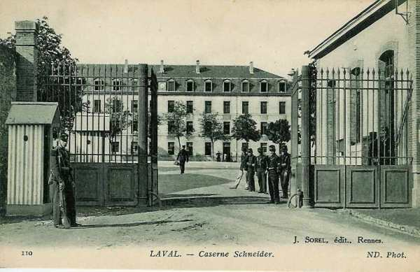
_124e R.I. - 8e division_
_Collection privée_

Le brouillard est maussade mais l’étape ne sera pas longue.

- Le 124e a 4 km à parcourir avant d’arriver au point, où il doit passer à 4h45.
    Le cycliste qui cherchait le 117e s’égare et n’arrive à Saint-Mard qu’à 4h55.
    Le 115e est prêt et attend à la sortie nord de Virton.

**3h40 :**

Les Allemands prennent contact avec des avant-postes français
Comme aucune patrouille française ne s’est présentée, le peloton d’infanterie du 7e grenadiers est envoyé en reconnaissance sur la route de Virton.

La 12e compagnie du 115e occupe la ferme de Bellevue. Une fusillade éclate et les avant-postes français, craignant d’être débordés, se replient sur la ferme. Ordre est donné à la 9e compagnie et à la section de mitrailleuses de venir soutenir les défenseurs de la ferme de Bellevue.

**4h :**

- Le 1e bataillon (Busserolles) du 130e , désigné comme tête d’avant-garde, est en route vingt minutes après réception de l’ordre et quitte Dampicourt.
    Le 124e se met également en route.

Le général de Lartigue, commandant de la 8e division, quitte Harnoncourt et se met en route en automobile. Il veut être à la sortie de Virton pour voir défiler l’avant-garde de sa division.

**4h30 :**

Le général de Lartigue est à Virton. Les rues sont désertes. Vers le nord, des coups de fusil crépitent, mais rien n’est visible en raison du brouillard opaque.

**115e R.I. français :** La 12e compagnie, qui tient la ferme de Bellevue, est attaquée par des forces très supérieures.
5h : l’avant-garde de la 8e division française débouche de Virton.

**130e R.I. français :** les éclaireurs du 130e, tête d’avant-garde de la division, atteignent Virton. Ils ont mis trois quarts d’heure à parcourir deux km à cause du brouillard épais et sont arrêtés par le général de Lartigue afin de permettre aux cavaliers de prendre une certaine avance.

L’avant-garde gravit le plateau au nord de Virton.

**5h15 :**

**14e hussards français :** le gros de l’escadron de hussards est à hauteur de la ferme de Bellevue. Quelques tirailleurs sont là, déployés. Le commandant de la 12e compagnie du 115e interpelle le capitaine des hussards : « inutile d’aller plus loin, les Allemands sont là, tout près. Nous avons tiraillé toute la nuit. »

Le capitaine détache une patrouille vers Robelmont pour chercher la liaison avec le 2e C.A. Cette patrouille ne reviendra pas.

Le peloton d’avant-garde (Gosselin) pénètre dans les bois mais doit rejoindre son escadron au galop : il se trouve au milieu des Allemands retranchés.

**5h30 :**

L’avant-garde du 130e, arrêtée pour donner du champ aux cavaliers, se remet en marche.

**130e R.I. français :** Pendant ce temps, le bataillon de Busserolles (1e), du 130e, tête d’avant-garde de la 8e division arrive à 800 m au nord de Virton. Personne ne pense aller à la bataille aujourd’hui. La traversée de Virton n’a fait que renforcer la bonne impression du départ. Un bruit de combat vient du nord. Le bataillon est loin de soupçonner la ruée sous laquelle sont submergées les 9e et 12e compagnies. Arrivés à un km au nord de Virton, le bataillon est subitement enveloppé dans une gerbe de mitraille. Immédiatement déployées, les compagnies se terrent. Le bataillon disparaît tout entier, décimé par les 1e et 3e bataillons des grenadiers prussiens. Quelques isolés peuvent retraiter vers Houdrigny.

Comme aucun renseignement n’arrive, le colonel Laffargue, commandant du 130e, part en chercher. Entre temps, les balles pleuvent et les hommes du 2e bataillon se terrent dans les fossés.

La 8e compagnie est chargée de pousser vers le nord-est, pour appuyer la droite du bataillon engagé. L’une après l’autre, les quatre sections sont déployées. On va au coude à coude. Sans cisailles, il est impossible de couper les clôtures en fil de fer.

**5h40 :**

**130e R.I. français :** les éclaireurs du 130e atteignent la lisière nord de Virton. Le dernier groupe du 31e régiment d’artillerie se trouve au pont de chemin de fer, sur la route de Dampicourt.

**14e hussards français :** les hussards s’enfoncent à nouveau dans les bois, sans détacher d’avant-garde toujours dans une épaisse brume. Une violente fusillade éclate. Le peloton se déploie mais les balles giclent par milliers et l’on se heurte à des clôtures de fils de fer. Les hussards doivent se replier.

**6h : les Allemands prennent l’offensive**

Le général von Falkenheimer, commandant l’avant-garde allemande, a reçu l’ordre du général von Below de pousser vigoureusement sur Virton et Bellevue.
7e grenadiers : les 1e et 3e bataillons du 7e régiment de grenadiers, précédés à très courte distance par une ligne de tirailleurs, se portent à l’attaque, en lignes de colonnes de compagnie, le 1e bataillon à cheval sur la route de Virton, le 3e à gauche. Les 9e et 12e compagnies du 115e résistent à cette avalanche et un combat s’engage à portée de pistolet. Les pertes françaises sont graves : la 12e compagnie perd la moitié de son effectif ; la 9e compagnie est à peu près détruite. Le reste des compagnies tient ferme devant un adversaire dix fois supérieur, composé de troupes d’élite.

**154e R.I. allemand :** trois bataillons du 154e régiment d’infanterie allemand sont mis à la disposition du général von Falkenheimer et deux groupes de batteries sont prêts à entrer en action. Celui-ci lance le 154e à l’attaque sur le plateau, prolongeant les grenadiers à gauche.

La 8e compagnie du 115e soutient le choc entre les routes de Virton à Etalle et à Ethe. Elle doit toutefois reculer pied à pied en effectuant des retours offensifs à la baïonnette. Mais cette lutte de quatre compagnies contre cinq bataillons ne peut se prolonger indéfiniment. Elle est acharnée surtout à Bellevue, où les assaillants sont encouragés par la présence du prince Oscar de Prusse.

**58e R.I. allemand :** le régiment a l’ordre de s’emparer de Robelmont. Vers 6h, le bataillon d’avant-garde refoule les patrouilles du 147e français et atteint la lisière du bois de Robelmont, face à ce village. Des éclaireurs sont accueillis par une fusillade nourrie. Robelmont semble solidement occupé. Meix l’est également et une importante colonne française se déroule sur la route de Bellefontaine.

Les Allemands prennent une position d’attente, en se déployant le long de la lisière sur du bois de Robelmont. Le gros est près de la ferme Herpigny.

**6h30 : les Allemands s’emparent de Robelmont**

**8e division française :** le gros de la 8e division s’est enfourné dans Virton et ne peut pas en déboucher. Le bataillon Favier (124e), en tête de colonne, a ses premiers éléments non loin des dernières maisons de Virton, sur la route d’Etalle. L’encombrement est invraisemblable.

**4e C.A. français :** le général Boëlle arrive à Virton. Il compte ne plus trouver que les dernières unités de la 8e division puisque la tête de colonne a dû quitter la ville dès 4h30, et il tombe en plein encombrement. Les rues sont engorgées de voitures, de canons et de fantassins des 117e et 124e, et de blessés des 115e et 130e. Il adresse l’ordre suivant au général de Lartigue (8e division) :

« Reçu votre communication de 6h05. Il est extrêmement important de gagner les débouchés nord du bois pour protéger le flanc droit du 2e C.A. Prenez toutes les dispositions nécessaires pour assurer la mission qui vous incombe. »

Le général Boëlle est conduit par le bourgmestre de Virton sur une terrasse qui couronne l’hôtel de ville d’où on a des vues étendues vers le nord. Vu le brouillard épais, le général ne peut rien voir mais il entend le bruit d’une violente bataille d’infanterie se déroulant de plusieurs kilomètres au nord-ouest, au nord et même au nord-est.

Le général s’engage à cheval sur la route d’Etalle le long de laquelle le 117e attend des ordres. Non loin des dernières maisons, le général de Lartigue attend. Cinq bataillons ont été engagés sans résultat. Le général Boëlle prescrit au général de Lartigue d’engager le 124e.

**147e R.I. français :** le 2e bataillon du 147e, quittant Robelmont où il avait passé la nuit, y est attaqué. Malgré les reconnaissances, et en raison du brouillard, les avant-gardes n’ont pu se rendre compte de l’importance des forces allemandes. Les patrouilles allemandes sont accueillies à coups de fusil aux premières maisons de Robelmont, puis ordre est donné de rompre le combat et de se replier. Deux compagnies sont placées à droite et à gauche de la route à la sortie sud de Robelmont, pour couvrir le repli. La compagnie d’arrière-garde rejoint le bataillon qui a commencé le mouvement de retraite. Les troupes cheminent à travers bois jusqu’à Meix-devant-Virton (direction nord-ouest).

**6h45 :**

**130e R.I. français :** les sections de mitrailleuses du 130e régiment se portent en avant et prennent position. Elles prennent part à la lutte sur la ligne même des tirailleurs.

**147e R.I. français :** le 2e bataillon du 147e (2e C.A.) se trouve en contact avec les Allemands. Ceux-ci se montrent prudents, constituent un rideau de tirailleurs et étendent leur front devant l’obstacle.

**6h50 :**

**130e R.I. français :** la tête d’avant-garde du régiment est arrêtée à la lisière sud du bois de Virton. Les balles pleuvent sur la route et blessent les hommes du 2e bataillon, couchés le long du fossé. Le colonel Chabrol, commandant du régiment, prescrit à la 8e compagnie d’appuyer le bataillon par le nord-est. Les instructions sont vagues : où est la droite du bataillon engagé ? Les quatre sections se déploient mais il n’est possible à cause du brouillard de n’apercevoir que huit ou dix tirailleurs. Les clôtures de fil de fer rendent la progression difficile car les soldats ne disposent pas de cisailles.

Comme les 9e et 12e compagnies du 115e tiennent la ferme de Belle-Vue, elles obligent les compagnies du 130e à s’arrêter devant un violent barrage de mitrailleuses. Le lieutenant du 115e refuse d’arrêter le tir pour laisser passer la 8e compagnie.

**7e grenadiers allemand :** quelques instants après, une ligne de Feldgrau, marchant à l’assaut de la ferme de Bellevue, apparaît dans le brouillard devant la 8e compagnie qu’elle submerge. C’est le 3e bataillon du 7e grenadiers. Les hommes tirent, le fusil sous le bras, couvrant le sol devant eux d’une nappe de fer. Les débris de la 8e compagnie (115e R.I.), vont rester sur place, entourés d’ennemis.

**7h :**

**115e R.I. français :** La 9e compagnie, réduite à quelques hommes, prise à revers, lâche pied, découvrant la droite de la 12e, qui est cramponnée à la ferme de Bellevue. La retraite vers Virton est coupée. Il ne reste que 100 hommes valides, presque tous à court de cartouches et l’avant-garde de la 7e division ne paraît pas.
A la faveur d’une accalmie et du brouillard, le capitaine replie ses débris vers Houdrigny, seule direction encore libre (sud-ouest). Il ne reste à la ferme de Bellevue que des morts et des blessés.

**7h30 : le 130e R.I. est refoulé sur Virton**

L’offensive allemande se développe. Le général von Below fait avancer au grand trot toute sa brigade d’artillerie (général Müller), qui se déploie à la lisière sud des bois de Virton, à cheval sur la route d’Etalle. 36 canons de 77 mm sont déployés face à Robelmont, à Houdrigny et à la région ouest de Virton. A l’est de la route, le groupe d’obusiers de 105 mm et deux batteries de 77 du 41e régiment d’artillerie, 18 obusiers et 12 canons de 77 sont prêts à agir face à Virton.

Obusiers et canons ouvrent un feu violent sur les compagnies françaises qui se disloquent. Le 130e subit des pertes sensibles.

Les deux bataillons du 7e grenadiers, appuyés à gauche par un bataillon du 154e avancent, soutenus par de nombreuses mitrailleuses. Le 130e français lâche pied et reflue vers Virton. Trois mitrailleuses sur dix sont détruites. Les débris des bataillons de Busserolles et Fadat se sont accrochés à un bois de sapins, à gauche de la route, à 500 m des premières maisons de Virton. Le 3e bataillon français a perdu la moitié de son effectif et presque tous ses cadres, et doit s’arrêter, cloué sur place par le feu des mitrailleuses.

Une ligne de feu se constitue avec des éléments disparates entre la crête militaire du plateau et la lisière nord de Virton.

Les Allemands cessent toutefois leur avance, tenus en respect par le feu des mitrailleuses françaises, qui tirent à raison de 600 coups à la minute.

**7h45 : engagement du 91e régiment d’infanterie**

**91e R.I. français :** le régiment dépasse Houdrigny, le 3e bataillon en tête. Il forme la queue de la colonne de la 4e division et fait route vers Bellefontaine. En chemin, il rencontre les débris des 9e et 12e compagnies du 115e. Les hommes n’ont plus de munitions et semblent être poursuivis de très près. Le capitaine Cousin du 115e rend compte au colonel Blondin, commandant du régiment, que d’importantes forces allemandes viennent d’emporter la ferme de Bellevue et que leur direction d’attaque doit les conduire sur Houdrigny.

Le glacis descendant du mamelon 280 sur Houdrigny et sur la route de Meix-devant-Virton est déjà balayé par les rafales de mousqueterie. Le 91e doit marcher sur Bellefontaine, rejoindre les deux autres régiments de sa division et est déjà fortement en retard sur l’horaire. Toutefois, le colonel Blondin ordonne de porter un bataillon sur la crête à l’est d’Houdrigny et de rejoindre le gros du régiment à Meix-devant-Virton.

**117e R.I. français :** Le régiment va attaquer dans une zone comprise entre Virton et Houdrigny, en essayant de déborder les Allemands par Robelmont. Le brouillard se dissipe.

**8h : les Allemands ne poussent pas sur Virton**

**[Lien vers carte](../img/virton_8h.jpg)**

**8e division française :** la situation est fort critique pour la 8e division. Les Allemands sont virtuellement maîtres du plateau de Bellevue qui surplombe Virton.

- Les trois bataillons du 130e ont fondu dans la fournaise. Les débris ont reflué vers Virton. Les dernières unités sont encore sur la route de Dampicourt.
    Le 117e attend à la sortie nord de Virton, le 2e bataillon (Mercadier) sur la route de Dampicourt, le bataillon Blanc (3e) à la sortie nord de Virton, le 1e bataillon (Treillard), la tête à la Patte d’Oie, le centre à hauteur de la gare. Tout ce régiment est à l’abri au fond de la vallée.
    Le 124e est encore en colonne pressée dans Virton, sa tête ne dépassant pas les dernières maisons vers le nord.

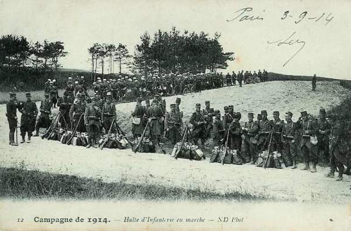
_Halte d’infanterie française_
_Collection privée_

- Le général Boëlle complète les ordres donnés vers 6h :
    Le 124e organisera et tiendra la lisière nord de Virton.
    Le 117e exécutera un mouvement débordant sur l’axe Houdrigny - Robelmont.
    Tout ce qui subsiste des 115e et 130e se ralliera dans la région ouest de Virton pour s’y reconstituer et servir de réserve.
    Un groupe du 31e d’artillerie restera où il est et les deux autres groupes iront chercher des positions de batterie sur les hauteurs sud de Virton.

Le général Boëlle rejoint ensuite son PC à Virton.

**9e division allemande :** le combat du 7e grenadiers et du 154e se développe favorablement : le 1e bataillon du 7e grenadiers a dépassé la ferme de Bellevue. Les défenseurs de la ferme (une centaine d’hommes) ont épuisé leurs munitions. Les six bataillons du 7e grenadiers et du 154e régiment prussien n’ont qu’à pousser de l’avant pour bousculer les unités disloquées des 115e et 130e, mais le général von Below arrête l’élan de la brigade von Falkenheimer : on vient de lui signaler la présence de forces françaises considérables échelonnées depuis Villers-la-Loue jusqu’au-delà de Meix-devant-Virton avec de forts éléments vers Robelmont, à la ferme de Verly et dans les bois de Meix. Le 58e régiment, envoyé en direction de Robelmont ne pourrait pas s’opposer à de pareilles masses et le flanc droit de la division risquait de se trouver compromis.

La masse signalée est toute la 3e division du 2e C.A. français, soit le C.A. de droite de la IVe armée française. Ce C.A. faisait route sur Léglise par Tintigny et Mellier, avec pour mission de marcher droit au nord. L’avant-garde devant déboucher de Bellefontaine vers 6h.

**8h15 :**

**91e R.I. :** Le brouillard commence à céder dans le fond de la vallée du ruisseau « Les Forges » et le 3e bataillon du 91e gravit les pentes du mamelon 280. Les compagnies de première ligne ouvrent le feu mais en dépit des efforts des officiers qui fouillent le terrain à la jumelle, aucun objectif allemand n’apparaît. Le commandant prescrit de s’installer sur le mamelon 280 sans s’approcher de la crête. De cette cote, les Français croient enfin apercevoir la ligne feldgrau. L’artillerie allemande, qui semble être à l’est de Robelmont à la lisière du bois, entre en action et les obus éclatent trop haut au-dessus de la compagnie Petin qui se terre.

**4e C.A. français :** le général Boëlle, pour faire taire les canons allemands et appuyer l’infanterie, prescrit au commandant d’artillerie du C.A. de constituer un grand groupement d’artillerie sur les hauteurs au sud de Saint-Mard.

**8h30 : La 9e division allemande se met sur la défensive**

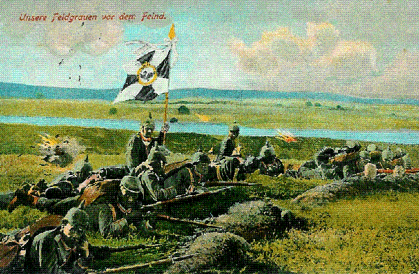
_Infanterie allemande retranchée_
_Collection privée_

- **9e division allemande :** la situation est la suivante :
    Cinq bataillons sont déployés sur le plateau de Bellevue, l’artillerie divisionnaire est en batterie à la lisière des bois.
    Trois bataillons du 58e avec une batterie et un escadron observent les régions de Robelmont et de Meix-devant-Virton.
    Le 2e bataillon du 7e grenadiers est massé en renfort à la lisière du bois, près de la route.
    Les 1e et 2e bataillons du 19e sont en colonne, leur tête vers les bois de Naux et de Virton.

Le 7e grenadiers et le 3e bataillon du 154e subissent de grosses pertes et ne poussent pas plus loin leur succès après la prise de la ferme de Bellevue.
Au centre, le 1e bataillon du 154e allemand pousse de l’avant mais ce régiment va être arrêté par la résistance de la 8e compagnie du 115e, accrochée au mamelon 265. Le 2e bataillon du 154e cherche à s’étendre jusqu’à la route d’Ethe pour déborder les positions françaises.

Le brouillard commence à se lever. Le général von Below (9e division allemande) sent qu’il est pris dans une tenaille et que chaque pas vers Virton l’y engage dangereusement. Il a devant lui des forces françaises considérables et on lui signale une colonne de toutes armes tenant toute la longueur de la route depuis Houdrigny jusqu’au-delà de la Hage. Une offensive de cette colonne pourrait être fatale à la 9e division.

Le général von Below prescrit au général von Falkenheimer de s’arrêter sur le plateau de Bellevue et d’y faire creuser des tranchées. L’artillerie allemande va écraser d’obus Virton, Houdrigny et Villers-la-Loue. Le bataillon du colonel Zwenger va porter le gros de son détachement à la lisière ouest, pour servir de flanc-garde face à Meix-devant-Virton. Le général von Below rend compte de ces dispositions au général von Stranz, commandant du 5e C.A.

La bataille devient dès lors défensive pour la 9e division.

**91e R.I. français :** dans le brouillard, les français aperçoivent des mouvements de troupes vers Robelmont. Le commandant Barrard rend compte que son flanc gauche est menacé.

**3e division française :** la division Regnault débouche du Haut-Bois. Le général donne ordre à l’escadron divisionnaire d’aller reconnaître le plateau à l’est d’Houdrigny et de prendre contact avec les unités du 4e C.A., qui auraient dépassé Virton. Une vive fusillade éclate, très rapprochée, vers Houdrigny. Quelques minutes plus tard, le canon tonne vers le nord-est. Un compte-rendu du colonel Blondin (91e R.I.) annonce la présence des troupes allemandes sur le plateau de Bellevue.

Le général Gérard (2e C.A.) décide de suspendre la marche de la 3e division tant que les Allemands n’auront pas été refoulés. Deux bataillons sont placés sur les pitons dominant Villers-la-Loue, sur la rive droite du ruisseau « Les forges ».

**8e division française :** le 1e groupe d’artillerie de la division s’installe dans les pépinières du couvent Saint-Joseph et ouvre le feu dans le brouillard, prenant comme objectif Robelmont et les bois au nord de Bellevue.
Les 2e et 3e groupes s’installent sur la rive gauche du Ton.

- Le 124e R.I. français prend position
    Le 1e bataillon va occuper le cimetière et ses environs. On n’y perce pas de meurtrières mais y installe des parapets de tir. En moins d’un quart d’heure, le cimetière est transformé en forteresse.
    Le 2e bataillon se déploie à gauche du premier, vers le mamelon 260, en éventail entre le chemin d’Houdrigny et la route d’Etalle. A peine les Français essaient-ils de dépasser la crête qu’ils sont accueillis par un formidable tir de barrage. Il faut attendre l’appui de l’artillerie.

**9h :**

**91e R.I. français :** le colonel Blondin, marchant à la tête de ses 1e et 2e bataillons, est sur le point d’atteindre le passage à niveau de la voie ferrée, à 1 km au nord d’Houdrigny et marche vers Bellefontaine. Pour couvrir le flanc gauche du bataillon Barrard, il détache une compagnie sur la croupe de Berchiwé. Le feu d’infanterie et d’artillerie redouble d’intensité dans la direction de Robelmont, ce qui rendrait la marche vers le nord très coûteuse en hommes. Le colonel décide alors de prendre plutôt part à l’action vers l’est. Un bataillon se porte face à Robelmont. La 2e compagnie (Viot) chemine dans le ravin qui monte de Berchiwé vers Robelmont.

Les feux allemands semblent partir de la lisière de Robelmont. Pour atteindre cette localité, il faut franchir un glacis d’environ 800 m. Très vite, les deux compagnies de tête subissent des pertes et doivent se terrer. Les deux sections de mitrailleuses prennent pour objectif de leur tir la lisière de Robelmont. Le colonel blondin (91e R.I.) demande au général Lejaille (7e brigade) l’appui de quelques canons. Il constitue une réserve à contre-pente, près du passage à niveau (2e bataillon Beslay).

Le régiment entame une offensive, ce qui force le 7e grenadiers, d’abandonner l’objectif de Virton et de s’installer en crochet défensif sur le mamelon 293, mais ce ne sera qu’une alerte.

**2e C.A. français :** le général Gérard (2e C.A.), que sa mission appelle vers Bellefontaine (petite agglomération dans la forêt au nord de Meix-devant-Virton), n’a nullement l’intention d’engager toute sa 3e division dans la région de Virton-Bellevue. Il songe à continuer sa marche vers le nord. C’est le rôle du 4e C.A. de dégager son flanc droit.

**9e division allemande :** le général von Below dispose de magnifiques positions de défense face au sud et face à l’ouest et son artillerie est formidable : trois groupes de 77mm (54 canons) et un groupe d’obusiers (18 obusiers de 10 mm) auxquels vont se joindre les 12 pièces de 150 mm du 5e régiment d’artillerie à pied (Fussartillerie) que le général von Stranz met à sa disposition. Le réglage du tir est assuré par un avion. Ainsi, la 9e division pourra se maintenir pendant toute la journée sur le plateau de Bellevue.

**124e R.I. français :** depuis 9h, la situation s’aggrave sur le front du 124e. Aux termes de l’ordre reçu, il n’aurait pas dépasser la crête qui couronne Virton, en arc de cercle, marquée par la cote 260, les Réservoirs et la cote 265.
Or, le 3e bataillon (Favier) entreprend une charge, croyant que les Allemands se retirent. Les compagnies partent au pas de course sans reconnaissance du terrain. Les troupes sont arrêtées par une haie très épaisse et ne disposent pas de cisailles. Les Allemands sont à l’affût, dans une tranchée à moins de 100 m et une fusillade éclate. En moins de deux minutes, le bataillon est décimé.

Le 2e bataillon (Brunet), entendant sonner la charge, s’est levé et a voulu franchir la crête qu’il avait l’ordre de tenir, mais est décimé par les tirs allemands. Les survivants rejoignent la crête d’où l’attaque était partie.

Le colonel commandant le 124e R.I., voyant que l’offensive des 2e et 3e bataillons a été brisée, décide de faire exécuter une contre-attaque au 1e bataillon. Il conduit lui-même le bataillon en colonne par quatre par le chemin creux du mamelon 265, et il dispose les trois compagnies face à la crête entre les Réservoirs et la cote 265, pour essayer de contourner les Allemands qui ont repoussé les deux bataillons. A peine la crête franchie, la masse du bataillon est accueillie par un feu infernal. Cette troisième tentative est vouée à l’échec.

Dès 9h, la cote 265 est perdue et les unités du 3e bataillon sont pris en écharpe par le sud-est. Faute d’outils en nombre suffisant, les hommes doivent s’abriter derrière leur havresac.

**117e R.I. français :** vers 9h, le régiment reçoit l’ordre d’attaquer entre Virton et Houdrigny, d’abord sur Robelmont puis sur les cotes 305 et 310, de manière à déborder la droite allemande. Le 117e doit trouver un cheminement dans le fond d’un grand ravin, à mi-distance entre Virton et Houdrigny, et qui monte vers Robelmont. Comme le brouillard s’éclaircit, le ravin peut être pris en enfilade. Les 2e et 1e bataillons seront en première ligne. Le 3e bataillon suivra en échelon à 800 m. En hâte, on distribue les cartouches des voitures de munitions et le 2e bataillon commence le mouvement. Il est sur le chemin de Saint-Mard. Le 1e bataillon prend la route de Virton à Dampicourt, puis celle de Dampicourt à Houdrigny.

**9h05 :**

**87e R.I. français :** le 87e est en tête du 2e C.A. (3e division, 6e brigade). Le général Caré, commandant de la 6e brigade, transmet les ordres du commandant du C.A. Le 2e bataillon du 87e va aller tout entier sur le mamelon 225, au sud-est de Villers-la-Loue.

**3e division française :** le commandant de l’escadron divisionnaire (3e division) exécute la reconnaissance prescrite par le général Regnault, vers le ruisseau « Les forges » mais les obus commencent à y tomber. Les cavaliers aperçoivent la ligne du 91e couchée faisant le coup de feu, renvoient les chevaux dans le ravin et se déploient à pied à droite de l’infanterie. Ils rendent compte au général Regnault que la lutte est déjà chaude à l’est d’Houdrigny.

Les trois groupes du 17e régiment d’artillerie se trouvent dans Villers-la-Loue. Les artilleurs mettent leurs pièces en batterie vers le chemin du bois Lavaux et du bois Grehire, d’où il y a des vues très étendues dans la direction de Virton.

**2e C.A. français :** le général Gérard transporte son poste de commandement à Sommethonne d’où les communications avec Bellefontaine sont assurées par Gérouville.

**9h30 :**

**4e C.A. français :** l’E.M. du général Boëlle quitte Virton prenant le chemin de Saint-Mard à Harnoncourt , arrosé par l’artillerie allemande. Il découvre la ferme de Bellevue qui brûle, les pentes de Robelmont, les hauteurs à l’est d’Houdrigny et les lisières de bois à perte de vue. Le poste de commandement est installé près d’un petit bois tout près du chemin. Il y restera jusqu’au soir.

Le général Boëlle donne l’ordre au colonel Gazan (115e R.I.) de mettre à sa disposition, vers la cote 280 au sud du Ton, son 1e bataillon. Le mouvement s’exécute vers 10h. Il est difficile car, le brouillard s’étant levé, les coteaux qu’il faut gravir sont bien en vue de l’artillerie allemande. Les unités se glissent à la file indienne, le dos courbé, dans les fossés du chemin.

**9h45 :**

**147e R.I. français :** le 2e bataillon (Saget), qui se trouve isolé à Meix-devant-Virton, reçoit l’ordre de retraite vers Bellefontaine. Quand le brouillard s’est levé, les Français voient les Allemands s’installer vers la ferme de Verly, ouvrir le feu et essayer de déborder la ligne française par les bois. Sous un feu violent d’infanterie et d’artillerie, le 2e bataillon du 147e se retire mais la 7e compagnie ne s’en aperçoit pas.

**10h :**

**117e R.I. français :** le 117e se trouve déployé tout entier et a atteint le chemin de Virton à Houdrigny, la compagnie de gauche étant à proximité de la ferme de Beauregard.

- **8e division française :** la 8e division est tout entière déployée.
    A droite, face à la crête 265, le 2e bataillon du 115e.
    A gauche, face au nord et au nord-est, le 124e, moins une compagnie maintenue dans le cimetière transformé en forteresse.

- La phase de la bataille, qui va se dérouler entre 10h et midi, sous un soleil brûlant, sur un plateau sans couverts, sera marquée :
    Du côté de la 8e division, par les efforts du 124e et des débris des 115e et 130e, pour se maintenir au nord de Virton, contre un ennemi retranché qu’appuient 80 canons.
    Du côté du 2e C.A., par l’engagement de la 3e division, au fur et à mesure de leur arrivée sur le champ de bataille.

**9e division allemande :** la 9e division prussienne, puissamment renforcée en artillerie, engage son dernier régiment pour s’assurer la possession du plateau de Bellevue. Le 154e reçoit l’ordre de pousser vers l’avant, débordant la droite française, pour tacher d’aborder Virton par l’est. Cette manoeuvre échoue suite à la résistance du 2e bataillon du 115e. Les trois bataillons du 154e prussien sont immobilisés sur la crête 265.

Du côté ouest, le général von Below fait occuper solidement le mamelon 305 de Robelmont et fait renforcer la ligne, où un vide s’est ouvert entre le 154e (face à Virton) et le 7e grenadiers (engagé vers Houdrigny).
Le lieutenant-colonel von Arnim, commandant du 19e régiment d’infanterie, reçoit l’ordre d’exécuter cette mission.

Le général von Below dispose encore de deux bataillons dans les bois : le 2e bataillon du 58e et le 3e du 19e. L’infanterie allemande est appuyée par toute la brigade d’artillerie divisionnaire et au moins un bataillon du 5e régiment d’artillerie à pied : au total 80 canons, dont 24 au moins de gros calibre.

La ligne allemande est renforcée par le 2e bataillon du 154e, qui s’est porté le long des bois jusqu’à la route d’Ethe, poussant quelques unités au sud du Ton, pour tâter les lisières est de Vieux-Virton et de Saint-Mard. Le bataillon Graff est hors d’état de s’opposer à ce mouvement enveloppant. Comme les Allemands s’infiltrent dans la vallée du Ton, les trois compagnies de droite doivent se replier pour ne pas être prises à revers. Les troupes ne peuvent pas se maintenir sur la crête, qui est déjà prise d’enfilade par la rive sud du Ton, et battue en écharpe par l’artillerie de Bellevue. Il faut reculer jusqu’à la lisière de Virton.

Les Allemands ne cherchent pas à dépasser la crête séparant Virton de la ferme Lempereur.

**117e R.I. français :** le bataillon Mercadier du 117e franchit le chemin creux reliant Virton à Houdrigny. La 8e compagnie de tête se déploie sur le plateau au sud ouest de la cote 260. A la crête, les balles arrivent par rafales. Les éclaireurs se couchent dans un champ de luzerne. Les mitrailleuses allemandes crépitent à 500 ou 600 mètres. Les Français ouvrent le feu à 600 m mais le plateau semble désert, car l’infanterie allemande est bien dissimulée. Le commandant du bataillon juge nécessaire d’appuyer la 8e compagnie avant de tenter une progression sur le plateau dénudé.

Huit batteries du 44e régiment d’artillerie français interviennent dans la bataille et clouent l’infanterie allemande au sol.

**3e division française :** la division Regnault (2e C.A.), surprise, n’est pas à même d’agir vers l’est avec tous ses moyens. Elle tente de poursuivre sa marche vers le nord, mais se trouve bloquée par un ennemi puissamment installé sur les hauteurs de Bellevue et de Robelmont. Le général Regnault décide d’occuper solidement la ligne Houdrigny - Meix-devant-Virton.

Le 91e R.I. est immobilisé. Les 1e et 3e bataillons sont déployés depuis le mamelon 280 jusqu’à la crête de Berchiwé et cloués au sol par la mitraille. A la crête, les bataillons ont été accueillis par des feux violents de mitrailleuses, d’infanterie et d’artillerie. Les troupes se trouvent sur un terrain nu, aux avoines coupées, où la vue s’étend au-delà de la route d’Etalle. Les soldats tirent peu, ne sachant pas où viser. Quelques sections essaient à plusieurs reprises de prendre pied sur le plateau mais elles sont décimées et doivent refluer.

**10h15 :**

**117e R.I. français :** deux sections de la 7e compagnie du 117e prolongent la 8e et ouvrent le feu. Les fantassins veulent aborder l’ennemi. Personne ne songe à creuser le sol.

Le bataillon Treillard atteint le chemin de Saint-Mard à Houdrigny. Le franchissement de la crête de Beauregard est salué par des obus de 77 et de 105 mm.

**4e C.A. français :** les unités du 87e R.I. et du 4e C.A. se portent en avant, de Houdrigny vers le nord-est. Pour ne pas se mêler à ces troupes le bataillon Treillard doit obliquer nettement à droite. Les troupes atteignent la crête, près du point culminant de 280. Là, la pluie de projectiles est effroyable. Les obus de 77 se succèdent avec rapidité. Les obus de 105 et de 150 creusent d’énormes cratères. Les Français tirent sans rien voir. Les pertes françaises sont graves.

Le général Regnault a prescrit verbalement au général Carré, commandant de la 6e brigade, de pousser les deux bataillons du 87e plus en avant, sur les hauteurs à l’est d’Houdrigny.

**10h30 :**

**87e R.I. français :** les 2e et 3e bataillons du 87e franchissent sous les obus le ravin d’Houdrigny. Ils ont pour objectif les mamelons situés au nord-est et sud-est du village. A mi-pentes, où déferle un ouragan de fer, les compagnies de tête, prises d’écharpe, se déploient et progressent par bonds. Elles refoulent les patrouilles du 7e grenadiers. Des hauteurs de Villers-la-Loue, deux groupes du 17e d’artillerie accompagnent la progression de l’infanterie. Au-delà de la crête 280 se révèle une autre crête tenue par un ennemi invisible. Les groupes des 87e et 91e refluent et s’arrêtent derrière la crête 280.

**11h : Robelmont est enlevé par les Allemands**

**19e R.I. allemand :** Le 2e bataillon du 19e allemand, chargé de renforcer la ligne entre le 7e grenadiers et le 154e, se porte en direction de Bellevue et subit le tir du 17e régiment d’artillerie. Il vient couronner la crête entre Houdrigny et Virton. Comme il est en butte aux feux du 31e d’artillerie et du 91e régiment d’infanterie, il doit s’arrêter et creuser des tranchées face au sud-ouest.

**58e R.I. allemand :** deux bataillons se trouvent dans le bois de Robelmont. Le 3e bataillon, appuyé par la batterie d’artillerie et par la compagnie de mitrailleuses du régiment, doit tenir à tout prix face à l’ouest, les hauteurs du Fréchy. Il occupe la ferme du Fréchy mais ne pousse pas plus loin, sa mission étant défensive.

**124e R.I français :** Le régiment, très éclairci, se maintient avec difficulté sur la crête au nord de Virton. Les Allemands n’avancent pas mais leur artillerie et leurs mitrailleuses inondent tout le champ de bataille de projectiles, ce qui rend difficile la position des soldats, mal abrités dans leurs trous de tirailleurs. Le moindre mouvement attire tout de suite une grêle de balles. Tout ce qui se lève est fauché. La 2e compagnie qui tient le cimetière de Virton est arrosée de shrapnells mais ne subit aucune perte. Les Français tentent encore de dépasser la crête par une attaque à la baïonnette mais sont décimés. C’est leur quatrième tentative. Les Allemands creusent de profondes tranchées et renforcent leur ligne.

**115e R.I. français :** les cinq compagnies sont disposées derrière la crête au sud de la cote 280. Les fantassins creusent des trous de tirailleurs.

**8e division française :** le général de Lartigue (8e D.I.) se rend au mamelon 260 au nord de Virton pour observer l’état de la situation dans la zone où le 117e va s’engager. Il fouille avec ses jumelles le creux de Dampicourt et les crêtes désertes de Houdrigny et de Robelmont mais n’aperçoit rien.

La crête devant Houdrigny semble infranchissable, car les balles viennent de partout. Le commandant de la 2e section de mitrailleurs du 117e cherche à installer deux machines derrière un tas de pierres entre le bataillon Mercadier et le bataillon Blanc. L’essai échoue. Le plateau où le 117e devrait se déployer est balayé de balles provenant du nord, du nord-est et de l’est et en marchant sur Robelmont, on prête le flanc aux Allemands.

**2e C.A. français :** le général Gérard, qui a installé son PC à Sommethonne, se rend compte q’un effort peut devenir nécessaire pour dégager le flanc droit de son C.A. et empêcher les Allemands de s’infiltrer dans les bois entre les 3e et 4e divisions. Il décide de placer à la ferme du Hayon trois bataillons du 128e et deux groupes d’artillerie de C.A. à la disposition du général Regnault pour agir sur Robelmont, quand l’occasion paraîtra favorable.

Le général Deffontaines, commandant de la 5e brigade, vient d’arriver à Sommethonne avec la tête de colonne du 128e. C’est lui qui conduira le 128e et deux groupes du 29e d’artillerie.

**11h30 :**

**3e division française :** Le général Regnault, qui attendait à la sortie de Villers-la-Loue le résultat de l’action du 87e, décide de faire occuper Meix-devant-Virton par le 51e. Le régiment traverse Villers-la-Loue au milieu du fracas des explosions. L’objectif est Meix-devant-Virton. Les 2e et 3e batailons se portent en avant vers Meix par le ravin de la Chavatte. Le bataillon Mayer (3e) oblique vers la gauche.

**12h : ordre de repli au 4e C.A. français**

**[Lien vers carte](../img/virton_12h.jpg)**

Le 117e est immobilisé, pêle-mêle avec les unités du 2e C.A., sur la crête qui descend de 280 vers le sud-ouest.

Six batteries du 31e R.A.C. français ouvrent le feu.

Sur le champ de bataille, le désordre devient inextricable. Plusieurs bataillons sont mélangés, du 117e, de 91e et du 87e. Il y a lieu de faire des efforts ailleurs pour appuyer ces régiments.

**Situation générale :** Au sud de Virton : trois régiments de la 8e division ne sont plus à même de prendre l’offensive mais l’artillerie de cette division et du 4e C.A. interdit aux Allemands tout progrès vers Virton.
L’entrée de la ville est gardée par des débris du 130e qui occupent maisons et jardins. La 2e compagnie du 124e occupe le cimetière transformé en forteresse. L’effectif total ne dépasse pas 500 ou 600 hommes valides, avec peu de cartouches.

Les Allemands sont tout aussi épuisés que les Français par les combats. Ils sont abrités dans des tranchées qu’ils continuent à creuser. Les français sont tapis dans des trous de tirailleurs ou simplement derrière leur sac. Les mitrailleuses allemandes déclenchent leur tir sur tout ce qui bouge. Par dessus l’infanterie, les deux artilleries échangent leur obus.

L’offensive du 117e sur Robelmont est arrêtée, de même que la progression des 87e et 91e R.I. de la 3e division.
Sur le mamelon 280, une ligne s’est formée de quatre bataillons mélangés appartenant à deux C.A. différents. Elle est prolongée par deux bataillons du 87e et 91e jusqu’à la crête de Berchiwé face à Robelmont

Derrière cette ligne, deux bataillons du 51e se hâtent vers Meix-devant-Virton et trois bataillons du 128e et deux groupes du 29e R.A.C. vers la ferme du Hayon.

Le général Regnault a encore un bataillon en réserve à Sommethonne et le général Gérard dispose de deux bataillons du 72e, dernier régiment de son C.A.
A Bellefontaine, la 4e division est engagée dans une bataille acharnée.

Le général Boëlle décide de se dégager de cette situation pénible et de ressaisir l’initiative des opérations. La 8e division n’a plus les forces nécessaires pour déboucher de Virton sur le plateau de Bellevue, et pourtant, ce débouché importe pour couvrir le flanc droit du 2e C.A. Cette couverture peut encore être réalisée si le 4e C.A. concentre ses forces sur la Basse Vire, de manière à interdire la route de Montmédy pendant que le 117e continuerait, de concert avec le 2e C.A., son offensive contre Robelmont. Entre Dampicourt et Harnoncourt, la route de Montmédy est dominée par deux pitons abrupts, constituant une solide position de résistance : la cote 280, au sud de Saint-Mard et le massif de Montquintin, haut de 320 m.

**4e C.A. français :** Le général Boëlle décide d’occuper la position 280 - Montquintin avec les débris des 115e, 124e et 130e. L’ordre est donné au général de Lartigue d’exécuter cette manoeuvre. Les officiers des E.M. des C.A. vont porter l’ordre de repli aux troupes engagées.

**124e R.I. français :** Le colonel Fropo, commandant du 124e peut être joint mais les ordres ne parviennent pas à tout le monde, les officiers de liaison sont tués pendant leur mission.

Les survivants du 1e bataillon (124e) se dégagent en rampant. Il faudra une heure aux 400 hommes pour rentrer dans Virton. Ils reçoivent l’ordre de rejoindre Montquintin.

La deuxième compagnie est dans le cimetière. Elle doit se porter par Saint-Mard au sud de la cote 280.

L’ordre de repli n’est pas arrivé au bataillon Brunet, immobilisé sur le mamelon 260.

Le bataillon Favier (124e) est disloqué, et l’ordre de repli ne pourra pas lui être régulièrement transmis. Le 124e n’existe plus comme régiment jusqu’au soir et on verra des détachements portant son numéro à la cote 280, à Montquintin et à la patte d’oie.

**130e R.I. français :** Le régiment, bourré de réservistes, est à peu près désagrégé. Seuls sont valides le capitaine et sept lieutenants et sous-lieutenants. 300 hommes du 130e occupent les jardins et les maisons de la lisière nord de Virton. L’ordre de repli ne les atteindra pas. Une section de mitrailleuses va rester en place jusqu’à 15h, balayant les patrouilles allemandes trop hardies.

**13h :**

Devant le bataillon Brunet (124e), les Allemands semblent se replier et une accalmie se produit. Le bruit court que les autres régiments français battent en retraite et les tirailleurs quittent individuellement la ligne de feu et se rallient à la patte d’oie sur la route de Montmédy.

- Situation des troupes allemandes à l’ouest de Virton :
    Le 58e tient Meix-devant-Virton (nord-ouest de Virton), la lisière du bois, la ferme du Verly et Robelmont, avec une batterie du 41e dans la clairière au nord de Robelmont et un bataillon en réserve dans le bois.
    Le 1e bataillon du 19e tient Robelmont.
    Les 1e et 3e bataillons du 7e grenadiers, la 2e bataillon du 19e et le 3e bataillon du 154e développent un système de tranchées pour tireurs debout.

Offensive du 51e français sur Meix-devant-Virton :
Les 2e et 3e bataillons du 51e continuent leur marche d’approche vers Meix-devant-Virton à travers une région particulièrement tourmentée, taillis, ravins profonds et plateaux dénudés battus par les feux allemands. Meix est dans une cuvette encaissée, entourée de bois et protégée vers le sud par un massif boisé. Ce massif est occupé par des éléments du 58e allemand, disposant de mitrailleuses. Le commandant Berton pousse ses deux compagnies de première ligne déployées au préalable sous le couvert. La 6e compagnie est pourtant réduite à 80 hommes mais les Allemands lâchent pied.

**115e R.I. français :** Quand parvient l’ordre de repli parvient au colonel Gazan, commandant du 115e, son régiment occupe déjà le mamelon 280 avec le 1e bataillon (Travers).

**14h :**

**124e R.I. français :** il reste 300 hommes au bataillon Brunet. Le groupe va rester à la patte d’oie jusqu’au soir, attendant les ordres.

- **117e R.I. français :** le 2e bataillon (Mercadier) a pris pied sur le mamelon 260, au nord-ouest de Virton. Les compagnies sont clouées au sol, dans des champs où l’avoine a été fauchée et liée en gerbes. Certaines compagnies ont un tiers de leur effectif hors de combat.
    Le 3e bataillon (Blanc) est arrivé à hauteur du bataillon Mercadier mais n’a pas pu franchir la crête descendant de la cote 280 vers l’est.
    Le bataillon Treillard (1e) a dépassé la crête au sud d’Houdrigny. Il essaie de prendre pied sur le plateau, mais toute progression est impossible à cause du feu intense.

**87e R.I. français :** de 14h à 19h, le régiment se trouve sur un vaste plateau dénudé. Les balles giclent et semblent provenir de toutes les directions. Les fantassins ne sont pas à l’abri dans les pentes orientales du mamelon 280, prises d’enfilade de la direction de Robelmont.

**91e R.I. français :** la situation des trois bataillons du 91e est très précaire. Les balles proviennent du nord et de l’est, ce qui donne l’impression à la première ligne que l’on tire sur elle de l’arrière.

**14h15 :**

**51e R.I. français :** Le 2e bataillon du 51e entre dans Meix-devant-Virton, abandonné et pousse immédiatement des patrouilles vers la ferme de Verly. Le 3e bataillon arrive quelques minutes plus tard. Robelmont que l’on aperçoit dans un fond boisé brûle. Aucune troupe n’est visible. Des rafales proviennent toutefois du mamelon 305, tenu par les Allemands. La position allemande est tellement favorable à la défensive que le commandant du bataillon juge impossible de l’attaquer.

Pour éviter de repasser sous les feux provenant de la ferme de Verly, le bataillon se glisse par un cheminement abrité.

**14h30 :**

**3e division française :** Le général Regnault se rend à Villers-la-Loue et rejoint le général Deffontaines (5e brigade), qui a pris les dispositions nécessaires pour une offensive contre Robelmont.

Le 1e groupe du 29e d’artillerie et la 6e batterie sont en surveillance sur la croupe 315, face à l’artillerie allemande en position dans la région de Robelmont.

Le colonel Lorillard, commandant du 128e, a donné Meix-devant-Virton (ouest-nord-ouest de Robelmont) comme objectif à son bataillon de droite, de manière à déborder la droite présumée de l’ennemi. Le mouvement est amorcé, le 128e a dépassé la position d’artillerie de la crête 315, puis le général Regnault prescrit à ce régiment de s’orienter vers Robelmont. Ordre est également donné au colonel Ledoux, commandant du 51e, de participer à l’attaque de Robelmont à partir de Meix-devant-Virton (nord-ouest de Robelmont). La localité, abordée de plusieurs côtés, ne pourrait que tomber.

Le terrain où le 128e doit opérer est favorable à l’attaque : l’infanterie peut se glisser dans de multiples ravins boisés.

De la crête 315, les canons couvrent de projectiles les hauteurs dominant Robelmont. L’infanterie du 128e se glisse par les replis du terrain. L’artillerie allemande tire au hasard, ne voyant rien.

Le commandement allemand est inquiet et donne ordre au 19e R.I. d’évacuer Robelmont. Et de se replier sur la cote 305. Ce mouvement est accompagné de tirs d’artillerie français.

**15h :**

- Les troupes sont disposées sur la position 280 - Montquintin de la manière suivante :
    Derrière la crête 260, couvrant les batteries du 44e régiment d’artillerie, deux compagnies du 317e, venues avec ces batteries.
    Derrière les canons, le 1e bataillon du 115e.
    A gauche de ce bataillon, la 2e compagnie du 124e et une section de mitrailleuses.
    Derrière la crête 280, les restes des trois bataillons du 130e, environ 400 hommes.
    Sur le chemin de Harnoncourt, la 11e compagnie du 115, intacte, creuse des tranchées.
    A la patte d’oie, sur la route de Dampicourt, les débris du bataillon Brunet du 124e couvrent cette route.
    A Montquintin, un détachement de 200 hommes du 130e, 150 hommes du 124e, 150 hommes du 115e. Une ligne de tranchées a été creusée le long de la lisière nord du village.

**16h : contre-offensive allemande**

L’ordre du général commandant l’artillerie parvient : les deux groupes du 31e R.A.C. divisionnaire resteront sur le mamelon 280, continuant à tenir sous leur feu les hauteurs de Bellevue et de Robelmont. Un groupe du 44e régiment restera au col 260 pour surveiller la région Latour - Chenois et deux groupes de ce régiment iront à Harnoncourt pour surveiller le couloir de Dampicourt entre les bastions 280 et Montquintin. Depuis midi jusqu’à 17h, les batteries du 31e et 44e demeurent maîtresses du champ de bataille en faisant de la surprise de Virton une bataille indécise.

**128e R.I. français :** Trois bataillons du 128e sont descendus dans la dépression de la Chevratte et s’aligne sur la voie ferrée. Le général Regnault observe le repli des Allemands vers Robelmont. A 16h, un obus éclate près du général Deffontaines (5e brigade), qui accompagne le 128e. Le général mourra de ses blessures.

Les Allemands commencent à sortir des bois au nord-ouest de Meix-devant-Virton, menaçant le flanc gauche et les arrières du 128e. Les troupes d’artillerie, menacées d’être prises à revers, se replient sur le chemin de crête qui va de la cote 315 à la route de Sommethonne.

Le général Regnault prend immédiatement des mesures :
Demande est faite au général commandant du 2e C.A. , d’envoyer d’urgence le 72e à la ferme du Hayon afin d’enrayer la contre-offensive allemande. En fait, les Allemands n’avaient aucune force sérieuse de ce côté. Le gros du 58e était dans les bois de Robelmont et les régiments du 6e C.A. se trouvent vers Bellefontaine, nettement plus au nord. Suite à cette fausse alerte, l’offensive du 128e est arrêtée.

**17h :**

Le général Boëlle sait la situation mauvaise au 5e C.A. et peu brillante à la 7e division, mais à Virton, la bataille semble stabilisée et il peut même voir à la jumelle un reflux d’Allemands vers Robelmont. S’il avait eu des forces disponibles, il aurait même prononcé une attaque mais il ne reste que cinq ou six compagnies fraîches et cette ultime réserve doit être conservée en cas d’imprévu. Un regroupement des unités s’impose, pour être à même de reprendre la lutte demain.

**18h :**

**[Lien vers carte](../img/virton_18h.jpg)**

**91e R.I. français :** Le colonel Blondin, voyant les blessés refluer de plus en plus nombreux, envoie un officier au général Regnault pour exposer la situation et le danger d’une offensive allemande. Le général donne liberté de se replier vers Sommethonne.

**18h30 :**

Un ordre de stationnement est rédigé, aux termes duquel les 115e et 117e tiendront Montquintin, Dampicourt et Saint-Mard et la 7e division les bois au sud de Ruettes. Le P.C. de la 8e division s’installe à Harnoncourt, celui du 4e C.A. à Lamorteau.

**19h :**

**87e R.I. français :** le colonel Rauscher prescrit à ses bataillons de se replier.

Les Allemands, avertis par avion de l’arrêt de l’offensive du 128e sur Robelmont et du repli de l’artillerie de C.A., s’enhardissent. Ils tentent d’aborder, sur le plateau 280, la ligne française qui semble annihilée et ne tire plus. A la vue des Allemands, le 1e bataillon du 91e ouvre un feu violent. Les Français chargent et les Allemands retournent précipitamment à leurs tranchées Ils ouvrent le feu à leur tour et infligent de fortes pertes. L’ordre de repli du 91e arrive en ce moment. Les troupes se dégagent en rampant.

Pendant ce temps, le 3e bataillon du 87e (Chardoillet), pour enrayer la retraite, fait sonner la charge et se porte vers la cote 295. Les troupes se précipitent au pas de course. Les Allemands abandonnent leurs tranchées de la cote 295 mais se blottissent dans une autre ligne de tranchées, 500 mètres plus loin et les mitrailleuses crépitent, fauchant les troupes françaises. La masse reflue, l’élan est brisé.

**19h30 :**

**91e R.I. français :** Le colonel Blondin donne un ordre de repli sur Sommethonne par le bois Lavaux. Le train de combat part tout de suite.

**117e R.I. français :** Les soldats du 117e R.I. attendent l’ordre de se porter en avant. Or, ils voient à gauche la ligne française reculer et des éléments se retirer du combat. La section de gauche du 117e recule avec les éléments des 87e et 91e. Un lieutenant interpelle la section à qui il ordonne de se porter en avant. Il commande des feux de salve, qui n’ont aucun effet car les Allemands restent invisibles et le jour décline. Comandant Treillard fait sonner la charge et les 3e et 2e bataillons et les fantassins se précipitent en avant dans un élan endiablé. Le colonel Julien se porte en avant sabre à la main. La musique joue la Marseillaise et les soldats la chantent à tue tête. Les fantassins dévalent le ravin qui descend sur la patte d’oie. La partie du ravin franchi par le 1e bataillon est prise en enfilade, de la direction de Robelmont, par des mitrailleuses et des canons. La première vague, décimée, hésite et tourbillonne. Le désordre devient effroyable dans le fond du ravin et le capitaine Collin doit donner l’ordre de retourner sur ses positions. Il leur fait prendre position sur la crête 270. Pour la masse, la course continue et le feu allemand cesse subitement. L’obscurité envahit la campagne. Presque partout, les Allemands ont abandonné leurs tranchées.

Tout à coup, les clairons sonnent « cessez le feu et halte-là ». Il est possible que les Allemands aient imité les sonneries françaises. L’élan, qui a dépassé les premières tranchées allemandes s’arrête net. Les troupes se regroupent et l’on entend les sifflets des commandants de compagnie. Les quelques éléments qui ont franchi les premières tranchées allemandes sont décimés par un feu violent, doivent se terrer et revenir sur leurs positions en rampant. Si les Allemands avaient tenté une contre-attaque, les troupes françaises auraient été balayées, mais les Allemands restent tapis dans leurs tranchées. Le colonel Julien décide de replier le 117e vers Harnoncourt pour l’y reconstituer. La 1e compagnie (capitaine Collin) reçoit l’ordre de tenir ferme sur le plateau pour permettre au 117e de s’écouler sur Harnoncourt. Les débris du 87e restent également sur le plateau.

**20h :**

Le général Boëlle décide de quitter son observatoire de la cote 280. Il ordonne à une batterie de tirer une dernière salve « pour dire à ces gens-là que le champ de bataille nous appartient ». Quatre éclairs de feu s’allument à la lisière du bois de Belmont. Au moment d’amener les avant-trains d’artillerie pour aller bivouaquer à Harnoncourt, la 8e batterie tire une salve sur Bellevue.

**21h :**

L’E.M. du 4e C.A. arrive à Lamorteau à 21h et l’ordre préparatoire pour le 23 est prêt et immédiatement expédié. Il prévoit le repli des trains régimentaires. Ceux de la 7e division sur Marville et ceux de la 8e division sur Flavigny.

**23h :**

Le général Boëlle rédige un ordre général d’opérations. Le 4e C.A. continuera la lutte sur le front Couvreux (2,5 km à l’ouest de Dampicourt), Montquintin, Lamorteau, rive gauche de la Chiers, ouest de Vezin. Les villages de Dampicourt, Rouvroy, Harnoncourt, La Malmaison seront organisés défensivement.

Le PC sera à Velosnes.

Boëlle estime que l’ennemi est trop fort pour continuer l’offensive et qu’une attitude provisoirement défensive s’impose.

- Du côté du 2e C.A., la lutte a pris fin. Le 128e, dont l’attaque sur Robelmont a été suspendue, est resté le long de la voie ferrée, en attendant la reprise des opérations. Le général Regnault n’ordonnera pas cette reprise. Il s’attend à voir déboucher une attaque sur son flanc gauche ;
    La 5e brigade (général Carré) doit tenir Villers-la-Loue.
    Le 51e (colonel Leroux) doit laisser son premier bataillon à Meix-devant-Virton, les 2e et 3e devant rester à Villers-la-Loue.
    Le 87e (colonel Rauscher) doit conserver ses positions sur le mamelon 280 au nord d’Houdrigny, mais deux bataillons doivent se replier sur Sommethonne.

### Conclusion :

L’offensive de flanc voulue par Joffre contre les armées allemandes défilant d’est en ouest fait long feu : elle a été entreprise trop tard, les IVe et Ve armées allemandes ayant déjà entrepris leur conversion vers le sud. Les combats, dont celui de Virton, seront des combats de rencontre. Le terrain de l’Ardenne, évité dans le passé par les généraux car trop difficile, se prête peu à des mouvements offensifs coordonnés et de grande envergure.

Dès 6h, les Allemands se sont emparés des hauteurs de Bellevue et de Robelmont, deux localités qui surplombent la région et offrent de superbes positions défensives. Les régiments français seront engagés vainement pendant toute la journée contre un adversaire retranché et disposant d’une supériorité en artillerie. Le résultat ne s’est pas fait attendre : la 8e division compte 5000 morts, blessés et disparus, contre 750 pour la 18e brigade allemande. Suite à ces combats indécis, les IIIe et IVe armées françaises devront entamer un mouvement de retraite.

### Souvenirs et sites de la bataille

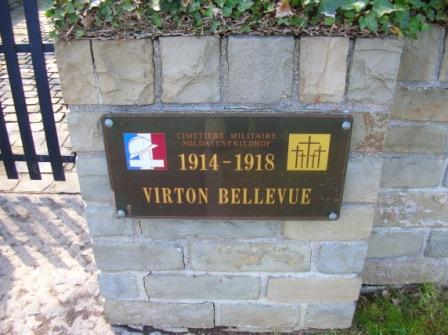
_Virton - Bellevue - cimetière militaire_
_Photo de l’auteur_

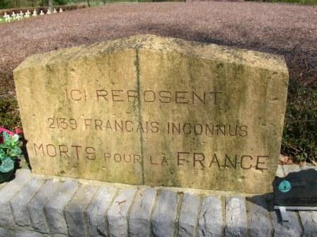
_Virton - Bellevue - ossuaire français_
_Photo de l’auteur_

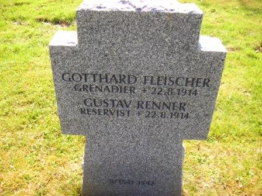
_Virton - Bellevue - tombe d’un grenadier allemand_
_Photo de l’auteur_

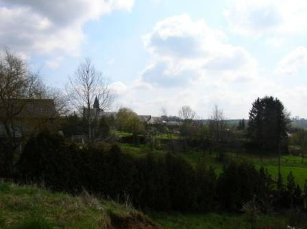
_Robelmont - vue du ravin de Berchiwé_
_Photo de l’auteur_

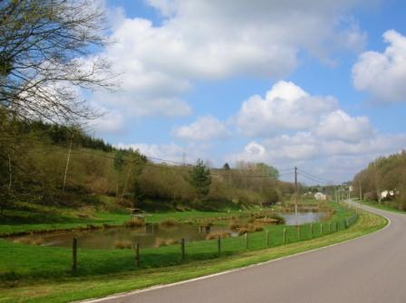
_Robelmont - route entre Bellevue et Robelmont_
_Photo de l’auteur_

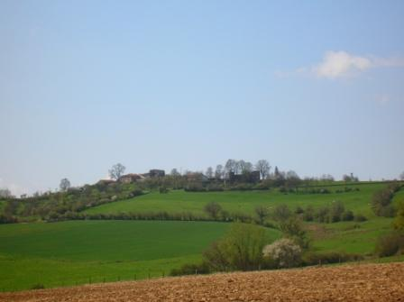
_Montquintin - vue générale_
_Photo de l’auteur_
