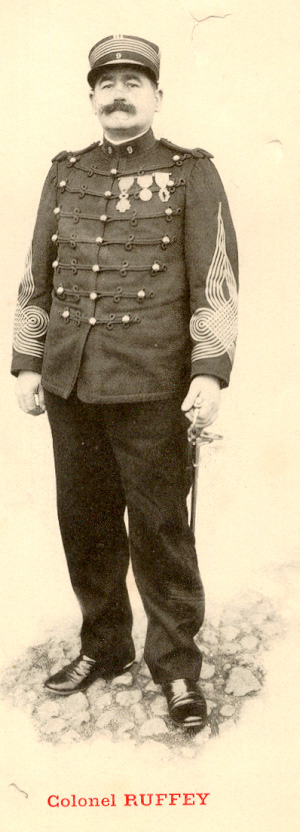
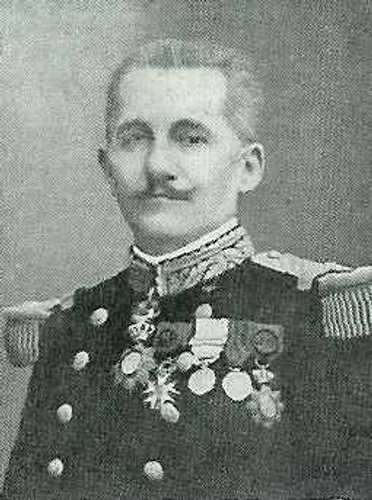
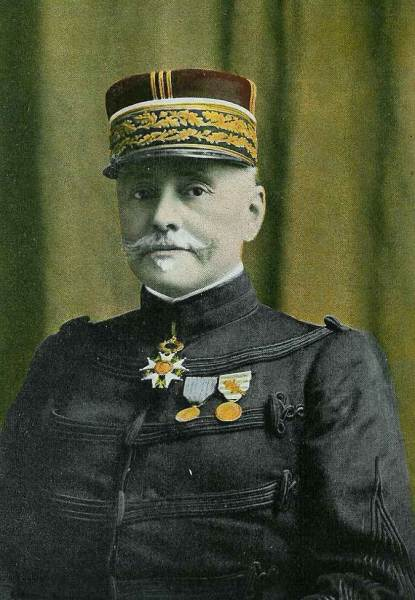
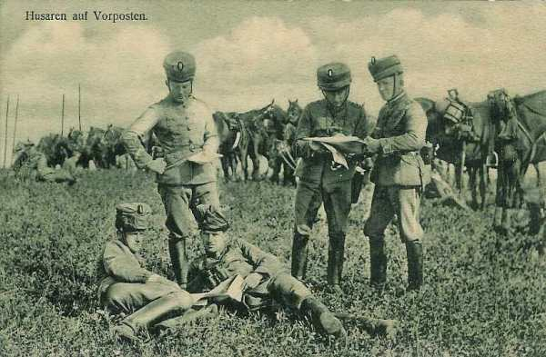
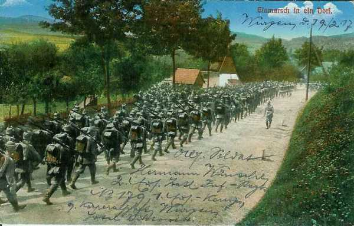
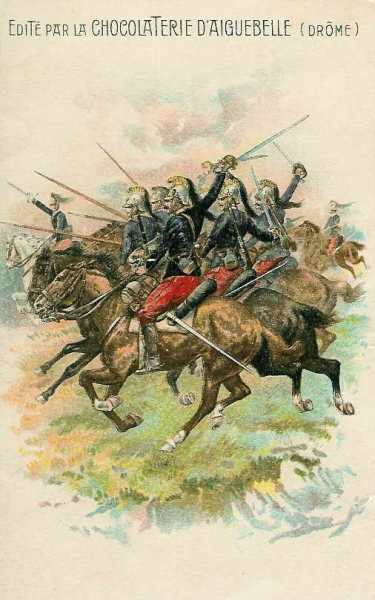
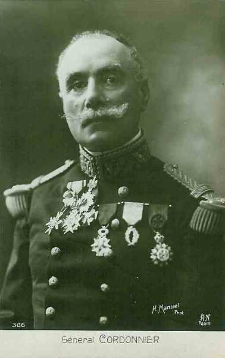

# Combat de Mangiennes (10 août 1914)

La cavalerie de la Ve armée allemande explore la région au nord de Verdun en avançant vers l’ouest. Une rencontre se produit avec les troupes françaises qui viennent de se déployer dans la région. Le village de Mangiennes est âprement disputé.

### Les forces en présence

Seules sont reprises les divisions ayant participé au combat.

**Armée française**

**IIIe armée française (général Ruffey)**

_Général Ruffey (IIIe armée)_

4e C.A. (général Boëlle) : ce C.A. constitue la gauche de la IIIe armée et est en liaison avec le 2e C.A. (IVe armée)

_Général Boëlle (4e C.A.)_
_La guerre du droit_

7e division (général de Trentinian)

_Général de Trentinian_

| Unité       | Commandant | Régiments                                                                                                                                           |
| ----------- | ---------- | --------------------------------------------------------------------------------------------------------------------------------------------------- |
| 13e brigade | Lacotte    | 101e R.I. (Dreux, Saint-Cloud / Farret)102e R.I (Chartres, Paris / Valentin)14e régiment de hussards (Alençon / de Hautecloque)26e R.A.C. (Le Mans) |
| 14e brigade | Félineau   | 103e R.I. (Alençon, Paris / Cally)104e R.I. (Argentan, Paris / Drouot)14e régiment de hussards (1 escadron) (Alençon / de Hautecloque               |

La 7e division rejoindra la VIe armée (Maunoury) et sera transportée dans les célèbres taxis de la Marne vers Nanteuil-le-Haudouin.

8e division (général de Lartigue)

| Unité       | Commandant | Régiments                                                                                                                                                                                                           |
| ----------- | ---------- | ------------------------------------------------------------------------------------------------------------------------------------------------------------------------------------------------------------------- |
| 15e brigade | Chabrol    | 124e R.I. (Laval / Fropo)130e R.I. (Mayenne / Laffargue)                                                                                                                                                            |
| 16e brigade | Desvaux    | 115e R.I. (Mamers / Gazan)117e R.I. (Le Mans / Jullien)31e R.A.C. (Le Mans / Wallut)14e régiment de hussards : (Alençon / de Hautecloque) (quatre escadrons actifs, deux de réserve)31e R.A.C. (Le Mans / Sabatier) |

**IVe armée française (général de Langle de Cary)**

2e C.A. (Général Gérard)

_Général Gérard_
_Collection privée_

4e division (général Rabier)

| Unité       | Commandant | Régiments                                                                                                                                                                                                  |
| ----------- | ---------- | ---------------------------------------------------------------------------------------------------------------------------------------------------------------------------------------------------------- |
| 7e brigade  | Lejaille   | 91e R.I. (Mézières / Blondin)147e R.I. (Sedan / Rémond)                                                                                                                                                    |
| 87e brigade | Cordonnier | 120e R.I. (Péronne, Stenay)9e bataillon de chasseurs à pied (Lille, Longuyon)18e bataillons de chasseurs à pied (Amiens, Longuyon)19e régiment de chasseurs à cheval (La Fère)42e R.A.C. (Stenay, La Fère) |

9e division de cavalerie (général de l’Espée)

_Général de l’Espée_

| Unité                  | Commandant   | Régiments                                                            |
| ---------------------- | ------------ | -------------------------------------------------------------------- |
| 1e brigade cuirassiers | de Cugnac    | 5e régiment de cuirassiers (Tours)8e régiment de cuirassiers (Tours) |
| 9e brigade de dragons  | de Sailly    | 1e régiment de dragons (Luçon)3e régiment de dragons (Nantes)        |
| 16e brigade de dragons | de Séréville | 24e régiment de dragons (Dinan)25e régiments de dragons (Angers)     |

**Armée allemande**

**4e C.C. : général von Hollen**

3. D.C. : général von Unger

| Unité                                 | Commandant | Régiments                                                          |
| ------------------------------------- | ---------- | ------------------------------------------------------------------ |
| 16. Kavallerie-Brigade                |            | Jäger-Regt zu Pferde Nr 7 (Trier)Jäger-Regt zu Pferde Nr 8 (Trier) |
| 22. Kavallerie-Brigade                |            | Dragoner-Regt. Nr 5 (Hofgeismar)                                   |
| Husaren-Regt. Nr 14 (Cassel)          |
| 25. Kavallerie-Brigade                |            | Garde-Dragoner-Regt. (Darmstadt),                                  |
| Leib-Dragoner-Regt. Nr 24 (Darmstadt) |
|                                       |            | Bataillon du Feldartillerie-Regt. Nr 11 (Cassel)                   |
| MG. Abtg. Nr. 2 (Trier)               |

6. D.C. : général von Schmettow

| Unité                  | Commandant | Régiments                                                                     |
| ---------------------- | ---------- | ----------------------------------------------------------------------------- |
| 28. Kavallerie-Brigade |            | Badisches Leib-Dragoner-Regt Nr 20 (Karlsruhe)Dragoner-Regt. Nr 21 (Bruchsal) |
| 33. Kavallerie-Brigade |            | Dragoner-Regt. Nr 9 (Metz)Dragoner-Regt. Nr 13 (Metz)                         |
| 45. Kavallerie-Brigade |            | Husaren-Regt. Nr 13 (Diedenhofen)Jäger-Regt zu Pferde Nr 13 (Saarlouis)       |
|                        |            | Bataillon du Feldartillerie-Regt. Nr 8 (Saarbrücken)                          |
| MG. Abtg. Nr. 6 (Metz) |

**[Lien vers carte](../img/cartemangiennes.jpg)**
C Michelin, d’après carte n° 57 édition 1940 - Autoriastion n° 05-B-18

**[Lien vers croquis](../img/mangiennes1008.jpg)**

La concentration des IIIe et IVe armées françaises s’achève sans incidents.
Le général Ruffey (IIIe armée) a installé son Q.G. à Verdun, au collège Buvignier.

Les 4e et 5e C.A., débarqués entre Lérouville et Consenvoye, gagnent les hauts de Meuse.

Les trois divisions du 6e C.A. et la 7e D.C. tiennent le secteur de couverture de la Woëvre méridionale et poussent leurs détachements avancés sur le front Conflans - Pont-à-Mousson.

Conformément à l’instruction générale n° 1 du G.Q.G., la IIIe armée doit se déployer sur le front Flabas - Ornes - Vigneulles - Saint-Beaussant, sur une distance de 70 km.

La IVe armée n’a pas encore commencé son mouvement vers la Meuse. Elle doit, selon la variante du plan XVII, s’intercaler entre les armées Ruffey (IIIe) et Lanrezac (Ve), prête à attaquer entre Argonne et Meuse. Le 17e C.A. se rapproche de l’Aisne, le 12e C.A. et le corps colonial sont encore vers Sainte-Menehould et Bar-le-Duc. Seul le 2e C.A. est sur la rive droite de la Meuse. La 4e D.C. s’oriente vers la frontière belge et est remplacée en Woëvre septentrionale par la 9e D.C. (général de l’Espée).

Dans la soirée, les ailes intérieures des IIIe et IVe armées sont en contact le long de la ligne Samogneux - Damvillers - Mangiennes. (2e et 4e C.A.)

Le général Gérard (2e C.A., IIIe armée), de son Q.G. de Sivry-sur-Meuse, a prescrit à la 4e division de tenir le front jusqu’à la hauteur de Marville. Le 19e régiment de chasseurs à cheval, regroupé à Iré-le-Sec, doit prolonger le flanc gauche du C.A. jusqu’à la Chiers.

La 4e D.I. (Général Rabier) s’installe. Son gros stationne au confluent de la Theinte et du Loison, dans la zone Peuvillers - Dombras - Dimbley - Delut - Wittarville, couvert par deux détachements qui constituent les avant-postes.

L’un d’entre eux est sous les ordres du général Lejaille, commandant de la 7e brigade, comprenant le 91e R.I. et le I/42e R.A.C. Il occupe le front de Pont-Chaudron (N.E. de Mangiennes).

L’autre détachement est commandé par le général Cordonnier, commandant de la 87e brigade et se compose du 120e R.I. et du II/42e R.A.C. Il garde l’Othain (affluent de la Meuse), de Saint-Laurent-sur-Othain à Marville.

Les 9e et 18e bataillons de chasseurs (87e brigade) ont retardé le 8 août des forces de cavalerie importantes dans la région de Longuyon et de Spincourt.

Deux détachements avancés de la 4e division s’installent sur le terrain qu’ils organisent. Le général Lejaille reçoit l’ordre de se maintenir dans la région de Villers-les-Mangiennes.

- Le terrain est partagé entre deux sous-secteurs :
    I/91e R.I. sur la rive droite du Loison.
    III/91e R.I. sur la rive gauche de la rivière.

Le I/91e R.I. organise le mamelon 260 et le III/91e creuse des tranchées pour défendre le mouvement de terrain, de la chapelle Saint-Jean au nord-est de Mangiennes.

Le II/91e est en réserve et les 5e et 8e compagnies mettent le village de Mangiennes en état de défense.

Le P.C. du colonel Blondin (91e R.I.) est à La Chapelle-Saint-Jean.

Le I/42e prend position : la première batterie défilée derrière la côte 225 (1500 m au nord de Mangiennes), les deux autres batteries 400 m en arrière.

Une division de cavalerie allemande accompagnée d’infanterie est signalée autour d’Arrancy. Le détachement Cordonnier tient les passages de l’Othain, de Saint-Laurent-sur-Othain à Marville avec les II et I/120e R.I., le II/42e cantonne à Rupt-sur-Othain.

_Hussards allemands en reconnaissance_
_Collection privée_

Le P.C. du général Cordonnier est à Delut, le général de l’Espée (9e D.C.) est à Wittarville avec l’artillerie et un demi-régiment de cuirassiers. Le gros de la brigade de cuirassiers cantonne à Dombras et Dimbley, les deux brigades de dragons sont à Sereville, Delut et autour de Merles.

Le 4e C.A. gagne ses emplacements sur le versant oriental des côtes de la Meuse. C’est le C.A. de gauche de la IIIe armée (général Boëlle).

- La 8e division (général de Lartigue) est dans la zone Damvillers - Romagne - Moirey
    La 8e division (de Trentinian) est au sud dans la zone Azannes - Ornes - Dieppe.

**En soirée**

Trois bataillons d’infanterie sont poussés aux avant-postes :

- Deux de la 8e division à Mangiennes et Billy-sous-Mangiennes.
    Un de la 7e division à Gincrey et Ornel.
  Quant au reste de la 7e division, il se trouve dans la zone Vacherauville - Brabant - Beaumont - Louvemont - Bras-Belleville - Charny - Samogneux.

Plus au sud, la 7e D.I. a poussé aux avant-postes le 102e R.I. Le 3e bataillon de ce régiment tient Gincrey - Ornel.

La 6e D.C. allemande (von Schmettow) a son avant-garde à Spincourt et Xivry-Circourt, le gros se trouvant dans la région Mandres - Domprix - Murville - Malavilliers. Elle doit poursuivre son exploration le lendemain vers Pillon.
La 3e D.C. allemande se trouve plus à l’ouest aux environs de Mercy-le-Bas et doit explorer le lendemain vers Longuyon, en vue de franchir l’Othain.

**18h :**

Le colonel Laffargue (130e) reçoit l’ordre de la 8e division de partir avec deux bataillons, pour occuper Mangiennes et Billy. Le régiment doit effectuer une marche de nuit de 10 km.

La 9e D.C. (général de l’Espée) passe la nuit dans la région de Vittarville, Dombras, Merle. Elle a reçu l’ordre du général de Langle de Cary (IVe armée) de soutenir la droite du 2e C.A.

**Minuit :**

Le 1e bataillon du 130e arrive à Mangiennes.

### 10 août

Le 14e hussards a été cantonné le 9 au soir à Azannes et doit rechercher le contact avec les colonnes allemandes vers Arrancy et Longuyon. Le colonel de Hautecloque est à la tête de ce régiment depuis le 8 août.

**04h :**

De Hautecloque envoie un peloton à Mangiennes et un autre à Billy.

**04h45 :**

Le peloton du 14e hussards traverse Mangiennes, puis se dirige sur Pillon. Bientôt, une forte colonne allemande est signalée, descendant vers Châtillon-sur-Othain. Sur l’ordre du colonel, les mitrailleuses sont mises en batterie à la cote 267 puis ouvrent le feu à 1500 m sur la tête de colonne allemande qui pénètre dans Pillon. L’infanterie allemande se déploie aussitôt et cherche à progresser, appuyée par le feu de mitrailleuses et le tir d’une batterie située au nord-est de Sorbey.

Les 1e et 2e bataillons du 102e quittent Beaumont et Louvemont et marchent sur Billy et le Loison avec pour mission de relever à Billy le II/130e R.I.

**6h :**

La 6e D.C. allemande se rassemble aux environs de Xivry-Circourt puis progresse par Saint-Supplet - Arrancy vers Pillon.

**07h :**

Le colonel Blondin et le colonel Laffargue décident que Mangiennes restera défendu par le bataillon Beslay et que le bataillon de Busserolles s’établira plus au sud (cote 222).

Le général de l’Espée (9e D.C.) reçoit des renseignements :

- Une brigade de cavalerie a été vue à 6h45, arrêtée entre Villette et Colmey.
    Une colonne d’infanterie est en marche de Pierrepont sur Arrancy.

Le général de l’Espée réunit sa D.C. au nord-est de Jametz avec l’intention de la porter soit vers Marville, soit vers Iré-le-Sec.

**07- 09h :**

Une série de renseignements très précis signalent qu’une colonne allemande approche de Pierrepont, marchant sur Arrancy. Sorbey est occupé par de l’infanterie allemande.

**8h :**

Le 6e D.C. allemande atteint la ferme de Constantine. D’après ses renseignements, les Français tiennent la coupure du Loison depuis Billy jusqu’à Villers-lès-Mangiennes et occupent les villages avec de l’infanterie retranchée. Von Schmettow prescrit à l’avant-garde de s’emparer de Pillon. Un premier combat se déroule à hauteur de Pillon entre le 14e hussards français et des éléments des 13e et 9e dragons et la 4e compagnie du 5e bataillon de chasseurs à pied allemands.

**08h40**

La 9e brigade de dragons fait connaître que le bois de Rafour et celui de Belchêne sont occupés par les Allemands. Une colonne importante d’infanterie allemande marche de Pierrepont sur Arrancy.

**09h :**

De Hautecloque (14e hussards) décide de ne pas se laisser accrocher et revient dans les lignes françaises par le Bois-Brûlé. Il fait prévenir le 130e R.I. de l’avance allemande.

Pendant ce temps, deux escadrons du 3e dragons (6e D.C. allemande) sont partis de Merles et se dirigent sur Sorbey et Pillon. Ils sont reçus à coups de fusil aux lisières du bois de Belchêne.

L’infanterie allemande parvient à entrer à Pillon. Le général von Etzel, commandant de l’avant-garde, exécute une reconnaissance personnelle à la cote 267. Il domine le glacis qui descend vers Mangiennes et le nord de la vallée du Loison. Il aperçoit des tranchées le long de la route Mangiennes - Azannes (91e R.I.). La conviction du général est faite : il a devant lui un adversaire en force, installé sur des positions défensives. Pour l’attaquer, il faut franchir un terrain défavorable : le glacis qui descend vers le Loison. Toutefois, le général von Hollen lui prescrit de poursuivre le mouvement hardiment. Le général von Etzel est chargé d’enlever Mangiennes.

_Colonne d’infanterie allemande_
_Collection privée_

**09h15 :**

Quelques obus éclatent à 500 m au nord-est de la position du Calvaire devant le I/91e R.I. Le colonel Laffargue envoie à son 2e bataillon à Billy l’ordre de le rejoindre à Mangiennes ; au I/130e, la 2e compagnie est poussée sur la rive droite du Loison mais elle ne progresse pas longtemps : dès qu’elle approche de la crête 244, elle est prise à partie par un feu de mitrailleuses. L’infanterie allemande reste invisible.

**09-10h :**

Les unités des 4e et 2e C.A. détachées aux avant-postes entre le Loison et l’Othain sont au courant de l’approche des Allemands.

**11h :**

Le général de Lartigue (8e D.I.) a été prévenu à son Q.G. de Moivrey que les Allemands attaquent Mangiennes. Il prescrit au 31e R.A.C. de pousser en avant une batterie pour appuyer les deux bataillons du 130e.

Le II/102e arrive à Billy et libère le bataillon Fadat. La ligne de surveillance s’étend de la corne sud du bois de Warpemont - Muzeray - Bois de la Viccourt - Bois-le-Prêtre. Le colonel Valentin (102e), vu la présence d’une importante cavalerie ennemie, ordonne au commandant du 2e bataillon de prendre position sur le mamelon de la cote 232, à l’ouest de Billy.

**11h15 :**

Des éléments de cavalerie allemande sont signalés au nord-ouest de Longuyon. Les ponts de la Chiers à Charancy et Noërs sont occupés par les Allemands ainsi que le hameau de Petit-Xivry. Ces mouvements font pressentir le débouché d’une attaque allemande sur le plateau entre la Chiers et l’Othain.

Le général de l’Espée décide de se porter sur Marville et monte sur le plateau entre l’Othain et la Chiers. A ce moment, le général de l’Espée apprend que deux régiments de cavalerie sont à l’est du bois de Lagrange, en marche vers le sud. Il décide de les attaquer et prend ses dispositions :

L’artillerie prendra position sur les pentes ouest du mamelon 288 et ouvrira le feu sur les pentes du bois de Lagrange, appuyée à gauche par les cuirassiers, mais le bois de Lagrange est déjà occupé et des coups de feu partent des lisières. Le général de Séréville fait attaquer le bois par le 24e dragons et le groupe cycliste tentera de le déborder par le nord-est. Trois escadrons du 24e dragons chargent sur la corne sud-est du bois, mais sont arrêtés par un fossé et ne peuvent y pénétrer.

_Charge de dragons_
_Collection privée_

Le groupe d’artillerie à cheval envoie des obus sur les pentes qui remontent vers la ferme Bouillon. La 9e D.C. essaie de pousser sur Longuyon, mais dès que le 24e dragons approche du Petit-Xivry, il est battu par des mitrailleuses et doit se retirer derrière la cote 312.
Le général de l’Espée se trouve face à une ligne de feu entre Charency - le bois de Lagrange - Flabenville - Petit-Xivry - Noërs. Il se replie vers Marville par échelons.

**11h30 :**

L’artillerie allemande lance encore quelques obus, puis le combat cesse progressivement.

**13h :**

Le général Cordonnier (87e brigade) perçoit une forte canonnade dans la direction de la brigade Lejaille : il s’agit de l’attaque de Mangiennes. Il alerte immédiatement le III/120e et le 9e B.C.P.

_Général Cordonnier (3e div. 2e C.A.)_
_Collection privée_

**13h30 :**

Une volée d’obus s’abat sur les I et II/130e et sur la croupe 222. Les projectiles semblent provenir de la région de la cote 267 (ouest du bois de Saint-Médard) La surprise des Français est complète. Très vite, les officiers rallient leurs unités et s’établissent sur le mouvement de terrain 222. L’artillerie allemande est contrebattue par le I/42e R.A.C. en surveillance près de la Chapelle Saint-Jean. Une batterie allemande placée à découvert entre la grand ‘route et le bois de Saint-Médard est écrasée : un caisson saute et les servants se sauvent à toutes jambes dans les bois.

Une autre batterie allemande est démasquée à la cote 267, à la lisière du bois de Grand-Chanel et est réduite au silence. Seule la 3e batterie ne peut être repérée : elle tire sur le III/91e R.I., sur Mangiennes.

- La situation dans la région de Billy est la suivante :
    La 5/102e R.I. tient les lisières nord et est du village de Billy.
    La 8/102e R.I. a un peloton sur la route de Billy à Muzeray et un autre peloton sur la route de Billy à Vaudoncourt, sur la rive gauche du Loison. Les 7e et 8e compagnies du 102e tiennent le mamelon 232.

Le général de Trentinian (7e D.I.) a poussé un bataillon du 101e au Haut-Fourneau pour appuyer éventuellement le 102e. Bientôt, les défenseurs de la cote 232 aperçoivent un gros de cavalerie sur la route de Pillon à Billy. La 7e compagnie ouvre le feu et force les cavaliers à se replier, mais des obus paraissant parvenir du bois de Brunehaut battent la région et suivent les mouvements du 1e bataillon qui marche vers le Loison.

L’attaque des chasseurs allemands de la 6e D.C. se déclenche. Dès qu’ils franchissent la crête, ils sont accueillis par des obus, puis par une grêle de balles. Les chasseurs progressent dans les avoines et parviennent à se rapprocher à quelques centaines de mètres de Mangiennes. De son côté, la 33e brigade de cavalerie a essayé de contourner le bois du Grand-Chanel par le nord ; le 9e dragons met pied à terre, mais les tirailleurs ne peuvent déboucher du Bois Brûlé. Une batterie, qui suit les chasseurs, est anéantie.

Le général Von Schmettow appelle à son secours la 3e D.C. Le détachement de mitrailleuses est poussé vers la croupe 244. Il repousse une attaque du 130e R.I. français.

**14h :**

Plusieurs compagnies d’infanterie allemande se glissent le long de la lisière nord du bois de Grand-Chanel.
Sur l’ordre du général Lejaille, le I/42e R.A.C. bat cette lisière. Les Allemands se replient vers le nord-est, mais presque en même temps, on voit des tirailleurs allemands descendre la pente vers le Loison : une attaque sur Mangiennes se dessine. Un combat de feux se poursuit sur la croupe 222.

Le général Cordonnier (87e brigade) ordonne au III/130e de quitter Delut et de porter deux compagnies à La Croix-Mathias pendant que les deux autres gagneront la région de la cote 246, sur la route de Dombras à Grand-Failly. Le général gagne rapidement la cote 270 à cheval. Comme le calme règne à Marville et à Petit-Failly, Cordonnier décide de prélever le plus de forces possible pour les faire affluer dans la zone de bataille : un bataillon à Dombras et deux batteries du II/42e.

**15h :**

Malgré la perte d’une partie de ses batteries, l’infanterie allemande poursuit son attaque, progresse à cheval sur la grand ‘route et approche de Mangiennes. Les obus pleuvent sur Mangiennes et le II/91e R.I. Bientôt, une première ligne de tirailleurs allemands n’est plus qu’à quelques centaines de mètres du village et une deuxième ligne se montre sur la crête 267 (1200 m au sud de Pillon) et enfin, six mitrailleuses ouvrent le feu sur le bataillon Beslay. Quelques groupes d’infanterie allemande commencent à atteindre la lisière nord-est du village.

Les 9e et 10e compagnies du 120e (87e brigade) arrivent à la corne nord du bois de Marville. Le général Cordonnier ordonne à ces compagnies de longer la lisière orientale du bois.

**16h :**

Des mitrailleuses allemandes semblent embusquées dans le ravin boisé situé au sud de la cote 244. Elles ouvrent un feu violent, prennent en écharpe les compagnies du 130e et leur font subir des pertes élevées en quelques minutes. Vu l’impossibilité de contrebattre
efficacement ces armes automatiques, le colonel Laffargue décide de se replier vers la sortie sud-ouest de Mangiennes pour rejoindre le II/91e R.I.

Les deux compagnies (5e et 7e) défilent en arrière des unités engagées du bataillon de Busserolle. Dès que les hommes du 1e bataillon voient leurs camarades s’approcher, ils croient que ces compagnies viennent les renforcer. Enervés par une pénible attente sous les balles, ils croient que le moment de l’assaut a sonné, mettent la baïonnette au canon et s’élancent à l’attaque, suivis des compagnies du bataillon Fadat (130e R.I.).

Bientôt, les deux bataillons chargent en formation très dense un adversaire invisible posté à près de 1000 m de distance. Ils doivent traverser le Loison, ce qui constitue un obstacle presque infranchissable.

Dès que les deux bataillons apparaissent en pleine vue sur la crête, le feu allemand redouble d’intensité. En quelques instants, les pertes françaises sont énormes. Seule une centaine d’hommes parviennent à la rive du Loison.

La charge héroïque a complètement échoué et le commandant Busserolle fait sonner « au drapeau » pour rallier les survivants Les débris du 130e se reconstituent en arrière de la crête 222.

La retraite est couverte par le 14e hussards et protégée par le III/31e R.A.C. (cote 209).

La 45e brigade de cavalerie allemande est chargée d’enlever Billy. Le 13e hussards est déployé à pied, de même que le 13e chasseurs à cheval. Les tirailleurs de ces deux régiments gagnent les lisières du bois de Rappes et de Warphemont, face à Billy, mais sont cloués au sol.

Les 2e, 3e et 4e escadrons du 13e chasseurs essaient d’attaquer Billy à cheval sans succès : la charge doit faire demi tour.

Répondant à la demande du général von Etzel, la 28e brigade de cavalerie est engagée : le 21e dragons et les 1e et 2e escadrons du 20e dragons se déploient pied à terre, au nord du Grand Chanel avec pour mission d’attaquer Villers-lès-Mangiennes. Toute la 6e D.C. est ainsi engagée.

**16h20 :**

Le général Cordonnier décide de ne laisser sur le front de couverture au nord de Saint-Laurent que cinq compagnies du 120e. Avec toutes les troupes disponibles, il s’apprête à attaquer en direction de Saint-Laurent - Pillon, dans le flanc droit et sur les arrières des Allemands qui assaillent Mangiennes. Apercevant des mouvements à la lisière du Grand-Chanel, Cordonnier prescrit d’ouvrir le feu sur cet objectif.

**16h30 :**

Le colonel Blondin est sans nouvelles de son 2e bataillon. Il apprend que la compagnie de droite du 91e a dû esquisser un mouvement rétrograde vers les bois. Le repli du 2e bataillon coïncide avec l’échec sanglant du 130e.

La retraite de ce dernier régiment découvre la droite du 91e.

Subitement, la compagnie de mitrailleuses allemandes se tait : l’artillerie française a dû atteindre les pièces. L’infanterie allemande s’arrête puis remonte en toute hâte vers le Grand-Chanel. Le colonel Blondin griffonne un ordre au 2e bataillon : tenez bon, l’infanterie allemande devant vous se replie. Le commandant Beslay ramène le 2e bataillon en avant et rentre dans Mangiennes.

_Batterie de 75_
_Collection privée_

Le renversement de situation est dû à l’initiative qu’a prise le général Cordonnier (87e brigade). Il commande le secteur de couverture qui prolonge au nord celui du détachement du général Lejaille, le long de l’Othain. Il dispose du 120e R.I. (lieutenant colonel Mangin) et du II/42e d’artillerie (capitaine Michelet).

Le secteur tenu par les troupes du général Cordonnier est étendu : 6 km depuis Saint-Laurent-sur-Othain jusqu’à Petit-Failly. Il se relie au nord à celui de la 3e D.I.
La position de résistance a été reportée en arrière de l’Othain, à l’ouest de la route Saint-Laurent-sur-Othain - Marville, sur la contre-pente des mamelons 270 et 277.

**16h45 :**

La 6e batterie du 42e R.A.C. a pris position et ouvre le feu à 4500 m. Le premier coup éclate en plein dans le but : le 21e dragons allemand, surpris pied à terre, perd en quelques minutes la moitié de son effectif.

Sur ordre du général Cordonnier, l’attaque du 120e débouche de Saint-Laurent, en direction de Pillon. Elle a pour but de menacer la ligne de retraite des Allemands.

**17h :**

La 9e D.C. a regagné Marville sur l’Othain, puis Jametz. L’engagement de 11h15 a montré que la ligne de la Chiers est solidement tenue par les Allemands (7e et 8e chasseurs à cheval de la 3e D.C. allemande), mais elle a empêché la 3e D.C. allemande d’inquiéter la 4e division.

La 6e D.C. allemande est dans une situation critique. Von Schmettow doit donner l’ordre de retraite générale.
17h50 :
L’attaque allemande sur Mangiennes semble faiblir.

**18h :**

Le général de Lartigue est avisé que les deux bataillons du 130e, très éprouvés, se retirent dans les bois au sud-ouest de Mangiennes sans être poursuivis.

Les pertes de ces deux bataillons sont considérables : 15 officiers et plus de 700 hommes. Les Allemands ne tentent pas de descendre de la crête 244 vers le Loison.

**18h30 :**

Le 120e R.I. charge et pénètre dans le bois du Grand-Chanel. Les Allemands s’enfuient vers Pillon. Le lieutenant-colonel Mangin reçoit l’ordre de se replier sur Saint-Laurent. Le terrain au nord du bois de Grand-Chanel est jonché d’Allemands. L’attaque n’a coûté que trois blessés du côté français, car elle a été appuyée par l’artillerie et une section de mitrailleuses : le 120e a progressé sous la protection des obus et des balles et s’est avancé dans le dos de l’adversaire.

Au sud, le 130e, au contraire, a attaqué de front un ennemi posté sans disposer d’aucun appui de feu. L’attaque du lieutenant-colonel Mangin a dégagé les défenseurs de Mangiennes et apporté la décision de la journée.

**En fin de journée :**

- Au cours de la journée du 10, quatre actions distinctes se sont développées sans aucune liaison entre elles sur un front de +- 20 km entre Billy (sud) et le plateau de Marville (nord).
    Par la 7e D.I. (102e, 101e R.I., 26e R.A.C.)
    Par la 8e D.I. (130e, 31e R.A.C.)
    Par la 4e D.I. (91e R.I.)
    Par la 9e D.C.

Les deux bataillons du 130e se sont repliés vers Romagne-sous-les-Côtes.

Le 91e R.I. a occupé Mangiennes entre 17h et 18h. Les troupes ont l’impression d’avoir remporté une victoire et auraient voulu poursuivre les Allemands.

### 11 août

**01h :**

La 45e brigade de cavalerie allemande s’arrête à Mercy-le-Bas et les 28e et 33e brigades gagnent Joppecourt. Les chasseurs à pied ont quitté les derniers le champ de bataille.

**02h45 :**

Le G.Q.G. ordonne aux IIIe et IVe armées de régler entre les 4e et 2e C.A. une attaque pour reprendre Mangiennes, qu’il s’imagine à tort avoir été perdu.

En conséquence, le général Ruffey donne ordre au 4e C.A. de reprendre Mangiennes, et alerte la 42e division du 6e C.A., mais ce n’est que dans le courant de la nuit que Ruffey apprend que le 91e R.I. tient toujours Mangiennes. Les Allemands se sont repliés vers l’est et ont également abandonné Spincourt. Ils sont poursuivis par l’artillerie française, évacuent le Grand-Chanel et rejoignent Mercy-le-Bas.

Les pertes allemandes ont dépassé 450 hommes dont 226 rien que pour le 5e bataillon de chasseurs.

La 6e D.C. ne bougera plus de la région de Mercy-le-Haut avant le 21 août (veille de la bataille de Longwy).

### Conclusion :

La position de Mangiennes a pu être conservée grâce à la manoeuvre du général Cordonnier visant à attaquer les Allemands de flanc.

Au 4e C.A. français, les pertes sont lourdes : le 130e a attaqué à la baïonnette mais s’est ébranlé à plus de 1 km de distance des Allemands, sans aucun appui d’artillerie et sous le feu des mitrailleuses.

Le combat de Mangiennes et d’autres combats du début de la campagne amènent Joffre à diffuser le 16 août la communication suivante :

« Il importe de savoir attendre l’appui de l’artillerie et d’empêcher les troupes de s’exposer hâtivement au feu de l’adversaire.
L’artillerie doit être mise en batterie aussi nombreuse que possible dès le début de l’engagement. Les attaques seront d’autant plus foudroyantes, d’autant moins meurtrières qu’elles auront été préparées avec plus de soin. »
