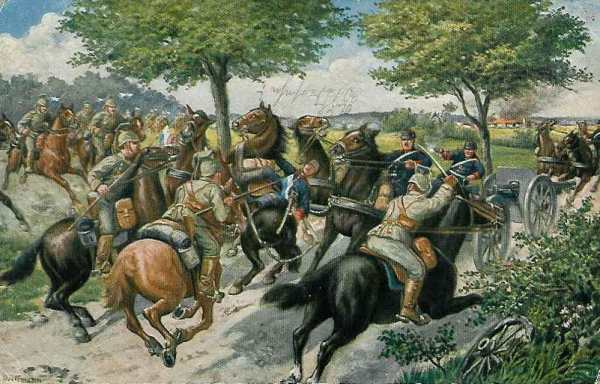
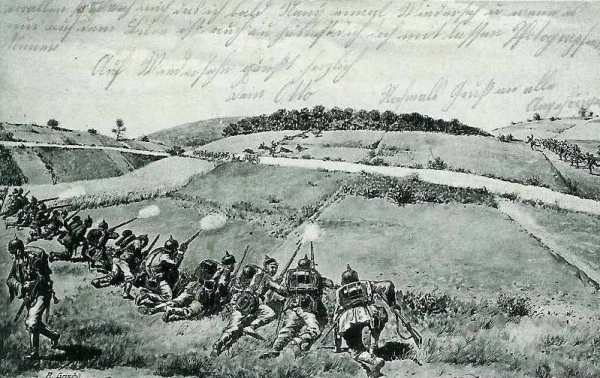
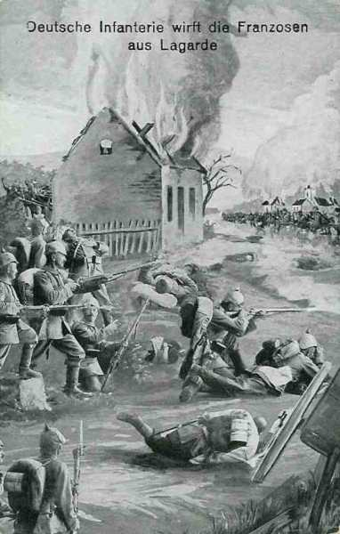
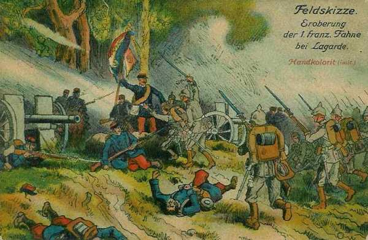
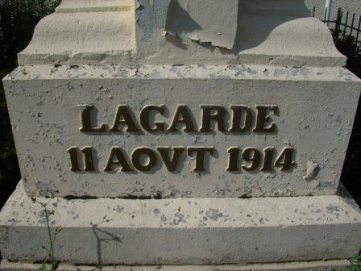
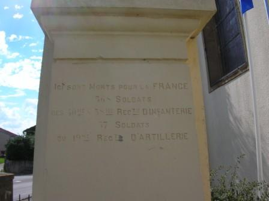
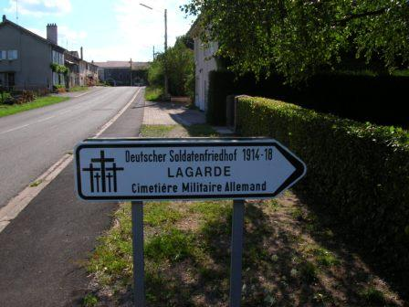
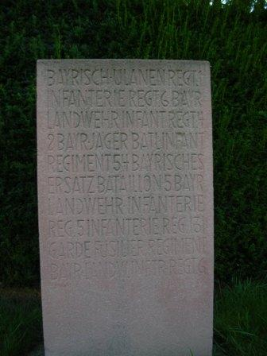
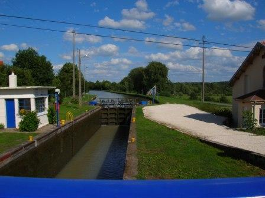

# Combat de Lagarde (10 - 11 août 1914)

Le combat de Lagarde est un des premiers combats de la guerre de 1914 - 1918. A cette époque, Lagarde fait partie de l’empire allemand. Deux bataillons de la 59e brigade doivent s’emparer de la localité, alors que la concentration de la IIe armée n’est pas encore terminée.

### Les forces en présence

**Armée française**
15e C.A. (général Espinasse)

29e D.I. (général Carbillet)

| Unité       | Commandant | Régiments                                                                                                                                  |
| ----------- | ---------- | ------------------------------------------------------------------------------------------------------------------------------------------ |
| 57e brigade | Tocanne    | 111e R.I. (Antibes / Perrier)112e R.I. (Toulon / Garnier)                                                                                  |
| 58e brigade | Gasquy     | 3e R.I. (Hières-Digne / Dulys)141e R.I. (Marseille / Chartier)6e hussards (un escadron) Uzac55e R.A.C. (trois groupes) (Orange / Bertrand) |

30e D.I. (général Colle)

| Unité       | Commandant | Régiments                                                                                                                        |
| ----------- | ---------- | -------------------------------------------------------------------------------------------------------------------------------- |
| 59e brigade | Marilier   | 40e R.I.(Nîmes / Oddon)58e R.I. (Avignon / Jaguin)                                                                               |
| 60e brigade | Morgain    | 55e R.I. (Aix-en-Provence / Valdant) \_ 61e R.I. (Aix-en-Provence / Leblanc)6e hussards (un escadron)19e R.A.C. (Nîmes / Falque) |

2e D.C. (général Lescot)

| Unité                          | Commandant         | Régiments                                                                       |
| ------------------------------ | ------------------ | ------------------------------------------------------------------------------- |
| 2e brigade de cavalerie légère | de Contades Gizeux | 17e régiment de chasseurs (Prax)18e régiment de chasseurs (de Clermont Tonerre) |
| 2e brigade de dragons          | Chevillote         | 8e régiment de dragons (de Gastines)31e régiment de dragons (Dezaunay)          |

Groupe cycliste du 2e bataillon de chasseurs à pied (Pighetti)
8e R.A.C. (3 batteries)

**Armée allemande**
21e C.A. (général von Below)

41e division (von Bredow)

| Unité       | Commandant | Régiments                                                                                                                                   |
| ----------- | ---------- | ------------------------------------------------------------------------------------------------------------------------------------------- |
| 59e brigade | von Wurmb  | Oberrheinisches Infanterie-Regiment Nr. 97 (Saarburg / von Berger)Unter-Elsässiches Infanterie-Regiment Nr. 138e (Dieuze / von Friedenburg) |
| 65e brigade |            | Infanterie-Regiment Nr. 17 (Mörchingen / von Estorff)Lothringisches Infanterie-Regiment Nr. 131 (Mörchingen / Neubaur)                      |

7e régiment de dragons.

| Unité                         | Commandant | Régiments                            |
| ----------------------------- | ---------- | ------------------------------------ |
| 42e brigade de Feldartillerie | Krahmer    | 8e, 15e régiments de Feldartillerie. |

2e C.A. bavarois (général von Martini)

3e division (général von Breitkopf)

| Unité      | Commandant   | Régiments                                       |
| ---------- | ------------ | ----------------------------------------------- |
| 3e brigade | Karl theodor | 3e chevauléger (von Tauffkirchen zu Guttenberg) |

4e division (général von Montgelas)

| Unité      | Commandant  | Régiments                                                                                                                        |
| ---------- | ----------- | -------------------------------------------------------------------------------------------------------------------------------- |
| 4e brigade | von Redwitz | 1e régiment de uhlans bavarois (von Crailsheim)2e régiment de uhlans bavarois (von Faber)2e bataillon de chasseurs (Lettenmayer) |

### 30 juillet

Le 30 juillet se déroule une des premières mesures prévues par le plan XVII : les opérations de couverture de la frontière. Celle-ci est assurée par des éléments du 20e C.A. et la 2e D.C. dans le secteur de la basse Meurthe. La mission de ces unités est d’assurer la protection du débarquement des armées. L’infanterie procède à l’organisation du terrain pendant que la cavalerie entreprend des explorations. Le passage de la frontière allemande est interdit afin que la France laisse la responsabilité de l’agression à l’empire allemand.

### 31 juillet

Les réservistes allemands sont rappelés et le pont du canal est coupé à Lagarde.

### 1e août

C’est le premier jour de la mobilisation. La 2e D.C. occupe la région de Lunéville - Einville.

### 3 août

L’Allemagne déclare la guerre à la France.

### 6 août

**Du côté français**

Castelnau prend le commandement de la IIe armée et les premières unités de la 30e division (15e C.A.) arrivent dans la région de la Basse Meurthe.

### Du côté allemand

Le 21e C.A. est rassemblé dans la région de Château-Salins et Dieuze.

### 7 août

La 59e brigade (40e et 58e R.I.) est rattachée à la 2e D.C.

### 10 août

L’E.M. du 138e R.I. allemand arrive à Lagarde. Une section se dirige vers le Bois Chanal.

La 2e D.C. est en charge de la couverture entre la Seille et le Sanon. Le général Lescot donne l’ordre de s’emparer, à la chute du jour, du village de Lagarde, situé le long du canal de la Marne au Rhin. Les deux bataillons marcheront de part et d’autre du canal. Le 19e R.A.C. apportera son appui à l’infanterie. Le 2/40e attaquera par le sud et le 3/58e par le nord.

**16h30**

Les troupes se mettent silencieusement en marche, traversent Parroy et sont dissimulées partiellement par la forêt de Parroy, qui longe le canal. Des patrouilles sont poussées vers Xures.

**19h**

La marche devient pénible à la tombée du jour, les fantassins devant marcher dans des champs d’avoines ou des prairies marécageuses.

**19h30**

Quelques coups de feu éclatent. Les compagnies se déploient. Les pièces françaises ouvrent le feu en direction de Lagarde et les Allemands, menacés car en infériorité numérique, se retirent du village.

**20h**

Le tir d’artillerie française cesse et les compagnies sont prêtes à pénétrer dans le village. Il faut plus d’une heure pour dégager les obstacles disposés par les Allemands. Le chef du bataillon Bertrand installe son PC dans la mairie et donne les ordres nécessaires pour la surveillance des points sensibles. Les lisières du village sont aussitôt occupées et les hommes fouillent les maisons.
La 9e compagnie, couvrant la partie nord et nord-est, creuse des tranchées ; la 12e compagnie, au nord-ouest, dresse une barricade.

Les villageois signalent que des forces allemandes importantes sont cachées dans les bois et aux environs de Bourdonnay. Il faudra s’attendre à une riposte.

**En soirée**

- Le général von Stetten, commandant de la D.C. bavaroise et le général von Bredow, commandant de la 42e division décident de reprendre Lagarde.
  La manoeuvre retenue est d’attaquer les Français à la fois par le nord (Bois de la Garenne) et par le sud (Bois Chanal). Les deux attaques doivent couper la ligne de retraite vers l’ouest, le pont de Xures, 1200 m à l’ouest de Lagarde. L’attaque est prévue pour 09h.
  Les unités chagées d’attaquer le village sont
    Le 2e Jäger Batalion
    Le 138e R.I., soutenu par six mitrailleuses.
    Le 131e R.I., accompagné d’une section de mitrailleuses.

### 11 août

**3h30 :**

- Le 1e groupe du 19e R.A.C. se met en route avec ses batteries pour soutenir les deux bataillons qui se trouvent à Lagarde. Deux positions sont fixées pour le tir derrière la cote 283 :
    La 1e batterie en direction de la position probable de l’artillerie allemande (Bourdonnay).
    La 2e batterie à la lisière de la forêt de Parroy.
    La 3e vers le bois Chanal.

Les batteries sont poussées assez près du village et pourraient être victimes d’une attaque par l’infanterie allemande.

**06h :**

Le général de Castelnau, dans l’instruction particulière n° 8 adressée au commandant du 15e C.A., prescrit d’éviter tout engagement inutile et recommande notamment de ramener à deux compagnies le détachement qui occupe Lagarde.

**07h :**

Un avion allemand, puis un deuxième survolent les positions françaises.

**10h :**

Les artilleurs français voient surgir, venant du nord, l’infanterie allemande, à mois de 100 m de la 1e batterie. La batterie pointe ses pièces mais subit immédiatement un feu si dense que les servants sont décimés.
La 3e batterie tire des salves sur l’infanterie allemande, lui causant des pertes, mais l’artillerie allemande ouvre le feu et l’infanterie crible les servants de balles.

**10h30 :**

Les quatre escadrons du régiment de uhlans chargent l’un après l’autre vers la 11e compagnie mais ne peuvent rien contre le feu de l’infanterie française et se font massacrer.

_Prise d’une batterie française par des uhlans_
_Collection privée_

**10h45 :**

Les pièces françaises des 1e et 3e batteries sont devenues muettes. Le commandant de la 2e batterie cherche, en arrière, une position, au sud de la cote 276, mais, sur ces entrefaites, un officier de liaison transmet l’ordre de se replier à l’ouest de Parroy. Le rôle de l’artillerie est terminé. Les Français ont perdu une dizaine de pièces.

**10h50 :**

Le chef du 3e bataillon donne l’ordre de retraite et les sections se replient vers le pont de Xures, mais celui-ci se trouve sous le feu du 131e R.I. allemand au nord, et du 138e R.I. au sud du canal.

_Combat du Unter-Elsässisches Infanterie-Regiment Nr. 138_
_Collection privée_

L’artillerie allemande continue à bombarder l’intérieur du village de Lagarde. Au sud, l’infanterie allemande débouche du bois de la Garenne. Une section de mitrailleuses françaises réussit à l’arrêter, mais les munitions commencent à s’épuiser.

_Combat de Lagarde_
_Collection privée_

**11h :**

Les fractions allemandes continuent à s’infiltrer et les chasseurs bavarois ne sont plus qu’à 300 - 400 m du village. Les mitrailleuses allemandes sont installées à la lisière du bois Chanal et provoquent des pertes importantes, mais l’infanterie allemande continue à être tenue en respect : chaque fois qu’elle réussit à atteindre le chemin de halage, elle est repoussée. Il s’ensuit un échange de coups de fusil de part et d’autre du canal.

_Combat de Lagarde_
_Collection privée_

Le combat se déplace vers la sortie ouest du village où une ligne de résistance est établie. La section de mitrailleuses du 40e R.I. prend position à la sortie ouest du village. Les hommes se glissent le long des maisons, balayées par les balles.

Les uhlans tentent une seconde charge : un flot de cavalerie déferle vers la mairie, mais tombe sous le feu français : c’est un véritable carnage pour les hommes et les chevaux. Les quelques survivants tournent bride. L’infanterie allemande, en provenance de la route de Bourdonnay, parvient au cœur du village, qui devient intenable pour les Français.

**Conclusion**

Le bilan pour l’armée française est lourd : 526 hommes de la 2e armée tués, ce qui aboutit au limogeage du général commandant la 2e D.C. par le général de Castelnau.

Le compte rendu envoyé au Q.G. rapporte les événements de la journée :
« Les deux bataillons envoyés hier soir 12 août par le commandant de la 2e D.C. à Lagarde, ont été attaqués très violemment ce matin par une force évaluée à environ une brigade d’infanterie et trois groupes d’artillerie. - Ces bataillons ont été soutenus par deux autres bataillons de la 59e brigade et un groupe du 19e d’artillerie. - Les troupes d’infanterie ont dû céder, et dans leur retraite, deux batteries sont tombées aux mains de l’ennemi. »

Les Allemands ont tiré parti du combat de Lagarde pour en faire de la propagande, car leurs troupes ont pu s’emparer du premier drapeau français de toute la guerre.

### Souvenirs du combat

_Lagarde - monument français (détail)_
_Photo de l’auteur_

_Lagarde - monument français (liste des régiments)_
_Photo de l’auteur_

_Lagarde - entrée du cimetière allemand_
_Photo de l’auteur_

_Lagarde - stèle allemande avec la liste des régiments_
_Photo de l’auteur_

_Lagarde - canal de la Marne au Rhin_
_Photo de l’auteur_
