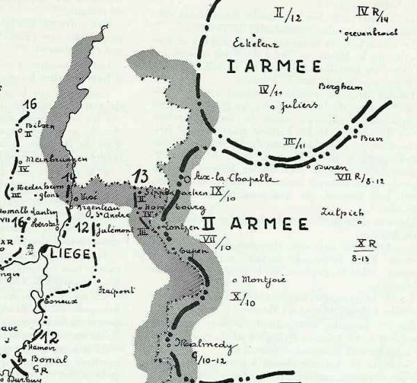

# La résistance de Liège a-t-elle ralenti le déploiement des armées allemandes ?

Quatre-vingts-dix ans après les faits, les historiens continuent à discuter sur le point de savoir si la résistance de Liège a retardé ou non le déploiement des armées allemandes.

### Avis partagés

**Contre :**

Réginald Kahn : (cité dans la bibliographie)
« La légende s’est établie un peu partout et notamment en France que la résistance de Liège a retardé la marche des armées allemandes et pesé d’un grand poids sur le sort de la campagne. Rien n’est moins exact. »

Reichsarchiv : (cité dans la bibliographie)
« La deuxième armée allemande avait atteint sa position de départ prévue pour le commencement des grandes opérations sans que les événements de Liège n’aient provoqué de retard. »

**Pour :**

Général Nuyten :
« Liège retarda, effectivement, d’environ quatre jours, la réalisation des projets allemands. »

Histoire officielle anglaise : (cité dans la bibliographie)
« Le retard imposé, par la résistance de Liège, à la marche des Allemands, est évalué à quatre ou cinq jours. »
Importance de la prise de Liège
Comme, sur le front occidental, l’infériorité numérique de l’Allemagne est de 192 bataillons, il lui importe de ne pas se créer un ennemi supplémentaire en violant le territoire hollandais. En conséquence, les deux premières armées devront se resserrer pour défiler par Liège, place forte qui devra être enlevée de vive force.

La Direction Suprême (O.H.L.) donnera le signal de marche dès que les Ie et IIe armées seront prêtes à hauteur de Liège. L’aile droite doit régler le mouvement de l’aile marchante.

Le plan repose donc sur une inconnue : la prise de Liège.

### Succession des événements du côté allemand

L’ordre de mobilisation est lancé le 1e août : le 2 août est le premier jour où doivent commencer les opérations de mobilisation.

| Jour | Action |
| --- | --- |
| 1 août | Ordre de mobilisation |
| 2 août | -Premier jour des opérations de mobilisation |
|  | -Fin des préparatifs de départ des brigades de couverture |
|  | -Mobilisation et embarquement des divisions de cavalerie |
|  | -Occupation du Grand-Duché |
| 3 août | Embarquement des brigades de couverture et installation le long de la frontière  d’Aix-la-chapelle à la frontière suisse |
| 4-5 août | Mobilisation des unités d’infanterie dans les C.A. actifs |
| 6 août | -Embarquement des C.A. d’active |
|  | -Fin de la mobilisation des corps d’armée de réserve |
| 11 août | Fin de la mobilisation des unités de Landwehr |
| 15 août | Fin de la mobilisation des divisions d’Ersatz |

La Reichsarchiv indique que :
« Exception faite des mouvements relatifs à la couverture où à des opérations secondaires, l’ensemble de la mise en place à la frontière de l’ouest s’effectua en douze jours, du 6 au 17 août. »

Voici, unité par unité, les dates de la concentration le long de la frontière belge :

| Armée | Unité | Lieu de débarquement | Date de débarquement |
| --- | --- | --- | --- |
|  | 2e C.C. | Aachen | 3 août |
|  | 1e C.C. | Wiltz et Mersch | 3 août |
|  | 4e C.C. | Thionville | 3 août |
| Ie | G.Q.G. | Grevenbroich | 10 août |
|  | 3e C.A. | Düren | 11 août |
|  | 4e C.A. | Jülich | 11 août |
|  | 2e C.A. | Gladbach | 12 août |
|  | 2e C.A.R. | Crefeld | 13 août |
|  | 4e C.A.R. | Neuss, Grevenbroich | 14 août |
| IIe | G.Q.G. | Montjoie | 10 août |
|  | 9e C.A. | Aachen | 10 août |
|  | 7e C.A. | Eupen | 10 août |
|  | 10e C.A. | Montjoie | 10 août |
|  | 7e C.A.R. | Buir, Düren | 8 - 12 août |
|  | 10e C.A.R. | Zülpich | 8 - 13 août |
|  | Garde | Malmedy | 10 - 12 août |
|  | Garde de Réserve | Blankenheim, Hillesheim | 11 - 14 août |
| IIIe | G.Q.G. | Prüm | 8 - 12 août |
|  | 11e C.A. | Saint-Vith, Prüm | 8 - 12 août |
|  | 12e C.A. | Bitburg | 8 - 12 août |
|  | 12e C.A.R. | Speicher, Neuerberg | 8 - 12 août |

La position fortifiée de Liège barre la plupart des itinéraires des deux premières armées allemandes. Et peut, de ce fait, influencer l’ensemble des opérations. Comme le temps presse, il faut enlever Liège dans les meilleurs délais.

Von Kühl :

« Prendre Liège par une attaque régulière aurait exigé beaucoup trop de temps. Il fallait s’en emparer par une attaque brusquée, exécutée par surprise, avant le commencement des opérations. »

Un « coup de main » doit faire tomber la position, et s’emparer des ouvrages d’art intacts. Cette opération est confiée au général von Emmich.

Dans la nuit du 5 au 6, six brigades doivent franchir simultanément la ligne des forts pour pénétrer dans la ville et s’emparer des ponts intacts.

**4 août**

A 8h, les colonnes allemandes franchissent la frontière belge et la cavalerie prend pied sur la rive gauche de la Meuse au nord de Visé. Les six brigades prennent contact avec les éléments avancés de l’armée belge et les refoulent.

**Nuit du 5 au 6 août**

Les six brigades déclenchent  leur attaque contre Liège.

**7 août**

Le général Leman donne l’ordre à la 3e division d’armée  de se regrouper sur la ligne Hollogne - Lantin, laissant aux forts seuls le soin de se défendre.

Le coup de main a échoué, les voies ne sont pas libres car les forts ne sont pas pris.

**8 août**

A 17h, le fort de Barchon se rend. Les Allemands décident d’entreprendre un siège en règle avec de puissants moyens, allant jusqu’au calibre de 420 mm. La garnison des forts (5.000 hommes et 207 pièces d’artillerie) va devoir résister à 150.000 hommes et 500 pièces d’artillerie. C’est un combat tellement inégal que la seule issue est la reddition ou la destruction.

Voici les dates et heures de reddition ou de destruction des forts

| Fort | Date | Heure |
| --- | --- | --- |
| Evegnée | 11 août | 17h |
| Pontisse | 13 août | 9h |
| Embourg | 13 août | 19h30 |
| Fléron | 14 août | 9h45 |
| Liers | 14 août | 9h40 |
| Boncelles | 15 août | 8h30 |
| Lantin | 15 août | 12h30 |
| Loncin | 16 août | 17h40 |
| Hollogne | 16 août | 7h25 |
| Flémalle | 16 août | 8h30 |

**10 août**

L’O.H.L., trop éloigné du théâtre des opérations, croit que Liège est tombé beaucoup plus tôt et envoie le 10 août l’ordre suivant :

A la IIe armée :
« Les unités d’autres armées employées devant Liège doivent rejoindre leur armée aussitôt que possible...
La position d’attente, assignée par les instructions sur le déploiement stratégique de la IIe armée à hauteur de Liège, devra être prise le douzième jour de la mobilisation. »

A la Ie armée :
« La Ie armée commencera immédiatement à s’échelonner jusqu’à hauteur de Liège, sur les routes qui lui ont été assignées par l’ordre de concentration. »

Von Bülow répond par télégramme :
« Tous les forts, sauf Barchon, sont encore aux mains de l’ennemi, aussi  longtemps que les forts ne seront pas tombés, traversée de Liège impossible. »

**12 août**

- von Bülow fait savoir que les têtes de la IIe armée sont en position d’attente à hauteur de
  9e C.A. : Julémont
  7e C.A. : Fraipont
  10e C.A. : Esneux
  Garde : Hamoir

**13 août**

- Les différents C.A. de la Ie armée sont respectivement à :
  2e C.A. : Sippenaeken
  4e C.A. : à Hombourg
  3e C.A. : à Lontzen

**14 août**

- Les 3 C.A. de la Ie armée gagnent la Meuse à :
  2e C.A. : Visé
  4e C.A. : Argenteau
  3e C.A. : Herstal

Les IIIe, IVe et Ve armées sont déjà sur leur ligne de mise en place et attendent l’ordre de mise en marche.

**16 août**

- Les Allemands sont maîtres de la place forte et de ses débouchés.
  Le 2e C.A. atteint Bilzen
  Le 4e C.A. Meinbruggen
  Le 3e C.A. Nederheim

Le passage de la Ie armée à travers l’étroit défilé est assuré.

**17 août**

- Les positions de la IIe armée sont les suivantes :
  7e C.A. : Thys et Momalle
  10e C.A.R. : Bierset
  10e C.A. : entre Engis et Huy
  Garde : Modave et les Aiwirs
  Garde de Réserve : Bomal

- La Ie armée continue sa marche et ses avant-gardes atteignent
  2e C.A. : Kermpt
  4e C.A. : Stevoort
  9e C.A. : Brustem

La concentration des Ie et IIe armées est achevée le 17 au soir. Sans la résistance des forts, la coupure de la Meuse aurait pu être atteinte le 12 au soir et la ligne de mise en place réelle le 13, soit quatre jours plus tôt.

L’O.H.L. avait donné un ordre de marche le 13, alors qu’il croyait les forts de Liège tombés. La Ie armée ne peut déboucher par Aachen tant que la IIe armée n’aura pas dégagé les itinéraires : le 14, elle atteint la vallée de la Meuse et n’atteint que le 16 la ligne Bilzen, Meinbruggen, Nederheim, probablement gênée par les forts de Lantin et de Loncin tombés respectivement le 15 et le 16.

_Concentration des deux premières armées allemandes_
_Ce croquis montre que la Ie armée allemande, ne pouvant pas traverser le Limbourg hollandais, doit attendre le passage de la IIe armée à travers Liège_

La ligne de mise en place est atteinte le 17.

Comme les mouvements de l’aile marchante sont basés sur les deux premières armées, nous pouvons conclure que la résistance de Liège a retardé de deux jours le départ des armées allemandes pour leur offensive vers l’ouest.

Les opérations de la IIe armée étaient suffisamment avancées pour permettre à celle-ci de franchir la frontière le 12 août et d’atteindre sa ligne de mise en place le 13, soit quatre jours plus tôt. Quant à la Ie armée, ayant une étape de plus à effectuer, elle n’aurait pu atteindre sa ligne de mise en place que deux jours après la IIe armée. On peut donc évaluer le retard à deux jours.

### Conséquences

Sans Liège, les armées allemandes auraient atteint la Sambre et le canal de Condé les 19 et 20 septembre. Or, le 19, la Ve armée française se trouve encore dans les régions de Nalinnes, Stave, Yvoir, Givet, Rocroi, Beaumont tandis que l’armée anglaise entame ses débarquements dans la zone Avesnes - Le Cateau.

La jonction entre la Ve armée française et l’armée anglaise n’était pas encore effective à cette date : les batailles de Charleroi (22 août) et de Mons (23 août) n’auraient pas été livrées.
Le corps expéditionnaire anglais aurait été battu et l’aile gauche de la Ve armée tournée, rendant la bataille de la Marne impossible.