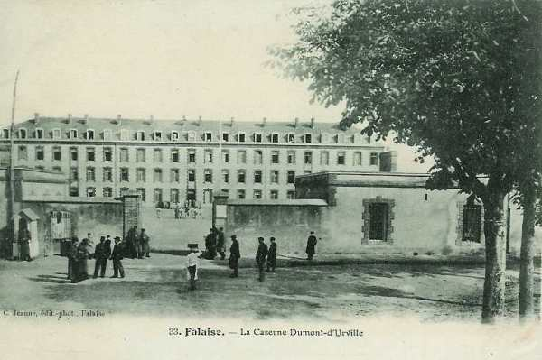

# Parcours du 5e R.I. (Falaise)

Résumé du journal de marche du 5e R.I. Source : service historique de la Défense.

Le régiment fait partie de la 12e brigade, 6e division (colonel puis général Pétain), 3e C.A. (général Hache)

A la mobilisation, le régiment compte 3350 hommes et se trouve sous le commandement du colonel Doury.
Il y a en outre 46 chevaux de selle et 138 chevaux de trait.

_Falaise : caserne Dumont d’Urville_
_Collection privée_

### 5 - 7 août :

Départ de Falaise par voie ferrée et débarquement à Amagne (département des Ardennes). Cantonnement à Guincourt, Auboncourt, Saint-Loup-de-Terrier.

### 8 - 9 août :

Cantonnement à La Horgne, Singly et Villers-le-Tilleul.

### 10 - 12 août :

Le cantonnement est légèrement modifié : Elan, Singly et Villers-le-Tilleul.

### 13 - 14 août :

Le régiment bivouaque à Touligny, Hocmont et Montigny-sur-Vence.

### 15 août : remontée de la Ve armée vers la Sambre

Le régiment fait mouvement et parcourt 14 km vers le nord-ouest via Touligny, Jandin, Thin-le-Moutiers, Clavy, Warby, Neufmaison. Il bivouaque ensuite à Neufmaison, Vaux-Vilaine, Clawy-Warby et Thin-le-Moutier.

### 16 août :

Le régiment parcourt encore 12 km vers le nord-ouest via Aubigny-les-Pothées, Lagny, Bogny, Prez. Pour bivouaquer à Prez, la Cerleau et Aouste.

### 17 août :

Le régiment parcourt une étape de 30 km, toujours vers le nord-ouest, dans la colonne de la 6e division (Pétain) via Bossu-les-Rumigny, Wattignies, Bauwelz, Momignies. La frontière belge est franchie à Macquenoise, la musique joue la Brabançonne et la troupe présente les armes. Le régiment campe à Momignies, Beauwelz et Macquenoise.

### 18 août :

Intégré dans la colonne de la 6e division, le régiment poursuit sa progression vers le nord, via Sautin, Momignies, Macon, Eppe-Sauvage, Moustier-en-Fagne. Le soir, il bivouaque au sud de la route Sivry - Rance.

### 19 août :

La marche vers le nord se poursuit (30 km) via Sautin, Sorre, Saint-Géry, Sol-Saint-Géry, Barbançon, Clermont, Thuillies, Cour-sur-Heure, Nalinnes. Le régiment bivouaque à Nalinnes, Pairain et Berzée.

### 20 août :

Le régiment reste dans la colonne de la 6e division et bivouaque à Haies de Nalinnes et Bultia.

### 21 août :

- Dans la soirée, ordre est donné de prendre position de rassemblement.
  1e bataillon à Saint-Barbe
  2e bataillon à Loverval
  3e bataillon à Haies de Bultia.

### 22 août :

- Le régiment reçoit l’ordre d’organiser trois centres de résistance :
  Aux Haies, à 3 km au sud de Marcinelle
  A la cote 178
  Au nord de Romerée.

Ces centres doivent être défendus jusqu’à la dernière extrémité.

A 15h40, ordre est donné d’attaquer en direction de Bouffioux avec sept compagnies.

A 18h30, l’attaque progresse lentement car l’adversaire est en forces, puis ordre est donné de se replier vers Nalinnes et Bultia.

En soirée, le régiment cantonne à Nalinnes et Prailes.

La journée a coûté au régiment 65 tués, 46 blessés et 14 disparus.

### 23 août :

Une ligne de repli est établie entre Praile et Limsoury ; le 119e se trouve à gauche. De sérieux travaux de défense sont exécutés.

Vers 10h, l’infanterie ouvre le feu sur une colonne allemande de toutes armes. Les mitrailleurs allemands se trouvent dans les maisons du hameau de Limsoury et font un grand nombre de blessés du côté français. Il n’est pas possible à l’artillerie française de les réduire au silence.

Les dispositions sont prises pour une attaque générale. Une batterie est envoyée sur la crête des Gourdines en vue de préparer l’attaque, mais sur ces entrefaites, un avion allemand repère les unités françaises et un feu d’artillerie d’une rare intensité s’abat sur elles.

Vu la supériorité écrasante de l’adversaire, le repli est prescrit vers Thy-le-Château et Berzée, où le régiment arrive vers 19h.
La journée a coûté au régiment 30 tués, 332 blessés et 132 disparus.

### 24 août :

Le régiment bivouaque à Walcourt puis reçoit l’ordre de se retirer vers Four-à-Verre.
A cette dernière localité, il reçoit l’ordre de se remettre en marche vers Boussu-les-Walcourt, puis de s’arrêter à Erpion pour se diriger ensuite vers Rance. Après un arrêt d’une heure, il est remis en route sur Villiers-la-Tour par Chimay.

### 25 août :

Vers 05h, le régiment arrive à Villiers-la-tour et s’y installe. A 16h, les bataillons sont prêts à marcher en suivant l’itinéraire suivant :
Le Vailler, Montceau, Imbrechies, Beauweltz, Anor.

### 26 août :

A 96h, le régiment marche vers Hirson, le chemin de la trouée d’Anor. A 11h30, une patrouille d’infanterie allemande est signalée dans la région de Rocquignies. Le 1e bataillon se replie vers le bois de Fourmies.

### 27 août :

Le régiment poursuit son mouvement de retraite par Wimy et Effry, vers Entre-deux-Bois et la Demi-Lieue. Il reçoit l’ordre d’organiser défensivement cette position.

### 28 août :

Le régiment garde sa position défensive, et le passage de l’Oise à Luzoir - Effry, mais, après le repli de la 5e division, il reçoit l’ordre de faire sauter les ponts et de se replier sur La Bouteille. Pendant la journée, une patrouille de uhlans se montre au pont d’Effry.
Le régiment suit l’itinéraire Saint-Pierre-Rougeries, Housset.

Le colonel Capitant prend le commandement du régiment en remplacement du colonel Daury, qui commande provisoirement la 12e brigade.

### 29 août :

Une résistance est tentée face aux ponts d’Origny-Sainte-Benoite. Un combat violent se déroule toute la journée, au cours duquel le régiment perd 12 tués, 89 blessés et 155 disparus.

### 30 août :

Le régiment reçoit l’ordre de reprendre l’offensive et de se porter sur la ligne Courjumelles - Signal d’Origny, mais reçoit un peu plus tard (10h) l’ordre de se replier sur la rive sud du ravin de Courjumelles.

Vers midi, la D.I. reçoit l’ordre de rétrograder par Parpeville et Montceau-Chevreries.
A 15h, nouvelle ligne de résistance sur le front Montceau-le-Vieux - ferme de Bois-Frémont, en liaison avec le 18e C.A. vers Villers-le-Sec.

### 31 août :

Le régiment reçoit l’ordre de couvrir le mouvement de repli du 3e C.A. dans la direction de Laon en suivant l’itinéraire Chevresis, Crécy-sur-Serre, puis il se retire sur Montigny-sur-Crécy, en protégeant le passage du 18e C.A. sur le pont d’Arcy. Vers 20h, le régiment atteint les faubourgs de Laon.

### 1e septembre :

Le régiment quitte Laon, cantonne à Vieil Arcy, laissant un bataillon au pont d’Arcy, qui doit être détruit.

### 2 septembre :

Le régiment est rassemblé et se met en marche vers le sud.

### 3 septembre :

Une troupe allemande poursuit la colonne française pendant toute la journée, qui arrive à Verneuil en fin de journée.

### 4 septembre :

Le régiment reprend sa marche vers le sud, atteint Marigny. Il subit une vive canonnade.  A 16h45, ordre est donné d’appuyer une attaque du 119e R.I. En fin de journée, le régiment cantonne à Vauxchamps.

### 5 septembre :

Le régiment continue son mouvement vers le sud. Lors de son passage à Morsains, le régiment subit le feu nourri d’une colonne allemande et se dégage avec peine.
Il continue sa route vers Esternay, Escardes , Boudry-le-Repos sous la menace continuelle de cavaliers et de fantassins allemands. Il arrive à Louan vers 20h.

### 6 septembre : premier jour de l’offensive

Les bataillons sont rassemblés à Louan-Saint-Genest et entament dès 16h20 un mouvement en avant, qui est arrêté par le général de division : le régiment doit former une garnison de défense vers Villouette.

### 7 septembre :

Le régiment a bivouaqué sur la crête du Haut Gré et à Villouette. Il reçoit l’ordre de soutenir le 28e R.I. à Champfleury.

A 18h, il arrive à Villeneuve-la-Lionne, puis à Tréfols à 20h30.

### 8 septembre :

A 11h, la colonne arrive à hauteur de Champ Gillard, puis se rend à Moncel pour bivouaquer.

### 9 septembre :

Ordre est donné au régiment de poursuivre les Allemands par l’itinéraire La Chaussée, Montmirail, La Tuilerie, en formant l’avant-garde.

Vers 15h30, la tête du régiment arrive à Les Bordes, et celui-ci bivouaque à Montmaçon, ferme Fontaine, Les bordes, Fontenelle.

### 10 septembre :

A 5h, le régiment reprend son mouvement via Montmaçon, Montignies, Condé-Saint-Aignan, Carthuzy, Sauvigny.
A 10h30, la tête de colonne arrive à hauteur de Varennes et est violemment canonnée par une batterie allemande visible sur les hauteurs de Jauglonne. Le régiment traverse la Marne à Jauglonne et se met en route vers Le Charmel, où il prend position.

### 11 septembre :

Le régiment suit l’itinéraire Le Charmel, Arbre de la Fosse, Ronchères, Goussancourt,  Vézilly, Vendôme, Villers-Agron et cantonne à Ronsart, Brouillet, avec un poste avancé à Cuigny.

### 12 septembre :

Le régiment se place dans la colonne de la 6e D.I. et suit l’itinéraire Prin, Faverolles, Rosnay. Dans la soirée, il doit se porter à Châlons-sur-Vesles.

### 13 septembre :

La poursuite est reprise à 04h via Muizon, Châlons-sur-Vesles, Chenay, Villers-Franqueux.
Vers 15h, le régiment s’arrête puis reprend sa marche vers Le Godet.

Les Allemands tentent de s’infiltrer, ce qui provoque une fusillade et l’infanterie doit repousser plusieurs charges allemandes à la baïonnette. Les Allemands se retranchent dans la ferme de Sainte-Marie. Le régiment bivouaque à Cauroy-les-Hermanville.

### 14 septembre :

Les Allemands tiennent toujours la ferme Sainte-Marie et canonnent le pont de Godat.
A 13h30, le régiment appuie une nouvelle attaque du 119e, mais sans succès à cause d’infiltrations allemandes.

### 15 septembre :

Le régiment cherche à s’emparer de la ferme de Sainte-Marie.

### 16 septembre :

Au lever du jour, un mouvement offensif est tenté, accueilli par une vive fusillade partant des tranchées allemandes. Le bataillon s’arrête, creuse des tranchées et attend l’intervention de l’artillerie. C’est le début de la guerre de positions.