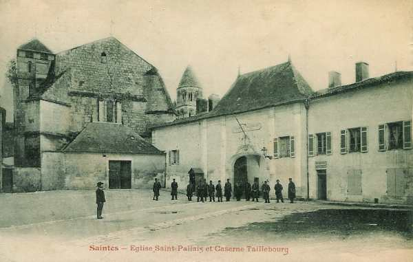

# Parcours du 6e R.I. (Saintes, Oléron)

Résumé du journal de marche du 6e R.I. Source : service historique de la Défense.

Le régiment fait partie de la 69e brigade, 39e division, 18e C.A. (général de Mas Latrie)

_Saintes : caserne Taillebourg_
_Collection privée_

A la mobilisation, le régiment compte 3338 hommes dont 165 sous-officiers et se trouve sous le commandement du colonel Doé de Maindreville.
Il y a en outre 192 chevaux et 18 mulets.

### 6 août :

Le régiment quitte Saintes par chemin de fer pour la gare régulatrice de Brion.

### 7 août :

Le premier échelon arrive à Brion,  poursuit vers Neufchâteau et Barisey-la-Côte et cantonne à Saulxures-lès-Vannes.

### 8 août :

Le 3e échelon arrive à Barisey et y cantonne.

### 9 - 10 août :

Le régiment cantonne à Grésilles et Montrot. Le 18e C.A. est constitué par divisions accolées au sud de la ligne Vaucouleurs - Blénod-lès-Toul - Montrot.

### 11 août :

Le 18e C.A. fait mouvement vers l’est et cantonne à Xeuilly, Pierreville, Pulligny, Maizières, Bainville-sur-Madon.
Le 6e R.I. cantonne à Xeuilly et Frolois

### 12 août :

Le 18e C.A. se porte dans la direction générale du nord.

- 35e D.I. vers Gondreville-sur-Moselle.
  36e D.I. sur Toul.

En fin de marche, les régiments stationnent à Gondreville et aux environs de Toul.

### 13 août :

Le mouvement vers le nord se poursuit.

- La 39e D.I. se porte dans la région de Manonviller, Rogéville, Tremblecourt, Minoville.
  La 36e par Royonnais, Antilly, Ménil-lès-Toul.
Le 6e R.I. cantonne à Avrainville, Manoncourt et Domèvre-en-Haye.

### 14 août :

La marche en avant des Ie et IIe armées commence. Le 18e C.A. est en réserve du groupe d’armées aux environs de Domèvre-en-Haye. Devant le 18e C.A., le 9e C.A. tient la côte Sainte-Geneviève.

La 35e D.I. occupe les ponts de Martincourt, Gézoncourt, Griscourt, Dieulouard et Marbache.

La 70e brigade est dans la région de Rosières-en-Haye.
Le 6e R.I. bivouaque au bois de la Rape, Manoncourt-en-Woëvre..

### 15 août :

Le 18e C.A. est toujours en réserve d’armées.

### 16 août :

Le 18e C.A. reçoit l’ordre de se préparer à embarquer pour une nouvelle destination.

### 17 août :

Le régiment cantonne à Jouy-les-Côtes et Corniéville.

### 18 août :

Les bataillons s’embarquent successivement à Sorcy.

### 19 - 20 août :

Les bataillons débarquent à Anor, Hirson et Fourmies. Le régiment et l’E.M. de la 69e division cantonnent à Trélon. Il entame une marche qui le conduira dans la province de Hainaut.

### 21 août :

Le 18e C.A. est placé entre le 3e C.A. qui tient Loverval et Villers-Poteries et la cavalerie anglaise. Son dispositif est le suivant :

- Le Q.G. est à Beaumont.

- Le 10e hussards surveille la rive gauche de la Sambre dans les directions d’Anderlues et Leernes.

- La 36e D.I. est dans la zone Ragnies - Thirimont - Montignies-Saint-Christophe - Leers-et-Fosteau.

- La 35e D.I. a sa 69e brigade à Beaumont, Chaudeville, Leignies, Grandrieu, Hestrud.

### 22 août :

Le 18e C.A. reste dans sa zone de stationnement. La 36e D.I. organise une position défensive sur la ligne Thuin - Gozée - Ham-sur-Heure.

Le 3e C.A. organise également une position de résistance sur le front Loverval - Villers-Poteries. Les ponts de la Sambre sur le front Thuin - Marchienne-au-Pont inclus sont tenus par la 36e D.I. et le 10e hussards.

### 23 août :

Des engagements se produisent sur le front de l’armée qui s’est maintenue sur la ligne générale qui lui a été assignée.

Le 18e C.A. s’est maintenu à Beaumont, la 35e division au nord de Fontaine-Valmont.

La 69e brigade est dirigée le soir sur Somzée, à la disposition du 3e C.A.  Le 6e R.I. est parti de Beaumont à 22h et s’est dirigé vers Somzée par Barbançon, Boussu-lès-Walcourt, Silenrieux, Walcourt et Chastres.

A son arrivée, le régiment se rassemble sur les pentes au sud de Somzée.

A 06h50, le 1e bataillon du 6e R.I. se porte par la route de Charleroi à la disposition de la 76e brigade. La 1e compagnie organise une position 600 m  au sud de Tarcienne, le reste du bataillon est en réserve à 700 m au N.O. de Somzée.

Les Allemands se sont emparés de quelques maisons à l’est de Praile.  Après avoir subi des pertes très sensibles, le bataillon se replie en bon ordre. Après un combat d’artillerie et d’infanterie très violent, les troupes d’Afrique et la 76e brigade se replient sur Somzée. Le régiment reçoit l’ordre de se porter sur Chastres.

Rem : le prince de Saxe-Meiningen est mort le 23 août près de Tarcienne. Il y a une stèle dans le cimetière militaire de cette localité.

### 24 août :

Le 6e R.I. est placé à 03h30 au sud de Chastres, derrière la ligne de crête, le 3e bataillon au nord de Chastres.

Le 3e C.A. reçoit l’ordre de se replier vers Walcourt. Dès que le mouvement sera amorcé, le 3e bataillon du 6e R.I. se portera par la ferme Baileu sur Walcourt où il rejoindra le reste du régiment. Le 6e R.I. couvre ensuite le rassemblement du 3e C.A.

Deux compagnies sont sur la croupe 500 m  au S.O. de Chastres, deux compagnies à l’ouest du ravin de Pry.

A 17h30, d’importantes forces allemandes débouchent des bois au nord de Gourdinne et de Somzée, vers Laneffe. Les 2e et 3e bataillons essuient des coups de fusil venant de Chastres. L’artillerie allemande ouvre un feu violent sur les positions françaises de première ligne et le colonel ordonne un repli sur Boussu-lès-Walcourt.

A 19h, les Allemands ne poursuivent pas mais bombardent Walcourt. La brigade se remet en marche et arrive à Robechies le 25 à 08h.

### 25 août :

Le 3e C.A. a ses arrière-gardes sur la ligne Chimay - Macon - Trelon. Son arrière-garde est constituée par la 69e brigade. La ligne de surveillance est le ruisseau d’Heppe.. Le 6e R.I. se trouve entre Bailièvres et Robechies. Les crêtes au nord de Bailièvres sont mises en état de défense.

Le régiment fait ensuite route vers Momignies.

### 26 août :

Le 3e C.A., encadré par le 18e et le 10e, vient prendre position sur le front Rocquigny - Mondrepuis, le gros dans la région de Flamengrie, Clairefontaine, Sommeron, Buironfosse.

### 27 août :

Le 18e C.A. poursuit son mouvement de repli vers le sud via Effry, La Bouteille, Landouzy-la-Cour, Petit Lugny, Hary, Burelles. Le 6e R.I. est précédé par le 123e.
Tous les éléments doivent rompre à 02h30 et se dirigeront vers la sortie nord d’Effry où ils prendront place dans la colonne. Le régiment part vers 05h et arrive à Landouzy où il reçoit l’ordre de prendre position vers la Verte-Vallée. Le régiment cantonne à 1.500 m de La Bouteille.

### 28 août :

Le 3e C.A. doit se porter dans la région de Landifay - Sains-Richaumont - Châtillon-les-Tours. Les arrière-gardes s’établissent sur la rive sud du Thon. L’itinéraire suivi par le régiment est : La Bouteille, Vervins, puis Guise. Une bataille est prévue pour le lendemain. La 69e brigade doit se porter sur Courjumelles. Des chariots sont réquisitionnés pour porter certains hommes et les sacs.

### 29 août :

La Ve armée doit attaquer sur la rive droite de l’Oise, dans le flanc de la Ie armée allemande, et en direction de Saint-Quentin.

La 6e D.I. se portera à 04h à l’est du chemin de Courjumelles, avec en première ligne la 69e brigade, entre Courjumelles et Saint-Remy.

Le 6e R.I. reçoit l’ordre d’attaquer la ferme de la Jonqueuse, mais l’attaque n’aboutit pas, l’artillerie n’ayant pas pu l’appuyer assez longtemps.

Le 18e C.A. n’a pas rencontré de résistance au passage de l’Oise et s’est installé au nord de Châtillon-sur-Oise. Les Allemands se retranchent entre Homblières et Marcy. Le 1e C.A. va franchir l’Oise. Le 6e R.I. doit se porter vers le pont d’Origny, avec comme objectif la cote 127 à l’ouest de Thenelles.

Le régiment traverse Origny et s’établit à  11h à la cote 127.

A 17h, le général de la 69e brigade donne l’ordre de repli vers le signal d’Origny. Le mouvement s’effectue sous un violent fau d’artillerie. Le 2e bataillon passe par Thenelles et Ribemont et s’arrête aux lisières nord de Villers-le-Sec. Le 1e bataillon passe par Origny.

Vers 21h, le régiment se reconstitue à Villers-le-Sec où il bivouaque.

### 30 août :

De 8h à 12h15, les compagnies du 6e R.I. sont soumises à un feu d’infanterie et d’artillerie très violents. Deux bataillons du 119e s’engagent puis se retirent par ordre à 13h30, après avoir subi des pertes sérieuses.

Le gros du régiment quitte Villers-le-Sec à 05h et il atteint vers 18h Châtillon-du-Temple, où il bivouaque.
31 août - 1e septembre.

Après le passage de la Serre à Assis-sur-Serre, la 69e brigade quitte la 6e D.I. pour rejoindre le 18e C.A. à Crépy, via Mestrecourt, Assis-sur-Serre, Pouilly-sur-Serre, Aulnoy-en-Laonnois.

La 69e brigade stationne à Vaucelles et Beffecourt. A Mons-en-Laonnois, le régiment fait halte de minuit à 02h, continue par Urcel, Pargny-Filain, La Royère, La Cour-des-Soupirs, Chavonne, Paars. Le régiment bivouaque dans cette dernière localité.

### 2 septembre :

A 02h, le régiment quitte son cantonnement et suit l’itinéraire Paars, Bazoches, Mont-Notre-Dame, Bruys, Mareuil-en-Dôle, Nesles, Argy, Cierges et Ronchères, pour bivouaquer à La Défense.

### 3 septembre :

Le 18e C.A doit se porter au sud de la Marne en trois colonnes : La Chapelle-Hurlet, Vincelles, pont de Dormans, Chavenay, La Chapelle-Monthodon, Pargny-le-Dhuys, où le régiment fait halte à 04h30.

### 4 septembre :

L’armée continue son mouvement de repli via Beaulne, Artonges, Fosses, Montcoupot, Rieux, Tréfols. Il bivouaque à Champ Gillard, avec deux bataillons à la lisière nord de Tréfols.

### 5 septembre :

La Ve armée poursuit son mouvement vers le sud via Villeneuve-la-Lionne, Le Bois Frais, Toulotte, Passy-lès-Provins.

### 6 - 9 septembre : premier jour de l’offensive :

La Ve armée fait volte face et attaque l’armée allemande. Le 18e C.A. doit tenir à tous prix le terrain sur lequel il est stationné. La 35e D.I. retranchera son arrière-garde sur la ligne Rupereux - Château de Flaize. Les colonnes du 6e R.I. se trouvent au château de Flaix. Depuis 9h30, il est sous le feu de l’artillerie allemande.

A 16h ; la 35e D.I. doit se porter à l’attaque de Montceau-lès-Provins. L’exécution de ce mouvement doit amener la 69e brigade sur le front Brantilly - Montceau-lès-Provins.
Pour le lendemain, l’objectif du régiment est Brantilly - cote 164.

Le 18e C.A. doit se porter dans la direction de Viffort :

- 36e D.I. vers Ville-Chamblon
  35e D.I. vers Viffort et l’Epine-au-Bois.
Le soir, le régiment cantonne à Pertibout, Le Moneil, Viffort.

### 10 septembre :

Le régiment se porte sur la route Fontenelle - Château-Thierry, dans la direction de cette dernière localité.
La 69e brigade franchit la Marne et emprunte l’itinéraire Ferme de Breteuil, La Chasserie.

Le 6e R.I. va cantonner au hameau des Coupettes, Les Hannetonneries, Les Mousseaux, ferme Louaille.

### 11 septembre :

Le régiment rompt à 06h30 et se dirige jusqu’à Epieds par Beuvarde, Villers-sur-Fère, Sergy. Il cantonne à Seringes et Nesles.

### 12 septembre :

Le 18e C.A. continue la poursuite vers le nord-est et monte en trois colonnes. La 35e D.I. constitue la colonne du centre et fait route par Mareuil-en-Dole, Che Chery, Saint-Gilles et traverse la Vesle par le pont de Courlandon.

Le 6e R.I. part de Seringes à 06h30 et marche péniblement à travers champs sous la pluie. A 14h, il est sur le plateau de la ferme de la Cense.

A 15h, il reçoit l’ordre d’attaquer Courlandon dès que l’attaque du 123e vers Breuil aura réussi. La cavalerie patrouillant sur la rive droite de la Vesle rend compte que les Allemands ont évacué la région. Le régiment se porte immédiatement vers Courlandon où il stationne.

### 13 septembre :

Le 18e C.A. continue sa poursuite vers le nord en deux colonnes par Romain, Venteley, Roucy, Pontavert, Corbeny, Aizelles.

De 13h à 18h, le régiment stationne au sud de pontavert. Il se met en marche dès 18h30, derrière le 123e, vers Craonne. Il reçoit l’ordre de cantonner à La Ville-aux-Bois.

### 14 septembre :

Le 18e C.A. doit se maintenir sur ses positions qu’il doit organiser. La 36e D.I. doit s’emparer du plateau de Vauclerc jusqu’à Hurtebise, et de Craonne, avec l’aide de la 35e D.I.

Le 6e R.I. part à 05h et se porte sur Pontavert et Bourgogne. A 20h, il cantonne à Roucy.

### 15 septembre :

Le régiment part de Roucy à 07h pour attaquer vers Gernicourt, Berry-au-Bac. Au moment où il va se porter en avant, il subit un feu d’artillerie violent. Les unités restent sur place pour la nuit.

### 16 septembre :

L’artillerie allemande canonne toute la journée les lisières du bois. L’artillerie française, placée trop en avant, est éprouvée. Des tranchées sont creusées et des abris aménagés.

### 17 septembre :

Les Allemands prononcent une forte attaque vers La Ville-aux-Bois. Le 6e R.I. les empêche de progresser vers Pontavert.
A partir de ce moment, le front se stabilise pour quatre ans.