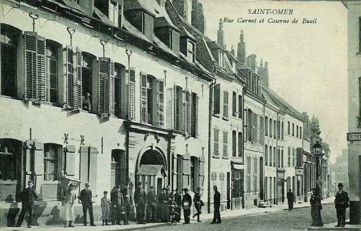
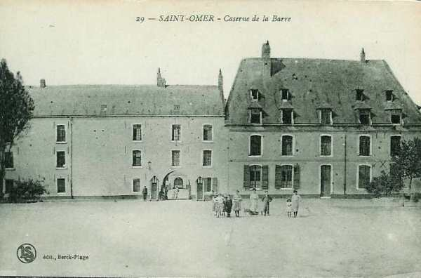

# Parcours du 8e R.I. (Saint-Omer)

Résumé du journal de marche du 8e R.I. Source : service historique de la Défense.

Le régiment fait partie de la 4e brigade, 2e division, 1e C.A. (général Franchet d’Esperey)

A la mobilisation, il se trouve sous le commandement du colonel Doyen.

_La caserne de Bueil. à Saint-Omer_
_Collection privée_

### 5 août :

Le régiment quitte Saint-Omer à 09h46, le détachement de Boulogne à 12h17, celui de Calais à 11h15. Après un transport en chemin de fer, le régiment se concentre à Martigny-Leuze (Aisne).

_La caserne de la Barre à Saint-Omer_
_Collection privée_

### 6 août :

Le 1e bataillon arrive à Martigny-Leuze à 01h.

### 7 août - 9 août :

Le régiment bivouaque à Signy-le-Petit.

### 10 août :

Le régiment marche de Signy-le-Petit vers Les Mazures où le régiment cantonne. La marche a été particulièrement pénible en raison de la grosse chaleur et des accidents de terrain.

### 11 - 12 août :

Le régiment cantonne aux Mazures.

### 13 août :

A 01h, le régiment se met en marche pour se rendre à Olloy-sur-Viroin (Belgique), via Revin, Fumay, Oignies. A Revin, le régiment marche derrière le 110e. Le passage sur le pont de Revin occasionne un retard de +- deux heures. Le soir, le régiment cantonne à Olloy, Vierves et Dourbes.

### 14 août :

La 4e brigade se porte sur Florennes via Vierves, Matagne-la-Petite, Matagne-la-Grande, Villers-en-Fagne, Merlemont, Vodecée.
Le régiment cantonne à Florennes, Chaumont et Lavalette.

### 15 août :

A minuit, le régiment quitte son cantonnement à Florennes et se porte par Rosée, Morville, Anthée et Serville sur Weillen où il arrive vers 05h et est placé en réserve dans le parc du château.

A 10h55, le 3e bataillon est envoyé à Sommière avec mission d’organiser cette localité en point d’appui et de la défendre. Le bataillon en remplace un du 73e.

A 12h10, le 3e bataillon reçoit à Sommière l’ordre d’envoyer une compagnie au pont de Bouvignes qu’elle devra défendre à tout prix : c’est la 10e compagnie, capitaine Marin.

12h35 : le régiment reçoit pour mission d’enlever la ville de Dinant, aux mains des Allemands. L’attaque sur Dinant se fera avec l’appui du 27e R.A.C. et d’éléments du 73e R.I. Le 1e bataillon et deux compagnies du 2e bataillon se portent sur Dinant.

Les compagnies de tête du 1e bataillon dépassent la lisière est de la ferme de Chestruvin sans recevoir un coup de canon, mais dès 14h30, l’artillerie allemande ouvre le feu sans toutefois entraver la marche du régiment. Bientôt, les mitrailleuses ouvrent le feu à partir de la citadelle et le régiment commence à subir des pertes importantes, ce qui ne l’empêche pas d’avancer.

A 15h30, l’artillerie française ouvre le feu avec un tir plus précis que celui de l’artillerie allemande.

16h : les deux bataillons entrent dans Dinant mais subissent encore des pertes dues au feu des Allemands installés dans la citadelle. Les deux bataillons traversent la Meuse, escaladent les pentes de la citadelle par l’escalier de 408 marches et, à 18h, le drapeau allemand cesse de flotter sur la citadelle.

Le régiment s’installe en cantonnement d’alerte sur la rive droite de la Meuse.

### 16 août :

Vers le soir, la compagnie de Bouvignes rentre à Dinant et celles de Sommière la remplace.

### 17 août :

Les 1e et 2e bataillons quittent Dinant pour se rendre à Sommière et Weillen.

### 18 - 21 août :

Le régiment cantonne à Sommière en réserve générale de division.

### 22 août :

A 14h, le régiment quitte Sommière pour Warnant, où il arrive à 20h. Le 3e bataillon cantonne à Salet. Les 6e et 7e compagnies sont détachées à Anhée. Le pont d’Yvoir est sous le commandement du capitaine Lagniez.

### 23 août :

Le régiment, à l’exception des 6e et 7e compagnies, se porte à Lesves. A 07h15,  il occupe Lesves et surveille les directions de Namur, Foreffe et Sart-Saint-Laurent.

A 11h15, le 1e bataillon et les 5e et 8e compagnies reçoivent l’ordre de se porter sur Denée et Bioul. Le village de Denée est mis en état de défense.

Vers 17h, le régiment doit se porter au château Beau-Chêne puis sur Flavion, où il arrive à minuit. Pendant ce temps, les 6e et 7e compagnies résistent sur la Meuse aux environs du pont d’Yvoir.

A 18h, le capitaine Lagniez estime +- 2000 Allemands ont franchi la Meuse et il prend la résolution de se retirer sur Warnant - Bioul.

### 24 août :

Le régiment quitte Flavion à 06h pour se porter à Morville. Le soir, le 3e bataillon s’installe à Vodelée, en soutien d’artillerie. Le 2e bataillon doit se porter sur Agimont pour surveiller le secteur Givet - Hermeton sur Meuse.

### 25 août :

Le régiment quitte Vodelée. Par Gimnée, il gagne Mazée où il reçoit l’ordre de se porter sur Dourbes. Le front occupé par le régiment longe les localités de Mariembourg - Fagnolle - Dourbes.

A 11h parvient l’ordre de se porter au gué d’Hossus, puis vers Le Mesnil et Oignies.
A 20h, deux officiers qui se trouvaient au pont d’Yvoir depuis le 22 août rejoignent leur régiment au prix de grands efforts.

### 26 août :

A peine sorti du Gué d’Hossus, le régiment est pris à partie par une batterie d’artillerie allemande mais il réussit à gagner Rocroi et bivouaque à Fligny.

### 27 août :

Le régiment quitte Fligny à 0h15 et se dirige sur Corneaux par Aubenton, Beauné et Iviers.

### 28 août :

Le régiment quitte son cantonnement de Cuivry-lès-Iviers et de Corneau par Saint-Clément, Dagny, Le Hocquet, Vigneux-Hocquet, Tavaux et se dirige sur Pontséricourt et Saint-Pierremont.

### 29 août : bataille de Guise

Le régiment quitte Saint-Pierremont à 6h35 et suit l’itinéraire Bosmont, Montogny-sous-Marle, Birlencourt, La Merville-Housset.

A 17h, après un repos, la marche est reprise vers le N.O. jusqu’au chemin de Landifay, La Hérie-La-Viéville.

A 19h, l’ordre est donné de marcher à l’attaque vers la corne est du bois de Bertaignemont. Les 2e et 3e bataillons sur le plateau de la Bretagne se trouvent sous le feu de tirailleurs et de mitrailleuses, provenant des hauteurs 142, 149, 150, mais ils continuent à avancer et, la nuit tombante, les compagnies s’établissent là où elles se sont arrêtées, le gros du régiment cantonnant dans le ravin entre La Bretagne et Landifay.

### 30 août :

Dès 3h45, les 2e et 3e bataillons reprennent la marche sur la corne nord-est de Bertaignemont  mais vers 07h, le régiment doit marcher sur Landifay.
A 10h, le régiment se porte sur Faucouzy, puis, à 17h sur Montceau-le-Neuf.

### 31 août :

Le régiment quitte Montecau-le-Neuf à 04h par la ferme de Valécourt, bois de Pargny, Mortiers, Grandlup et atteint Missy, où il bivouaque dans une sucrerie au nord du village.

### 1e septembre :

Le régiment quitte par alerte le cantonnement de Missy à 0h15 par Gizy, Eppes, Festieux et Corbény et se porte sur Pontavert, pour aller cantonner à Roucy. Deux compagnies gardent les ponts de l’Aisne à Pontavert.

### 2 septembre :

Le régiment quitte Roucy et gagne Treslon et Tramery par Ventelay, Montigny-sur-Vesles, Jonchéry et Brancourt.

### 3 septembre :

Le régiment quitte Treslon et se porte, via Sarcy, Chambrecy, Champlot, La Neuville aux Larris, Cerchery, Fleury-la-Rivière, sur Damery où il franchit la Marne à 10h. Il prend ensuite une position défensive sur la rive gauche de la Marne puis se rend à Albois-Saint-Martin où il cantonne.

### 4 septembre :

Le régiment quitte ses cantonnements de Mont-Bayen et d’Ablois-Saint-Martin et se porte sur Champaubert par Le Baizil, Lucy, Montmort. Il cantonne à Champaubert, Bois Malet et Andecy.

### 5 septembre :

Le régiment quitte Champaubert par Baye, Sézanne, Vindey, Le Plessis et la forêt de Traconne pour gagner Chantemerle.

### 6 septembre : premier jour de l’offensive :

Sur l’ordre d’offensive générale, le régiment quitte son cantonnement à 03h mais passe la journée dans une inaction complète. Le soir, il est ramené à 3 km en arrière, à l’est de la forêt d’Arcon.

### 7 septembre :

Le régiment doit se diriger vers Seu et constituer la réserve générale de C.A.

A 11h30, il est envoyé à l’ouest d’Esternay. Les Allemands battent en retraite et le régiment reçoit l’ordre de prendre la tête de la poursuite vers Champguyon, Le Pertuis, Maclaunay. Il fait une chaleur torride.

### 8 septembre :

A 05h30, le régiment quitte son cantonnement pour se porter sur Bergères-sous-Montmirail mais une violente canonnade l’oblige à se diriger sur Montvinot, où il reste jusque 13h. A ce moment, il reçoit l’ordre de coopérer avec le 110e R.I. à l’attaque du plateau au nord de Bergères. Le régiment s’en empare et y bivouaque. Les pertes se montent à 3 tués, 37 blessés et 1 disparu.

### 9 septembre :

A 05h30, le régiment prend la direction de Vauchamps à la poursuite de l’armée allemande. La tête de colonne est arrêtée à la sortie de cette localité par l’artillerie allemande.

### 10 septembre :

Le régiment atteint la rive droite de la Marne à Verneuil.

### 11 septembre :

Le régiment occupe Rueuil, Villers-sous-Châtillon et Binson-Arquigny.

### 12 septembre :

Le régiment occupe Bezannes et Les Mesneux.

### 13 septembre :

Le régiment passe la journée aux portes de Reims et cantonne à Saint-Brice.

### 14 septembre :

Le régiment est en réserve de C.A. dans la ville de Reims. A 20h, il reprend ses cantonnements à Saint-Brice.

### 15 septembre :

Le régiment se porte aux Trois-Fontaines, au nord-ouest de Reims.

### 16 septembre :

La 4e brigade est en réserve de la Ve armée. Le 8e R.I. se porte sur Roucy par Merzy-Trigny, Bouvancourt, Vantelay. Il reçoit l’ordre de franchir l’Aisne à Pontavert, vers la ferme du Choléra mais l’artillerie allemande bombarde les ponts et la route de Roucy - Pontavert. Le 1e bataillon doit attaquer de nuit la ferme du Choléra mais cette attaque ne donne aucun résultat.

### 17 septembre :

L’attaque est reprise mais le 1e bataillon est cloué sur place par un feu de mousqueterie et de mitrailleuses provenant des tranchées allemandes sur la croupe du Choléra. Les pertes françaises sont très importantes. Le colonel Doyen, chef du régiment, est tué.

### 18 septembre :

Le régiment reste sur la défensive et commence la guerre de tranchées.