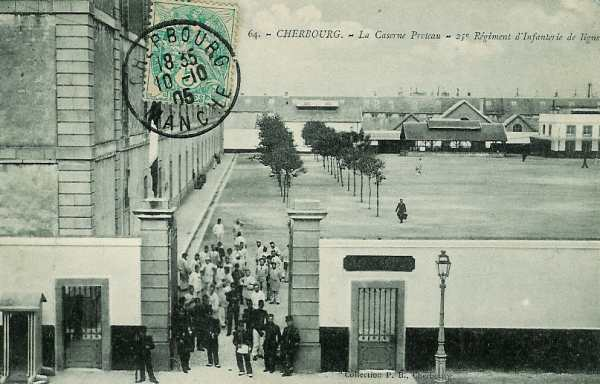

# Parcours du 25e R.I. (Cherbourg, Saint-Vaast-la-Hougue)

En 1914, le régiment fait partie de la 39e brigade (général Ménissier), 20e division (général Rogerie), 10e C.A. (général Defforges) et se trouve sous le commandement du colonel Hérillon.

_Cherbourg - caserne Preteau_
_Collection privée_

### 7 août :

Le régiment quitte Cherbourg par chemin de fer et arrive le 8 août à Attigny. Il cantonne à Neuville, Saint-Lambert et Attigny.

### 8 août :

Le C.A. reçoit en renfort douze éclaireurs du 13e hussards.

### 9 août :

Le régiment garde ses cantonnements.

### 10 - 12 août :

Cantonnement à Vendresse et à Terron-lès-Vendresse.

### 13 août :

Le 1e bataillon se porte sur Amicourt et Connage. Deux compagnies du 2e bataillon quittent Vendresse pour Malmy. Le reste du régiment reste à Vendresse.

### 14 août :

Les 6e et 7e compagnies (2e bataillon) quittent Vendresse pour aller cantonner à Malmy.

### 15 août :

Le 1e bataillon se rend à Nouvion-sur-Meuse pour assurer la garde du pont. Le 2e bataillon va à Villers-devant-Mézières et détache les 7e et 8e compagnies à Lumes pour assurer la garde du pont. Le 3e bataillon va cantonner à Francheville, détachant la 12e compagnie à Evigny.

### 16 août :

Le 1e bataillon, ayant assuré le 15 la garde du pont de Nouvion-sur-Meuse, quitte cette localité et se rend aux Ayvelles, puis va cantonner à Bourg-Fidèle avec l’E.M. et les 2e et 3e bataillons.

### 17 août :

Le régiment se porte vers le nord, entre en Belgique et cantonne à Gonrieux, Presgaux, Boutonville et Pesche.

### 18 août :

Le régiment garde ses cantonnements.

### 19 août :

Le régiment se porte vers le nord et cantonne à Hanzinelle et Thy-le-Baudouin..

### 20 août :

La marche vers le nord se poursuit, suivie d’un cantonnement à Biesmes et Oret.

### 21 août :

Dans la nuit du 21 au 22, le régiment stationne à Sart-Eustache.

### 22 août :

Le régiment est engagé entre Aiseau et Roselies, en direction du pont de Tamines, à la suite des troupes du 3e C.A. (74e et 129e). Après un violent combat, les troupes, fauchées par les mitrailleuses et le feu de mousqueterie, sont obligées de se replier, serrées de près par les Allemands. Les blessés au château de Presles ne peuvent pas être évacués.

A l’appel, il manque 1.470 hommes (presque la moitié de l’effectif !)

### 23 août :

Le mouvement de retraite se poursuit. Le régiment se porte sur Oret à 03h. Il lance une contre-attaque contre ses poursuivants et perd 80 hommes.

### 24 août :

Arrivé à Cerfontaine à 14h, le régiment en repart à 18h.

### 25 août :

Le régiment bivouaque de 01h à 03h près de Chimay, en installant un poste de garde à Robechies.

### 26 août :

Le régiment bivouaque à Macquenoise et en repart vers Effry où il arrive à 16h. Il cantonne ensuite à Effry, Etréaupont, La Bouteille.

### 27 août :

Parti d’Effry à 05h, le 25e R.I. arrive à l’Arbre Joly à 12h.

### 28 août :

Après un répit de cinq heures, le régiment repart pour arriver à La Vallée-au-Blé à midi. Il y cantonne jusqu’à 18h. Alerté à 18h, le 25e R.I. se porte sur Le Sourd.

### 29 août : Bataille de Guise

Le régiment est engagé entre Puisieux et Colonfay. Après un violent combat, la retraite reprend vers Housset. Le chef de bataillon Constantin doit être évacué.

### 30 août :

La retraite se poursuit sur Marle.

### 31 août :

Le régiment arrive à Cuirieux à 9h et en repart à 22h..

### 1e septembre :

La marche se poursuit sur Cormicy où le régiment cantonne. Il reçoit un renfort de 1.700 hommes en provenance d’un dépôt (la moitié de son effectif).

### 2 septembre :

Départ de Cormicy à 04h et arrivée à Bouilly-Sainte-Euphraise.

### 3 septembre :

Le 25e R.I. quitte Cormicy pour Epernay où il arrive à 15h. Il cantonne à la caserne Marguerite.

### 4 septembre :

Départ d’Epernay à 0h30 et arrivée à La Charmaye à 16h où le régiment bivouaque.

### 5 septembre :

Départ de La Charmaye à 05h. A Etoges, le 3e bataillon se trouve sous le feu de l’artillerie allemande. Bivouac au Verdet.

### 6 septembre : début de l’offensive

La direction de l’offensive est la route de Sézanne à Montmirail. Le combat s’engage vers le Clos-le-Roi. En fin de journée, le régiment cantonne à la ferme des Epées.

### 7 septembre :

Le combat se poursuit à Clos-le-Roi, à l’est de la route Clos-le-Roi - Charleville.

### 8 septembre :

Le régiment, en réserve de corps d’armée, se porte sur Charleville. Aucun engagement ne se déroule.

### 9 septembre :

Le 25e R.I. se porte sur Le Thoult mais n’est pas engagé. Il bivouaque à La Pommeraie.

### 10 septembre :

Le 25e R.I. se porte en avant par Le Thoult, Bannay, Congy, Toulon-la-Montagne et il cantonne à Vert-la-Gravelle à 19h45.

### 11 septembre :

Le régiment arrive à nouveau à Epernay (17h). En traversant la Marne, il subit une violente canonnade et il va ensuite cantonner à Dizy - Magenta.

### 12 septembre :

Après l’étape, cantonnement au village de Mailly Champagne.

### 13 -17 septembre :

Le 25e R.I. se porte vers Sillery et s’établit dans des tranchées sous le feu de l’artillerie allemande.

Par la suite, le régiment va changer de front plusieurs fois, mais ce sera toujours pour relever un autre régiment dans les tranchées. La guerre de mouvement est terminée pour quatre années.