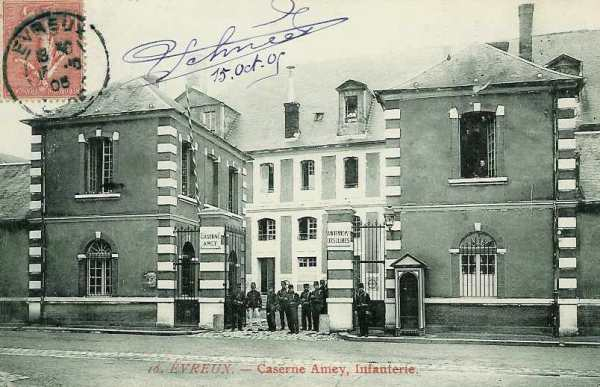

# Parcours du 28e R.I. (Evreux, Paris)

En 1914, le régiment fait partie de la 11e brigade (général Hollender), 6e division (général Mangin), 3e C.A. (général Sauret) et se trouve sous le commandement du colonel Allier.

A la mobilisation, il compte 60 officiers et 3.314 sous-officiers et hommes de troupe.

_La caserne Amey à Evreux_
_Collection privée_

### 6 août :

Dans la nuit du 6 au 7 août, l’Etat-major et les 1e et 2e bataillons s’embarquent à Becon. Le 3e bataillon part d’Evreux.

### 7 août :

L’E.M. et les 1e et 2e bataillons débarquent à la station d’Amagne et cantonnent à Alland’ Huy. Le 3e bataillon débarque à Rethel pour se rendre à son cantonnement à Amagne.

### 8 août :

Les cantonnements sont quelque peu modifiés : Jonval, Saint-Loup-Terrier et Bouvellemont.

### 9 août :

Le régiment garde ses cantonnements.

### 10 - 12 août :

Les bataillons changent de cantonnement : Bouvellemont et Jonval.

### 13 août :

A 03h45, le régiment quitte ses cantonnements. L’E.M. s’installe à Dommery avec les 2e et 3e bataillons, le 1e prenant les avant-postes au croisement de la route de Malgré-Tout à la ferme de Marlemont et celle de Signy-l’Abbaye à Lépron-les-Vallées.

### 14 août :

Mêmes cantonnements.

### 15 août :

Le régiment se porte à Rouvroy-sur-Audry, Aubigny-les-Pothées et Logny-Bogny.

### 16 août :

A 05h, le 28e R.I. se met en marche pour se rendre à Signy-le-Petit, Beaulieu, La Neuville-aux-Joûtes, Brognon, Le Four Gérard et La Gruerie.

### 17 août :

A 7h10, le régiment fait mouvement pour se rendre à Eppe-Sauvage, la lisière nord du bois de Touvent. Il se relie à la 5e division sur la route de Rance à Beaumont.

### 18 août :

A 7h10, le 28e R.I. part pour Sautin.
Un ordre arrive dans la nuit du 18 au 19 août : un détachement mixte comprenant deux bataillons du 28e, une batterie et deux escadrons doit se porter à Gozée par Beaumont pour surveiller le passage de la Sambre en amont de Charleroi jusqu’à Lobbes.

### 19 août :

Conformément aux ordres, le régiment se met en marche à 7h15 pour se rendre à Ham-sur-Heure et Cour-sur-Heure.

### 20 août :

L’E.M. et la 2e brigade quittent Ham-sur-Heure à 9h et viennent cantonner à Jamioulx où ils arrivent à 10h30. Ils occupent leurs zones respectives de surveillance :

- 1e bataillon de Marchienne-au-Pont à Landelies avec les 3e et 4e compagnies à Montignies-le-Tilleul.

- 3e bataillon avec deux compagnies à Landelies et  Thuin et deux compagnies à Montignies-le-Tilleul.

### 21 août :

A 14h parvient l’ordre de faire porter à Nalinnes le 2e bataillon. Les 1e et 3e bataillons doivent le rejoindre dans cette localité.

A 17h, tout le régiment doit se reporter à Jamioulx d’où la 11e brigade sera transportée en automobile au nord de la Sambre.

A 18h, l’ordre de transport automobile est annulé et le 28e R.I. doit se diriger vers Marchiennes-au-Pont et Fontaine-l’Evêque.

A cette dernière localité, le colonel reçoit l’ordre de faire porter un bataillon à Courcelles, un bataillon à Chapelle-lez-Herlaimont, un bataillon à Souvret. Les trois bataillons arrivent sur leurs positions vers 01h.

### 22 août :

Les bataillons quittent leurs emplacements de Chapelle-lez-Herlaimont, Courcelles et Souvret à 02h30. Leur mission est terminée : ils ont permis au corps de cavalerie Sordet (1e, 3e et 5e D.C.) de se porter à Merbes-le-Château. Les bataillons se rassemblent à Anderlues mais, à 10h, une attaque allemande se déclenche. Le 2e bataillon prend position à l’est d’Anderlues, le 3e au nord de Leernes et le 1e reste en réserve au sud d’Anderlues.

Le 24e R.I. est au sud d’Anderlues. A 15h, le 28e R.I. est obligé de céder du terrain par suite du recul du 24e. Les 1e et 2e bataillons se retirent en combattant vers Lobbes. Le 3e bataillon, fortement décimé, se retire vers Thuin. Les 1e et 2e bataillons cantonnent à Biercée, les débris du 3e à la gendarmerie de Thuin.

Le bilan de la journée est de 280 tués, blessés ou disparus.

### 23 août :

Le régiment est chargé de la défense des ponts de la Sambre :

- 1e bataillon à Lobbes
  2e et 3e bataillons à Fontaine-Valmont.

Par la suite, le 28e est relevé par des troupes du 18e C.A. et se retire vers Ragnies, puis au Bois d’Estrée.

### 24 août :

Le 28e R.I. se porte à Thirimont puis à Solre-le-Château où il bivouaque.

### 25 août :

Le 28e R.I. quitte Solre-le-Château pour Felleries. Il se forme en rassemblement articulé au nord et nord-est de la localité, face à Sart-Poteries où il subit le feu de l’artillerie allemande. Le régiment continue sa route vers Avesnes via Flaumont où il cantonne.

Dix hommes ont été blessés par des éclats d’obus.

### 26 août :

Le 28e R.I. quitte son cantonnement d’Avesnes à 02h30 et se dirige vers Beaurepaire via Cartignies. Il se rend ensuite vers La Vallée-au-Blé. Trente-trois hommes qui étaient restés endormis au cantonnement sont faits prisonniers par les Allemands.

### 27 août :

Le régiment cantonne à Sains-Richaumont.

### 28 août :

Le 28e R.I. forme l’arrière-garde de la 35e division. Arrivé à hauteur de La Hérie-Viéville, il se trouve en butte au tir de l’artillerie allemande.

Apprenant que le 228e (régiment de réserve du 28e) est engagé à Guise, le général ordonne au 28e d’attaquer vers cette localité. Lors de cette action, le régiment est fortement éprouvé et perd 690 hommes.

### 29 août :

Le régiment se dirige vers Parpeville, Villers-le-Sec, Surfontaine, Nouvion-le-Comte. Il est chargé de la garde des ponts de l’Oise à Sery-lès-Mézières, puis traverse le canal jusqu’à Mézières-sur-Oise.

### 30 août :

Le régiment, serré de près, est obligé de quitter ses positions de Séry et se dirige sur Renansart, Nouvion-et-Catillon, tout en combattant. Le régiment perd 147 hommes, puis va cantonner à Remies.

### 31 août :

L’effectif du régiment n’est plus que de 1947 hommes (58 % de son effectif initial). Il bivouaque à Barenton qu’il quitte à 20h45.

### 1e septembre :

Le 28e R.I. cantonne à Longueval et reçoit un renfort de 1.048 hommes, ce qui porte l’effectif à 2.995 hommes.

### 2 septembre :

Le régiment cantonne à Verneuil-sur-Marne. Le commandant Denvignes, du 24e R.I. prend son commandement.

### 3 septembre :

Le régiment repart à 0h45 pour Dormans et prend position face au nord sur la rive gauche de la Marne. Le 1e bataillon est chargé de la garde des ponts, le 2e gardant les issues de Dormans.

### 4 septembre :

Le 28e R.I. se dirige sur Vauchamps par Igny-le-Jard, Verdon et Fontaine-le-Bon. Il subit encore une perte de 391 hommes.

### 5 septembre :

A 02h, le régiment quitte Fontaine-le-Bon et fait route vers Louan où il bivouaque.

### 6 septembre : début de l’offensive

A 04h30, le régiment se dirige vers Saint-Genest pour participer à l’offensive générale.
Son secteur est la ferme du Haut-Grée. Il a à sa droite le 24e R.I. Il se dirige ensuite vers Villouette et la ferme de Champfleury. Dans cette attaque, il perd 301 hommes.

### 7 septembre :

Le combat de Champfleury se poursuit et les Allemands finissent par se retirer. Le régiment marche alors vers Courgivaux et Champagnemey où il bivouaque.

### 8 septembre :

Le régiment se dirige par Joiselle, l’Echelle sur Morsains où il cantonne.

### 9 septembre :

Le 28e R.I. se porte de Morsaint vers Courbouvin où il cantonne.

### 10 septembre :

Le régiment suit l’itinéraire Jauglonne, Verdon, Violaine, Montmarçon, Montigny, Condé-en-Brie et Connigis pour cantonner à Courtemont-Varennes.

### 11 septembre :

Le 28e R.I. se porte sur Vézilly où il cantonne.

### 12 septembre :

Le régiment se porte sur Chenay où il cantonne.

### 13 septembre :

Le régiment fait partie de la colonne du 3e C.A. et se dirige sur Brienne via Villers-Franqueux. En arrivant à cette dernière localité, il reçoit des feux d’infanterie provenant de Loivre. Grâce à l’appui de l’artillerie, le régiment peut progresser jusqu’au-delà du canal et prononcer une attaque sur Berméricourt, mais, à 15h, il doit se replier sur la rive sud du canal où il combat jusqu’au soir.

A 18h, le 28e R.I. prononce une attaque sur la lisière ouest du bois de Brimont et cantonne à Loivre en fin de journée. Cette action lui a coûté 283 hommes.

### 14 septembre :

Le combat est repris dans les bois de Brimont. Un feu d’artillerie terrible s’abat sur le régiment et il perd 140 hommes.

### 15 septembre :

Une offensive est entamée vers la ferme de Sainte-Marie et sur Berméricourt.

### 16 septembre :

Loivre subit un bombardement intense de l’artillerie allemande. Les troupes creusent des tranchées sur la crête du Moulin. C’est le début de la guerre de positions.