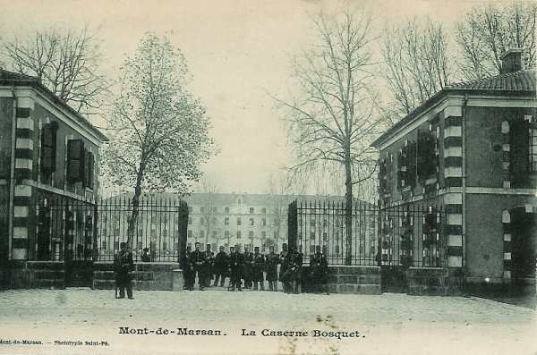

# Parcours du 34e R.I. (Mont-de-Marsan)

En 1914, le régiment fait partie de la 71e brigade (général Dion), 36e division (général Jouannic), 18e C.A. (général de Mas Latrie). A la mobilisation, il est commandé par le colonel Capdepont.

_Mont-de-Marsan : caserne Bosquet_
_Collection privée_

### 6 août :

Le régiment quitte Mont-de-Marsan. Il comporte 56 officiers, 200 sous-officiers, 3.101 caporaux et soldats. Les transports sont assurés par 136 chevaux.

### 7 - 9 août :

Le régiment arrive à la gare régulatrice de Bricon d’où il est dirigé vers Maxey-sur-Vaize, Vaucouleurs. Les trois bataillons sont ensuite dirigés vers Blénod-lès-Toul.

### 10 août :

C’est un jour de repos. La 72e brigade cantonne à Chalaines, Rigny-Saint-Martin, Rigny-la-Salle.

### 11 août :

Le 2e bataillon va cantonner à Bulligny ; la 72e brigade fait mouvement vers l’est. Le 18e R.I. occupe Germiny, le 12e Bagneux et Colombey-les-Belles.

### 12 août :

La 36e division se porte en trois colonnes. La 71e brigade forme la colonne de gauche et marche vers Toul par la grand’route Vaucouleurs - Toul. A sa droite, le 12e R.I. et l’artillerie divisionnaire suivent l’itinéraire Colombey-les-Belles, Crézilles, Bagneux.

En arrivant au sud de Toul, la colonne contourne cette place par l’est et s’engage d’abord sur la route de Metz, puis celle de Verdun pour stationner à Ménil-la-Tour  -  Andilly -   Royaumeix.

### 13 août :

Le corps d’armée continue sa marche dans la direction générale du nord. La 36e division va cantonner dans la zone Hamonville - Grosrouvres - Royaumeix -  Andilly -  Ménil-la-Tour -  Ansauville.

### 14 août : bataille de Lorraine

Conformément aux ordres d’offensive de Joffre, les Ie et IIe armées se portent en avant, le 18e C.A. constituant la réserve de groupe d’armées. Il va s’établir aux environs de Domèvre-en-Haye. La 36e division est rassemblée dans la région de Ménil-la-Tour - Royaumeix - Ansauville - Grosrouvres - Bernécourt.

Le 34e R.I. est à Grosrouvres et Ansauville.

### 15 août :

Les troupes de la 36e D.I. restent dans leurs cantonnements. Comme une patrouille de uhlans a été vue dans la région de Thiaucourt - Saint-Baussant, le général de brigade donne l’ordre d’aller occuper le village de Mandres-aux-quatre-tours. La 4e compagnie s’y installe vers 11h30. Un accrochage se produit avec une patrouille de cuirassiers allemands.

### 16 août :

En matinée, la 4e compagnie effectue une reconnaissance sur Beaumont qui est trouvé inoccupé. A 16h45, la brigade reçoit l’ordre d’aller cantonner à Troussey (34e R.I.) et à Lay-Saint-Rémy (49e).

### 17 - 18 août :

En soirée, le régiment s’embarque à Pagny-sur-Meuse, dans la direction d’Hirson. Les premiers éléments sont dirigés sur Avesnes où ils débarquent pour aller cantonner à  Lez-Fontaine, les autres éléments débarquant à Saint-Hilaire-sur-Helpe, pour aller cantonner à Semousies.

### 19 août :

Les trois bataillons quittent leurs cantonnements  pour se rendre à Sivry (Belgique) où ils cantonnent avec l’artillerie divisionnaire et l’artillerie de corps d’armée.

### 20 août :

La 36e division pousse sur Beaumont pour y relever une avant-garde composée du 5e escadron du 10e régiment de hussards.

### 21 août :

Le C.A. porte son avant-garde (71e brigade) dans la région de Thuin et ses gros dans la région de Ragnies - Beaumont. Un bataillon du 49e R.I., une section du génie et un peloton de hussards se dirigent sur Gozée.

En fin de marche, la colonne prend les dispositions suivantes :

- 34e R.I. à Thuin
  49e R.I. à Biesme-sous-Thuin et Gozée
  1e groupe d’artillerie divisionnaire à Thuin
  2e groupe d’artillerie divisionnaire à Biesme
  L’escadron divisionnaire à Thuin

Le 34e R.I. a deux bataillons au nord de la Sambre :

- Le 1e bataillon garde la route de Thuin à Fontaine-l’Evêque (incluse), avec la 2e compagnie au nord de Les Bonniers et la 3e compagnie vers les Quatre-Chemins, la 4e compagnie au hameau des Bonniers.

- Le 2e bataillon a la 6e compagnie à Hourpes, les 7e et 8e formant la réserve et installés sur le chemin allant à Marbaix.

La cavalerie éclaire vers Buvrinnes - Anderlues - Leernes.
A partir de 20h, les 1e et 5e D.C. traversent les lignes françaises (corps Sordet).

### 22 août :

La 71e brigade reste sur place organise défensivement le front Thuin - Gozée, le pont de chemin de fer et l’abbaye d’Aulne. Une compagnie du 1e bataillon tient les ponts de chemin de fer à Lobbes pour relever un détachement du 119e.

En soirée, les 1e et 2e bataillons repassent sur la rive droite de la Sambre et vont cantonner

- 1e bataillon à Heuleu
  2e bataillon au sud-est de Thuin.

### 23 août :

A 8h30, les positions du 34e R.I. sont les suivantes :

- 1e bataillon au sud-est de Thuin, à la disposition du général commandant la 71e brigade.

- 2e bataillon dans des tranchées à l’est de Thuin.

A gauche du régiment, les 24e et 28e R.I. défendent le pont de Lobbes.

A 9h50, les Allemands ouvrent un feu violent. Vers 13h45, le 1e bataillon reçoit l’ordre de se porter vers la cote 179 pour y exécuter une contre-attaque sur le flanc gauche des Allemands, qui se sont emparés du pont de Lobbes et des ponts de chemin de fer sur la Sambre. Le bataillon arrive à la cote 179 vers 15h30, se joint à quelques éléments du 12e, du 57e et du 144e et marche vers le pont de Lobbes sous un feu meurtrier d’infanterie et d’artillerie.

A 18h30, un premier assaut est donné. Les Allemands se retirent dans la direction du plateau situé sur la rive sud de la Sambre. Une seconde charge permet de prendre pied sur le plateau.

La nuit venant, le 1e bataillon se trouve exposé à un feu violent de mitrailleuses. Etant découvert sur son flanc gauche par le mouvement de recul du 14e R.I., il bat en retraite et se rassemble au village de Ragnies.

Une partie du 2e bataillon a été soumis pendant une bonne partie de la journée aux feux d’artillerie et d’infanterie.

A 19h15, le colonel donne l’ordre de battre en retraite. A 21h, les 2e et 3e bataillons et les trois sections de mitrailleuses sont rassemblés au sud-est de Thuin et gagnent par Biesme-sous-Thuin le village de Ragnies où ils arrivent à 22h30.

### 24 août :

A 02h, le régiment quitte Ragnies et se dirige sur Beaumont via Strée. A l’entrée de Beaumont, il reçoit l’ordre d’aller avec le 49e R.I. occuper le plateau au sud de Thirimont et de l’organiser défensivement pour couvrir le repli de la 72e brigade.

A 11h, le 34e R.I. reçoit l’ordre d’abandonner cette position et de s’installer à l’ouest de Beaumont. Les 2e et 3e bataillons sont placés en première ligne au nord du village de Leugnies.

A 15h30, le régiment forme l’arrière-garde de la division et se dirige vers Clairfayts par Grandrieu.

### 25 août :

A 0h30, le 34e R.I. se rassemble à Clairfayts et forme, dès 07h, l’arrière-garde de la division. Les routes sont encombrées par des éléments de la 35e division et des voitures de réfugiés.

A 11h, le régiment s’articule dans la direction de Liessies. La 8e compagnie est engagée contre un peloton allemand de dragons et une compagnie cycliste.

Vers 15h, le régiment cantonne à Sémeries, Ramousies et Rempsies.

### 26 août :

La division se porte vers la forêt de Nouvion en deux colonnes. Le 34e R.I. passe au pont d’Etroeungt sur la petite Helpe à 6h05 pour ensuite aller cantonner à Fontenelle.

Dès 14h30, la division doit reprendre la marche. Le 34e R.I. marche par la route de Fontenelle, la route de l’Hermitage, Buironfosse. Le 34e R.I. cantonne à la forêt de Nouvion et à Buironfosse.

### 27 août :

La division poursuit sa marche via Erloy, Saint-Algis, Haution. L’arrière-garde de la division, constituée du 12e R.I. et d’un groupe d’artillerie, reçoit l’ordre de défendre les débouchés de l’Oise.

Le 34e R.I. cantonne à Franqueville et le 49e R.I. à Voulpaix.

### 28 août :

L’itinéraire suivi est Rougeries, Marfontaine, La Neuville-Housset, La Vieville, Faucouzy, Torcy, Parpeville, soit en direction de l’ouest. Le but de cette marche est de participer à la bataille de Guise.

A 14h, le régiment se porte sur Ribemont et s’y engage.

### 29 août : bataille de Guise

La division attaque vers Homblières (est de Saint-Quentin). Le 34e R.I. passe le pont de l’Oise sur la route de Sissy à 06h.

A 08h17, le colonel reçoit l’ordre de la 36e division de ne pas dépasser La Raperie et de s’y organiser défensivement. Le 1e bataillon s’installe sur la croupe nord-ouest de La Raperie.

A 13h, la colonne reçoit l’ordre d’attaquer en direction de Mesnil-Saint-Laurent et ultérieurement vers Saint-Quentin.

A 13h15, le 1e bataillon reçoit l’ordre de couvrir le repli d’une batterie d’artillerie puis d’attaquer la ferme Cambrie. Le 2e doit attaquer vers la gauche de la ferme, le 3e bataillon suivant en réserve. Le mouvement est arrêté par des projectiles français qui éclatent quelques mètres en avant de la ligne. Il faut battre en retraite pour ne pas essuyer ce tir trop court. Les 1e et 2e bataillons sont ramenés à Ribemont où ils cantonnent.

### 30 août :

A 05h30, le régiment reçoit l’ordre de se porter vers Surfontaine. Vers 11h, les fantassins de la 38e division sont canonnés par l’artillerie lourde allemande installée sur la rive droite de l’Oise. Le régiment cantonne à Pont-à-Bucy et Monceau-les-Loups.

### 31 août :

Vers 03h, le régiment se met en marche par Monceau-les-Loups, Couvron et Crépy. Vu l’encombrement des routes, les troupes doivent marcher à travers champs. Le régiment gagne Cerny-lès-Bucy où il cantonne.

### 1 septembre :

La retraite se poursuit via Cessières et Fauconcourt. Le 34e R.I. forme l’arrière-garde de la division.  A Fauconcourt, ordre est donné d’empêcher les poursuivants de passer l’Aisne.

L’itinéraire suivi est Anizy, Pinon, Vaudesson, L’Ange-Gardien, Vailly où l’Aisne est franchie. Après une halte, le régiment rejoint Courcelles-sur-Vesle.

### 2 septembre :

La 36e division continue sa marche vers le sud-est. Le 34e R.I. marche en tête de la division, passe la Vesle à 05h30. L’itinéraire est Mont-Notre-Dame, Bruys, la forêt de Dôle, Chéry-Chartreuve, la ferme Party. L’artillerie est installée à Mareuil-en-Dôle et ouvre le feu sur l’infanterie allemande. En arrivant au sud-est de Nesle, le régiment prend position pour protéger l’écoulement du reste de la division.

### 3 septembre :

L’armée se porte au sud de la Marne. Le mouvement du 18e C.A. s’effectue en trois colonnes. Le régiment suit l’itinéraire Charmel, Jauglonne. Le passage de la Marne par le 34e R.I. s’effectue sur le pont suspendu de Jauglonne.

En arrivant à Varennes, la 36e division reçoit l’ordre de s’installer vers Fossoy pour faire face à une attaque possible venant de Château-Thierry.

Le 34e R.I. se rend à la ferme des Corbeaux et dans les bois au nord de Courboin. Un engagement se produit contre l’artillerie et l’infanterie allemandes. Le 1e bataillon se porte ensuite au sud du village de Condé-en-Brie. En fin de journée, le régiment cantonne à Montigny-lès-Condé.

### 4 septembre :

L’armée continue son mouvement de repli vers le sud. Le 18e C.A se porte sur deux colonnes, la 36e division formant la colonne à l’ouest. Le 34e R.I. marche en tête de division via Montilly, Pargny, station d’Artonges, puis marche à travers champs jusqu’à Villemoyenne, Bailly, Marchais-en-Brie.

La 71e brigade reçoit l’ordre de se rassembler à l’est de Montolivet Craignant des mouvements débordants de la part des Allemands vers Saint-Barthélémy, la division reçoit l’ordre de se porter vers Meilleray. Le 1e bataillon reste en place jusqu’à ce que la division soit passée sur la rive gauche du Grand Morin.

### 5 septembre :

La division se porte vers le sud via Moutils, Pierrelez, Vieux-Maisons, Cerneux, Augers, Rupéreux. Dans l’après-midi, le régiment reçoit un renfort de 700 hommes. Le bivouac a lieu à Courchamp - Savigny - Petit-Mézières - Haut-Mézières.

### 6 septembre : début de l’offensive

La Ve armée prend l’offensive. Le 18e C.A. doit d’abord conserver ses emplacements : pour la 71e division, il s’agit des crêtes entre Voulton et Le Plessis. Une position de repli est organisée à Saint-Martin-des-Champs.

A 15h30, le régiment arrive sur la rive droite du Rû
(600 m au sud de Rupereux).

A 16h, la division doit occuper Couperdrix, Ecoublay et Brantilly, pendant que la 35e division attaquera Monceau-lès-Provins.

A 17h30, le régiment doit se reporter en arrière du 18e C.A. qui marche sur le château de Flaix. La nuit, le régiment cantonne à Rupereux, au sud-ouest d château de Flaix et à Voulton.

### 7 septembre :

A 7h15, ordre est donné au corps d’armée d’attaquer vers Monceau-lès-Provins. La 35e division attaque Sancy, la 36e ayant pour objectif la ferme de La Chèvrière, entre Cerneux et Sancy-lès-Provins.

A 10h30, le 1e bataillon du 34e tient la ferme de Chèvrières et les 2e et 3e sont au nord de la route Cerneux - Monceau.

A 14h, la retraite allemande s’accentue et la poursuite est reprise. La colonne suit l’itinéraire Pierrelez, Voigny, Marchais, La Chapelle-Veronge.

Le soir, le régiment bivouaque sur la rive droite du Grand Morin, à Le Montcel (route de Meilleray à Le Montcel).

### 8 septembre :

La poursuite continue. La 36e division marche en deux colonnes. Le régiment suit l’itinéraire Meilleray, Montolivet, Montdauphin, Vendières.

Ordre est ensuite donné d’attaquer Marchais-en-Brie. L’attaque est éclairée par le 10e hussards et appuyée par toute l’artillerie divisionnaire. A la sortie de Vendières, le 34e R.I. essuie le feu de l’artillerie allemande et des feux d’infanterie provenant de la lisière des bois de Courmont. Les 2e et 3e bataillons s’engagent dans les bois de Courmont et le 144e attaque Marchais-en-Brie. Le régiment bivouaque sous la pluie aux lisières du bois de Courmont.

### 9 septembre :

Le 18e C.A. se porte en deux colonnes sur Viffort, prête à s’engager soit vers Château-Thierry, soit vers Chézy. La 35e division forme la colonne de gauche et le 34e se trouve en queue de division. La division suit la route l’Epine-au-Bois, La Haute-Epine, Rozoy, Ville-Chamblon et Essizes.

La division stationne dans la région d’Essizes (Essizes - Montfaucon - les Caquerets).

### 10 septembre :

A 13h, ordre est donné à la division de reprendre la marche vers le nord pour se rendre au sud de la route de Château-Thierry à La Ferté-sous-Jouarre. La division suit l’itinéraire Les Roches, Chézy-sur-Marne, Essômes-sur-Marne, Montcourt, Monneaux, Vaux. En fin de journée, le régiment s’installe dans ces deux dernières localités.

### 11 septembre :

Le C.A. continue sa marche vers le nord à Château-Thierry, Brasles, Epieds, Courpoil. Le cantonnement a lieu à Ville-Moyenne - Villeneuve-sur-Fère, en liaison avec une brigade anglaise.

### 12 septembre :

La Ve armée continue son offensive par le nord-est. L’itinéraire suivi par la division est Sergy, Clamery, Longueville, Mont-sur-Courville, Courville.

Le 34e R.I. cantonne à Magneux et le 49e à Unchair.

### 13 septembre :

La poursuite continue vers le nord. La 36e division doit marcher en tête et se diriger par Baslieux-lès-Fismes et Glennes sur Maizy.

Le 1e bataillon tient le pont de l’Aisne à Maizy. En quittant Beaurieux, un renseignement parvient que Craonnelle et Craonne ont été évacués mais qu’une colonne allemande de toutes armes marche sur cette dernière localité. Au reçu de ces renseignements, le 2e bataillon est poussé à l’est de la route de Craonnelle.

A 14h, la cavalerie française occupe le moulin de Vauclerc mais est repoussée par l‘infanterie allemande.

Le cantonnement a lieu au sud-est du carrefour des routes de Craonnelle à Oulches et de Beaurieux à la ferme Heurtebise.

### 14 septembre :

Le régiment creuse des tranchées dans la région de Beaurieux. C’est le début de la guerre de positions.