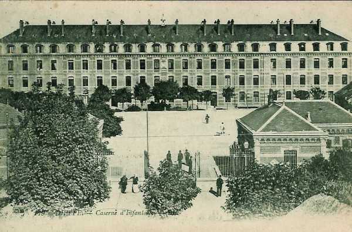

# Parcours du 39e R.I. (Rouen, Dieppe)

En 1914, le régiment fait partie de la 9e brigade (général Tassin), 5e division (général Mangin), 3e C.A. (général Sauret). A la mobilisation, il est commandé par le colonel Chrétien.

_Rouen : caserne d’infanterie_
_Collection privée_

### 5 août :

C’est le départ du régiment de Rouen et de Dieppe. Le convoi suit l’itinéraire Rouen, Mantes, Achères, Soissons, Laon, Bazancourt, Novion-Porcien.

### 6 août :

Les éléments débarquent à Novion-Porcien et les bataillons cantonnent à Novion-Porcien - Faissault - Saulce-Monclin - Vieil-Saint-Remy.

Vers 15h, le régiment quitte partiellement ces localités et cantonne à Launois - Saulce-Monclin - Nouvion-Porcien - Raillicourt.

### 7 - 9 août :

Les cantonnements restent inchangés.

### 10 août :

Les cantonnements sont modifiés par l’ordre général numéro 7 : Raillicourt - Jandun - Barbaise.

### 11 - 12 août :

Les cantonnements restent inchangés.

### 13 - 14 août :

Le régiment quitte ses emplacements à 05h et va cantonner à Neuville-lès-This - Clavy-Warby - Saint-Marcel - Neufmaison - Remilly-les-Pothées. La 52e D.I. occupe Mézières et borde la Sormonne.

### 15 août :

L’ordre général numéro 13 modifie les cantonnements : Sury - La Grève - Saint-Marcel.

### 16 août :

Le régiment prend place dans la colonne et marche par Hardouville, Rémilly-les-Pothées, Rouvroy-sur-Audry, l’Echelle, Blombay, Maubert-Fontaine. Il cantonne à Eteignières - Le Haut-Taillis - Le Bas-Taillis -  Dorville - Wagny.

### 17 août :

Le régiment marche en tête de division via Mon Idée, Bel-Air, Le Chien-Fidèle, La Neuville-aux-Joûtes, Cendron (frontière belge), la Loge-Wattiaux, Seloignes, Salles où il cantonne.

### 18 août :

Le 39e R.I. marche par Chapelle-de-l’Arbrisseau, Robechies, Rance, Fourbechies, Reulies où il cantonne.

### 19 août :

L’avant-garde de la division est constituée par le 39e R.I. Elle suit l’itinéraire Vergnies - Erpion - Boussu-lès-Walcourt - Silenrieux - Walcourt - Chastres - Somzée, Tarcienne, Gerpinnes, lieu de cantonnement.

### 20 août :

Le 39e R.I. part de Gerpinnes. Deux compagnies sont désignées pour occuper Presles et Aiseau. Le reste suit la route Gerpinnes, Acoz, Bouffioulx. Le 1e bataillon continue vers Châtelet.

A 10h, le 1e bataillon tient les passages de la Sambre, de Montignies à Pont-de-Loup inclus. Le 2e est à Chamborgneau et le 3e à Aiseau.

Deux centres de résistance sont créés :

- A Pont-de-Loup (un pont)
  A Châtelet (trois ponts)

Chaque pont est défendu par une section. Deux sections sont en réserve à Châtelet et sur la place de la Victoire, une autre en réserve à Wairchat.

Suite à une reconnaissance, le chef du 1e bataillon (cdt Chédeville) rend compte que les passages à l’est de Pont-de-Loup ne sont pas tenus, à la suite de quoi un bataillon du 74e R.I. se porte à Aiseau avec pour mission de tenir les ponts de la Sambre depuis Oignies inclus jusqu’à Pont-de-Loup exclu.

A 17h30, les deux compagnies du 3e bataillon, qui tiennent Presles et Aiseau, sont relevées par le 74e R.I.

### 21 août :

A 07h, une compagnie du 2e bataillon va occuper le pont de Montignies-sur-Sambre.

A 11h, une patrouille de hussards de la mort qui s’est approchée à 600 - 700 m du poste de Pont-de-Loup est reçue à coups de fusil.

Vers midi, le général de brigade réorganise les centres de résistance comme suit :

- Aiseau : deux compagnies du 74e R.I.
  Pentes nord de la croupe 170 : deux compagnies du 3e bataillon du 39e R.I.
  Bouffioulx : une compagnie du 3e bataillon du 39e R.I.
  Croupe de Chamborgeau : deux compagnies du 2e bataillon du 39e R.I.
  Loverval : une compagnie du 2e bataillon du 39e R.I.

A 15h, des cavaliers allemands suivis de fantassins sont signalés descendant de Gilly sur Châtelet et de Le Wainage sur Pont-de-Loup. Devant Pont-de-Loup, les allemands mettent en ligne au moins un bataillon de chasseurs de la Garde. Ceux-ci sont repoussés avec pertes.

A la tombée de la nuit, les allemands se sont rendus maîtres des ponts de Roselies et de Farciennes. Vers le milieu de la nuit, un bataillon du 129e R.I. vient renforcer le 1e bataillon du 39e R.I.

### 22 août :

Dans le courant de la nuit, une attaque tentée par deux bataillons du 74e R.I. pour reprendre Roselies a échoué.

A 03h, le 1e bataillon reçoit l’ordre de se replier sur le hameau de La Sarthe, les 2e et 3e bataillons conservant leurs positions de la veille :

- 12e et 9e compagnies sur les pentes nord de la cote 170, tenant les routes de Châtelet à Presles et à La Figotterie.

- 10e compagnie avec une section barrant la route de Châtelet - Acoz, au passage à Niveau de Bouffioulx.

- A l’ouest du vallon de Bouffioulx, le 2e bataillon tenant le plateau au nord de Chamborgneau jusqu’au chemin de Lausprelle à Couillet (5 et 6e compagnies) et la lisière nord des bois de Loverval (7e compagnie), le débouché sud de Couillet (8e compagnie)

Toutes les unités sont fortement retranchées et la liaison est assurée avec les bataillons du 119e R.I. qui occupent les ponts de Charleroi en amont de Montignies.

Dès 04h, les obus allemands arrosent le terrain au sud et sud-est de Châtelet. Vers 08h, l’infanterie allemande commence à déboucher des ponts de la Sambre, protégée par le feu de l’artillerie.

A 09h30, le groupe du secteur de droite commence à se replier et le 1e bataillon reçoit l’ordre d’organiser une position en arrière des bois de la Sarthe, entre La Figotterie et Acoz. Les Allemands avancent en masses profondes au sud de Châtelet et Pont-de-Loup, à l’abri des maisons. La section de la 10e compagnie qui se trouve dans Bouffioulx se replie en arrière de Chamborgneau.

Les Allemands remontent le vallon de Chamborgneau. Pour éviter que le régiment soit tourné, le colonel replie sa droite (5e et 6e compagnies) sur la lisière nord des bois au sud de Chamborgneau pour pouvoir faire face au nord et nord-est. La 5e compagnie bat la vallée de Bouffioulx et la 6e le ravin et les débouchés de Chamborgneau.

La 7e compagnie est retirée sur la lisière nord de Loverval et trois sections de la 8e sont placées en réserve au nord-ouest de Lausprelle, la 4e section continuant à tenir la route de Charleroi à Bultia.

A 11h30, les Allemands hissent des mitrailleuses au sommet des terrils et criblent les tranchées tenues par le 3e bataillon. La 10e compagnie se replie sur Acoz après avoir subi de fortes pertes.

A 12h, le général de brigade prescrit au 3e bataillon de battre en retraite vers La Figotterie. A 14h45, une batterie française du groupe de Chamborgneau tire quelques salves sur les Allemands et les projectiles font de gros ravages dans leurs rangs. Une batterie allemande installée sur la rive gauche de la Sambre ouvre le feu sur les artilleurs français et forcent ceux-ci à cesser leur tir.

Les Allemands reprennent ensuite leur attaque en gagnent le plateau de la cote 170. Ordre est donné à toutes les troupes du secteur de droite de rejeter les Allemands vers Châtelet. Toute la ligne française se porte en avant mais, prise dans un feu très violent, elle ne peut pas dépasser la cote 170. Les troupes se reforment à l’abri des bois et reçoivent l’ordre de se replier vers La Figotterie et Villers-Poterie. Les Allemands ne poursuivent pas.

A 15h, une patrouille de la 7e compagnie envoyée vers Couillet signale la présence de forces assez considérables. Peu après, plusieurs sections allemandes prennent position à la lisière sud de Couillet et engagent le feu avec la 7e compagnie qui se replie pour suivre le mouvement du 2e bataillon.

Les 1e et 2e bataillons reçoivent l’ordre de gagner Tarcienne et atteignent le village vers 18h.

Le colonel reçoit ensuite l’ordre de se rendre à Thy-le-Bauduin et les deux bataillons organisent une position sur la croupe nord de cette localité.

Les pertes de la journée sont de 40 tués, 244 blessés et 224 disparus.

### 23 août :

La nuit du 22 au 23 août se passe sans incident. A 06h, le colonel est avisé que le 5e D.I. va se replier vers le sud puis il reçoit l’ordre de barrer la trouée d’Hanzinelle. Les batteries lourdes allemandes arrosent le terrain jusqu’aux pentes de Thy-le-Bauduin. Le pilonnage dure jusqu’à 18h30 mais ses résultats matériels sont nuls.

### 24 août :

A 03h, le régiment est sous les armes. Vers 04h30, l’artillerie allemande recommence son tir.

A 05h, une forte attaque allemande débouche du front Hanzinne - Tarcienne. Une vive fusillade s’engage sur la croupe 251 et les troupes françaises se maintiennent.

A 06h15, le colonel reçoit l’ordre de rompre le combat et de se replier sur Morialmé.

La 5e D.I. suit la direction générale de Fraire, Yves-Gommezée, Vogenée, la partie sud de Walcourt, Silenrieux, Boussu-lès-Walcourt, Erpion, Fourbechies où il cantonne.

### 25 août :

A 01h, le régiment reçoit l’ordre de reprendre le mouvement de retraite. Parti de Fourbechies à 02h, il suit l’itinéraire Rance, Montbliart, Eppe-Sauvage, Moustier-en-Fagne, Baives, Macon.

Pendant la grand’halte, le colonel reçoit l’ordre de prendre position à Macon, appuyé à gauche par le 74e R.I. et le 274e. Le 3e bataillon barre la route de Baives, le 2e la route de Salles.

Vers 18h, suite à de nouveaux ordres, le régiment quitte ses positions de Macon et se porte par Ohain vers Fourmies.

### 26 août :

Le régiment quitte Fourmies à 05h30 et se porte sur Wignehies, Pied-du-Terne, Haudroy, La Capelle. A 13h, le régiment reçoit l’ordre d’organiser défensivement la route d’Avesnes de manière à pouvoir battre la sortie sud de La Flamengrie.

### 27 août :

Le 3e C.A. se replie sur la rive gauche de l’Oise. A 02h, le régiment quitte La Capelle via la grand’route de Vervins jusqu’à La Chaussée. Le 39e R.I. est chargé de tenir les hauteurs de la rive gauche du Thon, encadré par le 36e R.I. et le 74e.

Vers 17h, l’artillerie allemande effectue un tir sur la rive droite de l’Oise.

### 28 août :

Le 39e R.I. constitue l’arrière-garde de la 5e D.I. A 17h, la tête se présente au carrefour de Fontaine-lès-Vervins pour suivre l’itinéraire Fontaine-lès-Vervins, Cambron, Gercy, Saint-Gobert, Rougeries, Marfontaine et Chevennes, soit en direction ouest, en vue de participer à la bataille de Guise.

### 29 août : bataille de Guise

A 05h, le régiment se met en route via Sains-Richaumont, Le Hérie-la-Viéville, Landifay. Au nord de cette dernière localité, la colonne se heurte à celle de compagnies du 36e R.I. venant du nord et qui se replient sous le feu de l’artillerie allemande.

Le colonel prescrit aux deux compagnies d’arrière-garde (10e et 11e) de se déployer à l’abri de la croupe nord-ouest de Landifay, leur droite au chemin Landifay - Bertaignemont. La première ligne progresse rapidement malgré un feu violent d’artillerie. Le colonel prescrit à la première ligne de stopper à hauteur de la cote 127 pour attendre l’arrivée du reste du 2e bataillon et permettre à l’artillerie française de se mettre en ligne. Pendant cet arrêt, l’artillerie allemande canonne vigoureusement la croupe nord-ouest de Landifay.

Sur un nouvel ordre, les sections se mettent en marche. Dès qu’elles sortent du bois, elles tombent sous un feu violent de mousqueterie qui les prend en écharpe. Sous les feux croisés, les compagnies se retirent de Landifay. Le reste de la première ligne stoppe en attendant que l’artillerie française ait détruit les couverts de Bertaignemont.

A 14h, le colonel est avisé que la 5e D.I. doit marcher sur Jonqueuse. A 15h, le mouvement en avant est repris et à 16h45, les 7e, 8e et 9e compagnies pénètrent dans la ferme de Bertaignemont. Les Allemands se retirent. Les sections françaises qui progressent sont prises sous le feu de l’artillerie allemande et sous les obus français car l’artillerie tire trop court.

A 19h, le régiment arrive à Bertaignemont, drapeau déployé et musique en tête jouant la Marseillaise.

Le régiment a perdu 8 tués, 139 blessés et 138 disparus.

### 30 août :

Dès 03h, une fusillade éclate. A 07h, la brigade tient toujours Bertaignemont.

A 11h, ordre est donné de se replier vers le sud par Monceau-le-Vieil, contournant la ferme de Torcy, puis Chevresis. Le régiment cantonne à Mesbrecourt et à Assis-sur-Serre.

### 31 août :

Le 3e C.A. se retire derrière la Serre. Le 2e bataillon se rend à Crécy-sur-Serre et à Chalandry, les deux autres se rendant à Pouilly-sur-Serre.

### 1 septembre :

Le mouvement de retraite continue. A 01h30, le régiment arrive à Vaux-sous-Laon. La colonne passe ensuite par Chamouille, Troyon, Vendresse et Oeuilly. Un détachement en renfort, envoyé par le dépôt de Rouen, rejoint le C.A. : 874 hommes qui seront répartis entre les diverses unités.

### 2 septembre :

Le gros du régiment quitte son cantonnement de Villers-en-Prayères et de Revillon à 02h via Revillon, Glennes, Baslieux, Courlandon, Unchair, Crugny et Brouillet. Des coups de canon se font entendre au nord de la Vesle vers 14h30.

### 3 septembre :

Le régiment se reforme sur la route de Brouillet à Lagery et se met en route par Lagery, Romigny, Olizy, Violaine, Châtillon-sur-Marne. La rivière est traversée puis le régiment se reforme en rassemblement articulé dans la partie sud du bois du Vivier (chemin de Vivier à Igny-le-Jard).

### 4 septembre :

La division continue à se replier vers le sud. A 06h30, le colonel reçoit l’ordre de passer à l’est d’Igny-le-Jard.

A 07h, le régiment s’engage dans la forêt de Vassy, puis marche vers Suizy-le-Franc, Orbais, route de Montmirail. Vers Fontaine-Chacun, l’on aperçoit de l’infanterie et de la cavalerie se repliant sous le feu de l’artillerie allemande.

A 12h30, une violente lutte d’artillerie s’engage vers Fontaine-Chacun.

### 5 septembre :

Le régiment se réunit à Bièvre et la colonne se met en marche par  Le Thoult, Trosnay, lisière ouest de Charleville, Le Recoude, forêt du Gault, Châtillon-sur-Morin, La Pimbaudière, Les Essarts-le-Vicomte. Il cantonne à Bouchy, ferme des Pinsons, ferme des Rousselets, Les Viviers.

### 6 septembre : début de l’offensive

A 05h, le régiment est rassemblé à 1 km de Bouchy, face au nord. La première ligne progresse vers Escardes. A 12h, la localité est atteinte mais à 15h, le régiment est violemment contre-attaqué. L’artillerie française ouvre le feu sur les positions allemandes.

A 15h40, les 9e et 10e compagnies débouchent de la crête à l’ouest d’Escardes. A 16h30, une nouvelle contre-attaque allemande est arrêtée par les mitrailleuses françaises. La fusillade continue jusqu’à la tombée de la nuit.

A la gauche du 39e, le 74e R.I. a atteint Courgivaux

A 20h 30, une reconnaissance révèle que le bois au nord d’Escardes est évacué.
La journée a coûté au régiment 50 tués, 254 blessés et 123 disparus.

### 7 septembre :

Le colonel ayant été blessé, le régiment passe sous le commandement du lieutenant-colonel Guilhem.

A 05h, la fusillade reprend. Le 3e bataillon gagne la route de Courgivaux à Esternay. A midi, le régiment poursuit sa progression par Nogentel, Neuvy, Joiselle et bivouaque dans cette dernière localité.

### 8 septembre :

Le régiment se met en marche par Morsains, Leuze, Fontaine-Armée. A cette localité, une lutte d’artillerie cause des pertes sensibles. A 12h, le 39e R.I. occupe le front prescrit, mais doit se replier dans l’après-midi sur la rive gauche du Petit Morin.

Le général de division ordonne à 19h à la 9e brigade de franchir la rivière et de prendre Montmirail. Au moment où la compagnie de tête atteint les massifs boisés qui bordent la rive gauche du Petit Morin, une fusillade très nourrie éclate sur les pentes de la rive droite,  couvertes de défenses très difficiles à franchir. Le concours de l’artillerie est demandé et l’attaque est reportée au lendemain.

### 9 septembre :

A 04h, l’artillerie française entre en action et canonne les défenses de la lisière de Montmirail, puis des reconnaissances rendent compte que les Allemands ont abandonné leurs positions. L’artillerie allemande cesse le feu.

A 10h30, la division reprend sa marche vers le nord-est par la route de l’Echelle-le-Franc à Corrobert et à Verdon. C’est là que la brigade bivouaque.

### 10 septembre :

A 04h35, le régiment se met en marche vers Condé-en-Brie. La brigade longe la crête sud-ouest du plateau qui longe la rive droite du ruisseau de Verdon. Les allemands n’offrant pas de résistance, la colonne franchit la Marne au pont de Sauvigny. Le régiment cantonne à Barzy-sur-Marne.

### 11 septembre :

A 07h, le 39e R.I. quitte Barzy-sur-Marne et suit l’itinéraire Passy-sur-Marne, Trélou, Vincelles, Haut-Verneuil, Passy, Grigny. A Passy, un contingent de 376 hommes vient en renfort.

A 13h30, le régiment doit se porter sur Aougny par le vallon de la Semoigne, pour arriver à l’ouest de Forzy à 15h. Il se dirige ensuite vers Aiguizy et Le Plessier. Les Allemands ne se montrent nulle part.

### 12 septembre :

L’armée continue sa poursuite via Tramery, Poilly, Bouleuse, Méry, Prémecy, Gueux. Soupçonnant une présence allemande, les compagnies se déploient. Le mouvement en avant se poursuit très rapidement jusqu’à 800 m des tranchées allemandes. Des feux violents de mousqueterie obligent ensuite les fantassins d’avancer par bonds.

Une batterie au nord de Thillois fait pleuvoir des obus sur les troupes françaises. Un groupe français d’artillerie se porte à 800 m au sud-est de Gueux et répond à l’artillerie allemande. Le bois de La Garenne de Gueux est enlevé sans grande résistance mais il est impossible d’en déboucher.

Le 1e bataillon est envoyé pour tourner les tranchées allemandes. Après un  feu violent sur le village de Thillois, le régiment reprend son mouvement.

A 18h, l’artillerie française redouble son feu et permet à deux bataillons du 74e R.I ; de tourner les positions allemandes.

Le régiment bivouaque au Thillois (ouest de Reims)
Dans la journée, le régiment a subi des pertes importantes : 47 tués, 277 blessés et 108 disparus.

### 13 - 16 septembre :

Le régiment cantonne à Merfy.

### 17 septembre :

A 11h, le régiment va cantonner à Saint-Thierry, puis à Courcy. A partir de cette date, il va rester en place, entamant une guerre de tranchées.