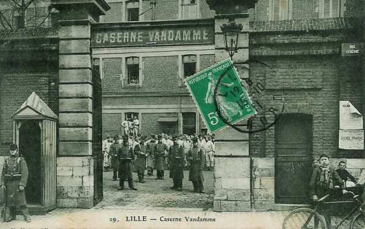

# Parcours du 43e R.I. (Lille)

En 1914, le régiment fait partie de la 1e brigade (général de Fonclare), 1e division (général Gallet), 1e C.A. (général Franchet d’Esperey). A la mobilisation, il est commandé par le colonel Proye.

_Lille - caserne Vandamme_
_Collection privée_

### 5 août :

Les trois bataillons embarquent à La Madeleine, gare de marchandises et débarquent à Aubenton.

### 6 - 9 août :

Cantonnement à Aubenton, Beaumé et Leuze.

### 10 août :

Le régiment se porte sur la Meuse via Aubenton, Logny, Hannappes, Bossus-lès-Rumigny, Fontenelle, Antheny, Foulzy, Girondelle, Marby, Blombay. Il cantonne à Harcy et Lonny. La marche a été pénible en raison des fortes chaleurs.

### 11 août :

Le régiment quitte ses cantonnements pour aller occuper Renwez et Montcornet.

### 12 août :

Mêmes cantonnements.

### 13 août :

A 0h30 arrive l’ordre de départ : le C.A. se porte vers le nord, via Les Mazures, Revin, Fumay, Haybes. La Meuse est franchie au pont suspendu de Revin et le cantonnement a lieu à Fépin.

### 14 août :

Le régiment poursuit sa route vers la vallée de la Meuse : Vireux-Molhain, Givet, La Maison Blanche où a lieu l’entrée en Belgique. Le gros du régiment cantonne à Agimont.

### 15 août :

La division marche via Soulme, Morville et Anthée. Les trains régimentaires sont réunis à Surice et conduits à Villers-en-Fagne. Le régiment reçoit l’ordre de coopérer à la défense d’Hastière et de son pont.

### 16 août :

A 06h30, les 1e et 2e bataillons sont rassemblés près du bois de Lens.

- Le 3e bataillon se trouve à la sortie d’Agimont et forme un détachement de couverture, avec une batterie d’artillerie du 15e R.A.C. et un demi escadron du 6e chasseurs à cheval.
  Un peloton du 348e R.I. tient Givet
  Une compagnie du 43e R.I.se trouve à Fumay
  Une compagnie du 43e R.I. est à Haybes.
  Une compagnie du 43e R.I. se trouve à Aubrives, Ham-sur-Meuse et Chooz.

### 17 août :

Le colonel du régiment visite Givet et donne des ordres pour une meilleure mise en défense de la ville et de son port fluvial. Une compagnie du 348e R.I. est envoyée en reconnaissance à Mesnil-Saint-Blaise et fait feu sur un groupe de cuirassiers de la Garde allemande.

Le soir, le cantonnement d’alerte est installé à Agimont.

- Le 2e bataillon est à Gérin
  Le 1e bataillon est à Hastière, avec une compagnie au sud est de Lenne et deux autres au nord-ouest de cette localité.

- Un demi-escadron de cavalerie surveille la Meuse entre Hastière et Anseremme, vers le château de Waulsort.
  Une compagnie du 348e R.I. organise le pont d’Hastière et une compagnie de mitrailleuses bat le pont.

A 10h du matin, un avion allemand atterrit en catastrophe.

### 18 août :

Les 9e et 12e compagnies débarrassent la rive droite de la Meuse des matériaux en bois qui pourraient être utilisés par les Allemands.

Le 1e bataillon a plusieurs alertes dans la journée causées par des patrouilles puis un escadron de uhlans. Les travaux de défense de la ferme de Lenne sont renforcés.

### 19 août :

Le 1e bataillon est alerté à 05h et occupe les emplacements reconnus la veille. De nombreux uhlans se trouvent sur la rive droite de la Meuse. Le 2e bataillon va cantonner à la ferme de Frumont au sud d’Onhaye.

### 20 août :

Une patrouille française vers Feschaux est reçue à coups de fusil. Elle rentre à Givet et à Agimont.

### 21 août :

Même cantonnement.

### 22 août :

La première division de réserve doit relever la 1e division d’active qui se dirige ensuite par Morville vers Ermeton-sur-Biert. Le 43e R.I. est remplacé par le 310e R.I. à Agimont.

Les 2e et 3e bataillons cantonnent à Denée, le 1e à Ermeton-sur-Biert.

A 22h parvient un ordre préparatoire prescrivant de se tenir prêt à partir de 02h le 23 août.

### 23 août :

Le 1e C.A. reçoit pour mission d’appuyer la droite du 10e C.A. établi à Bambois. La 1e division occupe les avancées de Lesves et des Six- Bras, le gros se trouvant vers la ferme de Montigny.

La 1e brigade doit tenir les points d’appui entre Lesves et Gérin (2e et 3e bataillons). Le reste de la brigade est rassemblée à Saint-Gérard,  dont elle doit assurer la défense, en liaison avec le 10e C.A.

A 08h, un groupe d’artillerie est pris à partie par une batterie allemande qui ne peut être repérée.

A 14h30, ordre est donné d’évacuer la position par échelons successifs en commençant par la droite. Quelques compagnies sont obligées de traverser des zones battues par l’artillerie allemande et subissent quelques pertes.

A 18h30,  les Allemands progressent vers la ferme de Montigny. Les derniers éléments arrivent à Bioul (2e bataillon) et Denée (1e et 3e bataillons).

A 19h30, la brigade a pour direction de retraite Denée et Ermeton-sur-Biert. Le régiment arrive à 23h à Biert-l’Abbé où il cantonne.

La journée a coûté au régiment 18 tués, 120 blessés et 79 disparus.

### 24 août :

A 0h, le régiment reçoit l’ordre de se mettre en marche à 03h vers Flavion, Rosée, Denée, Romedenne, Romerée et Matagne. Les routes sont encombrées car plusieurs éléments du 10e C.A et la 4e division belge suivent le même chemin. Le régiment cantonne à Matagne-la-Petite où il arrive à 12h30.

### 25 août :

A 02h15, le régiment se met en route et marche sur Frasnes et Couvin, par Matagne-la-Petite, Matagne-la-Grande et Fagnolle.

La division doit couvrir le passage de tout le C.A. dans le défilé de Couvin en tenant Frasnes - Mariembourg - Nismes en liaison à droite avec la 2e D.I. vers Dourbes et à gauche avec la 19e D.I. à Boussu-en-Fagne. Dès que les derniers éléments du 127e R.I. se sont écoulés, le 43e R.I. reçoit l’ordre d’aller cantonner à Regniowez où il arrive le 26 à 01h.

### 26 août :

A 07h, le régiment quitte Regniowez et suit la route de Brognon à Wattigny où il cantonne.

- Le 1e bataillon est détaché à Neuvillaux-Joûtes en liaison avec la 2e brigade
  Le 2e bataillon est détaché à Pavillon.
  Le 1e C.A. continue sur Aubenton.

### 27 août :

La 1e D.I. suit la route Wattigny, Blissy, La Fosse. Le 43e R.I. cantonne à Coutenval.

### 28 août :

A 09h, le régiment part via Dagny, Le Hocquet, Val-Saint-Pierre, Bosmont. Les trois bataillons cantonnent dans cette dernière localité.

### 29 août : bataille de Guise

La Ve armée doit déboucher au-delà de l’Oise et engager la bataille. Le 1e C.A doit se porter dans la région de Le Hérie-la-Viéville et préparer son débouché au-delà de l’Oise. Dans ce but, la 1e D.I. doit placer son gros vers la ferme de Bertaignemont et Jonqueuse.

Le mouvement s’effectue en une colonne. Les trois bataillons arrivent à hauteur de Housset et font route de La Neuville-Housset vers Landifay. Le 2e bataillon marche sur Faucouzy et Landifay ; les 1e et 3e bataillons sont dirigés sur Le Hérie-la-Viéville.

Le 2e bataillon se déploie entre Le Hérie et Landifay, en liaison avec la 37e D.I. qui marche vers Bertaignemont. Les Allemands sont signalés vers Audigny et La Désolation.

Le 43e R.I. reçoit l’ordre de tenir Le Hérie en attendant l’arrivée du 1e C.A. Pendant ce temps, le 1e bataillon du 127e R.I. gagne du terrain vers le nord et se porte à la ferme de La Bretagne, mais il doit finalement se reporter en arrière.

A 14h, comme la 1e D.I. a prescrit une offensive générale sur front Ferme Louvry - Audigny.  L’attaque de Chanlieu est ordonnée par le général de brigade. Les 1e et 2e bataillons du 43e R.I. attaquent le village en coopérant avec les 2e et 3e bataillons du 127e. L’attaque a lieu mais la progression est lente. Chanlieu est pris à 20h mais les Allemands tiennent fermement Audigny, défendu par des mitrailleuses et des fils de fer.

### 30 août :

03h : Chanlieu est bombardé par l’artillerie allemande. Ordre est donné de se replier sur Le Hérie.

A 10h, le général donne l’ordre de rallier la 1e brigade sur la hauteur entre Le Hérie-la-Viéville et Sains-Richaumont.

Entre 10h et 14h, Faucouzy est vivement attaqué. Le 43e R.I. reçoit l’ordre de se diriger vers Sons et Châtillon-lès-Sons. Il cantonne à Bois-lès-Pargny.
La journée a coûté au régiment 30 tués, 412 blessés et 132 disparus.

### 31 août :

A 02h, le régiment quitte Bois-lès-Pargny et marche par Crécy-sur-Serre, Malandry, Barenton-sur-Serre, La Maison Blanche, Montceau- le-Waast.

Le colonel Baston du 1e R.I. prend le commandement du régiment, qui cantonne à Gizy.

### 1 septembre :

A 02h, le régiment part et suit l’itinéraire Samoussy, Athies-sous-Laon, Bruyères-et-Montbérault, Monthenault, Chamouille, Neuville-sur-Ailette, Paissy. Le cantonnement s’effectue à Cuivry, Chaudardes et Meurival.

### 2 septembre :

L’armée, entièrement concentrée sur l’Aisne, doit marcher sur Dormans.

La 1e D.I. suit l’itinéraire Roman, Breuil-sur-Vesle, Vandeuil, Sergy-et-Prin, Savigny-sur-Ardres.

La cavalerie allemande est aux prises avec l’arrière-garde et le 43e R.I. reçoit l’ordre de rester tout entier aux abords nord de Faverolles, où il cantonne.

### 3 septembre :

La Ve armée doit se porter au sud de la Marne. La 1e D.I. doit franchir la rivière sur un pont d’équipage à Reuil. Elle fait mouvement par Lhery, Romigny, Lonquery, Le binson , Orquigny, Reuil et Oeuilly. La Marne passée, le régiment s’établit dans les fermes de l’Epine et à Ville-au-Bois.

### 4 septembre :

Le colonel de Fonclare du 127e R.I. prend le commandement de la brigade en remplacement du général Marjoulet qui devient commandant de la 34e D.I.

Le mouvement de retraite se poursuit, à travers la forêt d’Enghien, Mareuil-en-Brie et Beaunay.
Une attaque allemande se produit à 18h.

### 5 septembre :

La Ve armée se replie vers la Seine. Le 1e C.A. marche en deux colonnes. Le 43e R.I. passe par La Chapelle-sous-Orbais, Fromentières, Bannay, Le Thoult-Trosnay, Corfelix, Charleville, Lachy, Mœurs et Le Meix-Saint-Epoing, La Forestière. En vue de l’attaque prévue, le cantonnement est fixé à Seu, Bricot-la-Ville et Haut-d’Escardes.

### 6 septembre : début de l’offensive

Le 1e C.A ; doit prendre l’offensive dans la direction de Les Essarts-le-Vicomte, Esternay, Champguyon, Montmirail. La 1e division se rassemble à La Pimbaudière. Le 43e R.I. est en réserve de la 1e D.I. On croit un instant que les Allemands ont évacué la ligne cote 200 - château d’Esternay.

A 16h, le 3e bataillon s’avance sur Seu avec un soutien d’artillerie. Le 2e bataillon se porte vers Châtillon-sur-Morin. Le régiment a perdu en une journée 33 blessés et 10 disparus.

### 7 septembre :

L’offensive se poursuit. Le 1e C.A. attaque la ligne cote 200 - Château d’Esternay ; la 1e D.I. attaque le secteur cote 200 - Retourneloup.

A 9h50, les Allemands abandonnent la position de la cote 200 - Retourneloup. Le 43e R.I. doit se porter en avant et avance vers Retourneloup, Esternay, Champguyon et Rieux, où il cantonne.

### 8 septembre :

Le 43e R.I. doit être rassemblé pour 07h entre Fontaine-Armée et Maclaunay. A 7h55, le régiment atteint cette dernière localité. Le régiment a perdu au cours de la journée 4 tués, 88 blessés et 17 disparus.

### 9 septembre :

Les Allemands sont en pleine retraite. Le 1e C.A franchit le Petit Morin et se porte vers la région de Vauchamps.

La 1e division suit l’itinéraire Vauchamps, route d’Orbais, Margny, Verdon, Le Breuil. Les Allemands occupent toujours Margny. Le 43e R.I. se porte vers Les Chaffours, Les Fourneaux et stationne dans cette dernière localité.

### 10 septembre :

Le 1e C.A ; doit amener ses avant-gardes au nord du Surmelin. Le 43e R.I. suit l’itinéraire Margny, Buisson-Fleuret, ferme des Thomassets, La Ville-sous-Orbais.

A 8h, le 1e C.A. reçoit pour mission de s’emparer des ponts de Dormans et de Verneuil, puis de pousser au nord de la Marne. La 1e division marche par Le Breuil, La chapelle-Monthodon, Chavenay et Dormans. Le 43e R.I. stationne à Sailly et Courthézy.

### 11 septembre :

L’armée continue son mouvement vers le nord. Le gros de la 1e division passe sur un pont d’équipage établi à Vincelles. Le soir, il cantonne à Anthenay.

### 12 septembre :

L’offensive vers le nord se poursuit pour se porter entre la Vesle et l’Aisne. Le 1e C.A fait route vers Dommange et Pargny-lès-Reims. La 1e D.I. suit l’itinéraire Olizy-et-Violaine, Romigny, Chambrecy, Bligny, Aubilly, Clairizet. Le 1e bataillon se porte sur Tinqueux.

### 13 septembre :

Le 1e C.A ; doit se porter vers Roizy mais doit attendre pour franchir le canal de l’Aisne à la Marne que le 3e C.A. se soit emparé du fort de Brimont, et que le 10e C.A. ait pris celui de Berru.

La 1e brigade doit tenir les passages de la Vesle. A 04h, le 43e R.I. se porte à Saint-Brice-Courcelles, en détachant le 2e bataillon à La Neuvillette.

A 16h, la brigade reçoit l’ordre d’appuyer l’attaque du 3e C.A. en prenant comme objectif Courcy. La localité est prise dans le cours de la nuit. Le régiment cantonne ensuite à La Neuvillette.

### 14 septembre :

Le 1e C.A. reprend l’attaque vers Bourgogne et Fresnes-lès-Reims. Le 43e R.I. doit occuper la partie ouest du bois de Soulains.

A 14h, le régiment ne peut déboucher de Cavalier de Courcy. L’artillerie française essaie de lui préparer des voies d’accès.

Vers 16h15, le 43e R.I. doit coopérer à l’attaque du château de Brimont et à 21h, il vient cantonner à La Neuvillette.

### 15 septembre :

La 1e D.I. doit attaquer les hauteurs de Brimont par l’est.

- A 12h, avec l’appui de l’artillerie,
  Le 2e bataillon se dirige vers le bois de Soulains
  Le 1e bataillon se dirige à  l’est de Cavaliers de Courcy
  Le 3e bataillon est en réserve.

A 14h35, les Allemands contre-attaquent vers le bois de Soulains. Comme la contre-attaque progresse, ordre est donné de tenir à tous prix la ligne Courcy - partie ouest du bois de Soulains - Betheny.
La contre-attaque allemande est finalement arrêtée par l’artillerie française.

Le soir, le 43e R.I. est en réserve au sud de La Neuvillette.

### 16 septembre :

L’offensive est reprise. Le 43e R.I. doit tenir coûte que coûte la ligne Le Port - Neuvillette - ferme Pierquin - voie ferrée vers Reims.

A 17h, les Allemands contre-attaquent vers Betheny - Bois de Soulains.

A 21h15, le 1e C.A. reçoit l’ordre de se porter dans la région Jonchery - Ventelay pour être prêt à agir offensivement au-delà de l’Aisne. L’itinéraire suivi est : Courcelles, Saint-Brice, route de Rouen - Reims.

### 17 septembre :

Le 43e R.I. doit quitter Ventelay. Ordre lui est donné d’assurer le débouché du 1e C.A. au nord de l’Aisne. Une tête de pont est placée en avant vers Pontavert. Le gros de la 1e D.I. est rassemblé au nord de Bouffignereux.

A 22h, les colonnes d’assaut partent baïonnette au canon mais sont soumis à des feux de front et de flanc et se heurtent à des fils de fer barbelés. Un repli s’opère vers la ferme du Choléra. La division doit finalement se replier sur Berry-au-Bac après une seconde tentative infructueuse.

### 18 septembre :

La 1e D.I. est rassemblée entre Roucy et Concevreux et reste toute la journée en position d’attente. Le soir, elle stationne à Roucy, Muizon et Meurival.

Il y aura peu de mouvements par la suite, car c’est le début de la guerre de tranchées.