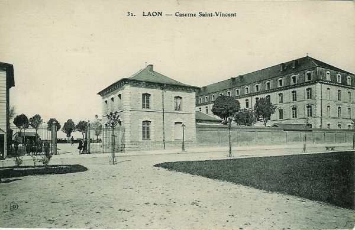

# Parcours du 45e R.I. (Laon)

En 1914, le régiment fait partie de la région militaire d’Amiens (Aisne sauf Soissons, Oise, Somme) A la mobilisation, il est désigné comme soutien du corps de cavalerie Sordet, ce qui explique son transport en autobus. Il est commandé par le lieutenant-colonel Grumbach.

_Laon : caserne Saint-Vincent_
_Collection privée_

### 31 juillet :

Le 45e R.I. reçoit le télégramme de couverture à Laon.

### 1e août :

Les différents éléments du régiment s’embarquent au quai militaire de Chambry :

- La garnison de Laon
  La garnison de Sissonne
  La garnison d’Hirson.

Débarquement à Mézières et à Sedan. La 11e compagnie reçoit pour mission de garder trois ponts au nord de la route Donchery - Sedan et la 12e compagnie les ponts au sud de cette localité.

A 11h15, le général Mangin donne à la 8e brigade l’ordre de cantonnement dans la région de Liart. Le 45e cantonne à Mézières, Mohon, Lumes, Mouzon-sur-Meuse.

La 8e brigade doit garder les ponts de Givet inclus à Sedan inclus.

### 2-3 août :

Même cantonnements.

### 4 août :

Le télégramme suivant parvient au colonel du régiment :
« Ambassadeur d’Allemagne a réclamé hier ses passeports et a quitté Paris après avoir déclaré la guerre à la France. Mobilisation flotte et armée anglaises aura lieu à minuit. »

### 5 août :

Le général de brigade donne l’ordre n° 31 :
« La situation est modifiée vis-à-vis de la Belgique. Le survol d’avions est autorisé. Les reconnaissances de cavalerie peuvent passer la frontière (maximum un escadron). »

### 6 août :

L’ordre d’opérations n° 1 parvient :
« La 8e brigade d’infanterie entrera en Belgique aujourd’hui avec le corps de cavalerie Sordet, avant-garde des armées françaises. »

Le 2e bataillon se rend à son cantonnement de Vresse-sur-Semois où il arrive vers 16h. Le 1e bataillon embarque dans un convoi automobile constitué par 40 autobus de la ville de Paris. Il débarque à Alle et cantonne dans cette localité et à Rochehaut. Le train régimentaire se rend par la route Vrigné-aux-Bois - Saint-Menges - Alle.
La population belge réserve un accueil enthousiaste aux troupes françaises.

L’ordre d’opérations n° 2 est communiqué :

« Demain, la 8e brigade cantonnera dans la région de Jéhonville - Ochamps. Le 2e bataillon sera transporté par Vresse, Rochehaut vers Ochamps. »

### 7 août :

Le régiment quitte ses cantonnements d’Alle, Vresse, Rochehaut, Bouillon et arrive aux cantonnements de Jéhonville, Sart, Acremont.

Le 2e bataillon est transporté en autobus à Saint-Hubert.

### 8 août :

A 05h30, départ des cantonnements de Jehonville, Sart, Acremont vers Rochefort par Maissin, Les Baraques, Wavreille.

### 9 août :

Le régiment garde ses cantonnements. Dans la journée, le Q.G. du  général Sordet s’installe à Rochefort.

### 10 août :

Même situation.

### 11 août :

Le régiment quitte Rochefort à 03h via Wavreille, Tellin, Les Baraques et marche sur Maissin. A 15h, départ de Maissin vers Paliseul.

### 12 août :

Le régiment quitte Paliseul pour Beauraing. Les sacs sont chargés dans des camions. Cantonnement à Javingue et Baronville après une étape de 40 km.

### 13 août :

Le régiment quitte ses cantonnements en convoi automobile pour aller occuper Villers-sur-Lesse et Ciergnon. Le 2e bataillon ouvre le feu sur un groupe de cavaliers allemands.

### 14 août :

Le régiment poursuit sa route vers la vallée de la Meuse : Vireux-Molhain, Givet, La Maison Blanche où a lieu l’entrée en Belgique. Le gros du régiment cantonne à Agimont.

### 15 août :

A 02h30, le régiment quitte Villers-sur-Lesse et marche via Beauraing, Wanlin, Hour, Houyet. A 06h30, il occupe les hauteurs entourant le village. Des engagements ont lieu avec des patrouilles allemandes.

A 14h, départ vers Mesnil-Saint-Blaise où le régiment est chargé en autobus. A 22h, il cantonne à Hastière.

### 16 août :

Le 45e R.I. est transporté en autobus vers Lesve via Onhaye, Falaën, Bioul, Lesve. Le régiment passe sous le commandement du 1e C.A. et est dirigé vers Bioul et Warnant.

### 17 août :

Le régiment doit assurer la défense de la rive gauche de la Meuse. Il fait partie du groupement Mangin, ayant comme secteur Anhée exclu à Rouillon exclu. Ce secteur comprend le passage important du pont d’Yvoir .

- Au 1e bataillon, deux sections de mitrailleuses occupent le pont d’Yvoir.
  Le 2e bataillon est à Warnant.
  Le 2e bataillon est à Bioul.

Dans la matinée, une reconnaissance est poussée jusqu’à Evrehailles et ne rencontre aucune infanterie allemande.

### 18 août :

Les ordres de la brigade sont :

- Pour la 4e compagnie : défendre les abords du pont d’Yvoir et du carrefour nord d’Anhée avec travaux de mise en défense.

- Pour la 4e compagnie : battre de ses feux le pont d’Yvoir. Des tranchées sont établies dans les bois de Moulins.

- Pour les 1e et 3e compagnies : rester en réserve à l’ouest du village d’Anhée.

Des renseignements fournis par l’intermédiaire du bureau de poste d’Yvoir signalent une importante cavalerie à Purnode. Une reconnaissance est envoyée vers Evrehailles.

### 19 août :

Dans la nuit du 18 au 19, une patrouille se porte sur Evrehailles. Elle est arrêtée à 500 m au nord d’Yvoir par un coup de feu tiré par une embuscade de uhlans. Au point du jour, une reconnaissance pousse jusqu’à Evrehailles, évacué par les Allemands.

### 20 août :

De nombreuses patrouilles sont envoyées sur la rive droite de la Meuse.

- Vers Bauche où l’on découvre un peloton du 2e régiment de dragons de la Garde. La patrouille fait feu, tuant un cavalier et en blessant trois autres.

- Vers Evrehailles et le secteur entre Evrehailles et Purnode.

### 21 août :

Un régiment composé des 2e et 3e bataillons du 45e R.I. plus un bataillon du 148e est mis à la disposition du général belge Michel, gouverneur de Namur. Le 1e bataillon est laissé à la garde du pont d’Yvoir. Les trois bataillons sont alertés à Bioul (2e btn.), Warnant (3e btn) et Annevoie (3e btn. du 148e R.I.)

### 22 août :

Le régiment se porte par une marche de nuit sur Namur où il arrive à 06h.

Il se met à la disposition du général Michel et se porte à l’école des cadets après avoir défilé devant le général aux accents de la marche de Sambre et Meuse.

D’après les ordres du général Lanrezac (Ve armée), le 45e R.I. doit rester à Namur assiégée pour assurer la jonction entre les IVe et Ve armées. Les autorités belges orientent trois bataillons vers le front.

- Deux sur la route de Hannut à Boninne
  Un (btn. du 148e) sur la route de Louvain, à la disposition du général Henrard.

Le déplacement de ce dernier s’effectue sous un feu violent d’artillerie, assez inefficace.

A 17h30, les 9e et 12e compagnies sont dirigées vers Cognelée et s’installent dans des tranchées. Elles attendent d’être remplacées par la section de mitrailleuses pour monter à l’assaut du château de Beauloy.

Le 3e bataillon du 45e R.I. est dirigé sur Bouge. Dès son débouché du village, il tombe sous le feu de l’artillerie allemande dont le tir est inefficace. Le bataillon est dirigé ensuite sur la route de Hannut puis à la corne sud-ouest du bois des Grandes Salles. La garnison belge de ce secteur bat en retraite. Comme les Allemands progressent vers Champion, ordre est donné de faire occuper la lisière est du bois des Grandes Salles.

### 23 août :

A 09h, la canonnade allemande recommence. Le général Henrard donne l’ordre de se replier pied à pied. Le 3e bataillon du 45e R.I. tient la ferme de Sart et les tranchées avoisinantes. La 10e compagnie est fortement éprouvée. Les 11e et 12e compagnies reçoivent l’ordre de se replier sur Saint-Servais par le ravin du ruisseau d’Arquet en contournant Namur par le nord.

Le colonel Grumbach arrive avec le bataillon Bertrand derrière la gare de Namur. La ligne de retraite est Les Trieux de Salzinne, puis Bois-de-Villers. Les troupes françaises se portent ensuite vers la ferme de Notre-Dame-Au-Bois, puis sur Bois de Villers par le chemin passant à l’ouest du fort de Saint-Héribert. Les Français se dirigent ensuite vers Bioul par le chemin de terre allant de Bois de Villers à Arbre.

Pendant ce temps, le 1e bataillon du 45e R.I. arrive à Anthée et marche avec un bataillon du 148e R.I. Il reçoit l’ordre de se porter rapidement sur Onhaye.

A 18h, les bataillons arrivent à hauteur de Gérin. Le 1e bataillon du 45e R.I. reçoit l’ordre d’appuyer le bataillon du 148e pour l’attaque sur Onhaye.

A 19h, trois compagnies débordent le village vers le nord et le sud. Les Allemands évacuent Onhaye. Les trois compagnies barricadent les lisières du village. Craignant une attaque vers le sud, le général Mangin fait placer une compagnie face à cette direction, vers la ferme de Froidmont d’où elle chasse les Allemands.

### 24 août :

Le colonel Grumbach essaie d’entrer en contact à Bioul avec la 8e brigade mais celle-ci n’est plus dans la localité et le village est dans un chaos épouvantable. Les compagnies se portent sur le château de Neffe, puis vers Maredsous. Elles traversent ensuite Maredret puis Flavion, Rosée et Franchimont. Elles cantonnent le soir à Merlemont. Le 45e retrouvera la 8e brigade à Vierves.

### 25 août :

A 02h15, le régiment se met en route et marche sur Frasnes et Couvin, par Matagne-la-Petite, Matagne-la-Grande et Fagnolle.

La division doit couvrir le passage de tout le C.A. dans le défilé de Couvin en tenant Frasnes - Mariembourg - Nismes, en liaison à droite avec la 2e D.I. vers Dourbes et à gauche avec la 19e D.I. à Boussu-en-Fagne. Dès que les derniers éléments du 127e R.I. se sont écoulés, le 45e R.I. reçoit l’ordre d’aller cantonner à Regniowez où il arrive le 26 à 01h.

Quant au 1e bataillon, ordre lui est donné à 04h de se retirer sur Anthée. Le régiment se retire ensuite sur Gochenée où il cantonne. L’affaire d’Onhaye a coûté au régiment 5 tués, 20 blessés et 13 disparus.

### 26 août :

Le 45e R.I. arrive à Rocroi à 03h et repart à 07h pour Auvillers-les-Forges.

### 27 août :

Le régiment rejoint Parfondeval où il cantonne.

### 28 août :

La 8e brigade se porte sur Montcornet par Rozoy-sur-Serre.

### 29 août : bataille de Guise

Départ de Montcornet pour La Chaussée. Un combat s’engage entre le 10e C.A. et les troupes allemandes.

Le colonel reçoit l’ordre de se porter vers la route de Marle et de marcher sur les traces de la brigade Pétain, pour attaquer les troupes allemandes qui ont franchi l’Oise. Le 45e R.I. marche en deuxième ligne entre Landifay et Le Hérie-la -Viéville.

### 30 août :

Le 3e bataillon arrive à minuit à la ferme de Bretagne, où il s’établit.

A 01h45, la brigade Sauret est refoulée et elle traverse l’emplacement occupé par le 3e bataillon qui protège sa retraite. Le bataillon se trouve sous le feu de l’artillerie allemande.

- Le 3e bataillon doit rester à la ferme de Bretagne jusqu’à midi.

- Le 2e bataillon tiendra la croupe Le Hérie-La Viéville.

- Le 1e bataillon formera un échelon de repli à la cote 150 au sud du village.

### 31 août :

En fin de journée du 30 août, le régiment marche vers Crécy-sur-Serre et défend les ponts de la Serre. Il marche ensuite sur Liesse-Notre-Dame où il cantonne vers 14h.

### 1 septembre :

Le régiment quitte Liesse pour Romain par l’itinéraire Gizy, Samoussy, Eppes, route de Reims, Festieux, Corbeny, Chevreux, Pontavert, Roucy, Ventelay, Romain. Arrivée au cantonnement à 23h après une étape de 45 km.

### 2 septembre :

Départ de Romain pour Huit-Voisins à 04h. Le régiment cantonne à Jonquery.

### 3 septembre :

Le régiment part de Jonquery à 02h pour se rendre à Corribert via Jonquery, Cuisles, Montigny, Breuil-sur-Marne.

### 4 septembre :

Le 45e R.I. se porte de Corribert vers Soisy-aux-Bois via Corribert, Montmort, Champaubert, Soisy-aux-Bois.

### 5 septembre :

Le régiment reçoit l’ordre de se tenir prêt à être embarqué en autobus pour être transporté à Provins. Embarquement à 22h30, voyage de nuit. Les 1e et 3e bataillons sont mis à la disposition du général Conneau, commandant du 2e corps de cavalerie.

### 6 septembre : début de l’offensive

- Le 1e bataillon est tenu en réserve du corps de cavalerie à Chenoise. Le 3e bataillon est envoyé au nord de la forêt de Jouy, en liaison avec l’armée anglaise.

- Le 2e bataillon est à Savigny - Saint-Hillier.

A 20h, le 1e bataillon est mis à disposition de la 8e D.C. et cantonne à Villars.

### 7 septembre :

Le bataillon Bourdieu est en soutien de la 8e D.C. et entre à Courchamp et Courtacon.

Le régiment est chargé de participer à la poursuite après la bataille de la Marne. A la tombée de la nuit, il est embarqué en autobus pour La Ferté-Gaucher.

### 8 septembre :

Les bataillons Bourdieu et Strauss arrivent à 04h à La Ferté-Gaucher. Dès 09h, les 1e et 2e bataillons sont dirigés sur Verdelot par Saint-Barthélémy. Cantonnement à Verdelot avec la 10e D.C.

### 9 septembre :

Les bataillons Bourdieu et Strauss sont embarqués en autobus pour accompagner la poursuite de cavalerie via Vieils-Maison, Chézy, Azy, Essonnes. Le cantonnement a lieu à Vaux. Les avant-postes occupent la route La Ferté-sous-Jouarre - Château-Thierry.

### 10 septembre :

Les Allemands battent en retraite. Le régiment embarque en autobus vers Oulchy-le-Château et débarque à Breny. Les mitrailleurs de cavalerie et l’auto mitrailleuse ouvrent le feu sur la queue d’un convoi à l’est d’Hartennes. A peine les deux compagnies ont-elles débouché du bois qu’elles sont prises à partie par le feu de l’artillerie et des mitrailleuses allemandes postées à l’ouest et dans Hartennes. Les compagnies doivent se replier dans les bois.

Vers 19h, une attaque de nuit est envisagée, sans l’aide de l’artillerie.

Le bataillon Bourdieu reçoit l’ordre d’attaquer les hauteurs à l’ouest d’Oulchy-le-Château mais il est rapidement repoussé sur Oulchy-la-Ville par l’artillerie allemande.

En fin de journée, le bataillon Bourdieu reçoit l’ordre de se diriger par Plessis-Huleu sur Tigny et Parcy-Tigny.  Le bataillon Marconnet bivouaque le soir sur la route d’Oulchy-le-Château à Hartennes.

### 11 septembre :

Les bataillons Marconnet et Bourdieu occupent Hartennes.

A 09h, les bataillons sont embarqués en autobus et suivent l’itinéraire Hartennes, Cramaille, Maroeuil-en-Dôle, Chéry.

Chaque bataillon est affecté à une division de cavalerie.

A 16h, l’artillerie allemande, placée sur les hauteurs de Fismes, ouvre le feu sur la 10e D.C.

### 12 septembre :

**Bataillon Bourdieu**
Le bataillon Bourdieu doit s’emparer de Fismes qui n’est occupé que par quelques isolés. Le bataillon arrive à la nuit et s’installe sur la route de Soissons.

A 09h, la première barricade sur la Vesle est enlevée. Le bataillon réussit à s’emparer du pont mais celui-ci est toujours sous le feu des allemands qui tiennent les hauteurs au nord de Fismes. Le 1e bataillon attaque les hauteurs au nord-ouest et un régiment de zouaves le nord-est. Les maisons sont prises une par une et, vers 13h, le bataillon est maître des lisières nord du village de Fismettes. Vers 13h30, les Allemands semblent reculer et l’ordre est donné de reprendre l’attaque. Les hauteurs sont prises vers 15h.

**Bataillon Marconnet**
Le bataillon reçoit l’ordre d’enlever le village de Bazoches le 11 septembre au soir. Le village est enlevé de nuit.

Ordre est donné par le commandant de la 4e division de cavalerie de se porter par Perles, Blanzy-lès-Fismes, Merval, Maizy-sur-Beaurieux, vers Corbeny.

Au moment où le bataillon sort de Bazoches, l’on aperçoit à 600 - 700 m une chaîne de tirailleurs allemands. La compagnie d’avant-garde se déploie immédiatement sous le feu allemand et subit des pertes importantes, puis l’artillerie française intervient et permet de conserver le village et le pont sur la Vesle, où va passer, dans l’après-midi, une division anglaise. Le chef de bataillon et ses hommes sont félicités par le général Abonneau.

### 13 septembre :

**1e bataillon (Bourdieu)**
Le bataillon cantonne à Fismes et reste en soutien de la 10e D.C. dont l’axe de marche est Fismes, Baslieux-lès-Fismes, Meurival, Roucy, Pontavert, Juvincourt, Amifontaine et Sissonne, où a lieu le cantonnement.

**2e bataillon (Strauss)**
Le bataillon part en autobus pour Maizy, via Pontavert, La Ville-aux-Bois et débarque à Juvincourt.

### 14 septembre :

**1e bataillon (Bourdieu)**
Le bataillon reçoit l’ordre de couvrir un nœud de routes vers Saint-Erme. Il part en autobus de Sissonne. La 1e compagnie gagne les hauteurs à l’est de Saint-Erme - Vieux-Laon, le 2e Montaigu, le 3e Goudelancourt-lès-Berrieux.

Vers 11h, les différents éléments poussés en avant sont obligés de se retirer vers Amifontaine sous le feu de l’artillerie allemande, de même que le convoi d’autobus. La retraite du convoi s’effectue par Juvincourt, La Ville-aux-Bois et aboutit à Pontavert vers 16h30.

**2e bataillon (Strauss)**
Il est en repos à Arcis-le-Ponsart.

**3e batailllon (Marconnet)**
Il part à 05h de Dammarie et marche à travers champs sur Proviseux-et-Presnoy via Prouvais. La division de cavalerie attaque Neufchâtel-sur-Aisne. Il a l’ordre de franchir l’Aisne le plus rapidement possible, et le fait à Pontavert. A 21h, le bataillon s’embarque à Roucy et fait route vers Ventelay via Fismes, Courlandon et Romain.

### 15 septembre :

Les bataillons Bourdieu et Strauss se rendent en autobus à Bouffignereux, à la disposition de la 1e D.C. Le 3e bataillon (Marconnet), débarqué à Ventelay, marche sur Roucy pour être mis à la disposition du 18e C.A., qui l’envoie en soutien au 6e R.I. à Bouffignereux.

### 16 septembre :

Les bataillons Bourdieu et Strauss sont mis à la disposition du 18e C.A. pour assurer la sécurité de Roucy au nord duquel se livre une bataille, vers Craonne, Pontavert et La Ville-aux-Bois.

Ils vont ensuite organiser une position de repli pour la 36e division engagée au chemin des Dames.

### 17 septembre :

Le 45e R.I. reçoit l’ordre de se porter en autobus à Champigny, au nord-est de Reims pour se mettre à la disposition du commandant du 3e C.A., puis l’ordre est annulé.

### 18 septembre :

Les trois bataillons du 45e R.I. sont transférés en bus par Thillois, Ormes, Pargny-lès-Reims, Romigny, Ville-en-Tardenois, Villers-Agron, Coulonges, où ils cantonnent.

### 19 septembre :

Le régiment est transporté de Coulonges à Compiègne. En raison de l’encombrement de cette ville, le cantonnement doit s’effectuer à Lacroix-Saint-Ouen.

### 20 - 21 septembre :

Le régiment est chargé de tenir le passage de l’Oise à Compiègne et Choisy-au-Bac.

### 22 septembre :

Le régiment est transporté au nord-ouest de Montdidier, tenant les débouchés de la rive droite de l’Avre, puis se met en mouvement de manière à cantonner à Bray-sur-Somme, en vue d’être à Péronne le 23 septembre et de se mettre à la disposition du commandant du C.C., le général Buisson.

A 18h, 45e R.I. s’embarque à nouveau en autobus par la route d’Amiens jusqu’à Longueau et Villers-Bretonneux. Comme il est impossible de s’y rendre, le régiment rentre à Amiens.

### 23 septembre :

Parti d’Amiens à 05h, le régiment arrive à Péronne à 10h et est mis à la disposition du général Baudemoulin, puis est envoyé à Doingt.

A 13h15, un ordre prescrit au régiment d’attaquer la corne sud du bois de Buire. La 5e D.C. attaquera Longavesne. Les bataillons Bourdieu et Strauss se dirigent vers leur objectif, soutenus par le feu d’une batterie d’artillerie mais sont accueillis par un feu violent d’artillerie lourde.

A 17h, les Allemands déclenchent une contre-attaque fortement appuyée par l’artillerie et les bataillons Bourdieu et Strauss doivent se retirer après de nombreuses pertes (26% de l’effectif). Le commandant Bourdieu est tué et remplacé par le cdt. Marlier. Il n’y a plus que huit cartouches par homme.

A 20h55, l’ordre est expédié de Péronne de ne garder que les abords de Péronne, en avant du faubourg de Bretagne. En conséquence, les bataillons Strauss et Marlier se replient.

A 23h, un officier de l’E.M. de l’armée vient apporter l’ordre de se dérober dans la direction d’Albert.

### 24 septembre :

Le régiment est rassemblé sur la route de Péronne - Cléry et se met en route via Cléry, Maurepas, Hardecourt-aux-Bois. A Hardecourt, le régiment est dirigé vers ses cantonnements d’Ovillers-la-Boisselle, La Boisselle et Thiepval.

### 25 septembre :

Le régiment repasse aux ordres du dommandant du corps de cavalerie et doit se porter sur Maricourt via Mametz, Carnoy et le Révin de Carnoy. Le général du C.C. vient de lancer deux brigades de cavalerie dans la direction de Péronne, qui ne serait pas occupée par les Allemands, mais les deux brigades se heurtent à des forces allemandes sur la route de Bapaume, vers Mont-Saint-Quentin et Bouchavesnes. Le 45e R.I. cantonne à Maricourt.

### 26 septembre :

Le 1e bataillon est à Hem, le 3e bataillon à Maricourt.
Vers 17h se produit une attaque allemande sur Maricourt en provenance de Combles.

### 27 septembre :

L’ordre d’opération de la 21e brigade comporte une offensive générale sur tout le front pour rejeter les Allemands sur la Somme, en amont de Péronne. Le 45e R.I. doit attaquer le bois de Faviers et Hardecourt. Cette offensive n’aura pas lieu et les travaux de défense sont poussés de part et d’autre pour une guerre de positions.