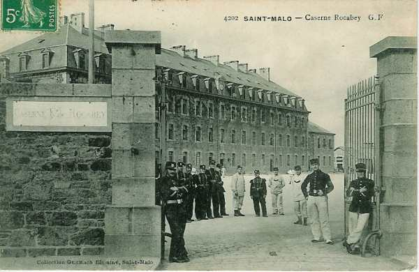

# Parcours du 47e R.I. (Saint-Malo)

En 1914, le régiment fait partie de la 40e brigade (général de Cadoudal), 20e division (général Boé) et 10e C.A. (général Defforges). Il est commandé par le colonel de Louailles.

_Saint-Malo : caserne Rocabey_
_Collection privée_

### 7 août :

Le régiment est transporté en trois échelons et débarque à Vouziers.

### 8 août :

Le 47e R.I. cantonne à Le Chesne et Les Alleux.

### 9 août :

Le régiment est concentré à Le Chesne. A 15h30, le 1e bataillon (commandant Moreau) est envoyé cantonner à Chevenges pour se trouver le lendemain à la disposition du commandant du 13e régiment de hussards à Sedan.

### 10 août :

La 40e brigade est portée en couverture du 10e C.A. sur la rive droite de la Meuse à Sedan. Les deux bataillons du 47e constituent l’avant-garde. Le 1e bataillon est détaché vers Bouillon. Les déplacements sont pénibles car la chaleur est extrême.

### 11 août :

Le régiment conserve ses positions à l’exception du 3e bataillon qui se porte à Villers-Cernay.

### 12 - 14 août :

La situation reste inchangée.

### 15 août :

Le régiment quitte ses emplacements et se porte par une marche de nuit vers Vrigné-aux-Bois, Dom-le-Mesnil, Hannogne-Saint-Martin.

### 16 août :

La 20e division marche de Sedan vers Hirson. En soirée, elle cantonne à Harcy et à Lonny.

### 17 août :

La 20e division poursuit sa marche. Le 47e R.I. cantonne à Cul-des-Sarts (Belgique).

### 18 août :

Le 47e R.I. se rend à La Forge-au-Prince et à Bruly.

### 19 août :

A 01h, le régiment reçoit l’ordre de se porter par Couvin, Mariembourg et Philippeville dans la région du sud de la Sambre. En soirée, le régiment occupe Fraire et Laneffe.

### 20 août :

Le régiment cantonne à Hanzinelle, Hanzinne, Thy-le-Baudouin et Laneffe.

### 21 août :

A 05h, le régiment reçoit l’ordre de se porter dans la région de Biesmes - Gougnies avec toute la 20e division. Départ à 07h.

Ordre est donné en cours de route de se porter par Gougnies et Sart-Eustache dans la région de Vitrival pour soutenir les postes avancés du 10e C.A. qui sont attaqués à Tamines et à Auvelais.

### 22 août :

Le 45e R.I. reçoit l’ordre de se porter à l’attaque de Falisolle et des bois à l’ouest où le 136e R.I. résiste difficilement.

Le régiment se dirige vers Vitrival et Le Roux, et le 3e bataillon s’engage immédiatement de Loctria vers les bois à l’est de Falisolle. Il parvient à déboucher des bois mais est accueilli par des rafales de schrapnells et des feux d’infanterie, surtout de mitrailleuses et subit des pertes sensibles. Les batteries et mitrailleuses allemandes sont invisibles dans les bois.

Le 1e bataillon réussit à gagner la lisière nord de Falisolle. A cet endroit, il se trouve en prise avec un feu violent d’artillerie et de mitrailleuses invisibles.

A 11h, le régiment ne peut plus progresser, n’étant pas soutenu par l’artillerie française qui ne peut battre le terrain d’attaque. Le mouvement de repli est alors ordonné. Le 1e bataillon s’établit à hauteur de la ferme Belle-Motte où il se retranche sur la crête. Le 3e bataillon se dégage difficilement et se reforme à Loctria. Il a perdu un quart de son effectif.

A 13h, l’attaque allemande se dessine sur les tranchées. Elle est accueillie par un feu violent de l’artillerie française qui la cloue à la lisière des bois, mais, bientôt, les batteries françaises qui se trouvent en terrain plat subissent le feu de l’infanterie et des mitrailleuses allemandes.

Le général Boë, commandant de la 20e division, est blessé. L’artillerie doit amener les trains et se replier sur Roux. L’infanterie évacue les tranchées. Le régiment se reforme en avant de Devant-les-Bois où il bivouaque.

### 23 août :

Le matin, le régiment est toujours en arrière-garde au nord de Sery puis il reçoit l’ordre de rejoindre la division et se reforme près d’Oret.

Le 47e R.I., formant la réserve, est à Corroy puis à la ferme des Pavillons. Peu avant la nuit, une attaque allemande se produit sur les pentes ouest d’Oret. Le régiment campe sur ses avant-postes.

### 24 août :

Au matin, ordre est reçu de retraiter. La 20e division se retire par Florennes, Saint-Aubin, Hemptinne, Jamagne, Jamiolle, Daussois. Les Allemands ne poursuivent que de très loin. Le régiment s’arrête trois heures à Daussois puis reprend sa marche dès 18h sur Chimay par Cerfontaine.

### 25 août :

Au lever du jour, le régiment est vers Chimay et il cantonne à Saint-Remy. Il repart le soir pour se rendre à Forges Philippe et Wactiaux.

### 26 août :

Le mouvement de retraite se poursuit. La 20e D.I. rentre en France par Hirson. Le 47e R.I. est vers Mondrepuis.

### 27 août :

Le 47e R.I. se retire sur la rive gauche du Thon. Le 2e bataillon est aux avant-postes à l’ouest d’Origny-en-Thiérache. Le cantonnement a lieu à Le Chaudron.

### 28 août :

Le régiment rejoint Vervins par La Bouteille. Le 10e C.A. opère alors un glissement vers l’ouest pour empêcher les Allemands de franchir l’Oise.

### 29 août : bataille de Guise

La 40e brigade se porte à 03h vers Audigny et Guise. L’avant-poste traverse Audigny puis marche vers La Désolation. Une colonne allemande, qui semble avoir été surprise dans sa marche vers Laon, prend ses dispositions de combat. Le bataillon Moreau se déploie sur la route Audigny - Guise et une fusillade très nourrie éclate. Les Allemands ont lancé les troupes sur la route de Guise à Hirson et sur la voie ferrée qui longe cette route. Le 2e bataillon prolonge la ligne du bataillon Moreaux à droite, le 3e assurant le prolongement vers la gauche.

Les Allemands débordent les positions françaises à l’est et à l’ouest et la situation devient critique. Ordre est donné de se replier. Le régiment se reforme à la lisière sud du village qu’il a ordre de contre-attaquer, avec le 2e R.I.

L’assaut à la baïonnette est déclenché et les pertes françaises sont lourdes (244 tués, 383 blessés).

Vers 13h, le régiment reçoit l’ordre de se porter en avant vers la ferme des Herlies en vue d’une action offensive vers Sains-Richaumont. L’objectif est atteint vers 18h et le régiment pénètre dans la localité. Il bivouaque sur place.

### 30 août :

A 06h, la brigade doit se rassembler au sud de Chevennes. Le 47e R.I. effectue un mouvement de glissement vers cette localité pour aller se réapprovisionner. L’approvisionnement est interrompu par des obus allemands qui s’abattent sur le convoi.

A 09h, le régiment reçoit l’ordre de se porter à La Neuville-Housset pour coopérer à la protection du repli du 10e C.A. Il se fortifie sur des positions en avant du village.

Vers 17h, les colonnes étant écoulées, il reçoit l’ordre d’aller cantonner d’abord à Erlon puis à Marcy-sous-Marle.

### 31 août :

Le régiment part vers 02h et poursuit sa marche vers le sud. Vers 06h, il arrive en vue de Vesles et y bivouaque. A 21h, il reprend sa marche.

### 1 septembre :

Le régiment marche toute la nuit via Chivres-en-Laonnois, Liesse-Notre-Dame, Marchais, Mauregny, Aubigny-en-Laonnois, Berry-au-Bac, Comicy et Cauroy-lès-Hermonville. Vers 18h, il a parcouru 50 km et il bivouaque au château de Marzilly.

### 2 septembre :

La 20e division poursuit sa marche. Le 47e R.I. part vers 06h, suit l’itinéraire Trigny, Châlon-sur-Vesle, Gueux et cantonne à Rosnay.

### 3 septembre :

La 20e D.I. continue son mouvement vers le sud par l’itinéraire Méry-Prémecy, Aubilly, Bligny, Chaumuzy, Marfaux, Hautvillers, Cumières, Mardeuil.

### 4 septembre :

La 40e brigade a pour mission de protéger le repli de la 19e D.I. Le 47e R.I. doit tenir les hauteurs de la Marne dans le secteur Vauciennes - Mardeuil avec un détachement avancé à Cumières.

Vers 08h30, l’écoulement de la 19e D.I. étant terminée, le 47e R.I. se rassemble sous la protection du 2e R.I. à hauteur de Chavot et va occuper la position de Montelon pour permettre à la 39e brigade de se replier.

Le régiment est à peine installé que des batteries allemandes qui ont traversé la Marne prennent position sur la lisière sud de la forêt d’Epernay et canonnent les troupes françaises. Le régiment doit changer de position et se défiler. Il reprend ensuite son mouvement par l’itinéraire Moslins, Maison forestière, Etoges où il bivouaque.

### 5 septembre :

La 20e D.I. continue son repli vers le sud. Il suit l’itinéraire Congy, Villevenard, marais de Saint-Gond, Oyes, Soisy-aux-Bois, Broyes et Sézanne où il cantonne. Les troupes apprennent la fin de la retraite stratégique.

### 6 septembre : début de l’offensive

L’offensive est reprise vers 03h avec la marche du 10e C.A. vers Mœurs, Soigny, Vauchamps. L’axe de marche de la 20e D.I. est Charleville - Boissy-le-Repos.

Vers 11h, le 47e R.I. atteint ses premiers objectifs : la cote 213. Le bataillon Braconnier est engagé face à Villeneuve-lès-Charleville.

A 18h, le régiment campe sur ses positions.

### 7 septembre :

La 20e D.I. doit poursuivre son offensive vers Boissy-le-Repos. La 40e brigade est en flèche et doit attendre que la 39e brigade et la 42e D.I. aient regagné du terrain.

### 8 septembre :

Le 10e C.A. poursuit son offensive vers Boissy-le-Repos, Fromentières, La Chapelle-sous-Orbais. A sa droite, la 42e D.I. est face à Bannay et, à sa gauche, le 1e C.A. face à Bergères - Montmirail - Vauchamps.

Le bataillon Moreaux reçoit l’ordre de couvrir, le long du front La Charmotte - cote 208, le gros de la brigade, qui doit occuper le plateau de La Pommerose pour poursuivre son attaque sur Le Thoult.

Le bataillon traverse Charleville et débouche du Bout-du-Val sans coup férir, mais, au débouché du Bout-du-Val, il est accueilli par des coups de canon. Les éléments progressent néanmoins jusqu’à La Pommerose, qui est remplie de blessée allemands.

Le bataillon est immobilisé à la ferme de La Pommerose par les feux de l’artillerie allemande qui balaient tout le plateau. Les Allemands évacuent ensuite Le Thoult et les Français y rentrent vers minuit.

### 9 septembre :

Toute la matinée, les pentes et le plateau sud du Petit Morin sont balayés par le feu d’artillerie et de mousqueterie. Le bataillon Moreau est bloqué dans Le Thoult et les deux autres ne peuvent progresser.

A 13h, le 2e régiment parvient à s’infiltrer sur la rive nord du Petit Morin par La Charmotte et Boissy-le-Repos. Il reçoit l’ordre de marcher sur Bannay. Deux batteries  allemandes sont repérées au nord du Petit Morin est sont détruites par l‘artillerie française. Les 2e et 47e R.I. marchent en formation ouverte sous la protection de l’artillerie qui tire sur Bannay, où les régiments arrivent vers 19h. Le régiment reçoit un renfort de 500 hommes venus des dépôts. Les 6, 7 et 8 septembre , le régiment a perdu 25 tués ou disparus et 121 blessés.

### 10 septembre :

Les Allemands sont en pleine retraite. Le 10e C.A. doit entamer la poursuite vers Colligny - Bergères-les-Vertus. Le 47e R.I. quitte Bannay à 05h30 et marche vers Champaubert puis Etoges. A 18h, il arrive à Champaubert qui n’est pas occupée. Le régiment prend alors la route Champaubert - Etoges. Cette dernière localité vient d’être évacuée par les Allemands et le régiment y entre vers 11h. L’objectif suivant est Bergères-les-Vertus. A 16h parvient l’ordre d’attaquer Bergères mais la localité vient d’être évacuée 15 minutes auparavant. Le 47e R.I. y cantonne.

### 11 septembre :

Les Allemands continuent à retraiter vers le nord. Le 47e R.I. marche par Epernay, Etrechy, Soulières, Villers-aux-Bois, Moslins, Mancy, Pierry. La marche se déroule sous une pluie diluvienne. Le régiment entre dans Epernay à 19h et cantonne dans la caserne des chasseurs à pied.

### 12 septembre :

La poursuite continue par Magenta, Dizy, Ay, Avenay-Val-d’Or, Fontaine-sur-Ay, Louvois, Craon-de-Ludes, Mally-Champagne.

A 18h, le régiment occupe Puisieux qui vient d’être évacué. Le régiment reçoit ensuite l’ordre de se porter jusque Sillery.

La 4e compagnie va reconnaître les ponts de la Vesle. Ils ne paraissent pas occupés mais sont barricadés. Ordre est donné de franchir les barricades et de tenir des têtes de pont. Les premiers madriers sont à peine déplacés que les Allemands ouvrent le feu.

### 13 septembre :

La Ve armée reçoit la mission de continuer la poursuite dans la direction nord-est. La 20e D.I. doit se porter vers la ferme de Californie (nord-ouest de Reims).

La 40e brigade a pour direction le fort de La Pompelle et comme objectif ultérieur celui de Nogent-l’Abesse.

A 04h, le bataillon Daix franchit la Vesle mais est aussitôt arrêté par des feux d’infanterie partant de tranchées allemandes sur les pentes du fort de La Pompelle et sur la route de Cambrai à Châlons-sur-Marne. Le bataillon Daix est déployé entre la Vesle et le canal de l’Aisne à la Marne. Comme il ne peut franchir le canal, il se fortifie sur la rive sud.

### 14 septembre :

Le 10e C.A. poursuit son offensive. Il est encadré à droite par la division marocaine. La 20e D.I. a l’ordre d’attaquer dès le lever du jour, après une préparation d’artillerie, le front Fort de La Pompelle - La Bertonnerie. Le régiment s’infiltre, par petites fractions, sur la rive nord du canal avec comme objectif les tranchées au sud-ouest du fort de La Pompelle. Il est aussitôt en butte à des feux extrêmement violents d’infanterie, de mitrailleuses et d’artillerie.

A 7h30, une pièce de 75 (50e R.A.C.) vient se poster près du pont du canal, à 500 m environ des tranchées allemandes. Celles-ci sont immédiatement vidées par les obus et, dès 09h, le bataillon Braconnier peut progresser jusqu’à elles, mais il ne peut aller plus loin à cause du feu provenant de la tranchée nord et des abords de l’auberge Alger.

Vers 10h, le bataillon Maison débouche également au nord du canal et les hommes se portent dans les bois à 300 m  du fort. Le bataillon Daix franchit également le pont.

### 15 septembre :

Le 47e R.I. reçoit l’ordre de renouveler son effort sur La Pompelle mais le feu allemand est violent et précis. Le bataillon Braconnier tente de gagner la crête et la lisière nord du bois de La Pompelle et l’artillerie française bombarde l’auberge Alger.

### 16 septembre :

Le commandant de bataillon Vernot, du 2e R.I.C., prend le commandement du 47e R.I. Vers 01h, une fusillade éclate. L’ordre est de conserver le terrain occupé. Un duel d’artillerie se poursuit toute la journée. Dans l’après-midi, des fractions du bataillon Daix parviennent jusqu’à la lisière nord du bois de La Pompelle.

Le 47e R.I. est relevé par le 2e.

### 17 septembre :

Le gros de la Ve armée doit reprendre l’attaque au nord de l’Aisne et le 10e C.A doit fixer les Allemands par des attaques partielles sur le front Betheny - Sillery. Il est encadré à droite par la division marocaine et à gauche par le 3e C.A. Le 10e C.A conserve sa position et à partir de ce moment, les adversaires vont peu bouger.