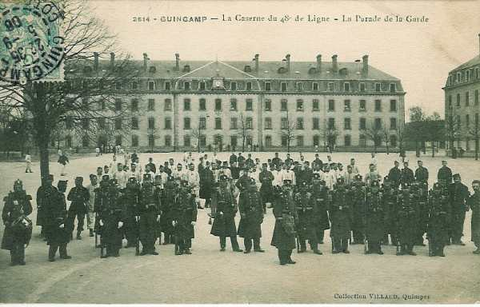

# Parcours du 48e R.I. (Guingamp)

En 1914, le régiment fait partie de la 37e brigade (général Pierson), 19e division (général Bonnier) et 10e C.A. (général Defforges). Il est commandé par le colonel de Flotte.

_Guingamp : caserne du 48e de ligne_
_Collection privée_

### 6 août :

Arrivée à Vouziers. Cantonnement à Vouziers, Chestres, Condé-lès-Vouziers.

### 7 - 9 août :

Même cantonnement.

### 10 août :

Selon l’ordre général d’opérations n° 1, le régiment quitte ses cantonnements et va s’installer à Tannay, Château de Mont-Dieu, Tuilerie, La Forge, Nouèves, Mon Idée, Le Moulineau.

### 11 août :

Même cantonnement. A 9h, un biplan allemand passe à très grande hauteur au-dessus du château de Mont-Dieu.

### 12 août :

Des avions français et allemands passent à très grande hauteur au-dessus des cantonnements. Deux uhlans ont été aperçus et le colonel envoie une escouade sur la route de Sedan à hauteur de la Maison Forestière.

### 13 août :

Départ du cantonnement à 03h et grand’ halte à Bouvellemont. Le régiment cantonne à Baalons, Bouvellemont et Jonval.

### 14 août :

La situation reste inchangée.

### 15 août :

A 19h, le régiment se dirige, sous une pluie battante, vers ses cantonnements de Sigly et Villers-sur-le-Mont.

### 16 août :

Le régiment marche vers le nord-ouest et arrive à son cantonnement de Remilly-lès-Pothées.

### 17 août :

Conformément à l’ordre général n° 7, le régiment prend place dans la colonne et marche vers le nord-ouest, passe à Maubert-Fontaine puis franchit la frontière belge à Regniowez. Après une grand’ halte dans cette localité, il va cantonner à Rièzes.

### 18 août :

Selon l’ordre général n° 9, le régiment se rend à Aublain, Lompret, Vaulx-lez-Chimay et Baileux avec le 71e R.I.

### 19 août :

Le régiment marche en tête de division par Frasnes, Mariembourg, Philippeville, Florennes et cantonne à Stave et à Oret.

### 20 août :

Le 48e R.I. se dirige vers Saint-Gérard par Biesmerée. Une mitrailleuse ouvre le feu sur un avion allemand pendant une marche sur la grand’ route de Graux. Ce sont les premiers coups de feu de la campagne pour le régiment.

### 21 août :

Le régiment poursuit dans la direction nord-ouest, se rassemble en positions d’attente à Haut-Vent puis arrive à Fosse à 07h. A 17h, il quitte Fosse pour se porter vers le nord-ouest. Le 3e bataillon doit s’établir aux avant-postes sur le plateau d’Arsimont.

La 9e compagnie attaque vers Ham-sur-Sambre, puis elle se replie au sud du village Les 1e et 2e bataillons sont ramenée au bivouac à 1 km au nord de Fosse.

### 22 août :

Le régiment reçoit l’ordre de se porter sur les bords de la Sambre pour s’opposer au passage des troupes allemandes et attaquer Arsimont. Il constitue la droite de la 37e brigade et se porte à l’est de la localité.

Les positions allemandes sont solidement défendues par des retranchements garnis de mitrailleuses et de tirailleurs. Le colonel de Flotte est tué lors des opérations.

Vers 11h, le 48e R.I. parvient jusqu’aux charbonnages qui longent la rive droite de la Sambre mais subit de nombreuses pertes et ne peut déboucher vers la rivière.

A 17h, le régiment reçoit ordre de se replier par Fosse sur Saint-Gérard. Le commandant Edou reçoit le commandement du régiment, qui a perdu 15 tués, 466 blessés et 141 disparus.

### 23 août :

Le régiment marche dès 04h30 vers Graux et Ermeton. La 19e division se rassemble à Furnaux et se met en état de défense. Le 48e R.I. occupe Furnaux toute la journée. Les obus allemands tombent à 300 m du bois mais l’infanterie n’apparaît pas. A 21h, le régiment reçoit l’ordre d’abandonner ses positions.

La 19e division marche sur Biesmerée. Le 48e R.I. occupe la crête de Biesmerée et Stave.

### 24 août :

A 04h, le régiment quitte le bivouac et se porte par Stave sur Florennes qu’il traverse à 07h. A 13h, il arrive à Philippeville qu’il organise en creusant des tranchées.

A 20h, le régiment part pour Mariembourg.

### 25 août :

A 02h, le régiment passe à Couvin et arrive à 1 km de Pesches. A 17h, le régiment part pour le sud-ouest.

### 26 août :

La frontière française est franchie à Forge-Philippe et le cantonnement a lieu à Blissy-les-Vallées.

### 27 août :

Il pleut abondamment. A 08h30, la 19e division se porte dans la direction de Vervins par Bucilly. Le régiment cantonne dans cette dernière localité, Les Epinettes, Chêne-Bourdon.

### 28 août :

Le régiment marche vers l’ouest et se porte à 1 km de Landouzy, puis se dirige sur Vervins qu’il traverse à 16h. Il cantonne à Cambron, Saint-Pierre et Lanneux-du-Gard.

### 29 août : bataille de Guise

Le régiment marche vers l’ouest par Voulpaix, Les Bouleaux. Après passage aux Bouleaux, il reçoit l’ordre d’attaquer et de marcher sur Colonfay. Le régiment se déploie. Le 3e bataillon vient appuyer la première ligne qui est près des tranchées allemandes.

La droite de la brigade fléchit et les munitions commencent à manquer. Le mouvement de retraite s’accentue. Une deuxième position, appuyée par des mitrailleuses, est prise sur la route de Sains, face au nord.

Le général Bonnier, commandant de division, est blessé par un éclat d’obus. Vers 13h, les fractions éparses du régiment sont rassemblées à Sains et reportées sur les crêtes au nord de Chevennes.

A 16h, les fractions du régiment sont recueillies à La Neuville-Housset.

### 30 août :

La canonnade reprend. Le régiment occupe ses positions face au nord et au nord-ouest. Le mouvement de repli s’effectue lentement. A 17h, le régiment traverse Marcy-sous-Marle puis Erlon. Arrivée au cantonnement de Voyenne à 18h.

Dans les journées du 29 et 30 août, le régiment a perdu 9 tués, 447 blessés et 36 disparus.

### 31 août :

Le régiment marche avec la colonne de division vers le sud-est. Il arrive à son cantonnement de Goudelancourt-les-Pierreponts mais doit en repartir à 21h50.

### 1 septembre :

La marche continue toute la nuit via Sissonne, Berrieux, Berry-au-Bac, Villers-Franqueux.

### 2 septembre :

Le régiment rejoint Vrigny où il cantonne.

### 3 septembre :

Le régiment se dirige vers la Marne via Nanteuil. Il cantonne à Cumières près d’Epernay et y reçoit un renfort de 548 hommes.

### 4 septembre :

Le mouvement vers le sud se poursuit jusqu’au cantonnement de Joches (15h).

### 5 septembre :

A 02h, départ du cantonnement, toujours vers le sud. Cantonnement à Le Meix-Saint-Epoing, Launat et Saudoy.

### 6 septembre : début de l’offensive

Le 48e R.I. passe toute la journée comme réserve de la 37e brigade, le 1e bataillon aux Essarts, la 3e compagnie à Sézanne pour garder le Q.G. du C.A.

### 7 septembre :

L’attaque reprend au lever du jour. A 14h, le régiment se porte au nord par Gault-la-Forêt. Le 3e bataillon passe par la gare de l’arrêt de Champguyon et remonte la voie ferrée jusqu’à la sortie de la forêt. Il occupe Jouy que les Allemands ont évacué. Le 1e bataillon se porte à droite de la lisière de la forêt de Gault et le 2e bataillon au carrefour de l’Etoile. Le cantonnement a lieu à Jouy.

### 8 septembre :

Le 48e R.I. se remet en marche et passe à Le Recoude, remonte au nord-ouest vers les crêtes sud du Petit Morin, pour cantonner à Boissy-le-Repos. La 19e division se dirige sur Janvillers par Fontaine-au-Bron.

### 9 septembre :

Le Petit Morin est traversé à Boissy-le-Repos. La 19e division se dirige vers Janvillers par Fontaine-au-Bron.

Le 3e bataillon est envoyé en flanc-garde à la ferme de La Roquetterie qu’il occupe à 09h. Il ne peut en déboucher, les crêtes étant balayées par des feux de mitrailleuses.

Le régiment reçoit l’ordre de se porter par La Marlière et les bois de Fromentières sur la route nationale de Montmirail à Champaubert. Le bivouac a lieu près des Déserts.

### 10 septembre :

Le 48e R.I. quitte ses emplacements et se rassemble à 1 km au nord de Champaubert. Il reçoit l’ordre de se reporter sur Congy.

### 11 septembre :

Départ de Congy. La colonne passe par Etoges et Saint-Martin d’Ablois. En fin de marche, le régiment arrive à son cantonnement à Port-à-Binson et Mareuil-le-Port.

### 12 septembre :

Le régiment prend place dans la colonne de division et passe la Marne sur le pont du génie de Damery. Il cantonne à Chamery.

### 13 septembre :

Le 48e R.I. marche vers Villers-aux-Nœuds et Champfleury. A 9h30, il arrive à hauteur du village de Trois-Puits, où il cantonne.

### 14 septembre :

Le régiment se dirige vers la ferme des Commelles, puis vers Prunay, en laissant à droite le village de Vezenay. Il arrive à 07h30 à la route de Villey à Châlons-sur-Marne. Les 1e et 3e bataillons se dirigent vers Prunay où pleuvent les obus allemands. Le commandant Edou, chef du régiment, est tué. Il est remplacé par le commandant Bouchaud.

### 15 septembre :

La 37e brigade doit attaquer la lisière sud du bois du désert. Les hommes sont arrêtés par les tirs de l’artillerie allemande et creusent des abris. L’artillerie française tire à son tour sur les tranchées allemandes mais ne peut atteindre leurs batteries, n’ayant pas d’artillerie lourde. Force est de se contenter d’occuper le terrain.

### 16 septembre :

Le régiment reçoit l’ordre de se rendre à Montbré. Dans les journées des 14, 15 et 16 août, il a subi des pertes de 19 tués, 142 blessés et 9 disparus.

### 17 septembre :

Arrivée à Montbray. Le régiment bivouaque au sud de la route d’Epernay.

### 18 septembre :

Le régiment reçoit l’ordre de se diriger dans la direction de Fismes par Champfleury et Reims, puis à Maco, pour relever le 129e R.I. dans ses tranchées à Saint-Thierry. Commence alors une guerre de positions.